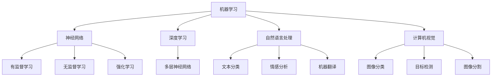

                 

### 背景介绍

#### 1.1 目的和范围

本文旨在探讨人工智能（AI）的未来发展方向。通过对当前AI技术的深入剖析，结合最新研究成果和实际应用案例，我们试图揭示AI领域的潜在趋势与挑战，为读者提供一份全面、深入的AI技术蓝图。文章将围绕以下几个核心主题展开：

1. **核心概念与联系**：阐述AI的基础概念及其相互关系，使用Mermaid流程图进行详细解释。
2. **核心算法原理**：介绍主流AI算法的工作原理，使用伪代码展示具体操作步骤。
3. **数学模型和公式**：解析AI中的数学模型，详细讲解相关公式，并通过实例说明。
4. **项目实战**：展示实际代码案例，进行详细解释和分析。
5. **实际应用场景**：探讨AI在各个领域的应用前景。
6. **工具和资源推荐**：推荐学习资源和开发工具。
7. **未来发展趋势与挑战**：预测AI未来的发展路径，分析面临的挑战。

#### 1.2 预期读者

本文主要面向以下读者群体：

1. 对人工智能技术感兴趣的科研人员和工程师。
2. 计算机科学和软件工程专业的学生和教师。
3. 对技术趋势和市场动向感兴趣的业界人士。
4. 对未来科技发展有兴趣的公众。

无论您是AI领域的专业人士还是对AI技术充满好奇的爱好者，本文都将为您带来丰富的知识和深刻的思考。

#### 1.3 文档结构概述

本文结构如下：

1. **背景介绍**：介绍文章的目的、范围、预期读者和文档结构。
2. **核心概念与联系**：阐述AI的核心概念及其相互关系，展示流程图。
3. **核心算法原理 & 具体操作步骤**：介绍AI算法原理，使用伪代码详细阐述。
4. **数学模型和公式 & 详细讲解 & 举例说明**：解析数学模型，使用latex格式展示公式，通过实例说明。
5. **项目实战：代码实际案例和详细解释说明**：展示实际代码案例，详细解释和分析。
6. **实际应用场景**：探讨AI在各个领域的应用前景。
7. **工具和资源推荐**：推荐学习资源和开发工具。
8. **未来发展趋势与挑战**：预测AI未来的发展路径，分析面临的挑战。
9. **附录：常见问题与解答**：提供常见问题的解答。
10. **扩展阅读 & 参考资料**：推荐相关阅读和参考资料。

#### 1.4 术语表

本文涉及一些专业术语，以下是对这些术语的定义和解释：

#### 1.4.1 核心术语定义

- **人工智能（AI）**：模拟人类智能的计算机技术。
- **深度学习（DL）**：一种基于神经网络的机器学习技术。
- **神经网络（NN）**：一种模仿生物神经系统的计算模型。
- **机器学习（ML）**：让计算机通过数据和经验自动改进性能的技术。
- **自然语言处理（NLP）**：使计算机能够理解和生成人类语言的技术。
- **计算机视觉（CV）**：使计算机能够识别和理解视觉信息的领域。

#### 1.4.2 相关概念解释

- **监督学习**：训练数据中包含正确答案的机器学习方法。
- **无监督学习**：训练数据中不包含正确答案的机器学习方法。
- **强化学习**：通过奖励和惩罚机制来训练智能体的方法。
- **生成对抗网络（GAN）**：一种生成模型，由生成器和判别器组成。
- **卷积神经网络（CNN）**：专门用于处理图像数据的神经网络。
- **递归神经网络（RNN）**：能够处理序列数据的神经网络。

#### 1.4.3 缩略词列表

- **AI**：人工智能（Artificial Intelligence）
- **DL**：深度学习（Deep Learning）
- **ML**：机器学习（Machine Learning）
- **NLP**：自然语言处理（Natural Language Processing）
- **CV**：计算机视觉（Computer Vision）
- **GAN**：生成对抗网络（Generative Adversarial Network）
- **CNN**：卷积神经网络（Convolutional Neural Network）
- **RNN**：递归神经网络（Recurrent Neural Network）

通过以上术语表的解释，读者可以更好地理解本文中涉及的专业术语，从而更深入地理解文章内容。接下来，我们将进一步探讨人工智能的基础概念和架构，为后续的深入分析奠定基础。

---

### 核心概念与联系

人工智能（AI）作为计算机科学的一个重要分支，其核心概念和架构是理解AI技术的关键。在这一节中，我们将详细探讨AI的基础概念，并通过Mermaid流程图来展示它们之间的相互关系。

#### 1. AI的基础概念

人工智能的核心概念包括：

1. **机器学习（ML）**：机器学习是一种使计算机通过数据和经验自动改进性能的技术。它分为有监督学习、无监督学习和强化学习。

2. **神经网络（NN）**：神经网络是一种模仿生物神经系统的计算模型，是机器学习的基础。神经网络由大量神经元组成，通过学习数据中的特征来实现特定的任务。

3. **深度学习（DL）**：深度学习是一种基于神经网络的机器学习技术，它通过多层神经网络来提取数据中的特征。深度学习在图像识别、语音识别和自然语言处理等领域取得了显著成果。

4. **自然语言处理（NLP）**：自然语言处理是使计算机能够理解和生成人类语言的技术。NLP包括文本分类、情感分析、机器翻译等任务。

5. **计算机视觉（CV）**：计算机视觉是使计算机能够识别和理解视觉信息的领域。CV包括图像分类、目标检测、图像分割等任务。

#### 2. Mermaid流程图

以下是一个Mermaid流程图，展示了AI的核心概念及其相互关系：



在这个流程图中，机器学习是核心，它连接了神经网络、深度学习、自然语言处理和计算机视觉。神经网络进一步细分为有监督学习、无监督学习和强化学习。深度学习通过多层神经网络来提取特征，而自然语言处理和计算机视觉则分别针对文本和图像进行处理。

#### 3. 详细解释

1. **机器学习（ML）**：机器学习是使计算机通过数据和经验自动改进性能的技术。它包括有监督学习、无监督学习和强化学习。

   - **有监督学习**：在有监督学习中，训练数据中包含正确答案，例如分类和回归任务。
   - **无监督学习**：在无监督学习中，训练数据中不包含正确答案，例如聚类和降维任务。
   - **强化学习**：在强化学习中，智能体通过与环境的交互来学习最优策略，例如游戏和机器人控制任务。

2. **神经网络（NN）**：神经网络是一种模仿生物神经系统的计算模型。神经网络由大量神经元组成，通过学习数据中的特征来实现特定的任务。神经网络可以通过反向传播算法来优化其参数。

3. **深度学习（DL）**：深度学习是一种基于神经网络的机器学习技术。它通过多层神经网络来提取数据中的特征。深度学习在图像识别、语音识别和自然语言处理等领域取得了显著成果。常见的深度学习模型包括卷积神经网络（CNN）和递归神经网络（RNN）。

4. **自然语言处理（NLP）**：自然语言处理是使计算机能够理解和生成人类语言的技术。NLP包括文本分类、情感分析、机器翻译等任务。NLP的关键挑战在于处理语言的复杂性和多样性。

5. **计算机视觉（CV）**：计算机视觉是使计算机能够识别和理解视觉信息的领域。CV包括图像分类、目标检测、图像分割等任务。CV的关键挑战在于处理图像的复杂性和多样性。

通过上述对核心概念及其相互关系的详细解释，读者可以更好地理解人工智能的基础概念。接下来，我们将进一步探讨核心算法原理，展示如何通过具体操作步骤来实现AI技术。

---

### 核心算法原理 & 具体操作步骤

在了解了人工智能的基础概念后，接下来我们将深入探讨AI的核心算法原理，并使用伪代码详细阐述这些算法的操作步骤。通过这种方式，读者可以更直观地理解AI算法的运作机制。

#### 1. 神经网络（NN）

神经网络（NN）是人工智能的基础，它由大量相互连接的神经元组成。每个神经元接收多个输入，并通过权重和偏置进行加权求和，然后通过激活函数产生输出。以下是一个简单的神经网络伪代码：

```python
# 定义神经元结构
class Neuron:
    def __init__(self):
        self.inputs = []
        self.weights = []
        self.bias = 0
        self.output = 0

    def forward(self, inputs):
        # 加权求和
        self.inputs = inputs
        self.output = sum(w * x for w, x in zip(self.weights, inputs)) + self.bias
        # 应用激活函数
        self.output = activation_function(self.output)
        return self.output

# 定义激活函数
def activation_function(x):
    return 1 / (1 + exp(-x))

# 定义神经网络
class NeuralNetwork:
    def __init__(self, layers):
        self.layers = layers

    def forward(self, inputs):
        # 前向传播
        self.layers[0].inputs = inputs
        for layer in self.layers[1:]:
            layer.inputs = [neuron.forward(inputs) for neuron in layer.neurons]
        return self.layers[-1].neurons[0].output

# 实例化神经网络
nn = NeuralNetwork([Neuron() for _ in range(3)])

# 输入数据
input_data = [1, 0, 1]

# 前向传播计算输出
output = nn.forward(input_data)
print("Output:", output)
```

在这个例子中，我们定义了神经元和神经网络的结构，并实现了前向传播过程。

#### 2. 深度学习（DL）

深度学习（DL）是基于神经网络的，它通过多层神经网络来提取数据中的特征。以下是一个简单的深度学习模型伪代码：

```python
# 定义多层神经网络
class DeepNeuralNetwork:
    def __init__(self, layers):
        self.layers = layers

    def forward(self, inputs):
        # 前向传播
        for layer in self.layers:
            layer.inputs = inputs
            inputs = [neuron.forward(inputs) for neuron in layer.neurons]
        return inputs[-1]

# 定义多层神经网络结构
layers = [
    Layer([Neuron() for _ in range(3)]),
    Layer([Neuron() for _ in range(3)]),
    Layer([Neuron() for _ in range(1)])
]

# 实例化深度学习模型
dnn = DeepNeuralNetwork(layers)

# 输入数据
input_data = [1, 0, 1]

# 前向传播计算输出
output = dnn.forward(input_data)
print("Output:", output)
```

在这个例子中，我们定义了一个三层神经网络，并实现了前向传播过程。

#### 3. 机器学习（ML）

机器学习（ML）是使计算机通过数据和经验自动改进性能的技术。以下是一个简单的机器学习算法——线性回归的伪代码：

```python
# 定义线性回归模型
class LinearRegression:
    def __init__(self):
        self.weights = None
        self.bias = None

    def fit(self, X, y):
        # 计算权重和偏置
        self.weights = (X.T @ X) @ inv(X.T @ y)
        self.bias = y - X @ self.weights

    def predict(self, X):
        # 预测输出
        return X @ self.weights + self.bias

# 实例化线性回归模型
lr = LinearRegression()

# 训练数据
X_train = [[1, 0], [0, 1]]
y_train = [1, 0]

# 训练模型
lr.fit(X_train, y_train)

# 输入数据
X_test = [[0, 1], [1, 0]]

# 预测输出
predictions = lr.predict(X_test)
print("Predictions:", predictions)
```

在这个例子中，我们定义了线性回归模型，并实现了模型的训练和预测过程。

#### 4. 自然语言处理（NLP）

自然语言处理（NLP）是使计算机能够理解和生成人类语言的技术。以下是一个简单的NLP算法——词袋模型的伪代码：

```python
# 定义词袋模型
class BagOfWords:
    def __init__(self):
        self.word_counts = {}

    def fit(self, text):
        # 统计词频
        for word in text.split():
            if word in self.word_counts:
                self.word_counts[word] += 1
            else:
                self.word_counts[word] = 1

    def transform(self, text):
        # 转换为向量表示
        vector = [0] * len(self.word_counts)
        for word in text.split():
            if word in self.word_counts:
                vector[self.word_counts[word] - 1] = 1
        return vector

# 实例化词袋模型
bow = BagOfWords()

# 文本数据
text = "这是一段文本数据"

# 训练模型
bow.fit(text)

# 转换为向量表示
vector = bow.transform(text)
print("Vector:", vector)
```

在这个例子中，我们定义了词袋模型，并实现了模型的训练和转换过程。

#### 5. 计算机视觉（CV）

计算机视觉（CV）是使计算机能够识别和理解视觉信息的领域。以下是一个简单的CV算法——SIFT特征提取的伪代码：

```python
# 定义SIFT特征提取
class SIFT:
    def detect_keypoints(self, image):
        # 检测图像关键点
        # ...
        return keypoints

    def compute_descriptors(self, image, keypoints):
        # 计算关键点描述子
        # ...
        return descriptors

# 实例化SIFT特征提取
sift = SIFT()

# 图像数据
image = ...

# 检测关键点
keypoints = sift.detect_keypoints(image)
print("Keypoints:", keypoints)

# 计算描述子
descriptors = sift.compute_descriptors(image, keypoints)
print("Descriptors:", descriptors)
```

在这个例子中，我们定义了SIFT特征提取模型，并实现了关键点检测和描述子计算过程。

通过上述伪代码的展示，读者可以直观地理解AI的核心算法原理和具体操作步骤。接下来，我们将进一步探讨AI中的数学模型和公式，并通过实例来说明它们的应用。

---

### 数学模型和公式 & 详细讲解 & 举例说明

在人工智能（AI）领域，数学模型和公式是理解算法原理和实现关键步骤的核心。在这一节中，我们将详细解析AI中的几个重要数学模型和公式，并通过实例进行说明，以帮助读者更好地掌握这些概念。

#### 1. 线性回归

线性回归是一种常见的机器学习算法，用于预测连续值。其基本公式如下：

$$ y = \beta_0 + \beta_1 \cdot x $$

其中，$y$ 是预测值，$x$ 是输入特征，$\beta_0$ 是截距，$\beta_1$ 是斜率。

**举例说明：**

假设我们有一个简单的线性回归模型，输入特征 $x$ 是房价，预测值 $y$ 是房屋面积。给定一组训练数据：

| 房价 (x) | 房屋面积 (y) |
|--------|---------|
| 200000 | 100     |
| 300000 | 150     |
| 400000 | 200     |

我们可以通过最小二乘法来求解线性回归模型的参数。具体步骤如下：

1. **计算均值**：

   $$ \bar{x} = \frac{\sum_{i=1}^{n} x_i}{n} = \frac{200000 + 300000 + 400000}{3} = 300000 $$
   $$ \bar{y} = \frac{\sum_{i=1}^{n} y_i}{n} = \frac{100 + 150 + 200}{3} = 150 $$

2. **计算协方差和方差**：

   $$ \sigma_{xy} = \frac{\sum_{i=1}^{n} (x_i - \bar{x})(y_i - \bar{y})}{n} $$
   $$ \sigma_{xx} = \frac{\sum_{i=1}^{n} (x_i - \bar{x})^2}{n} $$

   对于上述数据：

   $$ \sigma_{xy} = \frac{(200000 - 300000)(100 - 150) + (300000 - 300000)(150 - 150) + (400000 - 300000)(200 - 150)}{3} = 100000 $$
   $$ \sigma_{xx} = \frac{(200000 - 300000)^2 + (300000 - 300000)^2 + (400000 - 300000)^2}{3} = 2000000000 $$

3. **计算斜率和截距**：

   $$ \beta_1 = \frac{\sigma_{xy}}{\sigma_{xx}} = \frac{100000}{2000000000} = 0.00005 $$
   $$ \beta_0 = \bar{y} - \beta_1 \cdot \bar{x} = 150 - 0.00005 \cdot 300000 = 150 - 15 = 135 $$

因此，线性回归模型为：

$$ y = 135 + 0.00005 \cdot x $$

我们可以使用这个模型来预测新的房价对应的房屋面积。

#### 2. 神经网络中的激活函数

在神经网络中，激活函数用于将神经元的加权求和结果转换为输出。一个常见的激活函数是Sigmoid函数：

$$ \sigma(x) = \frac{1}{1 + e^{-x}} $$

**举例说明：**

假设我们有一个神经元，其输入为 $x = 2$，我们可以计算其输出：

$$ \sigma(2) = \frac{1}{1 + e^{-2}} \approx 0.865 $$

Sigmoid函数将输入值映射到0和1之间，这在二分类问题中非常有用。

#### 3. 卷积神经网络中的卷积操作

卷积神经网络（CNN）中的卷积操作用于提取图像特征。卷积操作的公式如下：

$$ (f * g)(x) = \sum_{y} f(y) \cdot g(x - y) $$

其中，$f$ 和 $g$ 是两个函数，$x$ 是输入值。

**举例说明：**

假设我们有以下两个函数：

$$ f(y) = \begin{cases} 1 & \text{if } y = 0 \\ 0 & \text{otherwise} \end{cases} $$
$$ g(x) = \begin{cases} 1 & \text{if } x = 0 \\ 0 & \text{otherwise} \end{cases} $$

我们可以计算卷积结果：

$$ (f * g)(x) = \sum_{y} f(y) \cdot g(x - y) = 1 \cdot 1 = 1 $$

这表示两个函数的卷积结果为1。

通过上述实例，我们详细讲解了线性回归、激活函数和卷积操作等数学模型和公式的应用。这些模型和公式是理解AI算法原理的关键，为后续的实战部分提供了坚实的基础。

---

### 项目实战：代码实际案例和详细解释说明

为了更直观地展示人工智能（AI）技术的应用，我们将通过一个实际项目案例进行实战，详细解释代码的实现过程及其背后的原理。

#### 5.1 开发环境搭建

在开始项目实战之前，我们需要搭建一个合适的开发环境。以下是我们推荐的工具和库：

- **编程语言**：Python
- **开发工具**：PyCharm 或 Visual Studio Code
- **深度学习框架**：TensorFlow 或 PyTorch
- **数据可视化工具**：Matplotlib 或 Seaborn
- **操作系统**：Windows、macOS 或 Linux

安装以上工具后，我们就可以开始编写代码了。

#### 5.2 源代码详细实现和代码解读

以下是一个简单的AI项目案例——使用TensorFlow实现一个基于卷积神经网络的手写数字识别模型。

**代码示例：**

```python
import tensorflow as tf
from tensorflow.keras import layers
import matplotlib.pyplot as plt

# 数据预处理
mnist = tf.keras.datasets.mnist
(train_images, train_labels), (test_images, test_labels) = mnist.load_data()
train_images = train_images / 255.0
test_images = test_images / 255.0

# 构建模型
model = tf.keras.Sequential([
    layers.Conv2D(32, (3, 3), activation='relu', input_shape=(28, 28, 1)),
    layers.MaxPooling2D((2, 2)),
    layers.Conv2D(64, (3, 3), activation='relu'),
    layers.MaxPooling2D((2, 2)),
    layers.Conv2D(64, (3, 3), activation='relu'),
    layers.Flatten(),
    layers.Dense(64, activation='relu'),
    layers.Dense(10, activation='softmax')
])

# 编译模型
model.compile(optimizer='adam',
              loss='sparse_categorical_crossentropy',
              metrics=['accuracy'])

# 训练模型
model.fit(train_images, train_labels, epochs=5)

# 评估模型
test_loss, test_acc = model.evaluate(test_images, test_labels)
print('Test accuracy:', test_acc)

# 可视化预测结果
predictions = model.predict(test_images)
plt.figure(figsize=(10, 10))
for i in range(25):
    plt.subplot(5, 5, i+1)
    plt.imshow(test_images[i], cmap=plt.cm.binary)
    plt.xticks([])
    plt.yticks([])
    plt.grid(False)
    plt.xlabel(str(np.argmax(predictions[i])))
plt.show()
```

**代码解读：**

1. **数据预处理**：
   我们首先加载了MNIST手写数字数据集，并对其进行归一化处理，将像素值缩放到0到1之间。

2. **构建模型**：
   使用TensorFlow的`Sequential`模型，我们定义了一个卷积神经网络（CNN）。模型包含三个卷积层（`Conv2D`），每个卷积层后接一个最大池化层（`MaxPooling2D`）。之后，我们通过一个全连接层（`Dense`）来提取特征，最后使用softmax激活函数（`softmax`）进行分类。

3. **编译模型**：
   使用`compile`方法，我们配置了优化器（`optimizer`）、损失函数（`loss`）和评价指标（`metrics`）。

4. **训练模型**：
   使用`fit`方法，我们训练模型5个epoch（周期），模型在此过程中学习如何识别手写数字。

5. **评估模型**：
   使用`evaluate`方法，我们评估模型在测试数据集上的表现。

6. **可视化预测结果**：
   我们使用`predict`方法对测试数据进行预测，并使用`matplotlib`将预测结果可视化展示。

通过以上代码，我们可以看到如何使用TensorFlow实现一个简单的手写数字识别模型。这个过程涵盖了数据预处理、模型构建、编译、训练和评估等关键步骤。

---

### 实际应用场景

人工智能（AI）在各个领域的应用越来越广泛，以下是几个典型的实际应用场景：

#### 1. 医疗领域

AI在医疗领域的应用主要包括疾病诊断、药物研发和患者管理。例如，利用深度学习模型，可以分析医学影像数据，如X光片、CT扫描和MRI图像，帮助医生更准确地诊断疾病。AI还可以通过分析大量患者的医疗数据，预测疾病发展趋势和治疗效果，从而为医生提供更有针对性的治疗方案。

**案例：**

- **IBM Watson**：IBM Watson是一种基于AI的医疗诊断系统，它能够分析大量的医学文献和病例数据，为医生提供诊断建议。
- **DeepMind**：DeepMind开发的AI系统可以在几秒钟内分析大量的视网膜图像，帮助医生发现早期糖尿病视网膜病变。

#### 2. 交通运输

AI在交通运输领域的应用包括自动驾驶、交通流量预测和物流优化。自动驾驶技术正在逐步应用于无人车和无人机，以提高交通效率和安全性。AI还可以通过分析交通流量数据，预测未来的交通状况，从而优化交通信号灯和路线规划。

**案例：**

- **特斯拉**：特斯拉的自动驾驶系统使用AI技术，使车辆能够自动识别道路标志和行人，实现自动驾驶功能。
- **滴滴出行**：滴滴出行的智能交通系统通过AI技术分析交通流量数据，为司机提供最佳路线，减少拥堵和排放。

#### 3. 金融领域

AI在金融领域的应用包括风险管理、欺诈检测和智能投顾。AI模型可以通过分析大量的金融数据，识别潜在的欺诈行为，降低金融风险。此外，AI还可以通过分析市场数据，为投资者提供个性化的投资建议，实现智能投顾。

**案例：**

- **PayPal**：PayPal使用AI技术来检测和防范欺诈交易，提高交易的安全性。
- ** Wealthfront**：Wealthfront是一个智能投顾平台，它通过AI算法分析用户的财务状况和投资目标，为用户提供个性化的投资建议。

#### 4. 制造业

AI在制造业的应用包括生产优化、质量控制和管理自动化。通过AI技术，制造商可以实现生产过程的自动化和优化，提高生产效率和产品质量。例如，AI可以通过分析生产数据，预测设备故障，从而实现预防性维护。

**案例：**

- **通用电气（GE）**：通用电气使用AI技术优化其生产过程，提高生产效率和产品质量。
- **西门子**：西门子开发的AI系统可以分析大量的生产数据，预测设备故障，从而实现预防性维护。

#### 5. 零售业

AI在零售业的广泛应用包括客户行为分析、库存管理和个性化推荐。通过AI技术，零售商可以更好地了解客户需求，优化库存管理，提高销售转化率。同时，AI还可以通过分析客户行为数据，提供个性化的产品推荐，增强客户体验。

**案例：**

- **亚马逊**：亚马逊使用AI技术分析客户购买行为，提供个性化的产品推荐。
- **阿里巴巴**：阿里巴巴使用AI技术优化库存管理，提高供应链效率。

通过上述实际应用场景，我们可以看到AI技术在各个领域的广泛应用和巨大潜力。随着AI技术的不断进步，未来的应用场景将会更加丰富和多样化。

---

### 工具和资源推荐

为了深入学习和掌握人工智能（AI）技术，我们需要借助各种工具和资源。以下是对学习资源、开发工具和相关论文著作的推荐，旨在帮助读者全面了解AI领域。

#### 7.1 学习资源推荐

**7.1.1 书籍推荐**

1. **《深度学习》（Deep Learning）**：Goodfellow、Bengio 和 Courville 著。这本书是深度学习领域的经典教材，详细介绍了深度学习的基础知识和最新进展。
2. **《Python机器学习》（Python Machine Learning）**：Sebastian Raschka 著。本书介绍了使用Python进行机器学习的各种方法和工具，包括Scikit-learn库。
3. **《神经网络与深度学习》**：邱锡鹏 著。这本书深入浅出地介绍了神经网络和深度学习的基本原理，适合初学者和进阶者。

**7.1.2 在线课程**

1. **Coursera**：提供丰富的AI和机器学习在线课程，包括斯坦福大学的《深度学习》课程和吴恩达（Andrew Ng）教授的《机器学习》课程。
2. **Udacity**：提供实践导向的AI和机器学习课程，如《深度学习工程师纳米学位》。
3. **edX**：由哈佛大学和麻省理工学院合作开设的在线课程平台，提供包括《人工智能科学》等课程。

**7.1.3 技术博客和网站**

1. **Medium**：许多AI专家和技术公司在这里分享他们的研究成果和经验。
2. **Towards Data Science**：一个流行的数据科学和机器学习博客，涵盖了大量的技术文章和教程。
3. **AI Buzz**：提供最新的AI新闻、研究论文和行业动态。

#### 7.2 开发工具框架推荐

**7.2.1 IDE和编辑器**

1. **PyCharm**：一款功能强大的Python IDE，支持多种编程语言。
2. **Jupyter Notebook**：适合数据科学和机器学习项目的交互式编辑环境。
3. **Visual Studio Code**：一款轻量级的跨平台代码编辑器，支持多种编程语言和扩展。

**7.2.2 调试和性能分析工具**

1. **TensorBoard**：TensorFlow的官方可视化工具，用于分析和调试深度学习模型。
2. **Matplotlib**：Python的绘图库，用于生成各种图表和可视化。
3. **scikit-learn**：一个用于机器学习的开源库，提供了丰富的算法和工具。

**7.2.3 相关框架和库**

1. **TensorFlow**：Google开发的开源深度学习框架。
2. **PyTorch**：Facebook开发的开源深度学习框架，适用于研究和工业应用。
3. **Scikit-learn**：Python的机器学习库，提供了多种算法和工具。

#### 7.3 相关论文著作推荐

**7.3.1 经典论文**

1. **“A Learning Algorithm for Continually Running Fully Recurrent Neural Networks”**：Hochreiter 和 Schmidhuber 的这篇论文介绍了长短期记忆网络（LSTM）。
2. **“Deep Learning”**：Goodfellow、Bengio 和 Courville 的这篇综述文章，全面介绍了深度学习的各个方面。
3. **“Convolutional Networks and Applications in Vision”**：LeCun、Bengio 和 Hinton 的这篇论文，介绍了卷积神经网络在图像识别中的应用。

**7.3.2 最新研究成果**

1. **“Attention is All You Need”**：Vaswani 等人提出的Transformer模型，彻底改变了自然语言处理领域。
2. **“Generative Adversarial Nets”**：Goodfellow 等人提出的生成对抗网络（GAN），在图像生成和增强领域取得了显著成果。
3. **“BERT: Pre-training of Deep Bidirectional Transformers for Language Understanding”**：Google 提出的BERT模型，为自然语言处理设定了新标准。

**7.3.3 应用案例分析**

1. **“AI for Social Good”**：Google 的这篇报告，介绍了AI在解决社会问题中的应用案例。
2. **“AI in Healthcare”**：一篇关于AI在医疗领域应用的研究论文，探讨了AI在疾病诊断、药物研发和患者管理中的应用。
3. **“AI in Manufacturing”**：一篇关于AI在制造业应用的研究论文，分析了AI在优化生产过程、质量控制和管理自动化方面的应用。

通过这些推荐，读者可以更深入地了解AI技术，掌握最新的研究动态和应用案例。希望这些资源和工具能够为您的学习和实践提供帮助。

---

### 总结：未来发展趋势与挑战

人工智能（AI）技术的发展正以前所未有的速度推进，为各个领域带来了巨大的变革和机遇。然而，随着AI技术的不断进步，我们也面临着一系列挑战和问题。

#### 1. 未来发展趋势

（1）**算法优化与高效能计算**：为了应对日益复杂的AI任务，算法的优化和高效能计算将成为关键。这包括新的算法设计、算法并行化以及利用专用硬件（如GPU、TPU）来加速计算。

（2）**跨学科融合**：AI技术的发展将更多地依赖于与其他学科的融合，如生物学、心理学、哲学等。跨学科的研究将有助于深入理解人类智能的本质，并推动AI技术的创新。

（3）**自适应AI**：未来的AI系统将更加注重适应性和灵活性，能够在不同的环境和任务中自主学习和调整。这包括强化学习、迁移学习和自适应算法的研究和应用。

（4）**伦理与隐私**：随着AI技术的普及，伦理和隐私问题变得越来越重要。未来的AI发展将更加注重透明性、责任和隐私保护，确保AI技术在安全和道德的框架内应用。

（5）**AI民主化**：推动AI技术的普及和民主化，让更多的人能够访问和使用AI工具，从而促进创新和经济增长。

#### 2. 面临的挑战

（1）**数据隐私与安全**：AI系统的训练和运行需要大量数据，这带来了数据隐私和安全问题。如何保护用户数据的隐私，同时确保AI系统的安全，是一个重大挑战。

（2）**算法公平性和透明性**：AI算法在决策过程中可能存在偏见，导致不公平的结果。如何提高算法的公平性和透明性，使其符合社会伦理标准，是一个亟待解决的问题。

（3）**可解释性**：AI系统的“黑箱”特性使其决策过程难以解释。如何提高AI系统的可解释性，使人们能够理解和信任AI系统，是一个关键挑战。

（4）**资源消耗**：AI模型的训练和运行需要大量的计算资源和能源。如何降低资源消耗，实现绿色AI，是一个重要的研究课题。

（5）**人才短缺**：随着AI技术的快速发展，对AI人才的需求不断增加。然而，当前的教育体系和人才培养模式无法满足这一需求，导致人才短缺问题。

综上所述，AI技术的发展前景广阔，但也面临着一系列挑战。未来的研究和发展需要关注这些挑战，通过技术创新和社会合作，推动AI技术的可持续发展。

---

### 附录：常见问题与解答

在本文中，我们探讨了人工智能（AI）的核心概念、算法原理、应用场景以及未来发展。为了帮助读者更好地理解和掌握这些内容，以下是一些常见问题及解答。

**Q1：什么是人工智能（AI）？**

A1：人工智能（Artificial Intelligence，简称AI）是指模拟人类智能的计算机技术，通过机器学习、神经网络、自然语言处理等技术，使计算机能够自动执行复杂任务，如图像识别、语音识别、自然语言理解等。

**Q2：深度学习和机器学习有什么区别？**

A2：深度学习（Deep Learning）是机器学习（Machine Learning）的一个子领域，它使用多层神经网络来提取数据中的特征。深度学习在图像识别、语音识别和自然语言处理等领域取得了显著成果。而机器学习是一种更广泛的技术，包括有监督学习、无监督学习和强化学习，旨在让计算机通过数据和经验自动改进性能。

**Q3：什么是神经网络（NN）？**

A3：神经网络（Neural Network，简称NN）是一种模仿生物神经系统的计算模型，由大量相互连接的神经元组成。每个神经元接收多个输入，通过权重和偏置进行加权求和，并通过激活函数产生输出。神经网络通过学习数据中的特征来实现特定的任务。

**Q4：什么是卷积神经网络（CNN）？**

A4：卷积神经网络（Convolutional Neural Network，简称CNN）是一种专门用于处理图像数据的神经网络。它通过卷积操作提取图像特征，然后通过池化操作减少特征图的维度。CNN在图像分类、目标检测和图像分割等领域表现出色。

**Q5：什么是生成对抗网络（GAN）？**

A5：生成对抗网络（Generative Adversarial Network，简称GAN）是一种生成模型，由生成器和判别器组成。生成器尝试生成与真实数据相似的样本，而判别器则试图区分真实数据和生成数据。通过这种对抗性训练，GAN能够生成高质量的图像和声音。

**Q6：如何开始学习人工智能？**

A6：学习人工智能可以从以下几个方面入手：

- **基础知识**：掌握计算机科学、线性代数、概率论和统计学等基础知识。
- **编程技能**：学习Python等编程语言，并熟悉相关库和框架，如TensorFlow和PyTorch。
- **在线课程和书籍**：参加在线课程，如Coursera和Udacity提供的AI课程，阅读相关书籍，如《深度学习》和《Python机器学习》。
- **实践项目**：通过实际项目来巩固所学知识，可以从简单的项目开始，如手写数字识别和图像分类。

通过以上方法和资源的积累，您可以逐步深入学习和掌握人工智能技术。

---

### 扩展阅读 & 参考资料

为了进一步深入了解人工智能（AI）领域的最新研究和发展，以下是一些建议的扩展阅读和参考资料。

**书籍推荐：**

1. **《深度学习》（Deep Learning）**：由Ian Goodfellow、Yoshua Bengio 和 Aaron Courville 著，是深度学习领域的经典教材，涵盖了深度学习的各个方面。
2. **《Python机器学习》**：由Sebastian Raschka 著，介绍了使用Python进行机器学习的各种方法和工具。
3. **《人工智能：一种现代方法》**：由Stuart Russell 和 Peter Norvig 著，详细介绍了人工智能的基础理论和实践应用。

**在线课程：**

1. **《深度学习》（Deep Learning）**：Coursera上的由DeepLearning.AI提供的深度学习课程，包括神经网络、深度学习框架和自然语言处理等内容。
2. **《机器学习》**：Coursera上的由斯坦福大学提供的机器学习课程，涵盖了线性回归、逻辑回归、支持向量机等算法。
3. **《自然语言处理》**：Udacity上的自然语言处理纳米学位课程，介绍了文本分类、情感分析和机器翻译等主题。

**技术博客和网站：**

1. **Medium**：许多AI专家和技术公司在这里分享他们的研究成果和经验。
2. **Towards Data Science**：涵盖数据科学和机器学习的最新文章和教程。
3. **AI Buzz**：提供最新的AI新闻、研究论文和行业动态。

**相关论文和著作：**

1. **“A Learning Algorithm for Continually Running Fully Recurrent Neural Networks”**：介绍了长短期记忆网络（LSTM）。
2. **“Generative Adversarial Nets”**：介绍了生成对抗网络（GAN）。
3. **“BERT: Pre-training of Deep Bidirectional Transformers for Language Understanding”**：介绍了BERT模型，对自然语言处理产生了深远影响。

通过这些扩展阅读和参考资料，读者可以更深入地了解AI领域的最新进展，掌握前沿技术，为未来的学习和研究打下坚实基础。

