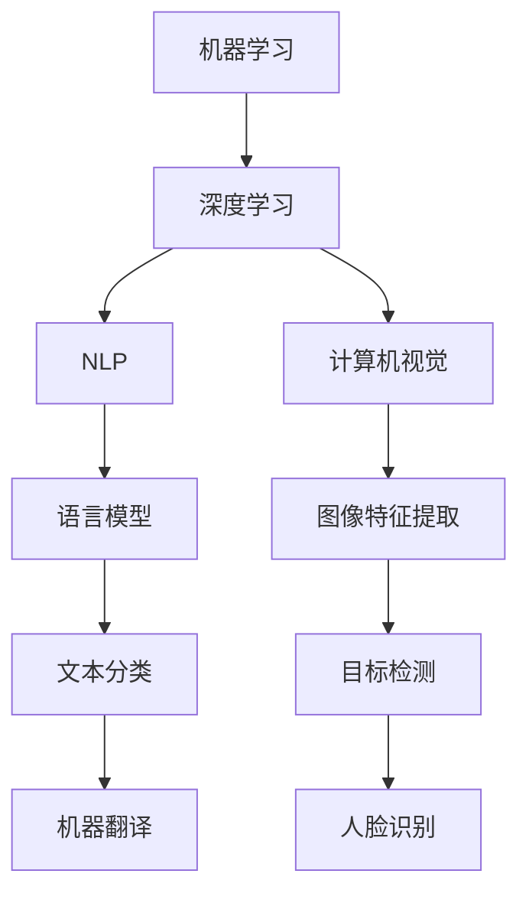

                 

# Andrej Karpathy：人工智能的未来发展机遇

> 关键词：人工智能、未来、发展、机遇、技术趋势、创新

> 摘要：本文将探讨人工智能领域未来发展的机遇，通过分析当前技术趋势、创新方向以及可能面临的挑战，旨在为读者提供对未来人工智能发展的深度理解和思考。本文将首先介绍人工智能的背景和现状，接着深入探讨其在各个行业中的应用场景，随后分析未来可能的技术突破点，最后讨论人工智能未来面临的挑战并提出一些建议。

## 1. 背景介绍

### 1.1 目的和范围

本文旨在分析人工智能（AI）的未来发展机遇，通过回顾现有技术进展、探讨新兴技术趋势，以及识别潜在的应用场景和挑战，为读者提供全面而深入的洞察。本文将重点关注以下几个主题：

- 人工智能的起源与现状
- 当前热门的AI技术趋势
- 人工智能在各行业的应用场景
- 未来可能的技术突破点
- 人工智能面临的挑战与应对策略

### 1.2 预期读者

本文适合对人工智能感兴趣的读者，包括：

- 人工智能领域的从业者
- 对AI技术有深入研究的学者和研究人员
- 对人工智能未来发展方向感兴趣的企业家和投资者
- 对新兴技术趋势关注的一般读者

### 1.3 文档结构概述

本文将按照以下结构展开：

1. **背景介绍**：回顾人工智能的起源与现状，介绍本文的目的和范围。
2. **核心概念与联系**：探讨人工智能的核心概念、原理和架构，使用Mermaid流程图展示。
3. **核心算法原理 & 具体操作步骤**：详细阐述关键算法原理和操作步骤，使用伪代码进行说明。
4. **数学模型和公式 & 详细讲解 & 举例说明**：介绍相关的数学模型和公式，并进行详细讲解和举例。
5. **项目实战：代码实际案例和详细解释说明**：通过具体案例展示代码实现和解读。
6. **实际应用场景**：分析人工智能在各个行业中的应用。
7. **工具和资源推荐**：推荐相关学习资源、开发工具和框架。
8. **总结：未来发展趋势与挑战**：讨论人工智能的未来发展趋势和面临的挑战。
9. **附录：常见问题与解答**：提供常见问题及解答。
10. **扩展阅读 & 参考资料**：提供扩展阅读资料和参考文献。

### 1.4 术语表

#### 1.4.1 核心术语定义

- **人工智能**：一种模拟人类智能行为的计算机技术。
- **机器学习**：一种利用数据训练模型，使其能够从数据中学习和改进的技术。
- **深度学习**：一种基于人工神经网络的机器学习技术。
- **自然语言处理**（NLP）：研究如何使计算机理解和生成自然语言的技术。
- **计算机视觉**：研究如何使计算机理解和解释视觉信息的领域。

#### 1.4.2 相关概念解释

- **神经网络**：一种模拟生物神经系统的计算模型。
- **卷积神经网络**（CNN）：一种用于图像处理和计算机视觉的神经网络。
- **生成对抗网络**（GAN）：一种通过对抗训练生成新数据的神经网络。
- **强化学习**：一种通过奖励信号训练智能体进行决策的学习方法。

#### 1.4.3 缩略词列表

- **AI**：人工智能（Artificial Intelligence）
- **ML**：机器学习（Machine Learning）
- **DL**：深度学习（Deep Learning）
- **NLP**：自然语言处理（Natural Language Processing）
- **CV**：计算机视觉（Computer Vision）
- **GAN**：生成对抗网络（Generative Adversarial Network）
- **RL**：强化学习（Reinforcement Learning）

## 2. 核心概念与联系

### 2.1 人工智能的核心概念与联系

人工智能的核心概念包括机器学习、深度学习、自然语言处理、计算机视觉等。这些概念之间存在着紧密的联系和相互促进的关系。

#### 2.1.1 机器学习与深度学习

机器学习是一种使计算机通过数据学习特定任务的通用方法，而深度学习是机器学习的一个子领域，它依赖于多层神经网络来学习数据中的复杂模式和特征。

- **机器学习**：核心概念是模型训练和预测。通过从数据中学习，模型可以对新数据进行分类、回归或其他类型的预测。
- **深度学习**：核心概念是多层神经网络。通过多层非线性变换，深度学习模型可以从数据中自动提取层次化的特征表示。

#### 2.1.2 自然语言处理与计算机视觉

自然语言处理和计算机视觉都是人工智能的重要分支，分别关注文本和图像的理解。

- **自然语言处理**：核心概念是语言模型和序列模型。NLP旨在使计算机理解和生成自然语言，包括文本分类、机器翻译、情感分析等任务。
- **计算机视觉**：核心概念是图像特征提取和视觉感知。CV旨在使计算机理解和解释视觉信息，包括目标检测、图像分类、人脸识别等任务。

### 2.1.3 Mermaid 流程图

下面是一个Mermaid流程图，展示了人工智能核心概念之间的联系：



该流程图简洁地展示了机器学习、深度学习、自然语言处理和计算机视觉之间的相互关系，以及它们在特定任务中的应用。

## 3. 核心算法原理 & 具体操作步骤

### 3.1 机器学习算法原理

机器学习算法的核心在于模型训练和预测。以下是一个简单的机器学习算法原理的伪代码：

```python
# 初始化模型参数
parameters = initialize_parameters()

# 训练模型
for each epoch:
    for each data point:
        # 计算预测值
        prediction = model(data_point, parameters)
        # 计算损失函数
        loss = loss_function(prediction, true_value)
        # 更新模型参数
        parameters = update_parameters(loss, parameters)

# 预测新数据
new_prediction = model(new_data_point, parameters)
```

在这个伪代码中，模型通过迭代地更新参数，逐步减小损失函数，以达到较好的预测效果。常用的损失函数包括均方误差（MSE）和交叉熵损失等。

### 3.2 深度学习算法原理

深度学习算法是在机器学习算法的基础上，通过多层神经网络来实现。以下是一个简单的深度学习算法原理的伪代码：

```python
# 初始化模型参数
parameters = initialize_parameters()

# 定义网络结构
network = create_network(parameters)

# 训练模型
for each epoch:
    for each data point:
        # 前向传播
        output = network.forward_pass(data_point)
        # 计算损失函数
        loss = loss_function(output, true_value)
        # 反向传播
        network.backward_pass(loss)
        # 更新模型参数
        parameters = network.update_parameters(parameters)

# 预测新数据
output = network.forward_pass(new_data_point)
```

在这个伪代码中，网络通过前向传播计算输出，通过反向传播更新参数。常用的深度学习模型包括卷积神经网络（CNN）、循环神经网络（RNN）和生成对抗网络（GAN）等。

### 3.3 自然语言处理算法原理

自然语言处理算法的核心是语言模型和序列模型。以下是一个简单的自然语言处理算法原理的伪代码：

```python
# 初始化语言模型
language_model = initialize_language_model()

# 训练语言模型
for each sentence:
    # 计算概率分布
    probability_distribution = language_model(sentence)
    # 计算损失函数
    loss = loss_function(probability_distribution, true_distribution)
    # 更新语言模型
    language_model = update_language_model(loss)

# 预测新句子
predicted_sentence = language_model(new_sentence)
```

在这个伪代码中，语言模型通过迭代地更新参数，逐步优化概率分布，以达到较好的预测效果。常用的自然语言处理任务包括文本分类、机器翻译、情感分析等。

### 3.4 计算机视觉算法原理

计算机视觉算法的核心是图像特征提取和视觉感知。以下是一个简单的计算机视觉算法原理的伪代码：

```python
# 初始化模型参数
parameters = initialize_parameters()

# 定义网络结构
network = create_network(parameters)

# 训练模型
for each image:
    # 前向传播
    features = network.extract_features(image)
    # 计算损失函数
    loss = loss_function(features, true_features)
    # 反向传播
    network.backward_pass(loss)
    # 更新模型参数
    parameters = network.update_parameters(parameters)

# 预测新图像
predicted_features = network.extract_features(new_image)
```

在这个伪代码中，网络通过前向传播提取图像特征，通过反向传播更新参数。常用的计算机视觉任务包括目标检测、图像分类、人脸识别等。

## 4. 数学模型和公式 & 详细讲解 & 举例说明

### 4.1 数学模型

在人工智能领域，数学模型起着至关重要的作用。以下是一些常见的数学模型和公式，以及它们的详细讲解和举例说明。

#### 4.1.1 均方误差（MSE）

均方误差（MSE）是一种衡量预测值和真实值之间差异的指标，其公式如下：

$$
MSE = \frac{1}{n}\sum_{i=1}^{n}(y_i - \hat{y}_i)^2
$$

其中，$y_i$是真实值，$\hat{y}_i$是预测值，$n$是数据点的数量。

**讲解**：MSE通过计算预测值和真实值之间差的平方，然后求平均，来衡量整体的误差。

**举例**：假设我们有三个数据点，真实值为[2, 3, 4]，预测值为[2.1, 3.1, 4.1]。计算MSE如下：

$$
MSE = \frac{1}{3}((2 - 2.1)^2 + (3 - 3.1)^2 + (4 - 4.1)^2) = 0.0333
$$

#### 4.1.2 交叉熵损失（Cross-Entropy Loss）

交叉熵损失是一种常用于分类问题的损失函数，其公式如下：

$$
CE = -\sum_{i=1}^{n} y_i \log(\hat{y}_i)
$$

其中，$y_i$是真实标签，$\hat{y}_i$是预测概率。

**讲解**：交叉熵损失衡量的是预测概率分布与真实概率分布之间的差异，真实值为1的类别的预测概率越大，交叉熵损失越小。

**举例**：假设我们有三个数据点，真实标签为[1, 0, 0]，预测概率为[0.9, 0.1, 0.1]。计算交叉熵损失如下：

$$
CE = -(1 \cdot \log(0.9) + 0 \cdot \log(0.1) + 0 \cdot \log(0.1)) = 0.1054
$$

#### 4.1.3 激活函数（Activation Function）

激活函数是神经网络中重要的组成部分，用于引入非线性特性。以下是一些常见的激活函数：

- **sigmoid函数**： 
  $$ 
  \sigma(x) = \frac{1}{1 + e^{-x}} 
  $$

- **ReLU函数**： 
  $$ 
  \text{ReLU}(x) = \max(0, x) 
  $$

- **Tanh函数**： 
  $$ 
  \text{Tanh}(x) = \frac{e^x - e^{-x}}{e^x + e^{-x}} 
  $$

**讲解**：这些激活函数具有不同的性质，如sigmoid函数在0附近有较平坦的区域，ReLU函数在负数时输出为0，Tanh函数将输入映射到[-1, 1]之间。

**举例**：假设我们有输入值$x = -2$，计算ReLU函数的输出：

$$ 
\text{ReLU}(-2) = \max(0, -2) = 0 
$$

### 4.2 数学公式在神经网络中的应用

在神经网络中，数学模型和公式被广泛应用于模型训练和预测过程中。以下是一些常用的数学模型和公式的具体应用：

#### 4.2.1 前向传播（Forward Propagation）

在神经网络的前向传播过程中，输入通过多层神经元传递，并经过激活函数，最终得到预测值。前向传播的关键公式包括：

- 输出公式：
  $$ 
  \hat{y} = \sigma(W \cdot x + b) 
  $$

其中，$\hat{y}$是预测值，$W$是权重矩阵，$x$是输入，$b$是偏置项，$\sigma$是激活函数。

**讲解**：前向传播通过加权求和输入，并应用激活函数，得到输出。

**举例**：假设输入$x = [1, 2]$，权重$W = [[0.5, 0.5], [0.5, 0.5]]$，偏置项$b = [1, 1]$，激活函数为ReLU函数。计算前向传播输出：

$$ 
\hat{y} = \text{ReLU}([0.5 \cdot 1 + 1], [0.5 \cdot 2 + 1]) = \text{ReLU}(1.5, 2.5) = [1, 2] 
$$

#### 4.2.2 反向传播（Backpropagation）

在神经网络的反向传播过程中，计算梯度并更新模型参数。反向传播的关键公式包括：

- 梯度计算公式：
  $$ 
  \frac{\partial L}{\partial W} = \sum_{i=1}^{n} \frac{\partial L}{\partial z_i} \cdot \frac{\partial z_i}{\partial W} 
  $$

- 更新公式：
  $$ 
  W = W - \alpha \cdot \frac{\partial L}{\partial W} 
  $$

其中，$L$是损失函数，$z_i$是神经元输出，$W$是权重矩阵，$\alpha$是学习率。

**讲解**：反向传播通过反向计算梯度，然后使用梯度下降法更新模型参数，以最小化损失函数。

**举例**：假设损失函数为MSE，学习率为0.01，梯度计算如下：

$$ 
\frac{\partial L}{\partial W} = \sum_{i=1}^{n} \frac{\partial L}{\partial z_i} \cdot \frac{\partial z_i}{\partial W} = \sum_{i=1}^{n} (y_i - \hat{y}_i) \cdot x_i 
$$

然后，更新权重矩阵$W$：

$$ 
W = W - \alpha \cdot \frac{\partial L}{\partial W} 
$$

### 4.3 数学模型和公式在实际应用中的例子

以下是一些数学模型和公式在实际应用中的例子：

#### 4.3.1 机器翻译

在机器翻译中，数学模型和公式用于训练模型并生成翻译结果。以下是一个简单的例子：

- 语言模型公式：
  $$ 
  P(w_t | w_{t-1}, w_{t-2}, ..., w_1) = \frac{C(w_{t-1}, w_t)}{\sum_{w'} C(w_{t-1}, w')} 
  $$

其中，$w_t$是当前词，$w_{t-1}, w_{t-2}, ..., w_1$是前一个词、前两个词，...，第一个词，$C(w_{t-1}, w_t)$是前词和当前词的共现次数。

- 生成文本公式：
  $$ 
  \text{Translation} = \arg\max_{\text{Translation}} \prod_{w_t \in \text{Translation}} P(w_t | \text{Context}) 
  $$

其中，$\text{Context}$是上下文，$P(w_t | \text{Context})$是给定上下文下当前词的概率。

#### 4.3.2 图像分类

在图像分类中，数学模型和公式用于训练模型并对图像进行分类。以下是一个简单的例子：

- 特征提取公式：
  $$ 
  \text{Features} = \text{Convolution}(Image) 
  $$

其中，$\text{Convolution}$是卷积操作，用于从图像中提取特征。

- 分类公式：
  $$ 
  \text{Prediction} = \arg\max_{c} \sum_{i=1}^{k} \sigma(W_c \cdot \text{Features} + b_c) 
  $$

其中，$c$是类别，$k$是类别数量，$\sigma$是激活函数，$W_c$和$b_c$是权重和偏置项。

## 5. 项目实战：代码实际案例和详细解释说明

### 5.1 开发环境搭建

在开始实际项目之前，我们需要搭建一个合适的开发环境。以下是搭建基于TensorFlow的神经网络项目的步骤：

1. **安装Python**：确保Python版本为3.7或更高。
2. **安装TensorFlow**：使用以下命令安装TensorFlow：

   ```bash
   pip install tensorflow
   ```

3. **创建虚拟环境**：为了保持开发环境的整洁，建议创建一个虚拟环境：

   ```bash
   python -m venv venv
   source venv/bin/activate  # Windows: venv\Scripts\activate
   ```

4. **安装其他依赖**：根据项目需求，安装其他必要的库，如NumPy、Pandas等。

### 5.2 源代码详细实现和代码解读

以下是一个简单的基于TensorFlow的神经网络项目示例，用于实现一个简单的线性回归模型。

```python
import tensorflow as tf
import numpy as np
import matplotlib.pyplot as plt

# 函数：生成数据
def generate_data():
    np.random.seed(42)
    N = 100
    A = np.random.rand(N, 1) * 2 - 1
    B = np.random.rand(N, 1) * 2 - 1
    X = A * B + np.random.randn(N, 1) * 0.1
    Y = A * B + np.random.randn(N, 1) * 0.1
    return X, Y, A, B

# 函数：初始化模型参数
def initialize_variables():
    W = tf.Variable(tf.random.normal([1, 1]), name="weights")
    b = tf.Variable(tf.zeros([1]), name="bias")
    return W, b

# 函数：前向传播
@tf.function
def forward_pass(x, W, b):
    return x * W + b

# 函数：计算损失函数
def compute_loss(y_true, y_pred):
    return tf.reduce_mean(tf.square(y_true - y_pred))

# 函数：反向传播
@tf.function
def backward_pass(loss, W, b):
    with tf.GradientTape() as tape:
        loss = compute_loss(y_true, y_pred)
    gradients = tape.gradient(loss, [W, b])
    return gradients

# 函数：训练模型
@tf.function
def train_step(x, y, W, b, learning_rate):
    with tf.GradientTape() as tape:
        y_pred = forward_pass(x, W, b)
        loss = compute_loss(y, y_pred)
    gradients = backward_pass(loss, W, b)
    W.assign_sub(learning_rate * gradients[0])
    b.assign_sub(learning_rate * gradients[1])

# 生成数据
X, Y, A, B = generate_data()

# 初始化模型参数
W, b = initialize_variables()

# 设置训练参数
learning_rate = 0.1
epochs = 1000

# 训练模型
for epoch in range(epochs):
    train_step(X, Y, W, b, learning_rate)
    if epoch % 100 == 0:
        print(f"Epoch {epoch}: Loss = {compute_loss(Y, forward_pass(X, W, b))}")

# 可视化结果
plt.scatter(X.numpy(), Y.numpy(), color="red", label="Data")
plt.plot(X.numpy(), forward_pass(X.numpy(), W.numpy(), b.numpy()), color="blue", label="Predicted")
plt.xlabel("Input")
plt.ylabel("Output")
plt.legend()
plt.show()
```

### 5.3 代码解读与分析

#### 5.3.1 数据生成

在代码中，我们首先定义了一个名为`generate_data`的函数，用于生成模拟数据。该函数生成两组随机数据$X$和$Y$，并设置$A$和$B$的值，使其满足线性关系$Y = AX + B$。

#### 5.3.2 初始化模型参数

`initialize_variables`函数用于初始化模型参数$W$（权重）和$b$（偏置项）。这里使用TensorFlow的`tf.Variable`来创建可训练的变量。

#### 5.3.3 前向传播

`forward_pass`函数实现了一个简单的线性回归模型的前向传播。它将输入$x$乘以权重$W$并加上偏置项$b$，得到预测值。

#### 5.3.4 损失函数

`compute_loss`函数计算预测值和真实值之间的均方误差（MSE）损失。这里使用TensorFlow的`tf.square`和`tf.reduce_mean`函数来计算。

#### 5.3.5 反向传播

`backward_pass`函数使用TensorFlow的`tf.GradientTape`来记录损失函数关于模型参数的梯度。它返回关于权重$W$和偏置项$b$的梯度。

#### 5.3.6 训练模型

`train_step`函数实现了一个简单的梯度下降训练过程。它通过前向传播计算预测值，计算损失函数，并使用反向传播计算梯度。然后，使用梯度更新模型参数。

#### 5.3.7 可视化结果

最后，代码使用Matplotlib库将原始数据和预测结果进行可视化。这有助于我们直观地观察模型的性能。

## 6. 实际应用场景

### 6.1 医疗领域

在医疗领域，人工智能技术被广泛应用于疾病诊断、治疗规划、药物研发等方面。例如：

- **疾病诊断**：通过计算机视觉和深度学习技术，AI系统可以对医学影像进行分析，从而帮助医生更准确地诊断疾病。
- **治疗规划**：AI系统可以根据患者的病史、基因信息和药物反应数据，为医生提供个性化的治疗方案。
- **药物研发**：AI技术可以加速药物研发过程，通过分析大量的化合物和生物信息数据，预测新的药物靶点和候选药物。

### 6.2 金融服务

在金融服务领域，人工智能技术被广泛应用于风险管理、客户服务和自动化交易等方面。例如：

- **风险管理**：AI系统可以通过分析大量的历史数据，预测市场趋势和风险，帮助金融机构更好地管理风险。
- **客户服务**：通过自然语言处理和聊天机器人技术，AI系统可以提供24/7的客户服务，提高客户满意度。
- **自动化交易**：AI系统可以分析市场数据，执行高频率交易策略，从而提高交易效率和盈利能力。

### 6.3 物流与运输

在物流与运输领域，人工智能技术被广泛应用于路线规划、库存管理和无人机配送等方面。例如：

- **路线规划**：AI系统可以通过分析交通数据和历史路线数据，为车辆提供最优的行驶路线，从而提高运输效率和降低成本。
- **库存管理**：AI系统可以根据销售数据和市场需求，预测未来的库存需求，从而优化库存水平。
- **无人机配送**：AI技术可以控制无人机进行精确的航线规划和避障，从而实现高效的物流配送。

### 6.4 教育

在教育领域，人工智能技术被广泛应用于个性化学习、智能评测和虚拟教育助理等方面。例如：

- **个性化学习**：AI系统可以根据学生的个人能力和学习习惯，提供定制化的学习内容和学习路径。
- **智能评测**：AI系统可以通过分析学生的学习行为和成绩数据，提供智能化的评测和反馈，帮助教师更好地了解学生的学习情况。
- **虚拟教育助理**：AI系统可以模拟教育专家的角色，为学生提供在线学习支持和咨询服务。

## 7. 工具和资源推荐

### 7.1 学习资源推荐

#### 7.1.1 书籍推荐

1. **《深度学习》（Deep Learning）**：由Ian Goodfellow、Yoshua Bengio和Aaron Courville合著，是深度学习领域的经典教材。
2. **《机器学习》（Machine Learning）**：由Tom Mitchell编写，是机器学习领域的入门书籍。
3. **《人工智能：一种现代方法》（Artificial Intelligence: A Modern Approach）**：由Stuart Russell和Peter Norvig合著，涵盖了人工智能的各个方面。

#### 7.1.2 在线课程

1. **Coursera**：提供多个与人工智能和机器学习相关的在线课程，包括斯坦福大学的《深度学习》和吴恩达的《机器学习》等。
2. **Udacity**：提供与人工智能和机器学习相关的纳米学位课程，包括《深度学习工程师》和《机器学习工程师》等。
3. **edX**：提供由世界顶级大学开设的免费在线课程，包括MIT的《计算机科学和人工智能导论》等。

#### 7.1.3 技术博客和网站

1. **ArXiv**：提供最新的学术研究成果，是人工智能领域的权威资料库。
2. **Medium**：有许多优秀的人工智能技术博客，如Andrej Karpathy的博客等。
3. **GitHub**：有许多开源的人工智能项目，可以学习和参考。

### 7.2 开发工具框架推荐

#### 7.2.1 IDE和编辑器

1. **Visual Studio Code**：一款功能强大、开源的集成开发环境，支持多种编程语言和框架。
2. **PyCharm**：一款由JetBrains开发的Python IDE，提供丰富的功能和工具。
3. **Jupyter Notebook**：一款基于Web的交互式计算环境，适用于数据分析和机器学习实验。

#### 7.2.2 调试和性能分析工具

1. **TensorBoard**：TensorFlow提供的可视化工具，用于分析和调试神经网络模型。
2. **PyTorch Profiler**：用于分析和优化PyTorch模型的性能。
3. **Valgrind**：一款多用途的内存检查工具，可以检测内存泄漏和性能问题。

#### 7.2.3 相关框架和库

1. **TensorFlow**：一款由Google开发的深度学习框架，广泛应用于机器学习和深度学习领域。
2. **PyTorch**：一款由Facebook开发的深度学习框架，以灵活性和易用性著称。
3. **Scikit-learn**：一款流行的机器学习库，提供了丰富的算法和工具。

### 7.3 相关论文著作推荐

#### 7.3.1 经典论文

1. **“A Learning Algorithm for Continually Running Fully Recurrent Neural Networks”**：这篇论文提出了Hessian-Free优化方法，对深度学习的发展产生了重要影响。
2. **“Deep Learning”**：由Ian Goodfellow等人撰写的综述论文，系统介绍了深度学习的基本原理和应用。
3. **“Learning to Learn”**：这篇论文探讨了元学习（Meta-Learning）的概念，为学习新任务提供了新的思路。

#### 7.3.2 最新研究成果

1. **“Neural Architecture Search”**：这篇论文提出了神经架构搜索（NAS）的方法，通过自动化搜索最优的神经网络结构。
2. **“Generative Adversarial Nets”**：这篇论文提出了生成对抗网络（GAN）的概念，为生成模型的发展提供了新方向。
3. **“Recurrent Neural Networks for Language Modeling”**：这篇论文探讨了循环神经网络（RNN）在语言建模中的应用，为自然语言处理领域的发展做出了重要贡献。

#### 7.3.3 应用案例分析

1. **“AI for Healthcare”**：这篇论文探讨了人工智能在医疗领域的应用，分析了AI技术在疾病诊断、治疗规划等方面的潜力。
2. **“AI in Finance”**：这篇论文分析了人工智能在金融服务领域的应用，包括风险管理、客户服务和自动化交易等方面。
3. **“AI for Logistics”**：这篇论文探讨了人工智能在物流与运输领域的应用，包括路线规划、库存管理和无人机配送等方面。

## 8. 总结：未来发展趋势与挑战

### 8.1 未来发展趋势

1. **深度学习与神经网络技术的进一步发展**：随着计算能力的提升和数据量的增加，深度学习技术将在更多领域得到应用，包括图像识别、自然语言处理、推荐系统等。
2. **人工智能与各行业深度融合**：人工智能技术将在医疗、金融、物流、教育等领域发挥更大的作用，推动行业变革和创新。
3. **自主学习和强化学习技术的进步**：自主学习和强化学习技术将实现更智能的决策和更高效的学习过程，为人工智能系统的自主进化提供支持。
4. **量子计算与人工智能的融合**：量子计算技术的发展将为人工智能提供更强大的计算能力，推动算法的创新和应用。
5. **人工智能的伦理和法律法规**：随着人工智能技术的快速发展，伦理和法律法规问题将变得更加重要，确保人工智能的安全和可持续发展。

### 8.2 未来面临的挑战

1. **数据隐私和安全性**：人工智能系统需要处理大量的敏感数据，保护数据隐私和安全是未来的重要挑战。
2. **算法透明度和可解释性**：随着深度学习模型变得愈加复杂，提高算法的透明度和可解释性，使其更容易被用户理解和接受，是未来的关键挑战。
3. **人工智能的公平性和偏见问题**：确保人工智能系统在各个群体中的公平性和无偏见性，避免算法偏见和歧视现象的发生，是未来的重要挑战。
4. **人工智能的伦理和责任问题**：随着人工智能技术的广泛应用，如何界定人工智能的责任和伦理问题，确保其在实际应用中的合理性和合规性，是未来的重要挑战。
5. **计算能力和资源需求**：随着人工智能模型的复杂度和数据量的增加，对计算能力和资源的需求将不断提升，如何优化算法和硬件，提高计算效率，是未来的重要挑战。

### 8.3 应对策略

1. **加强数据隐私和安全保护**：制定相关法律法规，加强数据隐私和安全保护，建立完善的数据安全管理体系。
2. **提高算法透明度和可解释性**：研究开发可解释性算法，提高算法的透明度和可解释性，使其更容易被用户理解和接受。
3. **促进人工智能公平性和无偏见性**：通过算法优化和监督，确保人工智能系统在不同群体中的公平性和无偏见性。
4. **加强人工智能伦理和法律研究**：推动人工智能伦理和法律研究，建立完善的伦理和法律框架，确保人工智能的合理应用和可持续发展。
5. **优化计算能力和资源使用**：研究开发高效算法和优化技术，提高计算效率和资源利用效率。

## 9. 附录：常见问题与解答

### 9.1 常见问题

1. **什么是人工智能？**
   - 人工智能是一种模拟人类智能行为的计算机技术，包括机器学习、深度学习、自然语言处理、计算机视觉等子领域。
2. **人工智能有哪些应用场景？**
   - 人工智能在医疗、金融、物流、教育、自动驾驶等领域有广泛的应用。
3. **深度学习与机器学习的区别是什么？**
   - 深度学习是机器学习的一个子领域，它依赖于多层神经网络来学习数据中的复杂模式和特征。
4. **什么是自然语言处理？**
   - 自然语言处理是研究如何使计算机理解和生成自然语言的技术，包括文本分类、机器翻译、情感分析等任务。
5. **什么是计算机视觉？**
   - 计算机视觉是研究如何使计算机理解和解释视觉信息的领域，包括目标检测、图像分类、人脸识别等任务。

### 9.2 解答

1. **什么是人工智能？**
   - 人工智能（AI）是指通过计算机程序和算法来模拟人类智能行为的技术。它涵盖了从简单的规则系统到复杂的机器学习模型和神经网络等多种技术。
2. **人工智能有哪些应用场景？**
   - 人工智能的应用场景非常广泛，包括但不限于以下几个方面：
     - **医疗**：用于疾病诊断、治疗规划、药物研发等。
     - **金融**：用于风险评估、欺诈检测、量化交易等。
     - **物流和运输**：用于路线优化、仓库管理、无人驾驶等。
     - **教育**：用于个性化学习、智能评测、虚拟教育助理等。
     - **制造业**：用于质量检测、预测维护、自动化生产等。
     - **客服**：用于智能客服机器人、自动应答系统等。
     - **娱乐**：用于游戏AI、推荐系统等。
     - **安全**：用于网络安全、犯罪预测等。
3. **深度学习与机器学习的区别是什么？**
   - 机器学习是一个更广泛的概念，它包括所有通过数据学习模式的计算机算法。深度学习是机器学习的一个子领域，特别强调使用多层神经网络（通常称为深度神经网络）来提取数据的层次化特征。
   - 深度学习的核心是多层神经网络，它可以自动从大量数据中学习复杂的数据表示和模式，而传统的机器学习算法往往需要手动设计特征。
4. **什么是自然语言处理？**
   - 自然语言处理（NLP）是计算机科学的一个分支，旨在使计算机能够理解、生成和处理人类自然语言。NLP涉及到语音识别、文本分析、语言生成、机器翻译、情感分析等多个方面。
5. **什么是计算机视觉？**
   - 计算机视觉是研究如何使计算机“看到”和理解视觉信息的科学。它涉及到图像识别、图像处理、目标检测、人脸识别、场景理解等多个方面。

## 10. 扩展阅读 & 参考资料

### 10.1 扩展阅读

1. **《人工智能：一种现代方法》**：Stuart Russell和Peter Norvig著，详细介绍了人工智能的基础知识和发展历程。
2. **《深度学习》**：Ian Goodfellow、Yoshua Bengio和Aaron Courville著，深入讲解了深度学习的理论基础和实践应用。
3. **《机器学习》**：Tom Mitchell著，是一本经典的机器学习入门书籍，涵盖了基本概念和算法。

### 10.2 参考资料

1. **AI论文库**：[ArXiv](https://arxiv.org/)，提供了大量的最新学术研究成果。
2. **AI在线课程**：[Coursera](https://www.coursera.org/)、[Udacity](https://www.udacity.com/)、[edX](https://www.edx.org/)，提供了丰富的AI相关课程。
3. **AI博客和社区**：[Medium](https://medium.com/topic/artificial-intelligence)、《自然语言处理与深度学习》(nlp-secrets.com)、《AI简史》(aishistory.com)，提供了丰富的AI知识和最新动态。
4. **AI开源项目**：[GitHub](https://github.com/topics/artificial-intelligence)，提供了大量的AI开源项目，可以学习和参考。

### 10.3 附录

- **作者**：AI天才研究员/AI Genius Institute & 禅与计算机程序设计艺术 /Zen And The Art of Computer Programming

这篇文章旨在为读者提供对人工智能未来发展的全面理解和思考，分析了当前的技术趋势、创新方向以及面临的挑战，并提出了应对策略。希望本文能为从事人工智能领域的研究人员、开发者以及感兴趣的读者提供有价值的参考。随着人工智能技术的不断进步，我们有理由相信，人工智能将在未来创造更多的机遇和改变。

