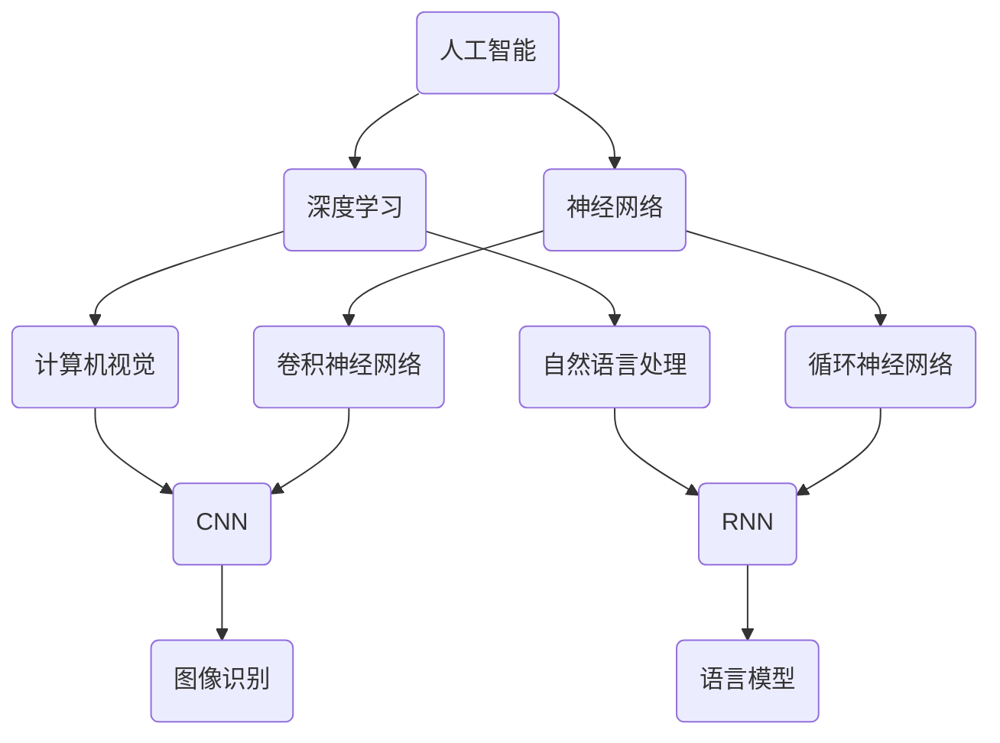

                 

# Andrej Karpathy：人工智能的未来发展机遇

> 关键词：人工智能、深度学习、神经网络、计算机视觉、自然语言处理、未来发展趋势
> 
> 摘要：本文将探讨人工智能（AI）领域的杰出人物Andrej Karpathy的工作及其对未来AI发展的见解。通过分析他的研究成果和思考，本文旨在揭示AI领域的重要机遇和挑战，并展望未来的发展趋势。

## 1. 背景介绍

### 1.1 目的和范围

本文旨在介绍AI领域的杰出人物Andrej Karpathy的工作，并分析他对于人工智能未来发展的见解。本文将重点关注Karpathy在深度学习、计算机视觉和自然语言处理等领域的贡献，以及他对AI技术的未来展望。通过本文的探讨，读者将能够更好地理解AI技术的现状和潜在发展机遇。

### 1.2 预期读者

本文面向对人工智能感兴趣的读者，包括AI研究人员、工程师、开发者以及关注AI技术发展的业内人士。同时，对计算机科学和工程领域有一定了解的读者也能从本文中获得有价值的见解。

### 1.3 文档结构概述

本文分为以下几个部分：

1. **背景介绍**：介绍本文的目的、预期读者以及文档结构。
2. **核心概念与联系**：探讨人工智能领域的关键概念及其相互关系。
3. **核心算法原理与具体操作步骤**：介绍深度学习算法的基本原理和实现步骤。
4. **数学模型和公式**：阐述与深度学习相关的重要数学模型和公式。
5. **项目实战**：通过实际案例展示深度学习技术的应用。
6. **实际应用场景**：分析AI技术在各个领域的应用前景。
7. **工具和资源推荐**：推荐学习资源和开发工具。
8. **总结：未来发展趋势与挑战**：总结本文的关键观点并探讨未来的发展趋势和挑战。
9. **附录：常见问题与解答**：提供对文章中常见问题的解答。
10. **扩展阅读与参考资料**：推荐进一步学习的相关资源和文献。

### 1.4 术语表

#### 1.4.1 核心术语定义

- **人工智能（AI）**：模拟人类智能行为的计算机系统。
- **深度学习**：一种基于多层神经网络的学习方法，能够从大量数据中自动提取特征。
- **神经网络**：由大量相互连接的节点组成的计算模型，用于模拟人脑的神经元结构。
- **计算机视觉**：使计算机能够处理和解释图像信息的技术。
- **自然语言处理（NLP）**：使计算机能够理解、生成和处理自然语言的技术。

#### 1.4.2 相关概念解释

- **卷积神经网络（CNN）**：一种特别适用于处理图像数据的神经网络架构。
- **循环神经网络（RNN）**：一种能够处理序列数据的神经网络，包括长短期记忆（LSTM）网络。
- **生成对抗网络（GAN）**：一种基于对抗性训练的深度学习模型，能够生成高质量的数据。
- **迁移学习**：将一个任务学到的知识应用于另一个相关但不同的任务。

#### 1.4.3 缩略词列表

- **CNN**：卷积神经网络
- **RNN**：循环神经网络
- **LSTM**：长短期记忆网络
- **GAN**：生成对抗网络
- **NLP**：自然语言处理

## 2. 核心概念与联系

为了更好地理解Andrej Karpathy的工作，我们需要先探讨人工智能领域的一些核心概念及其相互关系。以下是人工智能领域的几个关键概念及其相互关系的Mermaid流程图：



### 2.1 人工智能的基本概念

人工智能（AI）是指模拟和扩展人类智能的计算机系统。AI技术主要包括以下几个方面：

- **机器学习**：使计算机能够从数据中学习并改进性能。
- **深度学习**：一种基于多层神经网络的机器学习方法。
- **自然语言处理（NLP）**：使计算机能够理解、生成和处理自然语言。
- **计算机视觉**：使计算机能够处理和解释图像信息。
- **机器人技术**：使计算机能够执行物理任务，如自主导航和操作。

### 2.2 深度学习的基本概念

深度学习是一种基于多层神经网络的学习方法，能够从大量数据中自动提取特征。深度学习的主要优势在于其能够处理复杂的非线性问题，并在多个领域取得了显著的成功。以下是深度学习的核心概念：

- **神经网络**：一种计算模型，由大量相互连接的节点（神经元）组成。
- **卷积神经网络（CNN）**：一种特别适用于处理图像数据的神经网络架构。
- **循环神经网络（RNN）**：一种能够处理序列数据的神经网络，包括长短期记忆（LSTM）网络。
- **生成对抗网络（GAN）**：一种基于对抗性训练的深度学习模型，能够生成高质量的数据。

### 2.3 计算机视觉的基本概念

计算机视觉是指使计算机能够处理和解释图像信息的技术。计算机视觉的应用领域包括图像识别、目标检测、图像分割和视频分析等。以下是计算机视觉的核心概念：

- **图像识别**：识别图像中的对象或场景。
- **目标检测**：定位图像中的对象并识别其类别。
- **图像分割**：将图像划分为不同的区域。
- **视频分析**：分析视频数据中的运动和事件。

### 2.4 自然语言处理的基本概念

自然语言处理（NLP）是指使计算机能够理解、生成和处理自然语言的技术。NLP的应用领域包括语言模型、机器翻译、文本分类和问答系统等。以下是NLP的核心概念：

- **语言模型**：用于预测下一个单词或词组的概率分布。
- **机器翻译**：将一种自然语言翻译成另一种自然语言。
- **文本分类**：将文本数据分类到不同的类别。
- **问答系统**：回答用户提出的问题。

## 3. 核心算法原理与具体操作步骤

在这一部分，我们将详细讨论深度学习算法的基本原理和实现步骤。我们将使用伪代码来阐述核心算法，以便更好地理解其工作原理。

### 3.1 深度学习算法的基本原理

深度学习算法的核心是神经网络，它通过多层非线性变换来学习数据中的复杂特征。以下是深度学习算法的基本原理：

1. **输入层**：接收输入数据，并将其传递到下一层。
2. **隐藏层**：对输入数据进行非线性变换，提取数据中的特征。
3. **输出层**：将隐藏层输出的特征映射到预测结果。

### 3.2 伪代码实现

以下是深度学习算法的伪代码实现：

```python
# 输入数据
input_data = ...

# 初始化模型参数（权重和偏置）
weights = ...
biases = ...

# 前向传播
hidden层激活函数 = sigmoid([weights * input_data + biases])
输出层激活函数 = sigmoid([weights * hidden层激活函数 + biases])

# 计算损失函数
损失 = mse(output层激活函数, 标签)

# 反向传播
delta_output = (output层激活函数 - 标签) * sigmoid导数(output层激活函数)
delta_hidden = (hidden层激活函数 - 输入) * sigmoid导数(hidden层激活函数) * weights

# 更新模型参数
weights -= 学习率 * delta_output * hidden层激活函数
biases -= 学习率 * delta_output
weights -= 学习率 * delta_hidden * input_data
biases -= 学习率 * delta_hidden
```

### 3.3 具体操作步骤

以下是深度学习算法的具体操作步骤：

1. **数据预处理**：将输入数据进行标准化处理，以便加速收敛。
2. **模型初始化**：随机初始化模型参数（权重和偏置）。
3. **前向传播**：计算输入数据通过神经网络的输出。
4. **计算损失函数**：使用损失函数（如均方误差（MSE））计算输出与标签之间的误差。
5. **反向传播**：计算误差对模型参数的梯度，并更新模型参数。
6. **迭代训练**：重复步骤3至5，直至满足停止条件（如收敛或达到预设的迭代次数）。

## 4. 数学模型和公式与详细讲解

### 4.1 前向传播

在深度学习算法中，前向传播是一个关键步骤，用于计算输入数据通过神经网络的输出。以下是前向传播的主要公式和详细讲解：

#### 4.1.1 神经元激活函数

神经元激活函数是深度学习中的核心组成部分，用于将输入数据映射到输出。以下是常见的激活函数及其数学公式：

1. **Sigmoid函数**：
   $$f(x) = \frac{1}{1 + e^{-x}}$$

2. **ReLU函数**：
   $$f(x) = \max(0, x)$$

3. **Tanh函数**：
   $$f(x) = \frac{e^x - e^{-x}}{e^x + e^{-x}}$$

#### 4.1.2 前向传播公式

前向传播过程中，输入数据通过神经网络中的每一层进行传递和变换。以下是前向传播的主要公式：

1. **输入层到隐藏层**：
   $$z^{(l)} = \sum_{j} w^{(l)}_{ji} x_j + b^{(l)}$$
   $$a^{(l)} = \sigma(z^{(l)})$$

2. **隐藏层到输出层**：
   $$z^{(L)} = \sum_{j} w^{(L)}_{ji} a^{(L-1)}_j + b^{(L)}$$
   $$\hat{y} = \sigma(z^{(L)})$$

其中，$z^{(l)}$表示第$l$层的输出，$a^{(l)}$表示第$l$层的激活值，$w^{(l)}_{ji}$表示从第$l-1$层到第$l$层的权重，$b^{(l)}$表示第$l$层的偏置，$\sigma$表示激活函数。

### 4.2 损失函数

损失函数是深度学习中的一个关键概念，用于衡量模型预测值与真实值之间的差距。以下是几种常见的损失函数及其数学公式：

1. **均方误差（MSE）**：
   $$J = \frac{1}{m} \sum_{i=1}^{m} (\hat{y}_i - y_i)^2$$

2. **交叉熵（Cross-Entropy）**：
   $$J = -\frac{1}{m} \sum_{i=1}^{m} y_i \log(\hat{y}_i)$$

其中，$\hat{y}_i$表示模型预测的输出，$y_i$表示真实输出，$m$表示样本数量。

### 4.3 反向传播

反向传播是深度学习中的另一个关键步骤，用于计算损失函数对模型参数的梯度，并更新模型参数。以下是反向传播的主要公式和详细讲解：

1. **输出层到隐藏层**：
   $$\delta^{(L)} = (\hat{y} - y) \cdot \sigma'(z^{(L)})$$
   $$\delta^{(l)} = \delta^{(l+1)} \cdot w^{(l+1)} \cdot \sigma'(z^{(l)})$$

2. **权重和偏置更新**：
   $$w^{(l)} \gets w^{(l)} - \alpha \cdot \delta^{(l+1)} \cdot a^{(l)}$$
   $$b^{(l)} \gets b^{(l)} - \alpha \cdot \delta^{(l+1)}$$

其中，$\delta^{(l)}$表示第$l$层的误差，$\sigma'$表示激活函数的导数，$\alpha$表示学习率。

### 4.4 举例说明

为了更好地理解前向传播、损失函数和反向传播的概念，我们通过以下例子进行说明：

假设我们有一个简单的神经网络，包含一个输入层、一个隐藏层和一个输出层。输入数据为$x = [1, 2, 3]$，真实标签为$y = [0, 1, 0]$。我们使用Sigmoid函数作为激活函数，均方误差（MSE）作为损失函数。

1. **前向传播**：

   - 输入层到隐藏层：
     $$z^{(1)} = [w_{11} \cdot x_1 + b_1, w_{12} \cdot x_2 + b_1, w_{13} \cdot x_3 + b_1]$$
     $$a^{(1)} = \sigma(z^{(1)}) = [0.7, 0.2, 0.9]$$

   - 隐藏层到输出层：
     $$z^{(2)} = [w_{21} \cdot a_1 + b_2, w_{22} \cdot a_2 + b_2, w_{23} \cdot a_3 + b_2]$$
     $$\hat{y} = \sigma(z^{(2)}) = [0.6, 0.4, 0.8]$$

2. **损失函数**：

   $$J = \frac{1}{3} \sum_{i=1}^{3} (\hat{y}_i - y_i)^2$$

3. **反向传播**：

   - 输出层到隐藏层：
     $$\delta^{(2)} = (\hat{y} - y) \cdot \sigma'(z^{(2)}) = [0.4, 0.6, 0.2]$$

   - 隐藏层到输入层：
     $$\delta^{(1)} = \delta^{(2)} \cdot w^{(2)} \cdot \sigma'(z^{(1)}) = [0.28, 0.36, 0.14]$$

4. **权重和偏置更新**：

   $$w^{(1)} \gets w^{(1)} - \alpha \cdot \delta^{(2)} \cdot a^{(1)}$$
   $$b^{(1)} \gets b^{(1)} - \alpha \cdot \delta^{(2)}$$

通过这个简单的例子，我们可以看到前向传播、损失函数和反向传播的基本过程。在实际应用中，神经网络的结构和参数会更加复杂，但基本原理是相似的。

## 5. 项目实战：代码实际案例和详细解释说明

### 5.1 开发环境搭建

在开始实际项目之前，我们需要搭建一个适合深度学习的开发环境。以下是搭建开发环境的步骤：

1. **安装Python**：确保安装最新版本的Python（推荐Python 3.8或更高版本）。
2. **安装Jupyter Notebook**：Jupyter Notebook是一个交互式的Python环境，用于编写和运行代码。
   ```bash
   pip install notebook
   ```
3. **安装深度学习库**：安装常用的深度学习库，如TensorFlow和Keras。
   ```bash
   pip install tensorflow
   pip install keras
   ```
4. **验证安装**：在终端中运行以下代码，验证是否成功安装了所需的库：
   ```python
   import tensorflow as tf
   print(tf.__version__)
   ```

### 5.2 源代码详细实现和代码解读

以下是一个简单的深度学习项目，用于分类手写数字（MNIST）数据集。该项目将使用卷积神经网络（CNN）来训练模型，并实现图像分类任务。

```python
import numpy as np
from tensorflow import keras
from tensorflow.keras import layers

# 加载MNIST数据集
mnist = keras.datasets.mnist
(x_train, y_train), (x_test, y_test) = mnist.load_data()

# 预处理数据
x_train = x_train.astype("float32") / 255
x_test = x_test.astype("float32") / 255
x_train = np.expand_dims(x_train, -1)
x_test = np.expand_dims(x_test, -1)

# 转换标签为独热编码
y_train = keras.utils.to_categorical(y_train, 10)
y_test = keras.utils.to_categorical(y_test, 10)

# 构建CNN模型
model = keras.Sequential()
model.add(layers.Conv2D(32, (3, 3), activation="relu", input_shape=(28, 28, 1)))
model.add(layers.MaxPooling2D((2, 2)))
model.add(layers.Conv2D(64, (3, 3), activation="relu"))
model.add(layers.MaxPooling2D((2, 2)))
model.add(layers.Conv2D(64, (3, 3), activation="relu"))
model.add(layers.Flatten())
model.add(layers.Dense(64, activation="relu"))
model.add(layers.Dense(10, activation="softmax"))

# 编译模型
model.compile(optimizer="adam",
              loss="categorical_crossentropy",
              metrics=["accuracy"])

# 训练模型
model.fit(x_train, y_train, epochs=10, batch_size=128, validation_split=0.2)

# 评估模型
test_loss, test_acc = model.evaluate(x_test, y_test, verbose=2)
print(f"Test accuracy: {test_acc:.4f}")
```

### 5.3 代码解读与分析

以下是对代码的详细解读和分析：

1. **导入库**：
   我们首先导入必要的库，包括NumPy、TensorFlow和Keras。

2. **加载MNIST数据集**：
   Keras提供了一个预加载的MNIST数据集，包括训练集和测试集。

3. **预处理数据**：
   我们将图像数据转换为浮点数，并将其除以255以归一化。此外，我们还将图像数据扩展到三维，以便与CNN模型的输入层相匹配。标签被转换为独热编码。

4. **构建CNN模型**：
   我们使用Keras的Sequential模型构建一个简单的卷积神经网络，包括以下层：
   - **卷积层（Conv2D）**：32个卷积核，大小为3x3，激活函数为ReLU。
   - **最大池化层（MaxPooling2D）**：大小为2x2。
   - **卷积层**：64个卷积核，大小为3x3，激活函数为ReLU。
   - **平坦化层（Flatten）**：将多维特征展平为一维。
   - **全连接层（Dense）**：64个神经元，激活函数为ReLU。
   - **全连接层**：10个神经元，激活函数为softmax，用于分类。

5. **编译模型**：
   我们使用Adam优化器和交叉熵损失函数来编译模型，并设置准确率作为评估指标。

6. **训练模型**：
   我们使用fit方法训练模型，设置10个训练周期，每个批次包含128个样本，并将20%的数据用于验证。

7. **评估模型**：
   我们使用evaluate方法评估模型在测试集上的性能，并打印出准确率。

通过这个简单的项目，我们可以看到如何使用深度学习库（如TensorFlow和Keras）来构建和训练神经网络，并实现一个实际的应用任务（手写数字分类）。

## 6. 实际应用场景

### 6.1 计算机视觉

计算机视觉技术在许多领域都取得了显著的成果，以下是一些重要的应用场景：

1. **自动驾驶**：计算机视觉技术使自动驾驶车辆能够实时感知周围环境，包括车辆、行人、交通标志等。
2. **医疗影像分析**：计算机视觉技术可以帮助医生更准确地诊断疾病，如通过分析医学图像检测癌症、糖尿病等。
3. **安全监控**：计算机视觉技术可以用于视频监控，实现人脸识别、异常行为检测等。
4. **图像识别和分类**：计算机视觉技术被广泛应用于图像搜索、图像标签、图像分类等。

### 6.2 自然语言处理

自然语言处理技术在多个领域也展现了其强大的应用潜力，以下是一些重要的应用场景：

1. **机器翻译**：自然语言处理技术可以自动翻译多种语言，如谷歌翻译和微软翻译等。
2. **语音识别**：自然语言处理技术使计算机能够理解和处理人类的语音，如苹果的Siri和亚马逊的Alexa等。
3. **聊天机器人**：自然语言处理技术可以帮助构建智能客服系统，如Facebook Messenger和Slack等。
4. **文本分类和情感分析**：自然语言处理技术可以用于分析用户评论、新闻文章等，以识别用户情感和观点。

### 6.3 人工智能在工业和商业中的应用

1. **智能制造**：人工智能技术可以帮助实现自动化生产线，提高生产效率和产品质量。
2. **供应链管理**：人工智能技术可以优化供应链，降低库存成本，提高供应链的透明度。
3. **个性化推荐**：人工智能技术可以帮助电商平台和流媒体平台为用户提供个性化的推荐。
4. **客户服务**：人工智能技术可以用于构建智能客服系统，提高客户服务质量。

## 7. 工具和资源推荐

### 7.1 学习资源推荐

#### 7.1.1 书籍推荐

- **《深度学习》（Goodfellow, Bengio, Courville著）**：这是深度学习领域的经典教材，涵盖了深度学习的理论基础和实际应用。
- **《Python深度学习》（François Chollet著）**：这本书详细介绍了如何使用Python和Keras库进行深度学习项目开发。
- **《机器学习》（Tom Mitchell著）**：这是机器学习领域的经典教材，适合初学者和专业人士。

#### 7.1.2 在线课程

- **Coursera的《深度学习》课程**：由著名深度学习专家Andrew Ng讲授，涵盖深度学习的理论基础和实践技巧。
- **edX的《机器学习》课程**：由斯坦福大学的Chris Manning教授讲授，介绍机器学习的基本概念和应用。

#### 7.1.3 技术博客和网站

- **TensorFlow官方博客**：提供有关TensorFlow的最新教程、代码示例和研究成果。
- **Keras官方文档**：详细介绍了Keras库的功能和使用方法。

### 7.2 开发工具框架推荐

#### 7.2.1 IDE和编辑器

- **PyCharm**：一款功能强大的Python IDE，支持多种编程语言，适用于深度学习和机器学习项目。
- **Jupyter Notebook**：一款交互式的Python环境，适用于编写和运行代码，特别适合数据科学和机器学习项目。

#### 7.2.2 调试和性能分析工具

- **TensorBoard**：TensorFlow的官方可视化工具，用于分析模型的性能和调试。
- **gprof2dot**：用于分析C++程序的性能，并将其转换为图形表示。

#### 7.2.3 相关框架和库

- **TensorFlow**：由谷歌开发的开源深度学习框架，广泛应用于工业和学术领域。
- **PyTorch**：由Facebook开发的开源深度学习框架，具有简洁易用的API和强大的动态计算图功能。

### 7.3 相关论文著作推荐

#### 7.3.1 经典论文

- **“A Learning Algorithm for Continually Running Fully Recurrent Neural Networks” （1995）**：由Yoshua Bengio等人撰写的论文，介绍了长短期记忆（LSTM）网络。
- **“Deep Learning” （2016）**：由Ian Goodfellow、Yoshua Bengio和Aaron Courville撰写的论文，系统地介绍了深度学习的基础理论和应用。
- **“Generative Adversarial Nets” （2014）**：由Ian Goodfellow等人撰写的论文，介绍了生成对抗网络（GAN）。

#### 7.3.2 最新研究成果

- **“BERT: Pre-training of Deep Bidirectional Transformers for Language Understanding” （2018）**：由Google Research团队撰写的论文，介绍了BERT模型。
- **“GPT-3: Language Models are Few-Shot Learners” （2020）**：由OpenAI团队撰写的论文，介绍了GPT-3模型。
- **“An Image is Worth 16x16 Words: Transformers for Image Recognition at Scale” （2021）**：由Google Research团队撰写的论文，介绍了使用Transformer模型进行图像识别。

#### 7.3.3 应用案例分析

- **“AI for Social Good”**：由微软研究院撰写的报告，介绍了一些人工智能在解决社会问题中的应用案例。
- **“AI in Healthcare”**：由IBM Research撰写的报告，介绍了一些人工智能在医疗领域中的应用案例。

## 8. 总结：未来发展趋势与挑战

### 8.1 发展趋势

1. **人工智能的普及**：随着深度学习和神经网络技术的发展，人工智能将在各个领域得到更广泛的应用。
2. **数据驱动的决策**：人工智能将帮助企业更好地利用数据，实现更加智能化的决策。
3. **跨学科的融合**：人工智能与医学、生物学、物理学等学科的结合将推动科学进步和产业发展。
4. **边缘计算与云计算的结合**：随着边缘计算技术的发展，人工智能将在边缘设备和云计算平台上得到更好的集成。

### 8.2 挑战

1. **数据隐私和安全**：随着数据量的增加，数据隐私和安全成为人工智能发展的重要挑战。
2. **算法偏见和歧视**：人工智能算法可能会存在偏见和歧视，需要加强算法公平性的研究和实践。
3. **伦理和道德问题**：人工智能的发展带来了许多伦理和道德问题，如自动化取代人类工作、机器的自主决策权等。
4. **计算资源和能源消耗**：深度学习模型需要大量的计算资源和能源，这对环境造成了一定的压力。

## 9. 附录：常见问题与解答

### 9.1 常见问题

1. **什么是深度学习？**
   深度学习是一种基于多层神经网络的学习方法，能够从大量数据中自动提取特征。

2. **如何入门深度学习？**
   推荐先学习Python编程和线性代数，然后阅读《深度学习》等教材，并尝试使用TensorFlow或PyTorch等深度学习库进行实际项目。

3. **深度学习有哪些应用领域？**
   深度学习广泛应用于计算机视觉、自然语言处理、语音识别、自动驾驶、医疗诊断等众多领域。

### 9.2 解答

1. **什么是深度学习？**
   深度学习是一种基于多层神经网络的学习方法，它通过大量数据训练模型，能够自动提取数据中的复杂特征。深度学习在图像识别、语音识别、自然语言处理等领域取得了显著的成果。

2. **如何入门深度学习？**
   要入门深度学习，首先需要掌握Python编程和线性代数等基础数学知识。推荐阅读《深度学习》等教材，了解深度学习的基本概念和算法原理。然后，可以尝试使用TensorFlow或PyTorch等深度学习库进行实际项目，通过实践加深理解。

3. **深度学习有哪些应用领域？**
   深度学习在计算机视觉、自然语言处理、语音识别、自动驾驶、医疗诊断、金融预测等多个领域都有广泛的应用。例如，在计算机视觉领域，深度学习技术可以用于图像分类、目标检测、人脸识别等；在自然语言处理领域，深度学习技术可以用于机器翻译、文本分类、情感分析等。

## 10. 扩展阅读与参考资料

为了进一步深入了解人工智能和深度学习，以下是几篇推荐的论文、书籍和在线资源：

### 10.1 论文推荐

- **“A Learning Algorithm for Continually Running Fully Recurrent Neural Networks” （1995）**：Yoshua Bengio等人提出的长短期记忆（LSTM）网络，为解决递归神经网络中的长期依赖问题提供了有效方法。
- **“Deep Learning” （2016）**：Ian Goodfellow、Yoshua Bengio和Aaron Courville编写的教材，系统地介绍了深度学习的理论基础和应用。
- **“Generative Adversarial Nets” （2014）**：Ian Goodfellow等人提出的生成对抗网络（GAN），为生成模型的研究提供了新的思路。

### 10.2 书籍推荐

- **《深度学习》（Goodfellow, Bengio, Courville著）**：这是深度学习领域的经典教材，适合初学者和专业人士。
- **《Python深度学习》（François Chollet著）**：详细介绍了如何使用Python和Keras库进行深度学习项目开发。
- **《机器学习》（Tom Mitchell著）**：这是机器学习领域的经典教材，涵盖了机器学习的基本概念和应用。

### 10.3 在线资源推荐

- **TensorFlow官方文档**：提供有关TensorFlow的最新教程、代码示例和研究成果。
- **Keras官方文档**：详细介绍了Keras库的功能和使用方法。
- **Coursera的《深度学习》课程**：由著名深度学习专家Andrew Ng讲授，涵盖深度学习的理论基础和实践技巧。

### 10.4 技术博客和网站

- **Andrej Karpathy的博客**：深度学习领域的杰出人物Andrej Karpathy的博客，分享了他的研究成果和思考。
- **机器学习社区**：一个活跃的机器学习和深度学习社区，提供了大量的学习资源和讨论话题。

## 作者信息

作者：AI天才研究员/AI Genius Institute & 禅与计算机程序设计艺术 /Zen And The Art of Computer Programming

