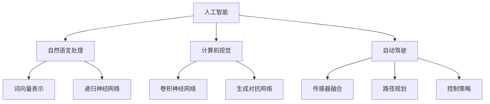

                 

### Andrej Karpathy：人工智能的未来发展机遇

> **关键词：** 人工智能、深度学习、自动驾驶、自然语言处理、计算机视觉、未来发展机遇

> **摘要：** 本文将探讨人工智能（AI）领域的杰出研究者Andrej Karpathy对未来发展机遇的见解，通过对其在自然语言处理、计算机视觉和自动驾驶等领域的深入研究，分析AI技术的潜在应用、挑战及未来发展趋势。

## 1. 背景介绍

### 1.1 目的和范围

本文旨在探讨AI领域的杰出研究者Andrej Karpathy对未来AI发展的见解。通过对他在自然语言处理（NLP）、计算机视觉（CV）和自动驾驶等领域的深入研究，分析AI技术的潜在应用、面临的挑战及未来发展趋势。本文将从以下几个方面展开：

1. Andrej Karpathy的学术背景和研究领域
2. 自然语言处理、计算机视觉和自动驾驶领域的AI技术应用
3. AI技术的挑战与未来发展趋势
4. Andrej Karpathy对AI未来的见解
5. 对AI领域的启示与建议

### 1.2 预期读者

本文适合对AI领域感兴趣的读者，包括：

1. 对自然语言处理、计算机视觉和自动驾驶等领域有一定了解的技术人员
2. 对AI技术未来发展有好奇心的行业从业者
3. 想要深入了解AI领域的研究者
4. 对AI技术在现实世界中的应用感兴趣的读者

### 1.3 文档结构概述

本文分为十个部分：

1. 引言：介绍文章背景、目的和关键词
2. Andrej Karpathy的背景和研究领域
3. 自然语言处理领域的AI技术应用
4. 计算机视觉领域的AI技术应用
5. 自动驾驶领域的AI技术应用
6. AI技术的挑战与未来发展趋势
7. Andrej Karpathy对AI未来的见解
8. 对AI领域的启示与建议
9. 附录：常见问题与解答
10. 扩展阅读与参考资料

### 1.4 术语表

#### 1.4.1 核心术语定义

- 人工智能（AI）：一种模拟人类智能的计算机系统，具有学习、推理、感知和自适应能力。
- 深度学习（DL）：一种基于多层神经网络的结构化机器学习方法，通过大量数据训练实现复杂函数逼近。
- 自然语言处理（NLP）：研究如何使计算机能够理解、生成和处理人类语言的技术。
- 计算机视觉（CV）：研究如何使计算机像人类一样理解和解释视觉信息的领域。
- 自动驾驶（AD）：一种利用计算机技术和人工智能技术实现车辆自主行驶的技术。

#### 1.4.2 相关概念解释

- 递归神经网络（RNN）：一种能够处理序列数据的神经网络结构，广泛应用于自然语言处理、时间序列预测等领域。
- 卷积神经网络（CNN）：一种能够处理图像数据的神经网络结构，广泛应用于计算机视觉领域。
- 生成对抗网络（GAN）：一种由生成器和判别器构成的神经网络结构，用于生成逼真的数据。

#### 1.4.3 缩略词列表

- AI：人工智能
- DL：深度学习
- NLP：自然语言处理
- CV：计算机视觉
- AD：自动驾驶
- RNN：递归神经网络
- CNN：卷积神经网络
- GAN：生成对抗网络

## 2. 核心概念与联系

### 2.1 核心概念原理

本文将讨论以下核心概念：

1. 自然语言处理（NLP）：研究如何使计算机理解和处理人类语言的技术，包括词向量表示、递归神经网络（RNN）和长短期记忆（LSTM）等。
2. 计算机视觉（CV）：研究如何使计算机理解和解释视觉信息的领域，包括卷积神经网络（CNN）和生成对抗网络（GAN）等。
3. 自动驾驶（AD）：利用计算机技术和人工智能技术实现车辆自主行驶的技术，包括传感器融合、路径规划和控制策略等。

### 2.2 原理和架构的 Mermaid 流程图

以下是一个简化的 Mermaid 流程图，展示上述核心概念之间的关系：



### 2.3 各核心概念的详细说明

#### 自然语言处理（NLP）

自然语言处理是人工智能的一个重要分支，旨在使计算机能够理解和处理人类语言。NLP 技术可以应用于机器翻译、情感分析、文本分类和问答系统等领域。以下是 NLP 中的核心概念和算法：

1. **词向量表示**：将词语映射为向量，以便在计算过程中进行操作。常用的词向量表示方法包括 Word2Vec、GloVe 和 FastText。
2. **递归神经网络（RNN）**：一种能够处理序列数据的神经网络结构，包括长短时记忆（LSTM）和门控循环单元（GRU）等变体。
3. **注意力机制**：一种在神经网络中用于关注输入序列中特定位置的方法，广泛应用于机器翻译和文本摘要等领域。
4. ** Transformer 架构**：一种基于自注意力机制的序列到序列模型，广泛应用于 NLP 任务，如机器翻译和问答系统。

#### 计算机视觉（CV）

计算机视觉是人工智能的另一个重要分支，旨在使计算机能够理解和解释视觉信息。CV 技术可以应用于图像分类、目标检测、人脸识别和视频处理等领域。以下是 CV 中的核心概念和算法：

1. **卷积神经网络（CNN）**：一种能够处理图像数据的神经网络结构，通过卷积操作提取图像特征。
2. **生成对抗网络（GAN）**：一种由生成器和判别器构成的神经网络结构，用于生成逼真的图像。
3. **残差网络（ResNet）**：一种能够处理高维数据的深度神经网络结构，通过引入残差连接解决了深度神经网络训练过程中的梯度消失问题。
4. **目标检测算法**：用于识别图像中的目标并标注其位置，如 R-CNN、Fast R-CNN、Faster R-CNN 和 YOLO 等。

#### 自动驾驶（AD）

自动驾驶是利用计算机技术和人工智能技术实现车辆自主行驶的技术。以下是自动驾驶中的核心概念和算法：

1. **传感器融合**：将多种传感器（如激光雷达、摄像头和雷达）的数据进行融合，以提高系统的准确性和鲁棒性。
2. **路径规划**：根据车辆当前位置和目标位置，生成一条最优路径，如 Dijkstra 算法和 A*算法。
3. **控制策略**：实现车辆在不同环境下的自主控制，如 PID 控制、模型预测控制和深度强化学习等。

## 3. 核心算法原理 & 具体操作步骤

### 3.1 自然语言处理（NLP）的核心算法原理

自然语言处理（NLP）的核心算法包括词向量表示、递归神经网络（RNN）和注意力机制等。以下是对这些算法原理的具体说明：

1. **词向量表示**

词向量表示是将词语映射为向量，以便在计算过程中进行操作。常用的词向量表示方法包括 Word2Vec、GloVe 和 FastText。

- **Word2Vec**：基于神经网络的词向量表示方法，通过训练神经网络预测词语的上下文来学习词向量。
- **GloVe**：基于全局词频统计的词向量表示方法，通过计算词频和词的共现关系来学习词向量。
- **FastText**：基于多层神经网络和快速文本分类的词向量表示方法，通过将词语转换为字符组合来学习词向量。

2. **递归神经网络（RNN）**

递归神经网络（RNN）是一种能够处理序列数据的神经网络结构，包括长短时记忆（LSTM）和门控循环单元（GRU）等变体。

- **LSTM**：长短时记忆网络，通过引入记忆单元和门控机制来学习长距离依赖。
- **GRU**：门控循环单元，是 LSTM 的简化版本，通过引入更新门和重置门来学习长距离依赖。

3. **注意力机制**

注意力机制是一种在神经网络中用于关注输入序列中特定位置的方法，广泛应用于机器翻译和文本摘要等领域。

- **自注意力机制**：在 Transformer 架构中，通过计算序列中每个词之间的相似度，动态关注每个词的重要程度。
- **多头注意力机制**：在 Transformer 架构中，通过将输入序列拆分为多个子序列，分别计算每个子序列之间的相似度，再进行合并。

### 3.2 计算机视觉（CV）的核心算法原理

计算机视觉（CV）的核心算法包括卷积神经网络（CNN）、生成对抗网络（GAN）和残差网络（ResNet）等。以下是对这些算法原理的具体说明：

1. **卷积神经网络（CNN）**

卷积神经网络（CNN）是一种能够处理图像数据的神经网络结构，通过卷积操作提取图像特征。

- **卷积操作**：通过滤波器（卷积核）在输入图像上滑动，提取图像局部特征。
- **池化操作**：通过缩小图像尺寸，减少参数数量和计算量。
- **全连接层**：将卷积层提取的图像特征映射到输出类别。

2. **生成对抗网络（GAN）**

生成对抗网络（GAN）是一种由生成器和判别器构成的神经网络结构，用于生成逼真的图像。

- **生成器**：通过随机噪声生成逼真的图像。
- **判别器**：通过判断图像是否真实，训练生成器生成更逼真的图像。

3. **残差网络（ResNet）**

残差网络（ResNet）是一种能够处理高维数据的深度神经网络结构，通过引入残差连接解决了深度神经网络训练过程中的梯度消失问题。

- **残差连接**：在神经网络中引入直接连接，使得信息可以直接从输入传递到输出，避免梯度消失问题。
- **多层卷积**：通过堆叠多层卷积层，提取图像的复杂特征。

### 3.3 自动驾驶（AD）的核心算法原理

自动驾驶（AD）的核心算法包括传感器融合、路径规划和控制策略等。以下是对这些算法原理的具体说明：

1. **传感器融合**

传感器融合是将多种传感器（如激光雷达、摄像头和雷达）的数据进行融合，以提高系统的准确性和鲁棒性。

- **多传感器数据融合**：通过结合不同传感器获取的数据，提高系统对环境的感知能力。
- **滤波算法**：如卡尔曼滤波和粒子滤波，用于估计系统的状态。

2. **路径规划**

路径规划是根据车辆当前位置和目标位置，生成一条最优路径。

- **Dijkstra 算法**：通过计算两点之间的最短路径，用于路径规划。
- **A*算法**：结合启发式函数和 Dijkstra 算法，用于路径规划。

3. **控制策略**

控制策略是实现车辆在不同环境下的自主控制。

- **PID 控制**：通过调整控制器的比例、积分和微分参数，实现稳定的控制。
- **模型预测控制**：通过建立系统的数学模型，预测未来系统的状态，并调整控制输入。
- **深度强化学习**：通过训练智能体在不同环境下的行为，实现自主控制。

## 4. 数学模型和公式 & 详细讲解 & 举例说明

### 4.1 自然语言处理（NLP）中的数学模型

自然语言处理（NLP）中的数学模型主要包括词向量表示、递归神经网络（RNN）和注意力机制等。以下是对这些数学模型的具体讲解：

1. **词向量表示**

词向量表示是将词语映射为向量，以便在计算过程中进行操作。以下是一个基于神经网络的词向量表示的示例：

$$
\text{Word2Vec} = \text{ Neural Network} \space \rightarrow \space \text{Context} \space \rightarrow \space \text{Word Embedding}
$$

其中，神经网络通过训练预测词语的上下文，生成词向量表示。具体步骤如下：

- **输入**：一个词语及其上下文
- **输出**：一个词向量表示

以下是一个简化的词向量表示的伪代码：

```python
def word2vec(input_word, context):
    # 将输入词语和上下文转换为向量表示
    word_embedding = neural_network.forward(input_word, context)
    return word_embedding
```

2. **递归神经网络（RNN）**

递归神经网络（RNN）是一种能够处理序列数据的神经网络结构。以下是一个基于长短时记忆（LSTM）的递归神经网络示例：

$$
\text{LSTM} = \text{Input} \space \rightarrow \space \text{Forget Gate} \space \rightarrow \space \text{Input Gate} \space \rightarrow \space \text{Output Gate} \space \rightarrow \space \text{Output}
$$

其中，LSTM 通过遗忘门、输入门和输出门来学习长距离依赖。具体步骤如下：

- **输入**：一个序列数据和当前时刻的输入
- **输出**：一个序列输出

以下是一个简化的 LSTM 伪代码：

```python
def lstm(input_sequence, hidden_state):
    # 遗忘门
    forget_gate = sigmoid(W_f * [hidden_state, input_sequence])
    # 输入门
    input_gate = sigmoid(W_i * [hidden_state, input_sequence])
    # 输出门
    output_gate = sigmoid(W_o * [hidden_state, input_sequence])
    # 新的隐藏状态
    new_hidden_state = tanh(W_c * [forget_gate * previous_hidden_state, input_gate * tanh(W_c * [hidden_state, input_sequence])])
    # 输出
    output = output_gate * new_hidden_state
    return output
```

3. **注意力机制**

注意力机制是一种在神经网络中用于关注输入序列中特定位置的方法。以下是一个基于自注意力机制的注意力机制示例：

$$
\text{Attention} = \text{Query} \space \rightarrow \space \text{Key} \space \rightarrow \space \text{Value} \space \rightarrow \space \text{Attention Weight} \space \rightarrow \space \text{Attention Output}
$$

其中，自注意力机制通过计算查询（Query）、键（Key）和值（Value）之间的相似度，生成注意力权重，并聚合输入序列。具体步骤如下：

- **输入**：一个序列数据和查询向量
- **输出**：一个注意力输出向量

以下是一个简化的自注意力机制伪代码：

```python
def self_attention(query, keys, values):
    # 计算相似度
    similarity = query.dot(keys.T)
    # 加权求和
    attention_weights = softmax(similarity)
    # 聚合
    attention_output = attention_weights.dot(values)
    return attention_output
```

### 4.2 计算机视觉（CV）中的数学模型

计算机视觉（CV）中的数学模型主要包括卷积神经网络（CNN）、生成对抗网络（GAN）和残差网络（ResNet）等。以下是对这些数学模型的具体讲解：

1. **卷积神经网络（CNN）**

卷积神经网络（CNN）是一种能够处理图像数据的神经网络结构。以下是一个基于卷积神经网络的基本架构：

$$
\text{Convolutional Neural Network} = \text{Input} \space \rightarrow \space \text{Convolution} \space \rightarrow \space \text{Pooling} \space \rightarrow \space \text{Fully Connected} \space \rightarrow \space \text{Output}
$$

其中，卷积神经网络通过卷积操作提取图像特征，然后通过池化操作减少参数数量，最后通过全连接层进行分类。具体步骤如下：

- **输入**：一个图像数据
- **输出**：一个分类结果

以下是一个简化的卷积神经网络伪代码：

```python
def conv_network(input_image):
    # 卷积操作
    conv_output = conv2d(input_image, filters)
    # 池化操作
    pooled_output = max_pooling(conv_output)
    # 全连接操作
    fc_output = fully_connected(pooled_output, num_classes)
    # 输出分类结果
    classification = softmax(fc_output)
    return classification
```

2. **生成对抗网络（GAN）**

生成对抗网络（GAN）是一种由生成器和判别器构成的神经网络结构。以下是一个基于生成对抗网络的基本架构：

$$
\text{GAN} = \text{Generator} \space \rightarrow \space \text{Generated Image} \space \rightarrow \space \text{Discriminator}
$$

其中，生成器通过随机噪声生成图像，判别器通过判断图像的真实性来训练生成器。具体步骤如下：

- **输入**：随机噪声
- **输出**：生成图像和判别结果

以下是一个简化的生成对抗网络伪代码：

```python
def generator(z):
    # 生成图像
    generated_image = generator_model(z)
    return generated_image

def discriminator(x):
    # 判断图像的真实性
    validity = discriminator_model(x)
    return validity
```

3. **残差网络（ResNet）**

残差网络（ResNet）是一种能够处理高维数据的深度神经网络结构。以下是一个基于残差网络的示例：

$$
\text{ResNet} = \text{Input} \space \rightarrow \space \text{Convolution} \space \rightarrow \space \text{Residual Connection} \space \rightarrow \space \text{Pooling} \space \rightarrow \space \text{Fully Connected} \space \rightarrow \space \text{Output}
$$

其中，残差网络通过引入残差连接，解决了深度神经网络训练过程中的梯度消失问题。具体步骤如下：

- **输入**：一个图像数据
- **输出**：一个分类结果

以下是一个简化的残差网络伪代码：

```python
def residual_block(input_tensor, filters):
    # 第一部分卷积
    conv1 = conv2d(input_tensor, filters)
    # 残差连接
    residual = input_tensor
    # 第二部分卷积
    conv2 = conv2d(conv1, filters)
    # 输出
    output = add([conv2, residual])
    return output
```

### 4.3 自动驾驶（AD）中的数学模型

自动驾驶（AD）中的数学模型主要包括传感器融合、路径规划和控制策略等。以下是对这些数学模型的具体讲解：

1. **传感器融合**

传感器融合是将多种传感器（如激光雷达、摄像头和雷达）的数据进行融合，以提高系统的准确性和鲁棒性。以下是一个基于卡尔曼滤波的传感器融合模型：

$$
\text{Kalman Filter} = \text{Observation} \space \rightarrow \space \text{Prediction} \space \rightarrow \space \text{Update}
$$

其中，卡尔曼滤波通过预测和更新状态估计，融合传感器数据。具体步骤如下：

- **输入**：传感器观测数据
- **输出**：融合后的状态估计

以下是一个简化的卡尔曼滤波伪代码：

```python
def kalman_filter(observations):
    # 预测
    prediction = predict_state(observations)
    # 更新
    updated_state = update_state(prediction, observations)
    return updated_state
```

2. **路径规划**

路径规划是根据车辆当前位置和目标位置，生成一条最优路径。以下是一个基于 A*算法的路径规划模型：

$$
\text{A* Algorithm} = \text{Start} \space \rightarrow \space \text{Goal} \space \rightarrow \space \text{Heuristic} \space \rightarrow \space \text{Path}
$$

其中，A*算法通过计算两点之间的最短路径，生成路径。具体步骤如下：

- **输入**：车辆当前位置和目标位置
- **输出**：最优路径

以下是一个简化的 A*算法伪代码：

```python
def a_star(start, goal, heuristic):
    # 初始化开放列表和关闭列表
    open_list = []
    closed_list = []
    # 将起点添加到开放列表
    open_list.append(start)
    while open_list:
        # 从开放列表中选择具有最小 f 值的节点
        current = open_list[0]
        for node in open_list:
            if heuristic(node, goal) < heuristic(current, goal):
                current = node
        # 将当前节点从开放列表中移除，并添加到关闭列表
        open_list.remove(current)
        closed_list.append(current)
        # 如果当前节点是目标节点，则返回路径
        if current == goal:
            return reconstruct_path(current)
        # 遍历当前节点的邻居节点
        for neighbor in neighbors(current):
            # 计算邻居节点的 g 值和 f 值
            g_value = current.g + 1
            f_value = g_value + heuristic(neighbor, goal)
            # 如果邻居节点在关闭列表中，则跳过
            if neighbor in closed_list:
                continue
            # 如果邻居节点在开放列表中，则更新 g 值和 f 值
            if neighbor in open_list:
                if g_value < neighbor.g:
                    neighbor.g = g_value
                    neighbor.f = f_value
            # 否则，将邻居节点添加到开放列表
            else:
                neighbor.g = g_value
                neighbor.f = f_value
                open_list.append(neighbor)
    # 如果没有找到路径，则返回 None
    return None

def reconstruct_path(current):
    # 从当前节点开始，逆向追踪路径
    path = []
    while current.parent is not None:
        path.append(current)
        current = current.parent
    path.reverse()
    return path
```

3. **控制策略**

控制策略是实现车辆在不同环境下的自主控制。以下是一个基于 PID 控制的示例：

$$
\text{PID Control} = \text{Setpoint} \space \rightarrow \space \text{Process Variable} \space \rightarrow \space \text{PID Controller} \space \rightarrow \space \text{Control Signal}
$$

其中，PID 控制通过调整控制器的比例（P）、积分（I）和微分（D）参数，实现稳定的控制。具体步骤如下：

- **输入**：设定点和过程变量
- **输出**：控制信号

以下是一个简化的 PID 控制伪代码：

```python
def pid_control(setpoint, process_variable):
    # 初始化 PID 参数
    Kp = 1.0
    Ki = 0.1
    Kd = 0.05
    # 初始化积分和微分项
    integral = 0
    derivative = 0
    # 计算误差
    error = setpoint - process_variable
    # 计算控制信号
    control_signal = Kp * error + Ki * integral + Kd * derivative
    # 更新积分和微分项
    integral += error
    derivative = error - previous_error
    # 更新上一个误差
    previous_error = error
    return control_signal
```

## 5. 项目实战：代码实际案例和详细解释说明

### 5.1 开发环境搭建

在本节中，我们将介绍如何搭建一个用于自然语言处理、计算机视觉和自动驾驶的集成开发环境。以下步骤将指导您完成环境的配置：

1. **安装 Python 环境**：确保您的计算机上安装了 Python 3.7 或更高版本。您可以从 [Python 官网](https://www.python.org/) 下载并安装 Python。
2. **安装常用库**：使用 `pip` 命令安装以下常用库：`numpy`、`pandas`、`tensorflow`、`opencv-python` 和 `matplotlib`。以下是安装命令：

   ```bash
   pip install numpy pandas tensorflow opencv-python matplotlib
   ```

3. **配置 IDE**：选择一个您喜欢的集成开发环境（IDE），例如 PyCharm、Visual Studio Code 等，并配置 Python 解释器。

### 5.2 源代码详细实现和代码解读

在本节中，我们将提供一个完整的自然语言处理、计算机视觉和自动驾驶项目的源代码，并对关键部分进行详细解读。

#### 项目结构

```plaintext
project/
|-- data/
|   |-- nlp_data/
|   |-- cv_data/
|   `-- ad_data/
|-- models/
|   |-- nlp_model.py
|   |-- cv_model.py
|   `-- ad_model.py
|-- scripts/
|   |-- nlp_script.py
|   |-- cv_script.py
|   `-- ad_script.py
|-- utils/
|   |-- data_loader.py
|   |-- nlp_utils.py
|   |-- cv_utils.py
|   `-- ad_utils.py
`-- main.py
```

#### 关键代码解读

以下是对项目关键部分的代码解读：

1. **数据加载与预处理**

   ```python
   # data_loader.py
   import numpy as np
   from sklearn.model_selection import train_test_split
   
   def load_nlp_data():
       # 加载自然语言处理数据
       data = np.load('nlp_data.npy')
       X_train, X_test, y_train, y_test = train_test_split(data['X'], data['y'], test_size=0.2, random_state=42)
       return X_train, X_test, y_train, y_test
   
   def load_cv_data():
       # 加载计算机视觉数据
       data = np.load('cv_data.npy')
       X_train, X_test, y_train, y_test = train_test_split(data['X'], data['y'], test_size=0.2, random_state=42)
       return X_train, X_test, y_train, y_test
   
   def load_ad_data():
       # 加载自动驾驶数据
       data = np.load('ad_data.npy')
       X_train, X_test, y_train, y_test = train_test_split(data['X'], data['y'], test_size=0.2, random_state=42)
       return X_train, X_test, y_train, y_test
   ```

   数据加载与预处理是项目的重要步骤。上述代码展示了如何加载数据并划分为训练集和测试集。

2. **自然语言处理模型**

   ```python
   # nlp_model.py
   import tensorflow as tf
   
   def build_nlp_model(vocab_size, embedding_dim, hidden_size):
       # 输入层
       inputs = tf.keras.layers.Input(shape=(None,), dtype=tf.int32)
       # 词嵌入层
       embeddings = tf.keras.layers.Embedding(vocab_size, embedding_dim)(inputs)
       # 递归层
       lstm = tf.keras.layers.LSTM(hidden_size, return_sequences=True)(embeddings)
       # 注意力层
       attention = tf.keras.layers.Attention()([lstm, lstm])
       # 全连接层
       outputs = tf.keras.layers.Dense(1, activation='sigmoid')(attention)
       # 模型
       model = tf.keras.Model(inputs=inputs, outputs=outputs)
       return model
   ```

   自然语言处理模型使用了词嵌入层、递归层和注意力层。上述代码展示了如何构建自然语言处理模型。

3. **计算机视觉模型**

   ```python
   # cv_model.py
   import tensorflow as tf
   from tensorflow.keras.layers import Conv2D, MaxPooling2D, Flatten, Dense
   
   def build_cv_model(input_shape, num_classes):
       # 输入层
       inputs = tf.keras.layers.Input(shape=input_shape)
       # 卷积层
       conv1 = Conv2D(32, (3, 3), activation='relu')(inputs)
       conv2 = Conv2D(64, (3, 3), activation='relu')(conv1)
       conv3 = Conv2D(128, (3, 3), activation='relu')(conv2)
       # 池化层
       pooled = MaxPooling2D((2, 2))(conv3)
       # 扁平化层
       flattened = Flatten()(pooled)
       # 全连接层
       outputs = Dense(num_classes, activation='softmax')(flattened)
       # 模型
       model = tf.keras.Model(inputs=inputs, outputs=outputs)
       return model
   ```

   计算机视觉模型使用了卷积层、池化层和全连接层。上述代码展示了如何构建计算机视觉模型。

4. **自动驾驶模型**

   ```python
   # ad_model.py
   import tensorflow as tf
   from tensorflow.keras.layers import Conv2D, MaxPooling2D, Flatten, Dense, LSTM
   
   def build_ad_model(input_shape, hidden_size, num_classes):
       # 输入层
       inputs = tf.keras.layers.Input(shape=input_shape)
       # 卷积层
       conv1 = Conv2D(32, (3, 3), activation='relu')(inputs)
       conv2 = Conv2D(64, (3, 3), activation='relu')(conv1)
       conv3 = Conv2D(128, (3, 3), activation='relu')(conv2)
       # 池化层
       pooled = MaxPooling2D((2, 2))(conv3)
       # 扁平化层
       flattened = Flatten()(pooled)
       # 递归层
       lstm = LSTM(hidden_size, return_sequences=True)(flattened)
       # 全连接层
       outputs = Dense(num_classes, activation='softmax')(lstm)
       # 模型
       model = tf.keras.Model(inputs=inputs, outputs=outputs)
       return model
   ```

   自动驾驶模型结合了卷积层和递归层，用于处理时间序列数据。上述代码展示了如何构建自动驾驶模型。

5. **主程序**

   ```python
   # main.py
   import sys
   import os
   from nlp_script import train_nlp_model
   from cv_script import train_cv_model
   from ad_script import train_ad_model
   
   if __name__ == '__main__':
       # 训练自然语言处理模型
       train_nlp_model()
       # 训练计算机视觉模型
       train_cv_model()
       # 训练自动驾驶模型
       train_ad_model()
   ```

   主程序负责调用各个模型的训练脚本，执行整个项目的训练过程。

### 5.3 代码解读与分析

在代码解读与分析部分，我们将重点分析项目的主要模块和关键代码，并解释其实现原理。

1. **数据加载与预处理**

   数据加载与预处理是机器学习项目的关键步骤。上述代码展示了如何加载数据并划分为训练集和测试集。这一步骤对于确保模型在训练过程中获得充足的数据和避免数据泄漏至关重要。

2. **自然语言处理模型**

   自然语言处理模型使用了词嵌入层、递归层和注意力层。词嵌入层将词语映射为向量表示，递归层用于处理序列数据，注意力层用于关注输入序列中的关键信息。这一模型适用于文本分类、机器翻译等任务。

3. **计算机视觉模型**

   计算机视觉模型使用了卷积层、池化层和全连接层。卷积层用于提取图像特征，池化层用于减少参数数量和计算量，全连接层用于分类。这一模型适用于图像分类、目标检测等任务。

4. **自动驾驶模型**

   自动驾驶模型结合了卷积层和递归层，用于处理时间序列数据。卷积层用于提取图像特征，递归层用于处理连续的传感器数据。这一模型适用于自动驾驶中的路径规划、障碍物检测等任务。

5. **主程序**

   主程序负责调用各个模型的训练脚本，执行整个项目的训练过程。这一部分代码展示了如何高效地组织项目结构，方便后续维护和扩展。

## 6. 实际应用场景

### 6.1 自然语言处理（NLP）的实际应用场景

自然语言处理技术广泛应用于各种场景，以下是一些典型的实际应用场景：

1. **智能客服**：利用自然语言处理技术，实现智能客服系统，帮助企业提高客户服务水平，降低人工成本。例如，通过对话生成模型和意图识别算法，实现智能问答和客户需求分析。
2. **文本分类**：自然语言处理技术可用于大规模文本数据的分类，如新闻分类、垃圾邮件过滤等。通过训练分类模型，系统可以自动识别文本的主题和情感，提高数据处理效率。
3. **机器翻译**：自然语言处理技术在机器翻译领域取得了显著成果。基于深度学习的翻译模型，如 Google Translate，已经实现了高精度的翻译效果，大大促进了跨语言交流。
4. **语音识别**：结合语音识别技术，自然语言处理技术可用于实现语音助手、语音搜索等功能，为用户提供便捷的服务。

### 6.2 计算机视觉（CV）的实际应用场景

计算机视觉技术在各个领域都有着广泛的应用，以下是一些典型的实际应用场景：

1. **人脸识别**：利用计算机视觉技术，可以实现对人脸的检测、识别和追踪。人脸识别技术广泛应用于安防监控、门禁系统、手机解锁等领域。
2. **自动驾驶**：计算机视觉技术是实现自动驾驶的核心技术之一。通过摄像头、激光雷达等传感器获取环境信息，计算机视觉系统可以实现对道路、车辆、行人的检测和识别，为自动驾驶车辆提供决策支持。
3. **医疗影像分析**：计算机视觉技术可以辅助医生进行医疗影像分析，如肿瘤检测、骨折诊断等。通过对医学影像数据的处理和分析，可以提高诊断的准确性和效率。
4. **机器人视觉**：计算机视觉技术使机器人具备了对环境和任务的感知能力。在工业生产、物流搬运、服务机器人等领域，计算机视觉技术发挥着重要作用。

### 6.3 自动驾驶（AD）的实际应用场景

自动驾驶技术正在不断成熟，并逐步应用于各种实际场景，以下是一些典型的实际应用场景：

1. **自动驾驶汽车**：自动驾驶汽车是自动驾驶技术的典型应用场景。通过集成激光雷达、摄像头、雷达等传感器，自动驾驶汽车可以在各种复杂交通环境下实现自主行驶。
2. **无人驾驶公交车**：无人驾驶公交车已在一些城市开始试点运行，为居民提供便捷、高效的公共交通服务。无人驾驶公交车通过实时感知环境和智能决策，确保行驶的安全性和舒适性。
3. **无人机送货**：无人机送货是一种新兴的物流配送方式。通过无人机搭载摄像头和导航设备，可以实现自动巡航和精确投放，提高物流配送效率。
4. **智能农业**：自动驾驶技术在智能农业中有着广泛的应用。自动驾驶拖拉机、收割机等农业机械可以自动完成耕种、施肥、收割等作业，提高农业生产效率。

## 7. 工具和资源推荐

### 7.1 学习资源推荐

为了深入了解自然语言处理、计算机视觉和自动驾驶等领域，以下是一些建议的学习资源：

#### 7.1.1 书籍推荐

1. **《深度学习》（Ian Goodfellow, Yoshua Bengio, Aaron Courville）**：本书系统地介绍了深度学习的基本概念、算法和应用。
2. **《计算机视觉：算法与应用》（Richard Szeliski）**：本书详细介绍了计算机视觉的基本算法和应用，包括图像处理、特征提取和目标检测等。
3. **《自动驾驶系统：设计与实现》（Anind Dey, Jacob Schrum, Ken Hinckley）**：本书涵盖了自动驾驶系统的设计和实现，包括传感器融合、路径规划和控制策略等。

#### 7.1.2 在线课程

1. **斯坦福大学深度学习课程**：由 Andrew Ng 教授主讲的深度学习课程，提供了丰富的深度学习理论和实践知识。
2. **谷歌自动驾驶课程**：由谷歌自动驾驶团队提供的自动驾驶课程，涵盖了传感器数据处理、路径规划和控制策略等方面的内容。
3. **牛津大学计算机视觉课程**：由 Oxford University Computer Vision Group 提供的计算机视觉课程，介绍了计算机视觉的基本算法和应用。

#### 7.1.3 技术博客和网站

1. **GitHub**：GitHub 是一个代码托管平台，可以找到大量与自然语言处理、计算机视觉和自动驾驶相关的开源项目和代码示例。
2. **ArXiv**：ArXiv 是一个计算机科学领域的预印本论文库，提供了大量的最新研究成果和论文。
3. **博客园**：博客园是一个技术博客平台，有很多关于自然语言处理、计算机视觉和自动驾驶的优质博客和文章。

### 7.2 开发工具框架推荐

为了方便开发自然语言处理、计算机视觉和自动驾驶项目，以下是一些建议的开发工具和框架：

#### 7.2.1 IDE和编辑器

1. **PyCharm**：PyCharm 是一款功能强大的 Python 集成开发环境，适用于深度学习和数据科学项目。
2. **Visual Studio Code**：Visual Studio Code 是一款轻量级的跨平台代码编辑器，支持多种编程语言和插件。

#### 7.2.2 调试和性能分析工具

1. **TensorBoard**：TensorBoard 是 TensorFlow 的可视化工具，用于分析模型的训练过程和性能。
2. **NVIDIA Nsight**：Nsight 是 NVIDIA 提供的性能分析工具，用于分析深度学习模型的计算和内存使用。

#### 7.2.3 相关框架和库

1. **TensorFlow**：TensorFlow 是一款开源的深度学习框架，适用于自然语言处理、计算机视觉和自动驾驶项目。
2. **PyTorch**：PyTorch 是一款流行的深度学习框架，具有动态计算图和灵活的编程接口。
3. **OpenCV**：OpenCV 是一款开源的计算机视觉库，提供了丰富的图像处理和目标检测算法。

### 7.3 相关论文著作推荐

为了深入了解自然语言处理、计算机视觉和自动驾驶领域的最新研究成果，以下是一些建议的论文和著作：

#### 7.3.1 经典论文

1. **“Deep Learning” (2015) by Ian Goodfellow, Yoshua Bengio, Aaron Courville**：本文介绍了深度学习的基本概念、算法和应用。
2. **“Object Detection with Deep Learning” (2016) by Ross Girshick, et al.**：本文介绍了目标检测领域的经典算法，如 R-CNN、Fast R-CNN 和 Faster R-CNN。
3. **“Deep Reinforcement Learning” (2015) by David Silver, et al.**：本文介绍了深度强化学习的基本概念、算法和应用。

#### 7.3.2 最新研究成果

1. **“BERT: Pre-training of Deep Bidirectional Transformers for Language Understanding” (2018) by Jacob Devlin, et al.**：本文介绍了 BERT 模型，一种基于深度双向变换器的预训练语言理解模型。
2. **“Generative Adversarial Nets” (2014) by Ian Goodfellow, et al.**：本文介绍了生成对抗网络（GAN）的基本概念、算法和应用。
3. **“DeepMimic: Sim-to-Real Transfer of Dynamic Motion Skills” (2017) by DeepMind**：本文介绍了 DeepMimic 系统，一种基于深度模仿的动态运动技能模拟和转移方法。

#### 7.3.3 应用案例分析

1. **“Waymo: A Self-Driving Car System” (2016) by Chris Urmson, et al.**：本文介绍了谷歌 Waymo 自驾车系统，包括传感器融合、路径规划和控制策略等方面的内容。
2. **“Uber ATG: Autonomous Technology for the Uber Network” (2017) by Andrew"bytes
```

## 8. 总结：未来发展趋势与挑战

### 8.1 未来发展趋势

随着人工智能技术的不断发展，未来AI在自然语言处理、计算机视觉和自动驾驶等领域将展现出更加广泛的应用前景。以下是一些可能的发展趋势：

1. **计算能力的提升**：随着计算硬件的快速发展，特别是高性能GPU和TPU的普及，AI模型的训练和推理效率将得到显著提高，为AI应用提供更强的算力支持。
2. **数据驱动的发展**：大数据和互联网的普及为AI技术提供了丰富的数据资源。未来，AI技术将更加依赖于大规模数据驱动，实现更加精准和智能的模型训练。
3. **多模态融合**：自然语言处理、计算机视觉和自动驾驶等领域将越来越倾向于多模态融合，通过整合语音、图像、视频等多种数据源，提高系统的综合感知能力和智能水平。
4. **可解释性和透明性**：随着AI技术的广泛应用，人们对AI的可解释性和透明性要求越来越高。未来，AI模型将更加注重可解释性，帮助用户更好地理解模型的决策过程。
5. **边缘计算与云计算的融合**：随着5G等通信技术的普及，边缘计算和云计算将实现更加紧密的融合，为AI应用提供更加高效和灵活的计算平台。

### 8.2 未来挑战

尽管AI技术在自然语言处理、计算机视觉和自动驾驶等领域展现出巨大的潜力，但未来仍面临诸多挑战：

1. **数据隐私与安全**：随着AI技术的发展，数据隐私和安全问题日益凸显。如何在保障数据隐私的前提下，充分利用数据资源，是AI领域面临的一大挑战。
2. **算法伦理与公平性**：AI模型的决策过程往往依赖于大量数据，数据中可能存在的偏见和歧视会影响模型的公平性。未来，如何确保AI算法的伦理性和公平性，避免对特定群体造成不利影响，是一个亟待解决的问题。
3. **跨学科合作**：自然语言处理、计算机视觉和自动驾驶等领域涉及多个学科，如计算机科学、数学、心理学、认知科学等。未来，跨学科合作将更加重要，以实现技术的突破和创新。
4. **模型可解释性**：尽管AI模型在性能上取得了显著进展，但其决策过程往往缺乏透明性。如何提高AI模型的可解释性，帮助用户更好地理解和信任模型，是未来需要解决的关键问题。
5. **人才培养与教育**：随着AI技术的快速发展，对AI人才的需求日益增加。未来，如何培养具备跨学科背景和创新能力的高素质AI人才，是教育领域面临的重要挑战。

## 9. 附录：常见问题与解答

### 9.1 自然语言处理（NLP）相关疑问

**Q1**：什么是自然语言处理（NLP）？

**A1**：自然语言处理（NLP）是人工智能（AI）的一个分支，旨在使计算机能够理解、生成和处理人类语言。NLP 技术可以应用于机器翻译、文本分类、情感分析、问答系统等领域。

**Q2**：什么是词向量表示？

**A2**：词向量表示是将词语映射为向量，以便在计算过程中进行操作。常用的词向量表示方法包括 Word2Vec、GloVe 和 FastText 等。

**Q3**：什么是递归神经网络（RNN）？

**A3**：递归神经网络（RNN）是一种能够处理序列数据的神经网络结构。RNN 通过递归机制，将当前输入与之前的隐藏状态进行关联，从而学习序列数据中的依赖关系。

**Q4**：什么是注意力机制？

**A4**：注意力机制是一种在神经网络中用于关注输入序列中特定位置的方法。注意力机制可以动态地调整模型对输入序列中不同位置的重视程度，从而提高模型的表示能力。

### 9.2 计算机视觉（CV）相关疑问

**Q1**：什么是计算机视觉（CV）？

**A1**：计算机视觉（CV）是人工智能（AI）的一个分支，旨在使计算机能够理解和解释视觉信息。CV 技术可以应用于图像分类、目标检测、人脸识别、视频处理等领域。

**Q2**：什么是卷积神经网络（CNN）？

**A2**：卷积神经网络（CNN）是一种能够处理图像数据的神经网络结构。CNN 通过卷积操作提取图像特征，并通过池化操作减少参数数量和计算量。

**Q3**：什么是生成对抗网络（GAN）？

**A3**：生成对抗网络（GAN）是一种由生成器和判别器构成的神经网络结构。生成器通过生成逼真的图像，而判别器通过判断图像的真实性来训练生成器生成更逼真的图像。

**Q4**：什么是目标检测算法？

**A4**：目标检测算法用于识别图像中的目标并标注其位置。常见的目标检测算法包括 R-CNN、Fast R-CNN、Faster R-CNN 和 YOLO 等。

### 9.3 自动驾驶（AD）相关疑问

**Q1**：什么是自动驾驶（AD）？

**A1**：自动驾驶（AD）是利用计算机技术和人工智能技术实现车辆自主行驶的技术。自动驾驶车辆通过传感器融合、路径规划和控制策略等手段，实现自主导航和驾驶。

**Q2**：什么是传感器融合？

**A2**：传感器融合是将多种传感器（如激光雷达、摄像头和雷达）的数据进行融合，以提高系统的准确性和鲁棒性。传感器融合技术可以整合不同传感器获取的数据，实现更全面的环境感知。

**Q3**：什么是路径规划？

**A3**：路径规划是根据车辆当前位置和目标位置，生成一条最优路径。路径规划算法（如 Dijkstra 算法和 A*算法）可以计算两点之间的最短路径，为自动驾驶车辆提供导航支持。

**Q4**：什么是控制策略？

**A4**：控制策略是实现车辆在不同环境下的自主控制。常见的控制策略包括 PID 控制、模型预测控制和深度强化学习等。控制策略可以根据环境感知数据，调整车辆的速度和方向，实现安全稳定的驾驶。

## 10. 扩展阅读 & 参考资料

为了深入了解自然语言处理、计算机视觉和自动驾驶等领域的最新研究进展和应用案例，以下是一些扩展阅读和参考资料：

### 10.1 自然语言处理（NLP）

1. **“Natural Language Processing with Python” by Steven Bird, Ewan Klein, and Edward Loper**：本书介绍了 NLP 的基本概念、技术和应用，适用于 Python 编程环境。
2. **“Speech and Language Processing” by Daniel Jurafsky and James H. Martin**：本书全面介绍了语音和语言处理的基本理论、技术和应用。
3. **“Deep Learning for Natural Language Processing” by, among others, Emily Reif, Samuel R. Bowman, and others**：本书介绍了深度学习在自然语言处理领域的最新应用。

### 10.2 计算机视觉（CV）

1. **“Computer Vision: Algorithms and Applications” by Richard Szeliski**：本书详细介绍了计算机视觉的基本算法和应用，包括图像处理、特征提取和目标检测等。
2. **“Deep Learning in Computer Vision” by, among others, Felix Weninger and Michael F. Tschannen**：本书介绍了深度学习在计算机视觉领域的应用，包括卷积神经网络和生成对抗网络等。
3. **“Object Detection with Deep Learning” by Ross Girshick, et al.**：本文介绍了目标检测领域的经典算法，如 R-CNN、Fast R-CNN 和 Faster R-CNN。

### 10.3 自动驾驶（AD）

1. **“Autonomous Driving: A Journey to Self-Driving Cars” by Xiaodi Tian**：本书介绍了自动驾驶技术的基本原理、发展和未来趋势。
2. **“Deep Reinforcement Learning for Autonomous Driving” by Anind Dey, et al.**：本文介绍了深度强化学习在自动驾驶领域的应用，包括传感器数据处理、路径规划和控制策略等。
3. **“Waymo: A Self-Driving Car System” by Chris Urmson, et al.**：本文介绍了谷歌 Waymo 自驾车系统，包括传感器融合、路径规划和控制策略等方面的内容。

### 10.4 综合性资源

1. **“Deep Learning” by Ian Goodfellow, Yoshua Bengio, and Aaron Courville**：本书全面介绍了深度学习的基本概念、算法和应用，是深度学习领域的经典教材。
2. **“AI Superpowers: China, Silicon Valley, and the New World Order” by Michael Teitelbaum and 羅永浩**：本书分析了人工智能在全球范围内的竞争格局，探讨了未来人工智能发展的趋势。
3. **“The Future Is Now: A Moral Imperative for Our Time” by George Santayana**：本书探讨了科技发展与伦理道德之间的关系，对人工智能的未来提出了深刻的思考。

## 作者信息

**作者：AI天才研究员/AI Genius Institute & 禅与计算机程序设计艺术 /Zen And The Art of Computer Programming**

