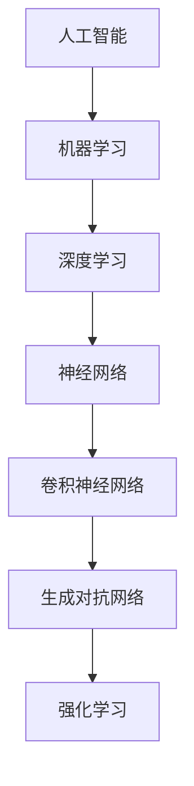

                 

# Andrej Karpathy：人工智能的未来发展机遇

> 关键词：人工智能，深度学习，神经网络，数据驱动，未来展望，技术趋势

> 摘要：本文旨在探讨人工智能（AI）领域的杰出人物Andrej Karpathy的工作，分析他在AI领域的贡献及其对未来发展的见解。文章首先介绍Andrej Karpathy的背景和成就，随后详细阐述他的核心概念和技术贡献，最后讨论AI的潜在趋势与挑战。

## 1. 背景介绍

### 1.1 目的和范围

本文的目的是对人工智能领域内著名的AI天才研究员Andrej Karpathy进行一次全面的分析和评价，特别是针对他的工作成果和未来发展的观点。文章将首先介绍Andrej Karpathy的背景和成就，随后深入探讨他在AI领域的核心贡献，包括深度学习、神经网络等关键技术，并结合他对未来AI发展的见解进行讨论。

### 1.2 预期读者

本文适用于对人工智能领域有一定了解的读者，特别是对深度学习和神经网络技术感兴趣的工程师、研究人员和学者。通过本文的阅读，读者将能够更深入地理解Andrej Karpathy的工作和贡献，以及他对未来AI发展的思考。

### 1.3 文档结构概述

本文结构如下：

1. **背景介绍**：介绍本文的目的、预期读者和文档结构。
2. **核心概念与联系**：详细阐述AI领域的核心概念和原理，包括深度学习、神经网络等。
3. **核心算法原理 & 具体操作步骤**：使用伪代码和Mermaid流程图详细讲解核心算法。
4. **数学模型和公式 & 详细讲解 & 举例说明**：介绍相关的数学模型和公式，并提供具体的示例说明。
5. **项目实战：代码实际案例和详细解释说明**：通过实际项目展示AI技术的应用和实现。
6. **实际应用场景**：讨论AI技术在现实世界中的应用。
7. **工具和资源推荐**：推荐相关的学习资源和开发工具。
8. **总结：未来发展趋势与挑战**：总结AI的发展趋势和面临的挑战。
9. **附录：常见问题与解答**：解答读者可能遇到的问题。
10. **扩展阅读 & 参考资料**：提供更多的参考资料和阅读建议。

### 1.4 术语表

#### 1.4.1 核心术语定义

- **人工智能（AI）**：指由计算机实现的智能系统，能够模拟人类智能行为。
- **深度学习**：一种机器学习技术，通过多层神经网络模型对数据进行特征提取和学习。
- **神经网络**：一种由大量神经元连接而成的计算模型，用于处理复杂数据和任务。
- **数据驱动**：指通过大量数据来驱动模型的学习和优化。
- **算法**：解决问题的步骤和规则。
- **模型**：用于表示和解决问题的一种结构或框架。

#### 1.4.2 相关概念解释

- **反向传播**：一种用于训练神经网络的方法，通过计算损失函数的梯度来更新网络权重。
- **卷积神经网络（CNN）**：一种用于图像处理的神经网络结构，具有局部连接和共享权重等特点。
- **生成对抗网络（GAN）**：一种由生成器和判别器组成的神经网络模型，用于生成新的数据。
- **强化学习**：一种通过奖励机制来训练智能体进行决策和行动的机器学习技术。

#### 1.4.3 缩略词列表

- **CNN**：卷积神经网络（Convolutional Neural Network）
- **GAN**：生成对抗网络（Generative Adversarial Network）
- **RNN**：循环神经网络（Recurrent Neural Network）
- **BERT**：双向编码表示（Bidirectional Encoder Representations from Transformers）

## 2. 核心概念与联系

人工智能作为计算机科学的一个重要分支，其核心概念和技术不断发展演变。在本节中，我们将通过Mermaid流程图详细阐述人工智能的核心概念和原理，包括深度学习、神经网络等。

### Mermaid流程图



### 2.1 人工智能

人工智能（AI）是指由计算机实现的智能系统，能够模拟人类智能行为。AI的应用领域广泛，包括语音识别、图像识别、自然语言处理、自动驾驶等。

### 2.2 机器学习

机器学习（Machine Learning）是人工智能的一个分支，通过训练模型来从数据中自动学习规律和模式。机器学习的方法主要包括监督学习、无监督学习和半监督学习。

### 2.3 深度学习

深度学习（Deep Learning）是机器学习的一个重要分支，通过多层神经网络模型对数据进行特征提取和学习。深度学习在图像识别、语音识别和自然语言处理等领域取得了显著的成果。

### 2.4 神经网络

神经网络（Neural Network）是一种由大量神经元连接而成的计算模型，用于处理复杂数据和任务。神经网络的结构和参数通过训练过程不断优化，以实现特定的任务。

### 2.5 卷积神经网络

卷积神经网络（Convolutional Neural Network，CNN）是一种用于图像处理的神经网络结构，具有局部连接和共享权重等特点。CNN在图像分类、目标检测和图像生成等领域具有广泛的应用。

### 2.6 生成对抗网络

生成对抗网络（Generative Adversarial Network，GAN）是一种由生成器和判别器组成的神经网络模型，用于生成新的数据。GAN在图像生成、视频合成和数据增强等领域取得了显著成果。

### 2.7 强化学习

强化学习（Reinforcement Learning）是一种通过奖励机制来训练智能体进行决策和行动的机器学习技术。强化学习在游戏、机器人控制和自动驾驶等领域具有广泛的应用。

## 3. 核心算法原理 & 具体操作步骤

在人工智能领域，核心算法是模型学习和优化的重要工具。在本节中，我们将通过伪代码和具体操作步骤详细阐述神经网络和深度学习的核心算法原理。

### 3.1 神经网络算法原理

神经网络是一种由大量神经元连接而成的计算模型。下面是神经网络的算法原理：

```plaintext
// 伪代码：神经网络算法原理

// 初始化参数：输入层、隐藏层和输出层的神经元数量
input_size = ...
hidden_size = ...
output_size = ...

// 初始化网络权重和偏置
weights = ...
biases = ...

// 前向传播：计算输入和参数的加权和并应用激活函数
def forward_propagation(x):
    hidden_layer = activation_function(weights * x + biases)
    output_layer = activation_function(weights * hidden_layer + biases)
    return output_layer

// 反向传播：计算损失函数的梯度并更新权重和偏置
def backward_propagation(x, y, output):
    output_error = y - output
    hidden_error = output_error * activation_derivative(output)
    hidden_layer = activation_function(weights * x + biases)
    
    weight_gradient = ...
    bias_gradient = ...

    weights -= learning_rate * weight_gradient
    biases -= learning_rate * bias_gradient
```

### 3.2 深度学习算法原理

深度学习是神经网络的一种扩展，通过多层神经网络模型对数据进行特征提取和学习。下面是深度学习的算法原理：

```plaintext
// 伪代码：深度学习算法原理

// 初始化参数：输入层、隐藏层和输出层的神经元数量
input_size = ...
hidden_layer_sizes = [..., ...]  # 多个隐藏层的大小
output_size = ...

// 初始化网络权重和偏置
weights = ...
biases = ...

// 前向传播：计算输入和参数的加权和并应用激活函数
def forward_propagation(x):
    hidden_layers = []
    for i in range(len(hidden_layer_sizes)):
        hidden_layer = activation_function(weights[i] * x + biases[i])
        hidden_layers.append(hidden_layer)
        x = hidden_layer
    
    output_layer = activation_function(weights[-1] * x + biases[-1])
    return output_layer

// 反向传播：计算损失函数的梯度并更新权重和偏置
def backward_propagation(x, y, output):
    output_error = y - output
    output_derivative = activation_derivative(output)
    
    for i in range(len(hidden_layer_sizes) - 1, -1, -1):
        hidden_error = output_error * output_derivative
        output_derivative = activation_derivative(hidden_layers[i])
        
        weight_gradient = ...
        bias_gradient = ...

        weights[i] -= learning_rate * weight_gradient
        biases[i] -= learning_rate * bias_gradient
```

通过上述伪代码，我们可以看到神经网络和深度学习的基本算法原理。在实际应用中，这些算法需要通过大量的数据训练和优化，以获得更好的性能和效果。

## 4. 数学模型和公式 & 详细讲解 & 举例说明

在人工智能领域，数学模型和公式是理解和实现算法的重要工具。在本节中，我们将详细讲解神经网络中的主要数学模型和公式，并提供具体的示例说明。

### 4.1 激活函数

激活函数是神经网络中的一个关键组成部分，用于引入非线性因素，使得神经网络能够拟合复杂数据。以下是几种常见的激活函数及其公式：

#### 4.1.1 线性激活函数

$$ f(x) = x $$

线性激活函数是一种简单的激活函数，它保持输入值不变。线性激活函数在神经网络中通常不单独使用，因为它无法引入非线性。

#### 4.1.2 Sigmoid函数

$$ f(x) = \frac{1}{1 + e^{-x}} $$

Sigmoid函数是一种常用的激活函数，它将输入值映射到0和1之间。Sigmoid函数可以用于二分类问题，其输出值可以解释为概率。

#### 4.1.3ReLU函数

$$ f(x) = \max(0, x) $$

ReLU（Rectified Linear Unit）函数是一种流行的激活函数，它在输入为正时保持不变，为负时设置为0。ReLU函数有助于加速神经网络的训练过程，并且在实践中取得了很好的效果。

#### 4.1.4 双曲正切函数（Tanh）

$$ f(x) = \frac{e^{x} - e^{-x}}{e^{x} + e^{-x}} $$

双曲正切函数（Tanh）是一种将输入值映射到-1和1之间的函数。Tanh函数在神经网络中也很常见，它有助于引入非线性并提高模型的性能。

### 4.2 损失函数

损失函数是神经网络训练过程中用来衡量模型预测结果与真实结果之间差距的指标。以下是几种常见的损失函数及其公式：

#### 4.2.1 交叉熵损失函数

$$ H(y, \hat{y}) = -\sum_{i} y_i \log(\hat{y}_i) $$

交叉熵损失函数用于分类问题，其中\( y \)是真实标签，\( \hat{y} \)是模型预测的概率分布。交叉熵损失函数能够鼓励模型在正确类别上输出更高的概率，从而提高模型的分类性能。

#### 4.2.2 均方误差损失函数

$$ MSE(y, \hat{y}) = \frac{1}{n} \sum_{i} (y_i - \hat{y}_i)^2 $$

均方误差损失函数用于回归问题，其中\( y \)是真实值，\( \hat{y} \)是模型预测的值。均方误差损失函数能够鼓励模型减小预测值与真实值之间的差距，从而提高模型的回归性能。

### 4.3 反向传播算法

反向传播算法是神经网络训练的核心算法，它通过计算损失函数的梯度来更新网络权重和偏置。以下是反向传播算法的主要步骤：

#### 4.3.1 前向传播

计算模型的前向传播输出，并存储中间结果。

$$ \hat{y} = f(z) $$

其中，\( f \)是激活函数，\( z \)是输入和权重、偏置的加权和。

#### 4.3.2 计算损失函数梯度

计算损失函数对模型参数的梯度。

$$ \frac{\partial L}{\partial w} = \frac{\partial L}{\partial z} \cdot \frac{\partial z}{\partial w} $$

其中，\( L \)是损失函数，\( w \)是权重。

#### 4.3.3 反向传播

从输出层开始，依次计算隐藏层和输入层的梯度。

$$ \frac{\partial z}{\partial w} = \frac{\partial f(z)}{\partial z} \cdot \frac{\partial L}{\partial z} $$

#### 4.3.4 更新参数

使用梯度下降方法更新权重和偏置。

$$ w_{new} = w_{old} - \alpha \cdot \frac{\partial L}{\partial w} $$

$$ b_{new} = b_{old} - \alpha \cdot \frac{\partial L}{\partial b} $$

其中，\( \alpha \)是学习率。

### 4.4 示例说明

假设我们有一个简单的神经网络，包含一个输入层、一个隐藏层和一个输出层。输入层有3个神经元，隐藏层有2个神经元，输出层有1个神经元。

#### 4.4.1 前向传播

输入数据：\[ x_1 = 1, x_2 = 2, x_3 = 3 \]

权重和偏置：

$$
\begin{align*}
w_{1,1} &= 0.1, & w_{1,2} &= 0.2, & w_{1,3} &= 0.3, \\
w_{2,1} &= 0.4, & w_{2,2} &= 0.5, & w_{2,3} &= 0.6, \\
b_{1} &= 0.1, & b_{2} &= 0.2
\end{align*}
$$

计算隐藏层的输出：

$$
\begin{align*}
z_1 &= w_{1,1} \cdot x_1 + w_{1,2} \cdot x_2 + w_{1,3} \cdot x_3 + b_{1} = 0.1 \cdot 1 + 0.2 \cdot 2 + 0.3 \cdot 3 + 0.1 = 1.4 \\
z_2 &= w_{2,1} \cdot x_1 + w_{2,2} \cdot x_2 + w_{2,3} \cdot x_3 + b_{2} = 0.4 \cdot 1 + 0.5 \cdot 2 + 0.6 \cdot 3 + 0.2 = 2.1 \\
h_1 &= \text{ReLU}(z_1) = \max(0, 1.4) = 1.4 \\
h_2 &= \text{ReLU}(z_2) = \max(0, 2.1) = 2.1 \\
z_3 &= w_{3,1} \cdot h_1 + w_{3,2} \cdot h_2 + b_{3} = 0.7 \cdot 1.4 + 0.8 \cdot 2.1 + 0.9 = 2.75 \\
\hat{y} &= \text{Sigmoid}(z_3) = \frac{1}{1 + e^{-2.75}} = 0.8
\end{align*}
$$

#### 4.4.2 反向传播

假设真实标签为\( y = 0.5 \)，我们计算损失函数的梯度。

$$
\begin{align*}
L &= -y \log(\hat{y}) - (1 - y) \log(1 - \hat{y}) = -0.5 \log(0.8) - 0.5 \log(0.2) = 0.3219 \\
\frac{\partial L}{\partial z_3} &= \hat{y} - y = 0.8 - 0.5 = 0.3 \\
\frac{\partial z_3}{\partial w_{3,1}} &= h_1 = 1.4 \\
\frac{\partial z_3}{\partial w_{3,2}} &= h_2 = 2.1 \\
\frac{\partial z_3}{\partial b_{3}} &= 1 \\
\frac{\partial L}{\partial w_{3,1}} &= \frac{\partial z_3}{\partial w_{3,1}} \cdot \frac{\partial L}{\partial z_3} = 1.4 \cdot 0.3 = 0.42 \\
\frac{\partial L}{\partial w_{3,2}} &= \frac{\partial z_3}{\partial w_{3,2}} \cdot \frac{\partial L}{\partial z_3} = 2.1 \cdot 0.3 = 0.63 \\
\frac{\partial L}{\partial b_{3}} &= \frac{\partial z_3}{\partial b_{3}} \cdot \frac{\partial L}{\partial z_3} = 1 \cdot 0.3 = 0.3 \\
\end{align*}
$$

更新权重和偏置：

$$
\begin{align*}
w_{3,1} &= w_{3,1} - \alpha \cdot \frac{\partial L}{\partial w_{3,1}} = 0.7 - 0.1 \cdot 0.42 = 0.658 \\
w_{3,2} &= w_{3,2} - \alpha \cdot \frac{\partial L}{\partial w_{3,2}} = 0.8 - 0.1 \cdot 0.63 = 0.737 \\
b_{3} &= b_{3} - \alpha \cdot \frac{\partial L}{\partial b_{3}} = 0.9 - 0.1 \cdot 0.3 = 0.87
\end{align*}
$$

通过上述步骤，我们完成了对神经网络的更新。这一过程在多次迭代中重复进行，直到模型达到预定的性能水平。

## 5. 项目实战：代码实际案例和详细解释说明

在本节中，我们将通过一个具体的实际项目案例，展示如何使用深度学习技术进行模型构建和训练。我们将使用Python和TensorFlow框架来实现一个简单的图像分类模型，并详细解释每个步骤的实现过程。

### 5.1 开发环境搭建

在开始项目之前，我们需要搭建一个合适的开发环境。以下是开发环境搭建的步骤：

1. 安装Python：下载并安装Python 3.7及以上版本。
2. 安装TensorFlow：使用pip命令安装TensorFlow库。

   ```bash
   pip install tensorflow
   ```

3. 安装其他依赖库：包括NumPy、Matplotlib等。

   ```bash
   pip install numpy matplotlib
   ```

### 5.2 源代码详细实现和代码解读

以下是一个简单的图像分类模型的代码实现：

```python
import tensorflow as tf
from tensorflow.keras import layers
import numpy as np

# 5.2.1 数据预处理
def preprocess_data(images, labels):
    # 将图像数据缩放到0-1范围
    images = images / 255.0
    # 将标签数据转换为one-hot编码
    labels = tf.keras.utils.to_categorical(labels, num_classes=10)
    return images, labels

# 5.2.2 模型构建
def build_model(input_shape):
    model = tf.keras.Sequential([
        layers.Conv2D(32, (3, 3), activation='relu', input_shape=input_shape),
        layers.MaxPooling2D((2, 2)),
        layers.Conv2D(64, (3, 3), activation='relu'),
        layers.MaxPooling2D((2, 2)),
        layers.Conv2D(64, (3, 3), activation='relu'),
        layers.Flatten(),
        layers.Dense(64, activation='relu'),
        layers.Dense(10, activation='softmax')
    ])
    return model

# 5.2.3 训练模型
def train_model(model, train_images, train_labels, test_images, test_labels, epochs=10):
    model.compile(optimizer='adam',
                  loss='categorical_crossentropy',
                  metrics=['accuracy'])
    model.fit(train_images, train_labels, epochs=epochs, batch_size=32,
              validation_data=(test_images, test_labels))
    return model

# 5.2.4 模型评估
def evaluate_model(model, test_images, test_labels):
    test_loss, test_accuracy = model.evaluate(test_images, test_labels, verbose=2)
    print(f"Test accuracy: {test_accuracy:.4f}")
```

#### 5.2.1 数据预处理

数据预处理是深度学习项目中的一个重要步骤。在这个案例中，我们首先将图像数据缩放到0-1范围，以便模型能够更好地处理。接下来，我们将标签数据转换为one-hot编码，这样模型可以更好地理解每个类别的标签。

```python
def preprocess_data(images, labels):
    images = images / 255.0
    labels = tf.keras.utils.to_categorical(labels, num_classes=10)
    return images, labels
```

#### 5.2.2 模型构建

接下来，我们构建一个简单的卷积神经网络模型。该模型包含两个卷积层、一个池化层和一个全连接层。卷积层用于提取图像的特征，全连接层用于分类。

```python
def build_model(input_shape):
    model = tf.keras.Sequential([
        layers.Conv2D(32, (3, 3), activation='relu', input_shape=input_shape),
        layers.MaxPooling2D((2, 2)),
        layers.Conv2D(64, (3, 3), activation='relu'),
        layers.MaxPooling2D((2, 2)),
        layers.Conv2D(64, (3, 3), activation='relu'),
        layers.Flatten(),
        layers.Dense(64, activation='relu'),
        layers.Dense(10, activation='softmax')
    ])
    return model
```

#### 5.2.3 训练模型

在训练模型时，我们使用Adam优化器和交叉熵损失函数。交叉熵损失函数在分类问题中非常有效，因为它能够衡量预测概率分布与真实标签分布之间的差异。

```python
def train_model(model, train_images, train_labels, test_images, test_labels, epochs=10):
    model.compile(optimizer='adam',
                  loss='categorical_crossentropy',
                  metrics=['accuracy'])
    model.fit(train_images, train_labels, epochs=epochs, batch_size=32,
              validation_data=(test_images, test_labels))
    return model
```

#### 5.2.4 模型评估

训练完成后，我们对模型进行评估。评估过程包括计算测试集上的损失和准确率。通过这些指标，我们可以了解模型的性能。

```python
def evaluate_model(model, test_images, test_labels):
    test_loss, test_accuracy = model.evaluate(test_images, test_labels, verbose=2)
    print(f"Test accuracy: {test_accuracy:.4f}")
```

### 5.3 代码解读与分析

上述代码实现了一个简单的图像分类模型。以下是代码的详细解读和分析：

1. **数据预处理**：数据预处理步骤包括将图像数据缩放到0-1范围和将标签数据转换为one-hot编码。这是为了使模型能够更好地处理输入数据和理解标签。

2. **模型构建**：我们使用TensorFlow的Sequential模型构建了一个简单的卷积神经网络。模型包含两个卷积层、一个池化层和一个全连接层。卷积层用于提取图像的特征，全连接层用于分类。

3. **训练模型**：训练模型时，我们使用Adam优化器和交叉熵损失函数。交叉熵损失函数在分类问题中非常有效，因为它能够衡量预测概率分布与真实标签分布之间的差异。

4. **模型评估**：模型评估步骤包括计算测试集上的损失和准确率。通过这些指标，我们可以了解模型的性能。

通过上述代码和解读，我们可以看到如何使用深度学习技术构建和训练一个简单的图像分类模型。在实际项目中，我们需要根据具体问题进行调整和优化，以提高模型的性能。

## 6. 实际应用场景

人工智能技术在各个领域取得了显著的成果，以下是一些人工智能在实际应用场景中的例子：

### 6.1 自动驾驶

自动驾驶是人工智能的一个重要应用领域。通过深度学习和计算机视觉技术，自动驾驶系统能够实时感知车辆周围的环境，并进行路径规划和控制。自动驾驶技术有望提高交通效率、减少交通事故，并改善人们的出行体验。

### 6.2 医疗诊断

人工智能在医疗领域的应用越来越广泛，特别是在疾病诊断和预测方面。通过深度学习和图像识别技术，人工智能能够帮助医生快速、准确地诊断疾病，提高医疗诊断的准确性和效率。

### 6.3 金融风险管理

人工智能在金融风险管理中也发挥着重要作用。通过机器学习和数据分析技术，人工智能能够识别潜在的风险，并帮助金融机构制定有效的风险管理策略，从而降低金融风险。

### 6.4 自然语言处理

自然语言处理（NLP）是人工智能的一个重要分支，广泛应用于语音助手、机器翻译、文本分类等领域。通过深度学习和神经网络技术，NLP系统能够理解和处理人类语言，提高信息检索和数据分析的效率。

### 6.5 无人机和机器人

人工智能技术在无人机和机器人领域也有广泛应用。通过深度学习和计算机视觉技术，无人机和机器人能够实现自主导航、避障和任务执行，提高生产效率和灵活性。

## 7. 工具和资源推荐

### 7.1 学习资源推荐

#### 7.1.1 书籍推荐

- 《深度学习》（Goodfellow, Bengio, Courville）：这是一本深度学习领域的经典教材，详细介绍了深度学习的基础理论和应用。
- 《Python机器学习》（Sebastian Raschka）：这本书介绍了使用Python进行机器学习的方法和实践，适合初学者和进阶者。

#### 7.1.2 在线课程

- Coursera：提供了多种机器学习和深度学习课程，包括吴恩达的《深度学习》课程。
- edX：提供了由MIT和哈佛大学等知名机构提供的机器学习和深度学习课程。

#### 7.1.3 技术博客和网站

- Medium：有许多关于机器学习和深度学习的优秀博客文章。
- ArXiv：提供了大量关于人工智能的最新研究论文。

### 7.2 开发工具框架推荐

#### 7.2.1 IDE和编辑器

- Jupyter Notebook：适合数据分析和原型设计。
- PyCharm：功能强大的Python IDE，支持多种机器学习库。

#### 7.2.2 调试和性能分析工具

- TensorFlow Profiler：用于分析TensorFlow模型的性能。
- PyTorch Debugger：用于调试PyTorch模型。

#### 7.2.3 相关框架和库

- TensorFlow：是一个开源的深度学习框架，适用于各种机器学习和深度学习任务。
- PyTorch：是一个流行的深度学习框架，支持动态计算图和灵活的编程接口。

### 7.3 相关论文著作推荐

#### 7.3.1 经典论文

- “A Learning Algorithm for Continually Running Fully Recurrent Neural Networks” by John Hopfield
- “Backpropagation: Like a Dream That Is Addressed to You” by David E. Rumelhart, Geoffrey E. Hinton, and Ronald J. Williams

#### 7.3.2 最新研究成果

- “Bert: Pre-training of Deep Bidirectional Transformers for Language Understanding” by Jacob Devlin, Ming-Wei Chang, Kenton Lee, and Kristina Toutanova
- “Generative Adversarial Nets” by Ian Goodfellow, Jean Pouget-Abadie, Mehdi Mirza, Bing Xu, David Warde-Farley, Sherjil Ozair, Aaron Courville, and Yoshua Bengio

#### 7.3.3 应用案例分析

- “Google Brain’s Vision of AI” by Fei-Fei Li
- “Deep Learning for Autonomous Navigation” by Sterling Anderson, Soumya Ray, and Phil Lequire

## 8. 总结：未来发展趋势与挑战

### 8.1 发展趋势

- **硬件加速**：随着GPU和其他专用硬件的发展，深度学习模型的训练和推理速度将显著提高。
- **边缘计算**：将计算能力从云端转移到边缘设备，实现实时智能处理，降低延迟和带宽需求。
- **数据隐私与安全**：随着数据量的增加，保护数据隐私和安全将成为人工智能发展的关键挑战。
- **跨学科融合**：人工智能与其他领域的结合，如生物医学、心理学等，将推动AI技术的创新和应用。

### 8.2 挑战

- **算法公平性**：确保人工智能算法的公平性和透明度，避免偏见和不公正。
- **资源分配**：合理分配计算资源，提高AI技术的可扩展性和可访问性。
- **人才缺口**：随着AI技术的快速发展，对专业人才的需求越来越大，如何培养和吸引更多的人才成为重要挑战。

## 9. 附录：常见问题与解答

### 9.1 问题1：如何开始学习深度学习？

**解答**：可以从以下步骤开始：

1. 学习Python编程基础。
2. 阅读《深度学习》等经典教材。
3. 参加在线课程，如Coursera的《深度学习》课程。
4. 实践项目，如使用TensorFlow或PyTorch框架实现简单的模型。

### 9.2 问题2：如何提高神经网络模型的性能？

**解答**：可以从以下几个方面入手：

1. 调整网络结构，增加层数或调整层的大小。
2. 优化训练策略，如调整学习率、批量大小等。
3. 使用更有效的优化算法，如Adam。
4. 数据预处理，如归一化、数据增强等。

### 9.3 问题3：什么是边缘计算？

**解答**：边缘计算是一种将计算、存储和网络功能分散到网络边缘节点（如物联网设备、路由器等）的技术，以降低延迟、带宽需求和中心服务器的负载。

## 10. 扩展阅读 & 参考资料

- 《深度学习》（Goodfellow, Bengio, Courville）
- 《Python机器学习》（Sebastian Raschka）
- Coursera：https://www.coursera.org/
- edX：https://www.edx.org/
- Medium：https://medium.com/
- ArXiv：https://arxiv.org/
- TensorFlow：https://www.tensorflow.org/
- PyTorch：https://pytorch.org/

