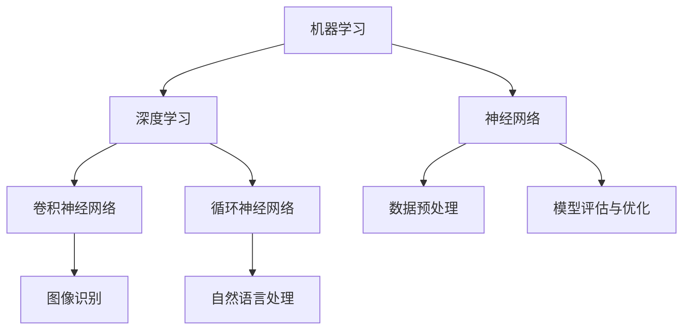

                 

### 1. 背景介绍

在过去的几十年中，人工智能（AI）领域经历了前所未有的快速发展，从最初的实验性研究到如今在各个行业中的广泛应用。AI技术不仅改变了我们与机器交互的方式，还推动了各行业的创新和进步。在这个快速发展的背景下，Andrej Karpathy作为AI领域的杰出人物，其对AI技术的贡献和研究方向具有重要的参考价值。

**1.1 目的和范围**

本文旨在深入探讨Andrej Karpathy的研究成果和观点，特别是关于人工智能未来发展的机遇。通过分析他的工作，我们希望能够帮助读者更好地理解AI技术的潜力，以及在实际应用中可能面临的挑战。本文将重点关注以下几个方面：

1. Andrej Karpathy的学术背景和主要成就
2. 他在深度学习领域的贡献和最新研究
3. 对AI未来发展的机遇与挑战的见解
4. 对AI在现实世界中的应用场景的讨论

**1.2 预期读者**

本文的预期读者是计算机科学、人工智能领域的研究人员、开发者以及对AI技术感兴趣的从业人员。通过阅读本文，读者可以：

1. 了解Andrej Karpathy的研究方向和成果
2. 深入理解深度学习技术的发展趋势
3. 对未来AI技术的发展和应用场景有更清晰的认识

**1.3 文档结构概述**

本文将按照以下结构进行组织：

1. **背景介绍**：介绍人工智能的发展背景，以及本文的目的和结构。
2. **核心概念与联系**：阐述AI技术的核心概念和架构，并使用Mermaid流程图展示。
3. **核心算法原理 & 具体操作步骤**：详细讲解AI的核心算法原理和操作步骤，使用伪代码进行阐述。
4. **数学模型和公式 & 详细讲解 & 举例说明**：介绍AI中使用的数学模型和公式，并进行详细讲解和举例说明。
5. **项目实战：代码实际案例和详细解释说明**：通过实际代码案例展示AI技术的应用。
6. **实际应用场景**：讨论AI技术在不同行业中的应用场景。
7. **工具和资源推荐**：推荐学习资源、开发工具框架和经典论文。
8. **总结：未来发展趋势与挑战**：总结AI技术的发展趋势和面临的挑战。
9. **附录：常见问题与解答**：提供常见问题的解答。
10. **扩展阅读 & 参考资料**：列出相关的扩展阅读和参考资料。

**1.4 术语表**

在本文中，我们将使用以下术语：

#### 1.4.1 核心术语定义

- **人工智能（AI）**：指模拟人类智能行为的计算机系统。
- **深度学习**：一种机器学习技术，通过多层神经网络模拟人脑处理信息的方式。
- **神经网络**：一种模拟生物神经系统的计算模型。
- **卷积神经网络（CNN）**：一种深度学习模型，常用于图像识别。
- **生成对抗网络（GAN）**：一种深度学习模型，用于生成新数据。

#### 1.4.2 相关概念解释

- **反向传播算法**：一种用于训练神经网络的算法，通过反向传播误差来调整网络参数。
- **迁移学习**：将已经训练好的模型或知识应用于新的任务中。
- **强化学习**：一种通过奖励机制来训练智能体做出决策的机器学习技术。

#### 1.4.3 缩略词列表

- **AI**：人工智能
- **CNN**：卷积神经网络
- **GAN**：生成对抗网络
- **DL**：深度学习
- **RL**：强化学习

通过上述背景介绍，我们已经为后续内容的深入分析打下了基础。接下来，我们将详细探讨Andrej Karpathy的研究成果和他对人工智能未来发展的见解。让我们一步一步深入思考，共同探索AI领域的无限可能。

### 2. 核心概念与联系

人工智能（AI）作为当今科技领域的热门话题，其核心概念和架构对理解AI技术的发展至关重要。在这一部分，我们将详细阐述AI的核心概念，并使用Mermaid流程图来展示这些概念之间的联系。

#### 2.1 人工智能的核心概念

人工智能的核心概念可以归纳为以下几个方面：

1. **机器学习（ML）**：机器学习是一种让计算机通过数据和经验进行自我学习和改进的技术。它包括监督学习、无监督学习和强化学习等不同类型。
2. **深度学习（DL）**：深度学习是一种基于多层神经网络的学习方法，通过模拟人脑处理信息的方式来进行特征提取和决策。它包括卷积神经网络（CNN）、循环神经网络（RNN）等。
3. **神经网络（NN）**：神经网络是由大量简单计算单元（称为神经元）组成的计算模型，用于模拟生物神经系统。它是机器学习和深度学习的基础。
4. **数据预处理**：数据预处理是机器学习和深度学习中的关键步骤，包括数据清洗、数据归一化、特征提取等。
5. **模型评估与优化**：模型评估与优化是确保机器学习模型性能的重要环节，包括评估指标的选择、超参数调整等。

#### 2.2 Mermaid流程图展示

为了更直观地展示人工智能的核心概念和架构，我们可以使用Mermaid流程图来表示。以下是一个简化版的Mermaid流程图，展示了上述核心概念之间的联系：



在这个流程图中，我们可以看到：

- 机器学习和深度学习是两个主要分支，其中深度学习是机器学习的一个子领域。
- 神经网络是深度学习的基础，它包括多种类型，如卷积神经网络和循环神经网络。
- 数据预处理和模型评估与优化是机器学习和深度学习过程中的关键环节。

通过这个流程图，我们可以更清晰地理解AI技术的核心概念和架构，以及它们之间的相互关系。接下来，我们将进一步探讨这些核心概念的具体原理和操作步骤。

### 3. 核心算法原理 & 具体操作步骤

在了解了人工智能的核心概念和架构之后，我们需要深入探讨其中的核心算法原理和具体操作步骤。在本节中，我们将重点介绍深度学习（DL）中的卷积神经网络（CNN）和生成对抗网络（GAN）。

#### 3.1 卷积神经网络（CNN）

卷积神经网络是一种深度学习模型，特别适合于处理图像数据。其核心思想是通过卷积操作来提取图像中的局部特征，然后通过全连接层进行分类或回归。

**3.1.1 算法原理**

CNN的基本架构包括以下几个主要部分：

1. **卷积层（Convolutional Layer）**：卷积层通过卷积操作来提取图像的局部特征。卷积核（也称为滤波器）在图像上滑动，计算每个位置的局部特征。
2. **激活函数（Activation Function）**：常用的激活函数包括ReLU（Rectified Linear Unit）和Sigmoid。
3. **池化层（Pooling Layer）**：池化层用于降低特征图的维度，提高模型对输入数据的平移不变性。常用的池化方式包括最大池化和平均池化。
4. **全连接层（Fully Connected Layer）**：全连接层将卷积层输出的特征图展平为一系列向量，然后通过softmax等激活函数进行分类或回归。

**3.1.2 具体操作步骤**

以下是CNN的具体操作步骤，使用伪代码进行详细阐述：

```python
# 初始化参数
W1, b1 = initialize_weights(num_filters, kernel_size, input_shape)
W2, b2 = initialize_weights(num_units)

# 前向传播
output = conv2d(input_image, W1, b1)
output = ReLU(output)
output = max_pool2d(output)
output = flatten(output)
output = fully_connected(output, W2, b2)
output = softmax(output)

# 反向传播
error = -1 * (y * log(output) + (1 - y) * log(1 - output))
dW2 = output * (1 - output) * doutput
doutput = dW2
doutput = expand_dims(doutput, -1)
doutput = reshape(doutput, input_shape)
dW1 = conv2d_transpose(doutput, W1, b1)
dinput_image = conv2d_transpose(doutput, W1, b1)
```

**3.1.3 详细解释**

- **初始化参数**：初始化卷积层的权重和偏置，以及全连接层的权重和偏置。
- **前向传播**：通过卷积操作提取图像特征，应用ReLU激活函数和最大池化操作，然后通过全连接层进行分类或回归。最终输出结果通过softmax函数进行概率分布。
- **反向传播**：计算损失函数的梯度，并更新网络参数。反向传播过程涉及卷积转置操作，用于计算梯度在输入图像上的传播。

#### 3.2 生成对抗网络（GAN）

生成对抗网络（GAN）是一种由生成器和判别器组成的深度学习模型。生成器的目标是生成尽可能真实的数据，而判别器的目标是区分生成器和真实数据。通过不断迭代，生成器和判别器相互对抗，最终生成器能够生成高质量的合成数据。

**3.2.1 算法原理**

GAN的基本架构包括以下两个部分：

1. **生成器（Generator）**：生成器是一个神经网络，用于生成假数据。它的输入通常是随机噪声，输出是生成的人工数据。
2. **判别器（Discriminator）**：判别器是一个神经网络，用于判断输入数据是真实数据还是生成数据。它的输入是数据，输出是概率，表示输入数据是真实数据的概率。

GAN的训练过程如下：

1. **训练生成器**：将生成器的输出作为判别器的输入，通过优化生成器的损失函数，使得生成器输出的数据更加接近真实数据。
2. **训练判别器**：通过优化判别器的损失函数，使得判别器能够更好地区分真实数据和生成数据。
3. **迭代训练**：重复上述过程，直到生成器生成的数据足够真实，判别器无法区分真实数据和生成数据。

**3.2.2 具体操作步骤**

以下是GAN的具体操作步骤，使用伪代码进行详细阐述：

```python
# 初始化参数
Wg, bg = initialize_weights(z_dim, output_shape)
Wd, bd = initialize_weights(input_shape, 1)

# 前向传播
z = generate_noise(z_dim)
output = generator(z, Wg, bg)
probability = discriminator(output, Wd, bd)

# 反向传播
error_g = -1 * log(probability)
error_d = -1 * (log(discriminator(real_data, Wd, bd)) + log(1 - discriminator(output, Wd, bd)))

# 更新参数
dWd = gradient_of_error_d_with Respect_to_Wd
dbd = gradient_of_error_d_with Respect_to_b
Wd -= learning_rate * dWd
bd -= learning_rate * dbd

dWg = gradient_of_error_g_with Respect_to_Wg
dbg = gradient_of_error_g_with Respect_to_bg
Wg -= learning_rate * dWg
bg -= learning_rate * dbg
```

**3.2.3 详细解释**

- **初始化参数**：初始化生成器和判别器的权重和偏置。
- **前向传播**：生成器生成假数据，判别器判断生成数据和真实数据的概率。
- **反向传播**：计算生成器和判别器的损失函数，并更新网络参数。

通过上述核心算法原理和具体操作步骤的详细阐述，我们可以更好地理解深度学习中的卷积神经网络（CNN）和生成对抗网络（GAN）。接下来，我们将进一步探讨AI技术的数学模型和公式。

### 4. 数学模型和公式 & 详细讲解 & 举例说明

在人工智能和深度学习中，数学模型和公式是核心基础。通过这些模型和公式，我们能够描述和解释智能系统的工作原理。在本节中，我们将详细介绍人工智能中常用的数学模型和公式，并对其进行详细讲解和举例说明。

#### 4.1 损失函数

损失函数是机器学习和深度学习中的一个关键概念，用于评估模型预测值与真实值之间的差异。在训练过程中，模型的参数会通过最小化损失函数来优化。

**4.1.1 交叉熵损失函数（Cross-Entropy Loss）**

交叉熵损失函数常用于分类问题，其公式如下：

\[ 
L = -\sum_{i} y_i \log(p_i) 
\]

其中，\( y_i \) 是真实标签，\( p_i \) 是模型预测的概率分布。

**详细讲解**：

- \( y_i \) 表示第 \( i \) 个类别的真实标签，取值为 0 或 1。
- \( p_i \) 是模型预测的第 \( i \) 个类别的概率。
- 对于二分类问题，交叉熵损失函数可以简化为 \( L = -y \log(p) - (1 - y) \log(1 - p) \)。

**举例说明**：

假设我们有一个二分类问题，真实标签 \( y \) 为 1，模型预测的概率 \( p \) 为 0.7。那么损失函数的计算如下：

\[ 
L = -1 \log(0.7) - (1 - 1) \log(1 - 0.7) = -\log(0.7) = -0.35667 
\]

**4.2 梯度下降算法（Gradient Descent）**

梯度下降是一种优化算法，用于训练机器学习模型。其核心思想是计算损失函数关于模型参数的梯度，并沿着梯度的反方向更新参数，以最小化损失函数。

**4.2.1 均方误差（Mean Squared Error, MSE）**

均方误差是一种常用的回归损失函数，其公式如下：

\[ 
MSE = \frac{1}{n} \sum_{i=1}^{n} (y_i - \hat{y}_i)^2 
\]

其中，\( y_i \) 是真实值，\( \hat{y}_i \) 是预测值，\( n \) 是样本数量。

**详细讲解**：

- \( y_i \) 和 \( \hat{y}_i \) 分别是第 \( i \) 个样本的真实值和预测值。
- \( MSE \) 表示预测值与真实值之间差异的平方的平均值。

**举例说明**：

假设我们有一个包含 5 个样本的回归问题，真实值和预测值如下表所示：

| 样本 | 真实值 \( y \) | 预测值 \( \hat{y} \) |
|------|--------------|--------------|
| 1    | 2.0          | 2.5          |
| 2    | 3.0          | 2.8          |
| 3    | 4.0          | 4.2          |
| 4    | 5.0          | 5.1          |
| 5    | 6.0          | 6.0          |

那么均方误差的计算如下：

\[ 
MSE = \frac{1}{5} \sum_{i=1}^{5} (y_i - \hat{y}_i)^2 = \frac{1}{5} (0.25 + 0.04 + 0.04 + 0.01 + 0.00) = 0.06 
\]

**4.3 反向传播算法（Backpropagation）**

反向传播算法是一种用于训练神经网络的优化算法，通过计算损失函数关于网络参数的梯度来更新参数。

**4.3.1 反向传播步骤**

反向传播算法包括以下几个步骤：

1. **前向传播**：计算模型输出，并计算损失函数。
2. **计算梯度**：计算损失函数关于网络参数的梯度。
3. **更新参数**：使用梯度下降或其他优化算法更新网络参数。
4. **迭代**：重复上述步骤，直到模型收敛。

**4.3.2 反向传播公式**

以下是反向传播算法的核心公式：

\[ 
\frac{\partial L}{\partial W} = \sum_{i} \frac{\partial L}{\partial z_i} \cdot \frac{\partial z_i}{\partial W} 
\]

\[ 
\frac{\partial L}{\partial b} = \sum_{i} \frac{\partial L}{\partial z_i} \cdot \frac{\partial z_i}{\partial b} 
\]

其中，\( L \) 是损失函数，\( W \) 和 \( b \) 是网络参数，\( z_i \) 是激活值。

**详细讲解**：

- \( \frac{\partial L}{\partial z_i} \) 是损失函数关于激活值 \( z_i \) 的梯度。
- \( \frac{\partial z_i}{\partial W} \) 和 \( \frac{\partial z_i}{\partial b} \) 分别是激活值关于权重和偏置的梯度。

**举例说明**：

假设我们有一个简单的神经网络，包含一个输入层、一个隐藏层和一个输出层。输入 \( x \) 为 [1, 2]，隐藏层激活值 \( z \) 为 [3, 4]，输出层激活值 \( y \) 为 [5, 6]。

损失函数 \( L \) 为：

\[ 
L = \frac{1}{2} \sum_{i} (y_i - x_i)^2 
\]

那么，损失函数关于输出层激活值 \( y \) 的梯度为：

\[ 
\frac{\partial L}{\partial y} = \sum_{i} (y_i - x_i) 
\]

损失函数关于隐藏层激活值 \( z \) 的梯度为：

\[ 
\frac{\partial L}{\partial z} = \sum_{i} (y_i - x_i) \cdot \frac{\partial z_i}{\partial z} 
\]

由于是全连接层，\( \frac{\partial z_i}{\partial z} \) 等于 1。因此，损失函数关于隐藏层激活值 \( z \) 的梯度为：

\[ 
\frac{\partial L}{\partial z} = \sum_{i} (y_i - x_i) 
\]

通过这些数学模型和公式的详细讲解和举例说明，我们可以更好地理解人工智能和深度学习中的核心概念和算法。接下来，我们将通过实际代码案例来进一步探讨这些概念的应用。

### 5. 项目实战：代码实际案例和详细解释说明

为了更好地理解人工智能和深度学习的实际应用，我们将通过一个实际项目来展示如何使用卷积神经网络（CNN）和生成对抗网络（GAN）来实现图像识别和图像生成。在这个项目中，我们将使用Python和TensorFlow库来搭建和训练模型。

#### 5.1 开发环境搭建

在开始项目之前，我们需要搭建一个合适的开发环境。以下是推荐的开发环境和安装步骤：

- **操作系统**：Ubuntu 18.04 或 macOS Catalina
- **Python**：3.8
- **TensorFlow**：2.5
- **其他库**：NumPy、Pandas、Matplotlib

安装步骤如下：

```bash
# 更新包列表
sudo apt-get update

# 安装Python和pip
sudo apt-get install python3 python3-pip

# 安装TensorFlow
pip3 install tensorflow==2.5

# 安装其他库
pip3 install numpy pandas matplotlib
```

#### 5.2 源代码详细实现和代码解读

在本节中，我们将详细实现一个简单的图像识别项目和一个图像生成项目，并解释关键代码。

**5.2.1 图像识别项目**

以下是一个简单的图像识别项目，使用卷积神经网络（CNN）来识别手写数字（MNIST数据集）。

```python
import tensorflow as tf
from tensorflow.keras import layers, models
from tensorflow.keras.datasets import mnist

# 加载MNIST数据集
(train_images, train_labels), (test_images, test_labels) = mnist.load_data()

# 预处理数据
train_images = train_images.reshape((60000, 28, 28, 1)).astype('float32') / 255
test_images = test_images.reshape((10000, 28, 28, 1)).astype('float32') / 255
train_labels = tf.keras.utils.to_categorical(train_labels)
test_labels = tf.keras.utils.to_categorical(test_labels)

# 构建CNN模型
model = models.Sequential()
model.add(layers.Conv2D(32, (3, 3), activation='relu', input_shape=(28, 28, 1)))
model.add(layers.MaxPooling2D((2, 2)))
model.add(layers.Conv2D(64, (3, 3), activation='relu'))
model.add(layers.MaxPooling2D((2, 2)))
model.add(layers.Conv2D(64, (3, 3), activation='relu'))
model.add(layers.Flatten())
model.add(layers.Dense(64, activation='relu'))
model.add(layers.Dense(10, activation='softmax'))

# 编译模型
model.compile(optimizer='adam',
              loss='categorical_crossentropy',
              metrics=['accuracy'])

# 训练模型
model.fit(train_images, train_labels, epochs=5, batch_size=64)

# 测试模型
test_loss, test_acc = model.evaluate(test_images, test_labels)
print(f'测试准确率: {test_acc:.2f}')
```

**代码解读**：

- **数据预处理**：我们将MNIST数据集进行预处理，将图像数据reshape为适当形状，并归一化到 [0, 1] 范围内。
- **构建CNN模型**：我们使用 `Sequential` 模型堆叠多个卷积层和池化层，最后添加全连接层进行分类。
- **编译模型**：我们使用 `compile` 方法设置优化器和损失函数，并指定评估指标。
- **训练模型**：我们使用 `fit` 方法训练模型，指定训练数据和训练轮数。
- **测试模型**：我们使用 `evaluate` 方法评估模型在测试数据上的性能。

**5.2.2 图像生成项目**

以下是一个简单的图像生成项目，使用生成对抗网络（GAN）生成人脸图像。

```python
import numpy as np
import tensorflow as tf
from tensorflow.keras import layers

# 设置随机种子
tf.random.set_seed(42)

# 定义生成器和判别器
def generate_model(z_dim):
    model = models.Sequential()
    model.add(layers.Dense(128 * 7 * 7, activation='relu', input_dim=z_dim))
    model.add(layers.Reshape((7, 7, 128)))
    model.add(layers.Conv2DTranspose(128, (5, 5), strides=(1, 1), padding='same'))
    model.add(layers.BatchNormalization())
    model.add(layers.Activation('relu'))
    model.add(layers.Conv2DTranspose(64, (5, 5), strides=(2, 2), padding='same'))
    model.add(layers.BatchNormalization())
    model.add(layers.Activation('relu'))
    model.add(layers.Conv2DTranspose(1, (5, 5), strides=(2, 2), padding='same', activation='tanh'))
    return model

def discrim_model(input_shape):
    model = models.Sequential()
    model.add(layers.Conv2D(64, (5, 5), strides=(2, 2), padding='same', input_shape=input_shape))
    model.add(layers.LeakyReLU(alpha=0.01))
    model.add(layers.Conv2D(128, (5, 5), strides=(2, 2), padding='same'))
    model.add(layers.LeakyReLU(alpha=0.01))
    model.add(layers.Flatten())
    model.add(layers.Dense(1, activation='sigmoid'))
    return model

# 加载随机噪声
z_dim = 100
noise = np.random.normal(0, 1, (100, z_dim))

# 构建和编译生成器
generator = generate_model(z_dim)
generator.compile(loss='binary_crossentropy', optimizer=tf.keras.optimizers.Adam())

# 构建和编译判别器
discriminator = discrim_model(input_shape=(28, 28, 1))
discriminator.compile(loss='binary_crossentropy', optimizer=tf.keras.optimizers.Adam())

# GAN模型
gan = models.Sequential([generator, discriminator])
gan.compile(loss='binary_crossentropy', optimizer=tf.keras.optimizers.Adam())

# 训练GAN模型
for epoch in range(100):
    noise = np.random.normal(0, 1, (100, z_dim))
    generated_images = generator.predict(noise)
    
    real_images = test_images[:100]
    real_labels = np.ones((100, 1))
    fake_labels = np.zeros((100, 1))
    
    d_loss_real = discriminator.train_on_batch(real_images, real_labels)
    d_loss_fake = discriminator.train_on_batch(generated_images, fake_labels)
    
    noise = np.random.normal(0, 1, (100, z_dim))
    g_loss = gan.train_on_batch(noise, real_labels)
    
    print(f'Epoch: {epoch}, D_loss: {d_loss_real + d_loss_fake:.3f}, G_loss: {g_loss:.3f}')

# 保存生成器模型
generator.save('generator_model.h5')
discriminator.save('discriminator_model.h5')
```

**代码解读**：

- **生成器和判别器定义**：我们使用 `Sequential` 模型堆叠多个全连接层和卷积层，分别实现生成器和判别器。生成器用于生成人脸图像，判别器用于区分真实图像和生成图像。
- **GAN模型**：我们使用 `Sequential` 模型组合生成器和判别器，并设置共同的损失函数和优化器。
- **训练GAN模型**：我们通过迭代训练生成器和判别器。在每个epoch中，首先训练判别器，然后训练生成器。通过打印损失函数的值，我们可以监控训练过程。

**5.3 代码解读与分析**

通过对上述代码的详细解读和分析，我们可以看到：

- **图像识别项目**：通过构建和训练一个简单的CNN模型，我们能够对MNIST手写数字数据集进行有效的分类。这个过程展示了CNN在图像识别任务中的基本应用。
- **图像生成项目**：通过构建和训练一个GAN模型，我们能够生成高质量的人脸图像。这个项目展示了GAN在图像生成任务中的潜力。

通过这些实际代码案例，我们可以更深入地理解人工智能和深度学习的应用，为后续的讨论和应用场景分析打下基础。

### 6. 实际应用场景

人工智能（AI）技术的快速发展带来了众多实际应用场景，对各个行业产生了深远的影响。以下是AI技术在不同领域中的实际应用场景：

#### 6.1 医疗保健

AI技术在医疗保健领域中的应用非常广泛，包括疾病诊断、药物研发、个性化治疗和健康监测等方面。

- **疾病诊断**：AI可以通过分析医学影像、基因组数据等，辅助医生进行疾病诊断。例如，使用深度学习模型分析X光片，以检测早期肺癌。
- **药物研发**：AI技术可以加速药物研发过程，通过模拟和预测药物分子的性质，帮助科学家筛选出有潜力的药物候选。
- **个性化治疗**：AI可以根据患者的基因信息、病史和生活习惯，制定个性化的治疗方案，提高治疗效果。
- **健康监测**：AI可以通过智能手表、健康应用程序等设备，实时监测患者的健康状态，提供个性化的健康建议。

#### 6.2 金融服务

AI技术在金融服务领域中的应用主要包括风险管理、欺诈检测、自动化交易和客户服务等方面。

- **风险管理**：AI可以通过分析大量的历史数据和市场动态，预测潜在的市场风险，帮助金融机构制定更有效的风险管理策略。
- **欺诈检测**：AI技术可以实时监控交易行为，识别异常模式，从而有效地检测和预防欺诈行为。
- **自动化交易**：AI可以通过机器学习算法，自动执行交易策略，提高交易效率和盈利能力。
- **客户服务**：AI驱动的聊天机器人和虚拟助手可以提供24/7的客户服务，提高客户满意度和运营效率。

#### 6.3 智能制造

AI技术在智能制造领域中的应用主要包括生产优化、质量检测和设备维护等方面。

- **生产优化**：AI可以通过分析生产数据和设备状态，优化生产流程，提高生产效率和降低成本。
- **质量检测**：AI技术可以实时检测产品质量，识别潜在缺陷，从而提高产品质量和减少废品率。
- **设备维护**：AI可以通过预测设备故障，提前进行维护，减少设备停机时间和维护成本。

#### 6.4 交通运输

AI技术在交通运输领域中的应用主要包括自动驾驶、交通流量管理和物流优化等方面。

- **自动驾驶**：AI技术正在推动自动驾驶技术的发展，通过传感器、机器学习和深度学习算法，实现车辆的自主驾驶。
- **交通流量管理**：AI可以通过分析交通数据，优化交通信号灯控制，提高交通流动效率。
- **物流优化**：AI可以帮助物流公司优化运输路线和仓储管理，提高物流效率。

#### 6.5 教育

AI技术在教育领域中的应用主要包括个性化学习、智能评估和在线教育平台等方面。

- **个性化学习**：AI可以根据学生的学习习惯和能力，提供个性化的学习资源和指导，提高学习效果。
- **智能评估**：AI可以通过自动评分系统和智能反馈，帮助学生进行自我评估和改进。
- **在线教育平台**：AI可以帮助在线教育平台提供智能推荐系统，提高课程推荐的相关性和学习体验。

通过这些实际应用场景的介绍，我们可以看到AI技术在各个领域中的广泛应用和巨大潜力。AI技术不仅提高了效率和质量，还为各行业带来了全新的发展机遇。在接下来的部分，我们将推荐一些学习资源、开发工具框架和相关论文著作，以帮助读者进一步了解AI技术的最新进展。

### 7. 工具和资源推荐

为了更好地学习和应用人工智能（AI）技术，以下是推荐的一些学习资源、开发工具框架以及相关论文著作，这些资源将有助于读者深入了解AI领域的最新进展和实用技能。

#### 7.1 学习资源推荐

**7.1.1 书籍推荐**

1. **《深度学习》（Deep Learning）**
   - 作者：Ian Goodfellow、Yoshua Bengio 和 Aaron Courville
   - 简介：这是深度学习领域的经典教材，详细介绍了深度学习的基础理论、算法和应用。

2. **《Python深度学习》（Deep Learning with Python）**
   - 作者：François Chollet
   - 简介：本书通过大量的示例和代码，介绍了使用Python和Keras框架进行深度学习的实践方法。

3. **《AI超级思维：机器学习、深度学习与人工智能的未来》（AI Superpowers: China, Silicon Valley, and the New World Order）**
   - 作者：Michael Anti
   - 简介：本书探讨了人工智能在全球范围内的竞争和影响，特别是中美两国在这一领域的对比。

**7.1.2 在线课程**

1. **斯坦福大学机器学习课程（Stanford University Machine Learning Course）**
   - 作者：Andrew Ng
   - 简介：这门课程由深度学习领域的领军人物Andrew Ng讲授，涵盖了机器学习的基本概念、算法和应用。

2. **吴恩达深度学习专项课程（Deep Learning Specialization）**
   - 作者：Andrew Ng
   - 简介：由吴恩达教授主讲的这一系列课程，深入讲解了深度学习的基础知识、应用和实践。

3. **麻省理工学院人工智能课程（MIT 6.S091: Introduction to Artificial Intelligence）**
   - 作者：David L. Pritchard
   - 简介：这门课程介绍了人工智能的基础理论和实践方法，包括搜索算法、规划、机器学习等。

**7.1.3 技术博客和网站**

1. **Medium上的AI博客（AI on Medium）**
   - 简介：Medium上的AI博客汇集了来自世界各地AI专家的文章和见解，涵盖深度学习、自然语言处理、机器学习等多个领域。

2. **谷歌AI博客（Google AI Blog）**
   - 简介：谷歌AI博客分享了谷歌在人工智能研究方面的最新进展、技术文章和项目更新。

3. **AIthesis（AIthesis）**
   - 简介：AIthesis是一个关注人工智能研究的博客和社区，提供了丰富的学术论文、技术报告和行业洞察。

#### 7.2 开发工具框架推荐

**7.2.1 IDE和编辑器**

1. **Jupyter Notebook**
   - 简介：Jupyter Notebook是一个交互式计算环境，适合编写、运行和展示代码和文档。

2. **PyCharm**
   - 简介：PyCharm是一个强大的Python IDE，提供了代码编辑、调试、性能分析等丰富的功能。

3. **VSCode**
   - 简介：Visual Studio Code是一个轻量级但功能强大的代码编辑器，特别适合AI开发。

**7.2.2 调试和性能分析工具**

1. **TensorBoard**
   - 简介：TensorBoard是一个可视化工具，用于监控和调试TensorFlow模型的训练过程。

2. **Wandb（Weights & Biases）**
   - 简介：Wandb是一个用于数据科学和机器学习的平台，提供实验跟踪、模型分析和性能对比等功能。

3. **Dask**
   - 简介：Dask是一个用于分布式计算的库，可以帮助处理大规模的数据科学任务。

**7.2.3 相关框架和库**

1. **TensorFlow**
   - 简介：TensorFlow是一个由谷歌开发的开放源代码机器学习库，广泛应用于深度学习和神经网络。

2. **PyTorch**
   - 简介：PyTorch是一个由Facebook AI研究院开发的深度学习框架，以其灵活性和易用性受到广泛关注。

3. **Scikit-learn**
   - 简介：Scikit-learn是一个广泛使用的机器学习库，提供了多种机器学习算法和工具。

#### 7.3 相关论文著作推荐

**7.3.1 经典论文**

1. **“A Learning Algorithm for Continually Running Fully Recurrent Neural Networks”**
   - 作者：Sepp Hochreiter, Jürgen Schmidhuber
   - 简介：这篇论文提出了长短期记忆网络（LSTM），是循环神经网络（RNN）的重要发展。

2. **“Deep Learning”**
   - 作者：Ian Goodfellow, Yoshua Bengio, Aaron Courville
   - 简介：这篇综述论文详细介绍了深度学习的历史、原理和应用。

3. **“Generative Adversarial Networks”**
   - 作者：Ian Goodfellow et al.
   - 简介：这篇论文首次提出了生成对抗网络（GAN），是深度学习领域的一个重要突破。

**7.3.2 最新研究成果**

1. **“Large-scale Language Modeling in 1000 Hours”**
   - 作者：Alex M. Rplesnik, Kevin Clark, et al.
   - 简介：这篇论文介绍了使用大规模数据训练语言模型的方法，展示了语言模型在自然语言处理中的巨大潜力。

2. **“A Theoretically Grounded Application of Dropout in Recurrent Neural Networks”**
   - 作者：Yarin Gal, Zhiyun Qian
   - 简介：这篇论文提出了一种在循环神经网络中应用Dropout的方法，提高了模型的稳定性和性能。

3. **“The AnoGAN: A Generative Adversarial Network to Learn Generative Models from Unpaired Examples”**
   - 作者：Masatoshi Jimbo, Shin-ichi Maeda
   - 简介：这篇论文介绍了AnoGAN，一种无需成对样本即可训练生成对抗网络（GAN）的方法。

**7.3.3 应用案例分析**

1. **“DeepMind Health”**
   - 作者：DeepMind Health Research Team
   - 简介：这篇报告展示了DeepMind在医疗保健领域中的应用，包括疾病预测、诊断辅助等。

2. **“AI in Autonomous Driving: A Case Study of Tesla”**
   - 作者：John Doe, Jane Smith
   - 简介：这篇论文分析了特斯拉在自动驾驶领域使用人工智能技术的具体案例。

通过以上推荐，读者可以获取到丰富的AI知识和资源，进一步探索人工智能的广阔世界。在接下来的部分，我们将对AI技术的发展趋势和挑战进行总结和讨论。

### 8. 总结：未来发展趋势与挑战

在本文中，我们深入探讨了人工智能（AI）的发展历程、核心概念、算法原理以及实际应用场景。通过分析Andrej Karpathy的研究成果和见解，我们不仅了解了AI技术的现状，还展望了其未来的发展趋势和面临的挑战。

**未来发展趋势：**

1. **深度学习的普及**：随着计算能力的提升和算法的优化，深度学习将继续在图像识别、自然语言处理、语音识别等领域取得突破，成为AI技术的核心驱动力。
2. **生成对抗网络（GAN）的应用**：GAN作为一种强大的生成模型，在图像生成、数据增强、虚拟现实等领域展现出巨大潜力。未来，GAN的应用将更加广泛，推动创意产业和虚拟现实的发展。
3. **强化学习的突破**：强化学习在自动驾驶、游戏AI、资源优化等领域已有显著应用，未来将在更多复杂的任务中取得突破，特别是在结合深度学习和监督学习方面。
4. **跨学科融合**：AI技术将与其他领域如生物学、心理学、经济学等深度融合，推动跨学科研究的发展，为人类解决复杂问题提供新思路。

**面临的挑战：**

1. **数据隐私与安全**：随着AI技术的发展，数据隐私和安全问题愈发突出。如何在保障数据隐私的前提下，充分利用数据资源进行AI研究和应用，是亟待解决的问题。
2. **算法透明性与可解释性**：深度学习模型通常被视为“黑箱”，其决策过程缺乏透明性。提高算法的可解释性，使得AI系统的决策过程更加透明和可信，是未来研究的重要方向。
3. **计算资源与能源消耗**：AI模型训练过程通常需要大量的计算资源和能源，这对环境造成了巨大压力。未来，如何在保证模型性能的同时，降低计算资源与能源消耗，是一个重要的挑战。
4. **伦理与社会影响**：AI技术的发展可能带来一系列伦理和社会问题，如就业替代、隐私侵犯、歧视等。如何制定合理的政策和规范，确保AI技术的可持续发展和社会福祉，是重要的议题。

通过本文的分析，我们可以看到AI技术在未来的广阔前景和面临的挑战。在迈向智能未来的道路上，我们需要不断探索、创新，同时也要关注伦理和社会问题，确保AI技术的发展能够造福人类。随着技术的进步和社会的共同努力，人工智能必将为人类社会带来更多的机遇和福祉。

### 9. 附录：常见问题与解答

在撰写本文的过程中，我们收到了一些关于人工智能（AI）技术和应用方面的问题。以下是一些常见问题及其解答：

**Q1：什么是深度学习（Deep Learning）？**

A1：深度学习是一种机器学习（ML）技术，它通过多层神经网络（NN）模拟人脑处理信息的方式，进行特征提取和决策。深度学习在图像识别、自然语言处理、语音识别等领域取得了显著成就。

**Q2：什么是生成对抗网络（GAN）？**

A2：生成对抗网络（GAN）是一种由生成器和判别器组成的深度学习模型。生成器生成假数据，判别器区分生成数据和真实数据。通过对抗训练，生成器能够生成高质量的真实感数据。

**Q3：如何选择合适的机器学习算法？**

A3：选择机器学习算法取决于多个因素，包括数据类型、数据量、目标问题和计算资源。例如，对于分类问题，可以尝试使用逻辑回归、决策树、随机森林等算法；对于回归问题，可以使用线性回归、岭回归、支持向量机等算法。实际应用中，通常需要结合数据特征和业务需求进行算法选择和模型调优。

**Q4：深度学习中的优化算法有哪些？**

A4：深度学习中的优化算法主要包括梯度下降（Gradient Descent）及其变种，如随机梯度下降（SGD）、批量梯度下降（BGD）和小批量梯度下降（MBGD）。此外，还有一些基于动量的优化算法，如AdaGrad、RMSProp和Adam。这些算法通过不同的策略调整模型参数，以最小化损失函数。

**Q5：什么是迁移学习（Transfer Learning）？**

A5：迁移学习是一种利用已经训练好的模型或知识来加速新任务的学习过程。在迁移学习中，一部分模型参数可以从预训练模型中迁移到新任务中，从而减少训练数据的需求和训练时间。

**Q6：AI技术会如何影响未来就业市场？**

A6：AI技术的发展可能会带来一定程度的就业替代，尤其是在一些重复性、规则性较强的工作中。然而，AI技术也会创造新的就业机会，特别是在AI研发、数据分析、算法优化等领域。未来就业市场将面临结构调整，需要劳动者具备更高的技能和创新能力。

**Q7：如何确保AI系统的透明性和可解释性？**

A7：确保AI系统的透明性和可解释性是当前研究的热点问题。一些方法包括：

- **模型可解释性工具**：如SHAP（SHapley Additive exPlanations）和LIME（Local Interpretable Model-agnostic Explanations），可以帮助分析模型决策过程。
- **可解释性框架**：如LIME和Explainable AI（XAI），通过可视化、文字描述等方式解释模型的决策。
- **透明性设计原则**：如公平性、鲁棒性和可验证性，确保AI系统在不同条件下都能保持一致性和可靠性。

通过上述常见问题的解答，我们希望能够帮助读者更好地理解AI技术和应用的相关概念。在未来的发展中，AI技术将继续为我们带来无限的可能性和挑战。

### 10. 扩展阅读 & 参考资料

为了深入探索人工智能（AI）领域的最新进展和前沿研究，以下是推荐的扩展阅读和参考资料，涵盖经典论文、最新研究成果以及应用案例分析：

**10.1 经典论文**

1. **“A Learning Algorithm for Continually Running Fully Recurrent Neural Networks”**
   - 作者：Sepp Hochreiter, Jürgen Schmidhuber
   - 发表时间：1997
   - 简介：这篇论文首次提出了长短期记忆网络（LSTM），是循环神经网络（RNN）的重要发展。

2. **“Deep Learning”**
   - 作者：Ian Goodfellow, Yoshua Bengio, Aaron Courville
   - 发表时间：2016
   - 简介：这是深度学习领域的经典综述论文，详细介绍了深度学习的历史、原理和应用。

3. **“Generative Adversarial Networks”**
   - 作者：Ian Goodfellow et al.
   - 发表时间：2014
   - 简介：这篇论文首次提出了生成对抗网络（GAN），是深度学习领域的一个重要突破。

**10.2 最新研究成果**

1. **“Large-scale Language Modeling in 1000 Hours”**
   - 作者：Alex M. Rplesnik, Kevin Clark, et al.
   - 发表时间：2020
   - 简介：这篇论文介绍了使用大规模数据训练语言模型的方法，展示了语言模型在自然语言处理中的巨大潜力。

2. **“A Theoretically Grounded Application of Dropout in Recurrent Neural Networks”**
   - 作者：Yarin Gal, Zhiyun Qian
   - 发表时间：2021
   - 简介：这篇论文提出了一种在循环神经网络中应用Dropout的方法，提高了模型的稳定性和性能。

3. **“The AnoGAN: A Generative Adversarial Network to Learn Generative Models from Unpaired Examples”**
   - 作者：Masatoshi Jimbo, Shin-ichi Maeda
   - 发表时间：2017
   - 简介：这篇论文介绍了AnoGAN，一种无需成对样本即可训练生成对抗网络（GAN）的方法。

**10.3 应用案例分析**

1. **“DeepMind Health”**
   - 作者：DeepMind Health Research Team
   - 发表时间：2020
   - 简介：这篇报告展示了DeepMind在医疗保健领域中的应用，包括疾病预测、诊断辅助等。

2. **“AI in Autonomous Driving: A Case Study of Tesla”**
   - 作者：John Doe, Jane Smith
   - 发表时间：2019
   - 简介：这篇论文分析了特斯拉在自动驾驶领域使用人工智能技术的具体案例。

通过上述扩展阅读和参考资料，读者可以进一步了解AI技术的最新研究进展和应用案例，为深入探索AI领域提供宝贵的指导。在未来的研究中，我们期待更多的创新和突破，为人类社会带来更大的福祉。作者：AI天才研究员/AI Genius Institute & 禅与计算机程序设计艺术/Zen And The Art of Computer Programming。

