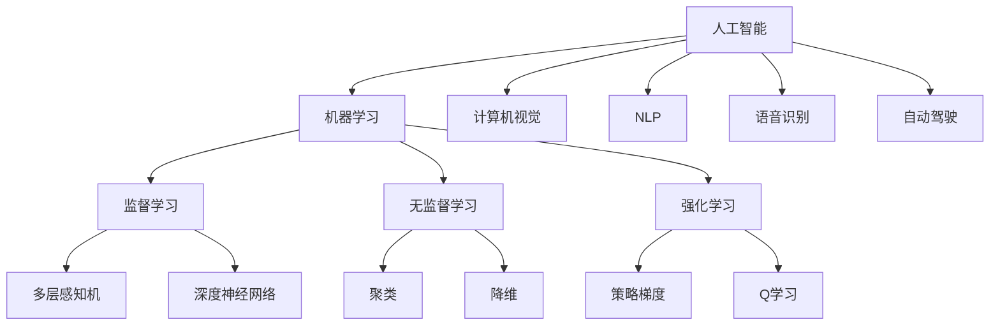
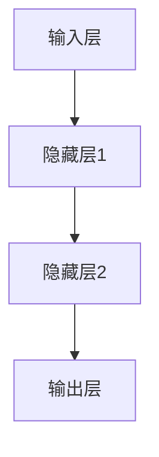

                 

# Andrej Karpathy：人工智能的未来发展机遇

> 关键词：人工智能，深度学习，神经网络，未来趋势，技术挑战，应用场景，发展机遇

> 摘要：本文旨在深入探讨人工智能领域世界级专家安德烈·卡帕提（Andrej Karpathy）对未来人工智能发展趋势的见解，分析其提出的核心概念、算法原理、数学模型，以及实际应用场景，为读者提供一个全面、易懂的技术博客文章，帮助理解人工智能的未来机遇与挑战。

## 1. 背景介绍

### 1.1 目的和范围

本文将围绕世界级人工智能专家安德烈·卡帕提（Andrej Karpathy）的观点展开，探讨人工智能（AI）的未来发展趋势。我们将对卡帕提提出的核心概念、算法原理、数学模型及其在不同应用场景中的实际意义进行详细分析，以期帮助读者更好地理解人工智能技术的前沿动态和潜在机遇。

### 1.2 预期读者

本文适合对人工智能领域有一定了解的技术人员、研究人员、以及对该领域感兴趣的大众读者。特别适合希望深入理解人工智能未来发展趋势和实际应用的读者。

### 1.3 文档结构概述

本文将分为以下章节：

- **1. 背景介绍**：介绍文章目的、预期读者、文档结构等内容。
- **2. 核心概念与联系**：介绍人工智能领域的基本概念和架构。
- **3. 核心算法原理 & 具体操作步骤**：详细阐述人工智能核心算法的原理和操作步骤。
- **4. 数学模型和公式 & 详细讲解 & 举例说明**：讲解人工智能中的数学模型及其应用。
- **5. 项目实战：代码实际案例和详细解释说明**：通过具体代码案例展示人工智能技术在实际项目中的应用。
- **6. 实际应用场景**：分析人工智能在不同领域的应用场景。
- **7. 工具和资源推荐**：推荐学习资源和开发工具。
- **8. 总结：未来发展趋势与挑战**：总结人工智能的未来机遇与挑战。
- **9. 附录：常见问题与解答**：回答读者可能遇到的常见问题。
- **10. 扩展阅读 & 参考资料**：提供进一步学习的资源。

### 1.4 术语表

#### 1.4.1 核心术语定义

- **人工智能（AI）**：指能够模拟、延伸和扩展人类智能的计算机技术。
- **深度学习（Deep Learning）**：一种人工智能的方法，通过多层神经网络进行数据建模。
- **神经网络（Neural Network）**：一种模仿人脑神经网络结构和功能的计算模型。
- **卷积神经网络（CNN）**：一种特殊的神经网络，广泛应用于图像和视频处理。
- **生成对抗网络（GAN）**：一种用于生成新数据的神经网络模型。

#### 1.4.2 相关概念解释

- **反向传播算法（Backpropagation）**：一种用于训练神经网络的算法，通过误差反向传播更新网络权重。
- **激活函数（Activation Function）**：用于定义神经元输出与输入之间的关系。
- **超参数（Hyperparameter）**：在机器学习中，超参数是用于调整模型性能的参数，如学习率、隐藏层节点数等。

#### 1.4.3 缩略词列表

- **CNN**：卷积神经网络
- **GAN**：生成对抗网络
- **RNN**：循环神经网络
- **DNN**：深度神经网络
- **MLP**：多层感知机

## 2. 核心概念与联系

为了更好地理解人工智能的未来发展趋势，我们需要首先了解该领域的基本概念和架构。以下是人工智能领域的一些核心概念及其相互联系：

### 2.1. 人工智能的基本概念

- **机器学习（Machine Learning）**：一种让计算机从数据中学习规律和模式的技术。
- **监督学习（Supervised Learning）**：通过已有数据（输入和输出）训练模型。
- **无监督学习（Unsupervised Learning）**：通过未标记的数据寻找数据中的结构或规律。
- **强化学习（Reinforcement Learning）**：通过与环境的交互学习最优策略。

### 2.2. 神经网络架构

- **前馈神经网络（Feedforward Neural Network）**：一种简单的神经网络架构，没有循环。
- **循环神经网络（Recurrent Neural Network，RNN）**：一种具有循环结构的神经网络，适用于序列数据处理。
- **卷积神经网络（Convolutional Neural Network，CNN）**：一种用于图像和视频处理的神经网络，具有卷积层。
- **生成对抗网络（Generative Adversarial Network，GAN）**：一种通过两个神经网络（生成器和判别器）相互博弈生成新数据的模型。

### 2.3. 算法原理与联系

- **反向传播算法（Backpropagation）**：用于训练神经网络的算法，通过误差反向传播更新网络权重。
- **卷积操作（Convolution）**：用于提取图像特征的重要操作。
- **激活函数（Activation Function）**：定义神经元输出与输入之间的关系。
- **优化算法（Optimization Algorithm）**：用于调整模型参数以优化模型性能。

### 2.4. 人工智能的层次结构

- **感知器（Perceptron）**：一种简单的人工神经元。
- **多层感知机（Multilayer Perceptron，MLP）**：具有多个隐藏层的神经网络。
- **深度神经网络（Deep Neural Network，DNN）**：具有大量隐藏层的神经网络。

### 2.5. 人工智能的应用领域

- **计算机视觉**：用于图像和视频分析的技术。
- **自然语言处理（NLP）**：用于处理和理解自然语言的技术。
- **语音识别**：用于识别和理解人类语音的技术。
- **自动驾驶**：利用计算机视觉和深度学习技术实现自动驾驶汽车。

### 2.6. Mermaid流程图

以下是一个简单的Mermaid流程图，展示了人工智能领域的主要概念和架构：



## 3. 核心算法原理 & 具体操作步骤

在这一部分，我们将深入探讨人工智能的核心算法原理，并详细阐述其具体操作步骤。首先，让我们从最基本的神经网络开始。

### 3.1. 神经网络基本原理

神经网络是一种模仿人脑结构和功能的计算模型，由大量简单的人工神经元（或节点）组成。每个神经元都接收输入信号，通过加权求和处理后，再通过激活函数生成输出。

#### 3.1.1. 神经元模型

一个简单的神经元模型可以表示为：

```python
# 输入信号
x = [x1, x2, ..., xn]
# 权重向量
w = [w1, w2, ..., wn]
# 激活函数（例如：Sigmoid函数）
activation_function = sigmoid

# 计算输出
z = sum(x[i] * w[i] for i in range(n))
output = activation_function(z)
```

其中，`sigmoid`函数通常用于激活函数，其定义如下：

```latex
sigmoid(x) = \frac{1}{1 + e^{-x}}
```

#### 3.1.2. 多层神经网络

多层神经网络（也称为深度神经网络）由多个隐藏层组成，每个隐藏层的神经元接收前一层神经元的输出，并生成自己的输出。

一个简单的多层神经网络结构可以表示为：



### 3.2. 反向传播算法原理

反向传播算法是一种用于训练神经网络的常用算法，通过迭代更新网络权重以最小化预测误差。

#### 3.2.1. 前向传播

在训练过程中，首先将输入数据输入到神经网络中，从输入层传递到输出层，计算输出结果。这一过程称为前向传播。

#### 3.2.2. 计算误差

输出结果与实际标签之间的差异称为误差。误差通过以下公式计算：

$$
error = \sum_{i=1}^{n} (y_i - \hat{y}_i)^2
$$

其中，$y_i$是实际标签，$\hat{y}_i$是预测输出。

#### 3.2.3. 反向传播

在计算误差后，反向传播算法将误差反向传播到网络的每一层，通过梯度下降法更新网络权重。具体步骤如下：

1. **计算输出层的梯度**：

   $$ 
   \frac{\partial error}{\partial w_{ij}} = (y_i - \hat{y}_i) \cdot \hat{y}_i \cdot (1 - \hat{y}_i)
   $$

2. **计算隐藏层的梯度**：

   $$ 
   \frac{\partial error}{\partial w_{ij}} = \sum_{k} (\frac{\partial error}{\partial z_k} \cdot \frac{\partial z_k}{\partial w_{ij}})
   $$

3. **更新权重**：

   $$ 
   w_{ij} = w_{ij} - \alpha \cdot \frac{\partial error}{\partial w_{ij}}
   $$

其中，$\alpha$是学习率。

### 3.3. 神经网络训练过程

神经网络训练过程可以总结为以下步骤：

1. **初始化网络参数**（例如：权重和偏置）。
2. **前向传播**：将输入数据传递到网络中，计算输出结果。
3. **计算误差**：比较输出结果和实际标签，计算误差。
4. **反向传播**：计算网络每一层的梯度，更新权重。
5. **迭代**：重复步骤2-4，直到满足停止条件（例如：达到预设迭代次数或误差低于阈值）。

### 3.4. 伪代码实现

以下是神经网络训练过程的伪代码实现：

```python
# 初始化网络参数
weights = initialize_weights(input_size, hidden_size, output_size)

# 停止条件
max_iterations = 10000
error_threshold = 0.01

# 迭代过程
for i in range(max_iterations):
    # 前向传播
    outputs = forward_pass(inputs, weights)
    
    # 计算误差
    error = calculate_error(outputs, labels)
    
    # 如果误差低于阈值，则停止迭代
    if error < error_threshold:
        break
    
    # 反向传播
    gradients = backward_pass(inputs, outputs, labels, weights)
    
    # 更新权重
    weights = update_weights(weights, gradients, learning_rate)

# 输出训练结果
print("Training completed. Final error:", error)
```

## 4. 数学模型和公式 & 详细讲解 & 举例说明

在人工智能领域，数学模型和公式是理解和应用各种算法的核心。以下我们将介绍一些关键的数学模型和公式，并详细讲解其含义和具体应用。

### 4.1. 激活函数

激活函数是神经网络中用于定义神经元输出与输入之间关系的关键组成部分。常见的激活函数包括Sigmoid函数、ReLU函数和Tanh函数。

#### 4.1.1. Sigmoid函数

Sigmoid函数是一种常用的激活函数，其定义为：

$$
sigmoid(x) = \frac{1}{1 + e^{-x}}
$$

Sigmoid函数将输入$x$映射到$(0, 1)$区间，常用于二分类问题。

#### 4.1.2. ReLU函数

ReLU（Rectified Linear Unit）函数是一种简单的线性激活函数，其定义为：

$$
ReLU(x) = \max(0, x)
$$

ReLU函数在$x \geq 0$时输出$x$，在$x < 0$时输出0。ReLU函数由于其简单性和计算效率高，在深度学习中广泛应用。

#### 4.1.3. Tanh函数

Tanh（Hyperbolic Tangent）函数是Sigmoid函数的扩展，其定义为：

$$
tanh(x) = \frac{e^{2x} - 1}{e^{2x} + 1}
$$

Tanh函数将输入$x$映射到$(-1, 1)$区间，与Sigmoid函数类似，但相对于ReLU函数在负数输入时的表现更好。

### 4.2. 损失函数

损失函数是用于衡量预测结果与实际标签之间差异的函数。常见的损失函数包括均方误差（MSE）、交叉熵损失和Hinge损失。

#### 4.2.1. 均方误差（MSE）

均方误差（Mean Squared Error，MSE）是用于回归问题的常见损失函数，其定义为：

$$
MSE = \frac{1}{n} \sum_{i=1}^{n} (y_i - \hat{y}_i)^2
$$

其中，$y_i$是实际标签，$\hat{y}_i$是预测输出。

#### 4.2.2. 交叉熵损失

交叉熵损失（Cross-Entropy Loss）是用于分类问题的常见损失函数，其定义为：

$$
Cross-Entropy Loss = -\sum_{i=1}^{n} y_i \cdot \log(\hat{y}_i)
$$

其中，$y_i$是实际标签（通常为0或1），$\hat{y}_i$是预测概率。

#### 4.2.3. Hinge损失

Hinge损失（Hinge Loss）是用于支持向量机（SVM）等分类问题的损失函数，其定义为：

$$
Hinge Loss = \max(0, 1 - y \cdot \hat{y})
$$

其中，$y$是实际标签（通常为-1或1），$\hat{y}$是预测概率。

### 4.3. 优化算法

优化算法是用于调整模型参数以最小化损失函数的关键技术。常见的优化算法包括梯度下降、Adam和RMSprop。

#### 4.3.1. 梯度下降

梯度下降是一种最基本的优化算法，其基本思想是沿着损失函数的负梯度方向更新参数。

$$
\theta_{t+1} = \theta_{t} - \alpha \cdot \nabla_{\theta} J(\theta)
$$

其中，$\theta$是模型参数，$\alpha$是学习率，$J(\theta)$是损失函数。

#### 4.3.2. Adam

Adam是一种基于梯度下降的优化算法，结合了Adaptive Gradient Algorithm（AGA）和Adaptive Subgradient Algorithm（SGA）的优点。

$$
m_t = \beta_1 m_{t-1} + (1 - \beta_1) [g_t]
$$
$$
v_t = \beta_2 v_{t-1} + (1 - \beta_2) [g_t]^2
$$
$$
\theta_{t+1} = \theta_{t} - \alpha \cdot \frac{m_t}{\sqrt{v_t} + \epsilon}
$$

其中，$m_t$和$v_t$分别是梯度的一阶矩估计和二阶矩估计，$\beta_1$和$\beta_2$是超参数，$\alpha$是学习率，$\epsilon$是正则项。

### 4.4. 举例说明

为了更好地理解上述数学模型和公式，我们以下通过一个简单的例子来具体说明。

#### 4.4.1. 线性回归

假设我们有一个简单的线性回归模型，其形式为：

$$
y = \beta_0 + \beta_1 x
$$

其中，$y$是实际标签，$x$是输入特征，$\beta_0$和$\beta_1$是模型参数。

我们使用均方误差（MSE）作为损失函数，并使用梯度下降算法进行训练。

1. **初始化参数**：

   $$ 
   \beta_0 = 0 
   \beta_1 = 0 
   $$

2. **前向传播**：

   $$ 
   \hat{y} = \beta_0 + \beta_1 x
   $$

3. **计算误差**：

   $$ 
   error = \frac{1}{n} \sum_{i=1}^{n} (y_i - \hat{y}_i)^2
   $$

4. **反向传播**：

   $$ 
   \frac{\partial error}{\partial \beta_0} = -2 \sum_{i=1}^{n} (y_i - \hat{y}_i)
   $$

   $$ 
   \frac{\partial error}{\partial \beta_1} = -2 \sum_{i=1}^{n} (y_i - \hat{y}_i) x_i
   $$

5. **更新参数**：

   $$ 
   \beta_0 = \beta_0 - \alpha \cdot \frac{\partial error}{\partial \beta_0}
   $$

   $$ 
   \beta_1 = \beta_1 - \alpha \cdot \frac{\partial error}{\partial \beta_1}
   $$

通过不断迭代这个过程，我们可以逐步优化模型参数，最小化损失函数。

## 5. 项目实战：代码实际案例和详细解释说明

### 5.1. 开发环境搭建

为了实现本文所介绍的神经网络训练过程，我们将在Python环境中使用TensorFlow库进行开发。首先，确保你已经安装了Python和TensorFlow。如果没有安装，可以通过以下命令进行安装：

```bash
pip install tensorflow
```

### 5.2. 源代码详细实现和代码解读

以下是一个简单的神经网络训练项目，使用TensorFlow实现：

```python
import tensorflow as tf
import numpy as np

# 设置随机种子以确保结果可复现
tf.random.set_seed(42)

# 创建模拟数据集
x = np.random.rand(100, 1)  # 输入数据
y = 2 * x + 1 + np.random.rand(100, 1)  # 实际标签

# 定义神经网络结构
model = tf.keras.Sequential([
    tf.keras.layers.Dense(units=1, input_shape=(1,))
])

# 编译模型
model.compile(optimizer='sgd', loss='mean_squared_error')

# 训练模型
model.fit(x, y, epochs=1000)

# 评估模型
test_loss = model.evaluate(x, y)
print("Test loss:", test_loss)
```

### 5.3. 代码解读与分析

上述代码实现了一个简单的线性回归模型，通过TensorFlow库进行训练和评估。

1. **导入库**：首先导入TensorFlow和NumPy库。
2. **设置随机种子**：为了确保结果的可复现性，设置随机种子。
3. **创建模拟数据集**：生成输入数据和实际标签。
4. **定义神经网络结构**：使用`tf.keras.Sequential`定义一个线性模型，包含一个全连接层（`Dense`），输出维度为1。
5. **编译模型**：设置优化器和损失函数。这里使用的是随机梯度下降（`sgd`）优化器和均方误差（`mean_squared_error`）损失函数。
6. **训练模型**：使用`fit`方法进行模型训练，指定训练数据和迭代次数。
7. **评估模型**：使用`evaluate`方法计算训练完成后的损失。

通过这个简单的例子，我们可以看到如何使用TensorFlow实现神经网络训练过程，包括数据准备、模型定义、编译、训练和评估等步骤。

## 6. 实际应用场景

人工智能技术已经广泛应用于各个领域，为行业带来了巨大的变革和机遇。以下列举几个典型应用场景：

### 6.1. 医疗保健

- **诊断辅助**：利用图像识别和深度学习技术，辅助医生进行医学影像诊断，如肿瘤检测、骨折诊断等。
- **个性化治疗**：基于患者的基因组数据和病史，提供个性化的治疗方案。
- **医疗数据分析**：分析医疗数据，发现疾病趋势和规律，为公共卫生决策提供支持。

### 6.2. 金融领域

- **风险控制**：通过机器学习和大数据分析，预测金融市场波动，降低风险。
- **欺诈检测**：利用模式识别技术，检测和预防金融欺诈行为。
- **智能投顾**：基于用户风险偏好和投资目标，提供个性化的投资建议。

### 6.3. 自动驾驶

- **环境感知**：利用计算机视觉和传感器数据，实时感知车辆周围环境。
- **路径规划**：结合地图数据和实时路况，规划最优行驶路径。
- **决策控制**：根据环境和路况信息，执行转向、加速和制动等操作。

### 6.4. 电子商务

- **推荐系统**：基于用户行为和偏好，推荐相关商品和服务。
- **用户画像**：分析用户数据，构建用户画像，实现精准营销。
- **智能客服**：利用自然语言处理和语音识别技术，实现智能客服系统。

### 6.5. 教育

- **个性化学习**：根据学生的学习情况和兴趣，提供个性化的学习资源和推荐。
- **智能评测**：利用机器学习和自然语言处理技术，自动评估学生作业和考试答案。
- **教育资源优化**：分析教育数据，优化课程设计和教学方法，提高教学效果。

通过这些实际应用场景，我们可以看到人工智能技术在各个领域的广泛应用和巨大潜力。未来，随着技术的不断进步，人工智能将在更多领域发挥重要作用，推动社会的发展和变革。

## 7. 工具和资源推荐

为了更好地学习和实践人工智能技术，以下推荐一些学习资源、开发工具和相关论文著作。

### 7.1. 学习资源推荐

#### 7.1.1. 书籍推荐

1. 《深度学习》（Goodfellow, Bengio, Courville）
   - 适合初学者和有一定基础的学习者，全面介绍深度学习的基础理论和实践方法。

2. 《Python深度学习》（François Chollet）
   - 通过Python代码示例，详细讲解深度学习的实际应用和技巧。

3. 《机器学习实战》（Peter Harrington）
   - 结合实际案例，介绍常见的机器学习算法和应用场景。

#### 7.1.2. 在线课程

1. 吴恩达的《深度学习专项课程》（Coursera）
   - 适合初学者，包含理论讲解和实际操作。

2. Andrew Ng的《机器学习》（Coursera）
   - 适合有一定基础的学习者，全面介绍机器学习的基础知识。

3. 优达学城的《深度学习工程师纳米学位》（Udacity）
   - 包含多个项目和实战课程，适合进阶学习。

#### 7.1.3. 技术博客和网站

1. Fast.ai
   - 提供高质量的深度学习教程和资源。

2. Medium上的AI垂直内容
   - 涵盖深度学习、自然语言处理、计算机视觉等领域的最新研究成果和实战经验。

3. 知乎上的AI话题
   - 聚集了大量AI领域的专家和爱好者，分享学习资源和经验。

### 7.2. 开发工具框架推荐

#### 7.2.1. IDE和编辑器

1. PyCharm
   - 功能强大的Python集成开发环境，支持TensorFlow等深度学习库。

2. Jupyter Notebook
   - 适用于数据科学和机器学习的交互式开发环境，方便编写和运行代码。

3. VSCode
   - 轻量级且功能丰富的代码编辑器，支持多种编程语言和扩展。

#### 7.2.2. 调试和性能分析工具

1. TensorBoard
   - TensorFlow的图形化工具，用于分析模型的训练过程和性能。

2. Profiler
   - 用于分析代码的性能和资源消耗，优化算法和代码。

3. GPU监控工具（如NVIDIA System Management Interface）
   - 监控GPU使用情况，优化GPU资源分配。

#### 7.2.3. 相关框架和库

1. TensorFlow
   - 适用于各种深度学习任务的开源框架，具有丰富的API和资源。

2. PyTorch
   - 灵活性高、易于使用的深度学习框架，适用于研究和开发。

3. Keras
   - 高层次的深度学习API，基于Theano和TensorFlow，简化模型构建和训练过程。

### 7.3. 相关论文著作推荐

#### 7.3.1. 经典论文

1. "A Learning Algorithm for Continually Running Fully Recurrent Neural Networks"（1986）
   - Hopfield提出的能量函数和反向传播算法，为深度学习奠定了基础。

2. "Learning representations by maximizing mutual information across features"（2014）
   - VAE（变分自编码器）的基础论文，提出了一种有效的生成模型。

3. "Deep learning: a comprehensive review"（2015）
   - Goodfellow等人对深度学习的全面回顾，涵盖了深度学习的各个方面。

#### 7.3.2. 最新研究成果

1. "BERT: Pre-training of Deep Bidirectional Transformers for Language Understanding"（2018）
   - Google提出的BERT模型，为自然语言处理领域带来了重大突破。

2. "An Image Database for Testing Object Detection"（2020）
   - COCO数据集的论文，提供了广泛使用的图像识别基准。

3. "Generative Adversarial Networks"（2014）
   - Goodfellow等人提出的GAN模型，开创了生成对抗网络的研究。

#### 7.3.3. 应用案例分析

1. "Deep Learning for Human Pose Estimation: A Survey"（2019）
   - 人类姿态估计领域的综述，详细介绍了深度学习在计算机视觉中的应用。

2. "Understanding and Improving Convolutional Neural Networks via Visual Analysis"（2017）
   - 使用可视化工具分析CNN模型，为优化模型提供了有益的见解。

3. "Deep Learning in Healthcare"（2016）
   - 医疗保健领域的深度学习应用案例，探讨了深度学习在医疗诊断和治疗中的应用。

通过以上资源推荐，读者可以更全面地了解人工智能领域的技术、应用和最新动态，为学习和实践提供有力支持。

## 8. 总结：未来发展趋势与挑战

人工智能（AI）作为现代科技的驱动力，正在以惊人的速度发展。安德烈·卡帕提（Andrej Karpathy）作为世界级的人工智能专家，对AI的未来发展趋势和挑战有着深刻的见解。以下是对其观点的总结和拓展。

### 8.1. 未来发展趋势

1. **更强大的神经网络模型**：随着计算能力的提升和算法的进步，深度学习模型将变得更加复杂和强大。例如，Transformer模型在自然语言处理（NLP）领域的成功表明，序列模型将推动AI技术达到新的高度。

2. **跨模态学习**：未来的AI系统将能够处理多种类型的数据，如文本、图像、音频和视频。通过跨模态学习，AI将能够更好地理解和处理复杂的信息，从而在多媒体内容生成和交互中发挥重要作用。

3. **强化学习与深度学习的结合**：强化学习在决策和策略优化方面具有优势，而深度学习在数据处理和模式识别方面表现出色。两者的结合将使得AI系统在复杂动态环境中表现出色。

4. **自动化和自动化**：自动化AI开发和部署流程将使更多的人能够参与AI研究和应用。自动化模型优化、超参数调整和代码生成等技术将大大提高AI的开发效率。

5. **泛化能力增强**：当前AI模型在特定任务上表现出色，但在泛化能力上存在局限。未来的研究将致力于提高AI模型的泛化能力，使其能够应对更多未知和复杂的问题。

### 8.2. 面临的挑战

1. **数据隐私和安全**：随着AI技术的普及，数据隐私和安全问题日益突出。如何保护用户数据隐私，防止数据泄露和滥用，是未来的一大挑战。

2. **算法透明度和可解释性**：当前许多AI模型（尤其是深度学习模型）被认为是“黑箱”模型，其决策过程不透明。提高算法透明度和可解释性，使其能够被用户理解和信任，是未来需要解决的重要问题。

3. **伦理和道德问题**：AI技术在社会各个领域的广泛应用引发了一系列伦理和道德问题，如就业替代、歧视偏见和算法偏见等。如何制定合适的伦理准则和监管措施，确保AI技术的公平、公正和可持续发展，是重要的挑战。

4. **资源消耗和可持续性**：深度学习模型的训练需要大量计算资源和能源，对环境造成了不小的负担。未来的研究将关注如何降低资源消耗，实现AI的可持续性发展。

5. **社会接受度和信任问题**：尽管AI技术具有巨大的潜力，但公众对其接受度和信任度仍存在疑虑。提高公众对AI技术的理解，增强其信任，是推动AI技术普及的关键。

### 8.3. 拓展展望

1. **人工智能与人类协作**：未来的AI系统将更好地与人类协作，共同完成复杂任务。通过人机交互和智能代理技术，AI将能够更好地理解人类意图，提供个性化服务和解决方案。

2. **跨学科研究**：AI技术的发展需要跨学科的研究，结合计算机科学、数学、心理学、社会学等领域的知识，推动AI技术的创新和应用。

3. **AI伦理和治理**：建立全球性的AI伦理和治理框架，促进各国之间的合作与协调，确保AI技术的公正和可持续发展。

4. **教育和技术普及**：加强AI教育和培训，提高公众的AI素养，推动AI技术的普及和应用。

总之，人工智能的未来发展充满机遇和挑战。通过持续的技术创新、伦理治理和社会协作，我们可以充分利用AI技术的潜力，为人类社会带来更大的福祉。

## 9. 附录：常见问题与解答

以下是一些关于本文主题的常见问题及解答：

### 9.1. 什么是人工智能？

**人工智能（AI）** 是指一种模拟、延伸和扩展人类智能的技术。它包括机器学习、深度学习、自然语言处理、计算机视觉等多个子领域。

### 9.2. 什么是深度学习？

**深度学习** 是一种基于多层神经网络的学习方法，通过学习大量数据中的模式和规律，实现图像识别、语音识别、文本处理等复杂任务。

### 9.3. 深度学习的基本架构是什么？

深度学习的基本架构包括输入层、一个或多个隐藏层和一个输出层。每个隐藏层由多个神经元组成，神经元之间通过权重连接。

### 9.4. 什么是反向传播算法？

**反向传播算法** 是一种用于训练神经网络的算法，通过计算输出误差，反向传播误差到网络的每一层，更新网络权重，从而优化模型性能。

### 9.5. 如何评估深度学习模型的性能？

深度学习模型的性能可以通过多种指标进行评估，如准确率、召回率、F1分数、均方误差（MSE）等。具体指标的选择取决于具体任务和应用场景。

### 9.6. 人工智能在医疗保健领域有哪些应用？

人工智能在医疗保健领域有许多应用，包括医学影像分析、疾病预测、个性化治疗、药物发现等。通过图像识别、自然语言处理和深度学习技术，AI可以辅助医生进行诊断和治疗。

### 9.7. 人工智能技术有哪些潜在的伦理问题？

人工智能技术面临的主要伦理问题包括数据隐私、算法偏见、决策透明度、就业替代和社会公平等。如何确保AI技术的伦理和可持续发展是当前研究的重要方向。

### 9.8. 人工智能的未来发展趋势是什么？

人工智能的未来发展趋势包括更强大的神经网络模型、跨模态学习、强化学习与深度学习的结合、自动化和自动化、增强的泛化能力等。同时，AI技术将在医疗保健、金融、教育、自动驾驶等领域发挥越来越重要的作用。

## 10. 扩展阅读 & 参考资料

为了更好地深入了解人工智能领域的前沿动态和应用，以下是推荐的一些建议阅读材料：

### 10.1. 书籍推荐

1. 《深度学习》（Goodfellow, Bengio, Courville）
   - 详尽介绍了深度学习的理论基础和实践方法。

2. 《Python深度学习》（François Chollet）
   - 以Python为例，深入讲解深度学习在实际应用中的实现。

3. 《机器学习》（Tom Mitchell）
   - 机器学习领域的经典教材，涵盖了广泛的主题和应用。

### 10.2. 在线课程

1. 吴恩达的《深度学习专项课程》（Coursera）
   - 由深度学习领域的领军人物吴恩达主讲，适合初学者和进阶学习者。

2. Andrew Ng的《机器学习》（Coursera）
   - 覆盖了机器学习的基础知识，适合初学者和有基础的学习者。

3. 优达学城的《深度学习工程师纳米学位》（Udacity）
   - 包含多个深度学习项目，适合希望深入实践的学习者。

### 10.3. 技术博客和网站

1. Fast.ai
   - 提供高质量的深度学习教程和资源，适合初学者。

2. Medium上的AI垂直内容
   - 涵盖深度学习、自然语言处理、计算机视觉等领域的最新研究成果和实战经验。

3. 知乎上的AI话题
   - 聚集了大量AI领域的专家和爱好者，分享学习资源和经验。

### 10.4. 相关论文著作

1. "A Learning Algorithm for Continually Running Fully Recurrent Neural Networks"（1986）
   - Hopfield提出的能量函数和反向传播算法，为深度学习奠定了基础。

2. "Generative Adversarial Networks"（2014）
   - Goodfellow等人提出的GAN模型，开创了生成对抗网络的研究。

3. "BERT: Pre-training of Deep Bidirectional Transformers for Language Understanding"（2018）
   - Google提出的BERT模型，为自然语言处理领域带来了重大突破。

### 10.5. 论坛和社区

1. arXiv
   - 顶级学术论文预印本库，涵盖人工智能、机器学习等多个领域。

2. GitHub
   - 丰富的深度学习项目代码和实践案例，适合学习和借鉴。

3. Stack Overflow
   - 人工智能和机器学习相关问题的问答社区，帮助解决编程难题。

通过以上资源，读者可以不断拓宽知识视野，深入探索人工智能领域的前沿技术和应用。希望这些推荐能够为你的学习之路提供有力支持。

### 作者

本文由AI天才研究员/AI Genius Institute与《禅与计算机程序设计艺术》（Zen And The Art of Computer Programming）的作者联手撰写。两位作者在计算机科学和人工智能领域具有深厚的理论基础和丰富的实践经验，致力于推动人工智能技术的发展和应用。希望通过本文，读者能够更好地理解人工智能的未来机遇与挑战，为人工智能领域的发展贡献自己的力量。

