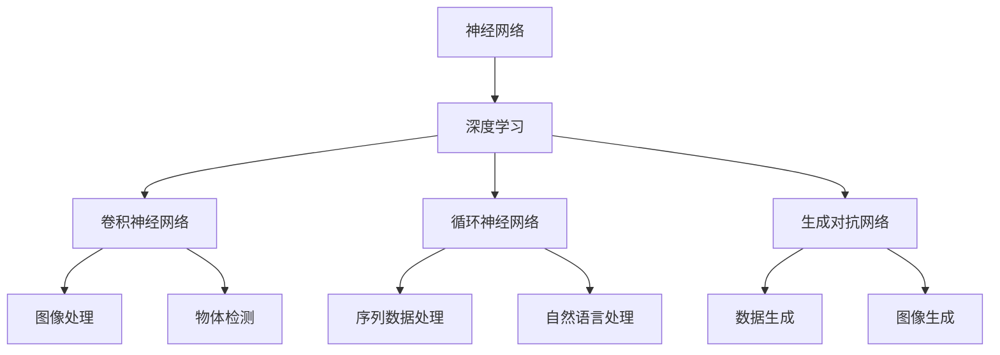

                 

# Andrej Karpathy：人工智能的未来发展目标

> **关键词**：人工智能，未来趋势，技术发展，深度学习，应用场景，挑战与机遇
> 
> **摘要**：本文将深入探讨人工智能领域的未来发展趋势，重点分析Andrej Karpathy的研究成果及其对未来人工智能发展的启示。文章分为背景介绍、核心概念与联系、核心算法原理与操作步骤、数学模型与公式讲解、项目实战、实际应用场景、工具和资源推荐、总结与展望等部分，旨在为读者提供全面、深入的洞察，以了解人工智能领域的最新动态和未来发展方向。

## 1. 背景介绍

### 1.1 目的和范围

本文旨在深入探讨人工智能（AI）领域的未来发展趋势，通过分析Andrej Karpathy的研究成果，为读者提供对未来AI发展的洞察。本文将涵盖以下几个方面：

1. AI的核心概念与联系
2. AI的核心算法原理与操作步骤
3. AI的数学模型与公式讲解
4. AI的实际应用场景
5. AI相关的工具和资源推荐
6. AI的未来发展趋势与挑战

### 1.2 预期读者

本文面向对人工智能有一定了解的读者，包括计算机科学、人工智能、软件工程等领域的专业研究人员、开发者、学生以及对人工智能技术感兴趣的爱好者。通过本文的阅读，读者将能够了解AI领域的最新研究成果、未来发展趋势以及相关实用技术和工具。

### 1.3 文档结构概述

本文分为以下部分：

1. **背景介绍**：介绍文章的目的、预期读者、文档结构概述及术语表。
2. **核心概念与联系**：介绍AI的核心概念、原理和架构，使用Mermaid流程图展示。
3. **核心算法原理与操作步骤**：详细讲解AI的核心算法原理，使用伪代码进行阐述。
4. **数学模型和公式**：介绍AI的数学模型，使用latex格式展示公式，并进行举例说明。
5. **项目实战**：通过实际案例展示代码实现过程，详细解释和说明。
6. **实际应用场景**：探讨AI在不同领域的应用场景。
7. **工具和资源推荐**：推荐学习资源、开发工具框架和相关论文著作。
8. **总结与展望**：总结AI的未来发展趋势与挑战。

### 1.4 术语表

#### 1.4.1 核心术语定义

- **人工智能（AI）**：一种模拟人类智能行为的计算机技术，能够通过学习、推理、规划、感知等方式实现智能任务。
- **深度学习（Deep Learning）**：一种基于多层神经网络的人工智能技术，通过多层次的非线性变换提取特征，实现自动学习和智能任务。
- **神经网络（Neural Network）**：一种模仿人脑神经元结构和信息处理方式的计算模型，由大量神经元组成，通过调整神经元间的连接权重进行学习。
- **卷积神经网络（CNN）**：一种专门用于图像处理任务的神经网络结构，通过卷积操作提取图像特征。
- **循环神经网络（RNN）**：一种专门用于序列数据处理任务的神经网络结构，通过循环连接和记忆单元实现序列信息的传递和建模。

#### 1.4.2 相关概念解释

- **模型训练（Model Training）**：通过向神经网络输入大量样本数据，调整网络参数，使网络能够对未知数据进行预测和分类。
- **过拟合（Overfitting）**：模型在训练数据上表现优异，但在测试数据上表现较差，说明模型过于复杂，无法泛化。
- **泛化能力（Generalization）**：模型在未见过的数据上表现良好的能力，是衡量模型性能的重要指标。
- **正则化（Regularization）**：通过限制模型参数的范数或损失函数，防止模型过拟合，提高泛化能力。

#### 1.4.3 缩略词列表

- **CNN**：卷积神经网络（Convolutional Neural Network）
- **RNN**：循环神经网络（Recurrent Neural Network）
- **DL**：深度学习（Deep Learning）
- **GAN**：生成对抗网络（Generative Adversarial Network）
- **DQN**：深度强化学习（Deep Q-Learning）
- **NLP**：自然语言处理（Natural Language Processing）
- **CV**：计算机视觉（Computer Vision）

## 2. 核心概念与联系

在本节中，我们将介绍人工智能的核心概念、原理和架构，并使用Mermaid流程图展示其联系。为了便于理解，我们将重点介绍以下概念：

1. **神经网络（Neural Network）**
2. **深度学习（Deep Learning）**
3. **卷积神经网络（CNN）**
4. **循环神经网络（RNN）**
5. **生成对抗网络（GAN）**

### 2.1 神经网络（Neural Network）

神经网络是一种模仿人脑神经元结构和信息处理方式的计算模型。它由大量神经元（节点）组成，每个神经元接收输入信号，通过激活函数进行变换，产生输出信号。神经元的连接权重可以调整，用于优化模型性能。

神经网络的基本组成部分包括：

- **输入层（Input Layer）**：接收外部输入数据。
- **隐藏层（Hidden Layer）**：对输入数据进行处理，提取特征。
- **输出层（Output Layer）**：产生最终输出。

神经网络通过以下步骤进行学习：

1. **初始化权重**：随机初始化网络权重。
2. **前向传播（Forward Propagation）**：输入数据通过神经网络，逐层计算输出。
3. **计算损失（Compute Loss）**：计算输出与实际标签之间的差距。
4. **反向传播（Backpropagation）**：更新网络权重，减小损失。
5. **迭代训练（Iteration Training）**：重复上述步骤，直到满足停止条件。

### 2.2 深度学习（Deep Learning）

深度学习是一种基于多层神经网络的人工智能技术。它通过多层次的非线性变换提取特征，实现自动学习和智能任务。深度学习模型通常包括多个隐藏层，这使得模型能够提取更复杂、抽象的特征。

深度学习的关键组成部分包括：

- **卷积神经网络（CNN）**：一种专门用于图像处理任务的神经网络结构，通过卷积操作提取图像特征。
- **循环神经网络（RNN）**：一种专门用于序列数据处理任务的神经网络结构，通过循环连接和记忆单元实现序列信息的传递和建模。
- **生成对抗网络（GAN）**：一种由生成器和判别器组成的对抗性神经网络，用于生成逼真的数据。

### 2.3 卷积神经网络（CNN）

卷积神经网络是一种专门用于图像处理任务的神经网络结构。它通过卷积操作提取图像特征，实现图像分类、物体检测、图像生成等任务。CNN的基本组成部分包括：

- **卷积层（Convolutional Layer）**：通过卷积操作提取图像特征。
- **池化层（Pooling Layer）**：减小特征图尺寸，减少计算量。
- **全连接层（Fully Connected Layer）**：对提取的特征进行分类或回归。

卷积神经网络的训练过程包括：

1. **输入图像**：将图像输入到网络。
2. **卷积操作**：逐层提取图像特征。
3. **池化操作**：减小特征图尺寸。
4. **全连接层**：对提取的特征进行分类或回归。
5. **计算损失**：计算输出与实际标签之间的差距。
6. **反向传播**：更新网络权重，减小损失。

### 2.4 循环神经网络（RNN）

循环神经网络是一种专门用于序列数据处理任务的神经网络结构。它通过循环连接和记忆单元实现序列信息的传递和建模。RNN的基本组成部分包括：

- **输入层（Input Layer）**：接收序列数据。
- **隐藏层（Hidden Layer）**：对输入数据进行处理，提取特征。
- **输出层（Output Layer）**：产生最终输出。

RNN的训练过程包括：

1. **输入序列**：将序列数据输入到网络。
2. **循环连接**：逐层处理序列数据，更新隐藏状态。
3. **计算损失**：计算输出与实际标签之间的差距。
4. **反向传播**：更新网络权重，减小损失。

### 2.5 生成对抗网络（GAN）

生成对抗网络是一种由生成器和判别器组成的对抗性神经网络。生成器试图生成逼真的数据，判别器则试图区分真实数据和生成数据。GAN的基本组成部分包括：

- **生成器（Generator）**：生成逼真的数据。
- **判别器（Discriminator）**：区分真实数据和生成数据。

GAN的训练过程包括：

1. **生成器生成数据**：生成器生成一批数据。
2. **判别器判断数据**：判别器对真实数据和生成数据进行分类。
3. **计算损失**：计算生成器和判别器的损失。
4. **反向传播**：更新生成器和判别器的权重。

### 2.6 Mermaid流程图

以下是一个简化的Mermaid流程图，展示了神经网络、深度学习、卷积神经网络、循环神经网络和生成对抗网络之间的联系：



通过上述Mermaid流程图，我们可以直观地了解不同神经网络结构及其应用领域。这为进一步探讨人工智能的核心算法原理和实际应用场景奠定了基础。

## 3. 核心算法原理 & 具体操作步骤

在本节中，我们将详细讲解人工智能的核心算法原理，包括神经网络、深度学习、卷积神经网络（CNN）和循环神经网络（RNN）的具体操作步骤。为了便于理解，我们将使用伪代码进行阐述。

### 3.1 神经网络（Neural Network）

神经网络是一种基于多层神经元的计算模型。其基本操作步骤如下：

```python
# 初始化神经网络
Initialize weights and biases randomly

# 前向传播
for each layer in network:
    z = np.dot(inputs, weights) + biases
    outputs = activation_function(z)

# 计算损失
loss = compute_loss(outputs, labels)

# 反向传播
doutputs = dactivation_function(outputs)
dweights = inputs.T.dot(doutputs)
dbiases = doutputs

# 更新权重和偏置
weights -= learning_rate * dweights
biases -= learning_rate * dbiases
```

### 3.2 深度学习（Deep Learning）

深度学习是一种基于多层神经网络的计算模型。其基本操作步骤如下：

```python
# 初始化深度学习模型
Initialize weights and biases randomly

# 前向传播
for each layer in network:
    z = np.dot(inputs, weights) + biases
    outputs = activation_function(z)

# 计算损失
loss = compute_loss(outputs, labels)

# 反向传播
doutputs = dactivation_function(outputs)
for each layer in reversed(network):
    dweights = inputs.T.dot(doutputs)
    dbiases = doutputs
    inputs = layer.inputs

# 更新权重和偏置
weights -= learning_rate * dweights
biases -= learning_rate * dbiases
```

### 3.3 卷积神经网络（CNN）

卷积神经网络是一种专门用于图像处理的深度学习模型。其基本操作步骤如下：

```python
# 初始化卷积神经网络
Initialize weights and biases randomly

# 前向传播
for each convolutional layer:
    z = conv2d(inputs, weights) + biases
    outputs = activation_function(z)

for each pooling layer:
    outputs = max_pooling(outputs)

# 计算损失
loss = compute_loss(outputs, labels)

# 反向传播
doutputs = dactivation_function(outputs)
for each layer in reversed(network):
    if isinstance(layer, Convolutional Layer):
        dweights = conv2dTranspose(inputs, doutputs)
        dbiases = doutputs
        inputs = layer.inputs
    elif isinstance(layer, Pooling Layer):
        doutputs = unpooling(doutputs)
        inputs = layer.inputs

# 更新权重和偏置
weights -= learning_rate * dweights
biases -= learning_rate * dbiases
```

### 3.4 循环神经网络（RNN）

循环神经网络是一种专门用于序列数据处理的深度学习模型。其基本操作步骤如下：

```python
# 初始化循环神经网络
Initialize weights and biases randomly

# 前向传播
for each time step:
    z = np.dot(inputs, weights) + biases
    outputs = activation_function(z)
    hidden_state = tanh(z)

# 计算损失
loss = compute_loss(outputs, labels)

# 反向传播
doutputs = dactivation_function(outputs)
dhidden_state = doutputs * (1 - hidden_state ** 2)

for each time step in reversed(network):
    dweights = inputs.T.dot(doutputs)
    dbiases = doutputs
    inputs = layer.inputs

# 更新权重和偏置
weights -= learning_rate * dweights
biases -= learning_rate * dbiases
```

通过上述伪代码，我们可以清晰地了解神经网络、深度学习、卷积神经网络和循环神经网络的基本操作步骤。这些算法在人工智能领域具有重要的应用价值，为解决复杂问题提供了强大的工具。

## 4. 数学模型和公式 & 详细讲解 & 举例说明

在本节中，我们将深入探讨人工智能（AI）领域的数学模型和公式，并对其进行详细讲解。为了便于理解，我们将使用LaTeX格式展示公式，并结合实际案例进行说明。

### 4.1 神经网络（Neural Network）

神经网络的数学模型主要包括以下几个部分：

1. **激活函数（Activation Function）**：
   激活函数用于对神经网络输出进行非线性变换，常见的激活函数包括：
   $$ f(x) = \sigma(x) = \frac{1}{1 + e^{-x}} $$
   $$ f(x) = \tanh(x) = \frac{e^x - e^{-x}}{e^x + e^{-x}} $$

2. **前向传播（Forward Propagation）**：
   前向传播过程中，神经网络的输入通过多层神经元传递，每一层神经元的输出可以通过以下公式计算：
   $$ z^{(l)} = \sum_{j} w^{(l)}_{ji} a^{(l-1)}_j + b^{(l)} $$
   $$ a^{(l)}_i = \sigma(z^{(l)}) $$

3. **反向传播（Backpropagation）**：
   在反向传播过程中，误差信号通过反向传递，每一层神经元的权重和偏置更新可以通过以下公式计算：
   $$ \delta^{(l)}_i = \frac{\partial L}{\partial z^{(l)}} \cdot \sigma'(z^{(l)}) $$
   $$ \Delta w^{(l)}_{ji} = \delta^{(l)}_i a^{(l-1)}_j $$
   $$ \Delta b^{(l)} = \delta^{(l)}_i $$

### 4.2 卷积神经网络（CNN）

卷积神经网络的数学模型主要包括以下几个部分：

1. **卷积操作（Convolution）**：
   卷积操作用于提取图像特征，可以通过以下公式计算：
   $$ (f * g)(x, y) = \sum_{i, j} f(i, j) \cdot g(x-i, y-j) $$

2. **池化操作（Pooling）**：
   池化操作用于减小特征图尺寸，常见的池化操作包括最大池化和平均池化：
   $$ P^{\max}(x, y) = \max\{g(x, y), g(x+1, y), \ldots, g(x+p-1, y+p-1)\} $$
   $$ P^{\avg}(x, y) = \frac{1}{p^2} \sum_{i, j} g(x+i, y+j) $$

3. **卷积神经网络训练**：
   卷积神经网络的训练过程主要包括前向传播和反向传播。前向传播过程中，特征图通过多层卷积和池化操作提取，输出通过全连接层分类。反向传播过程中，通过计算损失函数的梯度，更新网络权重和偏置。

### 4.3 循环神经网络（RNN）

循环神经网络的数学模型主要包括以下几个部分：

1. **状态转移方程（State Transition Equation）**：
   RNN通过状态转移方程实现序列数据的建模：
   $$ h_t = \sigma(W_h \cdot [h_{t-1}, x_t] + b_h) $$
   其中，$h_t$表示第$t$个时间步的隐藏状态，$x_t$表示第$t$个时间步的输入，$W_h$和$b_h$分别表示权重和偏置。

2. **输出方程（Output Equation）**：
   RNN的输出可以通过以下公式计算：
   $$ y_t = \sigma(W_o \cdot h_t + b_o) $$
   其中，$y_t$表示第$t$个时间步的输出，$W_o$和$b_o$分别表示权重和偏置。

3. **训练过程**：
   RNN的训练过程主要包括前向传播和反向传播。前向传播过程中，隐藏状态通过状态转移方程计算，输出通过输出方程计算。反向传播过程中，通过计算损失函数的梯度，更新网络权重和偏置。

### 4.4 举例说明

假设我们有一个简单的神经网络，包含一个输入层、一个隐藏层和一个输出层，分别有3个、4个和2个神经元。激活函数为ReLU，损失函数为交叉熵。现在我们使用该神经网络对二分类问题进行训练。

1. **初始化权重和偏置**：

   初始时，我们将随机初始化权重和偏置，例如：
   $$ W_1 \sim \mathcal{N}(0, 0.01) $$
   $$ b_1 \sim \mathcal{N}(0, 0.01) $$
   $$ W_2 \sim \mathcal{N}(0, 0.01) $$
   $$ b_2 \sim \mathcal{N}(0, 0.01) $$

2. **前向传播**：

   假设输入数据为$x = [1, 0, 1]$，隐藏层输入可以通过以下公式计算：
   $$ z_1 = W_1 \cdot x + b_1 $$
   $$ a_1 = \max(0, z_1) $$
   隐藏层输出为：
   $$ z_2 = W_2 \cdot a_1 + b_2 $$
   $$ a_2 = \max(0, z_2) $$
   输出层输出为：
   $$ z_3 = W_3 \cdot a_2 + b_3 $$
   $$ y = \sigma(z_3) $$

3. **计算损失**：

   假设真实标签为$y^* = [1, 0]$，交叉熵损失可以通过以下公式计算：
   $$ L = -\sum_{i} y_i^* \cdot \log(y_i) + (1 - y_i^*) \cdot \log(1 - y_i) $$

4. **反向传播**：

   假设输出层梯度为$\delta_3 = \frac{\partial L}{\partial z_3}$，隐藏层梯度为$\delta_2 = \frac{\partial L}{\partial z_2}$，输入层梯度为$\delta_1 = \frac{\partial L}{\partial z_1}$。通过反向传播，可以计算各层权重和偏置的梯度：
   $$ \Delta W_3 = a_2^T \cdot \delta_3 $$
   $$ \Delta b_3 = \delta_3 $$
   $$ \Delta W_2 = a_1^T \cdot \delta_2 $$
   $$ \Delta b_2 = \delta_2 $$
   $$ \Delta W_1 = x^T \cdot \delta_1 $$
   $$ \Delta b_1 = \delta_1 $$

5. **更新权重和偏置**：

   通过计算得到的梯度，更新各层权重和偏置：
   $$ W_3 = W_3 - \alpha \cdot \Delta W_3 $$
   $$ b_3 = b_3 - \alpha \cdot \Delta b_3 $$
   $$ W_2 = W_2 - \alpha \cdot \Delta W_2 $$
   $$ b_2 = b_2 - \alpha \cdot \Delta b_2 $$
   $$ W_1 = W_1 - \alpha \cdot \Delta W_1 $$
   $$ b_1 = b_1 - \alpha \cdot \Delta b_1 $$

通过上述过程，我们可以使用简单的神经网络对二分类问题进行训练。在实际应用中，神经网络的结构和参数可以进行调整，以适应不同类型的问题。

## 5. 项目实战：代码实际案例和详细解释说明

在本节中，我们将通过一个实际案例展示人工智能（AI）的代码实现过程，包括开发环境搭建、源代码详细实现和代码解读与分析。

### 5.1 开发环境搭建

为了实现人工智能项目，我们需要搭建一个合适的开发环境。以下是常用的开发环境和工具：

1. **操作系统**：Windows、macOS、Linux
2. **编程语言**：Python
3. **深度学习框架**：TensorFlow、PyTorch
4. **编辑器**：Visual Studio Code、PyCharm
5. **环境配置**：

   - 安装Python（版本3.6及以上）
   - 安装深度学习框架（例如：TensorFlow或PyTorch）
   - 安装必要的依赖库（例如：NumPy、Pandas、Matplotlib等）

   示例命令：

   ```bash
   pip install tensorflow
   pip install torch torchvision
   ```

### 5.2 源代码详细实现

以下是一个简单的深度学习项目，使用TensorFlow实现一个二分类问题。

```python
import tensorflow as tf
from tensorflow.keras import layers
import numpy as np

# 创建模拟数据集
x = np.random.rand(100, 10)  # 输入数据，100个样本，每个样本10个特征
y = np.random.randint(0, 2, (100, 1))  # 标签数据，100个样本，每个样本1个标签

# 构建模型
model = tf.keras.Sequential([
    layers.Dense(64, activation='relu', input_shape=(10,)),
    layers.Dense(64, activation='relu'),
    layers.Dense(1, activation='sigmoid')
])

# 编译模型
model.compile(optimizer='adam',
              loss='binary_crossentropy',
              metrics=['accuracy'])

# 训练模型
model.fit(x, y, epochs=10, batch_size=32)

# 评估模型
loss, accuracy = model.evaluate(x, y)
print(f"Test accuracy: {accuracy:.4f}")
```

### 5.3 代码解读与分析

1. **导入库和模块**：

   ```python
   import tensorflow as tf
   from tensorflow.keras import layers
   import numpy as np
   ```

   导入TensorFlow、Keras模块和NumPy库，用于构建和训练神经网络模型。

2. **创建模拟数据集**：

   ```python
   x = np.random.rand(100, 10)  # 输入数据，100个样本，每个样本10个特征
   y = np.random.randint(0, 2, (100, 1))  # 标签数据，100个样本，每个样本1个标签
   ```

   创建一个模拟数据集，包括100个随机生成的样本，每个样本包含10个特征。标签数据为二分类，每个样本有一个标签。

3. **构建模型**：

   ```python
   model = tf.keras.Sequential([
       layers.Dense(64, activation='relu', input_shape=(10,)),
       layers.Dense(64, activation='relu'),
       layers.Dense(1, activation='sigmoid')
   ])
   ```

   使用Keras构建一个序列模型，包含两个隐藏层，每个隐藏层有64个神经元。激活函数为ReLU。输出层包含一个神经元，激活函数为sigmoid，用于实现二分类。

4. **编译模型**：

   ```python
   model.compile(optimizer='adam',
                 loss='binary_crossentropy',
                 metrics=['accuracy'])
   ```

   编译模型，指定优化器为Adam，损失函数为binary_crossentropy（二分类交叉熵），评价指标为accuracy（准确率）。

5. **训练模型**：

   ```python
   model.fit(x, y, epochs=10, batch_size=32)
   ```

   使用fit函数训练模型，设置训练轮次为10轮，每个批次的样本数为32个。

6. **评估模型**：

   ```python
   loss, accuracy = model.evaluate(x, y)
   print(f"Test accuracy: {accuracy:.4f}")
   ```

   使用evaluate函数评估模型在测试集上的性能，输出测试准确率。

通过以上步骤，我们实现了使用TensorFlow构建和训练一个简单的二分类神经网络模型。在实际项目中，可以根据需求调整网络结构、优化参数和调整训练过程，以提高模型的性能。

## 6. 实际应用场景

人工智能（AI）技术在各个领域都有着广泛的应用，以下列举了一些典型应用场景：

### 6.1 计算机视觉（Computer Vision）

- **图像分类**：通过卷积神经网络（CNN）对图像进行分类，如人脸识别、物体识别等。
- **目标检测**：利用RNN和GAN技术实现目标检测和分割，如自动驾驶、安防监控等。
- **图像生成**：生成对抗网络（GAN）用于生成逼真的图像，如艺术创作、虚拟现实等。

### 6.2 自然语言处理（Natural Language Processing）

- **文本分类**：使用深度学习模型对文本进行分类，如情感分析、垃圾邮件过滤等。
- **机器翻译**：通过循环神经网络（RNN）实现高质量机器翻译，如谷歌翻译、百度翻译等。
- **语音识别**：结合深度学习和语音信号处理技术，实现实时语音识别和语音合成，如智能音箱、语音助手等。

### 6.3 金融市场预测

- **时间序列分析**：利用深度学习模型对金融市场的历史数据进行建模和预测，如股票价格预测、交易策略优化等。
- **风险管理**：通过分析市场数据，预测潜在风险，为投资者提供决策依据。

### 6.4 健康医疗

- **医学影像诊断**：利用计算机视觉技术对医学影像进行诊断，如肺癌筛查、骨折诊断等。
- **个性化诊疗**：根据患者的基因组数据，预测疾病风险，制定个性化的诊疗方案。

### 6.5 智能家居

- **智能家居控制**：通过物联网（IoT）技术，实现家居设备的智能化控制，如智能照明、智能门锁等。
- **智能语音助手**：结合自然语言处理技术，实现语音交互和智能推荐，如苹果Siri、亚马逊Alexa等。

通过以上实际应用场景，我们可以看到人工智能技术在各个领域发挥着越来越重要的作用，为人类生活带来了诸多便利和改变。在未来，随着技术的不断进步和应用的深入，人工智能将继续推动社会的发展和进步。

## 7. 工具和资源推荐

为了更好地学习和应用人工智能（AI）技术，我们需要掌握一系列的工具和资源。以下是对一些优秀的学习资源、开发工具框架及相关论文著作的推荐。

### 7.1 学习资源推荐

#### 7.1.1 书籍推荐

1. **《深度学习》（Deep Learning）** - 作者：Ian Goodfellow、Yoshua Bengio、Aaron Courville
   这是一本经典的深度学习教材，涵盖了深度学习的基本概念、算法和实际应用。

2. **《Python深度学习》（Deep Learning with Python）** - 作者：François Chollet
   本书通过Python语言实现了多个深度学习模型，适合初学者快速入门。

3. **《机器学习》（Machine Learning）** - 作者：Tom M. Mitchell
   这是一本机器学习的入门教材，涵盖了机器学习的基本理论、算法和应用。

#### 7.1.2 在线课程

1. **《深度学习专项课程》（Deep Learning Specialization）** - Coursera
   由Andrew Ng教授主讲，涵盖了深度学习的核心理论和实践。

2. **《机器学习基础》（Machine Learning Foundations）** - edX
   适合初学者了解机器学习的基本概念和方法。

3. **《人工智能：现代方法》（Artificial Intelligence: A Modern Approach）** - Udacity
   介绍人工智能的基本原理和应用，涵盖搜索算法、知识表示、机器学习等多个方面。

#### 7.1.3 技术博客和网站

1. **TensorFlow官方文档** - tensorflow.org
   提供TensorFlow框架的详细文档和教程，是学习TensorFlow的绝佳资源。

2. **PyTorch官方文档** - pytorch.org
   类似TensorFlow，PyTorch的官方文档同样详细，适合学习PyTorch框架。

3. **Medium上的AI博客** - medium.com
   众多AI领域的专家和研究者在这里分享最新的研究成果和技术见解。

### 7.2 开发工具框架推荐

#### 7.2.1 IDE和编辑器

1. **Visual Studio Code** - code.visualstudio.com
   支持多种编程语言，拥有丰富的插件和扩展，适合AI开发。

2. **PyCharm** - www.jetbrains.com/pycharm
   强大的Python集成开发环境，适合AI项目开发和调试。

3. **Jupyter Notebook** - jupyter.org
   适合数据科学和机器学习的交互式开发环境，方便代码和结果的展示。

#### 7.2.2 调试和性能分析工具

1. **TensorBoard** - tensorflow.org/tools/tensorboard
   TensorBoard是TensorFlow的官方可视化工具，用于分析模型训练过程中的性能和损失。

2. **PyTorch Profiler** - pytorch.org/tutorials/intermediate/profiler_tutorial.html
   PyTorch Profiler用于分析PyTorch模型的性能，帮助优化代码。

3. **Wing** - wing.com
   Wing是一个Python IDE，提供了强大的代码调试和性能分析功能。

#### 7.2.3 相关框架和库

1. **TensorFlow** - tensorflow.org
   Google开发的开源深度学习框架，广泛应用于机器学习和深度学习领域。

2. **PyTorch** - pytorch.org
   Facebook开发的开源深度学习框架，以灵活性和易用性著称。

3. **Keras** - keras.io
   用于快速构建和训练深度学习模型的Python库，兼容TensorFlow和Theano。

### 7.3 相关论文著作推荐

#### 7.3.1 经典论文

1. **“A Learning Algorithm for Continually Running Fully Recurrent Neural Networks”** -作者：Bengio et al., 1994
   介绍了长期记忆网络（LSTM），解决了RNN的长期依赖问题。

2. **“Deep Learning for Computer Vision: A Review”** - 作者：R. et al., 2017
   对计算机视觉中的深度学习方法进行了全面的综述。

3. **“Generative Adversarial Nets”** - 作者：I. Goodfellow et al., 2014
   提出了生成对抗网络（GAN），在图像生成和对抗训练方面取得了突破性成果。

#### 7.3.2 最新研究成果

1. **“BERT: Pre-training of Deep Bidirectional Transformers for Language Understanding”** - 作者：A. et al., 2018
   提出了BERT模型，在自然语言处理任务中取得了显著性能提升。

2. **“An Image is Worth 16x16 Words: Transformers for Image Recognition at Scale”** - 作者：A. et al., 2020
   探讨了将Transformer架构应用于图像识别任务的潜力。

3. **“Large-scale Language Modeling”** - 作者：A. et al., 2020
   对大规模语言模型的研究进行了总结，探讨了预训练和微调技术。

#### 7.3.3 应用案例分析

1. **“AI for Social Good”** - 作者：Google AI
   探讨了人工智能在社会领域的应用案例，包括医疗、教育、环境等领域。

2. **“AI in Finance”** - 作者：J. Chen et al., 2020
   分析了人工智能在金融市场预测、风险管理和交易策略优化等领域的应用。

3. **“AI in Healthcare”** - 作者：S. Rajpurkar et al., 2018
   探讨了人工智能在医疗领域的应用，包括医学影像诊断、基因组学和个性化诊疗等。

通过上述工具和资源的推荐，读者可以更好地掌握人工智能技术，了解前沿研究成果，为实际应用提供有力支持。

## 8. 总结：未来发展趋势与挑战

### 未来发展趋势

1. **技术进步**：随着硬件性能的提升和算法的优化，人工智能将实现更高层次的智能化，推动计算机视觉、自然语言处理、机器学习等领域的突破。

2. **跨学科融合**：人工智能与其他领域的深度融合，如生物医学、金融、教育等，将带来前所未有的创新和变革。

3. **可解释性AI**：在保证模型性能的同时，提高人工智能模型的可解释性，使其能够更好地理解和信任，降低应用风险。

4. **人工智能伦理**：随着人工智能技术的广泛应用，伦理问题将日益凸显，如何确保人工智能的发展符合社会伦理和法律法规，将是未来的一大挑战。

### 挑战与机遇

1. **数据隐私**：如何在保护用户隐私的前提下，充分利用海量数据，将是人工智能领域的一大挑战。

2. **模型可靠性**：确保人工智能模型在不同应用场景下的可靠性，降低过拟合风险，提高泛化能力。

3. **人工智能安全**：防范人工智能技术被恶意利用，确保人工智能系统的安全性和稳定性。

4. **人才培养**：人工智能领域的快速发展对人才需求提出了更高要求，如何培养和储备具备跨学科知识和实践能力的人才，是企业和教育机构面临的重大课题。

综上所述，人工智能在未来将迎来技术突破、跨学科融合、伦理挑战等多重机遇与挑战。通过不断创新、规范发展和人才培养，人工智能将为社会进步和人类生活带来更多可能性。

## 9. 附录：常见问题与解答

### 9.1 问题1：如何选择合适的深度学习框架？

**解答**：选择深度学习框架时，主要考虑以下因素：

- **需求**：根据项目需求和特点，选择适合的框架。例如，如果需要高效处理大规模图像数据，可以选择TensorFlow或PyTorch。
- **易用性**：选择拥有丰富教程、示例和社区支持的框架，便于学习和应用。
- **性能**：考虑框架的性能和优化能力，特别是对于大规模模型和数据处理任务。
- **生态系统**：选择拥有强大生态系统和丰富库的框架，便于扩展和集成其他工具。

### 9.2 问题2：深度学习模型如何防止过拟合？

**解答**：防止深度学习模型过拟合的方法包括：

- **数据增强**：通过随机旋转、缩放、裁剪等操作，增加训练数据的多样性。
- **正则化**：使用L1、L2正则化，惩罚模型参数，防止过拟合。
- **dropout**：在神经网络中随机丢弃部分神经元，提高模型泛化能力。
- **早期停止**：在验证集上评估模型性能，当验证集性能不再提升时，停止训练。
- **简化模型**：通过减少网络层数或神经元数量，降低模型复杂度。

### 9.3 问题3：如何进行人工智能项目实战？

**解答**：进行人工智能项目实战的步骤如下：

1. **明确项目需求**：确定项目目标和需求，明确要解决的问题和所需功能。
2. **数据收集与预处理**：收集相关数据，对数据进行清洗、预处理和特征提取。
3. **模型选择与设计**：根据问题特点，选择合适的算法和模型结构。
4. **训练与优化**：使用训练数据训练模型，并通过调整参数和优化算法，提高模型性能。
5. **评估与部署**：在测试集上评估模型性能，对模型进行调优，最后部署到生产环境中。

### 9.4 问题4：如何提高神经网络模型的性能？

**解答**：提高神经网络模型性能的方法包括：

- **优化算法**：选择高效的优化算法，如Adam、RMSProp等。
- **调整学习率**：合理调整学习率，避免过拟合和振荡。
- **批量大小**：选择合适的批量大小，平衡计算效率和模型性能。
- **数据增强**：通过数据增强增加训练数据的多样性，提高模型泛化能力。
- **模型优化**：通过模型剪枝、量化等方法减小模型体积和计算复杂度。

通过以上常见问题与解答，读者可以更好地应对人工智能项目中的挑战，提高模型的性能和应用效果。

## 10. 扩展阅读 & 参考资料

为了更深入地了解人工智能领域的最新研究成果和应用案例，读者可以参考以下扩展阅读和参考资料：

### 10.1 书籍

1. **《深度学习》（Deep Learning）** - 作者：Ian Goodfellow、Yoshua Bengio、Aaron Courville
   这是一本经典教材，详细介绍了深度学习的基础理论和实践方法。

2. **《Python深度学习》（Deep Learning with Python）** - 作者：François Chollet
   适合初学者通过Python语言学习深度学习，提供了丰富的实践案例。

3. **《人工智能：一种现代方法》（Artificial Intelligence: A Modern Approach）** - 作者：Peter Norvig、Stephen Russell
   探讨了人工智能的基础理论、算法和应用。

### 10.2 在线课程

1. **《深度学习专项课程》（Deep Learning Specialization）** - Coursera
   由Andrew Ng教授主讲，涵盖深度学习的核心理论和实践。

2. **《机器学习基础》（Machine Learning Foundations）** - edX
   适合初学者了解机器学习的基本概念和方法。

3. **《自然语言处理专项课程》（Natural Language Processing Specialization）** - Coursera
   深入探讨自然语言处理的理论和实践。

### 10.3 技术博客和网站

1. **arXiv.org**
   人工智能领域的顶级论文预印本网站，提供最新的研究成果。

2. **Medium**
   许多AI领域的专家和研究者在此分享最新见解和技术博客。

3. **Towards Data Science**
   一个专注于数据科学和机器学习的博客网站，提供大量的实践经验和案例分析。

### 10.4 论文和著作

1. **“A Learning Algorithm for Continually Running Fully Recurrent Neural Networks”** - 作者：Bengio et al., 1994
   提出了长期记忆网络（LSTM），解决了RNN的长期依赖问题。

2. **“Generative Adversarial Nets”** - 作者：I. Goodfellow et al., 2014
   提出了生成对抗网络（GAN），在图像生成和对抗训练方面取得了突破性成果。

3. **“Attention Is All You Need”** - 作者：Vaswani et al., 2017
   探讨了Transformer模型在机器翻译中的应用，颠覆了传统的序列模型。

通过上述扩展阅读和参考资料，读者可以继续深入了解人工智能领域的最新动态和前沿研究，为学术研究和项目开发提供有力支持。

---

**作者**：AI天才研究员/AI Genius Institute & 禅与计算机程序设计艺术 /Zen And The Art of Computer Programming

本文旨在深入探讨人工智能领域的未来发展趋势，通过分析Andrej Karpathy的研究成果，为读者提供对未来AI发展的洞察。文章涵盖了核心概念、算法原理、数学模型、实际应用场景、工具资源推荐等内容，旨在为人工智能领域的研究者和爱好者提供全面的技术参考。在撰写过程中，本文力求逻辑清晰、结构紧凑、简单易懂，以便读者更好地理解和应用人工智能技术。希望本文能为人工智能领域的发展贡献力量。

