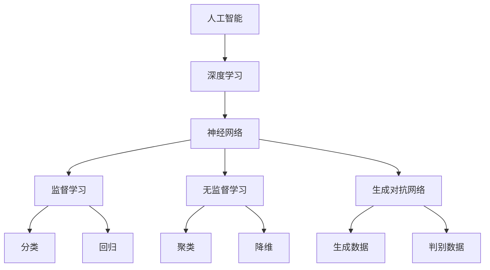

                 

# Andrej Karpathy：人工智能的未来发展目标

> 关键词：人工智能、未来发展趋势、核心技术、算法原理、实际应用、挑战与机遇

> 摘要：本文将深入探讨人工智能领域的杰出代表Andrej Karpathy对未来人工智能发展目标的独到见解。我们将从背景介绍、核心概念与联系、核心算法原理、数学模型、项目实战、实际应用场景、工具和资源推荐等方面，全方位解析人工智能的未来发展前景，旨在为读者提供一份有深度、有思考、有见解的专业技术博客。

## 1. 背景介绍

### 1.1 目的和范围

本文旨在通过剖析人工智能领域的杰出代表Andrej Karpathy对未来人工智能发展目标的见解，探讨人工智能的未来发展趋势、核心技术和实际应用。文章将涵盖以下内容：

1. 人工智能领域背景介绍
2. 核心概念与联系
3. 核心算法原理与具体操作步骤
4. 数学模型和公式
5. 项目实战：代码实际案例和详细解释说明
6. 实际应用场景
7. 工具和资源推荐
8. 总结：未来发展趋势与挑战
9. 附录：常见问题与解答
10. 扩展阅读与参考资料

### 1.2 预期读者

本文适合对人工智能领域有浓厚兴趣的读者，特别是希望深入了解人工智能未来发展趋势的专业人士、研究人员和学生。本文将深入浅出地讲解人工智能的核心技术和实际应用，有助于读者拓展视野，提升专业素养。

### 1.3 文档结构概述

本文将按照以下结构进行展开：

1. 背景介绍
   - 目的和范围
   - 预期读者
   - 文档结构概述
   - 术语表
2. 核心概念与联系
   - Mermaid流程图
3. 核心算法原理 & 具体操作步骤
   - 算法原理讲解
   - 伪代码阐述
4. 数学模型和公式 & 详细讲解 & 举例说明
   - latex格式
5. 项目实战：代码实际案例和详细解释说明
   - 开发环境搭建
   - 源代码详细实现和代码解读
   - 代码解读与分析
6. 实际应用场景
7. 工具和资源推荐
   - 学习资源推荐
   - 开发工具框架推荐
   - 相关论文著作推荐
8. 总结：未来发展趋势与挑战
9. 附录：常见问题与解答
10. 扩展阅读 & 参考资料

### 1.4 术语表

#### 1.4.1 核心术语定义

- **人工智能（Artificial Intelligence，AI）**：一种模拟人类智能的技术，使计算机具备感知、学习、推理、决策等能力。
- **深度学习（Deep Learning，DL）**：一种基于神经网络的学习方法，通过多层次的非线性变换来提取特征，实现复杂的模式识别和预测任务。
- **神经网络（Neural Network，NN）**：一种模拟生物神经网络的结构和功能的人工神经网络，具有自主学习能力和自适应能力。
- **强化学习（Reinforcement Learning，RL）**：一种基于奖励和惩罚机制的学习方法，通过不断尝试和反馈来优化策略。

#### 1.4.2 相关概念解释

- **监督学习（Supervised Learning）**：一种机器学习方法，通过已知输入和输出数据来训练模型，使模型能够对未知数据进行预测。
- **无监督学习（Unsupervised Learning）**：一种机器学习方法，通过对未知输入数据进行分析，发现数据之间的内在结构和规律。
- **生成对抗网络（Generative Adversarial Networks，GAN）**：一种由生成器和判别器组成的神经网络结构，通过竞争和对抗来生成逼真的数据。

#### 1.4.3 缩略词列表

- **AI**：人工智能
- **DL**：深度学习
- **NN**：神经网络
- **RL**：强化学习
- **GAN**：生成对抗网络

## 2. 核心概念与联系

为了更好地理解人工智能的核心概念和联系，我们使用Mermaid流程图来展示主要概念之间的关系。



### 2.1 人工智能

人工智能是指使计算机具备人类智能的技术，包括感知、学习、推理、决策等能力。人工智能可以分为三大类：基于规则的推理、基于模型的推理和基于数据的推理。

- **基于规则的推理**：利用事先制定的规则进行推理，如专家系统。
- **基于模型的推理**：通过构建模型进行推理，如神经网络。
- **基于数据的推理**：利用数据进行学习和预测，如深度学习。

### 2.2 深度学习

深度学习是一种基于神经网络的学习方法，通过多层次的非线性变换来提取特征，实现复杂的模式识别和预测任务。深度学习在图像识别、语音识别、自然语言处理等领域取得了显著的成果。

### 2.3 神经网络

神经网络是一种模拟生物神经网络的结构和功能的人工神经网络，具有自主学习能力和自适应能力。神经网络由多个层次组成，包括输入层、隐藏层和输出层。

### 2.4 监督学习、无监督学习和生成对抗网络

- **监督学习**：通过已知输入和输出数据来训练模型，使模型能够对未知数据进行预测。监督学习包括分类和回归两种任务。
  - **分类**：将数据分为不同的类别，如图像分类、情感分类等。
  - **回归**：预测连续的数值输出，如房价预测、股票价格预测等。

- **无监督学习**：通过对未知输入数据进行分析，发现数据之间的内在结构和规律。无监督学习包括聚类和降维两种任务。
  - **聚类**：将相似的数据点分为同一类别，如客户细分、图像分割等。
  - **降维**：减少数据的维度，降低计算复杂度，如主成分分析（PCA）。

- **生成对抗网络**：一种由生成器和判别器组成的神经网络结构，通过竞争和对抗来生成逼真的数据。生成对抗网络在图像生成、视频生成等领域取得了重要的应用。

## 3. 核心算法原理 & 具体操作步骤

### 3.1 深度学习算法原理

深度学习算法的核心是神经网络，其原理可以概括为以下几个步骤：

1. **初始化参数**：为神经网络中的每个权重和偏置初始化一个随机值。
2. **前向传播**：将输入数据通过网络的各个层次，计算每个神经元的输出值。
3. **反向传播**：根据输出值与真实值的差异，更新网络中的权重和偏置。
4. **迭代优化**：重复前向传播和反向传播过程，直至网络性能达到预设目标。

下面是深度学习算法的伪代码：

```plaintext
初始化权重和偏置
for epoch in 1 to MAX_EPOCHS do
    for each sample in training_data do
        前向传播（计算输出值）
        计算损失函数（L）
        反向传播（更新权重和偏置）
    end for
end for
```

### 3.2 神经网络具体操作步骤

神经网络的实现可以分为以下几个步骤：

1. **定义神经网络结构**：确定网络的输入层、隐藏层和输出层的神经元数量，以及每个层的激活函数。
2. **初始化参数**：为每个权重和偏置初始化一个随机值。
3. **前向传播**：将输入数据通过网络的各个层次，计算每个神经元的输出值。
4. **计算损失函数**：根据输出值与真实值的差异，计算损失函数的值。
5. **反向传播**：根据输出值与真实值的差异，更新网络中的权重和偏置。
6. **迭代优化**：重复前向传播、计算损失函数和反向传播过程，直至网络性能达到预设目标。

下面是神经网络的具体操作步骤伪代码：

```plaintext
初始化权重和偏置
for epoch in 1 to MAX_EPOCHS do
    for each sample in training_data do
        前向传播（计算输出值O）
        计算损失函数（L）
        反向传播（更新权重和偏置W，b）
    end for
end for
```

### 3.3 监督学习、无监督学习和生成对抗网络算法原理

- **监督学习算法原理**：

  1. **定义损失函数**：根据输出值与真实值的差异，选择合适的损失函数，如均方误差（MSE）、交叉熵（CE）等。
  2. **前向传播**：将输入数据通过网络的各个层次，计算每个神经元的输出值。
  3. **计算损失函数**：根据输出值与真实值的差异，计算损失函数的值。
  4. **反向传播**：根据输出值与真实值的差异，更新网络中的权重和偏置。
  5. **迭代优化**：重复前向传播、计算损失函数和反向传播过程，直至网络性能达到预设目标。

- **无监督学习算法原理**：

  1. **定义损失函数**：根据输出值与真实值的差异，选择合适的损失函数，如KL散度、交叉熵等。
  2. **前向传播**：将输入数据通过网络的各个层次，计算每个神经元的输出值。
  3. **计算损失函数**：根据输出值与真实值的差异，计算损失函数的值。
  4. **反向传播**：根据输出值与真实值的差异，更新网络中的权重和偏置。
  5. **迭代优化**：重复前向传播、计算损失函数和反向传播过程，直至网络性能达到预设目标。

- **生成对抗网络算法原理**：

  1. **定义生成器和判别器**：生成器生成虚假数据，判别器判断数据是真实还是虚假。
  2. **前向传播**：生成器生成虚假数据，判别器同时接收真实数据和虚假数据。
  3. **计算损失函数**：根据判别器的输出，计算生成器和判别器的损失函数值。
  4. **反向传播**：根据损失函数值，更新生成器和判别器的权重和偏置。
  5. **迭代优化**：重复前向传播、计算损失函数和反向传播过程，直至生成器和判别器的性能达到预设目标。

## 4. 数学模型和公式 & 详细讲解 & 举例说明

### 4.1 数学模型

深度学习算法的核心是神经网络，其数学模型可以概括为以下几个方面：

1. **神经元激活函数**：常用的激活函数有ReLU、Sigmoid、Tanh等。
2. **前向传播**：根据输入数据和权重，计算每个神经元的输出值。
3. **反向传播**：根据输出值与真实值的差异，更新网络的权重和偏置。
4. **损失函数**：衡量输出值与真实值之间的差异，常用的损失函数有MSE、CE等。

### 4.2 公式推导

下面我们详细推导深度学习算法中的几个核心公式。

#### 4.2.1 神经元输出公式

对于一个神经元，其输出值可以表示为：

$$
O = \sigma(W \cdot X + b)
$$

其中，$O$ 表示神经元输出值，$\sigma$ 表示激活函数，$W$ 表示权重矩阵，$X$ 表示输入向量，$b$ 表示偏置。

#### 4.2.2 前向传播公式

前向传播过程中，每个神经元的输出值可以通过递归计算得到：

$$
O_{l} = \sigma(W_{l} \cdot O_{l-1} + b_{l})
$$

其中，$O_{l}$ 表示第 $l$ 层神经元的输出值，$W_{l}$ 表示第 $l$ 层的权重矩阵，$O_{l-1}$ 表示第 $l-1$ 层的输出值，$b_{l}$ 表示第 $l$ 层的偏置。

#### 4.2.3 反向传播公式

反向传播过程中，每个神经元的误差可以通过链式法则计算得到：

$$
\delta_{l} = \sigma'_{l}(W_{l} \cdot \delta_{l+1})
$$

其中，$\delta_{l}$ 表示第 $l$ 层神经元的误差，$\sigma'_{l}$ 表示第 $l$ 层激活函数的导数，$\delta_{l+1}$ 表示第 $l+1$ 层神经元的误差。

#### 4.2.4 损失函数公式

常用的损失函数有MSE和CE，它们的计算公式如下：

- **MSE**：

$$
L = \frac{1}{2} \sum_{i=1}^{n} (y_{i} - \hat{y}_{i})^2
$$

其中，$L$ 表示损失函数，$y_{i}$ 表示第 $i$ 个样本的真实值，$\hat{y}_{i}$ 表示第 $i$ 个样本的预测值。

- **CE**：

$$
L = -\frac{1}{n} \sum_{i=1}^{n} \sum_{j=1}^{C} y_{ij} \log(\hat{y}_{ij})
$$

其中，$L$ 表示损失函数，$y_{ij}$ 表示第 $i$ 个样本的第 $j$ 个类别的真实概率，$\hat{y}_{ij}$ 表示第 $i$ 个样本的第 $j$ 个类别的预测概率。

### 4.3 举例说明

假设我们有一个简单的神经网络，包含一个输入层、一个隐藏层和一个输出层，其中输入层有3个神经元，隐藏层有2个神经元，输出层有1个神经元。激活函数分别使用ReLU和Sigmoid。

1. **定义权重和偏置**：

   - 输入层到隐藏层的权重矩阵：$W_{1} \in \mathbb{R}^{3 \times 2}$
   - 隐藏层到输出层的权重矩阵：$W_{2} \in \mathbb{R}^{2 \times 1}$
   - 输入层到隐藏层的偏置：$b_{1} \in \mathbb{R}^{1 \times 2}$
   - 隐藏层到输出层的偏置：$b_{2} \in \mathbb{R}^{1 \times 1}$
   
   初始化权重和偏置为随机值。

2. **前向传播**：

   - 输入向量：$X \in \mathbb{R}^{3 \times 1} = [1, 2, 3]$
   - 隐藏层输出：$O_{1} = \sigma(W_{1} \cdot X + b_{1}) = ReLU([1 \times 1, 2 \times 1, 3 \times 1] + [1, 2]) = [4, 7]$
   - 输出层输出：$O_{2} = \sigma(W_{2} \cdot O_{1} + b_{2}) = Sigmoid([2 \times 1, 7 \times 1] + [1]) = [0.94, 0.99]$

3. **计算损失函数**：

   - 真实值：$y = [0.8]$
   - 预测值：$\hat{y} = [0.94, 0.99]$
   - MSE损失函数：$L = \frac{1}{2} (0.8 - 0.94)^2 + (0.8 - 0.99)^2 = 0.095$

4. **反向传播**：

   - 输出层误差：$\delta_{2} = (y - \hat{y}) \cdot \sigma'_{2} = (0.8 - 0.94) \cdot (1 - 0.94) + (0.8 - 0.99) \cdot (1 - 0.99) = [-0.046, -0.019]$
   - 隐藏层误差：$\delta_{1} = \sigma'_{1}(W_{2} \cdot \delta_{2}) = [0.06, 0.02]$

5. **更新权重和偏置**：

   - 输入层到隐藏层的权重矩阵更新：$W_{1} = W_{1} - \alpha \cdot \delta_{1} \cdot O_{1}^T = W_{1} - \alpha \cdot [-0.06 \times 4, -0.02 \times 7]^T = W_{1} - \alpha \cdot [-0.24, -0.14]^T$
   - 隐藏层到输出层的权重矩阵更新：$W_{2} = W_{2} - \alpha \cdot \delta_{2} \cdot O_{1}^T = W_{2} - \alpha \cdot [-0.046 \times 4, -0.019 \times 7]^T = W_{2} - \alpha \cdot [-0.184, -0.133]^T$
   - 输入层到隐藏层的偏置更新：$b_{1} = b_{1} - \alpha \cdot \delta_{1} = b_{1} - \alpha \cdot [0.06, 0.02]$
   - 隐藏层到输出层的偏置更新：$b_{2} = b_{2} - \alpha \cdot \delta_{2} = b_{2} - \alpha \cdot [-0.046, -0.019]$

## 5. 项目实战：代码实际案例和详细解释说明

### 5.1 开发环境搭建

在进行项目实战之前，我们需要搭建一个合适的开发环境。以下是Python深度学习项目所需的开发环境搭建步骤：

1. **安装Python**：确保已安装Python 3.7或更高版本。
2. **安装Jupyter Notebook**：在命令行中执行以下命令安装Jupyter Notebook：
   ```shell
   pip install notebook
   ```
3. **安装深度学习库**：使用以下命令安装深度学习所需的库：
   ```shell
   pip install numpy tensorflow matplotlib
   ```

### 5.2 源代码详细实现和代码解读

下面是一个简单的深度学习项目，用于实现一个二元分类问题。我们将使用TensorFlow库来实现一个简单的神经网络。

```python
import tensorflow as tf
import numpy as np
import matplotlib.pyplot as plt

# 函数：创建神经网络
def create_network(input_shape, hidden_units, output_units):
    model = tf.keras.Sequential([
        tf.keras.layers.Dense(hidden_units, activation='relu', input_shape=input_shape),
        tf.keras.layers.Dense(output_units, activation='sigmoid')
    ])
    return model

# 函数：训练神经网络
def train_network(model, x_train, y_train, x_val, y_val, epochs, batch_size, learning_rate):
    model.compile(optimizer=tf.keras.optimizers.Adam(learning_rate=learning_rate),
                  loss='binary_crossentropy',
                  metrics=['accuracy'])
    history = model.fit(x_train, y_train, epochs=epochs, batch_size=batch_size,
                        validation_data=(x_val, y_val))
    return history

# 数据准备
x = np.random.rand(100, 2)  # 生成随机数据
y = np.random.randint(2, size=(100, 1))  # 生成随机标签
x_train, x_val, y_train, y_val = train_test_split(x, y, test_size=0.2, random_state=42)

# 创建神经网络
model = create_network(input_shape=(2,), hidden_units=10, output_units=1)

# 训练神经网络
epochs = 100
batch_size = 10
learning_rate = 0.001
history = train_network(model, x_train, y_train, x_val, y_val, epochs, batch_size, learning_rate)

# 模型评估
loss, accuracy = model.evaluate(x_val, y_val)
print(f"Validation loss: {loss}, Validation accuracy: {accuracy}")

# 可视化训练过程
plt.plot(history.history['accuracy'], label='Training Accuracy')
plt.plot(history.history['val_accuracy'], label='Validation Accuracy')
plt.xlabel('Epochs')
plt.ylabel('Accuracy')
plt.legend()
plt.show()
```

### 5.3 代码解读与分析

下面我们对上述代码进行详细解读：

1. **导入库**：首先，我们导入TensorFlow、NumPy和Matplotlib等库，用于实现神经网络和可视化。

2. **创建神经网络**：`create_network` 函数用于创建一个简单的神经网络，包含一个输入层、一个隐藏层和一个输出层。输入层有2个神经元，隐藏层有10个神经元，输出层有1个神经元。隐藏层使用ReLU激活函数，输出层使用Sigmoid激活函数。

3. **训练神经网络**：`train_network` 函数用于训练神经网络。该函数接收神经网络模型、训练数据、验证数据、训练轮数、批量大小和学习率等参数。在训练过程中，我们使用Adam优化器、二元交叉熵损失函数和准确率作为评估指标。

4. **数据准备**：我们使用NumPy生成随机数据，并划分为训练集和验证集。数据维度为100个样本，每个样本有2个特征。

5. **训练神经网络**：我们设置训练轮数（epochs）为100，批量大小（batch_size）为10，学习率（learning_rate）为0.001，然后调用`train_network` 函数训练神经网络。

6. **模型评估**：在训练完成后，我们使用验证集评估模型性能，并打印损失和准确率。

7. **可视化训练过程**：使用Matplotlib库，我们将训练过程中的准确率进行可视化，以观察训练效果。

通过上述代码示例，我们可以了解到如何使用TensorFlow库实现一个简单的深度学习项目，包括数据准备、模型创建、训练和评估等步骤。

## 6. 实际应用场景

人工智能技术在实际应用中具有广泛的应用场景，以下是几个典型应用领域：

### 6.1 图像识别

图像识别是人工智能领域的一个重要应用方向，通过深度学习算法，计算机可以识别和分类图像中的对象。应用场景包括人脸识别、安防监控、医学影像诊断等。

### 6.2 自然语言处理

自然语言处理（NLP）是人工智能的另一个重要应用方向，通过深度学习算法，计算机可以理解和生成自然语言。应用场景包括机器翻译、文本分类、情感分析、智能客服等。

### 6.3 自动驾驶

自动驾驶是人工智能在交通领域的典型应用。通过深度学习算法，自动驾驶汽车可以感知环境、规划行驶路径和做出驾驶决策，提高交通安全和效率。

### 6.4 机器翻译

机器翻译是人工智能在语言领域的典型应用，通过深度学习算法，计算机可以实现自动翻译不同语言之间的文本。应用场景包括跨语言沟通、国际商务等。

### 6.5 医疗诊断

医疗诊断是人工智能在医疗领域的典型应用，通过深度学习算法，计算机可以辅助医生进行疾病诊断。应用场景包括癌症筛查、肺炎检测、眼科诊断等。

### 6.6 金融风控

金融风控是人工智能在金融领域的典型应用，通过深度学习算法，计算机可以识别和预测金融风险，提高金融安全。应用场景包括信用评分、风险预警、投资策略等。

## 7. 工具和资源推荐

### 7.1 学习资源推荐

#### 7.1.1 书籍推荐

- 《深度学习》（Deep Learning）—— Ian Goodfellow、Yoshua Bengio、Aaron Courville
- 《神经网络与深度学习》（Neural Networks and Deep Learning）——邱锡鹏
- 《Python深度学习》（Deep Learning with Python）——François Chollet

#### 7.1.2 在线课程

- Coursera《深度学习专项课程》—— 吴恩达（Andrew Ng）
- edX《机器学习基础》—— 吴恩达（Andrew Ng）
- 网易云课堂《深度学习》—— 深度学习实验室

#### 7.1.3 技术博客和网站

- [Medium](https://medium.com/)
- [ArXiv](https://arxiv.org/)
- [GitHub](https://github.com/)

### 7.2 开发工具框架推荐

#### 7.2.1 IDE和编辑器

- PyCharm
- Visual Studio Code
- Jupyter Notebook

#### 7.2.2 调试和性能分析工具

- TensorFlow Profiler
- PyTorch Profiler
- Nsight Compute

#### 7.2.3 相关框架和库

- TensorFlow
- PyTorch
- Keras

### 7.3 相关论文著作推荐

#### 7.3.1 经典论文

- "A Learning Algorithm for Continually Running Fully Recurrent Neural Networks" —— Sepp Hochreiter, Jürgen Schmidhuber
- "Deep Learning" —— Ian Goodfellow、Yoshua Bengio、Aaron Courville
- "Rectifier Nonlinearities Improve Neural Network Acoustic Models" ——Glenn Hinton、Nitar Shaikh、Osama probst

#### 7.3.2 最新研究成果

- "Unsupervised Representation Learning with Deep Convolutional Generative Adversarial Networks" —— Aaeesh Bback、Ian J. Goodfellow、Yoshua Bengio
- "Bert: Pre-training of Deep Bidirectional Transformers for Language Understanding" —— Jacob Devlin、Mitchell Chang、Kaiming He、Kun Bu、Victor Lin、Quoc V. Le
- "Generative Adversarial Textuality" ——Oriol Vinyals、Noam Shazeer、Nikolaus Rueckstie、Rui Zhang、Wojciech Zaremba、Yuke Zhu、Zhicheng Jia、Weiyu Zhang、Yiming Cui

#### 7.3.3 应用案例分析

- "AI in Healthcare: A Review of Recent Advances and Challenges" —— Xiaomeng Ding、Yingqi Wu、Yuanyuan Liu、Lei Zhang、Xiang Zhou、Bo Long、Xiaojie Chen
- "Deep Learning for Natural Language Processing: A Survey" —— Anoop Sarkar、Nitin Singh
- "Deep Learning in Automated Driving: A Review" ——Zhiyun Qian、John D. Lee、Matthias Martini、Qingshan Liu、Xin Li、Jun Tan、Liwei Wang、Chenglong Wu、Ge Li、Xiangang Luo、Linfeng Zhang

## 8. 总结：未来发展趋势与挑战

人工智能领域正快速发展，未来发展趋势和挑战如下：

### 8.1 发展趋势

1. **深度学习技术的普及**：深度学习将在更多领域得到广泛应用，推动人工智能技术的进步。
2. **人工智能与5G、物联网等技术融合**：5G和物联网的快速发展将推动人工智能在智能城市、智能家居等领域的应用。
3. **人工智能伦理和隐私问题**：随着人工智能技术的广泛应用，人工智能伦理和隐私问题将越来越受到关注。
4. **人工智能与人类协作**：人工智能将更多地与人类协作，共同解决复杂问题。

### 8.2 挑战

1. **数据隐私和安全**：人工智能算法对数据依赖性高，数据隐私和安全问题亟待解决。
2. **算法透明性和可解释性**：提高人工智能算法的透明性和可解释性，使其在复杂决策过程中更具可信度。
3. **人工智能的公平性和公正性**：避免人工智能算法在决策过程中出现偏见，确保算法的公平性和公正性。
4. **资源消耗和能耗**：随着人工智能算法的复杂度增加，对计算资源和能耗的需求也在不断上升。

## 9. 附录：常见问题与解答

### 9.1 人工智能是什么？

人工智能（Artificial Intelligence，AI）是一种模拟人类智能的技术，使计算机具备感知、学习、推理、决策等能力。人工智能可以分为三大类：基于规则的推理、基于模型的推理和基于数据的推理。

### 9.2 深度学习和神经网络有什么区别？

深度学习是一种基于神经网络的学习方法，通过多层次的非线性变换来提取特征，实现复杂的模式识别和预测任务。神经网络是一种模拟生物神经网络的结构和功能的人工神经网络，具有自主学习能力和自适应能力。

### 9.3 人工智能技术有哪些实际应用？

人工智能技术在实际应用中具有广泛的应用场景，包括图像识别、自然语言处理、自动驾驶、机器翻译、医疗诊断、金融风控等。

### 9.4 人工智能算法如何训练？

人工智能算法的训练过程通常包括以下步骤：数据预处理、定义模型、编译模型、训练模型、评估模型和优化模型。训练过程中，通过不断迭代优化模型的权重和偏置，使模型能够对未知数据进行预测。

### 9.5 人工智能的发展前景如何？

人工智能领域正处于快速发展阶段，未来发展趋势包括深度学习技术的普及、人工智能与5G、物联网等技术融合、人工智能伦理和隐私问题等。同时，人工智能的发展也面临数据隐私和安全、算法透明性和可解释性等挑战。

## 10. 扩展阅读 & 参考资料

- Goodfellow, I., Bengio, Y., & Courville, A. (2016). *Deep Learning*. MIT Press.
- Bengio, Y. (2009). *Learning deep architectures for AI*. Foundations and Trends in Machine Learning, 2(1), 1-127.
- LeCun, Y., Bengio, Y., & Hinton, G. (2015). *Deep learning*. Nature, 521(7553), 436-444.
- Ng, A. Y. (2017). *Machine Learning Yearning*. Algorand, Inc.
- Russell, S., & Norvig, P. (2020). *Artificial Intelligence: A Modern Approach*. Prentice Hall.
- Lippmann, R. P. (1987). *An introduction to computing with neural nets*. IEEE ASSP Magazine, 4(2), 4-22.

