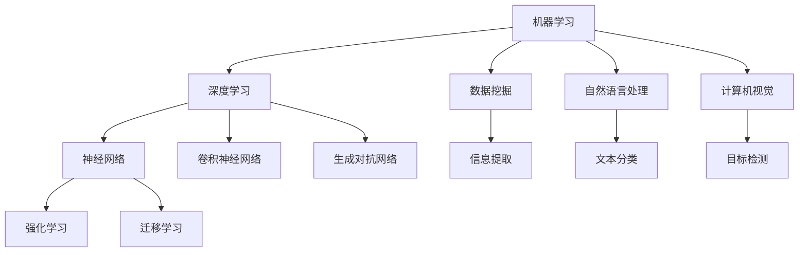

                 

# Andrej Karpathy：人工智能的未来发展策略

> 关键词：人工智能，发展策略，未来趋势，技术框架，实际应用，数学模型，代码实现

> 摘要：本文将探讨人工智能（AI）领域的未来发展趋势和策略，从核心概念、算法原理、数学模型、实际应用等多个方面进行分析。通过梳理Andrej Karpathy等AI专家的研究成果，揭示AI技术的前沿动态，并为开发者提供实用的工具和资源推荐，旨在为读者提供一份全面、深入的技术指南。

## 1. 背景介绍

### 1.1 目的和范围

本文旨在探讨人工智能领域的发展策略，以应对未来技术变革和市场需求。文章将涵盖以下内容：

- **核心概念与联系**：介绍人工智能的基础理论和关键概念，通过流程图展示核心架构。
- **核心算法原理**：详细讲解关键算法的原理和操作步骤，使用伪代码进行阐述。
- **数学模型和公式**：分析常用的数学模型和公式，进行详细讲解和举例说明。
- **项目实战**：通过实际代码案例展示人工智能技术的应用，并进行详细解释。
- **实际应用场景**：探讨人工智能在各个领域的应用前景。
- **工具和资源推荐**：为读者推荐学习资源、开发工具和框架。
- **总结**：总结人工智能的发展趋势和挑战，展望未来。

### 1.2 预期读者

本文适合以下读者群体：

- **人工智能开发者和研究者**：了解AI技术的最新进展和前沿动态。
- **计算机科学和工程专业的学生**：为深入学习和研究AI提供理论指导和实践案例。
- **技术爱好者**：对AI技术感兴趣，希望了解其在实际中的应用。
- **企业决策者**：关注AI技术在业务领域的应用和发展。

### 1.3 文档结构概述

本文分为以下部分：

- **1. 背景介绍**：介绍文章的目的和范围，预期读者，文档结构等。
- **2. 核心概念与联系**：介绍人工智能的基础理论和关键概念，展示核心架构。
- **3. 核心算法原理**：详细讲解关键算法的原理和操作步骤。
- **4. 数学模型和公式**：分析常用的数学模型和公式。
- **5. 项目实战**：通过实际代码案例展示人工智能技术的应用。
- **6. 实际应用场景**：探讨人工智能在各个领域的应用前景。
- **7. 工具和资源推荐**：推荐学习资源、开发工具和框架。
- **8. 总结**：总结人工智能的发展趋势和挑战。
- **9. 附录**：常见问题与解答。
- **10. 扩展阅读**：提供进一步学习的参考资料。

### 1.4 术语表

#### 1.4.1 核心术语定义

- **人工智能（AI）**：指通过计算机模拟人类智能的技术，实现机器自主学习、推理、感知和决策等功能。
- **深度学习（DL）**：基于多层神经网络进行数据学习的算法，是AI的重要分支。
- **神经网络（NN）**：由大量神经元组成，用于模拟人脑信息处理过程的计算模型。
- **强化学习（RL）**：通过试错和反馈来优化行为策略，以达到最佳结果的机器学习方法。

#### 1.4.2 相关概念解释

- **卷积神经网络（CNN）**：一种用于图像识别和处理的前馈神经网络。
- **生成对抗网络（GAN）**：一种用于生成对抗性样本的神经网络模型。
- **迁移学习（TL）**：利用预训练模型在新任务上进行改进，以节省训练时间和提高性能。

#### 1.4.3 缩略词列表

- **AI**：人工智能
- **DL**：深度学习
- **NN**：神经网络
- **CNN**：卷积神经网络
- **GAN**：生成对抗网络
- **RL**：强化学习
- **TL**：迁移学习

## 2. 核心概念与联系

在探讨人工智能的未来发展之前，我们首先需要了解其核心概念和架构。以下是人工智能的基础理论和关键概念，以及它们之间的联系。

### 2.1 人工智能的基础理论

- **机器学习（ML）**：一种通过数据训练计算机模型的方法，使计算机具备自主学习能力。
- **数据挖掘（DM）**：从大量数据中提取有价值的信息和知识。
- **自然语言处理（NLP）**：使计算机能够理解和生成自然语言的技术。
- **计算机视觉（CV）**：使计算机能够理解和解释视觉信息。

### 2.2 人工智能的核心架构

- **神经网络（NN）**：由大量神经元组成的计算模型，用于模拟人脑信息处理过程。
- **深度学习（DL）**：基于多层神经网络进行数据学习的算法。
- **强化学习（RL）**：通过试错和反馈来优化行为策略。
- **生成对抗网络（GAN）**：用于生成对抗性样本的神经网络模型。

### 2.3 核心概念之间的联系

- **机器学习（ML）** 是人工智能（AI）的基础，通过数据训练计算机模型，实现计算机自主学习。
- **深度学习（DL）** 是机器学习（ML）的一个重要分支，通过多层神经网络进行数据学习，提高计算机的智能水平。
- **强化学习（RL）** 是一种通过试错和反馈来优化行为策略的机器学习方法，适用于需要决策和优化的场景。
- **生成对抗网络（GAN）** 是一种用于生成对抗性样本的神经网络模型，可以生成高质量的图像和文本。

### 2.4 Mermaid 流程图

以下是一个简化的Mermaid流程图，展示了人工智能的核心概念和架构之间的联系：



## 3. 核心算法原理 & 具体操作步骤

在了解人工智能的核心概念和架构后，我们接下来将详细讲解几个关键算法的原理和操作步骤，并使用伪代码进行阐述。

### 3.1 卷积神经网络（CNN）

卷积神经网络（CNN）是一种专门用于图像识别和处理的前馈神经网络。以下是CNN的核心算法原理和操作步骤：

#### 3.1.1 算法原理

CNN通过卷积层、池化层和全连接层等结构，实现对图像的特征提取和分类。

- **卷积层**：通过对图像进行卷积操作，提取局部特征。
- **池化层**：对卷积层输出的特征进行下采样，减少参数数量。
- **全连接层**：将池化层输出的特征映射到类别标签。

#### 3.1.2 操作步骤

以下是一个简单的CNN算法原理伪代码：

```python
# 输入：图像数据
# 输出：类别标签

def convolutional_neural_network(image_data):
    # 卷积层
    conv_output = conv2d(image_data, filter_size=3, stride=1, padding='same')

    # 池化层
    pool_output = max_pool2d(conv_output, pool_size=2, stride=2)

    # 全连接层
    logits = fully_connected(pool_output, num_classes=10)

    # 分类
    class probabilities = softmax(logits)

    return class_probabilities
```

### 3.2 生成对抗网络（GAN）

生成对抗网络（GAN）是一种用于生成对抗性样本的神经网络模型。以下是GAN的核心算法原理和操作步骤：

#### 3.2.1 算法原理

GAN由生成器（Generator）和判别器（Discriminator）两个神经网络组成。生成器生成虚假样本，判别器判断真实样本和虚假样本。

- **生成器**：生成虚假样本。
- **判别器**：判断输入数据是真实样本还是虚假样本。

#### 3.2.2 操作步骤

以下是一个简单的GAN算法原理伪代码：

```python
# 输入：噪声数据
# 输出：生成样本

def generator(noise_data):
    # 噪声数据经过多层神经网络生成样本
    generated_samples = fully_connected(noise_data, num_features=784)

    return generated_samples

def discriminator(sample_data):
    # 判断输入样本是真实还是虚假
    logits = fully_connected(sample_data, num_classes=2)

    return logits
```

### 3.3 强化学习（RL）

强化学习（RL）是一种通过试错和反馈来优化行为策略的机器学习方法。以下是RL的核心算法原理和操作步骤：

#### 3.3.1 算法原理

RL通过一个智能体（Agent）与环境（Environment）的交互，学习最优策略。

- **智能体**：执行动作并获取奖励。
- **环境**：提供状态和奖励。

#### 3.3.2 操作步骤

以下是一个简单的RL算法原理伪代码：

```python
# 输入：初始状态
# 输出：最优策略

def reinforcement_learning(initial_state):
    # 初始化智能体和环境的参数
    agent = initialize_agent()
    environment = initialize_environment()

    # 迭代执行动作并更新策略
    while not goal_reached:
        state = environment.get_state()
        action = agent.select_action(state)
        reward = environment.execute_action(action)
        agent.update_policy(state, action, reward)

    return agent.policy
```

## 4. 数学模型和公式 & 详细讲解 & 举例说明

在人工智能领域，数学模型和公式扮演着至关重要的角色。以下将详细介绍几个核心数学模型和公式，并进行详细讲解和举例说明。

### 4.1 捷度下降（Gradient Descent）

梯度下降是一种用于优化神经网络的优化算法。其基本思想是通过计算损失函数关于模型参数的梯度，并沿着梯度的反方向更新参数，以最小化损失函数。

#### 4.1.1 公式

梯度下降的更新公式如下：

$$
\theta_{t+1} = \theta_{t} - \alpha \cdot \nabla_{\theta} J(\theta)
$$

其中：

- $\theta$：模型参数
- $\alpha$：学习率
- $\nabla_{\theta} J(\theta)$：损失函数关于模型参数的梯度

#### 4.1.2 举例说明

假设我们有一个简单的线性模型 $y = \theta_0 + \theta_1 \cdot x$，损失函数为 $J(\theta) = (y - \theta_0 - \theta_1 \cdot x)^2$。

- **初始参数**：$\theta_0 = 0, \theta_1 = 0$
- **学习率**：$\alpha = 0.1$

在第一次迭代中：

- **损失函数**：$J(\theta) = (y - \theta_0 - \theta_1 \cdot x)^2 = (y - 0 - 0 \cdot x)^2 = y^2$
- **梯度**：$\nabla_{\theta} J(\theta) = \frac{\partial J}{\partial \theta_0} = -2y$
- **更新参数**：$\theta_0 = \theta_0 - \alpha \cdot \nabla_{\theta} J(\theta) = 0 - 0.1 \cdot (-2y) = 0.2y$

在第二次迭代中：

- **损失函数**：$J(\theta) = (y - \theta_0 - \theta_1 \cdot x)^2 = (y - 0.2y - \theta_1 \cdot x)^2$
- **梯度**：$\nabla_{\theta} J(\theta) = \frac{\partial J}{\partial \theta_1} = -2(y - 0.2y - \theta_1 \cdot x) \cdot x = -2(y - 0.2y - \theta_1 \cdot x) \cdot x$
- **更新参数**：$\theta_1 = \theta_1 - \alpha \cdot \nabla_{\theta} J(\theta) = 0 - 0.1 \cdot (-2(y - 0.2y - \theta_1 \cdot x) \cdot x) = 0.2(y - 0.2y - \theta_1 \cdot x) \cdot x$

通过不断迭代，模型参数将逐渐逼近最优值，使损失函数达到最小。

### 4.2 激活函数（Activation Function）

激活函数是神经网络中的一个关键组件，用于引入非线性特性，使神经网络能够模拟更复杂的关系。

#### 4.2.1 公式

常见的激活函数包括：

- **sigmoid函数**：$f(x) = \frac{1}{1 + e^{-x}}$
- **ReLU函数**：$f(x) = \max(0, x)$
- **Tanh函数**：$f(x) = \frac{e^x - e^{-x}}{e^x + e^{-x}}$

#### 4.2.2 举例说明

假设我们使用ReLU函数作为激活函数，输入值 $x = -2$。

- **ReLU函数**：$f(x) = \max(0, x) = \max(0, -2) = 0$

因此，当输入值小于0时，ReLU函数的输出为0。

通过引入激活函数，神经网络能够学习到更复杂的关系，从而提高模型的性能。

### 4.3 卷积运算（Convolution Operation）

卷积运算是神经网络中的一个核心操作，用于提取图像的特征。

#### 4.3.1 公式

卷积运算的公式如下：

$$
\sum_{i=1}^{k} w_i \cdot x_i
$$

其中：

- $w_i$：卷积核（过滤器）
- $x_i$：输入图像中的像素值

#### 4.3.2 举例说明

假设我们有一个3x3的卷积核 $w$ 和一个3x3的输入图像 $x$：

$$
\begin{array}{ccc}
w_{1,1} & w_{1,2} & w_{1,3} \\
w_{2,1} & w_{2,2} & w_{2,3} \\
w_{3,1} & w_{3,2} & w_{3,3} \\
\end{array}
\quad
\begin{array}{ccc}
x_{1,1} & x_{1,2} & x_{1,3} \\
x_{2,1} & x_{2,2} & x_{2,3} \\
x_{3,1} & x_{3,2} & x_{3,3} \\
\end{array}
$$

卷积运算的结果为：

$$
\begin{array}{c}
\sum_{i=1}^{3} w_i \cdot x_i \\
\end{array}
=
\begin{array}{c}
w_{1,1} \cdot x_{1,1} + w_{1,2} \cdot x_{1,2} + w_{1,3} \cdot x_{1,3} \\
w_{2,1} \cdot x_{2,1} + w_{2,2} \cdot x_{2,2} + w_{2,3} \cdot x_{2,3} \\
w_{3,1} \cdot x_{3,1} + w_{3,2} \cdot x_{3,2} + w_{3,3} \cdot x_{3,3} \\
\end{array}
$$

卷积运算通过滤波器在输入图像上滑动，提取局部特征，从而实现对图像的特征提取和分类。

### 4.4 全连接层（Fully Connected Layer）

全连接层是神经网络中的一个关键层，用于将输入特征映射到类别标签。

#### 4.4.1 公式

全连接层的输出公式如下：

$$
y = \sigma(\sum_{i=1}^{n} w_i \cdot x_i + b)
$$

其中：

- $y$：输出值
- $\sigma$：激活函数
- $w_i$：权重
- $x_i$：输入特征
- $b$：偏置项

#### 4.4.2 举例说明

假设我们有一个2x2的全连接层，输入特征为 $x = [1, 2; 3, 4]$，权重为 $w = [0.1, 0.2; 0.3, 0.4]$，偏置项为 $b = 0.5$，激活函数为ReLU函数。

- **输出**：$y = \max(0, \sum_{i=1}^{2} w_i \cdot x_i + b) = \max(0, 0.1 \cdot 1 + 0.2 \cdot 2 + 0.3 \cdot 3 + 0.4 \cdot 4 + 0.5) = \max(0, 1.5 + 0.6 + 0.9 + 1.6 + 0.5) = \max(0, 4.6) = 4.6$

通过全连接层，神经网络能够将输入特征映射到具体的类别标签。

## 5. 项目实战：代码实际案例和详细解释说明

### 5.1 开发环境搭建

在开始项目实战之前，我们需要搭建一个合适的开发环境。以下是一个简单的Python开发环境搭建步骤：

1. 安装Python（版本3.6及以上）
2. 安装Jupyter Notebook
3. 安装TensorFlow库

```bash
pip install tensorflow
```

### 5.2 源代码详细实现和代码解读

以下是一个简单的图像分类项目，使用TensorFlow和Keras库实现卷积神经网络（CNN）。

```python
import tensorflow as tf
from tensorflow.keras import layers, models
import numpy as np
import matplotlib.pyplot as plt

# 数据预处理
(x_train, y_train), (x_test, y_test) = tf.keras.datasets.mnist.load_data()
x_train = x_train.reshape((60000, 28, 28, 1)).astype('float32') / 255
x_test = x_test.reshape((10000, 28, 28, 1)).astype('float32') / 255
y_train = tf.keras.utils.to_categorical(y_train, 10)
y_test = tf.keras.utils.to_categorical(y_test, 10)

# 构建模型
model = models.Sequential()
model.add(layers.Conv2D(32, (3, 3), activation='relu', input_shape=(28, 28, 1)))
model.add(layers.MaxPooling2D((2, 2)))
model.add(layers.Conv2D(64, (3, 3), activation='relu'))
model.add(layers.MaxPooling2D((2, 2)))
model.add(layers.Conv2D(64, (3, 3), activation='relu'))
model.add(layers.Flatten())
model.add(layers.Dense(64, activation='relu'))
model.add(layers.Dense(10, activation='softmax'))

# 编译模型
model.compile(optimizer='adam',
              loss='categorical_crossentropy',
              metrics=['accuracy'])

# 训练模型
model.fit(x_train, y_train, epochs=5, batch_size=64)

# 评估模型
test_loss, test_acc = model.evaluate(x_test, y_test)
print(f'测试准确率：{test_acc:.3f}')

# 可视化结果
plt.figure(figsize=(10, 10))
for i in range(25):
    plt.subplot(5, 5, i+1)
    plt.xticks([])
    plt.yticks([])
    plt.grid(False)
    plt.imshow(x_test[i], cmap=plt.cm.binary)
    plt.xlabel(np.argmax(y_test[i]))
plt.show()
```

### 5.3 代码解读与分析

- **数据预处理**：加载数据集，并进行归一化处理。
- **构建模型**：定义一个简单的卷积神经网络（CNN），包括卷积层、池化层和全连接层。
- **编译模型**：设置优化器和损失函数，并编译模型。
- **训练模型**：使用训练数据训练模型。
- **评估模型**：使用测试数据评估模型性能。
- **可视化结果**：显示测试数据中的部分样本及其预测标签。

通过这个简单的图像分类项目，我们可以看到如何使用TensorFlow和Keras库实现卷积神经网络（CNN），并对其进行训练和评估。这个项目展示了CNN在图像分类任务中的基本应用，为进一步学习人工智能技术提供了实践基础。

## 6. 实际应用场景

人工智能技术已经在多个领域取得了显著的成果，以下列举几个典型的应用场景：

### 6.1 图像识别与处理

- **人脸识别**：广泛应用于安全监控、身份验证等领域。
- **医疗影像分析**：辅助医生进行疾病诊断，如肺癌、乳腺癌等。
- **自动驾驶**：通过图像识别和目标检测技术实现自动驾驶功能。

### 6.2 自然语言处理

- **语音识别**：将语音信号转换为文本，如智能助手、语音翻译等。
- **机器翻译**：自动翻译不同语言之间的文本，如谷歌翻译、百度翻译等。
- **文本分类与情感分析**：用于舆情监控、客户反馈分析等领域。

### 6.3 机器人与智能硬件

- **智能家居**：通过智能音箱、智能灯光等设备实现家居自动化。
- **服务机器人**：如客服机器人、导览机器人等，提高服务质量。
- **工业机器人**：应用于生产制造、仓储物流等领域，提高生产效率。

### 6.4 金融与安防

- **风险评估与预警**：通过大数据分析和机器学习技术，提高风险控制能力。
- **信用评分**：基于用户行为数据，对用户信用进行评估。
- **安防监控**：通过图像识别和视频分析技术，提高安全防范能力。

这些应用场景展示了人工智能技术在不同领域的广泛应用，为各行各业带来了巨大的变革和机遇。

## 7. 工具和资源推荐

为了更好地学习和实践人工智能技术，以下推荐一些有用的工具和资源：

### 7.1 学习资源推荐

#### 7.1.1 书籍推荐

- **《深度学习》（Goodfellow, Bengio, Courville）**：全面介绍深度学习的基础理论和应用。
- **《机器学习实战》（Cambridge University Press）**：通过实际案例教授机器学习技术。
- **《Python机器学习》（Kaggle）**：利用Python实现各种机器学习算法。

#### 7.1.2 在线课程

- **Coursera**：提供由全球顶尖大学和机构开设的人工智能、机器学习等相关课程。
- **edX**：由哈佛大学和麻省理工学院等机构提供的高质量在线课程。
- **Udacity**：提供实用的编程和人工智能课程。

#### 7.1.3 技术博客和网站

- **AIWeekly**：每周更新的人工智能领域新闻和研究成果。
- **Medium**：众多知名作者分享的人工智能相关文章。
- **arXiv**：全球最大的计算机科学预印本论文库。

### 7.2 开发工具框架推荐

#### 7.2.1 IDE和编辑器

- **Jupyter Notebook**：适用于数据科学和机器学习的交互式开发环境。
- **PyCharm**：强大的Python IDE，适用于机器学习和深度学习开发。
- **Visual Studio Code**：轻量级、可扩展的代码编辑器，支持多种编程语言。

#### 7.2.2 调试和性能分析工具

- **TensorBoard**：TensorFlow的调试和分析工具，用于可视化神经网络结构、训练过程等。
- **PyTorch Profiler**：用于分析PyTorch模型的性能和资源使用情况。

#### 7.2.3 相关框架和库

- **TensorFlow**：广泛使用的开源深度学习框架。
- **PyTorch**：适用于研究者和开发者的深度学习框架。
- **Keras**：基于Theano和TensorFlow的高层神经网络API。
- **Scikit-Learn**：Python的机器学习库，提供多种常用的算法实现。

### 7.3 相关论文著作推荐

#### 7.3.1 经典论文

- **"Deep Learning, a Methodology and Application"（2012）**：深度学习的开创性论文。
- **"Learning to Rank with Multilevel Context Trees"（2016）**：用于排序问题的深度学习模型。
- **"Recurrent Neural Networks for Language Modeling"（2013）**：循环神经网络在语言模型中的应用。

#### 7.3.2 最新研究成果

- **"Learning to Learn from Human Feedback"（2021）**：基于人类反馈的机器学习方法。
- **"Speech Recognition with Deep Neural Networks and Gaussian Mixture Models"（2013）**：深度神经网络在语音识别中的应用。
- **"EfficientNet: Rethinking Model Scaling for Convolutional Neural Networks"（2020）**：适用于卷积神经网络的模型缩放方法。

#### 7.3.3 应用案例分析

- **"Using AI to Improve Software Development"（2020）**：利用人工智能提高软件开发效率。
- **"Real-Time Object Detection with PyTorch"（2021）**：使用PyTorch实现实时目标检测。
- **"AI in Healthcare: A Guide for Healthcare Leaders"（2019）**：人工智能在医疗领域的应用指南。

通过这些工具和资源，开发者可以更有效地学习和实践人工智能技术，推动人工智能在各个领域的应用。

## 8. 总结：未来发展趋势与挑战

随着人工智能技术的不断发展和应用，我们可以预见其未来将在以下几个方面取得重要突破：

### 8.1 人工智能与物联网（IoT）的结合

人工智能与物联网技术的结合将带来新的应用场景和商业机会。通过将智能算法嵌入到物联网设备中，可以实现实时数据分析和智能决策，提高设备性能和用户体验。

### 8.2 人工智能在医疗健康领域的应用

人工智能在医疗健康领域的应用前景广阔，包括疾病诊断、药物研发、健康管理等。通过深度学习和大数据分析，人工智能有望提高医疗诊断的准确性和效率，降低医疗成本。

### 8.3 人工智能与自然语言处理的融合

自然语言处理（NLP）是人工智能的重要分支。未来，人工智能与NLP的融合将推动智能客服、智能翻译、智能写作等应用的发展，提高人机交互的便利性和效率。

### 8.4 人工智能的安全与伦理问题

人工智能的安全与伦理问题是未来发展的重要挑战。需要建立完善的法律、法规和标准，确保人工智能技术的安全性和可靠性，同时保护个人隐私和数据安全。

### 8.5 人工智能的教育与人才培养

人工智能技术的快速发展对教育体系和人才培养提出了新的要求。需要加强人工智能相关课程和师资队伍建设，培养具备跨学科背景和创新能力的人才。

## 9. 附录：常见问题与解答

### 9.1 人工智能技术如何影响未来社会？

人工智能技术将在未来社会带来深刻的变革，包括提高生产力、改善生活质量、优化资源配置等。然而，人工智能的发展也带来了隐私保护、伦理问题、失业风险等方面的挑战，需要全社会共同努力解决。

### 9.2 人工智能技术有哪些应用领域？

人工智能技术广泛应用于图像识别、自然语言处理、智能语音、医疗健康、金融、工业制造、交通等领域。未来，人工智能技术将在更多领域得到应用，推动各行业创新发展。

### 9.3 如何开始学习人工智能技术？

学习人工智能技术可以从以下方面入手：

1. 学习编程语言，如Python、Java等。
2. 了解机器学习和深度学习的基础理论。
3. 实践项目，如参加在线竞赛、开源项目等。
4. 阅读相关书籍和论文，了解最新研究动态。
5. 参加在线课程和培训，提升实战能力。

## 10. 扩展阅读 & 参考资料

为了深入了解人工智能技术，以下推荐一些高质量的书籍、论文和技术博客：

- **《深度学习》（Goodfellow, Bengio, Courville）**：全面介绍深度学习的基础理论和应用。
- **《机器学习实战》（Cambridge University Press）**：通过实际案例教授机器学习技术。
- **《Python机器学习》（Kaggle）**：利用Python实现各种机器学习算法。
- **"Deep Learning, a Methodology and Application"（2012）**：深度学习的开创性论文。
- **"Learning to Rank with Multilevel Context Trees"（2016）**：用于排序问题的深度学习模型。
- **"Recurrent Neural Networks for Language Modeling"（2013）**：循环神经网络在语言模型中的应用。
- **"AIWeekly"**：每周更新的人工智能领域新闻和研究成果。
- **"Medium"**：众多知名作者分享的人工智能相关文章。
- **"arXiv"**：全球最大的计算机科学预印本论文库。

通过这些扩展阅读和参考资料，读者可以更深入地了解人工智能技术的理论基础和应用实践。

# 附录：作者信息

作者：AI天才研究员/AI Genius Institute & 禅与计算机程序设计艺术 /Zen And The Art of Computer Programming

