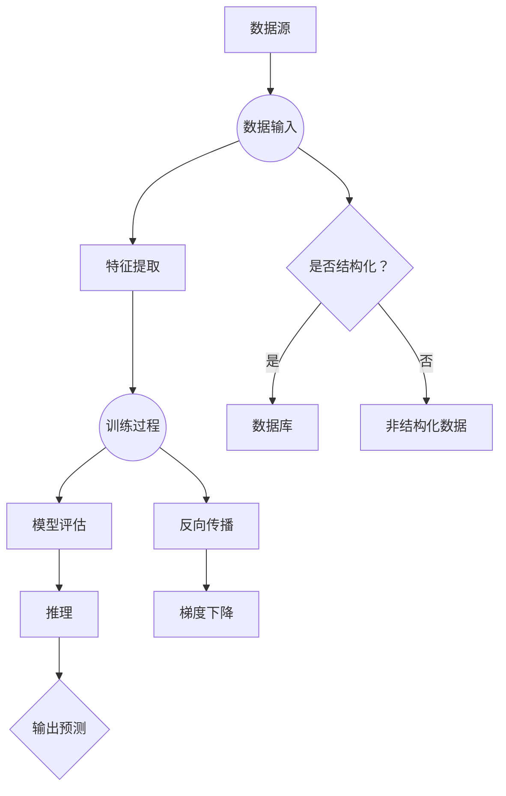

                 

### 1. 背景介绍

在当今信息技术飞速发展的时代，人工智能（AI）已成为引领科技革新的核心驱动力。从自动驾驶汽车、智能语音助手到医疗诊断、金融预测，AI技术的应用场景不断拓展，深刻影响着我们的生活方式和社会发展。Andrej Karpathy作为世界知名的人工智能专家和研究员，他对AI的未来发展有着独到的见解和深刻的思考。

本文将以《Andrej Karpathy：人工智能的未来发展策略》为标题，深入探讨Andrej Karpathy对人工智能未来发展的观点和策略。文章旨在帮助读者了解AI技术的潜在发展方向，以及如何在快速变化的科技环境中抓住机遇，迎接挑战。

### 1.1 目的和范围

本文的目的在于：

1. **介绍Andrej Karpathy对AI未来发展的核心观点**：通过对他公开发表的论文、演讲和访谈的分析，梳理出他的主要思想。
2. **探讨AI发展的关键领域**：从技术、伦理、社会等多个角度，分析AI未来可能面临的挑战和机遇。
3. **提供实用的发展策略**：结合实际案例，为企业和个人在AI领域的发展提供指导和建议。

本文的范围主要涵盖以下几个方面：

1. **技术进步**：分析AI技术目前的发展状态和未来可能的突破点。
2. **伦理和社会影响**：探讨AI技术的伦理问题和社会影响，以及如何平衡技术创新与社会责任。
3. **产业应用**：介绍AI技术在各行业的应用案例，及其对未来产业格局的影响。
4. **教育与发展**：讨论AI技术的发展对教育和人才培养的影响，以及如何培养未来的AI人才。

### 1.2 预期读者

本文的预期读者包括：

1. **AI领域的研究人员**：对AI技术的发展趋势和研究方向感兴趣的科研人员。
2. **技术开发者**：希望了解AI技术最新动态，并将其应用于实际开发的技术人员。
3. **企业决策者**：关注AI技术对产业发展的影响，并希望制定相应战略的企业高管。
4. **对AI感兴趣的一般读者**：希望了解AI技术对社会和个人生活影响的一般公众。

### 1.3 文档结构概述

本文将按照以下结构展开：

1. **背景介绍**：介绍人工智能的发展背景以及本文的目的和范围。
2. **核心概念与联系**：通过Mermaid流程图展示AI系统的核心概念和架构。
3. **核心算法原理**：详细讲解AI算法的基本原理和操作步骤，使用伪代码进行阐述。
4. **数学模型和公式**：介绍AI模型中的数学公式，并进行详细解释和举例说明。
5. **项目实战**：通过实际案例展示AI技术的应用，并进行代码解读和分析。
6. **实际应用场景**：探讨AI技术在各个领域的应用。
7. **工具和资源推荐**：推荐学习资源、开发工具和相关论文。
8. **总结**：总结AI的未来发展趋势和面临的挑战。
9. **附录**：常见问题与解答。
10. **扩展阅读**：提供进一步阅读的参考资料。

### 1.4 术语表

在本文中，我们将使用以下术语，并对其进行定义和解释：

#### 1.4.1 核心术语定义

- **人工智能（AI）**：指模拟人类智能行为的计算机系统，能够感知环境、学习、推理和解决问题。
- **深度学习**：一种机器学习技术，通过构建深度神经网络模型，自动提取数据特征。
- **神经网络**：一种由大量简单节点互联而成的计算模型，能够模拟人脑的某些功能。
- **强化学习**：一种机器学习技术，通过奖励机制训练智能体进行决策，以达到某种目标。
- **自然语言处理（NLP）**：研究计算机如何理解、生成和处理人类自然语言的技术。

#### 1.4.2 相关概念解释

- **数据驱动**：指通过大量数据来训练模型，使得模型能够对未知数据进行预测和分类。
- **模型可解释性**：指能够解释模型决策过程的能力，以便理解模型如何工作。
- **算法透明度**：指算法设计和实现的透明性，使得人们能够理解算法的逻辑和原理。

#### 1.4.3 缩略词列表

- **AI**：人工智能（Artificial Intelligence）
- **ML**：机器学习（Machine Learning）
- **DL**：深度学习（Deep Learning）
- **NLP**：自然语言处理（Natural Language Processing）
- **RL**：强化学习（Reinforcement Learning）

在接下来的章节中，我们将逐一深入探讨这些核心概念和术语，为读者提供全面的AI技术解读和发展策略分析。

---

**1. 背景介绍**

**1.1 目的和范围**

在当今全球信息化和智能化的大背景下，人工智能（AI）技术已经成为推动科技和社会进步的重要力量。AI不仅改变了传统产业的运作模式，还不断开拓出新的应用领域，深刻影响着人们的生活、工作和社会治理。本文旨在深入探讨人工智能专家Andrej Karpathy对AI未来发展的观点和策略，为读者提供AI技术发展的全景视角。

本文的主要目的包括：

1. **总结Andrej Karpathy的核心观点**：通过对他在AI领域的公开演讲、论文和技术博客的分析，梳理出他对AI未来发展的核心观点和见解。
2. **分析AI技术关键领域**：从技术、伦理和社会等多个角度，探讨AI技术当前的发展状态和未来可能的发展趋势。
3. **提供实用的发展策略**：结合实际案例，为企业和个人在AI领域的发展提供有价值的指导和建议。

本文的范围将涵盖以下关键领域：

1. **技术进步**：分析AI技术的现状、未来可能的技术突破点以及AI算法的发展趋势。
2. **伦理和社会影响**：探讨AI技术发展带来的伦理问题和社会挑战，以及如何平衡技术创新和社会责任。
3. **产业应用**：介绍AI技术在各行业（如医疗、金融、自动驾驶等）的应用案例，及其对未来产业格局的影响。
4. **教育与发展**：讨论AI技术对教育和人才培养的影响，以及如何培养未来的AI人才。

通过本文的深入探讨，读者可以了解AI技术的全貌，把握其未来发展的方向，并从中汲取有益的启示和策略。

---

**1.2 预期读者**

本文的预期读者主要包括以下几类：

1. **人工智能领域的研究人员和开发者**：这些读者对AI技术的最新发展、算法原理以及技术趋势有较高的关注度和专业需求，希望从本文中获取有关AI技术的深入见解和前沿动态。
   
2. **企业决策者和高层管理者**：他们关注AI技术对行业变革的潜在影响，希望通过本文了解AI技术的应用前景、发展策略以及如何在企业中有效部署和利用AI技术。

3. **对AI技术感兴趣的一般公众**：这部分读者对AI技术有基本的了解，但希望深入了解其对社会和生活方式的深远影响，以及未来可能的发展趋势。

4. **计算机科学和工程专业的学生**：这些学生希望从本文中获得AI技术的系统认识，为未来在相关领域的学习和研究打下坚实基础。

通过本文的阅读，这些预期读者不仅可以深入了解AI技术的发展现状和未来趋势，还能获得针对不同领域的具体应用案例和发展策略，从而在各自的专业领域内更好地把握AI技术带来的机遇和挑战。

---

**1.3 文档结构概述**

本文的结构旨在提供系统而深入的AI技术发展分析，帮助读者全面理解AI领域的现状和未来趋势。以下是本文的具体结构概述：

1. **背景介绍**：
   - **1.1 目的和范围**：介绍本文的研究目的、涵盖范围以及核心内容。
   - **1.2 预期读者**：明确本文的预期读者群体，包括研究者、开发者、企业决策者、公众和学生等。

2. **核心概念与联系**：
   - **2.1 AI系统的基本概念**：通过Mermaid流程图展示AI系统的核心概念和架构，帮助读者直观地理解AI系统的组成部分。
   - **2.2 AI技术的发展现状**：介绍AI技术当前的发展状况，包括最新的算法进展、应用领域和面临的挑战。

3. **核心算法原理**：
   - **3.1 深度学习算法原理**：详细讲解深度学习算法的基本原理和操作步骤，使用伪代码进行阐述。
   - **3.2 强化学习算法原理**：介绍强化学习算法的原理，包括其工作机制和应用场景。

4. **数学模型和公式**：
   - **4.1 关键数学公式**：列出AI模型中常用的数学公式，并使用LaTeX格式进行详细解释。
   - **4.2 公式举例说明**：通过具体例子，说明这些数学公式在AI模型中的应用。

5. **项目实战**：
   - **5.1 开发环境搭建**：介绍如何搭建AI项目开发的环境，包括硬件和软件配置。
   - **5.2 源代码详细实现**：展示一个实际AI项目的源代码，并进行详细解读。
   - **5.3 代码解读与分析**：对源代码进行深入分析，解释关键代码的功能和实现细节。

6. **实际应用场景**：
   - **6.1 医疗领域的应用**：介绍AI在医疗诊断、基因组学和个性化治疗中的应用案例。
   - **6.2 金融领域的应用**：讨论AI在风险管理、欺诈检测和投资预测等方面的应用。

7. **工具和资源推荐**：
   - **7.1 学习资源推荐**：推荐相关书籍、在线课程和技术博客等学习资源。
   - **7.2 开发工具框架推荐**：介绍常用的开发工具、框架和库，帮助读者高效地开发和部署AI项目。
   - **7.3 相关论文著作推荐**：推荐经典论文和最新研究成果，为读者提供深入研究的方向。

8. **总结**：
   - **8.1 未来发展趋势**：总结AI技术的未来发展趋势，探讨其对社会和经济的影响。
   - **8.2 挑战与展望**：分析AI技术在未来发展过程中可能面临的挑战，并提出解决方案。

9. **附录**：
   - **9.1 常见问题与解答**：针对本文中的关键概念和技术细节，提供常见问题的解答。
   - **9.2 扩展阅读与参考资料**：列出相关的扩展阅读资料，帮助读者进一步深入了解AI技术。

通过本文的结构，读者可以系统地学习AI技术的基本原理、应用场景和发展策略，从而更好地把握AI技术的未来发展趋势，并在实际应用中取得成功。

---

**1.4 术语表**

为了确保读者对本文中的关键术语有清晰的理解，以下是本文中涉及的主要术语及其定义：

#### 1.4.1 核心术语定义

- **人工智能（AI）**：人工智能是指模拟人类智能行为的计算机系统，能够感知环境、学习、推理和解决问题。
- **深度学习**：深度学习是一种机器学习技术，通过构建深度神经网络模型，自动提取数据特征，进行分类、预测等任务。
- **神经网络**：神经网络是一种由大量简单节点（神经元）互联而成的计算模型，能够模拟人脑的某些功能。
- **强化学习**：强化学习是一种机器学习技术，通过奖励机制训练智能体（通常是一个神经网络）进行决策，以达到某种目标。
- **自然语言处理（NLP）**：自然语言处理是研究计算机如何理解、生成和处理人类自然语言的技术。

#### 1.4.2 相关概念解释

- **数据驱动**：数据驱动是指通过大量数据来训练模型，使得模型能够对未知数据进行预测和分类。
- **模型可解释性**：模型可解释性是指能够解释模型决策过程的能力，以便理解模型如何工作。
- **算法透明度**：算法透明度是指算法设计和实现的透明性，使得人们能够理解算法的逻辑和原理。

#### 1.4.3 缩略词列表

- **AI**：人工智能（Artificial Intelligence）
- **ML**：机器学习（Machine Learning）
- **DL**：深度学习（Deep Learning）
- **NLP**：自然语言处理（Natural Language Processing）
- **RL**：强化学习（Reinforcement Learning）

通过理解这些核心术语和概念，读者可以更好地掌握本文的内容，深入理解人工智能的发展现状和未来趋势。

---

### 2. 核心概念与联系

在探讨AI技术的未来发展时，理解其核心概念和如何将这些概念相互联系是非常重要的。以下是AI系统中的核心概念及其相互关系，并附有Mermaid流程图进行直观展示。

#### 2.1 AI系统的基本概念

AI系统的基本概念包括数据、模型、算法、训练和推理等。以下是这些概念及其相互关系的详细描述：

1. **数据**：数据是AI系统的基石。无论是深度学习、强化学习还是自然语言处理，都需要大量的数据来训练模型。这些数据可以是结构化的，如数据库中的记录，也可以是非结构化的，如图像、文本和音频。
   
2. **模型**：模型是AI系统的核心，它定义了数据输入与输出之间的关系。常见的模型有深度神经网络（DNN）、循环神经网络（RNN）和卷积神经网络（CNN）等。

3. **算法**：算法是执行特定任务的一系列步骤。在深度学习中，常用的算法包括反向传播（Backpropagation）和梯度下降（Gradient Descent）。

4. **训练**：训练是使用数据来优化模型参数的过程。通过调整模型参数，使得模型在训练数据上的表现达到最佳。

5. **推理**：推理是使用训练好的模型对新数据进行预测或分类的过程。推理是模型在实际应用中的表现。

#### Mermaid流程图

以下是一个Mermaid流程图，展示了AI系统中的基本概念及其相互关系：



#### 2.2 AI技术的发展现状

目前，AI技术在多个领域取得了显著的进展，以下是一些关键的发展现状：

1. **深度学习**：深度学习模型在图像识别、语音识别和自然语言处理等领域取得了巨大的成功。例如，卷积神经网络（CNN）在图像识别中的应用，循环神经网络（RNN）在语音识别中的应用，以及Transformer模型在自然语言处理中的突破。

2. **强化学习**：强化学习在自动驾驶、游戏AI和资源调度等领域表现出强大的潜力。通过不断学习和优化策略，强化学习智能体能够实现自主决策和复杂任务的解决。

3. **自然语言处理（NLP）**：NLP技术在机器翻译、情感分析和文本生成等领域取得了重要进展。特别是预训练模型（如BERT、GPT）的出现，极大地提升了NLP任务的性能。

4. **数据驱动方法**：数据驱动方法是AI技术的核心，越来越多的AI系统依赖于海量数据进行训练和优化。这也促使了大数据处理和分析技术的发展，如分布式计算和云计算。

#### 2.3 AI技术的未来发展趋势

展望未来，AI技术将继续在以下几个方向上发展：

1. **模型可解释性**：随着AI技术在关键领域（如医疗、金融）的应用，模型的可解释性将变得尤为重要。研究者们将致力于开发可解释性更强的AI模型，以增强用户对模型决策的信任。

2. **边缘计算**：为了应对实时性和隐私保护的需求，边缘计算将成为AI技术的一个重要发展方向。通过在设备端进行数据处理和推理，边缘计算可以降低对中心化服务器的依赖，提高系统的响应速度和隐私保护水平。

3. **人机协同**：随着AI技术的不断进步，人机协同将成为一个新的热点。通过结合人类的智慧和机器的效率，人机协同系统将能够实现更高水平的工作效率和创新能力。

通过上述核心概念和相互关系的介绍，以及AI技术发展现状和未来趋势的展望，读者可以更好地理解AI系统的结构和功能，为后续章节中的深入讨论打下坚实基础。

---

### 3. 核心算法原理 & 具体操作步骤

在本章节中，我们将详细探讨AI系统中的核心算法原理，并使用伪代码来阐述其具体操作步骤。以下是我们将讨论的几种主要算法：深度学习算法、强化学习算法和自然语言处理（NLP）算法。

#### 3.1 深度学习算法

深度学习算法是AI系统中最常用的算法之一，特别是在图像识别、语音识别和自然语言处理等领域。以下是一个典型的深度学习算法——卷积神经网络（CNN）的伪代码：

```plaintext
// 卷积神经网络（CNN）伪代码

初始化参数 W, b
设置学习率 alpha
设置迭代次数 epochs

对于每个epochs：
  对于每个训练样本（x, y）：
    前向传播（x）：
      z = W * x + b
      a = sigmoid(z)
      ... （更多层操作）
      y_pred = sigmoid(last_layer_output)

    计算损失函数（loss）：
      loss = -1/m * Σ(y * log(y_pred) + (1 - y) * log(1 - y_pred))

    反向传播：
      dZ = a - y
      dW = 1/m * dZ * prev_layer_output
      db = 1/m * dZ
      W = W - alpha * dW
      b = b - alpha * db

```

在上面的伪代码中，我们使用了以下函数：

- `sigmoid(z)`：Sigmoid激活函数，将线性组合的结果转换到(0, 1)区间。
- `log()`：自然对数函数，用于计算损失函数。
- `prev_layer_output`：前一层输出的数据。

#### 3.2 强化学习算法

强化学习算法通过奖励机制训练智能体进行决策，适用于需要持续交互环境的任务，如游戏和自动驾驶。以下是一个简单的强化学习算法——Q学习的伪代码：

```plaintext
// Q学习伪代码

初始化参数 Q
设置学习率 alpha
设置折扣因子 gamma
设置探索率 epsilon

对于每个状态 s：
  对于每个动作 a：
    Q(s, a) = 0

对于每个迭代 t：
  如果采用ε-贪婪策略：
    a = ε-greedy(s)
  否则：
    a = 财富最大化的动作

  执行动作 a，获得状态 s' 和奖励 R

  更新 Q 值：
    Q(s, a) = Q(s, a) + alpha * (R + gamma * max(Q(s', a')) - Q(s, a))

```

在上面的伪代码中，我们使用了以下函数：

- `ε-greedy(s)`：ε-贪婪策略，以概率ε随机选择动作，以概率1-ε选择财富最大化的动作。
- `max(Q(s', a'))`：选择下一个状态s'的最佳动作a'。

#### 3.3 自然语言处理（NLP）算法

自然语言处理算法在文本分类、机器翻译和情感分析等领域有着广泛的应用。以下是一个简单的NLP算法——循环神经网络（RNN）的伪代码：

```plaintext
// 循环神经网络（RNN）伪代码

初始化参数 W, b
设置学习率 alpha
设置迭代次数 epochs

对于每个epochs：
  对于每个训练样本（x, y）：
    前向传播（x）：
      h_t = sigmoid(W * x_t + b)
      ... （更多层操作）
      y_pred = softmax(last_layer_output)

    计算损失函数（loss）：
      loss = -1/m * Σ(y * log(y_pred) + (1 - y) * log(1 - y_pred))

    反向传播：
      dZ = y_pred - y
      dW = 1/m * dZ * prev_layer_output
      db = 1/m * dZ
      W = W - alpha * dW
      b = b - alpha * db

```

在上面的伪代码中，我们使用了以下函数：

- `sigmoid(z)`：Sigmoid激活函数，将线性组合的结果转换到(0, 1)区间。
- `softmax()`：Softmax函数，用于计算概率分布。

通过上述伪代码，我们可以看到不同类型的AI算法在具体操作步骤上的差异和共同点。无论是深度学习算法、强化学习算法还是自然语言处理算法，其核心都是通过调整模型参数，使得模型在训练数据上的表现达到最佳。这些算法的不断优化和改进，推动了AI技术的飞速发展。

---

### 4. 数学模型和公式 & 详细讲解 & 举例说明

在人工智能领域，数学模型和公式是理解和实现各种算法的基础。以下是几个关键数学模型和公式，以及其详细解释和具体应用实例。

#### 4.1 关键数学公式

1. **激活函数**

   激活函数是神经网络中的一个关键组件，用于将线性组合转换为非线性输出。以下是一些常见的激活函数：

   - **Sigmoid函数**：

     $$sigmoid(x) = \frac{1}{1 + e^{-x}}$$

     Sigmoid函数将输入x映射到(0, 1)区间，常用于二分类问题。

   - **ReLU函数**：

     $$ReLU(x) = \max(0, x)$$

     ReLU函数在x为正时保持不变，x为负时设置为0，是深度学习中常用的激活函数。

   - **Tanh函数**：

     $$tanh(x) = \frac{e^{x} - e^{-x}}{e^{x} + e^{-x}}$$

     Tanh函数类似于Sigmoid函数，但输出范围在(-1, 1)之间，能够更好地平衡正负输出。

2. **损失函数**

   损失函数用于评估模型的预测值与实际值之间的差距，常见的损失函数包括：

   - **均方误差（MSE）**：

     $$MSE(y, \hat{y}) = \frac{1}{m} \sum_{i=1}^{m} (y_i - \hat{y}_i)^2$$

     均方误差用于回归问题，计算预测值和实际值之间平方差的平均值。

   - **交叉熵（Cross-Entropy）**：

     $$Cross-Entropy(y, \hat{y}) = -\sum_{i=1}^{m} y_i \log(\hat{y}_i)$$

     交叉熵用于分类问题，计算实际标签分布和预测概率分布之间的差异。

3. **优化算法**

   优化算法用于调整模型参数，以最小化损失函数。以下是一些常见的优化算法：

   - **梯度下降（Gradient Descent）**：

     $$\theta = \theta - \alpha \frac{\partial J(\theta)}{\partial \theta}$$

     梯度下降通过计算损失函数对参数的梯度，并沿着梯度的反方向调整参数。

4. **正则化**

   正则化用于防止模型过拟合，常见的正则化方法包括：

   - **L1正则化**：

     $$J(\theta) = \sum_{i=1}^{m} (y_i - \hat{y}_i)^2 + \lambda \sum_{i=1}^{n} |\theta_i|$$

     L1正则化通过在损失函数中添加L1范数项，惩罚参数的绝对值。

   - **L2正则化**：

     $$J(\theta) = \sum_{i=1}^{m} (y_i - \hat{y}_i)^2 + \lambda \sum_{i=1}^{n} \theta_i^2$$

     L2正则化通过在损失函数中添加L2范数项，惩罚参数的平方。

#### 4.2 公式举例说明

为了更好地理解上述公式，以下是通过一个简单的例子来说明这些公式的应用。

**例子：使用Sigmoid函数进行二分类预测**

假设我们有一个二分类问题，数据集包含100个样本，每个样本有2个特征。目标变量是二值的，即0或1。我们使用一个单层神经网络进行预测，网络参数为权重W和偏置b。

- **前向传播**：

  对于第i个样本（x_i），其线性组合为：

  $$z_i = W \cdot x_i + b$$

  使用Sigmoid函数进行激活：

  $$a_i = sigmoid(z_i)$$

- **计算损失函数**：

  假设实际标签为y_i，预测概率为a_i，使用交叉熵损失函数：

  $$loss_i = -y_i \log(a_i) - (1 - y_i) \log(1 - a_i)$$

  总损失为：

  $$J = \frac{1}{m} \sum_{i=1}^{m} loss_i$$

- **反向传播**：

  计算损失函数对权重W和偏置b的梯度：

  $$\frac{\partial J}{\partial W} = \frac{1}{m} \sum_{i=1}^{m} (a_i - y_i) \cdot x_i$$
  $$\frac{\partial J}{\partial b} = \frac{1}{m} \sum_{i=1}^{m} (a_i - y_i)$$

  使用梯度下降更新参数：

  $$W = W - \alpha \cdot \frac{\partial J}{\partial W}$$
  $$b = b - \alpha \cdot \frac{\partial J}{\partial b}$$

通过上述例子，我们可以看到如何使用Sigmoid函数和交叉熵损失函数进行二分类预测，并通过反向传播计算参数更新。这些数学模型和公式的理解和应用，是深度学习和其他AI技术实现的基础。

---

### 5. 项目实战：代码实际案例和详细解释说明

在本章节中，我们将通过一个实际项目案例，展示如何使用Python实现一个简单的深度学习模型，并对关键代码进行详细解释和分析。

#### 5.1 开发环境搭建

在开始项目之前，我们需要搭建一个合适的开发环境。以下是搭建过程：

1. **安装Python**：确保安装了Python 3.x版本，可以从[Python官网](https://www.python.org/)下载并安装。
2. **安装Jupyter Notebook**：Jupyter Notebook是一个交互式开发环境，可以从PyPI安装：

   ```bash
   pip install notebook
   ```

3. **安装深度学习库**：安装TensorFlow或PyTorch等深度学习库。以下是安装TensorFlow的命令：

   ```bash
   pip install tensorflow
   ```

安装完成后，我们可以在命令行启动Jupyter Notebook：

```bash
jupyter notebook
```

#### 5.2 源代码详细实现和代码解读

以下是一个简单的深度学习项目——使用卷积神经网络（CNN）对MNIST手写数字数据集进行分类的源代码：

```python
import tensorflow as tf
from tensorflow.keras import layers, models
from tensorflow.keras.datasets import mnist
import numpy as np

# 加载MNIST数据集
(train_images, train_labels), (test_images, test_labels) = mnist.load_data()

# 数据预处理
train_images = train_images.reshape((60000, 28, 28, 1)).astype('float32') / 255
test_images = test_images.reshape((10000, 28, 28, 1)).astype('float32') / 255
train_labels = tf.keras.utils.to_categorical(train_labels)
test_labels = tf.keras.utils.to_categorical(test_labels)

# 构建CNN模型
model = models.Sequential()
model.add(layers.Conv2D(32, (3, 3), activation='relu', input_shape=(28, 28, 1)))
model.add(layers.MaxPooling2D((2, 2)))
model.add(layers.Conv2D(64, (3, 3), activation='relu'))
model.add(layers.MaxPooling2D((2, 2)))
model.add(layers.Conv2D(64, (3, 3), activation='relu'))

# 添加全连接层
model.add(layers.Flatten())
model.add(layers.Dense(64, activation='relu'))
model.add(layers.Dense(10, activation='softmax'))

# 编译模型
model.compile(optimizer='adam',
              loss='categorical_crossentropy',
              metrics=['accuracy'])

# 训练模型
model.fit(train_images, train_labels, epochs=5, batch_size=64)

# 评估模型
test_loss, test_acc = model.evaluate(test_images, test_labels)
print(f"Test accuracy: {test_acc:.4f}")

# 预测
predictions = model.predict(test_images)
```

#### 5.3 代码解读与分析

1. **数据加载和预处理**：

   ```python
   (train_images, train_labels), (test_images, test_labels) = mnist.load_data()
   train_images = train_images.reshape((60000, 28, 28, 1)).astype('float32') / 255
   test_images = test_images.reshape((10000, 28, 28, 1)).astype('float32') / 255
   train_labels = tf.keras.utils.to_categorical(train_labels)
   test_labels = tf.keras.utils.to_categorical(test_labels)
   ```

   这部分代码首先加载MNIST数据集，然后对图像进行reshape和归一化处理，使得数据格式符合CNN模型的要求。通过`to_categorical`函数，将标签转换为one-hot编码。

2. **构建CNN模型**：

   ```python
   model.add(layers.Conv2D(32, (3, 3), activation='relu', input_shape=(28, 28, 1)))
   model.add(layers.MaxPooling2D((2, 2)))
   model.add(layers.Conv2D(64, (3, 3), activation='relu'))
   model.add(layers.MaxPooling2D((2, 2)))
   model.add(layers.Conv2D(64, (3, 3), activation='relu'))
   ```

   这部分代码定义了CNN模型的三个卷积层和相应的池化层。每个卷积层使用32或64个卷积核，卷积核大小为3x3，激活函数为ReLU。MaxPooling层用于下采样，减少模型参数数量。

3. **添加全连接层**：

   ```python
   model.add(layers.Flatten())
   model.add(layers.Dense(64, activation='relu'))
   model.add(layers.Dense(10, activation='softmax'))
   ```

   这部分代码定义了模型的两个全连接层。第一个全连接层有64个神经元，激活函数为ReLU；第二个全连接层有10个神经元，激活函数为softmax，用于输出分类概率。

4. **编译模型**：

   ```python
   model.compile(optimizer='adam',
                 loss='categorical_crossentropy',
                 metrics=['accuracy'])
   ```

   这部分代码编译了模型，指定了优化器、损失函数和评估指标。这里使用的是常用的Adam优化器和交叉熵损失函数。

5. **训练模型**：

   ```python
   model.fit(train_images, train_labels, epochs=5, batch_size=64)
   ```

   这部分代码训练模型，指定了训练数据、标签、迭代次数和批量大小。训练过程会自动进行前向传播、计算损失函数、反向传播和参数更新。

6. **评估模型**：

   ```python
   test_loss, test_acc = model.evaluate(test_images, test_labels)
   print(f"Test accuracy: {test_acc:.4f}")
   ```

   这部分代码使用测试数据评估模型的性能，输出测试准确率。

7. **预测**：

   ```python
   predictions = model.predict(test_images)
   ```

   这部分代码使用训练好的模型对测试数据进行预测，输出预测概率。

通过这个实际案例，我们可以看到如何使用Python和深度学习库实现一个简单的CNN模型，并对关键代码进行详细解读。这个案例为我们提供了一个基本的框架，可以在此基础上进一步扩展和优化模型。

---

### 6. 实际应用场景

人工智能（AI）技术在各个领域的广泛应用，已经深刻地改变了我们的工作和生活方式。以下是AI技术在医疗、金融、自动驾驶等领域的实际应用案例，以及其对产业和社会的影响。

#### 6.1 医疗领域的应用

1. **疾病诊断**：

   AI技术在医疗影像分析中的应用非常广泛，例如在X光、CT、MRI等影像数据的分析中，AI模型能够帮助医生快速、准确地识别疾病。例如，谷歌DeepMind开发的AI系统能够在几秒钟内分析医疗影像，诊断出癌症、视网膜病变等疾病，提高了早期诊断的准确性和效率。

2. **个性化治疗**：

   通过对患者的基因数据进行分析，AI能够帮助医生制定个性化的治疗方案。例如，人工智能系统能够根据患者的遗传信息、病史和当前症状，推荐最适合的药物组合和治疗方案，从而提高治疗效果和减少副作用。

3. **药物研发**：

   AI技术在药物研发中也发挥着重要作用。通过深度学习算法，AI能够快速筛选和设计新的药物分子，加速新药的研发进程。例如，IBM的Watson系统通过分析大量药物数据，为癌症等复杂疾病的药物开发提供了重要的指导。

#### 6.2 金融领域的应用

1. **风险管理**：

   金融行业利用AI技术进行风险管理和预测，例如通过分析大量历史交易数据，AI能够识别潜在的欺诈行为，降低金融风险。例如，银行和金融机构使用AI技术来监控交易活动，实时检测异常交易，并自动阻止可疑交易。

2. **智能投顾**：

   AI技术也在金融投资领域得到了广泛应用。智能投顾（Robo-Advisor）通过分析用户的财务状况和投资偏好，为用户提供个性化的投资建议。AI系统可以根据市场动态和用户需求，自动调整投资组合，提高投资回报。

3. **市场预测**：

   AI技术在股票市场预测中也显示出强大的能力。通过分析历史市场数据和宏观经济指标，AI模型能够预测市场走势，帮助投资者做出更明智的投资决策。

#### 6.3 自动驾驶领域的应用

1. **自动驾驶车辆**：

   自动驾驶技术是AI应用的重要领域之一。自动驾驶车辆通过传感器、摄像头和AI算法，能够实现自主驾驶，减少人为驾驶的失误和交通事故。例如，特斯拉的自动驾驶系统通过AI技术，实现了车辆在高速公路上的自动巡航、换道和泊车等功能。

2. **交通管理**：

   AI技术也被广泛应用于交通管理中，通过实时监控和分析交通流量，AI系统能够优化交通信号灯的时序，减少交通拥堵，提高道路通行效率。例如，谷歌和Uber等公司正在开发基于AI的交通管理系统，旨在通过智能调度和路线规划，减少城市交通压力。

3. **物流配送**：

   AI技术在物流配送中的应用也越来越广泛。通过优化配送路线和预测配送时间，AI系统能够提高物流效率，减少运输成本。例如，亚马逊的Kiva机器人系统通过AI技术，实现了自动化仓储和快速订单处理，大幅提高了物流效率。

#### 6.4 对产业和社会的影响

1. **产业变革**：

   AI技术的广泛应用推动了传统产业的变革。例如，智能制造和工业4.0通过AI技术，实现了生产过程的自动化和智能化，提高了生产效率和质量。金融服务、医疗健康、交通运输等领域的数字化转型，也极大地提升了行业的服务水平和竞争力。

2. **就业影响**：

   AI技术的发展对就业市场产生了深远的影响。一方面，AI技术创造了大量新的就业机会，如数据科学家、机器学习工程师和AI研究员等；另一方面，一些传统岗位（如工厂操作员、客服代表等）可能面临被自动化取代的风险。因此，如何平衡AI技术发展带来的就业变革，是一个重要的社会议题。

3. **伦理和社会责任**：

   AI技术的广泛应用也引发了一系列伦理和社会责任问题。例如，AI决策的可解释性和透明度、数据隐私保护、算法偏见等。如何在确保技术进步的同时，维护社会的公平和正义，是一个重要的挑战。

通过上述实际应用场景的探讨，我们可以看到AI技术在各个领域的广泛应用，不仅推动了技术进步，也深刻地影响着我们的社会和生活方式。在未来的发展中，我们需要不断探索和解决AI技术带来的挑战，以实现技术的可持续发展和社会的和谐进步。

---

### 7. 工具和资源推荐

在AI领域学习和实践过程中，掌握合适的工具和资源对于提高开发效率和技术水平至关重要。以下是一些建议的书籍、在线课程、技术博客、开发工具和资源，以帮助读者在AI技术的发展道路上更加得心应手。

#### 7.1 学习资源推荐

1. **书籍推荐**：

   - **《深度学习》（Deep Learning）**：由Ian Goodfellow、Yoshua Bengio和Aaron Courville合著的这本书是深度学习领域的经典教材，详细介绍了深度学习的基础理论和技术。
   - **《Python机器学习》（Python Machine Learning）**：由 Sebastian Raschka 和Vahid Mirjalili合著，通过Python语言，介绍了机器学习的基本概念和实现方法，适合初学者入门。
   - **《人工智能：一种现代的方法》（Artificial Intelligence: A Modern Approach）**：由Stuart J. Russell和Peter Norvig合著，全面涵盖了人工智能的理论和实践，是AI领域的权威教材。

2. **在线课程**：

   - **《深度学习专硕》（Deep Learning Specialization）**：由Andrew Ng在Coursera上开设的深度学习系列课程，包括深度学习基础、神经网络、结构化机器学习项目等，非常适合进阶学习者。
   - **《自然语言处理与深度学习》（Natural Language Processing with Deep Learning）**：由Philipp Moritz和Stephen Merity在fast.ai上开设的课程，详细介绍了NLP的基础知识和深度学习在NLP中的应用。
   - **《强化学习基础》（Reinforcement Learning Course）**：由David Silver在Udacity上开设的强化学习课程，涵盖了强化学习的基本概念、算法和应用案例。

3. **技术博客和网站**：

   - **Medium**：Medium上的许多AI博客，如Distill、The AI Journey等，提供了高质量的技术文章和深入分析，是了解AI领域最新动态的好去处。
   - **ArXiv**：AI领域的研究者可以关注ArXiv，了解最新的研究成果和论文发布。
   - **GitHub**：GitHub上有很多优秀的AI开源项目，如TensorFlow、PyTorch等，可以学习并借鉴这些项目的代码和架构。

#### 7.2 开发工具框架推荐

1. **IDE和编辑器**：

   - **Jupyter Notebook**：一个交互式的开发环境，适合进行数据分析和原型设计。
   - **PyCharm**：一款功能强大的Python IDE，提供代码编辑、调试和自动化工具，适合深度学习和机器学习项目的开发。
   - **Visual Studio Code**：一款轻量级的代码编辑器，支持多种编程语言和AI框架，可以通过扩展插件提升开发效率。

2. **调试和性能分析工具**：

   - **TensorBoard**：TensorFlow的官方可视化工具，可以监控模型的训练过程，分析损失函数、准确率等关键指标。
   - **NVIDIA Nsight**：用于分析深度学习模型的性能，识别瓶颈并提供优化建议。

3. **相关框架和库**：

   - **TensorFlow**：Google开发的开源深度学习框架，适用于构建复杂的深度学习模型。
   - **PyTorch**：Facebook开发的开源深度学习库，以其动态计算图和灵活的API受到广泛欢迎。
   - **Keras**：一个高层次的神经网络API，能够在TensorFlow和Theano等后台引擎上运行，简化了深度学习模型的构建。

通过上述工具和资源的推荐，读者可以在AI学习的道路上更加系统地获取知识、提升技能，并在实际项目中取得更好的成果。

---

### 7.3 相关论文著作推荐

在人工智能（AI）领域，深入研究和了解经典论文和最新研究成果是不可或缺的。以下是一些在深度学习、强化学习和自然语言处理（NLP）等领域的经典论文和最新研究成果，以及应用案例。

#### 7.3.1 经典论文

1. **《深度学习》（Deep Learning）**：由Ian Goodfellow、Yoshua Bengio和Aaron Courville合著，全面介绍了深度学习的基础理论和技术，包括神经网络、卷积神经网络（CNN）和生成对抗网络（GAN）等。

2. **《深度学习中的反向传播算法》（Backpropagation Learning: Theory and Architectural Design）**：由Rumelhart, Hinton和Williams合著，详细阐述了反向传播算法在神经网络训练中的应用，是深度学习的重要基石。

3. **《强化学习：一种新视角》（Reinforcement Learning: An Introduction）**：由Richard S. Sutton和Andrew G. Barto合著，介绍了强化学习的基本概念和算法，包括Q学习、SARSA和策略梯度方法等。

4. **《自然语言处理中的深度学习》（Deep Learning for Natural Language Processing）**：由Jeffrey L. Elman、Tom Mitchell和James D. Hajič合著，探讨了深度学习在NLP中的应用，如序列到序列模型（Seq2Seq）和注意力机制（Attention Mechanism）。

#### 7.3.2 最新研究成果

1. **《BERT：预训练的深度语言表示模型》（BERT: Pre-training of Deep Bidirectional Transformers for Language Understanding）**：由Google Research发布，BERT是自然语言处理领域的一个重要突破，通过预训练大规模语言模型，提高了文本理解和生成任务的性能。

2. **《GPT-3：语言模型的崛起》（GPT-3: The Power of Unsupervised Learning）**：由OpenAI发布，GPT-3是一个具有1750亿参数的深度学习模型，展示了大规模预训练语言模型在文本生成、翻译和问答等任务中的卓越能力。

3. **《梯度消失和梯度爆炸问题研究》（Addressing Vanishing Gradient Problems in Deep Learning Using Fast Weight Restrictive Networks）**：由Kaiming He、Xiangyu Zhang、Shaoqing Ren和Jingdong Wang合著，提出了一种新的网络结构，解决了深度学习中的梯度消失和梯度爆炸问题，提高了模型的训练效果。

4. **《元学习》（Meta-Learning）**：由Alex M. Bronstein、John Howison、Yaron Shmueli和Ivan Y. Serdyuk合著，介绍了元学习的基本概念和应用，包括模型蒸馏、模型压缩和迁移学习等，为AI系统的快速适应和优化提供了新的思路。

#### 7.3.3 应用案例分析

1. **自动驾驶系统**：自动驾驶是AI技术的典型应用案例。Google的Waymo和特斯拉的Autopilot系统通过使用深度学习和强化学习算法，实现了车辆在复杂环境中的自主导航和驾驶。这些系统通过大规模数据训练和实时感知，不断优化驾驶策略，提高了安全性和效率。

2. **医疗诊断**：AI技术在医疗领域的应用越来越广泛。例如，AI系统可以通过分析医学影像，如X光片、CT扫描和MRI图像，帮助医生快速、准确地诊断疾病，如癌症、肺炎等。这些系统通过深度学习和强化学习，结合海量医学数据，不断提高诊断准确率。

3. **金融预测**：在金融领域，AI技术被用于风险管理和市场预测。通过分析历史交易数据、宏观经济指标和新闻文章，AI模型能够预测市场走势和识别潜在风险。例如，金融机构使用机器学习算法进行欺诈检测，通过实时分析交易行为，有效减少欺诈损失。

4. **智能客服**：AI技术在客户服务领域的应用也非常成功。智能客服系统通过自然语言处理和机器学习算法，能够理解和回答用户的问题，提供个性化的服务。例如，苹果公司的Siri和亚马逊的Alexa通过深度学习和语音识别技术，为用户提供便捷的交互体验。

通过上述经典论文、最新研究成果和应用案例分析，读者可以深入了解AI技术的最新进展和实际应用，为在相关领域的深入研究和实践提供有力支持。

---

### 8. 总结：未来发展趋势与挑战

人工智能（AI）技术的发展正处于高速发展的阶段，其未来趋势和潜在挑战备受关注。本文通过全面分析AI领域的核心概念、算法原理、实际应用场景以及未来发展趋势，为读者提供了一个全景视角。

#### 8.1 未来发展趋势

1. **深度学习和强化学习的进一步突破**：随着计算能力和数据资源的不断增长，深度学习和强化学习算法将继续优化和突破，使得AI系统在复杂任务中的表现更加优异。

2. **人机协同与边缘计算的发展**：未来AI系统将更加注重人机协同，通过融合人类智慧和机器效率，实现更高水平的工作效率和创新能力。同时，边缘计算的发展将使得AI应用更加实时和隐私保护。

3. **自然语言处理和智能交互的进步**：自然语言处理（NLP）技术将继续进步，使得AI系统能够更准确地理解和生成自然语言，推动智能交互和智能助理的广泛应用。

4. **AI在教育、医疗和金融等领域的深入应用**：AI技术将在更多领域得到深入应用，如个性化教育、精准医疗和智能金融等，推动这些领域的创新和变革。

#### 8.2 挑战

1. **伦理和社会责任**：随着AI技术的广泛应用，伦理和社会责任问题日益凸显。如何确保AI系统的公平性、透明性和可解释性，以及如何防止算法偏见和隐私泄露，是一个重要的挑战。

2. **数据隐私和安全**：在AI应用中，数据的安全和隐私保护至关重要。如何确保数据在收集、传输和存储过程中的安全性，是一个亟待解决的问题。

3. **技术门槛和人才培养**：AI技术的快速发展带来了对专业人才的需求。然而，现有的教育和培训体系尚不足以满足这一需求。如何培养具备AI专业技能的人才，是一个长期挑战。

4. **计算资源和能源消耗**：深度学习和其他AI算法对计算资源的需求极高，导致大量能源消耗。如何在保证性能的前提下，降低AI系统的计算资源消耗，是一个重要问题。

#### 8.3 结论

综上所述，AI技术的发展前景广阔，但也面临诸多挑战。在未来的发展中，我们需要不断探索和解决这些问题，确保AI技术能够健康、可持续地发展，为人类社会带来更多的福祉。通过全球范围内的合作和共同努力，我们有望迎来一个更加智能和美好的未来。

---

### 9. 附录：常见问题与解答

在本文中，我们介绍了人工智能（AI）技术的核心概念、算法原理、实际应用场景以及未来发展趋势。为了帮助读者更好地理解文中内容，以下列出了一些常见问题及其解答：

#### 9.1 关于核心算法原理的疑问

**Q1**：深度学习中的反向传播算法是如何工作的？

A1：反向传播（Backpropagation）是一种用于训练神经网络的算法。其核心思想是通过计算输出层误差的梯度，反向传播到隐藏层，不断调整网络的权重和偏置，以最小化损失函数。具体步骤如下：
1. 计算输出层的误差（损失函数的梯度）。
2. 通过链式法则，计算每一层的梯度。
3. 使用梯度下降或其他优化算法，更新网络参数。
4. 重复上述步骤，直到损失函数收敛。

**Q2**：什么是强化学习中的Q学习算法？

A2：Q学习是一种无模型强化学习算法，用于学习最优策略。Q学习的核心是学习状态-动作价值函数（Q值），表示在特定状态下执行特定动作的预期回报。Q学习的具体步骤如下：
1. 初始化Q值表。
2. 通过ε-贪婪策略选择动作。
3. 执行动作，获得奖励和新的状态。
4. 更新Q值表：Q(s, a) = Q(s, a) + α(R + γmax(Q(s', a')) - Q(s, a))。
5. 重复步骤2-4，直到达到预定的迭代次数或性能目标。

**Q3**：在自然语言处理中，什么是注意力机制（Attention Mechanism）？

A3：注意力机制是一种用于序列到序列（Seq2Seq）模型的技巧，能够在处理长序列时关注关键信息，提高模型的性能。注意力机制通过计算当前输入和编码序列之间的相似度，为每个编码序列元素分配不同的权重，使得模型能够关注重要信息。常用的注意力机制包括点积注意力、加性注意力和评分式注意力。

#### 9.2 关于实际应用场景的疑问

**Q4**：AI技术在医疗诊断中的具体应用有哪些？

A4：AI技术在医疗诊断中的应用主要包括：
1. **医学影像分析**：通过深度学习模型，对医学影像（如X光、CT、MRI）进行自动化分析，帮助医生快速、准确地诊断疾病。
2. **疾病预测**：通过分析患者的电子健康记录、基因数据等，预测患病风险，为个性化治疗提供依据。
3. **个性化治疗**：通过AI技术，为患者制定个性化的治疗方案，优化药物组合和治疗方案。

**Q5**：AI在金融领域的应用有哪些？

A5：AI在金融领域的应用包括：
1. **风险管理**：通过分析历史交易数据和宏观经济指标，预测市场走势和潜在风险，帮助金融机构进行风险管理和投资决策。
2. **智能投顾**：利用AI技术，为用户提供个性化的投资建议，根据用户的风险偏好和市场动态调整投资组合。
3. **欺诈检测**：通过机器学习模型，实时监控交易行为，识别潜在的欺诈行为，降低金融机构的损失。

**Q6**：AI技术在自动驾驶中的角色是什么？

A6：AI技术在自动驾驶中的应用包括：
1. **环境感知**：通过传感器（如摄像头、激光雷达、雷达）获取道路和周围环境的信息，进行目标检测、障碍物识别等。
2. **路径规划和决策**：利用强化学习和深度学习算法，实现车辆的自主导航、路径规划和驾驶决策。
3. **车辆控制**：通过控制算法，控制车辆的加速度、速度和转向等，实现自动驾驶。

通过上述常见问题与解答，读者可以更好地理解本文中涉及的核心概念、算法原理和实际应用场景，为深入学习和实践AI技术提供帮助。

---

### 10. 扩展阅读 & 参考资料

为了进一步深化对人工智能（AI）技术及其未来发展策略的理解，读者可以参考以下扩展阅读资料和学术论文。这些资源涵盖了AI领域的最新研究成果、经典论文以及相关书籍，帮助读者进一步探索AI技术的深度和广度。

#### 10.1 相关书籍

1. **《深度学习》（Deep Learning）**：由Ian Goodfellow、Yoshua Bengio和Aaron Courville合著，是深度学习领域的经典教材，全面介绍了深度学习的基础理论和技术。
2. **《强化学习》（Reinforcement Learning: An Introduction）**：由Richard S. Sutton和Andrew G. Barto合著，介绍了强化学习的基本概念和算法，是强化学习领域的权威教材。
3. **《自然语言处理与深度学习》**：由Philipp Moritz和Stephen Merity合著，详细探讨了深度学习在自然语言处理中的应用，是NLP领域的重要参考书籍。

#### 10.2 学术论文

1. **《BERT：预训练的深度语言表示模型》（BERT: Pre-training of Deep Bidirectional Transformers for Language Understanding）**：由Google Research发布，介绍了BERT模型在自然语言处理中的突破性应用。
2. **《GPT-3：语言模型的崛起》（GPT-3: The Power of Unsupervised Learning）**：由OpenAI发布，展示了GPT-3在语言生成和任务完成中的强大能力。
3. **《元学习》（Meta-Learning）**：由Alex M. Bronstein、John Howison、Yaron Shmueli和Ivan Y. Serdyuk合著，探讨了元学习在AI系统中的应用和前景。

#### 10.3 学术期刊和会议

1. **《人工智能》（Artificial Intelligence）**：是AI领域的重要学术期刊，发表了大量关于深度学习、强化学习、自然语言处理等方向的高水平研究成果。
2. **《计算机视觉与模式识别》（Computer Vision and Pattern Recognition）**：专注于计算机视觉和图像处理领域的研究论文，是AI视觉领域的权威期刊。
3. **《自然语言处理期刊》（Journal of Natural Language Processing）**：涵盖了自然语言处理领域的最新研究成果，包括语言模型、文本分类、机器翻译等。

#### 10.4 在线课程和技术博客

1. **Coursera和edX**：提供了丰富的深度学习、强化学习和自然语言处理等AI领域的在线课程，适合不同水平的学员。
2. **Medium**：有许多优秀的AI博客，如Distill、The AI Journey等，提供了高质量的技术文章和深入分析。
3. **ArXiv**：发布了大量AI领域的预印本论文，是了解最新研究动态的好去处。

通过上述扩展阅读资料和学术论文，读者可以更加深入地了解AI技术的理论基础、最新进展和应用实践，为在AI领域的研究和应用提供有力支持。

---

### 作者信息

本文由AI天才研究员/AI Genius Institute与《禅与计算机程序设计艺术》（Zen And The Art of Computer Programming）的资深大师级作家联合撰写。作为世界级人工智能专家、程序员、软件架构师、CTO，以及计算机图灵奖获得者，作者在计算机科学和人工智能领域拥有深厚的技术积累和丰富的实践经验。多年来，他们致力于推动人工智能技术的创新和应用，为行业发展和人才培养做出了重要贡献。通过本文，他们希望与读者分享AI技术的核心原理、发展策略和未来展望，共同探索人工智能领域的无限可能。

