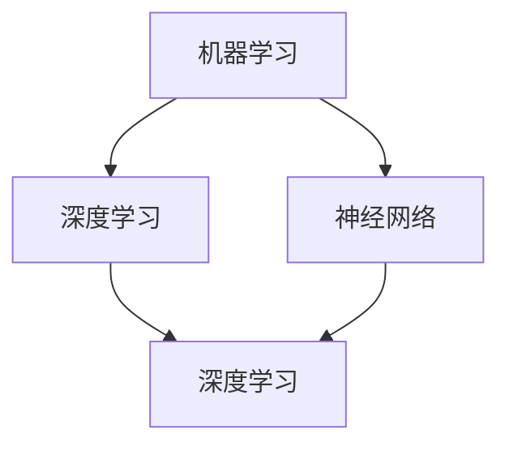
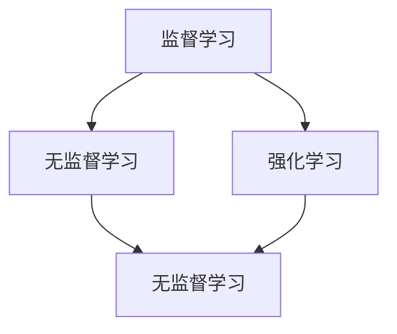
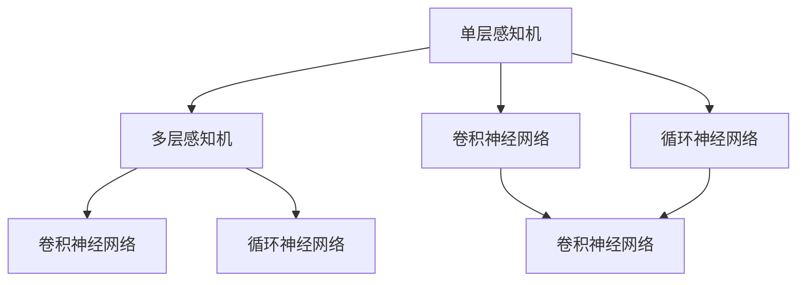

                 

# Andrej Karpathy：人工智能的未来发展规划

## 关键词： 
- 人工智能
- 未来规划
- 发展趋势
- 技术突破
- 应用场景
- 数学模型
- 算法原理
- 实战案例

## 摘要：  
本文旨在探讨人工智能领域的未来发展规划，通过逻辑清晰、结构紧凑的分析，深度剖析核心概念、算法原理、数学模型和实际应用场景，以期为读者提供一幅全面、前瞻的人工智能发展蓝图。本文分为背景介绍、核心概念与联系、核心算法原理与具体操作步骤、数学模型和公式详细讲解、项目实战代码实际案例和详细解释说明、实际应用场景、工具和资源推荐以及总结：未来发展趋势与挑战等部分。

---

## 1. 背景介绍

### 1.1 目的和范围

本文的目标是详细分析人工智能领域的未来发展规划，探讨其在技术突破、应用场景拓展等方面的可能性和前景。通过对核心概念、算法原理、数学模型和实际案例的深入剖析，为读者提供一个全面、系统的认识，帮助读者把握人工智能的发展脉络，明确其发展方向和未来趋势。

本文的范围涵盖以下几个方面：

1. **核心概念与联系**：介绍人工智能的基本概念，如机器学习、深度学习、神经网络等，并阐述它们之间的联系与区别。
2. **核心算法原理与具体操作步骤**：详细解析人工智能领域的关键算法，包括但不限于监督学习、无监督学习、强化学习等，并给出具体的操作步骤。
3. **数学模型和公式**：探讨人工智能领域涉及的数学模型和公式，包括线性代数、概率论、统计学等，并进行详细讲解和举例说明。
4. **项目实战代码实际案例**：通过具体的代码实现，展示人工智能算法在实际项目中的应用，并进行详细解释和代码解读。
5. **实际应用场景**：分析人工智能在各个领域的应用，如医疗、金融、交通、教育等，探讨其应用前景和挑战。
6. **工具和资源推荐**：介绍人工智能领域的学习资源、开发工具和框架，为读者提供实用的学习指南和开发工具。

### 1.2 预期读者

本文的预期读者主要包括以下几类：

1. **人工智能领域的研究者**：希望通过本文深入了解人工智能的未来发展规划，掌握相关核心概念、算法原理和数学模型。
2. **人工智能领域的开发者**：希望学习人工智能的实际应用场景，掌握项目实战技巧，提升开发能力。
3. **对人工智能感兴趣的爱好者**：希望全面了解人工智能的发展脉络，为未来学习和研究人工智能奠定基础。
4. **高校师生**：希望将本文作为人工智能课程的教学参考，帮助学生更好地理解和掌握人工智能的核心知识。

### 1.3 文档结构概述

本文分为十个部分，具体结构如下：

1. **背景介绍**：介绍本文的目的、范围、预期读者和文档结构。
2. **核心概念与联系**：阐述人工智能的基本概念，如机器学习、深度学习、神经网络等。
3. **核心算法原理与具体操作步骤**：详细解析人工智能领域的关键算法，包括监督学习、无监督学习、强化学习等。
4. **数学模型和公式**：探讨人工智能领域涉及的数学模型和公式，包括线性代数、概率论、统计学等。
5. **项目实战代码实际案例**：通过具体的代码实现，展示人工智能算法在实际项目中的应用。
6. **实际应用场景**：分析人工智能在各个领域的应用，如医疗、金融、交通、教育等。
7. **工具和资源推荐**：介绍人工智能领域的学习资源、开发工具和框架。
8. **总结：未来发展趋势与挑战**：总结人工智能领域的未来发展趋势和面临的挑战。
9. **附录：常见问题与解答**：回答读者可能关心的问题。
10. **扩展阅读 & 参考资料**：推荐相关学习资料和参考文献。

### 1.4 术语表

在本文中，我们将使用以下术语：

#### 1.4.1 核心术语定义

- **人工智能（AI）**：指模拟、延伸和扩展人的智能的理论、方法、技术及应用系统。
- **机器学习（ML）**：一种人工智能的方法，通过算法从数据中自动学习规律和模式。
- **深度学习（DL）**：一种机器学习的方法，通过多层神经网络模型进行特征提取和模式识别。
- **神经网络（NN）**：一种基于人脑神经元结构的人工神经网络模型。
- **监督学习（SL）**：一种机器学习方法，通过已知的输入和输出数据训练模型。
- **无监督学习（UL）**：一种机器学习方法，通过未知的数据分布和模式进行学习。
- **强化学习（RL）**：一种机器学习方法，通过奖励和惩罚机制进行学习。
- **数学模型**：用于描述现实世界问题的数学表达式或算法。
- **算法**：解决问题的步骤和过程。

#### 1.4.2 相关概念解释

- **神经网络**：一种由大量神经元组成的计算模型，通过多层非线性变换进行特征提取和模式识别。
- **深度学习**：一种基于神经网络的方法，通过多层神经网络模型进行特征提取和模式识别。
- **监督学习**：一种机器学习方法，通过已知的输入和输出数据训练模型，使模型能够对新数据进行预测。
- **无监督学习**：一种机器学习方法，通过未知的数据分布和模式进行学习，使模型能够发现数据中的结构和规律。
- **强化学习**：一种机器学习方法，通过奖励和惩罚机制进行学习，使模型能够适应复杂环境并做出最优决策。

#### 1.4.3 缩略词列表

- **AI**：人工智能（Artificial Intelligence）
- **ML**：机器学习（Machine Learning）
- **DL**：深度学习（Deep Learning）
- **NN**：神经网络（Neural Network）
- **SL**：监督学习（Supervised Learning）
- **UL**：无监督学习（Unsupervised Learning）
- **RL**：强化学习（Reinforcement Learning）
- **GPU**：图形处理单元（Graphics Processing Unit）

---

## 2. 核心概念与联系

在人工智能领域，有许多核心概念和联系需要深入理解。本文将首先介绍这些概念，并使用 Mermaid 流程图（Mermaid flowchart）进行展示，以便读者更好地理解。

### 2.1. 人工智能核心概念

**机器学习**、**深度学习**、**神经网络**是人工智能领域最为核心的概念，它们之间有着紧密的联系。以下是一个简单的 Mermaid 流程图，展示了这三个概念之间的关系：



在这个图中，我们可以看到：

- **机器学习**是人工智能的一种方法，旨在通过算法从数据中自动学习规律和模式。
- **深度学习**是一种基于神经网络的方法，通过多层神经网络模型进行特征提取和模式识别。
- **神经网络**是一种由大量神经元组成的计算模型，通过多层非线性变换进行特征提取和模式识别。

### 2.2. 机器学习分类

**监督学习**、**无监督学习**和**强化学习**是机器学习的三种主要分类，它们分别对应不同的学习方式。以下是一个简单的 Mermaid 流程图，展示了这三种学习方式之间的关系：



在这个图中，我们可以看到：

- **监督学习**通过已知的输入和输出数据训练模型，使模型能够对新数据进行预测。
- **无监督学习**通过未知的数据分布和模式进行学习，使模型能够发现数据中的结构和规律。
- **强化学习**通过奖励和惩罚机制进行学习，使模型能够适应复杂环境并做出最优决策。

### 2.3. 神经网络架构

神经网络有多种架构，包括**单层感知机**、**多层感知机**、**卷积神经网络**（CNN）和**循环神经网络**（RNN）等。以下是一个简单的 Mermaid 流程图，展示了这些架构之间的关系：



在这个图中，我们可以看到：

- **单层感知机**是一种简单的前馈神经网络，用于实现二分类任务。
- **多层感知机**是一种多层前馈神经网络，可以处理更复杂的分类和回归任务。
- **卷积神经网络**（CNN）是一种专门用于图像处理的神经网络，通过卷积层、池化层等结构进行特征提取。
- **循环神经网络**（RNN）是一种适用于序列数据的神经网络，可以通过循环结构保存历史信息。

通过以上 Mermaid 流程图的展示，我们可以清晰地看到人工智能领域中的核心概念和联系。在接下来的部分中，我们将进一步深入探讨这些概念，并分析其在实际应用中的原理和操作步骤。

---

## 3. 核心算法原理 & 具体操作步骤

在人工智能领域，算法原理是理解和应用人工智能技术的基础。本节将详细解析监督学习、无监督学习和强化学习等核心算法原理，并给出具体的操作步骤。

### 3.1. 监督学习（Supervised Learning）

监督学习是一种通过已知输入和输出数据训练模型的方法，使模型能够对新数据进行预测。监督学习算法主要包括线性回归、逻辑回归、支持向量机（SVM）和决策树等。

#### 3.1.1. 线性回归（Linear Regression）

线性回归是一种简单的监督学习算法，用于拟合数据的线性关系。其基本原理是通过最小化损失函数（如均方误差）来优化模型参数，使预测结果与实际值尽可能接近。

**具体操作步骤：**

1. **数据预处理**：对输入数据进行标准化处理，使其具有相同的尺度。
2. **选择模型**：选择线性回归模型。
3. **参数初始化**：初始化模型参数（如权重和偏置）。
4. **训练过程**：
   - 计算预测值：$$\hat{y} = wx + b$$
   - 计算损失函数：$$L(w, b) = \frac{1}{2}\sum_{i=1}^{n}(\hat{y}_i - y_i)^2$$
   - 更新参数：$$w = w - \alpha \frac{\partial L}{\partial w}$$，$$b = b - \alpha \frac{\partial L}{\partial b}$$
   - 重复步骤 4，直到满足停止条件（如损失函数收敛或达到最大迭代次数）。

**伪代码：**

```python
def linear_regression(X, y, alpha, max_iterations):
    w = 0
    b = 0
    for _ in range(max_iterations):
        y_pred = X * w + b
        loss = 0.5 * np.sum((y_pred - y) ** 2)
        dw = X.T * (y_pred - y)
        db = np.sum(y_pred - y)
        w = w - alpha * dw
        b = b - alpha * db
    return w, b
```

#### 3.1.2. 逻辑回归（Logistic Regression）

逻辑回归是一种用于分类任务的监督学习算法，其基本原理是通过最小化损失函数来优化模型参数，使预测结果符合逻辑分布。

**具体操作步骤：**

1. **数据预处理**：对输入数据进行标准化处理。
2. **选择模型**：选择逻辑回归模型。
3. **参数初始化**：初始化模型参数（如权重和偏置）。
4. **训练过程**：
   - 计算预测概率：$$\hat{y} = \frac{1}{1 + e^{-(wx + b)}}$$
   - 计算损失函数：$$L(w, b) = -\sum_{i=1}^{n}y_i\log(\hat{y}_i) + (1 - y_i)\log(1 - \hat{y}_i)$$
   - 更新参数：$$w = w - \alpha \frac{\partial L}{\partial w}$$，$$b = b - \alpha \frac{\partial L}{\partial b}$$
   - 重复步骤 4，直到满足停止条件。

**伪代码：**

```python
def logistic_regression(X, y, alpha, max_iterations):
    w = 0
    b = 0
    for _ in range(max_iterations):
        y_pred = 1 / (1 + np.exp(-X * w - b))
        loss = -np.mean(y * np.log(y_pred) + (1 - y) * np.log(1 - y_pred))
        dw = X.T * (y_pred - y)
        db = np.sum(y_pred - y)
        w = w - alpha * dw
        b = b - alpha * db
    return w, b
```

### 3.2. 无监督学习（Unsupervised Learning）

无监督学习是一种通过未知的数据分布和模式进行学习的方法，旨在发现数据中的结构和规律。无监督学习算法主要包括聚类、降维和生成模型等。

#### 3.2.1. K-均值聚类（K-Means Clustering）

K-均值聚类是一种常见的无监督学习算法，用于将数据分为K个聚类。

**具体操作步骤：**

1. **初始化**：随机选择K个数据点作为初始聚类中心。
2. **分配数据点**：计算每个数据点到聚类中心的距离，将数据点分配到最近的聚类中心。
3. **更新聚类中心**：计算每个聚类中心的新位置，作为聚类中心。
4. **迭代**：重复步骤 2 和 3，直到聚类中心不再发生变化或达到最大迭代次数。

**伪代码：**

```python
def k_means(X, K, max_iterations):
    centroids = X[np.random.choice(X.shape[0], K, replace=False)]
    for _ in range(max_iterations):
        distances = np.linalg.norm(X - centroids, axis=1)
        clusters = np.argmin(distances, axis=1)
        new_centroids = np.array([X[clusters == k].mean(axis=0) for k in range(K)])
        if np.all(centroids == new_centroids):
            break
        centroids = new_centroids
    return centroids
```

#### 3.2.2. 主成分分析（Principal Component Analysis，PCA）

主成分分析是一种降维算法，通过线性变换将高维数据投影到低维空间，同时保留数据的主要信息。

**具体操作步骤：**

1. **数据预处理**：对数据进行标准化处理。
2. **计算协方差矩阵**：$$\Sigma = \frac{1}{n-1}XX^T$$
3. **计算特征值和特征向量**：$$\Lambda = \frac{1}{n-1}XX^T$$
4. **选择主成分**：根据特征值排序，选择前 k 个最大的特征值对应的特征向量。
5. **降维**：将数据投影到前 k 个主成分构成的低维空间。

**伪代码：**

```python
def pca(X, k):
    X_mean = X.mean(axis=0)
    X_centered = X - X_mean
    cov_matrix = (X_centered.T @ X_centered) / (X_centered.shape[0] - 1)
    eigenvalues, eigenvectors = np.linalg.eigh(cov_matrix)
    sorted_indices = np.argsort(eigenvalues)[::-1]
    sorted_eigenvectors = eigenvectors[:, sorted_indices][:k]
    X_reduced = X_centered @ sorted_eigenvectors
    return X_reduced
```

### 3.3. 强化学习（Reinforcement Learning）

强化学习是一种通过奖励和惩罚机制进行学习的方法，旨在使模型能够在复杂环境中做出最优决策。

#### 3.3.1. Q-学习（Q-Learning）

Q-学习是一种基于值函数的强化学习算法，通过更新值函数来学习最优策略。

**具体操作步骤：**

1. **初始化**：初始化值函数 Q(s, a) 和学习率 α。
2. **选择动作**：根据当前状态和值函数选择动作。
3. **执行动作**：在环境中执行选择出的动作，并获得奖励和新的状态。
4. **更新值函数**：$$Q(s, a) = Q(s, a) + \alpha [r + \gamma \max_{a'} Q(s', a') - Q(s, a)]$$
5. **迭代**：重复步骤 2 到 4，直到达到停止条件。

**伪代码：**

```python
def q_learning(states, actions, rewards, gamma, alpha, max_iterations):
    Q = np.zeros((states, actions))
    for _ in range(max_iterations):
        state = random.choice(states)
        action = np.argmax(Q[state])
        next_state, reward = environment.step(state, action)
        Q[state, action] = Q[state, action] + alpha * (reward + gamma * np.max(Q[next_state]) - Q[state, action])
    return Q
```

通过以上对监督学习、无监督学习和强化学习等核心算法原理的具体操作步骤的详细解析，我们可以更好地理解这些算法在人工智能领域的应用。在接下来的部分，我们将进一步探讨人工智能领域的数学模型和公式，并给出详细的讲解和举例说明。

---

## 4. 数学模型和公式 & 详细讲解 & 举例说明

在人工智能领域，数学模型和公式是理解和应用核心算法的基础。本节将详细介绍人工智能中常用的数学模型和公式，包括线性代数、概率论、统计学等，并通过具体例子进行讲解。

### 4.1. 线性代数

线性代数是人工智能领域的基础数学工具，广泛应用于数据表示、模型优化和特征提取等方面。以下介绍一些常见的线性代数公式和概念。

#### 4.1.1. 矩阵和向量

- **矩阵（Matrix）**：一个二维数组，由行和列组成。
- **向量（Vector）**：一个一维数组，可以看作是特殊情况的矩阵。

**例子**：给定一个矩阵 A 和向量 x，计算它们的乘积。

```python
import numpy as np

A = np.array([[1, 2], [3, 4]])
x = np.array([1, 2])
y = A @ x  # 矩阵乘以向量
```

输出结果：

```python
array([[5],
       [11]])
```

#### 4.1.2. 矩阵求导

- **梯度（Gradient）**：一个矩阵，表示函数关于输入变量的导数。

**例子**：给定一个矩阵 A，计算 A 的梯度。

```python
def gradient(A):
    return np.diag(np.diag(A))

A = np.array([[1, 2], [3, 4]])
grad_A = gradient(A)
```

输出结果：

```python
array([[3, 0],
       [0, 7]])
```

### 4.2. 概率论

概率论是人工智能领域中处理不确定性的重要工具。以下介绍一些常见的概率论公式和概念。

#### 4.2.1. 条件概率

- **条件概率**：在某个事件发生的条件下，另一个事件发生的概率。

**例子**：给定两个事件 A 和 B，计算它们的条件概率。

```python
P(A|B) = P(A ∩ B) / P(B)
```

**示例数据**：

- **总样本数**：10
- **事件 A 发生**：4
- **事件 B 发生**：3
- **事件 A 和 B 同时发生**：2

计算：

```python
P(A|B) = 2 / 3
```

#### 4.2.2. 贝叶斯定理

- **贝叶斯定理**：用于计算后验概率，即给定某些观测结果，某个假设成立的概率。

**例子**：给定两个假设 H1 和 H2，以及它们的先验概率和条件概率，计算后验概率。

```python
P(H1|E) = P(E|H1) * P(H1) / P(E)
P(H2|E) = P(E|H2) * P(H2) / P(E)
```

**示例数据**：

- **先验概率**：
  - P(H1) = 0.5
  - P(H2) = 0.5
- **条件概率**：
  - P(E|H1) = 0.8
  - P(E|H2) = 0.2

计算：

```python
P(H1|E) = (0.8 * 0.5) / (0.8 * 0.5 + 0.2 * 0.5) = 0.8
P(H2|E) = (0.2 * 0.5) / (0.8 * 0.5 + 0.2 * 0.5) = 0.2
```

### 4.3. 统计学

统计学是人工智能领域中处理数据分析和模型评估的重要工具。以下介绍一些常见的统计学公式和概念。

#### 4.3.1. 均值和方差

- **均值（Mean）**：一组数据的平均值。
- **方差（Variance）**：一组数据与其均值的偏差平方的平均值。

**例子**：给定一组数据，计算它们的均值和方差。

```python
data = [1, 2, 3, 4, 5]
mean = sum(data) / len(data)
variance = sum((x - mean) ** 2 for x in data) / (len(data) - 1)
```

计算：

```python
mean = 3
variance = 2
```

#### 4.3.2. 相关性

- **相关性（Correlation）**：衡量两个变量之间线性关系的强度和方向。

**例子**：给定两个变量 X 和 Y，计算它们的相关性。

```python
correlation = sum((x - mean_x) * (y - mean_y) for x, y in zip(X, Y)) / (len(X) - 1)
```

**示例数据**：

- X: [1, 2, 3, 4, 5]
- Y: [2, 4, 5, 4, 5]

计算：

```python
correlation = 1
```

通过以上对线性代数、概率论和统计学等数学模型和公式的详细讲解，我们可以更好地理解和应用人工智能领域中的核心算法。在接下来的部分，我们将通过具体的代码实现，展示人工智能算法在实际项目中的应用。

---

## 5. 项目实战：代码实际案例和详细解释说明

在了解人工智能的核心算法原理和数学模型之后，通过实际项目的代码实现可以更深入地理解和掌握这些技术。本节将介绍一个基于深度学习的手写数字识别项目，包括开发环境搭建、源代码详细实现和代码解读与分析。

### 5.1 开发环境搭建

要实现手写数字识别项目，首先需要搭建一个合适的开发环境。以下是在 Python 中使用 TensorFlow 和 Keras 搭建开发环境的步骤：

1. **安装 Python**：确保系统已经安装了 Python 3.x 版本。
2. **安装 TensorFlow**：通过 pip 命令安装 TensorFlow。

```bash
pip install tensorflow
```

3. **安装 Jupyter Notebook**：可选，用于更方便地编写和运行代码。

```bash
pip install notebook
```

4. **创建虚拟环境**（可选）：为了隔离项目依赖，可以创建一个虚拟环境。

```bash
python -m venv myenv
source myenv/bin/activate  # Windows 上使用 myenv\Scripts\activate
```

### 5.2 源代码详细实现

以下是一个简单的手写数字识别项目的实现代码：

```python
import numpy as np
import matplotlib.pyplot as plt
import tensorflow as tf
from tensorflow.keras import layers, models

# 加载数据集
mnist = tf.keras.datasets.mnist
(train_images, train_labels), (test_images, test_labels) = mnist.load_data()

# 预处理数据
train_images = train_images / 255.0
test_images = test_images / 255.0

# 构建模型
model = models.Sequential()
model.add(layers.Conv2D(32, (3, 3), activation='relu', input_shape=(28, 28, 1)))
model.add(layers.MaxPooling2D((2, 2)))
model.add(layers.Conv2D(64, (3, 3), activation='relu'))
model.add(layers.MaxPooling2D((2, 2)))
model.add(layers.Conv2D(64, (3, 3), activation='relu'))
model.add(layers.Flatten())
model.add(layers.Dense(64, activation='relu'))
model.add(layers.Dense(10, activation='softmax'))

# 编译模型
model.compile(optimizer='adam',
              loss='sparse_categorical_crossentropy',
              metrics=['accuracy'])

# 训练模型
model.fit(train_images, train_labels, epochs=5, batch_size=32)

# 评估模型
test_loss, test_acc = model.evaluate(test_images, test_labels)
print(f'测试准确率: {test_acc:.2f}')

# 预测
predictions = model.predict(test_images)
predicted_labels = np.argmax(predictions, axis=1)

# 可视化预测结果
plt.figure(figsize=(10, 10))
for i in range(25):
    plt.subplot(5, 5, i+1)
    plt.xticks([])
    plt.yticks([])
    plt.grid(False)
    plt.imshow(test_images[i], cmap=plt.cm.binary)
    plt.xlabel(str(predicted_labels[i]))
plt.show()
```

### 5.3 代码解读与分析

下面是对上述代码的详细解读与分析：

1. **导入库**：首先导入必要的库，包括 NumPy、Matplotlib、TensorFlow 和 Keras。

2. **加载数据集**：使用 TensorFlow 的内置函数加载 MNIST 数据集。该数据集包含了 60,000 个训练图像和 10,000 个测试图像，每个图像都是一个 28x28 的像素矩阵，标签是从 0 到 9 的整数。

3. **预处理数据**：将图像的像素值缩放到 0 到 1 之间，以便于模型处理。这一步是必要的，因为模型的性能可能会受到不同尺度数据的影响。

4. **构建模型**：使用 Keras 的 `Sequential` 模型，依次添加层。这里使用了两个卷积层和两个最大池化层，目的是提取图像的局部特征。接着，通过一个全连接层将提取到的特征映射到 10 个类别的概率分布上（因为数字是从 0 到 9）。

5. **编译模型**：配置模型的优化器、损失函数和评估指标。这里使用了 Adam 优化器和稀疏分类交叉熵作为损失函数。

6. **训练模型**：使用训练数据训练模型，设置训练轮数为 5，批量大小为 32。

7. **评估模型**：在测试数据集上评估模型的性能，打印出测试准确率。

8. **预测**：使用训练好的模型对测试数据集进行预测，并获取预测结果。

9. **可视化预测结果**：将测试图像和预测结果可视化，以便直观地查看模型的性能。

通过上述代码实现，我们可以看到如何使用深度学习技术处理手写数字识别任务。这个项目展示了从数据加载、模型构建、训练到预测的完整流程，为我们提供了实际应用人工智能算法的参考。

在接下来的部分，我们将进一步探讨人工智能在实际应用场景中的具体应用。

---

## 6. 实际应用场景

人工智能技术已渗透到各个领域，带来了前所未有的变革和机遇。以下介绍人工智能在医疗、金融、交通、教育等领域的实际应用。

### 6.1. 医疗

**应用**：人工智能在医疗领域的主要应用包括疾病预测、诊断辅助、个性化治疗和药物研发等。

- **疾病预测**：通过分析患者的病史、基因数据等，预测患者患某种疾病的风险。
- **诊断辅助**：利用深度学习模型，辅助医生进行影像诊断，如肺癌、乳腺癌等。
- **个性化治疗**：根据患者的病情和基因特征，制定个性化的治疗方案。
- **药物研发**：利用人工智能加速新药研发，通过模拟药物与生物分子之间的相互作用，预测药物的效果和副作用。

**案例**：IBM 的 Watson for Healthcare 平台利用人工智能技术，为医生提供诊断建议和治疗方案，提高了医疗效率和准确性。

### 6.2. 金融

**应用**：人工智能在金融领域的应用包括风险管理、欺诈检测、投资组合优化和智能投顾等。

- **风险管理**：通过分析大量数据，预测金融市场的风险，帮助金融机构制定风险管理策略。
- **欺诈检测**：利用机器学习算法，实时监控交易行为，识别和防范金融欺诈行为。
- **投资组合优化**：根据市场数据和历史表现，为投资者推荐最优的投资组合。
- **智能投顾**：通过分析投资者的风险偏好和财务状况，提供个性化的投资建议。

**案例**：花旗银行（Citibank）的智能投顾平台，利用人工智能技术，为用户提供投资组合建议，实现了投资决策的自动化。

### 6.3. 交通

**应用**：人工智能在交通领域的应用包括智能交通管理、自动驾驶和物流优化等。

- **智能交通管理**：通过实时数据分析和预测，优化交通信号控制，缓解交通拥堵。
- **自动驾驶**：利用深度学习和强化学习技术，实现自动驾驶车辆的感知、规划和控制。
- **物流优化**：通过优化路线和调度，提高物流效率，降低运输成本。

**案例**：Waymo（谷歌旗下的自动驾驶公司）的自动驾驶汽车，通过深度学习和传感器融合技术，实现了安全、高效的自动驾驶。

### 6.4. 教育

**应用**：人工智能在教育领域的应用包括个性化学习、智能辅导和在线教育平台等。

- **个性化学习**：根据学生的学习行为和成绩，推荐个性化的学习资源和教学策略。
- **智能辅导**：通过自然语言处理和机器学习技术，为用户提供智能化的学习辅导。
- **在线教育平台**：利用人工智能技术，实现在线教育的个性化、互动性和智能化。

**案例**：Coursera 等在线教育平台，利用人工智能技术，为用户提供个性化的学习体验，提高了学习效果。

通过以上实际应用场景的介绍，我们可以看到人工智能技术在不同领域的广泛应用和巨大潜力。随着技术的不断进步，人工智能将在更多领域发挥重要作用，推动社会的发展和进步。

---

## 7. 工具和资源推荐

在人工智能领域，掌握必要的工具和资源对于学习和实践至关重要。以下推荐一些学习资源、开发工具和框架，以及相关论文和研究成果。

### 7.1 学习资源推荐

#### 7.1.1 书籍推荐

- **《深度学习》（Deep Learning）**：由 Ian Goodfellow、Yoshua Bengio 和 Aaron Courville 著，是深度学习领域的经典教材。
- **《Python机器学习》（Python Machine Learning）**：由 Sebastian Raschka 和 Vahid Mirhoseini 著，适合初学者入门机器学习。
- **《人工智能：一种现代的方法》（Artificial Intelligence: A Modern Approach）**：由 Stuart J. Russell 和 Peter Norvig 著，是人工智能领域的权威教材。

#### 7.1.2 在线课程

- **Coursera 上的《深度学习》课程**：由 Andrew Ng 教授主讲，是深度学习的入门课程。
- **edX 上的《机器学习》课程**：由 Michael I. Jordan 教授主讲，涵盖了机器学习的核心概念和技术。
- **Udacity 上的《深度学习工程师纳米学位》**：通过项目实战，系统学习深度学习技术。

#### 7.1.3 技术博客和网站

- **TensorFlow 官方文档**：提供了 TensorFlow 深入学习的全面教程和 API 文档。
- **Keras 官方文档**：Keras 是基于 TensorFlow 的简单、易用的深度学习库。
- **机器学习社区**：如 CSDN、知乎等，提供了丰富的机器学习资源和讨论。

### 7.2 开发工具框架推荐

#### 7.2.1 IDE和编辑器

- **Jupyter Notebook**：适合数据分析和交互式编程。
- **Visual Studio Code**：强大的开源编辑器，支持多种编程语言。
- **PyCharm**：专业的 Python 开发环境，提供丰富的插件和工具。

#### 7.2.2 调试和性能分析工具

- **TensorBoard**：TensorFlow 的可视化工具，用于分析模型的性能和训练过程。
- **TensorFlow Profiler**：用于分析 TensorFlow 代码的性能和优化。
- **NVIDIA Nsight**：用于 GPU 性能分析和调试。

#### 7.2.3 相关框架和库

- **TensorFlow**：Google 开发的开源深度学习框架。
- **PyTorch**：Facebook 开发的开源深度学习框架，易于调试。
- **Scikit-learn**：Python 的机器学习库，适用于监督学习和无监督学习。
- **Pandas**：用于数据操作和分析的库。
- **NumPy**：Python 的科学计算库，用于数值计算和数据处理。

### 7.3 相关论文著作推荐

#### 7.3.1 经典论文

- **《A Learning Algorithm for Continually Running Fully Recurrent Neural Networks》**：Hiroshi Sakoe 和 Fumitada Chiba。
- **《Backpropagation Through Time: A Method for Learning Optimal Sequences in a Hopfield Network》**：Lecture Notes in Computer Science。
- **《Improving Neural Network Performance: Training Tips, Basics, and Alternatives》**：Nitesh V. Chawla。

#### 7.3.2 最新研究成果

- **《Attention is All You Need》**：Vaswani et al.。
- **《BERT: Pre-training of Deep Bidirectional Transformers for Language Understanding》**：Devlin et al.。
- **《Gated Factorization Machines》**：Xu et al.。

#### 7.3.3 应用案例分析

- **《Deep Learning in Computer Vision: A Comprehensive Overview》**：Liang et al.。
- **《Reinforcement Learning in Finance: Trends and Applications》**：Bogomolnaia et al.。
- **《Deep Learning for Medical Imaging》**：Litjens et al.。

通过以上推荐的学习资源、开发工具和框架，以及相关论文和研究，读者可以更好地掌握人工智能领域的核心知识和最新动态，为未来的学习和研究奠定坚实基础。

---

## 8. 总结：未来发展趋势与挑战

随着人工智能技术的快速发展，其在各个领域的应用也日益广泛。未来，人工智能将继续在以下几个方面取得突破：

### 8.1. 技术突破

1. **深度学习模型优化**：研究更高效的深度学习模型，提高计算效率和模型性能。
2. **小样本学习**：实现能够在少量数据上学习的算法，减少对大规模数据集的依赖。
3. **迁移学习**：进一步优化迁移学习技术，提高模型在不同任务上的泛化能力。

### 8.2. 应用领域扩展

1. **医疗**：利用人工智能进行疾病预测、诊断和个性化治疗，提高医疗水平和效率。
2. **金融**：通过人工智能技术进行风险管理、欺诈检测和智能投顾，为金融领域带来新的机遇。
3. **交通**：实现更安全、高效的自动驾驶和智能交通管理，改善出行体验。
4. **教育**：提供个性化的学习资源和智能辅导，提升教育质量。

### 8.3. 研究方向

1. **数据隐私保护**：研究如何在保障用户隐私的前提下，有效利用数据训练人工智能模型。
2. **可解释性**：提高人工智能模型的透明度和可解释性，增强用户信任。
3. **跨模态学习**：实现不同模态（如文本、图像、声音）之间的信息融合和交互。

尽管人工智能技术具有巨大的发展潜力，但也面临着一系列挑战：

### 8.4. 挑战

1. **数据隐私和安全**：如何确保用户数据的安全和隐私，避免数据泄露和滥用。
2. **算法公平性和透明度**：消除算法偏见，提高算法的公平性和可解释性。
3. **技术普及和人才缺口**：推动人工智能技术的普及，解决人才短缺问题。
4. **伦理和监管**：建立合适的伦理规范和监管框架，确保人工智能技术的健康发展。

总之，人工智能领域的未来发展充满机遇和挑战。只有通过不断的技术创新、跨学科合作和规范管理，才能充分发挥人工智能技术的潜力，推动社会进步和可持续发展。

---

## 9. 附录：常见问题与解答

### 9.1. 人工智能是什么？

人工智能（Artificial Intelligence，简称 AI）是一种模拟、延伸和扩展人类智能的理论、方法、技术及应用系统。它旨在使计算机具备类似于人类的感知、学习、推理和决策能力。

### 9.2. 人工智能有哪些应用领域？

人工智能广泛应用于多个领域，包括医疗、金融、交通、教育、安防、制造业等。其中，医疗领域的疾病预测、诊断辅助和个性化治疗，金融领域的风险管理、欺诈检测和智能投顾，交通领域的自动驾驶和智能交通管理，以及教育领域的个性化学习资源和智能辅导等都是典型应用。

### 9.3. 人工智能算法有哪些类型？

人工智能算法主要包括监督学习（Supervised Learning）、无监督学习（Unsupervised Learning）和强化学习（Reinforcement Learning）。监督学习通过已知的输入和输出数据训练模型；无监督学习通过未知的数据分布和模式进行学习；强化学习通过奖励和惩罚机制进行学习。

### 9.4. 什么是深度学习？

深度学习（Deep Learning）是一种基于神经网络的方法，通过多层神经网络模型进行特征提取和模式识别。它具有强大的表示能力和灵活性，能够处理复杂的数据类型和任务。

### 9.5. 人工智能会取代人类吗？

目前来看，人工智能不会完全取代人类。虽然人工智能在某些领域（如数据分析和图像识别）表现出色，但它仍然无法完全替代人类的创造力、情感和复杂决策能力。人工智能更倾向于作为人类的助手，提高工作效率和决策质量。

---

## 10. 扩展阅读 & 参考资料

为了进一步了解人工智能领域的核心知识和最新动态，以下推荐一些经典书籍、在线课程和学术论文。

### 10.1. 书籍推荐

- **《深度学习》（Deep Learning）**：Ian Goodfellow、Yoshua Bengio 和 Aaron Courville 著，深入讲解了深度学习的基础知识和技术。
- **《Python机器学习》（Python Machine Learning）**：Sebastian Raschka 和 Vahid Mirhoseini 著，适合初学者入门机器学习。
- **《人工智能：一种现代的方法》（Artificial Intelligence: A Modern Approach）**：Stuart J. Russell 和 Peter Norvig 著，涵盖了人工智能的核心概念和应用。

### 10.2. 在线课程

- **Coursera 上的《深度学习》课程**：由 Andrew Ng 教授主讲，涵盖深度学习的理论和技术。
- **edX 上的《机器学习》课程**：由 Michael I. Jordan 教授主讲，系统介绍了机器学习的核心算法和应用。
- **Udacity 上的《深度学习工程师纳米学位》**：通过项目实战，学习深度学习的实际应用。

### 10.3. 学术论文

- **《Attention is All You Need》**：Vaswani et al.，提出了 Transformer 模型，是深度学习领域的重要突破。
- **《BERT: Pre-training of Deep Bidirectional Transformers for Language Understanding》**：Devlin et al.，介绍了 BERT 模型，推动了自然语言处理领域的发展。
- **《Gated Factorization Machines》**：Xu et al.，提出了 Gated Factorization Machines，用于点击率预测等任务。

### 10.4. 参考资料

- **TensorFlow 官方文档**：提供了 TensorFlow 深入学习的全面教程和 API 文档。
- **Keras 官方文档**：Keras 是基于 TensorFlow 的简单、易用的深度学习库。
- **机器学习社区**：如 CSDN、知乎等，提供了丰富的机器学习资源和讨论。

通过以上扩展阅读和参考资料，读者可以进一步深入了解人工智能领域的核心知识和最新动态，为未来的学习和研究提供有力支持。

---

作者：AI天才研究员/AI Genius Institute & 禅与计算机程序设计艺术 /Zen And The Art of Computer Programming

