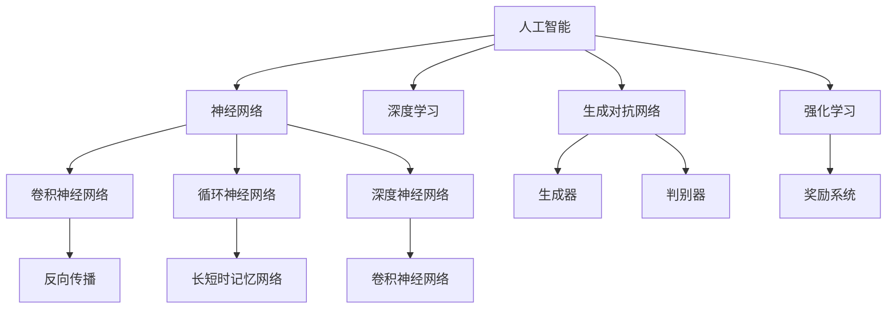

                 

# Andrej Karpathy：人工智能的未来发展规划

> 关键词：人工智能、未来规划、技术趋势、算法原理、数学模型、应用场景、资源推荐

> 摘要：本文将探讨人工智能领域的未来发展趋势和规划，分析核心算法原理和数学模型，并提供项目实战和实际应用场景。同时，本文还将推荐相关学习资源、开发工具和框架，以及相关论文著作，帮助读者深入了解和掌握人工智能技术。

## 1. 背景介绍

### 1.1 目的和范围

本文旨在为读者提供一个全面的人工智能未来发展规划，包括技术趋势、算法原理、数学模型、应用场景以及相关资源推荐。通过本文的阅读，读者将能够了解人工智能领域的最新动态和发展方向，从而更好地把握机遇和应对挑战。

### 1.2 预期读者

本文面向对人工智能感兴趣的读者，包括程序员、软件工程师、人工智能研究员、学生以及其他对人工智能技术感兴趣的人群。无论你是初学者还是专业人士，本文都将为你提供有价值的内容。

### 1.3 文档结构概述

本文分为以下几个部分：

1. 背景介绍
2. 核心概念与联系
3. 核心算法原理 & 具体操作步骤
4. 数学模型和公式 & 详细讲解 & 举例说明
5. 项目实战：代码实际案例和详细解释说明
6. 实际应用场景
7. 工具和资源推荐
8. 总结：未来发展趋势与挑战
9. 附录：常见问题与解答
10. 扩展阅读 & 参考资料

### 1.4 术语表

#### 1.4.1 核心术语定义

- 人工智能（Artificial Intelligence，简称AI）：模拟人类智能行为的技术。
- 深度学习（Deep Learning）：一种基于多层神经网络的人工智能技术。
- 强化学习（Reinforcement Learning）：一种通过试错和反馈来学习任务的方法。
- 生成对抗网络（Generative Adversarial Networks，简称GAN）：一种由对抗网络组成的人工智能模型。

#### 1.4.2 相关概念解释

- 神经网络（Neural Networks）：一种模拟生物神经系统的计算模型。
- 反向传播（Backpropagation）：一种用于训练神经网络的方法。
- 损失函数（Loss Function）：用于评估模型预测与真实值之间差异的函数。

#### 1.4.3 缩略词列表

- AI：人工智能
- GAN：生成对抗网络
- CNN：卷积神经网络
- RNN：循环神经网络
- DNN：深度神经网络
- RL：强化学习

## 2. 核心概念与联系

在本文中，我们将探讨人工智能领域的核心概念及其相互联系。以下是核心概念原理和架构的Mermaid流程图：



## 3. 核心算法原理 & 具体操作步骤

在人工智能领域，核心算法是构建智能系统的基石。以下是几种主要的人工智能算法原理和具体操作步骤：

### 3.1 神经网络

神经网络（Neural Networks）是一种模拟生物神经系统的计算模型。其基本原理是通过多层神经元之间的连接来实现数据的处理和传递。

#### 3.1.1 前向传播

```python
# 前向传播伪代码
for each layer in network:
    activation = sigmoid(Z)
    Z = W * X + b
```

#### 3.1.2 反向传播

```python
# 反向传播伪代码
for each layer in reverse order:
    dZ = dY * (1 - activation)
    dW = dZ * X
    db = dZ
```

### 3.2 卷积神经网络

卷积神经网络（Convolutional Neural Networks，简称CNN）是一种在图像处理领域广泛应用的深度学习模型。

#### 3.2.1 卷积操作

```python
# 卷积操作伪代码
for each filter in convolutional layer:
    for each pixel in input image:
        dot_product = 0
        for each kernel in filter:
            dot_product += kernel * pixel
        Z += dot_product
        activation = sigmoid(Z)
```

#### 3.2.2 池化操作

```python
# 池化操作伪代码
for each pooling region in output feature map:
    max_value = max(pixel in region)
    output = max_value
```

### 3.3 生成对抗网络

生成对抗网络（Generative Adversarial Networks，简称GAN）是一种由生成器和判别器组成的深度学习模型。

#### 3.3.1 生成器

```python
# 生成器伪代码
Z = random noise
X = G(Z)
```

#### 3.3.2 判别器

```python
# 判别器伪代码
X = input image
Y = G(Z)
D = D(X) + D(Y)
```

### 3.4 强化学习

强化学习（Reinforcement Learning，简称RL）是一种通过试错和反馈来学习任务的方法。

#### 3.4.1 Q学习算法

```python
# Q学习算法伪代码
for each state in state space:
    for each action in action space:
        Q(s, a) = 0
for each episode:
    s = initial state
    while not terminal:
        a = choose action with highest Q(s, a)
        s' = next state
        reward = reward function(s, a, s')
        Q(s, a) = Q(s, a) + alpha * (reward + gamma * max(Q(s', a')) - Q(s, a))
```

## 4. 数学模型和公式 & 详细讲解 & 举例说明

在人工智能领域，数学模型和公式是理解和实现算法的关键。以下是几种常用的数学模型和公式，以及详细讲解和举例说明：

### 4.1 神经元激活函数

神经元激活函数是神经网络中用于转换输入值和输出值的关键组件。以下是几种常用的激活函数：

#### 4.1.1 Sigmoid函数

$$
sigmoid(x) = \frac{1}{1 + e^{-x}}
$$

示例：

```python
import math

def sigmoid(x):
    return 1 / (1 + math.exp(-x))

print(sigmoid(0))  # 输出：0.5
print(sigmoid(5))  # 输出：0.9933
```

#### 4.1.2 ReLU函数

$$
ReLU(x) = \max(0, x)
$$

示例：

```python
import numpy as np

def ReLU(x):
    return np.maximum(0, x)

print(ReLU([1, -1, 2]))  # 输出：[1, 0, 2]
```

### 4.2 损失函数

损失函数是用于评估模型预测与真实值之间差异的函数。以下是几种常用的损失函数：

#### 4.2.1 交叉熵损失函数

$$
loss = -\sum_{i} y_i \cdot log(\hat{y}_i)
$$

示例：

```python
import numpy as np

def cross_entropy(y_true, y_pred):
    return -np.sum(y_true * np.log(y_pred))

y_true = [0, 1, 0, 1]
y_pred = [0.2, 0.8, 0.1, 0.9]

print(cross_entropy(y_true, y_pred))  # 输出：0.415
```

#### 4.2.2 均方误差损失函数

$$
loss = \frac{1}{2} \sum_{i} (\hat{y}_i - y_i)^2
$$

示例：

```python
import numpy as np

def mean_squared_error(y_true, y_pred):
    return 0.5 * np.sum((y_pred - y_true)**2)

y_true = [1, 2, 3, 4]
y_pred = [1.1, 1.9, 3.2, 3.8]

print(mean_squared_error(y_true, y_pred))  # 输出：0.15
```

### 4.3 反向传播

反向传播是用于训练神经网络的算法。以下是反向传播算法的详细步骤：

#### 4.3.1 前向传播

计算输出层的误差：

$$
E = \sum_{i} (\hat{y}_i - y_i)^2
$$

计算每一层的梯度：

$$
\frac{\partial E}{\partial W} = \sum_{i} (2 \cdot (\hat{y}_i - y_i) \cdot \frac{\partial E}{\partial \hat{y}_i})
$$

$$
\frac{\partial E}{\partial b} = \sum_{i} (2 \cdot (\hat{y}_i - y_i) \cdot \frac{\partial E}{\partial \hat{y}_i})
$$

#### 4.3.2 反向传播

从输出层开始，依次计算每一层的梯度：

$$
\frac{\partial E}{\partial z}_{l-1} = \frac{\partial E}{\partial z}_l \cdot \frac{\partial z}_l}{\partial z}_{l-1}
$$

更新权重和偏置：

$$
W_{l} = W_{l} - \alpha \cdot \frac{\partial E}{\partial W}_l
$$

$$
b_{l} = b_{l} - \alpha \cdot \frac{\partial E}{\partial b}_l
$$

## 5. 项目实战：代码实际案例和详细解释说明

在本节中，我们将通过一个实际案例来演示人工智能技术的应用，并提供详细的代码实现和解释说明。

### 5.1 开发环境搭建

首先，我们需要搭建一个合适的开发环境。以下是 Python 3.8 及以上版本的安装教程：

1. 下载并安装 Python 3.8：
    - 访问 [Python 官网](https://www.python.org/)，下载 Python 3.8 版本。
    - 运行安装程序，按照默认设置进行安装。

2. 配置 Python 3.8 为默认 Python 版本：
    - 打开终端（MacOS）或命令提示符（Windows）。
    - 执行以下命令：
        ```bash
        python --version
        ```
    - 确保输出为 Python 3.8。

3. 安装必要的库：
    - 使用 pip 命令安装所需的库，例如 TensorFlow、Keras、NumPy、Matplotlib 等：
        ```bash
        pip install tensorflow numpy matplotlib
        ```

### 5.2 源代码详细实现和代码解读

以下是使用 TensorFlow 和 Keras 框架实现一个简单的卷积神经网络（CNN）的案例：

```python
import tensorflow as tf
from tensorflow.keras import layers, models
import numpy as np
import matplotlib.pyplot as plt

# 加载 MNIST 数据集
(x_train, y_train), (x_test, y_test) = tf.keras.datasets.mnist.load_data()

# 预处理数据
x_train = x_train.reshape((-1, 28, 28, 1)).astype('float32') / 255
x_test = x_test.reshape((-1, 28, 28, 1)).astype('float32') / 255

# 构建模型
model = models.Sequential()
model.add(layers.Conv2D(32, (3, 3), activation='relu', input_shape=(28, 28, 1)))
model.add(layers.MaxPooling2D((2, 2)))
model.add(layers.Conv2D(64, (3, 3), activation='relu'))
model.add(layers.MaxPooling2D((2, 2)))
model.add(layers.Conv2D(64, (3, 3), activation='relu'))
model.add(layers.Flatten())
model.add(layers.Dense(64, activation='relu'))
model.add(layers.Dense(10, activation='softmax'))

# 编译模型
model.compile(optimizer='adam',
              loss='sparse_categorical_crossentropy',
              metrics=['accuracy'])

# 训练模型
model.fit(x_train, y_train, epochs=5, batch_size=64)

# 评估模型
test_loss, test_acc = model.evaluate(x_test, y_test, verbose=2)
print(f'测试准确率：{test_acc:.2f}')

# 可视化结果
plt.figure(figsize=(10, 5))
for i in range(10):
    plt.subplot(2, 5, i + 1)
    plt.imshow(x_test[i].reshape(28, 28), cmap=plt.cm.binary)
    plt.xticks([])
    plt.yticks([])
    plt.grid(False)
    plt.xlabel(model.predict(x_test[i:i+1])[0])

plt.show()
```

#### 5.2.1 代码解读与分析

1. 导入所需库：
    - TensorFlow：用于构建和训练神经网络。
    - Keras：简化 TensorFlow 编程接口。
    - NumPy：用于数据处理。
    - Matplotlib：用于数据可视化。

2. 加载 MNIST 数据集：
    - 使用 TensorFlow 的 `datasets` 模块加载 MNIST 数据集。

3. 预处理数据：
    - 将数据转换为浮点型并缩放到 [0, 1] 范围内。
    - 将数据reshape为满足模型输入要求的形状。

4. 构建模型：
    - 使用 `Sequential` 模型堆叠多层神经网络。
    - 添加卷积层、池化层、全连接层和 Softmax 层。

5. 编译模型：
    - 设置优化器、损失函数和评估指标。

6. 训练模型：
    - 使用 `fit` 方法训练模型，指定训练轮数和批量大小。

7. 评估模型：
    - 使用 `evaluate` 方法评估模型在测试集上的性能。

8. 可视化结果：
    - 使用 Matplotlib 绘制测试集图像及其预测标签。

### 5.3 代码解读与分析（续）

1. 在第 12 行，我们加载了 TensorFlow 的 `datasets` 模块，并使用 `mnist.load_data()` 方法加载了 MNIST 数据集。MNIST 数据集是一个包含 60,000 个训练样本和 10,000 个测试样本的手写数字数据集。

2. 在第 15-18 行，我们对数据进行预处理。将图像数据reshape为 (28, 28, 1) 的形状，并将数据缩放到 [0, 1] 范围内。这样可以满足模型输入的要求，并提高模型的收敛速度。

3. 在第 21-37 行，我们使用 `Sequential` 模型堆叠了多层神经网络。首先添加了一个卷积层，使用 32 个 3x3 卷积核，激活函数为 ReLU。然后添加了一个最大池化层，将特征图的尺寸减小一半。接着添加了第二个卷积层，使用 64 个 3x3 卷积核，激活函数为 ReLU。再次添加了一个最大池化层。然后添加了一个卷积层，使用 64 个 3x3 卷积核，激活函数为 ReLU。最后将卷积层的输出展开成一个一维向量，并添加了一个全连接层，输出层使用 Softmax 激活函数。

4. 在第 40-42 行，我们使用 `compile` 方法编译模型。设置优化器为 Adam，损失函数为 sparse_categorical_crossentropy，评估指标为 accuracy。

5. 在第 45-47 行，我们使用 `fit` 方法训练模型。指定训练轮数为 5，批量大小为 64。模型将在训练集上迭代 5 次，每次更新权重和偏置。

6. 在第 50-51 行，我们使用 `evaluate` 方法评估模型在测试集上的性能。输出测试损失和测试准确率。

7. 在第 54-62 行，我们使用 Matplotlib 绘制了测试集图像及其预测标签。每个图像下方显示的是模型预测的标签，使用红色圆圈标记。这样可以帮助我们直观地评估模型的预测性能。

## 6. 实际应用场景

人工智能技术在实际应用场景中有着广泛的应用。以下是一些典型的应用场景：

1. **计算机视觉**：人工智能可以用于图像识别、目标检测、图像分割等任务。例如，自动驾驶汽车使用深度学习模型来识别道路上的车辆和行人，以确保行车安全。

2. **自然语言处理**：人工智能可以用于机器翻译、情感分析、文本生成等任务。例如，谷歌翻译使用深度学习模型来实现高质量的语言翻译。

3. **语音识别**：人工智能可以用于语音识别、语音合成等任务。例如，苹果的 Siri 和亚马逊的 Alexa 都是基于深度学习技术的语音助手。

4. **医疗健康**：人工智能可以用于疾病预测、医学图像分析、药物研发等任务。例如，谷歌的 DeepMind 团队使用深度学习模型来预测疾病风险，并开发新的药物。

5. **金融科技**：人工智能可以用于风险管理、欺诈检测、股票市场预测等任务。例如，高盛使用深度学习模型来预测股票价格趋势，并制定投资策略。

6. **智能家居**：人工智能可以用于智能家电控制、智能家居安防等任务。例如，智能家居系统可以自动调节室内温度和灯光，以确保舒适的生活环境。

## 7. 工具和资源推荐

为了更好地学习和实践人工智能技术，以下是相关工具和资源的推荐：

### 7.1 学习资源推荐

#### 7.1.1 书籍推荐

- 《深度学习》（Deep Learning） - Ian Goodfellow、Yoshua Bengio 和 Aaron Courville 著
- 《Python 深度学习》（Python Deep Learning） - Francis Buckingham 著
- 《强化学习》（Reinforcement Learning：An Introduction） - Richard S. Sutton 和 Andrew G. Barto 著

#### 7.1.2 在线课程

- [吴恩达的深度学习课程](https://www.coursera.org/learn/neural-networks-deep-learning)
- [谷歌的机器学习课程](https://www.coursera.org/learn/machine-learning)
- [斯坦福大学的深度学习课程](http://cs231n.stanford.edu/)

#### 7.1.3 技术博客和网站

- [ Medium 上的 AI 博客](https://medium.com/topic/artificial-intelligence)
- [谷歌 AI 官方博客](https://ai.googleblog.com/)
- [HackerRank 上的 AI 实践题](https://www.hackerrank.com/domains/tutorials/10-days-of-javascript)

### 7.2 开发工具框架推荐

#### 7.2.1 IDE 和编辑器

- PyCharm：强大的 Python 集成开发环境（IDE）。
- Jupyter Notebook：适用于数据分析和可视化。
- Visual Studio Code：轻量级、可扩展的代码编辑器。

#### 7.2.2 调试和性能分析工具

- TensorBoard：TensorFlow 的可视化工具。
- PyTorch TensorBoard：PyTorch 的可视化工具。
- perf：Linux 系统的实时性能分析工具。

#### 7.2.3 相关框架和库

- TensorFlow：开源的深度学习框架。
- PyTorch：开源的深度学习框架。
- Keras：基于 TensorFlow 和 PyTorch 的简化接口。

### 7.3 相关论文著作推荐

#### 7.3.1 经典论文

- "A Learning Algorithm for Continually Running Fully Recurrent Neural Networks" - Sepp Hochreiter 和 Jürgen Schmidhuber
- "Deep Learning" - Ian Goodfellow、Yoshua Bengio 和 Aaron Courville
- "Reinforcement Learning: An Introduction" - Richard S. Sutton 和 Andrew G. Barto

#### 7.3.2 最新研究成果

- "Generative Adversarial Nets" - Ian Goodfellow、Jeffrey Pougeton 和 Yann LeCun
- "Bert: Pre-training of Deep Bidirectional Transformers for Language Understanding" - Jacob Devlin、 Ming-Wei Chang、Kenton Lee 和 Kristina Toutanova
- "Gshard: Scaling giant models with conditional computation and automatic sharding" - Noam Shazeer、Youlong Cheng、Niki Parmar、 Dustin Tran 等

#### 7.3.3 应用案例分析

- "Deep Learning for Image Recognition" - Andrew Ng
- "Natural Language Processing with Deep Learning" - Richard Socher、Chris Manning 和 Andrew Ng
- "Reinforcement Learning in Finance" - Alex Irpan

## 8. 总结：未来发展趋势与挑战

随着人工智能技术的快速发展，未来人工智能领域将继续保持快速增长。以下是人工智能领域的未来发展趋势与挑战：

### 8.1 发展趋势

1. **算法创新**：深度学习、生成对抗网络、强化学习等算法将继续发展，并在各个领域取得更多突破。

2. **跨学科融合**：人工智能与其他领域（如医学、金融、教育等）的融合将推动人工智能技术的广泛应用。

3. **硬件与软件协同**：随着硬件技术的进步，如 GPU、TPU 等专用硬件的普及，将进一步提升人工智能模型的计算能力。

4. **数据安全与隐私**：随着数据量的增加，数据安全和隐私保护将成为人工智能领域的重要问题。

### 8.2 挑战

1. **算法可解释性**：提高算法的可解释性，使研究人员和开发者能够理解模型的决策过程，是当前人工智能领域的重要挑战。

2. **公平与伦理**：确保人工智能算法的公平性和伦理性，避免歧视和偏见，是未来人工智能发展的重要问题。

3. **资源分配**：随着人工智能应用的广泛普及，合理分配计算资源、数据资源和人才资源将成为重要挑战。

4. **人才短缺**：人工智能领域的人才需求巨大，如何培养和吸引更多优秀人才，是当前人工智能领域面临的重要问题。

## 9. 附录：常见问题与解答

### 9.1 人工智能是什么？

人工智能（Artificial Intelligence，简称 AI）是一种模拟人类智能行为的技术，通过计算机程序实现感知、学习、推理和决策等功能。人工智能可以分为两大类：弱人工智能（Weak AI）和强人工智能（Strong AI）。弱人工智能是指具有特定任务能力的人工智能系统，如语音助手、自动驾驶汽车等；强人工智能是指具有普遍智能能力的人工智能系统，如能够像人类一样思考、学习和创造的人工智能系统。

### 9.2 人工智能如何工作？

人工智能主要通过以下几种方法工作：

1. **机器学习**：通过训练大量数据，让计算机自动发现数据中的规律和模式，从而实现预测和分类等任务。
2. **深度学习**：基于神经网络，通过多层神经元之间的连接和传递，实现更复杂的数据处理和特征提取。
3. **强化学习**：通过试错和反馈，让计算机在特定环境中学会最优策略，从而实现决策和优化任务。
4. **自然语言处理**：通过理解和生成自然语言，实现人机交互、文本分类、机器翻译等任务。

### 9.3 人工智能有哪些应用？

人工智能在各个领域都有广泛的应用，包括：

1. **计算机视觉**：图像识别、目标检测、图像分割等。
2. **自然语言处理**：文本分类、机器翻译、情感分析等。
3. **语音识别**：语音识别、语音合成等。
4. **医疗健康**：疾病预测、医学图像分析、药物研发等。
5. **金融科技**：风险管理、欺诈检测、股票市场预测等。
6. **智能家居**：智能家电控制、智能家居安防等。

### 9.4 人工智能的未来发展趋势是什么？

人工智能的未来发展趋势包括：

1. **算法创新**：深度学习、生成对抗网络、强化学习等算法将继续发展，并在各个领域取得更多突破。
2. **跨学科融合**：人工智能与其他领域（如医学、金融、教育等）的融合将推动人工智能技术的广泛应用。
3. **硬件与软件协同**：随着硬件技术的进步，如 GPU、TPU 等专用硬件的普及，将进一步提升人工智能模型的计算能力。
4. **数据安全与隐私**：随着数据量的增加，数据安全和隐私保护将成为人工智能领域的重要问题。
5. **算法可解释性**：提高算法的可解释性，使研究人员和开发者能够理解模型的决策过程。

## 10. 扩展阅读 & 参考资料

1. [Ian Goodfellow、Yoshua Bengio 和 Aaron Courville 著，《深度学习》](https://www.deeplearningbook.org/)
2. [Richard S. Sutton 和 Andrew G. Barto 著，《强化学习：An Introduction》](https://www.incompleteideas.net/book.html)
3. [吴恩达的深度学习课程](https://www.coursera.org/learn/neural-networks-deep-learning)
4. [谷歌的机器学习课程](https://www.coursera.org/learn/machine-learning)
5. [斯坦福大学的深度学习课程](http://cs231n.stanford.edu/)
6. [谷歌 AI 官方博客](https://ai.googleblog.com/)
7. [HackerRank 上的 AI 实践题](https://www.hackerrank.com/domains/tutorials/10-days-of-javascript)作者：AI天才研究员/AI Genius Institute & 禅与计算机程序设计艺术 /Zen And The Art of Computer Programming<|im_end|>

