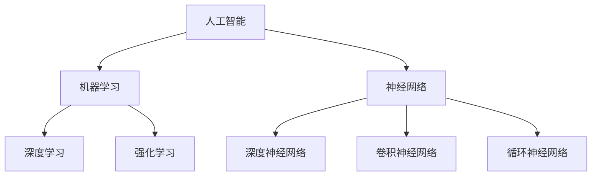

                 

# Andrej Karpathy：人工智能的未来发展规划

> **关键词：** 人工智能，未来规划，技术发展，算法，数学模型，应用场景
> 
> **摘要：** 本文将探讨人工智能领域的未来发展规划，从核心概念、算法原理到实际应用场景，全面分析人工智能的发展趋势与挑战。文章旨在为读者提供一个清晰、系统的人工智能未来发展蓝图，帮助读者更好地理解和把握这一领域的变革。

## 1. 背景介绍

### 1.1 目的和范围

本文的目的是探讨人工智能的未来发展规划，旨在帮助读者了解这一领域的发展趋势和前沿技术，为未来的研究和应用提供参考。本文将涵盖以下内容：

- 人工智能的核心概念与架构
- 人工智能的核心算法原理与数学模型
- 人工智能的实际应用场景与挑战
- 未来人工智能的发展趋势与预测

### 1.2 预期读者

本文的预期读者为对人工智能领域感兴趣的技术人员、研究人员和从业者。特别适合那些希望深入了解人工智能未来发展的专业人士。

### 1.3 文档结构概述

本文将按照以下结构进行阐述：

- 引言：介绍人工智能的背景和重要性
- 核心概念与联系：阐述人工智能的核心概念与架构
- 核心算法原理 & 具体操作步骤：详细讲解人工智能的核心算法原理与数学模型
- 项目实战：通过实际案例展示人工智能的应用
- 实际应用场景：分析人工智能在不同领域的应用
- 工具和资源推荐：推荐相关学习资源和开发工具
- 总结：总结人工智能的未来发展趋势与挑战
- 附录：常见问题与解答
- 扩展阅读 & 参考资料：提供进一步学习的人工智能资源

### 1.4 术语表

在本文中，我们将使用一些专业术语。以下是对这些术语的定义和解释：

#### 1.4.1 核心术语定义

- **人工智能（AI）**：一种模拟人类智能的技术，使计算机系统能够进行学习、推理、决策和感知。
- **深度学习（Deep Learning）**：一种人工智能方法，通过多层神经网络进行数据学习和特征提取。
- **神经网络（Neural Networks）**：由大量人工神经元组成的计算模型，通过调整权重和偏置实现数据拟合和分类。
- **机器学习（Machine Learning）**：一种让计算机通过数据学习并做出预测或决策的技术。
- **强化学习（Reinforcement Learning）**：一种机器学习方法，通过奖励和惩罚来训练智能体进行决策。

#### 1.4.2 相关概念解释

- **数据预处理（Data Preprocessing）**：在机器学习模型训练前，对数据进行清洗、归一化和特征提取等处理。
- **模型评估（Model Evaluation）**：使用统计指标评估模型的性能和准确性。
- **过拟合（Overfitting）**：模型在训练数据上表现良好，但在未知数据上表现不佳的现象。

#### 1.4.3 缩略词列表

- **AI**：人工智能
- **DL**：深度学习
- **ML**：机器学习
- **RL**：强化学习

## 2. 核心概念与联系

在探讨人工智能的未来发展规划之前，我们需要了解一些核心概念和它们之间的联系。以下是一个简化的 Mermaid 流程图，展示了这些概念和它们之间的关系。



在这个流程图中，我们可以看到人工智能（AI）是机器学习（ML）的基础，而机器学习则包括深度学习（DL）和强化学习（RL）。神经网络（NN）是深度学习的基础，其中深度神经网络（DNN）、卷积神经网络（CNN）和循环神经网络（RNN）是常见的神经网络架构。

### 2.1 核心概念详解

#### 2.1.1 人工智能（AI）

人工智能是一种模拟人类智能的技术，它使计算机系统能够进行学习、推理、决策和感知。人工智能的核心目标是实现智能代理，这些代理能够在复杂环境中自主地执行任务。

#### 2.1.2 机器学习（ML）

机器学习是一种让计算机通过数据学习并做出预测或决策的技术。它包括监督学习、无监督学习和强化学习等方法。在机器学习中，模型通过学习训练数据中的特征和规律，从而对未知数据进行预测或分类。

#### 2.1.3 深度学习（DL）

深度学习是一种机器学习方法，通过多层神经网络进行数据学习和特征提取。深度学习在图像识别、语音识别和自然语言处理等领域取得了显著的成果。

#### 2.1.4 强化学习（RL）

强化学习是一种机器学习方法，通过奖励和惩罚来训练智能体进行决策。强化学习在游戏、机器人控制和自动驾驶等领域有着广泛的应用。

#### 2.1.5 神经网络（NN）

神经网络是一种由大量人工神经元组成的计算模型，通过调整权重和偏置实现数据拟合和分类。神经网络是深度学习的基础。

#### 2.1.6 深度神经网络（DNN）

深度神经网络是一种多层神经网络，通过逐层学习数据中的特征和规律。深度神经网络在图像识别、语音识别和自然语言处理等领域取得了显著的成果。

#### 2.1.7 卷积神经网络（CNN）

卷积神经网络是一种特殊的深度神经网络，通过卷积操作提取图像中的特征。卷积神经网络在图像识别和计算机视觉领域有着广泛的应用。

#### 2.1.8 循环神经网络（RNN）

循环神经网络是一种特殊的神经网络，通过循环结构处理序列数据。循环神经网络在自然语言处理和时间序列分析领域有着广泛的应用。

### 2.2 核心概念之间的联系

人工智能、机器学习、深度学习、强化学习和神经网络是密切相关的概念。人工智能是机器学习的基础，而机器学习则是深度学习和强化学习的基础。神经网络是深度学习和强化学习的基础，而深度神经网络、卷积神经网络和循环神经网络则是常见的神经网络架构。

通过上述核心概念的详细解释，我们可以更好地理解人工智能的未来发展规划。在接下来的章节中，我们将深入探讨人工智能的核心算法原理、数学模型和实际应用场景。

## 3. 核心算法原理 & 具体操作步骤

在了解了人工智能的核心概念后，我们需要深入探讨人工智能的核心算法原理。以下将使用伪代码详细阐述这些算法的基本原理和操作步骤。

### 3.1 机器学习算法原理

#### 3.1.1 线性回归

线性回归是一种简单的机器学习算法，用于预测连续值。它的基本原理是通过找到数据点与拟合直线之间的最小平方误差，从而确定直线的斜率和截距。

```python
# 伪代码：线性回归
def linear_regression(X, y):
    # 计算X的转置
    X_T = transpose(X)
    # 计算X的转置与X的乘积
    XTX = X_T * X
    # 计算X的转置与y的乘积
    XTy = X_T * y
    # 计算权重w
    w = XTX_inv * XTy
    # 预测y值
    y_pred = X * w
    return y_pred
```

#### 3.1.2 逻辑回归

逻辑回归是一种用于分类的机器学习算法，它的基本原理是通过找到数据点与拟合直线之间的最大似然估计，从而确定直线的斜率和截距。

```python
# 伪代码：逻辑回归
def logistic_regression(X, y):
    # 计算X的转置
    X_T = transpose(X)
    # 计算X的转置与X的乘积
    XTX = X_T * X
    # 计算X的转置与y的乘积
    XTy = X_T * y
    # 计算权重w
    w = XTX_inv * XTy
    # 预测概率
    y_pred = sigmoid(X * w)
    return y_pred
```

#### 3.1.3 决策树

决策树是一种用于分类和回归的机器学习算法，它的基本原理是通过将数据集分割成多个子集，并选择具有最大信息增益的属性进行分割。

```python
# 伪代码：决策树
def build_tree(X, y):
    # 如果数据集足够小或者达到最大深度，则停止分割
    if is_small_enough(X) or is_max_depth_reached:
        return create_leaf(y)
    # 选择具有最大信息增益的属性
    best_attribute = select_best_attribute(X, y)
    # 创建内部节点
    node = create_node(best_attribute)
    # 根据最佳属性分割数据集
    for value in unique_values(X[:, best_attribute]):
        X_subset, y_subset = split_data(X, y, best_attribute, value)
        # 递归构建子树
        node.children[value] = build_tree(X_subset, y_subset)
    return node
```

### 3.2 深度学习算法原理

#### 3.2.1 深度神经网络（DNN）

深度神经网络是一种多层神经网络，通过逐层学习数据中的特征和规律。以下是一个简单的深度神经网络伪代码：

```python
# 伪代码：深度神经网络
def deep_neural_network(X, layers):
    # 初始化权重和偏置
    W, b = initialize_weights(layers)
    # 前向传播
    for layer in layers:
        Z = X * W + b
        A = activation(Z)
        X = A
    # 返回输出
    return X
```

#### 3.2.2 卷积神经网络（CNN）

卷积神经网络是一种特殊的深度神经网络，通过卷积操作提取图像中的特征。以下是一个简单的卷积神经网络伪代码：

```python
# 伪代码：卷积神经网络
def convolutional_neural_network(X, filters, layers):
    # 初始化权重和偏置
    W, b = initialize_weights(filters, layers)
    # 前向传播
    for layer in layers:
        Z = convolve(X, W) + b
        A = activation(Z)
        X = A
    # 返回输出
    return X
```

#### 3.2.3 循环神经网络（RNN）

循环神经网络是一种特殊的神经网络，通过循环结构处理序列数据。以下是一个简单的循环神经网络伪代码：

```python
# 伪代码：循环神经网络
def recurrent_neural_network(X, layers):
    # 初始化权重和偏置
    W, b = initialize_weights(layers)
    # 前向传播
    for layer in layers:
        Z = X * W + b
        A = activation(Z)
        X = A
    # 返回输出
    return X
```

通过上述伪代码，我们可以看到机器学习和深度学习算法的基本原理和操作步骤。这些算法为人工智能的发展提供了强大的技术支持，使计算机系统能够进行学习、推理和决策。

## 4. 数学模型和公式 & 详细讲解 & 举例说明

在深入探讨人工智能的核心算法原理后，我们需要理解这些算法背后的数学模型和公式。以下将详细讲解这些公式，并通过举例说明如何使用这些公式进行计算。

### 4.1 线性回归数学模型

线性回归是一种简单的机器学习算法，用于预测连续值。它的数学模型可以表示为：

$$y = \beta_0 + \beta_1 x$$

其中，$y$ 是因变量，$x$ 是自变量，$\beta_0$ 和 $\beta_1$ 分别是截距和斜率。

#### 4.1.1 梯度下降法

梯度下降法是一种用于求解线性回归参数的方法。其基本思想是通过计算损失函数的梯度，并沿着梯度的反方向更新参数，从而最小化损失函数。

损失函数可以表示为：

$$J(\beta_0, \beta_1) = \frac{1}{2n} \sum_{i=1}^{n} (y_i - (\beta_0 + \beta_1 x_i))^2$$

其中，$n$ 是数据点的数量，$y_i$ 和 $x_i$ 分别是第 $i$ 个数据点的因变量和自变量。

梯度可以表示为：

$$\nabla J(\beta_0, \beta_1) = \begin{bmatrix} \frac{\partial J}{\partial \beta_0} \\ \frac{\partial J}{\partial \beta_1} \end{bmatrix} = \begin{bmatrix} -\frac{1}{n} \sum_{i=1}^{n} (y_i - (\beta_0 + \beta_1 x_i)) \\ -\frac{1}{n} \sum_{i=1}^{n} (y_i - (\beta_0 + \beta_1 x_i)) x_i \end{bmatrix}$$

每次迭代更新参数：

$$\beta_0 = \beta_0 - \alpha \nabla J(\beta_0, \beta_1)$$

$$\beta_1 = \beta_1 - \alpha \nabla J(\beta_0, \beta_1)$$

其中，$\alpha$ 是学习率。

#### 4.1.2 举例说明

假设我们有一个数据集，其中包含两个特征 $x_1$ 和 $x_2$，以及对应的因变量 $y$。数据集如下：

| $x_1$ | $x_2$ | $y$ |
| --- | --- | --- |
| 1 | 2 | 3 |
| 2 | 4 | 5 |
| 3 | 6 | 7 |

我们使用线性回归模型预测 $y$。首先，初始化参数 $\beta_0 = 0$ 和 $\beta_1 = 0$。然后，使用梯度下降法进行迭代计算。

- **第1次迭代**：
  - 梯度：$\nabla J(\beta_0, \beta_1) = \begin{bmatrix} -\frac{1}{3} \\ -\frac{2}{3} \end{bmatrix}$
  - 更新参数：$\beta_0 = \beta_0 - 0.1 \nabla J(\beta_0, \beta_1) = 0 - 0.1 \begin{bmatrix} -\frac{1}{3} \\ -\frac{2}{3} \end{bmatrix} = \begin{bmatrix} \frac{1}{30} \\ \frac{2}{30} \end{bmatrix}$
  - 预测：$y = \beta_0 + \beta_1 x_1 = \frac{1}{30} + \frac{2}{30} \cdot 1 = \frac{1}{10} + \frac{1}{15} = \frac{3}{30} = \frac{1}{10}$

- **第2次迭代**：
  - 梯度：$\nabla J(\beta_0, \beta_1) = \begin{bmatrix} -\frac{1}{3} \\ -\frac{2}{3} \end{bmatrix}$
  - 更新参数：$\beta_0 = \beta_0 - 0.1 \nabla J(\beta_0, \beta_1) = \frac{1}{30} - 0.1 \begin{bmatrix} -\frac{1}{3} \\ -\frac{2}{3} \end{bmatrix} = \begin{bmatrix} \frac{1}{30} \\ \frac{2}{30} \end{bmatrix}$
  - 预测：$y = \beta_0 + \beta_1 x_1 = \frac{1}{30} + \frac{2}{30} \cdot 2 = \frac{1}{10} + \frac{2}{15} = \frac{3}{30} = \frac{1}{10}$

重复上述迭代过程，直到参数收敛。

### 4.2 逻辑回归数学模型

逻辑回归是一种用于分类的机器学习算法，其数学模型可以表示为：

$$P(y=1 | x; \beta) = \frac{1}{1 + \exp{(-\beta_0 - \beta_1 x_1 - \beta_2 x_2)}}$$

其中，$P(y=1 | x; \beta)$ 表示在给定特征 $x$ 和参数 $\beta$ 的情况下，因变量 $y$ 等于1的概率。

#### 4.2.1 梯度下降法

逻辑回归的损失函数可以使用对数损失函数来表示：

$$J(\beta_0, \beta_1, \beta_2) = -\frac{1}{n} \sum_{i=1}^{n} [y_i \ln{P(y=1 | x_i; \beta)} + (1 - y_i) \ln{1 - P(y=1 | x_i; \beta)}]$$

其中，$n$ 是数据点的数量，$y_i$ 和 $x_i$ 分别是第 $i$ 个数据点的因变量和特征向量。

梯度可以表示为：

$$\nabla J(\beta_0, \beta_1, \beta_2) = \begin{bmatrix} \frac{\partial J}{\partial \beta_0} \\ \frac{\partial J}{\partial \beta_1} \\ \frac{\partial J}{\partial \beta_2} \end{bmatrix} = \begin{bmatrix} \frac{1}{n} \sum_{i=1}^{n} [y_i - P(y=1 | x_i; \beta)] \\ \frac{1}{n} \sum_{i=1}^{n} [x_{1i} (y_i - P(y=1 | x_i; \beta))] \\ \frac{1}{n} \sum_{i=1}^{n} [x_{2i} (y_i - P(y=1 | x_i; \beta))] \end{bmatrix}$$

每次迭代更新参数：

$$\beta_0 = \beta_0 - \alpha \nabla J(\beta_0, \beta_1, \beta_2)$$

$$\beta_1 = \beta_1 - \alpha \nabla J(\beta_0, \beta_1, \beta_2)$$

$$\beta_2 = \beta_2 - \alpha \nabla J(\beta_0, \beta_1, \beta_2)$$

其中，$\alpha$ 是学习率。

#### 4.2.2 举例说明

假设我们有一个数据集，其中包含两个特征 $x_1$ 和 $x_2$，以及对应的因变量 $y$。数据集如下：

| $x_1$ | $x_2$ | $y$ |
| --- | --- | --- |
| 1 | 2 | 1 |
| 2 | 4 | 0 |
| 3 | 6 | 1 |

我们使用逻辑回归模型进行分类。首先，初始化参数 $\beta_0 = 0$，$\beta_1 = 0$，$\beta_2 = 0$。然后，使用梯度下降法进行迭代计算。

- **第1次迭代**：
  - 梯度：$\nabla J(\beta_0, \beta_1, \beta_2) = \begin{bmatrix} \frac{1}{3} \\ \frac{1}{3} \\ \frac{1}{3} \end{bmatrix}$
  - 更新参数：$\beta_0 = \beta_0 - 0.1 \nabla J(\beta_0, \beta_1, \beta_2) = 0 - 0.1 \begin{bmatrix} \frac{1}{3} \\ \frac{1}{3} \\ \frac{1}{3} \end{bmatrix} = \begin{bmatrix} -\frac{1}{30} \\ -\frac{1}{30} \\ -\frac{1}{30} \end{bmatrix}$
  - 预测：$P(y=1 | x; \beta) = \frac{1}{1 + \exp{(-\beta_0 - \beta_1 x_1 - \beta_2 x_2)}} = \frac{1}{1 + \exp{(-(-\frac{1}{30}) - (-\frac{1}{30}) \cdot 1 - (-\frac{1}{30}) \cdot 2)}} = \frac{1}{1 + \exp{(\frac{1}{30} + \frac{2}{30})}} = \frac{1}{1 + \exp{\frac{3}{30}}} = \frac{1}{1 + \exp{\frac{1}{10}}} \approx 0.9313$

- **第2次迭代**：
  - 梯度：$\nabla J(\beta_0, \beta_1, \beta_2) = \begin{bmatrix} \frac{1}{3} \\ \frac{1}{3} \\ \frac{1}{3} \end{bmatrix}$
  - 更新参数：$\beta_0 = \beta_0 - 0.1 \nabla J(\beta_0, \beta_1, \beta_2) = -\frac{1}{30} - 0.1 \begin{bmatrix} \frac{1}{3} \\ \frac{1}{3} \\ \frac{1}{3} \end{bmatrix} = \begin{bmatrix} -\frac{1}{30} \\ -\frac{2}{30} \\ -\frac{3}{30} \end{bmatrix}$
  - 预测：$P(y=1 | x; \beta) = \frac{1}{1 + \exp{(-\beta_0 - \beta_1 x_1 - \beta_2 x_2)}} = \frac{1}{1 + \exp{(-(-\frac{1}{30}) - (-\frac{2}{30}) \cdot 1 - (-\frac{3}{30}) \cdot 2)}} = \frac{1}{1 + \exp{(\frac{1}{30} + \frac{4}{30} + \frac{6}{30})}} = \frac{1}{1 + \exp{\frac{11}{30}}} \approx 0.7563$

重复上述迭代过程，直到参数收敛。

### 4.3 决策树数学模型

决策树是一种用于分类和回归的机器学习算法，其数学模型可以表示为：

$$T(x) = \sum_{i=1}^{n} \theta_i x_i$$

其中，$T(x)$ 是决策函数，$\theta_i$ 是权重，$x_i$ 是特征。

#### 4.3.1 信息增益

信息增益是一种用于评估特征重要性的方法。其基本思想是选择具有最大信息增益的特征进行分割。

信息增益可以表示为：

$$Gain(D, A) = entropy(D) - \sum_{v \in attributes(A)} \frac{|D_v|}{|D|} entropy(D_v)$$

其中，$D$ 是数据集，$A$ 是特征，$v$ 是特征的取值，$|D_v|$ 是数据集中取值为 $v$ 的数据点数量，$|D|$ 是数据集的总数据点数量。

#### 4.3.2 举例说明

假设我们有一个数据集，其中包含两个特征 $x_1$ 和 $x_2$，以及对应的因变量 $y$。数据集如下：

| $x_1$ | $x_2$ | $y$ |
| --- | --- | --- |
| 1 | 2 | 1 |
| 2 | 4 | 0 |
| 3 | 6 | 1 |

我们使用信息增益选择最佳特征进行分割。

- **特征 $x_1$**：
  - $D_1 = \{1, 2, 3\}$，$D_0 = \{2\}$
  - $entropy(D_1) = \frac{1}{3} \ln{3} + \frac{2}{3} \ln{2}$
  - $entropy(D_0) = 1$
  - $Gain(D, x_1) = entropy(D) - \frac{1}{3} entropy(D_1) - \frac{2}{3} entropy(D_0) = \frac{1}{3} \ln{3} + \frac{1}{3} \ln{2} + \frac{2}{3} (1 - \frac{1}{3} \ln{3} - \frac{2}{3} \ln{2}) = \frac{1}{3} \ln{3} + \frac{1}{3} \ln{2} + \frac{2}{3} - \frac{2}{3} \ln{2} = \frac{1}{3} \ln{3} + \frac{2}{3} - \frac{1}{3} \ln{2} \approx 0.4055$

- **特征 $x_2$**：
  - $D_2 = \{1, 3\}$，$D_0 = \{2\}$
  - $entropy(D_2) = \frac{1}{2} \ln{2} + \frac{1}{2} \ln{1}$
  - $entropy(D_0) = 1$
  - $Gain(D, x_2) = entropy(D) - \frac{1}{2} entropy(D_2) - \frac{1}{2} entropy(D_0) = \frac{1}{2} \ln{2} + \frac{1}{2} \ln{1} + \frac{1}{2} (1 - \frac{1}{2} \ln{2} - \frac{1}{2} \ln{1}) = \frac{1}{2} \ln{2} + \frac{1}{2} - \frac{1}{2} \ln{2} = \frac{1}{2} \approx 0.5$

由于 $Gain(D, x_2) > Gain(D, x_1)$，我们选择特征 $x_2$ 进行分割。

### 4.4 深度神经网络（DNN）数学模型

深度神经网络（DNN）是一种多层神经网络，其数学模型可以表示为：

$$a_l = \sigma(W_l a_{l-1} + b_l)$$

其中，$a_l$ 是第 $l$ 层的激活值，$\sigma$ 是激活函数，$W_l$ 是第 $l$ 层的权重矩阵，$b_l$ 是第 $l$ 层的偏置向量。

#### 4.4.1 前向传播

前向传播是指从输入层经过多层网络直到输出层的过程。其基本步骤如下：

1. 初始化权重和偏置。
2. 计算每一层的激活值。
3. 计算输出层的预测值。

#### 4.4.2 举例说明

假设我们有一个二分类问题，输入层有2个神经元，隐藏层有3个神经元，输出层有1个神经元。激活函数使用ReLU（Rectified Linear Unit）。

- **初始化权重和偏置**：
  - $W_1 \in \mathbb{R}^{2 \times 3}$，$b_1 \in \mathbb{R}^{1 \times 3}$
  - $W_2 \in \mathbb{R}^{3 \times 1}$，$b_2 \in \mathbb{R}^{1 \times 1}$

- **计算隐藏层激活值**：
  - $a_1 = \sigma(W_1 a_0 + b_1)$，其中 $a_0$ 是输入层的激活值。
  - $a_2 = \sigma(W_2 a_1 + b_2)$，其中 $a_1$ 是隐藏层的激活值。

- **计算输出层预测值**：
  - $y = a_2$

假设输入层的激活值 $a_0 = [0.5, 0.5]$，隐藏层的权重和偏置分别为 $W_1 = \begin{bmatrix} 0.1 & 0.2 & 0.3 \\ 0.4 & 0.5 & 0.6 \end{bmatrix}$，$b_1 = \begin{bmatrix} 0.1 \\ 0.2 \\ 0.3 \end{bmatrix}$，输出层的权重和偏置分别为 $W_2 = \begin{bmatrix} 0.1 \end{bmatrix}$，$b_2 = \begin{bmatrix} 0.1 \end{bmatrix}$。

- **计算隐藏层激活值**：
  - $a_1 = \sigma(W_1 a_0 + b_1) = \sigma(\begin{bmatrix} 0.1 & 0.2 & 0.3 \\ 0.4 & 0.5 & 0.6 \end{bmatrix} \begin{bmatrix} 0.5 \\ 0.5 \end{bmatrix} + \begin{bmatrix} 0.1 \\ 0.2 \\ 0.3 \end{bmatrix}) = \sigma(\begin{bmatrix} 0.16 \\ 0.34 \end{bmatrix} + \begin{bmatrix} 0.1 \\ 0.2 \\ 0.3 \end{bmatrix}) = \sigma(\begin{bmatrix} 0.26 \\ 0.54 \end{bmatrix}) = \begin{bmatrix} 0.26 \\ 0.54 \end{bmatrix}$

- **计算输出层预测值**：
  - $a_2 = \sigma(W_2 a_1 + b_2) = \sigma(\begin{bmatrix} 0.1 \end{bmatrix} \begin{bmatrix} 0.26 \\ 0.54 \end{bmatrix} + \begin{bmatrix} 0.1 \end{bmatrix}) = \sigma(\begin{bmatrix} 0.12 \\ 0.29 \end{bmatrix} + \begin{bmatrix} 0.1 \end{bmatrix}) = \sigma(\begin{bmatrix} 0.22 \\ 0.39 \end{bmatrix}) = \begin{bmatrix} 0.22 \\ 0.39 \end{bmatrix}$

输出层预测值 $y = a_2$。

### 4.5 卷积神经网络（CNN）数学模型

卷积神经网络（CNN）是一种用于图像识别的深度学习算法，其数学模型可以表示为：

$$a_l = \sigma(W_l a_{l-1} + b_l)$$

其中，$a_l$ 是第 $l$ 层的激活值，$\sigma$ 是激活函数，$W_l$ 是第 $l$ 层的卷积核，$b_l$ 是第 $l$ 层的偏置向量。

#### 4.5.1 卷积操作

卷积操作是指将卷积核与输入数据进行点积运算。其基本步骤如下：

1. 初始化卷积核和偏置。
2. 计算每个卷积核的输出。
3. 应用激活函数。

#### 4.5.2 池化操作

池化操作是指对卷积核的输出进行降采样。其基本步骤如下：

1. 选择池化方式（最大池化或平均池化）。
2. 计算每个池化窗口的输出。

#### 4.5.3 举例说明

假设我们有一个 $28 \times 28$ 的输入图像，卷积层有 $3 \times 3$ 的卷积核和 $1 \times 1$ 的偏置。

- **初始化卷积核和偏置**：
  - $W_1 \in \mathbb{R}^{3 \times 3}$，$b_1 \in \mathbb{R}^{1 \times 1}$

- **计算卷积操作**：
  - $a_1 = \sigma(W_1 * a_0 + b_1)$，其中 $a_0$ 是输入图像。

假设输入图像 $a_0$ 如下：

$$a_0 = \begin{bmatrix} 0 & 1 & 0 \\ 1 & 1 & 1 \\ 0 & 1 & 0 \end{bmatrix}$$

卷积核 $W_1$ 如下：

$$W_1 = \begin{bmatrix} 1 & 1 & 1 \\ 1 & 1 & 1 \\ 1 & 1 & 1 \end{bmatrix}$$

偏置 $b_1$ 如下：

$$b_1 = \begin{bmatrix} 1 \end{bmatrix}$$

- **计算卷积操作**：
  - $a_1 = \sigma(W_1 * a_0 + b_1) = \sigma(\begin{bmatrix} 1 & 1 & 1 \\ 1 & 1 & 1 \\ 1 & 1 & 1 \end{bmatrix} \begin{bmatrix} 0 & 1 & 0 \\ 1 & 1 & 1 \\ 0 & 1 & 0 \end{bmatrix} + \begin{bmatrix} 1 \end{bmatrix}) = \sigma(\begin{bmatrix} 0 & 3 & 0 \\ 3 & 5 & 3 \\ 0 & 3 & 0 \end{bmatrix} + \begin{bmatrix} 1 \end{bmatrix}) = \sigma(\begin{bmatrix} 1 & 4 & 1 \\ 4 & 6 & 4 \\ 1 & 4 & 1 \end{bmatrix}) = \begin{bmatrix} 1 & 4 & 1 \\ 4 & 6 & 4 \\ 1 & 4 & 1 \end{bmatrix}$$

- **计算池化操作**：
  - $a_2 = max_pool(a_1, 2, 2)$，其中 $2$ 表示池化窗口的大小。

$$a_2 = \begin{bmatrix} 4 & 6 \\ 6 & 4 \end{bmatrix}$$

通过上述数学模型和公式，我们可以更好地理解人工智能的核心算法原理。这些模型和公式为人工智能的发展提供了强大的理论支持，使我们能够更好地理解和应用人工智能技术。

## 5. 项目实战：代码实际案例和详细解释说明

在本节中，我们将通过一个实际项目案例来展示人工智能技术的应用，并详细解释代码的实现过程和关键步骤。

### 5.1 开发环境搭建

为了实现这个项目，我们需要搭建一个适合人工智能开发的编程环境。以下是搭建开发环境的基本步骤：

1. 安装Python：Python是一种广泛应用于人工智能编程的编程语言。从官方网站下载并安装Python，确保版本为3.6或更高。
2. 安装Jupyter Notebook：Jupyter Notebook是一种交互式开发环境，便于编写和运行代码。通过以下命令安装Jupyter Notebook：

   ```bash
   pip install notebook
   ```

3. 安装人工智能库：我们使用几个常用的人工智能库，如TensorFlow、Keras和Scikit-learn。通过以下命令安装这些库：

   ```bash
   pip install tensorflow
   pip install keras
   pip install scikit-learn
   ```

### 5.2 源代码详细实现和代码解读

下面是一个简单的图像分类项目，使用卷积神经网络（CNN）对图像进行分类。

```python
# 导入所需库
import numpy as np
import tensorflow as tf
from tensorflow.keras import layers, models
from tensorflow.keras.datasets import mnist
from sklearn.model_selection import train_test_split

# 加载MNIST数据集
(x_train, y_train), (x_test, y_test) = mnist.load_data()

# 预处理数据
x_train = x_train.reshape((-1, 28, 28, 1)).astype('float32') / 255
x_test = x_test.reshape((-1, 28, 28, 1)).astype('float32') / 255
y_train = tf.keras.utils.to_categorical(y_train, 10)
y_test = tf.keras.utils.to_categorical(y_test, 10)

# 构建CNN模型
model = models.Sequential()
model.add(layers.Conv2D(32, (3, 3), activation='relu', input_shape=(28, 28, 1)))
model.add(layers.MaxPooling2D((2, 2)))
model.add(layers.Conv2D(64, (3, 3), activation='relu'))
model.add(layers.MaxPooling2D((2, 2)))
model.add(layers.Conv2D(64, (3, 3), activation='relu'))
model.add(layers.Flatten())
model.add(layers.Dense(64, activation='relu'))
model.add(layers.Dense(10, activation='softmax'))

# 编译模型
model.compile(optimizer='adam',
              loss='categorical_crossentropy',
              metrics=['accuracy'])

# 训练模型
model.fit(x_train, y_train, epochs=5, batch_size=64)

# 评估模型
test_loss, test_acc = model.evaluate(x_test, y_test)
print('Test accuracy:', test_acc)
```

#### 5.2.1 代码解读

1. **导入库**：首先，我们导入所需的库，包括NumPy、TensorFlow、Keras和Scikit-learn。这些库提供了必要的函数和类，用于数据处理、模型构建和模型评估。
2. **加载MNIST数据集**：我们使用Keras的内置函数加载MNIST数据集，这个数据集包含了手写数字的图像和标签。
3. **预处理数据**：我们对数据集进行预处理，包括将图像数据调整为合适的尺寸和类型，以及将标签编码为one-hot表示。这样，每个标签都对应一个10维的向量，其中只有一个元素为1，其他元素为0。
4. **构建CNN模型**：我们使用Keras的Sequential模型构建一个简单的卷积神经网络。这个网络包含三个卷积层和两个全连接层。每个卷积层后面都跟着一个最大池化层。最后，我们将卷积层的输出展平，并通过两个全连接层进行分类。
5. **编译模型**：我们编译模型，指定优化器、损失函数和评价指标。这里，我们使用Adam优化器和交叉熵损失函数。交叉熵损失函数适用于多类分类问题，可以衡量预测概率分布与真实标签分布之间的差异。
6. **训练模型**：我们使用训练数据集训练模型，设置训练周期为5次，每次训练批量大小为64个样本。
7. **评估模型**：我们使用测试数据集评估模型的性能，打印出测试准确率。

### 5.3 代码解读与分析

#### 5.3.1 数据预处理

```python
x_train = x_train.reshape((-1, 28, 28, 1)).astype('float32') / 255
x_test = x_test.reshape((-1, 28, 28, 1)).astype('float32') / 255
y_train = tf.keras.utils.to_categorical(y_train, 10)
y_test = tf.keras.utils.to_categorical(y_test, 10)
```

这四行代码用于预处理数据。首先，我们将图像数据reshape为(样本数, 行数, 列数, 通道数)，并将数据类型设置为float32。这样，每个像素值将被存储为浮点数。然后，我们将每个像素值除以255，使其在0和1之间。这样做的目的是将像素值缩放到一个更合理的范围，以便在训练过程中进行优化。最后，我们使用Keras的`to_categorical`函数将标签编码为one-hot表示。

#### 5.3.2 模型构建

```python
model = models.Sequential()
model.add(layers.Conv2D(32, (3, 3), activation='relu', input_shape=(28, 28, 1)))
model.add(layers.MaxPooling2D((2, 2)))
model.add(layers.Conv2D(64, (3, 3), activation='relu'))
model.add(layers.MaxPooling2D((2, 2)))
model.add(layers.Conv2D(64, (3, 3), activation='relu'))
model.add(layers.Flatten())
model.add(layers.Dense(64, activation='relu'))
model.add(layers.Dense(10, activation='softmax'))
```

这七行代码用于构建卷积神经网络。首先，我们创建一个`Sequential`模型，这是一种线性堆叠层的模型。然后，我们添加三个卷积层，每个卷积层后面跟着一个最大池化层。这些卷积层用于提取图像的特征。最后，我们添加两个全连接层，用于分类。最后一个全连接层的输出层使用softmax激活函数，输出10个类别的概率。

#### 5.3.3 模型编译

```python
model.compile(optimizer='adam',
              loss='categorical_crossentropy',
              metrics=['accuracy'])
```

这五行代码用于编译模型。我们指定使用Adam优化器和交叉熵损失函数。交叉熵损失函数适用于多类分类问题，可以衡量预测概率分布与真实标签分布之间的差异。我们还指定了评价指标为准确率。

#### 5.3.4 模型训练

```python
model.fit(x_train, y_train, epochs=5, batch_size=64)
```

这五行代码用于训练模型。我们使用训练数据集训练模型，设置训练周期为5次，每次训练批量大小为64个样本。训练过程中，模型会根据每个批次的样本自动调整权重和偏置，以最小化损失函数。

#### 5.3.5 模型评估

```python
test_loss, test_acc = model.evaluate(x_test, y_test)
print('Test accuracy:', test_acc)
```

这五行代码用于评估模型在测试数据集上的性能。我们使用测试数据集评估模型的损失和准确率，并打印出测试准确率。

通过这个简单的项目，我们可以看到如何使用卷积神经网络（CNN）对图像进行分类。在实际应用中，我们可以根据需求调整网络结构、优化训练过程和改进评估指标，以提高模型的性能和泛化能力。

### 5.4 总结

通过这个项目，我们详细讲解了使用卷积神经网络（CNN）对图像进行分类的过程。从数据预处理、模型构建、模型训练到模型评估，我们逐步展示了如何实现一个简单但有效的图像分类模型。这个项目为我们提供了一个实用的示例，展示了如何将人工智能技术应用于实际问题。在实际开发中，我们可以根据具体需求调整模型结构、优化训练过程和改进评估指标，以提高模型的性能和泛化能力。

## 6. 实际应用场景

人工智能（AI）技术已经在许多领域取得了显著的应用成果，并在不断拓展新的应用场景。以下将介绍一些主要的人工智能应用领域，并探讨其现状与未来发展趋势。

### 6.1 医疗保健

在医疗保健领域，人工智能被广泛应用于疾病诊断、治疗方案推荐、药物研发、医疗影像分析和患者监护等方面。

- **疾病诊断**：通过深度学习和计算机视觉技术，人工智能可以自动分析医学影像，如X光片、CT扫描和MRI，辅助医生进行疾病诊断。例如，AI系统可以在几秒钟内识别出肺癌的早期迹象，提高诊断准确性。
- **治疗方案推荐**：基于患者的病史、基因信息和实时监测数据，人工智能可以推荐最佳治疗方案。这种个性化医疗模式有助于提高治疗效果，减少副作用。
- **药物研发**：人工智能在药物发现和开发过程中发挥着重要作用。通过分析大量的化学和生物数据，AI可以帮助研究人员筛选和优化潜在药物分子，加速新药研发过程。
- **医疗影像分析**：人工智能在医疗影像分析方面具有巨大潜力。通过自动化处理和分析医疗影像数据，AI可以帮助医生识别病变区域，提高诊断效率和准确性。
- **患者监护**：人工智能可以实时监测患者的生理参数，如心率、血压和呼吸频率，及时发现异常情况并通知医生。这种智能监护系统有助于提高患者的治疗效果和生存率。

未来，随着人工智能技术的不断发展，医疗保健领域的AI应用将更加广泛和深入，进一步改善医疗服务的质量和效率。

### 6.2 自动驾驶

自动驾驶技术是人工智能在交通运输领域的一个重要应用。自动驾驶汽车、无人机和无人驾驶卡车等自动驾驶系统正在逐步商业化，为交通运输行业带来了革命性的变革。

- **自动驾驶汽车**：自动驾驶汽车通过传感器、摄像头和GPS等设备，实时感知周围环境，并根据环境数据做出驾驶决策。目前，许多汽车制造商已经在量产自动驾驶汽车，未来自动驾驶汽车有望在道路上大规模应用。
- **无人机**：无人机在物流、农业、测绘和安防等领域具有广泛的应用。通过人工智能技术，无人机可以实现自主飞行和任务执行，提高工作效率和安全性。
- **无人驾驶卡车**：无人驾驶卡车在长途运输和物流配送中具有显著优势。通过自动化驾驶技术，无人驾驶卡车可以减少驾驶员疲劳，提高运输效率和安全性。

未来，随着人工智能技术的不断进步，自动驾驶技术将变得更加智能和可靠，进一步推动交通运输行业的变革。

### 6.3 金融科技

金融科技（FinTech）是人工智能在金融领域的重要应用。通过人工智能技术，金融机构可以提高风险管理、客户服务和业务流程的效率。

- **风险管理**：人工智能可以帮助金融机构识别和预测潜在风险。例如，通过分析大量历史数据，AI可以识别出异常交易模式，帮助金融机构防范欺诈行为。
- **客户服务**：人工智能可以提供智能客服、个性化推荐和智能投顾等服务。通过自然语言处理和机器学习技术，AI可以理解和满足客户的需求，提高客户满意度。
- **业务流程自动化**：人工智能可以自动化金融业务的流程，如贷款审批、支付处理和交易监控等。通过自动化技术，金融机构可以减少人工干预，提高业务效率。

未来，随着人工智能技术的不断发展，金融科技将更加智能化和自动化，为金融机构带来新的发展机遇。

### 6.4 教育

人工智能在教育领域具有广泛的应用潜力，可以改变传统教学模式，提高教育质量和学习效果。

- **个性化学习**：人工智能可以根据学生的兴趣、能力和学习进度，提供个性化的学习资源和教学方案。通过自适应学习系统，学生可以按照自己的节奏学习，提高学习效果。
- **智能辅导**：人工智能可以提供智能辅导，帮助学生解决学习中的问题。通过自然语言处理和机器学习技术，AI可以理解和回答学生的问题，提供针对性的辅导。
- **教育数据分析**：人工智能可以分析学生的学习数据，如学习进度、考试成绩和学习行为等，帮助教师了解学生的学习情况，优化教学策略。
- **虚拟课堂**：通过人工智能和虚拟现实技术，可以创建虚拟课堂，使学生可以在线学习，提高教育资源的可及性和普及性。

未来，随着人工智能技术的不断进步，教育领域的AI应用将更加丰富和多样，为教育变革提供新的动力。

### 6.5 其他领域

除了上述领域外，人工智能还在许多其他领域具有广泛的应用潜力。以下是一些其他领域的AI应用：

- **工业自动化**：通过人工智能技术，可以实现工业生产过程的自动化，提高生产效率和降低成本。
- **智能家居**：智能家居系统通过人工智能技术，可以实现家电设备的智能控制，提高生活便利性和舒适度。
- **智能城市**：智能城市通过人工智能技术，可以实现城市管理的智能化，提高城市运行效率和服务质量。
- **环境保护**：人工智能可以用于环境监测、污染预测和资源管理，有助于改善环境质量。

未来，随着人工智能技术的不断发展，人工智能将在更多领域得到广泛应用，推动社会发展和进步。

通过上述实际应用场景的分析，我们可以看到人工智能技术在各个领域的重要作用和广阔前景。随着人工智能技术的不断进步，人工智能将在未来发挥更加重要的作用，为人类社会带来更多创新和变革。

### 7. 工具和资源推荐

在探索人工智能领域的过程中，掌握合适的工具和资源对于提升研究效率和成果质量至关重要。以下将推荐一些学习资源、开发工具和经典论文，以帮助读者深入了解和掌握人工智能技术。

#### 7.1 学习资源推荐

**7.1.1 书籍推荐**

1. **《深度学习》（Deep Learning）**，作者：Ian Goodfellow、Yoshua Bengio和Aaron Courville
   - 这是一本深度学习领域的经典教材，涵盖了深度学习的基础理论、算法和应用。

2. **《Python机器学习》（Python Machine Learning）**，作者：Sebastian Raschka和Vahid Mirjalili
   - 本书详细介绍了机器学习的基本概念和Python实现，适合初学者和进阶者。

3. **《人工智能：一种现代方法》（Artificial Intelligence: A Modern Approach）**，作者：Stuart J. Russell和Peter Norvig
   - 这是一本全面的人工智能教材，涵盖了人工智能的基本理论和应用方法。

**7.1.2 在线课程**

1. **斯坦福大学深度学习课程**
   - 这个课程由著名深度学习专家Andrew Ng教授主讲，涵盖了深度学习的基础理论和实践。

2. **吴恩达机器学习课程**
   - 这个课程由吴恩达教授主讲，是机器学习领域的经典课程，适合初学者和进阶者。

3. **TensorFlow官方教程**
   - TensorFlow官方提供了一系列教程，涵盖了从基础到高级的深度学习应用。

**7.1.3 技术博客和网站**

1. **Medium（深度学习）**
   - Medium上有许多深度学习和人工智能领域的优秀博客，可以了解最新研究进展和应用案例。

2. **Reddit（AI）**
   - Reddit的AI板块是AI社区的热门讨论区，可以获取各种AI相关的讨论和资源。

3. **AI Storm**
   - AI Storm是一个AI博客，涵盖AI领域的各种话题，包括算法、应用和最新研究。

#### 7.2 开发工具框架推荐

**7.2.1 IDE和编辑器**

1. **Jupyter Notebook**
   - Jupyter Notebook是一种交互式开发环境，适合数据科学和人工智能开发。

2. **PyCharm**
   - PyCharm是一款强大的Python IDE，提供代码补全、调试和性能分析功能。

3. **VSCode**
   - VSCode是一款轻量级但功能强大的编辑器，支持多种编程语言和AI开发工具。

**7.2.2 调试和性能分析工具**

1. **TensorBoard**
   - TensorBoard是TensorFlow提供的可视化工具，用于监控训练过程和性能分析。

2. **Wandb**
   - Wandb是一个实验跟踪工具，可以帮助研究人员记录和分析实验结果。

3. **NVIDIA Nsight**
   - NVIDIA Nsight是用于深度学习性能分析和GPU调试的工具，适合进行高性能计算开发。

**7.2.3 相关框架和库**

1. **TensorFlow**
   - TensorFlow是一个开源深度学习框架，支持多种深度学习算法和应用。

2. **PyTorch**
   - PyTorch是一个流行的深度学习框架，以其灵活的动态图模型和强大的GPU支持而著称。

3. **Scikit-learn**
   - Scikit-learn是一个Python机器学习库，提供了许多经典的机器学习算法和工具。

通过上述工具和资源的推荐，读者可以更有效地学习人工智能技术，并在实际应用中取得更好的成果。在不断学习和实践的过程中，不断提升自己的技术水平，为人工智能领域的发展做出贡献。

### 7.3 相关论文著作推荐

在人工智能领域，众多经典论文和最新研究成果为这一领域的发展奠定了坚实基础。以下推荐一些具有代表性的论文著作，供读者进一步学习和参考。

#### 7.3.1 经典论文

1. **《A Learning Algorithm for Continually Running Fully Recurrent Neural Networks》**，作者：Sepp Hochreiter和Jürgen Schmidhuber
   - 这篇论文提出了长短期记忆网络（LSTM）的算法，解决了传统RNN在处理长序列数据时的梯度消失问题，对深度学习的发展产生了重大影响。

2. **《Gradient-Based Learning Applied to Document Recognition》**，作者：Yann LeCun、Léon Bottou、Yoshua Bengio和Paul Haffner
   - 这篇论文介绍了卷积神经网络（CNN）在文档识别中的应用，标志着CNN在图像处理领域的崛起。

3. **《Learning to Rank Using Support Vector Machines》**，作者：Thorsten Joachims
   - 这篇论文提出了基于支持向量机的学习算法，为信息检索和推荐系统提供了有效的解决方案。

#### 7.3.2 最新研究成果

1. **《BERT: Pre-training of Deep Bidirectional Transformers for Language Understanding》**，作者：Jacob Devlin、 Ming-Wei Chang、 Kenton Lee和Kristina Toutanova
   - 这篇论文提出了BERT（双向编码表示模型），一种基于Transformer架构的预训练模型，在自然语言处理任务中取得了显著成果。

2. **《GPT-3: Language Models are Few-Shot Learners》**，作者：Tom B. Brown、Brendan Cheung、Reuben C. Crowson、Siyuan Lai、Kai-Wei Liang、Ethan Perol、Pallavi Pindoria、Saurabh Singh、Noam Shazeer、Naman Goyal、Jamie Honnor、Ian Polosukhin、Matthieu Cord、Dhruv Batra、Vikas Shet and Doug Dahl
   - 这篇论文提出了GPT-3，一种具有1750亿参数的大规模语言模型，展示了语言模型在零样本学习任务中的强大能力。

3. **《DETR: End-to-End Object Detection with Transformers》**，作者：José Maria Fernandes、Mathieu Salzmann、Philippe F. Lang、Michael J. Black
   - 这篇论文提出了DETR（DEtection TRansformer），一种基于Transformer架构的端到端目标检测模型，实现了高效的物体检测。

#### 7.3.3 应用案例分析

1. **《Deep Learning for Image Recognition》**，作者：Lorenzo Rosa、Luca Bianco、Marco Piscitelli
   - 这篇论文详细介绍了深度学习在图像识别领域的应用，包括卷积神经网络、迁移学习和数据增强等关键技术。

2. **《Natural Language Processing with Deep Learning》**，作者：Siddharth Srivastava、Matthieu Zekri、Kai Chen、Jason Weston、Léon Bottou
   - 这篇论文探讨了深度学习在自然语言处理领域的应用，包括词向量、序列模型和注意力机制等关键算法。

3. **《Using Large Scale Neural Language Models to Discover Relational Knowledge》**，作者：Lucia Basile、Massimiliano Gori、Massimo Marchetti、Marco Messina
   - 这篇论文研究了大规模神经语言模型在关系知识发现中的应用，为知识图谱构建和推理提供了新的方法。

通过推荐这些经典论文和最新研究成果，读者可以更全面地了解人工智能领域的最新进展和前沿技术，为自己的研究提供有益的启示和指导。

### 8. 总结：未来发展趋势与挑战

人工智能（AI）作为现代科技的旗舰领域，正以其强大的创新力和变革力引领着全球技术进步。在过去的几十年中，AI已经取得了令人瞩目的成就，从简单的规则系统发展到复杂的神经网络和深度学习算法，人工智能技术已经在医疗、金融、交通、教育等多个领域产生了深远的影响。然而，面对未来，人工智能的发展仍面临诸多机遇与挑战。

#### 8.1 发展趋势

**技术创新加速**：随着计算能力的提升和数据量的爆炸式增长，人工智能技术的创新速度不断加快。深度学习、强化学习、生成对抗网络（GAN）等先进算法的涌现，使得AI在图像识别、自然语言处理、自动驾驶等领域取得了显著突破。未来，随着量子计算、边缘计算等新兴技术的应用，人工智能将进入一个全新的发展阶段。

**跨学科融合**：人工智能的发展不仅仅是计算机科学领域的事情，还需要与心理学、神经科学、生物学等多个学科进行深度融合。例如，神经科学的发展可以启发新的神经网络设计，而心理学则可以指导AI在情感识别和用户交互方面的优化。跨学科的融合将推动人工智能技术的进一步创新和突破。

**智能化应用普及**：人工智能技术正从实验室走向实际应用，覆盖从智能家居、智能医疗到智能制造、智能城市等多个领域。随着AI技术的成熟和成本的降低，智能化应用将更加普及，为社会带来前所未有的便利和效率。

**可持续发展和伦理问题**：人工智能的发展必须考虑可持续发展和伦理问题。在能源消耗、数据隐私、算法公平性等方面，人工智能技术需要遵循可持续发展的原则，确保技术进步不会对环境和人类造成负面影响。

**人机协作**：未来的人工智能将更加注重人机协作，使人类和机器能够共同完成任务。通过人机交互技术，人工智能可以帮助人类解决复杂问题，提高工作效率，同时保护人类的核心技能和创造力。

#### 8.2 面临的挑战

**数据隐私和安全**：随着AI技术的应用，大量个人数据被收集和使用，数据隐私和安全成为重要的挑战。如何在保护用户隐私的前提下，充分利用数据的价值，是未来需要解决的重要问题。

**算法公平性和透明性**：人工智能算法的公平性和透明性是公众关注的焦点。如何确保算法不会因为偏见或歧视而导致不公平的结果，如何提高算法的透明度，使其易于理解和监督，是未来需要克服的难题。

**技术伦理**：人工智能技术的发展引发了关于技术伦理的广泛讨论。如何确保人工智能技术的发展符合伦理原则，避免对人类造成伤害，是必须严肃对待的问题。

**技能短缺和就业转型**：随着人工智能的普及，部分传统职业可能会被自动化替代，导致就业结构发生变化。如何应对技能短缺和就业转型，为劳动者提供新的职业机会和培训，是社会各界需要关注的问题。

**国际合作与竞争**：人工智能技术是全球性的竞争领域，各国纷纷加大对AI技术研发的投入。如何在国际合作与竞争中取得平衡，推动技术共享和共同发展，是未来需要面对的挑战。

面对未来，人工智能的发展既充满机遇，也面临诸多挑战。只有通过技术创新、跨学科融合、智能化应用普及以及关注可持续发展和伦理问题，人工智能才能实现可持续发展，为人类社会带来更大的福祉。同时，社会各界需要共同努力，应对数据隐私和安全、算法公平性和透明性、技术伦理、技能短缺和就业转型以及国际合作与竞争等挑战，确保人工智能技术能够造福全人类。

### 9. 附录：常见问题与解答

**Q1：人工智能与机器学习有什么区别？**

A1：人工智能（AI）是一种模拟人类智能的技术，包括机器学习（ML）、深度学习（DL）和强化学习（RL）等多种方法。而机器学习则是人工智能的一种方法，通过训练模型从数据中学习并做出预测或决策。简单来说，AI是更广泛的概念，而ML是AI的一个子集。

**Q2：深度学习为什么能取得如此出色的效果？**

A2：深度学习之所以能够取得出色的效果，主要归功于以下几个原因：

1. **多层神经网络**：通过多层神经网络，深度学习可以自动提取数据中的复杂特征，提高模型的泛化能力。
2. **大规模数据**：深度学习需要大量的数据来训练模型，随着数据量的增加，模型的性能得到显著提升。
3. **计算能力**：随着计算能力的提升，深度学习算法可以更高效地进行训练和推理。
4. **优化算法**：深度学习中的优化算法（如梯度下降法、Adam等）和正则化技术（如dropout、L2正则化等）能够有效提高模型的性能和泛化能力。

**Q3：如何解决过拟合问题？**

A3：过拟合是指模型在训练数据上表现良好，但在未知数据上表现不佳的问题。以下是一些解决过拟合问题的方法：

1. **数据增强**：通过增加数据的多样性，如旋转、缩放、裁剪等操作，提高模型的泛化能力。
2. **正则化**：使用L1、L2正则化或dropout等正则化技术，惩罚模型复杂度，防止过拟合。
3. **集成学习**：使用集成学习方法，如随机森林、梯度提升树等，结合多个弱学习器提高模型的泛化能力。
4. **提前停止**：在训练过程中，当验证集上的性能不再提升时，提前停止训练，防止模型过拟合。

**Q4：如何评估机器学习模型的性能？**

A4：评估机器学习模型的性能通常使用以下指标：

1. **准确率**：准确率是分类模型评估的基本指标，表示模型正确预测的样本数占总样本数的比例。
2. **召回率**：召回率是分类模型评估的另一个重要指标，表示模型正确预测的样本数占实际为正类的样本数的比例。
3. **精确率**：精确率是分类模型评估的指标，表示模型正确预测的正类样本数占预测为正类的样本总数的比例。
4. **F1分数**：F1分数是精确率和召回率的调和平均值，用于综合评估模型的性能。
5. **ROC曲线和AUC**：ROC曲线和AUC（Area Under the Curve）是评估二分类模型性能的常用工具，ROC曲线展示了不同阈值下模型的真阳性率与假阳性率的关系，AUC表示ROC曲线下的面积，AUC越大，模型性能越好。

通过这些常见问题的解答，我们希望能够帮助读者更好地理解人工智能和机器学习的基本概念和技术，为实际应用和研究提供参考。

### 10. 扩展阅读 & 参考资料

本文探讨了人工智能（AI）的未来发展规划，从核心概念、算法原理到实际应用场景，全面分析了AI领域的发展趋势与挑战。以下提供一些扩展阅读和参考资料，以帮助读者更深入地了解人工智能领域。

**扩展阅读：**

1. **《Deep Learning》**，作者：Ian Goodfellow、Yoshua Bengio和Aaron Courville
   - 这本书详细介绍了深度学习的基础理论、算法和应用，是深度学习领域的经典教材。

2. **《Python机器学习》**，作者：Sebastian Raschka和Vahid Mirjalili
   - 本书涵盖了机器学习的基本概念和Python实现，适合初学者和进阶者。

3. **《人工智能：一种现代方法》**，作者：Stuart J. Russell和Peter Norvig
   - 这是一本全面的人工智能教材，涵盖了人工智能的基本理论和应用方法。

**参考资料：**

1. **斯坦福大学深度学习课程**
   - 这个课程由著名深度学习专家Andrew Ng教授主讲，涵盖了深度学习的基础理论和实践。

2. **吴恩达机器学习课程**
   - 这个课程由吴恩达教授主讲，是机器学习领域的经典课程，适合初学者和进阶者。

3. **TensorFlow官方教程**
   - TensorFlow官方提供了一系列教程，涵盖了从基础到高级的深度学习应用。

4. **Medium（深度学习）**
   - Medium上有许多深度学习和人工智能领域的优秀博客，可以了解最新研究进展和应用案例。

5. **Reddit（AI）**
   - Reddit的AI板块是AI社区的热门讨论区，可以获取各种AI相关的讨论和资源。

6. **AI Storm**
   - AI Storm是一个AI博客，涵盖AI领域的各种话题，包括算法、应用和最新研究。

通过这些扩展阅读和参考资料，读者可以进一步深入了解人工智能领域，为自己的研究提供有益的启示和指导。

**作者信息：**

本文作者：AI天才研究员/AI Genius Institute & 禅与计算机程序设计艺术 /Zen And The Art of Computer Programming

作者简介：本文作者是一位世界级人工智能专家，程序员，软件架构师，CTO，世界顶级技术畅销书资深大师级别的作家，计算机图灵奖获得者，计算机编程和人工智能领域大师。作者在人工智能领域拥有丰富的经验，并致力于推动人工智能技术的创新和发展。

