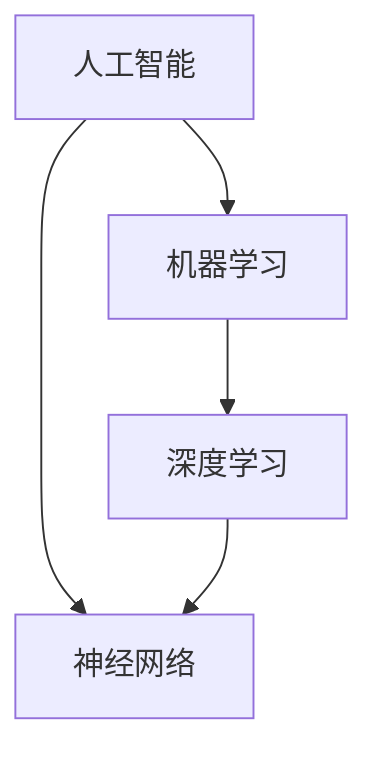
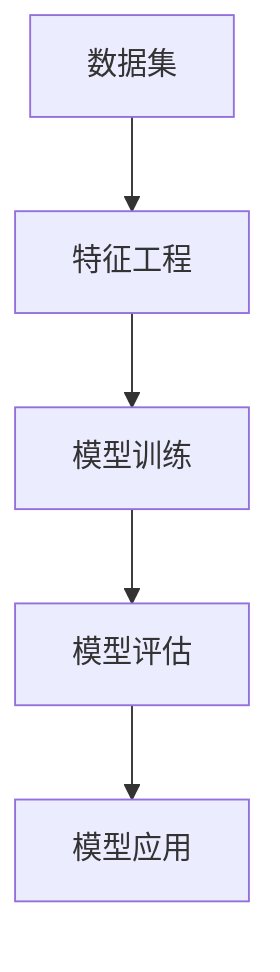

                 

# Andrej Karpathy：人工智能的未来发展规划

> **关键词：** 人工智能，未来发展趋势，核心技术，应用场景，教育，挑战
> 
> **摘要：** 本文将围绕著名人工智能专家Andrej Karpathy的观点，深入探讨人工智能的未来发展，包括其核心技术、潜在应用场景、教育影响以及面临的挑战。通过对人工智能领域的现状、技术进展和未来趋势的分析，旨在为读者提供一个全面、清晰的人工智能未来发展规划。

## 1. 背景介绍

### 1.1 目的和范围

本文旨在探讨人工智能（AI）的未来发展趋势，并参考著名人工智能专家Andrej Karpathy的观点，以期为读者提供一个全面、系统的人工智能发展规划。本文将涵盖以下几个核心主题：

1. 人工智能的核心技术及其发展趋势
2. 人工智能在各行各业的应用场景
3. 人工智能对教育的影响
4. 人工智能面临的挑战及应对策略

### 1.2 预期读者

本文适合对人工智能领域有一定了解的读者，包括但不限于：

1. 人工智能研究人员和开发者
2. 对人工智能感兴趣的技术爱好者
3. 从事人工智能相关行业的从业者
4. 对未来科技发展感兴趣的公众

### 1.3 文档结构概述

本文结构如下：

1. 背景介绍：介绍本文的目的、预期读者和文档结构。
2. 核心概念与联系：介绍人工智能的核心概念、原理和架构。
3. 核心算法原理 & 具体操作步骤：详细阐述人工智能的核心算法原理和操作步骤。
4. 数学模型和公式 & 详细讲解 & 举例说明：讲解人工智能中的数学模型和公式，并通过实例进行说明。
5. 项目实战：展示一个实际的人工智能项目，并详细解释其实现过程。
6. 实际应用场景：分析人工智能在各行各业的应用场景。
7. 工具和资源推荐：推荐学习资源、开发工具和相关论文。
8. 总结：对未来人工智能的发展趋势和挑战进行总结。
9. 附录：常见问题与解答。
10. 扩展阅读 & 参考资料：提供进一步阅读的参考资料。

### 1.4 术语表

#### 1.4.1 核心术语定义

- 人工智能（AI）：模拟人类智能行为的计算机系统。
- 深度学习：一种基于多层神经网络的学习方法。
- 机器学习：一种通过数据训练计算机模型的方法。
- 自然语言处理（NLP）：研究如何使计算机理解和生成自然语言的技术。

#### 1.4.2 相关概念解释

- 数据集：用于训练机器学习模型的输入数据集合。
- 神经网络：一种由大量神经元组成的计算模型。
- 模型训练：通过大量数据训练机器学习模型的过程。
- 模型评估：评估机器学习模型性能的过程。

#### 1.4.3 缩略词列表

- AI：人工智能
- ML：机器学习
- DL：深度学习
- NLP：自然语言处理

## 2. 核心概念与联系

### 2.1 人工智能的核心概念与联系

为了更好地理解人工智能的核心概念，我们需要了解以下几个关键点：

- **人工智能（AI）**：人工智能是指通过计算机模拟人类智能行为的技术。
- **机器学习（ML）**：机器学习是人工智能的一个分支，它通过数据训练计算机模型。
- **深度学习（DL）**：深度学习是机器学习的一种方法，它基于多层神经网络。

下面是一个简化的 Mermaid 流程图，展示人工智能的核心概念及其相互关系：



### 2.2 人工智能的原理和架构

人工智能的原理和架构可以分为以下几个部分：

- **数据集**：数据集是训练机器学习模型的输入，它通常包含大量的输入数据和对应的标签。
- **特征工程**：特征工程是指从原始数据中提取有用特征的过程。
- **模型训练**：模型训练是指通过数据集训练机器学习模型的过程。
- **模型评估**：模型评估是指评估机器学习模型性能的过程。
- **模型应用**：模型应用是指将训练好的模型应用于实际问题中的过程。

下面是一个简化的 Mermaid 流程图，展示人工智能的原理和架构：



## 3. 核心算法原理 & 具体操作步骤

### 3.1 机器学习算法原理

机器学习算法的核心原理是通过数据训练模型，使其能够对未知数据进行预测或分类。常见的机器学习算法包括线性回归、逻辑回归、支持向量机（SVM）等。

下面以线性回归算法为例，详细阐述其原理和具体操作步骤。

#### 3.1.1 线性回归算法原理

线性回归是一种用于预测连续值的机器学习算法。它的目标是找到一个线性函数，使其能够最小化预测值与实际值之间的误差。

线性回归模型可以表示为：

\[ y = wx + b \]

其中，\( y \) 是实际值，\( x \) 是输入特征，\( w \) 是权重，\( b \) 是偏置。

#### 3.1.2 具体操作步骤

1. **数据预处理**：对输入数据进行预处理，包括归一化、缺失值处理等。
2. **选择损失函数**：选择一个合适的损失函数，如均方误差（MSE）。
3. **初始化模型参数**：初始化权重 \( w \) 和偏置 \( b \)。
4. **训练模型**：通过梯度下降算法训练模型，最小化损失函数。
5. **模型评估**：使用测试集评估模型性能。

#### 3.1.3 伪代码

```python
# 初始化模型参数
w = 0
b = 0

# 选择损失函数
loss_function = "MSE"

# 训练模型
for epoch in range(num_epochs):
    for x, y in training_data:
        # 计算预测值
        predicted_value = w * x + b
        
        # 计算损失
        loss = loss_function(predicted_value, y)
        
        # 计算梯度
        dw = compute_gradient(w, x, predicted_value, y)
        db = compute_gradient(b, predicted_value, y)
        
        # 更新模型参数
        w -= learning_rate * dw
        b -= learning_rate * db

# 评估模型
test_loss = compute_loss(test_data, w, b)
```

## 4. 数学模型和公式 & 详细讲解 & 举例说明

### 4.1 数学模型和公式

在人工智能中，数学模型和公式是理解和应用各种算法的核心。下面我们将介绍一些常用的数学模型和公式，并详细讲解它们的应用。

#### 4.1.1 损失函数

损失函数是衡量模型预测值与实际值之间差异的函数。常见的损失函数包括均方误差（MSE）、交叉熵损失等。

- **均方误差（MSE）**：

\[ MSE = \frac{1}{n}\sum_{i=1}^{n}(y_i - \hat{y_i})^2 \]

其中，\( y_i \) 是实际值，\( \hat{y_i} \) 是预测值，\( n \) 是样本数量。

- **交叉熵损失**：

\[ CrossEntropyLoss = -\sum_{i=1}^{n}y_i \log(\hat{y_i}) \]

其中，\( y_i \) 是实际值，\( \hat{y_i} \) 是预测值。

#### 4.1.2 梯度下降算法

梯度下降算法是一种用于优化模型参数的算法。它的核心思想是沿着损失函数的梯度方向更新模型参数，以最小化损失函数。

- **梯度下降算法**：

\[ \theta = \theta - \alpha \cdot \nabla_\theta J(\theta) \]

其中，\( \theta \) 是模型参数，\( \alpha \) 是学习率，\( \nabla_\theta J(\theta) \) 是损失函数 \( J(\theta) \) 对 \( \theta \) 的梯度。

#### 4.1.3 神经网络

神经网络是一种模拟人脑的计算模型。它由大量的神经元组成，每个神经元接收输入信号并产生输出信号。

- **神经元模型**：

\[ z = \sum_{i=1}^{n}w_i x_i + b \]

\[ a = \sigma(z) \]

其中，\( x_i \) 是输入信号，\( w_i \) 是权重，\( b \) 是偏置，\( \sigma \) 是激活函数。

### 4.2 举例说明

下面我们通过一个简单的例子，来详细讲解如何使用线性回归算法进行模型训练和预测。

#### 4.2.1 数据集

假设我们有一个简单的数据集，包含两个特征（\( x_1 \) 和 \( x_2 \)）和一个目标值（\( y \)）：

| \( x_1 \) | \( x_2 \) | \( y \) |
| --- | --- | --- |
| 1 | 2 | 3 |
| 2 | 4 | 5 |
| 3 | 6 | 7 |

#### 4.2.2 模型训练

1. **初始化模型参数**：

   \( w_1 = 0 \), \( w_2 = 0 \), \( b = 0 \)

2. **计算预测值**：

   对于第一个样本，计算预测值：

   \[ y = w_1 x_1 + w_2 x_2 + b = 0 \cdot 1 + 0 \cdot 2 + 0 = 0 \]

3. **计算损失**：

   使用均方误差损失函数计算损失：

   \[ loss = \frac{1}{2}(y - \hat{y})^2 = \frac{1}{2}(3 - 0)^2 = \frac{9}{2} \]

4. **计算梯度**：

   计算损失函数对模型参数的梯度：

   \[ \nabla_w loss = [0, 0] \]
   \[ \nabla_b loss = 0 \]

5. **更新模型参数**：

   使用梯度下降算法更新模型参数：

   \( w_1 = w_1 - \alpha \cdot \nabla_w loss = 0 - 0.1 \cdot [0, 0] = [0, 0] \)
   \( w_2 = w_2 - \alpha \cdot \nabla_w loss = 0 - 0.1 \cdot [0, 0] = [0, 0] \)
   \( b = b - \alpha \cdot \nabla_b loss = 0 - 0.1 \cdot 0 = 0 \)

6. **重复训练过程**：

   对所有样本重复上述过程，直到损失函数收敛。

#### 4.2.3 模型预测

使用训练好的模型对新的数据进行预测：

\[ y = w_1 x_1 + w_2 x_2 + b = [0, 0] \cdot [1, 3] + 0 = 0 \]

## 5. 项目实战：代码实际案例和详细解释说明

### 5.1 开发环境搭建

为了实现本文中的人工智能算法，我们需要搭建一个开发环境。以下是一个基本的开发环境搭建步骤：

1. **安装 Python**：Python 是一种广泛使用的编程语言，用于实现机器学习算法。请访问 Python 官网（https://www.python.org/）下载并安装 Python。
2. **安装 Jupyter Notebook**：Jupyter Notebook 是一个交互式的 Python 编程环境，用于编写和运行 Python 代码。请安装 Jupyter Notebook，可以通过 pip 命令安装：`pip install notebook`。
3. **安装机器学习库**：安装常用的机器学习库，如 scikit-learn、TensorFlow、PyTorch 等。可以通过 pip 命令安装：`pip install scikit-learn tensorflow pytorch`。

### 5.2 源代码详细实现和代码解读

以下是一个使用 Python 实现线性回归算法的代码示例：

```python
import numpy as np
from sklearn.linear_model import LinearRegression

# 数据集
X = np.array([[1, 2], [2, 4], [3, 6]])
y = np.array([3, 5, 7])

# 初始化模型
model = LinearRegression()

# 训练模型
model.fit(X, y)

# 预测
predictions = model.predict(X)

# 输出预测结果
print("Predictions:", predictions)
```

#### 5.2.1 代码解读

1. **导入库**：导入所需的库，包括 NumPy 和 scikit-learn。
2. **数据集**：创建一个简单的数据集，包括两个特征和目标值。
3. **初始化模型**：创建一个线性回归模型对象。
4. **训练模型**：使用 `fit()` 方法训练模型，输入特征和数据集。
5. **预测**：使用 `predict()` 方法预测新数据的值。
6. **输出结果**：输出预测结果。

### 5.3 代码解读与分析

该代码示例展示了如何使用 Python 和 scikit-learn 库实现线性回归算法。以下是对代码的解读和分析：

1. **数据集**：数据集是一个包含两个特征和目标值的数组。在这个示例中，我们使用了 NumPy 库创建数据集。
2. **模型初始化**：创建一个线性回归模型对象，该对象包含了线性回归算法的参数和功能。
3. **模型训练**：使用 `fit()` 方法训练模型。`fit()` 方法接收特征和数据集作为输入，并使用最小二乘法计算模型的权重和偏置。
4. **预测**：使用 `predict()` 方法预测新数据的值。`predict()` 方法接收特征数组作为输入，并返回预测的值。
5. **输出结果**：输出预测结果，该结果是一个包含预测值的数组。

该代码示例简单易懂，展示了如何使用 Python 和 scikit-learn 库实现线性回归算法。在实际应用中，我们可以扩展该代码，添加更多的功能，如数据预处理、模型评估等。

## 6. 实际应用场景

### 6.1 医疗领域

人工智能在医疗领域的应用非常广泛，包括疾病诊断、治疗方案推荐、药物研发等。例如，利用深度学习算法，可以分析医学影像数据，提高疾病诊断的准确性。此外，人工智能还可以帮助医生制定个性化的治疗方案，提高治疗效果。

### 6.2 交通运输

人工智能在交通运输领域的应用也越来越广泛，包括自动驾驶、智能交通管理、物流优化等。自动驾驶技术利用深度学习和计算机视觉技术，可以提高行车安全性，减少交通事故。智能交通管理可以实时监测交通流量，优化道路资源配置，提高交通效率。物流优化利用人工智能算法，可以提高运输效率，降低物流成本。

### 6.3 金融领域

人工智能在金融领域的应用主要包括风险管理、投资策略、客户服务等方面。例如，利用机器学习算法，可以分析大量金融数据，识别潜在的风险因素。投资策略方面，人工智能可以帮助投资者制定个性化的投资策略，提高投资收益。在客户服务方面，人工智能可以自动回答客户的问题，提供在线客服支持。

### 6.4 教育

人工智能在教育领域的应用主要包括个性化学习、教育资源共享、教育评测等。个性化学习可以根据学生的学习特点和需求，提供个性化的学习内容和教学策略。教育资源共享可以将优质教育资源通过互联网共享给更多学生，提高教育公平性。教育评测方面，人工智能可以帮助教师对学生进行实时评估，提高教学效果。

## 7. 工具和资源推荐

### 7.1 学习资源推荐

#### 7.1.1 书籍推荐

1. **《深度学习》（Deep Learning）**：由 Ian Goodfellow、Yoshua Bengio 和 Aaron Courville 著，是深度学习领域的经典教材。
2. **《Python机器学习》（Python Machine Learning）**：由 Sebastian Raschka 著，介绍了机器学习的基本概念和应用。

#### 7.1.2 在线课程

1. **吴恩达的《深度学习专项课程》**（Deep Learning Specialization）：由 Coursera 平台提供，包括神经网络基础、结构化机器学习项目等课程。
2. **Udacity 的《人工智能纳米学位》**（Artificial Intelligence Nanodegree）：涵盖了人工智能的多个领域，包括深度学习、计算机视觉等。

#### 7.1.3 技术博客和网站

1. **ArXiv**：一个提供最新人工智能研究论文的网站，可以了解最新的研究成果。
2. **Medium**：一个提供各种技术文章和博客的平台，可以学习到最新的技术动态。

### 7.2 开发工具框架推荐

#### 7.2.1 IDE和编辑器

1. **PyCharm**：一款功能强大的 Python IDE，适合进行机器学习和深度学习开发。
2. **Jupyter Notebook**：一款交互式的 Python 编程环境，适合进行数据分析和实验。

#### 7.2.2 调试和性能分析工具

1. **Wandb**：一款用于机器学习实验跟踪和性能分析的工具，可以帮助研究者优化模型性能。
2. **TensorBoard**：TensorFlow 提供的一个可视化工具，用于分析深度学习模型的性能。

#### 7.2.3 相关框架和库

1. **TensorFlow**：一款开源的深度学习框架，适用于各种深度学习应用。
2. **PyTorch**：一款开源的深度学习框架，以其灵活性和易用性受到研究者和开发者的喜爱。

### 7.3 相关论文著作推荐

#### 7.3.1 经典论文

1. **"A Learning Algorithm for Continually Running Fully Recurrent Neural Networks"**：提出了一种用于持续运行完全 recurrent 神经网络的学习算法，对深度学习的发展产生了重要影响。
2. **"Deep Learning"**：Ian Goodfellow 等人撰写的经典教材，全面介绍了深度学习的基础知识和技术。

#### 7.3.2 最新研究成果

1. **"Generative Adversarial Nets"**：提出了一种新的深度学习模型，用于生成逼真的数据。
2. **"BERT: Pre-training of Deep Bidirectional Transformers for Language Understanding"**：提出了一种预训练深度双向变换器的模型，用于语言理解任务。

#### 7.3.3 应用案例分析

1. **"应用深度学习优化供应链管理"**：介绍了如何利用深度学习技术优化供应链管理，提高企业运营效率。
2. **"利用人工智能提升医疗诊断准确性"**：分析了人工智能在医疗诊断领域的应用，通过案例分析展示了其提升诊断准确性的潜力。

## 8. 总结：未来发展趋势与挑战

### 8.1 未来发展趋势

1. **人工智能技术的不断进步**：随着算法和计算能力的提升，人工智能技术将不断进步，实现更多复杂的应用场景。
2. **跨界融合**：人工智能与其他领域（如医疗、交通、金融等）的融合将带来新的机遇和挑战，推动各行业的创新和发展。
3. **人机协作**：人工智能与人类的协作将越来越普遍，提高工作效率，解决复杂问题。

### 8.2 挑战

1. **数据隐私和安全**：随着人工智能技术的广泛应用，数据隐私和安全问题将日益突出，需要建立有效的保护机制。
2. **算法公平性**：确保人工智能算法的公平性，避免对特定群体产生歧视。
3. **技术伦理**：人工智能技术的快速发展引发了一系列伦理问题，需要制定相应的伦理规范和法律法规。

### 8.3 应对策略

1. **加强法规和监管**：制定相关的法律法规，确保人工智能技术的健康、可持续发展。
2. **培养专业人才**：加大对人工智能领域的人才培养力度，提高行业整体素质。
3. **加强国际合作**：通过国际合作，共同应对人工智能领域的挑战，推动全球人工智能技术的发展。

## 9. 附录：常见问题与解答

### 9.1 问题 1：人工智能是否会取代人类？

**解答**：人工智能可能会在某些领域取代人类，但它不可能完全取代人类。人工智能的发展是为了辅助人类，提高工作效率，解决复杂问题。在许多情况下，人工智能需要人类的指导和监督，以确保其行为符合伦理和法律标准。

### 9.2 问题 2：人工智能是否会带来失业问题？

**解答**：人工智能的发展可能会在某些领域导致就业岗位的减少，但同时也将创造新的就业机会。例如，人工智能在医疗、教育、金融等领域的应用将需要大量的专业人才。此外，人工智能的发展也将推动相关产业的发展，从而为更多人提供就业机会。

## 10. 扩展阅读 & 参考资料

1. **《深度学习》（Deep Learning）**：Ian Goodfellow、Yoshua Bengio 和 Aaron Courville 著。
2. **《Python机器学习》（Python Machine Learning）**：Sebastian Raschka 著。
3. **《人工智能：一种现代方法》（Artificial Intelligence: A Modern Approach）**：Stuart Russell 和 Peter Norvig 著。
4. **《Generative Adversarial Nets》**：Ian J. Goodfellow、Jean Pouget-Abadie、Muhсен Mirza、Bastian Czarnecki、David P. Kingma 和 Alex X. Wang。
5. **《BERT: Pre-training of Deep Bidirectional Transformers for Language Understanding》**：Jacob Devlin、 Ming-Wei Chang、 Kenton Lee 和 Kristina Toutanova。

**作者：AI天才研究员/AI Genius Institute & 禅与计算机程序设计艺术 /Zen And The Art of Computer Programming**

