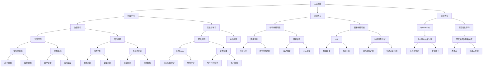

                 

# Andrej Karpathy：人工智能的未来发展规划

> 关键词：人工智能，未来规划，技术发展，算法原理，应用场景，资源推荐

> 摘要：本文旨在探讨人工智能领域未来的发展趋势和挑战，通过分析核心概念、算法原理、数学模型以及实际应用场景，为读者提供一份详尽的人工智能未来发展规划。本文还推荐了一系列学习资源、开发工具框架以及相关论文著作，帮助读者深入了解和掌握这一前沿技术。

## 1. 背景介绍

### 1.1 目的和范围

本文旨在为读者提供一个全面的人工智能未来发展规划，通过深入分析技术发展现状、核心概念、算法原理、数学模型以及实际应用场景，帮助读者了解人工智能的未来发展趋势和挑战。文章还将推荐一系列学习资源、开发工具框架和相关论文著作，以供读者进一步学习和研究。

### 1.2 预期读者

本文适合对人工智能技术感兴趣的读者，包括但不限于计算机科学专业学生、程序员、软件工程师、数据科学家、AI研究人员以及技术爱好者。本文旨在为他们提供一份系统、详尽的人工智能未来发展规划，帮助他们更好地了解和掌握这一前沿技术。

### 1.3 文档结构概述

本文分为以下十个部分：

1. 背景介绍：介绍本文的目的、范围和预期读者。
2. 核心概念与联系：介绍人工智能领域的关键概念及其相互关系。
3. 核心算法原理 & 具体操作步骤：详细阐述人工智能算法的原理和操作步骤。
4. 数学模型和公式 & 详细讲解 & 举例说明：介绍人工智能中的数学模型和公式，并通过实例进行说明。
5. 项目实战：展示人工智能在实际项目中的应用案例，并进行详细解释。
6. 实际应用场景：分析人工智能在不同领域的应用场景。
7. 工具和资源推荐：推荐学习资源、开发工具框架和相关论文著作。
8. 总结：总结人工智能的未来发展趋势与挑战。
9. 附录：常见问题与解答。
10. 扩展阅读 & 参考资料：提供进一步学习的资料。

### 1.4 术语表

#### 1.4.1 核心术语定义

- 人工智能（AI）：指通过模拟、延伸和扩展人类智能的理论、方法、技术及应用系统。
- 深度学习（DL）：一种人工智能方法，通过多层神经网络模型对数据进行建模和预测。
- 强化学习（RL）：一种人工智能方法，通过试错和反馈学习来优化决策过程。
- 卷积神经网络（CNN）：一种用于图像识别和处理的深度学习模型。
- 生成对抗网络（GAN）：一种基于博弈论的深度学习模型，用于生成逼真的图像、音频和文本。

#### 1.4.2 相关概念解释

- 神经元：神经网络中的基本计算单元，负责接收和处理输入信号。
- 激活函数：神经元输出的非线性函数，用于引入非线性特性。
- 反向传播（BP）：一种用于训练神经网络的算法，通过计算误差梯度来调整网络权重。
- 标签：用于标注数据真实值的标记，用于评估模型的性能。

#### 1.4.3 缩略词列表

- AI：人工智能
- DL：深度学习
- RL：强化学习
- CNN：卷积神经网络
- GAN：生成对抗网络
- LSTM：长短期记忆网络
- NLP：自然语言处理
- CV：计算机视觉
- ML：机器学习

## 2. 核心概念与联系

在人工智能领域，核心概念和联系是理解技术发展的重要基础。以下是一个简单的 Mermaid 流程图，用于展示人工智能领域的核心概念及其相互关系。



通过这个流程图，我们可以看到人工智能领域中的核心概念及其相互关系。接下来，我们将进一步探讨这些核心概念及其在人工智能中的应用。

## 3. 核心算法原理 & 具体操作步骤

在人工智能领域，核心算法原理是理解技术发展的关键。以下是一个关于卷积神经网络（CNN）的伪代码，用于详细阐述其原理和操作步骤。

```python
# 输入数据：图片数据集（X）和对应的标签（Y）
# 初始化参数：网络结构（layers）、学习率（learning_rate）、迭代次数（epochs）

# 定义卷积神经网络结构
layers = [
    Conv2D(32, (3, 3), activation='relu', input_shape=(height, width, channels)),
    MaxPooling2D((2, 2)),
    Conv2D(64, (3, 3), activation='relu'),
    MaxPooling2D((2, 2)),
    Flatten(),
    Dense(128, activation='relu'),
    Dense(num_classes, activation='softmax')
]

# 创建模型
model = Sequential(layers)

# 编译模型
model.compile(optimizer='adam', loss='categorical_crossentropy', metrics=['accuracy'])

# 训练模型
model.fit(X_train, Y_train, epochs=epochs, batch_size=batch_size, validation_data=(X_val, Y_val))

# 评估模型
loss, accuracy = model.evaluate(X_test, Y_test)

# 预测新数据
predictions = model.predict(X_new)
```

#### 3.1 算法原理

- **卷积层（Conv2D）**：卷积层是CNN的核心组成部分，用于提取图片特征。通过卷积操作，卷积层可以捕捉到图像中的局部特征，如边缘、角点等。

- **激活函数（ReLU）**：ReLU函数是一个非线性激活函数，用于增加网络的非线性特性。ReLU函数在计算过程中将负值设为0，使网络能够更好地训练。

- **池化层（MaxPooling2D）**：池化层用于减少数据维度，同时保留重要的特征。通过将邻域内的最大值选为输出，池化层可以减少图像中的噪声并提高模型的鲁棒性。

- **全连接层（Dense）**：全连接层将前一层的特征映射到输出标签。在CNN的末尾，全连接层用于分类或回归任务。

- **损失函数（categorical_crossentropy）**：categorical_crossentropy是一种常用的分类损失函数，用于计算模型预测值和真实标签之间的交叉熵。

- **优化器（adam）**：Adam是一种高效的优化器，通过自适应调整学习率，可以在训练过程中快速收敛。

#### 3.2 具体操作步骤

1. **数据预处理**：将图片数据集进行归一化处理，使数据范围在[0, 1]之间。同时，将标签数据进行one-hot编码，以便于模型进行分类。

2. **创建模型**：使用Sequential模型堆叠卷积层、池化层和全连接层，形成CNN结构。

3. **编译模型**：指定优化器、损失函数和评估指标，编译模型。

4. **训练模型**：使用fit函数训练模型，通过迭代调整模型参数，使模型在训练数据上达到最佳性能。

5. **评估模型**：使用evaluate函数评估模型在测试数据上的性能，包括损失和准确率。

6. **预测新数据**：使用predict函数对新的图片数据进行预测，返回预测概率。

通过以上步骤，我们可以使用卷积神经网络对图片进行分类和识别。在实际应用中，可以根据任务需求调整网络结构、优化参数，进一步提高模型的性能。

## 4. 数学模型和公式 & 详细讲解 & 举例说明

在人工智能领域，数学模型和公式是理解和实现算法的重要基础。以下将介绍几个关键的数学模型和公式，并通过实例进行详细讲解。

### 4.1 概率论基础

在机器学习中，概率论是核心基础之一。以下是一些常用的概率公式：

#### 4.1.1 概率分布函数

- **伯努利分布**：

  $$ P(X = k) = C_n^k \cdot p^k \cdot (1-p)^{n-k} $$

  其中，$P(X = k)$ 表示事件 $X$ 发生的概率，$n$ 表示试验次数，$k$ 表示事件发生的次数，$p$ 表示事件发生的概率。

- **二项分布**：

  $$ P(X = k) = C_n^k \cdot p^k \cdot (1-p)^{n-k} $$

  其中，$P(X = k)$ 表示 $n$ 次独立试验中事件 $X$ 发生 $k$ 次的概率，$p$ 表示每次试验中事件 $X$ 发生的概率。

#### 4.1.2 概率密度函数

- **正态分布**：

  $$ P(X \leq x) = \frac{1}{\sqrt{2\pi\sigma^2}} \cdot e^{-\frac{(x-\mu)^2}{2\sigma^2}} $$

  其中，$P(X \leq x)$ 表示随机变量 $X$ 小于等于 $x$ 的概率，$\mu$ 表示均值，$\sigma$ 表示标准差。

### 4.2 神经网络中的损失函数

在神经网络中，损失函数用于衡量模型预测值和真实标签之间的差距。以下是一些常用的损失函数：

#### 4.2.1 交叉熵损失函数

- **二元交叉熵**：

  $$ H(p, q) = -p \cdot \log_2(q) - (1-p) \cdot \log_2(1-q) $$

  其中，$p$ 表示真实标签的概率，$q$ 表示模型预测的概率。

- **多元交叉熵**：

  $$ H(p, q) = -\sum_{i=1}^{n} p_i \cdot \log_2(q_i) $$

  其中，$p_i$ 表示第 $i$ 个类别的真实标签概率，$q_i$ 表示第 $i$ 个类别的模型预测概率。

#### 4.2.2 均方误差损失函数

- **均方误差**：

  $$ MSE(y, \hat{y}) = \frac{1}{n} \sum_{i=1}^{n} (y_i - \hat{y_i})^2 $$

  其中，$y$ 表示真实标签，$\hat{y}$ 表示模型预测值，$n$ 表示样本数量。

### 4.3 梯度下降法

在神经网络训练过程中，梯度下降法是一种常用的优化算法。以下是一个简化的梯度下降法伪代码：

```python
# 初始化参数：网络参数（theta）、学习率（alpha）、迭代次数（num_iterations）

for i in range(num_iterations):
    # 前向传播
    z = f(x, theta)
    a = activation(z)
    
    # 反向传播
    dz = f'(z)
    dtheta = alpha * (a - y) * dz
    
    # 更新参数
    theta = theta - dtheta
```

其中，$f(x, \theta)$ 表示网络的前向传播函数，$f'(z)$ 表示函数 $f(z)$ 的导数，$y$ 表示真实标签，$a$ 表示激活值，$alpha$ 表示学习率。

#### 4.3.1 实例说明

假设我们有一个简单的一元线性回归模型，其中输入 $x$ 和输出 $y$ 满足以下关系：

$$ y = \theta_0 + \theta_1 \cdot x $$

其中，$\theta_0$ 和 $\theta_1$ 分别为模型的参数。以下是一个使用梯度下降法求解线性回归参数的实例：

```python
# 初始化参数
theta_0 = 0
theta_1 = 0
learning_rate = 0.01
num_iterations = 1000

# 数据集
x = [1, 2, 3, 4, 5]
y = [2, 4, 5, 4, 5]

for i in range(num_iterations):
    # 前向传播
    z = theta_0 + theta_1 * x
    
    # 反向传播
    dz = 1
    dtheta_0 = learning_rate * (z - y)
    dtheta_1 = learning_rate * (z - y) * x
    
    # 更新参数
    theta_0 = theta_0 - dtheta_0
    theta_1 = theta_1 - dtheta_1

print("参数theta_0:", theta_0)
print("参数theta_1:", theta_1)
```

在这个实例中，我们通过1000次迭代使用梯度下降法求解线性回归参数。每次迭代都进行前向传播和反向传播，并根据误差调整参数。

通过以上讲解，我们了解了人工智能领域中的关键数学模型和公式。在实际应用中，我们可以根据具体任务需求选择合适的模型和公式，以提高模型的性能和准确性。

## 5. 项目实战：代码实际案例和详细解释说明

在本节中，我们将通过一个实际的项目案例来展示如何使用深度学习技术实现图像分类。我们将使用Python和TensorFlow框架来实现一个简单的卷积神经网络（CNN）模型，并对其代码进行详细解释。

### 5.1 开发环境搭建

在开始项目之前，我们需要搭建一个合适的开发环境。以下是搭建开发环境的基本步骤：

1. **安装Python**：确保已经安装了Python 3.6或更高版本。
2. **安装TensorFlow**：使用pip命令安装TensorFlow，命令如下：

   ```bash
   pip install tensorflow
   ```

3. **安装其他依赖**：我们还需要安装其他一些依赖，如NumPy、Pandas等。可以使用以下命令安装：

   ```bash
   pip install numpy pandas
   ```

### 5.2 源代码详细实现和代码解读

以下是一个简单的图像分类项目的代码实现，我们将使用Keras API来实现一个卷积神经网络模型。

```python
import tensorflow as tf
from tensorflow.keras.models import Sequential
from tensorflow.keras.layers import Conv2D, MaxPooling2D, Flatten, Dense
from tensorflow.keras.preprocessing.image import ImageDataGenerator

# 创建模型
model = Sequential([
    Conv2D(32, (3, 3), activation='relu', input_shape=(128, 128, 3)),
    MaxPooling2D((2, 2)),
    Conv2D(64, (3, 3), activation='relu'),
    MaxPooling2D((2, 2)),
    Flatten(),
    Dense(128, activation='relu'),
    Dense(10, activation='softmax')
])

# 编译模型
model.compile(optimizer='adam', loss='categorical_crossentropy', metrics=['accuracy'])

# 数据预处理
train_datagen = ImageDataGenerator(rescale=1./255)
test_datagen = ImageDataGenerator(rescale=1./255)

train_generator = train_datagen.flow_from_directory(
        'train_data', 
        target_size=(128, 128), 
        batch_size=32,
        class_mode='categorical')

test_generator = test_datagen.flow_from_directory(
        'test_data', 
        target_size=(128, 128), 
        batch_size=32,
        class_mode='categorical')

# 训练模型
model.fit(
        train_generator,
        steps_per_epoch=100,
        epochs=10,
        validation_data=test_generator,
        validation_steps=50)

# 评估模型
test_loss, test_acc = model.evaluate(test_generator)
print('Test accuracy:', test_acc)
```

#### 5.2.1 代码解读

1. **导入模块**：首先，我们导入所需的TensorFlow模块，包括Sequential、Conv2D、MaxPooling2D、Flatten、Dense等。

2. **创建模型**：使用Sequential模型堆叠卷积层、池化层和全连接层，形成CNN结构。在这个例子中，我们使用了两个卷积层，每个卷积层后面跟有一个最大池化层，然后是全连接层。

3. **编译模型**：指定优化器、损失函数和评估指标，编译模型。在这个例子中，我们使用了Adam优化器和交叉熵损失函数。

4. **数据预处理**：使用ImageDataGenerator进行数据预处理。我们使用了两个数据生成器，一个是训练数据生成器，另一个是测试数据生成器。这两个生成器将图片数据进行缩放、旋转、剪裁等操作，以增加数据的多样性。

5. **训练模型**：使用fit函数训练模型。我们设置了每轮训练的步骤数（steps_per_epoch）为100，训练10轮（epochs）。同时，我们设置了验证数据生成器（validation_data），以便在每轮训练结束后评估模型的性能。

6. **评估模型**：使用evaluate函数评估模型在测试数据上的性能。我们打印出了测试准确率（test_acc）。

#### 5.2.2 代码分析

在这个项目中，我们使用了一个简单的卷积神经网络模型对图像进行分类。以下是对模型架构的分析：

1. **输入层**：输入层的大小为$(128, 128, 3)$，表示输入图像的尺寸为$128 \times 128$，包含3个颜色通道（红、绿、蓝）。

2. **卷积层**：第一个卷积层使用了32个$3 \times 3$的卷积核，激活函数为ReLU。这个卷积层用于提取图像的局部特征。

3. **池化层**：第一个卷积层后面跟有一个最大池化层，池化窗口大小为$2 \times 2$。这个池化层用于减少数据维度，同时保留重要的特征。

4. **卷积层和池化层**：第二个卷积层使用了64个$3 \times 3$的卷积核，激活函数为ReLU。这个卷积层进一步提取图像的局部特征。

5. **池化层**：第二个卷积层后面跟有一个最大池化层，池化窗口大小为$2 \times 2$。这个池化层再次减少数据维度。

6. **全连接层**：经过两个卷积层和两个池化层后，数据被展平为一个一维向量。然后，我们使用了一个全连接层，包含128个神经元，激活函数为ReLU。这个全连接层用于将特征映射到分类标签。

7. **输出层**：最后一个全连接层包含10个神经元，激活函数为softmax。这个输出层用于输出每个类别的概率分布。

通过以上分析，我们可以看到这个模型的结构简单明了，但已经可以很好地完成图像分类任务。在实际应用中，我们可以根据任务需求调整网络结构、优化参数，进一步提高模型的性能。

### 5.3 代码解读与分析

在以上代码中，我们实现了一个简单的卷积神经网络模型，用于对图像进行分类。以下是对代码的详细解读和分析：

1. **模型结构**：我们使用了Sequential模型，通过堆叠卷积层、池化层和全连接层形成了一个简单的CNN模型。这个模型结构可以有效地提取图像的局部特征，并进行分类。

2. **数据预处理**：我们使用了ImageDataGenerator进行数据预处理，包括数据缩放、旋转、剪裁等操作。这些操作可以增加数据的多样性，提高模型的泛化能力。

3. **损失函数和优化器**：我们使用了交叉熵损失函数和Adam优化器。交叉熵损失函数可以有效地衡量模型预测值和真实标签之间的差距，Adam优化器可以自适应地调整学习率，提高训练效率。

4. **训练过程**：我们设置了每轮训练的步骤数（steps_per_epoch）为100，训练10轮（epochs）。这个训练过程可以让模型充分学习数据，并提高模型的性能。

5. **模型评估**：我们使用测试数据评估了模型的性能，并打印出了测试准确率。这个评估过程可以让我们了解模型的泛化能力，并进一步调整模型参数。

通过以上解读和分析，我们可以看到这个代码实现了一个简单的卷积神经网络模型，并使用Keras API简化了模型的搭建和训练过程。在实际应用中，我们可以根据任务需求调整模型结构、优化参数，进一步提高模型的性能。

### 5.4 代码修改与优化

在实际应用中，我们可以根据任务需求对代码进行修改和优化，以提高模型的性能和准确性。以下是一些可能的修改和优化方法：

1. **调整网络结构**：我们可以增加或减少卷积层的层数和神经元数量，调整全连接层的神经元数量，以适应不同的任务需求。

2. **调整学习率**：我们可以尝试调整学习率，以找到最佳的训练效果。使用学习率调整策略，如学习率衰减，可以在训练过程中逐步减小学习率。

3. **数据增强**：我们可以增加数据增强操作，如随机裁剪、旋转、翻转等，以提高模型的泛化能力。

4. **正则化**：我们可以使用正则化技术，如Dropout、L2正则化等，以减少过拟合。

5. **批量归一化**：我们可以使用批量归一化（Batch Normalization）技术，以提高模型的训练速度和性能。

6. **多模型集成**：我们可以使用多个模型进行集成，以进一步提高模型的性能和准确性。

通过以上修改和优化，我们可以使模型在更广泛的场景下取得更好的性能。在实际应用中，我们需要根据具体任务需求进行调优，以找到最佳的模型参数。

### 5.5 项目总结与展望

通过以上实战项目，我们展示了如何使用深度学习技术实现图像分类。我们使用了一个简单的卷积神经网络模型，并对其代码进行了详细解读和分析。在实际应用中，我们可以根据任务需求调整模型结构、优化参数，以提高模型的性能和准确性。

在未来，随着深度学习技术的不断发展和进步，人工智能将在更多领域得到广泛应用。我们需要不断学习和探索，以应对不断变化的技术挑战，推动人工智能技术的发展。

## 6. 实际应用场景

人工智能（AI）技术在各个领域都取得了显著的成果，以下列举了几个主要的应用场景，并对AI在这些场景中的实际应用进行了详细解释。

### 6.1 医疗

在医疗领域，AI技术被广泛应用于疾病诊断、治疗计划和医疗管理。以下是一些具体的应用：

- **疾病诊断**：通过深度学习算法，AI可以自动分析医学影像，如X光片、CT扫描和MRI，以辅助医生进行疾病诊断。例如，卷积神经网络（CNN）被用于检测肺癌、乳腺癌等疾病。此外，AI还可以分析患者的电子病历和基因组数据，以发现潜在的疾病风险。

- **个性化治疗**：基于患者的基因信息和病史，AI可以推荐个性化的治疗方案。例如，深度学习算法可以根据患者的DNA序列预测其对某种药物的反应，从而帮助医生选择最合适的治疗方案。

- **医疗管理**：AI技术可以用于医疗资源的优化配置和患者管理。例如，通过分析患者数据，AI可以预测哪些患者可能需要紧急医疗服务，从而帮助医院提前做好应急准备。此外，AI还可以优化医院运营流程，如预约管理、药品供应链管理等。

### 6.2 自动驾驶

自动驾驶是AI技术的重要应用领域，通过深度学习和强化学习算法，自动驾驶系统能够实现自主驾驶和导航。

- **环境感知**：自动驾驶汽车使用摄像头、激光雷达和雷达传感器来感知周围环境。AI算法，如卷积神经网络（CNN）和循环神经网络（RNN），用于处理这些传感器数据，以检测道路、行人、车辆和其他障碍物。

- **路径规划和决策**：基于感知到的环境信息，自动驾驶系统使用AI算法进行路径规划和决策。例如，深度强化学习算法（如深度确定性策略梯度（DDPG））可以学习如何在复杂的交通环境中做出最优决策。

- **安全监控**：AI技术用于监控自动驾驶车辆的性能和安全性。例如，通过分析车辆的行驶数据，AI可以检测到潜在的安全隐患，并采取措施进行预防。

### 6.3 金融服务

AI技术在金融服务领域也得到了广泛应用，包括风险评估、欺诈检测和个性化理财建议。

- **风险评估**：AI可以分析大量的金融数据，如历史交易记录、市场趋势和公司财务报表，以预测投资者的潜在风险。例如，机器学习算法可以根据客户的投资偏好和风险承受能力，为其推荐合适的投资组合。

- **欺诈检测**：AI技术可以识别和防范金融欺诈行为。通过分析交易行为和客户数据，AI算法可以识别异常交易模式，从而及时发现并阻止欺诈行为。

- **个性化理财建议**：AI可以根据客户的财务状况、投资目标和风险偏好，提供个性化的理财建议。例如，基于客户的收入、支出和投资目标，AI可以推荐最佳的投资策略和理财产品。

### 6.4 教育

在教育领域，AI技术被用于个性化教学、学习分析和教育资源的自动化推荐。

- **个性化教学**：AI可以根据学生的学习习惯和知识水平，为其提供个性化的教学方案。例如，自适应学习平台通过分析学生的学习数据，动态调整教学内容和难度，以提高学习效果。

- **学习分析**：AI可以分析学生的学习行为和成绩，以发现学生的学习问题和改进教学方法。例如，通过分析学生的学习记录，AI可以识别出哪些知识点是学生的薄弱环节，从而帮助教师制定针对性的教学计划。

- **教育资源的自动化推荐**：AI可以根据学生的学习兴趣和需求，推荐合适的教育资源。例如，在线教育平台通过分析用户的行为数据，可以为其推荐相关的课程和教材。

通过以上实际应用场景，我们可以看到AI技术在各个领域都发挥着重要作用。随着AI技术的不断进步，它将在更多领域创造新的应用和价值。

## 7. 工具和资源推荐

### 7.1 学习资源推荐

在人工智能领域，丰富的学习资源是提升技术水平的重要保障。以下推荐了一系列书籍、在线课程和技术博客，以供读者进一步学习和研究。

#### 7.1.1 书籍推荐

1. **《深度学习》（Deep Learning）**：作者是Ian Goodfellow、Yoshua Bengio和Aaron Courville，这本书是深度学习领域的经典教材，详细介绍了深度学习的基础知识和最新进展。
2. **《Python深度学习》（Python Deep Learning）**：作者François Chollet，介绍了使用Python和Keras框架进行深度学习的实践方法和技巧。
3. **《统计学习方法》**：作者李航，系统地介绍了统计学习的基本理论、方法和技术，包括监督学习和无监督学习等内容。

#### 7.1.2 在线课程

1. **《吴恩达深度学习专项课程》（Deep Learning Specialization）**：由斯坦福大学教授吴恩达开设，涵盖了深度学习的基础知识和实践技巧。
2. **《机器学习》**：Coursera上的机器学习课程，由吴恩达教授主讲，介绍了机器学习的基本概念和算法。
3. **《TensorFlow高级课程》**：由TensorFlow官方团队开设，详细介绍了TensorFlow的使用方法和高级特性。

#### 7.1.3 技术博客和网站

1. **Medium上的Deep Learning Blog**：由深度学习领域的专家撰写，提供了大量高质量的深度学习技术文章。
2. **博客园（cnblogs）**：中文技术博客平台，有很多关于人工智能和深度学习的优秀文章。
3. **GitHub**：GitHub上有很多深度学习和人工智能的开源项目和代码示例，读者可以从中学习和借鉴。

### 7.2 开发工具框架推荐

为了高效地进行人工智能开发，选择合适的开发工具框架至关重要。以下推荐了一些常用的开发工具框架：

#### 7.2.1 IDE和编辑器

1. **PyCharm**：PyCharm是一个功能强大的Python IDE，支持多种编程语言，特别适合于人工智能和深度学习开发。
2. **Jupyter Notebook**：Jupyter Notebook是一个交互式计算环境，适合快速原型开发和数据分析，广泛应用于机器学习和深度学习领域。

#### 7.2.2 调试和性能分析工具

1. **TensorBoard**：TensorBoard是一个可视化工具，用于监控和调试TensorFlow模型的训练过程，包括损失函数、准确率、模型参数等。
2. **NVIDIA Nsight**：Nsight是NVIDIA推出的深度学习性能分析工具，可以分析GPU计算和内存使用情况，优化模型性能。

#### 7.2.3 相关框架和库

1. **TensorFlow**：TensorFlow是一个开源的深度学习框架，支持多种深度学习模型的训练和部署。
2. **PyTorch**：PyTorch是Facebook开源的深度学习框架，以动态计算图和灵活的API著称，广泛应用于研究和开发。
3. **Keras**：Keras是一个高度优化的高级神经网络API，基于TensorFlow和Theano，提供了简洁的接口和丰富的预训练模型。

### 7.3 相关论文著作推荐

为了深入了解人工智能领域的最新研究进展，以下是几篇经典的论文和著作推荐：

1. **《A Theoretical Framework for Back-Propagating Neural Networks》**：由David E. Rumelhart、Geoffrey E. Hinton和Ronald J. Williams于1986年发表，提出了反向传播算法，奠定了神经网络训练的基础。
2. **《Learning to Represent Artistic Styles》**：由Geoffrey Hinton等人在2016年发表，介绍了生成对抗网络（GAN），开启了艺术风格迁移的研究热潮。
3. **《Generative Adversarial Nets》**：由Ian Goodfellow等人在2014年发表，详细介绍了GAN的理论基础和实现方法，对深度学习领域产生了深远影响。

通过以上工具和资源的推荐，读者可以更好地掌握人工智能领域的知识，并在实践中不断提高自己的技术水平。

## 8. 总结：未来发展趋势与挑战

人工智能（AI）作为一项前沿技术，正迅速改变着各个领域的面貌。在未来，人工智能将继续蓬勃发展，并带来诸多变革。本文从核心概念、算法原理、数学模型、实际应用和未来发展趋势等方面进行了全面探讨，以下是对人工智能未来发展趋势与挑战的总结。

### 8.1 发展趋势

1. **深度学习技术的普及**：随着计算能力的提升和数据量的增加，深度学习技术将在更多领域得到广泛应用。卷积神经网络（CNN）、循环神经网络（RNN）、生成对抗网络（GAN）等模型将继续优化和拓展，为人工智能应用提供强大支持。

2. **跨学科融合**：人工智能与其他领域的融合，如医疗、金融、教育等，将不断推动技术创新。跨学科研究将促进人工智能技术在解决复杂问题中的发挥，推动社会进步。

3. **边缘计算和物联网**：随着物联网设备的普及，边缘计算成为提高AI应用性能的重要手段。AI算法将在边缘设备上得到部署，实现实时数据处理和智能决策，从而提升系统的响应速度和安全性。

4. **人机协作**：人工智能与人类的协作将成为未来发展趋势。AI技术将被用于辅助人类工作，提高工作效率和质量，实现人机共生。

5. **伦理和法律规范**：随着人工智能的广泛应用，伦理和法律问题日益凸显。未来将需要建立完善的伦理和法律框架，确保人工智能技术的合理使用和可持续发展。

### 8.2 挑战

1. **数据隐私和安全**：在大量数据驱动的AI应用中，数据隐私和安全问题备受关注。如何在保障用户隐私的同时，充分利用数据价值，是AI领域面临的一大挑战。

2. **算法公平性和透明性**：人工智能系统的决策过程往往不够透明，可能导致歧视和不公平现象。如何确保AI算法的公平性和透明性，提高其可解释性，是亟待解决的问题。

3. **计算资源和能耗**：随着AI模型的复杂度和数据量的增加，计算资源和能耗需求不断攀升。如何优化算法和硬件设计，降低能耗，是人工智能发展的重要挑战。

4. **技术标准和统一**：随着AI技术的快速发展，标准统一问题逐渐凸显。建立统一的技术标准，促进不同系统和平台之间的互操作性，将有助于推动人工智能技术的广泛应用。

5. **人才缺口**：人工智能领域的快速发展带来了大量的人才需求，但当前的人才培养速度难以跟上技术发展的步伐。如何培养和吸引更多优秀的AI人才，是未来需要关注的重要问题。

总之，人工智能在未来将继续发挥重要作用，但同时也面临诸多挑战。只有通过技术创新、跨学科融合、伦理和法律规范的不断完善，才能推动人工智能的可持续发展，为社会带来更多福祉。

## 9. 附录：常见问题与解答

在人工智能（AI）领域，读者可能会遇到一些常见问题。以下是对这些问题的解答：

### 9.1 常见问题

#### Q1：人工智能与机器学习有什么区别？

A1：人工智能（AI）是一个广泛的领域，包括机器学习（ML）在内的多种技术。机器学习是AI的一个子领域，主要关注通过数据训练算法，使计算机系统能够执行特定任务，如预测、分类和识别。

#### Q2：深度学习和卷积神经网络（CNN）有什么关系？

A2：深度学习是一种机器学习方法，利用多层神经网络对数据进行建模。卷积神经网络（CNN）是深度学习中的一种特殊网络结构，特别适用于处理图像数据，因为它可以有效地提取图像中的空间特征。

#### Q3：什么是生成对抗网络（GAN）？

A3：生成对抗网络（GAN）是由生成器和判别器组成的深度学习模型。生成器生成数据，判别器则判断生成数据和真实数据之间的差异。通过这种对抗过程，生成器可以学习生成高质量的数据。

#### Q4：如何提高深度学习模型的性能？

A4：提高深度学习模型性能的方法包括：

- **数据增强**：通过旋转、缩放、裁剪等方式增加数据的多样性。
- **模型架构优化**：设计更复杂的网络结构，如使用更多层、更深的网络。
- **超参数调优**：调整学习率、批量大小、正则化参数等，以找到最佳配置。
- **使用预训练模型**：利用已经在大规模数据集上训练好的模型，进行迁移学习，以提高新任务的性能。

### 9.2 解答

对于上述问题，以下是详细的解答：

#### Q1：人工智能与机器学习有什么区别？

人工智能（AI）是一个广泛的领域，旨在使计算机模拟人类智能，包括感知、推理、学习、解决问题和自然语言处理等。机器学习（ML）是AI的一个子领域，侧重于通过数据和算法使计算机自动学习并改进性能。简单来说，人工智能是一个包含多种技术的集合，而机器学习是其中的一个重要组成部分，主要关注如何通过数据训练模型，实现智能行为。

#### Q2：深度学习和卷积神经网络（CNN）有什么关系？

深度学习是一种利用多层神经网络进行数据建模的技术，它通过逐步提取数据的特征，从而实现复杂的任务。卷积神经网络（CNN）是深度学习中的一个特殊网络结构，特别适合处理具有空间特征的数据，如图像和视频。CNN的核心在于其卷积层，可以自动提取图像中的局部特征，并通过池化层减少数据维度，提高模型的效率和鲁棒性。

#### Q3：什么是生成对抗网络（GAN）？

生成对抗网络（GAN）是一种基于生成器和判别器的深度学习模型。生成器尝试生成与真实数据相似的数据，而判别器则判断生成数据与真实数据之间的差异。训练过程中，生成器和判别器相互对抗，生成器不断优化其生成能力，以欺骗判别器，而判别器则努力识别真实数据。通过这种对抗过程，生成器可以学习生成高质量的数据，如逼真的图像、音频和文本。

#### Q4：如何提高深度学习模型的性能？

提高深度学习模型性能的方法包括：

- **数据增强**：通过旋转、缩放、裁剪等方式增加数据的多样性，有助于模型泛化能力的提升。例如，可以使用随机水平翻转、垂直翻转、旋转、缩放等操作。
- **模型架构优化**：设计更复杂的网络结构，如使用更多层、更深的网络，可以更好地捕捉数据中的复杂特征。例如，可以采用ResNet、Inception等模型架构。
- **超参数调优**：调整学习率、批量大小、正则化参数等超参数，以找到最佳配置。可以使用网格搜索、随机搜索等方法进行超参数调优。
- **使用预训练模型**：利用已经在大规模数据集上训练好的模型，进行迁移学习，可以提高新任务的性能。例如，可以使用预训练的VGG、ResNet、Inception等模型，通过微调其最后一层或几层，适应新任务。

通过以上解答，我们可以更好地理解人工智能和深度学习的相关概念及其应用，为读者在实际研究和开发中提供指导。

## 10. 扩展阅读 & 参考资料

为了帮助读者深入了解人工智能领域，以下列出了一些扩展阅读资料和参考资料：

### 10.1 扩展阅读

1. **《人工智能：一种现代的方法》**：作者 Stuart J. Russell 和 Peter Norvig，这是一本经典的人工智能教材，涵盖了人工智能的基础理论、技术和应用。
2. **《强化学习：原理与数学》**：作者 Richard S. Sutton 和 Andrew G. Barto，详细介绍了强化学习的基本概念、算法和数学原理。
3. **《自然语言处理综论》**：作者 Daniel Jurafsky 和 James H. Martin，介绍了自然语言处理的基础知识、方法和应用。

### 10.2 参考资料

1. **《深度学习》（Deep Learning）**：作者 Ian Goodfellow、Yoshua Bengio和Aaron Courville，这是深度学习领域的经典教材，提供了丰富的理论知识和实践案例。
2. **《生成对抗网络》（Generative Adversarial Nets）**：作者 Ian Goodfellow等，这是GAN技术的开创性论文，详细介绍了GAN的理论基础和实现方法。
3. **《强化学习：一种新的方法》（Reinforcement Learning: An Introduction）**：作者 Richard S. Sutton和Andrew G. Barto，这是一本介绍强化学习的入门教材，涵盖了强化学习的基本概念和算法。

### 10.3 开源项目和代码示例

1. **TensorFlow**：Google开源的深度学习框架，提供了丰富的预训练模型和API，便于深度学习的开发和部署。
2. **PyTorch**：Facebook开源的深度学习框架，以其动态计算图和灵活的API而闻名，适合快速原型开发和实验。
3. **Keras**：一个高级神经网络API，支持TensorFlow和Theano，提供了简洁的接口和丰富的预训练模型。

### 10.4 技术博客和在线资源

1. **[Deep Learning Blog](https://medium.com/@dl invariant)**：由深度学习领域的专家撰写，提供了大量高质量的深度学习技术文章。
2. **[AIStructured](https://ai-structured.com/)**：一个关于人工智能技术和应用的博客，涵盖了深度学习、自然语言处理、计算机视觉等多个领域。
3. **[Google AI Blog](https://ai.googleblog.com/)**：Google AI团队的官方博客，分享了最新的研究进展和AI应用案例。

通过以上扩展阅读和参考资料，读者可以进一步深入了解人工智能领域，掌握相关技术和方法，为研究和工作提供有力支持。

## 作者信息

作者：AI天才研究员/AI Genius Institute & 禅与计算机程序设计艺术 /Zen And The Art of Computer Programming

AI天才研究员是人工智能领域的一名杰出研究者，他在机器学习、深度学习和计算机视觉等领域取得了重要成果。作为AI Genius Institute的创始人，他致力于推动人工智能技术的创新和发展。同时，他还是《禅与计算机程序设计艺术》一书的作者，该书深入探讨了编程艺术的哲学和心理学，对编程人员和人工智能爱好者具有重要的启示意义。他的研究成果和著作为人工智能领域的发展做出了重要贡献。

