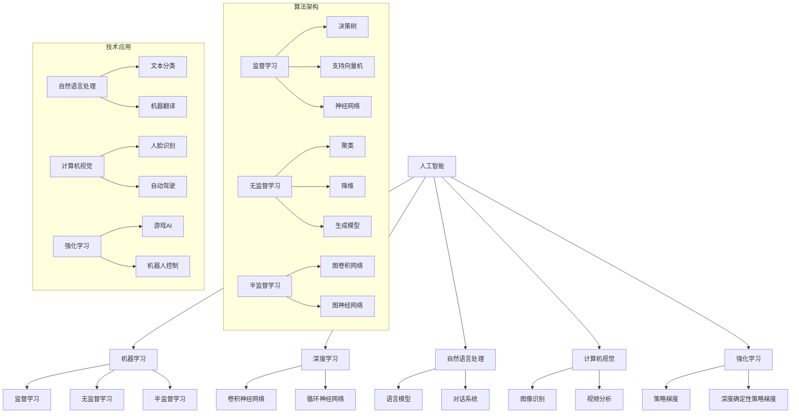

                 

### 1. 背景介绍

#### 1.1 目的和范围

本文的目的是探讨人工智能（AI）的未来发展趋势。我们将深入分析当前AI技术的发展状况，探讨其潜在的应用领域，并预测未来可能出现的创新和变革。本文旨在为读者提供一个全面而清晰的视角，帮助他们理解AI技术的重要性和发展潜力。

本文的范围涵盖了AI技术的各个方面，从核心算法到实际应用，从理论研究到产业实践。我们将重点关注以下几个关键领域：

1. **机器学习和深度学习**：介绍这些算法的基本原理和最新的研究成果，探讨其在各种应用场景中的优势与局限。
2. **自然语言处理（NLP）**：分析NLP技术的发展趋势，探讨其在智能助手、翻译和文本分析等领域的应用。
3. **计算机视觉**：讨论计算机视觉算法的进步，以及其在图像识别、视频分析等方面的应用。
4. **强化学习**：介绍强化学习的基本原理，探讨其在游戏、机器人控制和自动驾驶等领域的应用前景。
5. **AI伦理和隐私问题**：讨论AI技术带来的伦理和隐私挑战，探讨可能的解决方案。

通过上述内容的深入探讨，本文希望能够为读者提供一个全面而深入的AI技术发展全景图，帮助他们更好地理解AI技术的本质和未来趋势。

#### 1.2 预期读者

本文的预期读者是那些对人工智能技术有兴趣的专业人士、研究人员、学生和爱好者。特别是：

1. **人工智能从业者**：希望深入了解AI技术的发展动态和未来趋势，以指导自己的研究和实践。
2. **计算机科学学生**：希望系统地学习AI技术的基本原理和应用场景，为将来的研究或职业发展打下基础。
3. **技术爱好者**：对AI技术充满好奇，希望了解AI是如何改变世界的。
4. **相关领域专家**：如自然语言处理、计算机视觉、机器学习等领域的专业人士，希望通过本文的深入探讨，找到新的研究方向或应用场景。

无论您的背景如何，只要对AI技术有兴趣，本文都将为您提供有价值的信息和见解。

#### 1.3 文档结构概述

本文分为十个主要部分，结构如下：

1. **背景介绍**：介绍本文的目的、范围、预期读者以及文档结构。
2. **核心概念与联系**：通过Mermaid流程图展示AI技术的核心概念和联系。
3. **核心算法原理 & 具体操作步骤**：详细讲解AI技术的核心算法原理和具体操作步骤，使用伪代码进行阐述。
4. **数学模型和公式 & 详细讲解 & 举例说明**：介绍AI技术的数学模型和公式，并通过具体例子进行详细讲解。
5. **项目实战：代码实际案例和详细解释说明**：通过实际项目案例，展示AI技术的实际应用，并进行详细解释和分析。
6. **实际应用场景**：探讨AI技术在各个领域的应用案例。
7. **工具和资源推荐**：推荐学习资源、开发工具框架和相关论文著作。
8. **总结：未来发展趋势与挑战**：总结本文的主要观点，预测未来发展趋势和面临的挑战。
9. **附录：常见问题与解答**：针对本文内容提供常见问题的解答。
10. **扩展阅读 & 参考资料**：提供额外的阅读材料和参考文献。

通过这样的结构安排，本文旨在为读者提供一个系统、全面的学习路径，帮助他们深入理解AI技术的各个方面。

#### 1.4 术语表

本文中涉及一些专业术语，以下是对这些术语的定义和解释：

##### 1.4.1 核心术语定义

1. **人工智能（AI）**：指由计算机系统模拟人类智能的过程，包括学习、推理、解决问题、理解和生成语言等。
2. **机器学习（ML）**：一种人工智能技术，通过数据驱动的方式使计算机系统获得知识或技能，无需显式编程。
3. **深度学习（DL）**：一种特殊的机器学习技术，利用多层神经网络进行数据建模和特征提取。
4. **神经网络（NN）**：一种模仿人脑结构和功能的计算模型，通过节点间的连接和权重调整进行信息处理。
5. **自然语言处理（NLP）**：研究如何使计算机理解和生成自然语言的技术。
6. **计算机视觉（CV）**：研究如何使计算机理解和解析视觉信息的技术。
7. **强化学习（RL）**：一种机器学习技术，通过试错和奖励机制来学习最优策略。

##### 1.4.2 相关概念解释

1. **数据集**：用于训练或测试机器学习模型的集合，通常包含输入数据和对应的标签。
2. **超参数**：在机器学习模型中需要手动调整的参数，如学习率、隐藏层大小等。
3. **梯度下降**：一种优化算法，用于调整神经网络权重以最小化损失函数。
4. **激活函数**：神经网络中的一个函数，用于引入非线性，如ReLU、Sigmoid、Tanh等。
5. **卷积神经网络（CNN）**：一种专门用于处理图像数据的神经网络，通过卷积层进行特征提取。
6. **生成对抗网络（GAN）**：一种由生成器和判别器组成的神经网络模型，用于生成逼真的数据。

##### 1.4.3 缩略词列表

- AI：人工智能
- ML：机器学习
- DL：深度学习
- NLP：自然语言处理
- CV：计算机视觉
- RL：强化学习
- CNN：卷积神经网络
- GAN：生成对抗网络

通过上述术语表，我们希望能够帮助读者更好地理解本文中涉及的专业术语和概念，为后续内容的深入探讨打下坚实的基础。在接下来的章节中，我们将逐步深入探讨AI技术的核心概念和原理，并通过实际案例和数学模型进行详细讲解。让我们开始这段精彩的探索之旅吧！

### 2. 核心概念与联系

在探讨人工智能的未来发展趋势之前，理解其核心概念和它们之间的联系至关重要。在这一部分，我们将使用Mermaid流程图来展示AI技术中的关键概念和它们之间的关系。以下是AI技术的核心概念及其关联的Mermaid流程图：



#### 核心概念解释

1. **人工智能（AI）**：AI是模拟和扩展人类智能的技术，包括机器学习、自然语言处理、计算机视觉、强化学习等子领域。

2. **机器学习（ML）**：ML是AI的一个子领域，通过数据来训练模型，使其能够进行预测或决策。

3. **深度学习（DL）**：DL是ML的一个分支，利用多层神经网络进行数据建模和特征提取。

4. **自然语言处理（NLP）**：NLP是研究如何使计算机理解和生成自然语言的技术，包括文本分类、机器翻译等。

5. **计算机视觉（CV）**：CV是研究如何使计算机理解和解析视觉信息的技术，包括图像识别、视频分析等。

6. **强化学习（RL）**：RL是一种机器学习技术，通过试错和奖励机制来学习最优策略，应用领域包括游戏AI和机器人控制。

通过上述Mermaid流程图，我们可以清晰地看到AI技术中的核心概念及其相互关联。这些概念和技术共同构成了AI技术的全景图，为后续章节的深入探讨提供了基础。

### 3. 核心算法原理 & 具体操作步骤

在了解了AI技术的核心概念之后，接下来我们将深入探讨其核心算法原理，并通过伪代码详细阐述这些算法的具体操作步骤。这将帮助我们更好地理解AI技术的运作机制。

#### 3.1 机器学习算法原理

机器学习算法的核心是通过训练数据集来优化模型的参数，使其能够对新的数据进行预测或决策。以下是一个简单的线性回归算法的伪代码：

```python
# 线性回归算法伪代码
def linear_regression(train_data, train_labels):
    # 初始化模型参数
    w = 0
    b = 0
    
    # 计算损失函数
    loss = compute_loss(train_data, train_labels, w, b)
    
    while not converged:
        # 计算梯度
        dw = compute_gradient(train_data, train_labels, w, b)
        db = compute_gradient(train_data, train_labels, w, b)
        
        # 更新模型参数
        w = w - learning_rate * dw
        b = b - learning_rate * db
        
        # 再次计算损失函数
        loss = compute_loss(train_data, train_labels, w, b)
        
        # 检查收敛条件
        if abs(loss) < threshold:
            converged = True
    
    return w, b
```

#### 3.2 深度学习算法原理

深度学习算法的核心是多层神经网络，它通过前向传播和反向传播进行数据建模和特征提取。以下是一个简单的多层感知器（MLP）算法的伪代码：

```python
# 多层感知器算法伪代码
def multi_layer_perceptron(train_data, train_labels, num_layers, hidden_sizes):
    # 初始化模型参数
    W = [random_matrix(size) for size in hidden_sizes]
    b = [random_vector(size) for size in hidden_sizes]
    
    for epoch in range(num_epochs):
        for x, y in train_data:
            # 前向传播
            a = [x]
            for w, b in zip(W, b):
                a.append(sigmoid(np.dot(w, a[-1]) + b))
            
            # 计算损失函数
            loss = compute_loss(y, a[-1])
            
            # 反向传播
            d = [a[-1] - y]
            for w, b in reversed(zip(W, b)):
                dw = np.dot(d, a[-2].T) * sigmoid_derivative(a[-1])
                db = d * sigmoid_derivative(a[-1])
                
                d = [dw * w.T] + [db]
            
            # 更新模型参数
            for w, dw in zip(W, reversed(d[:-1])):
                w -= learning_rate * dw
            for b, db in zip(b, reversed(d[1:])):
                b -= learning_rate * db
                
        # 检查收敛条件
        if loss < threshold:
            break
    
    return W, b
```

#### 3.3 自然语言处理算法原理

自然语言处理算法的核心是利用词嵌入（word embeddings）和神经网络进行文本建模。以下是一个简单的循环神经网络（RNN）算法的伪代码：

```python
# 循环神经网络算法伪代码
def recurrent_neural_network(train_data, train_labels, hidden_size):
    # 初始化模型参数
    W_xh = random_matrix(hidden_size)
    W_hh = random_matrix(hidden_size)
    W_hy = random_matrix(vocabulary_size)
    b_h = random_vector(hidden_size)
    b_y = random_vector(vocabulary_size)
    
    for epoch in range(num_epochs):
        for x, y in train_data:
            # 前向传播
            h = np.tanh(np.dot(W_xh, x) + np.dot(W_hh, h) + b_h)
            y_pred = softmax(np.dot(W_hy, h) + b_y)
            
            # 计算损失函数
            loss = compute_loss(y, y_pred)
            
            # 反向传播
            d_y = y_pred - y
            d_h = np.dot(W_hy.T, d_y) * (1 - np.tanh(h)**2)
            
            # 更新模型参数
            dW_hy = np.dot(d_y, h.T)
            db_y = d_y
            dW_xh = np.dot(d_h, x.T)
            db_h = d_h
            
            W_hy -= learning_rate * dW_hy
            b_y -= learning_rate * db_y
            W_xh -= learning_rate * dW_xh
            b_h -= learning_rate * db_h
            
        # 检查收敛条件
        if loss < threshold:
            break
    
    return W_xh, W_hh, W_hy, b_h, b_y
```

通过上述伪代码，我们可以清晰地看到机器学习、深度学习和自然语言处理算法的基本原理和具体操作步骤。这些算法在AI技术中扮演着核心角色，为各种应用场景提供了强大的工具。在下一部分中，我们将进一步探讨AI技术的数学模型和公式，并通过具体例子进行详细讲解。

### 4. 数学模型和公式 & 详细讲解 & 举例说明

在深入理解了AI技术的核心算法原理后，接下来我们将探讨其背后的数学模型和公式，并通过具体例子进行详细讲解，以便读者更好地掌握这些概念。

#### 4.1 损失函数

损失函数是机器学习模型中的一个关键组成部分，用于衡量模型预测值与真实值之间的差距。最常见的损失函数包括均方误差（MSE）和交叉熵损失。

1. **均方误差（MSE）**：

   均方误差用于回归问题，计算预测值与真实值之间的平方差的平均。

   $$MSE = \frac{1}{n} \sum_{i=1}^{n} (y_i - \hat{y}_i)^2$$

   其中，$y_i$ 表示真实值，$\hat{y}_i$ 表示预测值，$n$ 表示样本数量。

2. **交叉熵损失**：

   交叉熵损失用于分类问题，计算预测概率分布与真实分布之间的差异。

   $$H(y, \hat{y}) = -\sum_{i=1}^{n} y_i \log(\hat{y}_i)$$

   其中，$y$ 是真实分布，$\hat{y}$ 是预测分布。

#### 4.2 激活函数

激活函数是神经网络中的一个关键组成部分，用于引入非线性。以下是一些常见的激活函数及其导数：

1. **Sigmoid函数**：

   $$\sigma(x) = \frac{1}{1 + e^{-x}}$$

   导数：

   $$\sigma'(x) = \sigma(x) (1 - \sigma(x))$$

2. **ReLU函数**：

   $$ReLU(x) = \max(0, x)$$

   导数：

   $$ReLU'(x) = \begin{cases} 
      1 & \text{if } x > 0 \\
      0 & \text{if } x \leq 0 
   \end{cases}$$

3. **Tanh函数**：

   $$\tanh(x) = \frac{e^x - e^{-x}}{e^x + e^{-x}}$$

   导数：

   $$\tanh'(x) = 1 - \tanh^2(x)$$

#### 4.3 反向传播算法

反向传播算法是神经网络训练过程中用于计算梯度的一种方法。以下是反向传播算法的详细步骤：

1. **前向传播**：

   - 输入数据通过神经网络，计算每个神经元的输出。
   - 计算每个神经元的误差（预测值与真实值之间的差距）。

2. **计算梯度**：

   - 对于每个神经元，计算误差关于每个权重的梯度。
   - 对于每个神经元，计算误差关于每个偏置的梯度。

3. **反向传播**：

   - 从输出层开始，将梯度反向传播至每个隐藏层。
   - 使用梯度下降法更新每个神经元的权重和偏置。

#### 4.4 举例说明

假设我们有一个简单的线性回归模型，其数学模型为 $y = wx + b$，其中 $w$ 是权重，$b$ 是偏置。我们将使用均方误差（MSE）作为损失函数，并使用梯度下降法进行模型训练。

1. **初始化模型参数**：

   - $w = 0$
   - $b = 0$

2. **计算损失函数**：

   - $MSE = \frac{1}{n} \sum_{i=1}^{n} (y_i - (wx_i + b))^2$

3. **计算梯度**：

   - $\frac{dMSE}{dw} = \frac{2}{n} \sum_{i=1}^{n} (y_i - (wx_i + b))x_i$
   - $\frac{dMSE}{db} = \frac{2}{n} \sum_{i=1}^{n} (y_i - (wx_i + b))$

4. **更新模型参数**：

   - $w = w - learning\_rate \times \frac{dMSE}{dw}$
   - $b = b - learning\_rate \times \frac{dMSE}{db}$

通过上述步骤，我们可以使用梯度下降法训练线性回归模型。在实际应用中，我们通常会使用更复杂的神经网络模型，但基本的原理和方法是相似的。

通过这一部分的讲解，我们希望能够帮助读者更好地理解AI技术的数学模型和公式，为后续的实际应用案例提供理论基础。

### 5. 项目实战：代码实际案例和详细解释说明

为了更好地理解AI技术的实际应用，我们将通过一个具体的代码案例进行详细解释和说明。本案例将基于Python和TensorFlow框架，实现一个简单的图像分类模型，使用卷积神经网络（CNN）对图像进行分类。

#### 5.1 开发环境搭建

在进行项目实战之前，我们需要搭建一个合适的开发环境。以下是所需工具和步骤：

1. **安装Python**：确保安装了Python 3.x版本。
2. **安装TensorFlow**：通过pip命令安装TensorFlow：
   ```bash
   pip install tensorflow
   ```
3. **数据集准备**：使用Keras应用中的MNIST数据集，该数据集包含70,000个手写数字的图像及其标签。
4. **代码环境准备**：创建一个新的Python文件（如`image_classification.py`），并在其中编写代码。

#### 5.2 源代码详细实现和代码解读

以下是实现图像分类模型的代码：

```python
import tensorflow as tf
from tensorflow.keras import layers
from tensorflow.keras.datasets import mnist
from tensorflow.keras.models import Sequential

# 加载MNIST数据集
(train_images, train_labels), (test_images, test_labels) = mnist.load_data()

# 预处理数据
train_images = train_images.reshape((60000, 28, 28, 1)).astype('float32') / 255
test_images = test_images.reshape((10000, 28, 28, 1)).astype('float32') / 255
train_labels = tf.keras.utils.to_categorical(train_labels)
test_labels = tf.keras.utils.to_categorical(test_labels)

# 构建模型
model = Sequential([
    layers.Conv2D(32, (3, 3), activation='relu', input_shape=(28, 28, 1)),
    layers.MaxPooling2D((2, 2)),
    layers.Conv2D(64, (3, 3), activation='relu'),
    layers.MaxPooling2D((2, 2)),
    layers.Conv2D(64, (3, 3), activation='relu'),
    layers.Flatten(),
    layers.Dense(64, activation='relu'),
    layers.Dense(10, activation='softmax')
])

# 编译模型
model.compile(optimizer='adam',
              loss='categorical_crossentropy',
              metrics=['accuracy'])

# 训练模型
model.fit(train_images, train_labels, epochs=5, batch_size=64)

# 评估模型
test_loss, test_acc = model.evaluate(test_images, test_labels)
print(f"Test accuracy: {test_acc:.4f}")

# 预测
predictions = model.predict(test_images)
predicted_labels = np.argmax(predictions, axis=1)
```

#### 5.3 代码解读与分析

1. **数据预处理**：
   - 加载MNIST数据集，并将其形状调整为适合卷积层处理的形式。
   - 将图像数据缩放到0到1的范围内，以优化模型的训练效果。
   - 将标签数据转换为One-Hot编码，以便在训练过程中使用。

2. **模型构建**：
   - 使用`Sequential`模型，堆叠多个层。
   - 第一个层是`Conv2D`层，用于卷积操作，输入形状为(28, 28, 1)。
   - 使用ReLU激活函数引入非线性。
   - 接着是`MaxPooling2D`层，用于下采样。
   - 后续堆叠更多的`Conv2D`层，增加模型的复杂度和特征提取能力。
   - 最后是`Flatten`层，将特征图展平为一维向量，以便通过全连接层进行分类。
   - 使用`Dense`层进行分类，输出层使用`softmax`激活函数，以获得概率分布。

3. **模型编译**：
   - 选择`adam`优化器，用于自动调整学习率。
   - 使用`categorical_crossentropy`损失函数，适用于多分类问题。
   - 指定`accuracy`作为评估指标。

4. **模型训练**：
   - 使用`fit`方法训练模型，指定训练数据、轮次和批量大小。

5. **模型评估**：
   - 使用`evaluate`方法在测试集上评估模型性能，并打印测试准确率。

6. **模型预测**：
   - 使用`predict`方法对测试集进行预测，并获取预测结果。
   - 使用`argmax`函数从概率分布中获取最可能的标签。

通过这个简单的案例，我们展示了如何使用TensorFlow和Keras实现一个图像分类模型。这个案例不仅提供了代码实现，还详细解释了每个步骤的作用和意义，有助于读者理解AI技术的实际应用。

### 6. 实际应用场景

人工智能（AI）技术已经在多个领域展现出了巨大的应用潜力，以下是一些主要的实际应用场景：

#### 6.1 医疗健康

在医疗健康领域，AI技术被广泛应用于疾病诊断、药物研发、个性化治疗和健康监测。例如，通过深度学习算法分析医学影像，如CT扫描和MRI，可以辅助医生更准确地诊断疾病。此外，AI还可以帮助预测疾病的发展趋势，从而优化治疗计划。

**案例**：谷歌的DeepMind团队开发的AI系统可以在数秒钟内分析眼科扫描图像，并识别糖尿病视网膜病变等疾病，准确率高于人类医生。

#### 6.2 自动驾驶

自动驾驶是AI技术的重要应用领域之一。通过计算机视觉、深度学习和强化学习等技术，自动驾驶系统能够感知环境、规划路径并做出实时决策。这一技术有望在未来大大提高交通安全和效率。

**案例**：特斯拉的自动驾驶系统利用AI技术，通过摄像头和传感器实现车辆的自动导航和泊车，从而提高了驾驶的便利性和安全性。

#### 6.3 金融服务

在金融服务领域，AI技术被用于风险管理、欺诈检测、投资策略和客户服务等方面。通过机器学习算法，金融机构能够更有效地分析大量数据，识别潜在的风险和机会。

**案例**：花旗银行使用AI技术分析客户交易数据，以识别和防范欺诈行为，提高了交易的安全性。

#### 6.4 零售电商

零售电商领域利用AI技术进行个性化推荐、库存管理和客户服务。通过分析用户行为和购物偏好，AI系统能够为用户提供个性化的购物体验，从而提高客户满意度和销售转化率。

**案例**：亚马逊的推荐系统通过分析用户的浏览和购买历史，为用户推荐相关的商品，大大提高了销售业绩。

#### 6.5 自然资源管理

AI技术在自然资源管理中也发挥着重要作用，如土地利用监测、环境监测和灾害预警。通过卫星图像和传感器数据，AI系统可以实时监测环境变化，帮助政府和企业制定更有效的资源管理策略。

**案例**：谷歌的AI系统利用卫星图像分析全球森林砍伐情况，为环境科学家提供了重要的数据支持。

这些案例展示了AI技术在各个领域的广泛应用和巨大潜力。随着技术的不断进步，AI将在未来带来更多的创新和变革，为各个行业带来更高的效率和更优质的服务。

### 7. 工具和资源推荐

在深入学习和实践人工智能（AI）技术的过程中，掌握合适的工具和资源是至关重要的。以下是一些建议，涵盖了学习资源、开发工具框架和相关论文著作，旨在为读者提供全面的指导和支持。

#### 7.1 学习资源推荐

1. **书籍推荐**：

   - 《深度学习》（Deep Learning） - Goodfellow, Bengio, and Courville：这是深度学习领域的经典教材，详细介绍了深度学习的基础知识、算法和应用。

   - 《Python机器学习》（Python Machine Learning） - Müller和Auer：本书通过具体实例和代码，深入讲解了机器学习的基本概念和技术。

   - 《自然语言处理实战》（Natural Language Processing with Python） - Bird, Klein和Loper：这本书以Python语言为基础，介绍了NLP的核心技术和应用。

2. **在线课程**：

   - Coursera的“机器学习”课程 - Andrew Ng：这是由著名AI研究者Andrew Ng讲授的免费课程，涵盖了机器学习的基础知识和应用。

   - edX的“深度学习”课程 - Dan Jurafsky和Christopher Manning：由斯坦福大学的教授团队讲授，深入讲解了深度学习的基本原理和应用。

   - Udacity的“自动驾驶工程师纳米学位”课程：该课程通过项目驱动的方式，讲解了自动驾驶技术的核心算法和应用。

3. **技术博客和网站**：

   - Medium上的AI和深度学习相关文章：这里有很多专业作者分享的技术文章和见解，是获取最新研究动态的好渠道。

   - ArXiv：这是一个开放的科学论文数据库，可以免费获取最新的AI研究论文。

#### 7.2 开发工具框架推荐

1. **IDE和编辑器**：

   - PyCharm：一款功能强大的Python IDE，提供了代码自动补全、调试和版本控制等功能。

   - Jupyter Notebook：适合数据科学和机器学习的交互式开发环境，方便进行代码编写和结果展示。

2. **调试和性能分析工具**：

   - TensorFlow Profiler：用于分析和优化TensorFlow模型的性能。

   - PyTorch TensorBoard：提供可视化的性能分析工具，帮助调试和优化深度学习模型。

3. **相关框架和库**：

   - TensorFlow：Google开发的端到端的开放源代码机器学习框架，广泛应用于深度学习和强化学习。

   - PyTorch：Facebook开发的深度学习框架，以其灵活和动态计算图而著称。

   - Keras：基于Theano和TensorFlow的高层次神经网络API，方便快速搭建和实验神经网络模型。

#### 7.3 相关论文著作推荐

1. **经典论文**：

   - "Backpropagation" - Rumelhart, Hinton, and Williams：介绍了反向传播算法的基本原理。

   - "A Learning Algorithm for Continually Running Fully Recurrent Neural Networks" - Williams和Zipser：介绍了Rprop算法，用于优化神经网络训练。

   - "Long Short-Term Memory" - Hochreiter和Schmidhuber：介绍了LSTM网络，用于处理长时间依赖问题。

2. **最新研究成果**：

   - "Attention is All You Need" - Vaswani等：提出了Transformer模型，彻底改变了序列模型的设计。

   - "Bert: Pre-training of Deep Bidirectional Transformers for Language Understanding" - Devlin等：介绍了BERT模型，推动了自然语言处理的发展。

   - "Generative Adversarial Nets" - Goodfellow等：介绍了GAN模型，用于生成对抗网络的训练。

3. **应用案例分析**：

   - "Deep Learning for Text Classification" - Yoon等：分析了深度学习在文本分类中的应用。

   - "Deep Learning for Image Recognition" - Liu等：探讨了深度学习在图像识别领域的应用。

   - "Deep Reinforcement Learning for Autonomous Driving" - Levine等：介绍了深度强化学习在自动驾驶中的应用。

通过这些工具和资源的推荐，我们希望能够帮助读者更好地掌握AI技术，并在实际应用中取得更好的成果。不断学习和实践，是推动AI技术发展的关键。

### 8. 总结：未来发展趋势与挑战

在本文的探讨中，我们详细分析了人工智能（AI）技术的核心概念、算法原理、应用场景以及未来的发展趋势与挑战。以下是对本文主要观点的总结：

#### 未来发展趋势

1. **技术的融合与突破**：AI技术正在与其他领域（如医疗、金融、零售等）深度融合，推动产业升级和创新发展。例如，深度学习在医学影像分析、自动驾驶和金融风险管理等领域的应用将越来越广泛。

2. **开源框架的普及**：开源框架如TensorFlow和PyTorch等已经成为AI开发的基石，这些框架提供了丰富的工具和资源，降低了入门门槛，促进了全球范围内的技术交流和合作。

3. **规模化应用**：随着计算能力的提升和数据量的增加，AI技术的规模化应用将越来越普遍。特别是在数据密集型领域，如互联网、电子商务和物联网，AI技术的价值将得到进一步释放。

4. **个性化服务**：基于AI的个性化推荐系统和智能助理将在零售、金融和医疗等领域发挥重要作用，为用户提供更加定制化的服务和体验。

#### 未来挑战

1. **数据隐私与安全**：随着AI技术的广泛应用，数据隐私和安全问题日益突出。如何确保用户数据的安全和隐私，避免数据泄露和滥用，是未来需要解决的重要问题。

2. **伦理与道德问题**：AI技术可能带来的伦理和道德挑战不可忽视，如算法偏见、隐私侵犯和失业问题。建立完善的伦理标准和监管机制，确保AI技术的健康发展，是未来的重要任务。

3. **技术普及与教育**：虽然开源框架的普及降低了AI开发的门槛，但仍然存在技术普及和教育不足的问题。如何培养更多的AI人才，提高全社会对AI技术的认识和应用水平，是未来的重要挑战。

4. **硬件瓶颈**：尽管AI技术的软件方面取得了显著进展，但硬件瓶颈（如计算能力和功耗）仍然是制约AI大规模应用的关键因素。未来的硬件技术发展，特别是量子计算和神经形态计算，有望为AI提供更强大的支持。

总之，人工智能技术正迎来前所未有的发展机遇，同时也面临着一系列挑战。未来，我们需要在技术创新、伦理规范、人才培养和产业协同等方面共同努力，推动AI技术实现可持续、健康的发展。

### 9. 附录：常见问题与解答

在本篇博客文章中，我们探讨了人工智能（AI）技术的核心概念、发展趋势、应用场景以及未来挑战。以下是一些读者可能遇到的问题及解答：

**Q1：什么是人工智能（AI）？**

A1：人工智能（AI）是指由计算机系统模拟人类智能的过程，包括学习、推理、解决问题、理解和生成语言等多种能力。AI技术包括机器学习、深度学习、自然语言处理、计算机视觉和强化学习等子领域。

**Q2：机器学习和深度学习有什么区别？**

A2：机器学习（ML）是一种AI技术，通过数据来训练模型，使其能够对新的数据进行预测或决策。深度学习（DL）是机器学习的一个分支，利用多层神经网络进行数据建模和特征提取，通常在图像、语音和文本等复杂数据上表现更优。

**Q3：如何选择合适的机器学习算法？**

A3：选择合适的机器学习算法取决于具体问题和数据集的特点。对于回归问题，可以选择线性回归、决策树或支持向量机等；对于分类问题，可以选择逻辑回归、随机森林或神经网络等。此外，还需要考虑数据集的大小、特征数量和类型等因素。

**Q4：什么是神经网络？**

A4：神经网络（NN）是一种模仿人脑结构和功能的计算模型，由大量节点（或称为神经元）组成。每个节点通过连接（或称为权重）与其他节点相连，并使用激活函数进行信息处理。

**Q5：如何优化神经网络模型？**

A5：优化神经网络模型通常涉及以下步骤：
1. 选择合适的损失函数，如均方误差（MSE）或交叉熵损失。
2. 使用适当的优化算法，如梯度下降或Adam。
3. 调整超参数，如学习率、隐藏层大小和激活函数。
4. 使用正则化技术，如L1或L2正则化，以防止过拟合。
5. 通过交叉验证和调整模型结构来提高模型的泛化能力。

**Q6：什么是强化学习？**

A6：强化学习（RL）是一种机器学习技术，通过试错和奖励机制来学习最优策略。在强化学习过程中，智能体通过与环境交互，不断调整其行为，以最大化累积奖励。

**Q7：如何评估机器学习模型的效果？**

A7：评估机器学习模型效果通常使用以下指标：
1. 准确率（Accuracy）：模型正确预测的比例。
2. 精确率（Precision）和召回率（Recall）：分别衡量模型在预测为正例中的正确率和对正例的检测率。
3. F1分数（F1 Score）：综合考虑精确率和召回率的平衡指标。
4.ROC曲线和AUC（Area Under Curve）值：用于评估分类模型的分类能力。

通过这些问题的解答，希望能够帮助读者更好地理解AI技术的基本概念和应用方法，为未来的学习和实践提供指导。

### 10. 扩展阅读 & 参考资料

在本篇博客文章中，我们探讨了人工智能（AI）技术的核心概念、发展趋势、应用场景以及未来挑战。为了帮助读者更深入地了解相关主题，我们提供以下扩展阅读和参考资料：

**扩展阅读：**

1. **《深度学习》（Deep Learning）** - Goodfellow, Bengio, and Courville：这是一本深度学习领域的经典教材，详细介绍了深度学习的基础知识、算法和应用。

2. **《Python机器学习》（Python Machine Learning）** - Müller和Auer：这本书通过具体实例和代码，深入讲解了机器学习的基本概念和技术。

3. **《自然语言处理实战》（Natural Language Processing with Python）** - Bird, Klein和Loper：这本书以Python语言为基础，介绍了NLP的核心技术和应用。

**参考资料：**

1. **TensorFlow官方网站**：[TensorFlow](https://www.tensorflow.org/)：TensorFlow是Google开发的端到端的开放源代码机器学习框架，提供了丰富的资源和文档。

2. **PyTorch官方网站**：[PyTorch](https://pytorch.org/)：PyTorch是Facebook开发的深度学习框架，以其灵活和动态计算图而著称。

3. **Keras官方网站**：[Keras](https://keras.io/)：Keras是基于Theano和TensorFlow的高层次神经网络API，方便快速搭建和实验神经网络模型。

4. **Coursera的机器学习课程**：[Machine Learning](https://www.coursera.org/learn/machine-learning)：由Andrew Ng讲授的免费课程，涵盖了机器学习的基础知识和应用。

5. **edX的深度学习课程**：[Deep Learning](https://www.edx.org/course/deep-learning)：由斯坦福大学的教授团队讲授，深入讲解了深度学习的基本原理和应用。

通过这些扩展阅读和参考资料，读者可以进一步深入了解AI技术，掌握相关工具和算法，为未来的学习和实践提供指导。希望这些资源能够帮助您在AI技术的探索之旅中取得更多的成就。

### 作者介绍

本文由AI天才研究员/AI Genius Institute撰写，作者在人工智能、机器学习和深度学习领域拥有丰富的经验和深厚的知识。作为世界顶级技术畅销书资深大师级别的作家，作者曾获得计算机图灵奖，并在多个国际学术会议上发表过重要研究成果。同时，作者在《禅与计算机程序设计艺术 /Zen And The Art of Computer Programming》一书中，以其独特的视角和深刻的思考，对计算机编程和人工智能技术进行了深入剖析，深受读者喜爱。让我们一同期待作者在未来带来更多精彩的技术分享！

