                 


### 1. 背景介绍

#### 1.1 目的和范围

本文旨在探讨人工智能（AI）在未来几年的发展趋势，深入分析其核心概念、技术原理、数学模型及其在各个领域的应用。通过逐步推理和深入剖析，希望能够为读者提供一个清晰、全面的理解，并激发对AI技术的兴趣和探索。

本文的范围包括但不限于以下几个方面：

1. **核心概念与联系**：介绍人工智能的基本概念，如神经网络、机器学习、深度学习等，并通过Mermaid流程图展示其关系和交互。
2. **核心算法原理**：详细讲解人工智能的核心算法，包括神经网络架构、学习算法、优化策略等，并通过伪代码进行说明。
3. **数学模型和公式**：介绍人工智能中的关键数学模型和公式，如损失函数、梯度下降等，并进行详细讲解和举例说明。
4. **项目实战**：通过实际代码案例，展示人工智能技术的具体应用，并进行详细解释和代码解读。
5. **实际应用场景**：分析人工智能在各个领域的应用场景，如自然语言处理、计算机视觉、自动驾驶等。
6. **工具和资源推荐**：推荐学习资源、开发工具和框架，以及相关论文和研究成果。

#### 1.2 预期读者

本文适合以下读者：

1. **人工智能从业者**：对人工智能技术有兴趣，希望了解其发展趋势和应用实践的从业者。
2. **计算机科学学生**：对人工智能和机器学习感兴趣的学生，希望通过本文了解相关技术和原理。
3. **技术爱好者**：对新兴技术感兴趣，希望了解人工智能在未来可能的发展方向的读者。

#### 1.3 文档结构概述

本文结构如下：

1. **背景介绍**：介绍文章的目的、范围、预期读者和文档结构。
2. **核心概念与联系**：介绍人工智能的基本概念，通过Mermaid流程图展示其关系和交互。
3. **核心算法原理**：详细讲解人工智能的核心算法，包括神经网络架构、学习算法、优化策略等。
4. **数学模型和公式**：介绍人工智能中的关键数学模型和公式，如损失函数、梯度下降等。
5. **项目实战**：通过实际代码案例，展示人工智能技术的具体应用。
6. **实际应用场景**：分析人工智能在各个领域的应用场景。
7. **工具和资源推荐**：推荐学习资源、开发工具和框架，以及相关论文和研究成果。
8. **总结：未来发展趋势与挑战**：总结人工智能的未来发展趋势和面临的挑战。
9. **附录：常见问题与解答**：回答读者可能遇到的常见问题。
10. **扩展阅读 & 参考资料**：推荐进一步阅读的材料。

#### 1.4 术语表

为了确保文章的可读性和一致性，本文中使用了以下术语：

##### 1.4.1 核心术语定义

- **人工智能（AI）**：模拟人类智能行为的计算机系统，能够感知、学习、推理和决策。
- **神经网络（NN）**：一种模拟人脑神经网络结构的人工智能模型。
- **机器学习（ML）**：一种让计算机通过数据学习并做出决策或预测的技术。
- **深度学习（DL）**：一种基于神经网络的机器学习技术，能够处理大量数据并自动提取特征。
- **自然语言处理（NLP）**：一种让计算机理解和生成人类语言的技术。
- **计算机视觉（CV）**：一种让计算机理解、识别和解释图像或视频的技术。

##### 1.4.2 相关概念解释

- **神经网络架构**：神经网络的结构和连接方式，包括输入层、隐藏层和输出层。
- **学习算法**：神经网络学习输入数据并调整权重的方法。
- **优化策略**：用于优化神经网络性能的方法，如梯度下降。
- **损失函数**：用于评估神经网络预测结果与实际结果之间差异的函数。
- **梯度下降**：一种优化神经网络权重的算法，通过调整权重来最小化损失函数。

##### 1.4.3 缩略词列表

- **AI**：人工智能（Artificial Intelligence）
- **ML**：机器学习（Machine Learning）
- **DL**：深度学习（Deep Learning）
- **NLP**：自然语言处理（Natural Language Processing）
- **CV**：计算机视觉（Computer Vision）
- **GAN**：生成对抗网络（Generative Adversarial Networks）
- **RNN**：循环神经网络（Recurrent Neural Networks）
- **CNN**：卷积神经网络（Convolutional Neural Networks）

接下来，我们将深入探讨人工智能的核心概念和联系，为后续内容奠定基础。

## 2. 核心概念与联系

在探讨人工智能的发展趋势之前，我们首先需要了解其核心概念和它们之间的联系。本文将通过一个Mermaid流程图来展示这些核心概念及其相互关系。

### Mermaid流程图

```mermaid
graph TD
    A[人工智能] --> B[神经网络]
    A --> C[机器学习]
    A --> D[深度学习]
    B --> E[输入层]
    B --> F[隐藏层]
    B --> G[输出层]
    C --> H[监督学习]
    C --> I[无监督学习]
    D --> J[卷积神经网络]
    D --> K[循环神经网络]
    D --> L[生成对抗网络]
    E --> M[数据预处理]
    F --> N[激活函数]
    G --> O[损失函数]
    H --> P[分类问题]
    I --> Q[聚类问题]
    J --> R[图像识别]
    K --> S[语音识别]
    L --> T[图像生成]
    M --> U[数据清洗]
    N --> V[非线性变换]
    O --> W[梯度下降]
    P --> X[多分类]
    Q --> Y[无监督分类]
    R --> Z[目标检测]
    S --> AA[语音合成]
    T --> BB[艺术创作]
    U --> CC[数据标准化]
    V --> DD[特征提取]
    W --> EE[学习率调整]
    X --> FF[二分类]
    Y --> GG[聚类算法]
    Z --> HH[人脸识别]
    AA --> II[对话系统]
    BB --> JJ[数字艺术]
    CC --> KK[异常检测]
    DD --> LL[特征工程]
    EE --> MM[模型评估]
    FF --> NN[医疗诊断]
    GG --> OO[市场分析]
    HH --> PP[安防监控]
    II --> QQ[智能助手]
    JJ --> RR[虚拟现实]
    KK --> SS[文本分析]
    LL --> TT[推荐系统]
    MM --> UU[在线教育]
    NN --> VV[金融风控]
    OO --> WW[客户关系管理]
    PP --> XX[智能城市]
    QQ --> YY[智能家居]
    RR --> ZZ[游戏开发]
    SS --> AAA[自然语言处理]
    TT --> BBB[内容审核]
    UU --> CCC[在线办公]
    VV --> DDD[信用评分]
    WW --> EEE[健康医疗]
    XX --> FFF[智慧交通]
    YY --> GGG[智能安防]
    ZZ --> HHH[物联网]
    AAA --> III[文本分类]
    BBB --> JJJ[社交媒体分析]
    CCC --> KKK[在线教育平台]
    DDD --> LLL[信用评分系统]
    EEE --> MMM[医疗诊断系统]
    FFF --> NNN[智能交通系统]
    GGG --> OOO[智能监控系统]
    HHH --> PPP[智能家居系统]
    III --> AAA[情感分析]
    JJJ --> BBB[数据挖掘]
    KKK --> CCC[在线课程平台]
    LLL --> DDD[信用评分应用]
    MMM --> EEE[医疗诊断应用]
    NNN --> FFF[交通流量监控]
    OOO --> GGG[智能安防应用]
    PPP --> HHH[智能家电控制]
```



### Mermaid流程图解释

- **人工智能（AI）**：作为整个系统的核心，人工智能是模拟人类智能行为的计算机系统。
- **神经网络（NN）**：神经网络是人工智能的基础，它由输入层、隐藏层和输出层组成，用于处理和转换数据。
- **机器学习（ML）**：机器学习是让计算机通过数据学习并做出决策或预测的技术，分为监督学习和无监督学习。
- **深度学习（DL）**：深度学习是基于神经网络的机器学习技术，能够处理大量数据并自动提取特征，包括卷积神经网络（CNN）、循环神经网络（RNN）和生成对抗网络（GAN）。
- **自然语言处理（NLP）**：自然语言处理是一种让计算机理解和生成人类语言的技术，广泛应用于文本分类、情感分析和数据挖掘。
- **计算机视觉（CV）**：计算机视觉是一种让计算机理解、识别和解释图像或视频的技术，包括图像识别、目标检测和人脸识别等应用。

通过这个Mermaid流程图，我们可以清晰地看到人工智能的核心概念及其相互关系，为后续内容的学习和理解打下基础。

### 2.1 核心概念解释

在本节中，我们将进一步解释人工智能的核心概念，包括神经网络、机器学习和深度学习，并探讨它们之间的相互关系。

#### 神经网络（Neural Networks）

神经网络是一种模仿生物神经网络结构的人工智能模型。它由大量的神经元（节点）组成，每个神经元都与相邻的神经元通过连接（边）进行通信。神经元的激活状态通过这些连接传递，从而实现数据的处理和转换。神经网络的基本组件包括：

1. **输入层（Input Layer）**：接收外部输入数据。
2. **隐藏层（Hidden Layers）**：对输入数据进行处理和转换。
3. **输出层（Output Layer）**：生成最终输出结果。

神经网络通过学习输入数据与输出数据之间的映射关系，来模拟人类智能行为。这种学习过程通常涉及到神经元的权重调整，以最小化输出误差。

#### 机器学习（Machine Learning）

机器学习是一种让计算机通过数据学习并做出决策或预测的技术。它分为两种主要类型：监督学习和无监督学习。

1. **监督学习（Supervised Learning）**：在监督学习过程中，计算机通过已标记的数据集学习，并尝试预测未知数据的标签。常见的监督学习算法包括决策树、支持向量机和神经网络。

2. **无监督学习（Unsupervised Learning）**：在无监督学习过程中，计算机没有已标记的数据集，需要自行发现数据中的模式和结构。常见的无监督学习算法包括聚类、降维和关联规则学习。

机器学习的关键在于通过数据来训练模型，使模型能够自动学习和改进，从而实现预测或分类。

#### 深度学习（Deep Learning）

深度学习是一种基于神经网络的机器学习技术，能够处理大量数据并自动提取特征。与传统的神经网络相比，深度学习具有更多的隐藏层，因此称为“深度”。深度学习的关键特点包括：

1. **自动特征提取（Automatic Feature Extraction）**：深度学习模型能够在学习过程中自动提取数据中的高阶特征，无需人工干预。
2. **端到端学习（End-to-End Learning）**：深度学习模型能够直接从原始数据学习到输出结果，无需中间步骤。
3. **大规模数据（Big Data）**：深度学习通常需要大量的数据进行训练，以实现更好的性能。

深度学习在图像识别、语音识别、自然语言处理等领域取得了显著成果，已经成为人工智能领域的重要研究方向。

#### 相互关系

神经网络是机器学习和深度学习的基础。机器学习通过学习输入数据与输出数据之间的映射关系，利用神经网络来实现。而深度学习则是机器学习的一个分支，通过增加隐藏层的数量，实现了更复杂的特征提取和端到端学习。

总之，神经网络、机器学习和深度学习共同构成了人工智能的核心概念，它们相互关联、相互促进，共同推动了人工智能技术的发展。通过理解这些核心概念，我们可以更好地把握人工智能的未来发展趋势和应用场景。

### 2.2 Mermaid流程图示例

下面我们将通过一个具体的Mermaid流程图示例，进一步展示人工智能的核心概念及其相互关系。


通过这个流程图，我们可以清晰地看到人工智能的核心概念及其相互关系，为后续内容的深入讨论提供了基础。

## 3. 核心算法原理 & 具体操作步骤

在深入了解人工智能的核心概念后，我们接下来将探讨其核心算法原理和具体操作步骤。本文将重点关注神经网络、机器学习和深度学习中的关键算法，并通过伪代码进行详细阐述。

### 3.1 神经网络算法

神经网络是人工智能的基础，其核心在于通过学习输入数据与输出数据之间的映射关系，来实现数据转换和预测。下面，我们通过伪代码来详细阐述神经网络算法的原理和操作步骤。

```plaintext
算法名称：神经网络训练

输入：训练数据集 X，输出标签 Y，学习率 alpha，迭代次数 epochs
输出：训练好的神经网络模型 W，b

步骤：

1. 初始化权重 W 和偏置 b，设置随机初值。
2. 对于每个epoch：
   a. 遍历训练数据集：
      i. 计算输入层的输入值 X。
      ii. 通过神经网络模型计算输出值 Y_pred。
      iii. 计算损失函数 L。
      iv. 计算梯度 ΔW 和 Δb。
      v. 更新权重 W 和偏置 b。
   b. 计算当前epoch的平均损失值。
3. 返回训练好的神经网络模型 W 和 b。
```

### 3.2 机器学习算法

机器学习是让计算机通过数据学习并做出决策或预测的技术。常见的机器学习算法包括监督学习和无监督学习。下面，我们通过伪代码来分别详细阐述这两种算法的原理和操作步骤。

#### 监督学习算法

```plaintext
算法名称：监督学习训练

输入：训练数据集 X，输出标签 Y，学习率 alpha，迭代次数 epochs
输出：训练好的机器学习模型 M

步骤：

1. 选择合适的机器学习算法，如决策树、支持向量机或神经网络。
2. 初始化模型参数。
3. 对于每个epoch：
   a. 遍历训练数据集：
      i. 使用训练数据更新模型参数。
      ii. 计算损失函数 L。
   b. 计算当前epoch的平均损失值。
4. 返回训练好的机器学习模型 M。
```

#### 无监督学习算法

```plaintext
算法名称：无监督学习训练

输入：训练数据集 X，迭代次数 epochs
输出：训练好的无监督学习模型 M

步骤：

1. 选择合适的无监督学习算法，如聚类、降维或关联规则学习。
2. 初始化模型参数。
3. 对于每个epoch：
   a. 遍历训练数据集：
      i. 使用训练数据更新模型参数。
      ii. 计算损失函数 L。
   b. 计算当前epoch的平均损失值。
4. 返回训练好的无监督学习模型 M。
```

### 3.3 深度学习算法

深度学习是基于神经网络的机器学习技术，其核心在于通过多层神经网络来提取数据中的高阶特征。下面，我们通过伪代码来详细阐述深度学习算法的原理和操作步骤。

```plaintext
算法名称：深度学习训练

输入：训练数据集 X，输出标签 Y，学习率 alpha，迭代次数 epochs，神经网络架构（层数、神经元数量、激活函数等）
输出：训练好的深度学习模型 D

步骤：

1. 初始化权重 W 和偏置 b，设置随机初值。
2. 对于每个epoch：
   a. 遍历训练数据集：
      i. 计算输入层的输入值 X。
      ii. 通过神经网络模型计算输出值 Y_pred。
      iii. 计算损失函数 L。
      iv. 计算梯度 ΔW 和 Δb。
      v. 更新权重 W 和偏置 b。
   b. 计算当前epoch的平均损失值。
3. 返回训练好的深度学习模型 D。
```

通过上述伪代码，我们可以清晰地看到神经网络、机器学习和深度学习算法的原理和操作步骤。在实际应用中，这些算法需要根据具体问题进行适当的调整和优化，以达到最佳效果。

### 3.4 伪代码示例

为了更好地理解核心算法原理，下面我们通过具体的伪代码示例来说明神经网络训练的过程。

```plaintext
算法名称：神经网络训练（具体示例）

输入：训练数据集 X，输出标签 Y，学习率 alpha，迭代次数 epochs，神经网络架构（层数、神经元数量、激活函数等）
输出：训练好的神经网络模型 W，b

步骤：

1. 初始化权重 W 和偏置 b，设置随机初值。
2. 对于每个epoch：
   a. 遍历训练数据集：
      i. 对于每个样本：
          1. 计算输入层的输入值 X。
          2. 通过神经网络模型计算输出值 Y_pred。
          3. 计算损失函数 L。
          4. 计算梯度 ΔW 和 Δb。
          5. 更新权重 W 和偏置 b。
   b. 计算当前epoch的平均损失值。
3. 返回训练好的神经网络模型 W 和 b。
```

通过这个具体的伪代码示例，我们可以看到神经网络训练的基本流程，包括权重和偏置的初始化、前向传播、反向传播和权重更新。这个示例为后续的算法实现和实际应用提供了参考。

## 4. 数学模型和公式 & 详细讲解 & 举例说明

在了解了人工智能的核心算法原理后，我们将进一步探讨其背后的数学模型和公式，并通过详细讲解和举例说明来加深理解。

### 4.1 损失函数

损失函数是评估神经网络预测结果与实际结果之间差异的关键工具。常见的损失函数包括均方误差（MSE）和交叉熵（Cross-Entropy）。

#### 均方误差（MSE）

均方误差是一种常用的回归损失函数，用于评估预测值与实际值之间的平均误差。

$$
MSE = \frac{1}{n} \sum_{i=1}^{n} (y_i - \hat{y}_i)^2
$$

其中，$y_i$表示第$i$个样本的实际值，$\hat{y}_i$表示第$i$个样本的预测值，$n$表示样本总数。

举例说明：

假设我们有一个包含10个样本的回归问题，实际值和预测值如下：

$$
y = [2, 3, 4, 5, 6, 7, 8, 9, 10, 11]
$$

$$
\hat{y} = [2.5, 3.5, 4.5, 5.5, 6.5, 7.5, 8.5, 9.5, 10.5, 11.5]
$$

使用均方误差计算损失：

$$
MSE = \frac{1}{10} \sum_{i=1}^{10} (y_i - \hat{y}_i)^2 = \frac{1}{10} \sum_{i=1}^{10} (2 - 2.5)^2 + (3 - 3.5)^2 + \ldots + (11 - 11.5)^2
$$

$$
MSE = \frac{1}{10} \sum_{i=1}^{10} 0.25 + 0.25 + \ldots + 0.25 = 0.25
$$

因此，均方误差为0.25。

#### 交叉熵（Cross-Entropy）

交叉熵是一种常用的分类损失函数，用于评估预测概率分布与实际概率分布之间的差异。

$$
Cross-Entropy = -\sum_{i=1}^{n} y_i \log(\hat{y}_i)
$$

其中，$y_i$表示第$i$个样本的实际标签（0或1），$\hat{y}_i$表示第$i$个样本的预测概率。

举例说明：

假设我们有一个包含3个样本的二分类问题，实际值和预测概率如下：

$$
y = [0, 1, 0]
$$

$$
\hat{y} = [0.1, 0.9, 0.2]
$$

使用交叉熵计算损失：

$$
Cross-Entropy = -[0 \cdot \log(0.1) + 1 \cdot \log(0.9) + 0 \cdot \log(0.2)]
$$

$$
Cross-Entropy = -[0 + 0.1054 + 0] = 0.1054
$$

因此，交叉熵为0.1054。

### 4.2 梯度下降（Gradient Descent）

梯度下降是一种优化神经网络权重的方法，通过计算损失函数的梯度并更新权重，以最小化损失。

#### 梯度下降算法

$$
w_{t+1} = w_t - \alpha \cdot \nabla_w J(w)
$$

其中，$w_t$表示第$t$次迭代的权重，$\alpha$表示学习率，$\nabla_w J(w)$表示损失函数$J(w)$关于权重$w$的梯度。

#### 学习率调整

学习率的选择对梯度下降的收敛速度和稳定性有很大影响。常见的调整方法包括固定学习率、自适应学习率和动态学习率。

- **固定学习率**：在训练过程中保持学习率不变。
- **自适应学习率**：根据训练过程动态调整学习率，如Adagrad、RMSprop和Adam等。
- **动态学习率**：根据迭代次数或训练数据动态调整学习率，如学习率衰减。

### 4.3 示例分析

假设我们有一个包含5个样本的二分类问题，实际值和预测概率如下：

$$
y = [0, 1, 1, 0, 1]
$$

$$
\hat{y} = [0.2, 0.8, 0.9, 0.3, 0.7]
$$

使用交叉熵损失函数和梯度下降算法进行训练。

#### 初始化权重

$$
w_0 = [0, 0, 0, 0, 0]
$$

#### 迭代1

计算预测概率：

$$
\hat{y}_1 = [0.2, 0.8, 0.9, 0.3, 0.7]
$$

计算交叉熵损失：

$$
J(w_0) = -[0 \cdot \log(0.2) + 1 \cdot \log(0.8) + 1 \cdot \log(0.9) + 0 \cdot \log(0.3) + 1 \cdot \log(0.7)] = 0.5054
$$

计算梯度：

$$
\nabla_w J(w_0) = [-\log(0.2), \log(0.8), \log(0.9), -\log(0.3), \log(0.7)]
$$

更新权重：

$$
w_1 = w_0 - \alpha \cdot \nabla_w J(w_0) = [0, 0, 0, 0, 0] - 0.1 \cdot [-\log(0.2), \log(0.8), \log(0.9), -\log(0.3), \log(0.7)] = [0.1, -0.1, 0.1, 0.1, 0.1]
$$

#### 迭代2

计算预测概率：

$$
\hat{y}_2 = [0.22, 0.77, 0.99, 0.29, 0.72]
$$

计算交叉熵损失：

$$
J(w_1) = -[0 \cdot \log(0.22) + 1 \cdot \log(0.77) + 1 \cdot \log(0.99) + 0 \cdot \log(0.29) + 1 \cdot \log(0.72)] = 0.4789
$$

计算梯度：

$$
\nabla_w J(w_1) = [-\log(0.22), \log(0.77), \log(0.99), -\log(0.29), \log(0.72)]
$$

更新权重：

$$
w_2 = w_1 - \alpha \cdot \nabla_w J(w_1) = [0.1, -0.1, 0.1, 0.1, 0.1] - 0.1 \cdot [-\log(0.22), \log(0.77), \log(0.99), -\log(0.29), \log(0.72)] = [0.12, -0.12, 0.12, 0.12, 0.12]
$$

通过以上迭代过程，我们可以看到权重逐渐接近最优值，从而实现模型的优化。

通过详细讲解和举例说明，我们了解了损失函数、梯度下降算法及其在神经网络训练中的应用。这些数学模型和公式是人工智能的核心组成部分，对于理解和应用人工智能技术具有重要意义。

### 4.4 数学模型和公式的进一步探讨

在了解了基本的损失函数和梯度下降算法后，我们将进一步探讨人工智能中的其他关键数学模型和公式，并详细说明其应用。

#### 4.4.1 激活函数（Activation Function）

激活函数是神经网络中的一个重要组成部分，用于引入非线性特性。常见的激活函数包括sigmoid、ReLU和tanh等。

- **sigmoid函数**：

$$
\sigma(x) = \frac{1}{1 + e^{-x}}
$$

sigmoid函数将输入值映射到(0,1)区间，具有平滑的S型曲线。它常用于二分类问题。

- **ReLU函数**：

$$
\text{ReLU}(x) = \max(0, x)
$$

ReLU函数在输入为正时保持不变，输入为负时设置为0。它具有简单的计算方式和较好的梯度性质，广泛应用于深度学习。

- **tanh函数**：

$$
\text{tanh}(x) = \frac{e^x - e^{-x}}{e^x + e^{-x}}
$$

tanh函数将输入值映射到(-1,1)区间，具有S型曲线。它常用于处理输入值在[-1,1]范围内的问题。

#### 4.4.2 反向传播算法（Backpropagation）

反向传播算法是一种用于训练神经网络的优化算法，通过计算损失函数关于网络参数的梯度，并使用梯度下降方法更新参数。

反向传播算法的基本步骤包括：

1. **前向传播**：计算输入值通过神经网络的输出。
2. **计算损失**：计算实际输出与预测输出之间的损失。
3. **后向传播**：计算损失函数关于网络参数的梯度。
4. **更新参数**：使用梯度下降方法更新网络参数。

具体步骤如下：

1. **前向传播**：

   $$z^{(l)} = \sigma(W^{(l)} \cdot a^{(l-1)} + b^{(l)})$$

   其中，$a^{(l-1)}$表示前一层输入，$W^{(l)}$和$b^{(l)}$分别表示第$l$层的权重和偏置，$\sigma$表示激活函数。

2. **计算损失**：

   $$L = \frac{1}{2} \sum_{i=1}^{m} (y_i - \hat{y}_i)^2$$

   其中，$y_i$表示第$i$个样本的实际值，$\hat{y}_i$表示第$i$个样本的预测值。

3. **后向传播**：

   $$\delta^{(l)} = (1 - \sigma'(z^{(l)})) \cdot \delta^{(l+1)} \cdot W^{(l+1)}$$

   其中，$\delta^{(l)}$表示第$l$层的误差，$\sigma'$表示激活函数的导数。

4. **更新参数**：

   $$W^{(l)} \leftarrow W^{(l)} - \alpha \cdot \frac{\partial L}{\partial W^{(l)}}$$

   $$b^{(l)} \leftarrow b^{(l)} - \alpha \cdot \frac{\partial L}{\partial b^{(l)}}$$

#### 4.4.3 卷积神经网络（Convolutional Neural Networks，CNN）

卷积神经网络是一种专门用于图像识别和处理的深度学习模型，其核心组件是卷积层和池化层。

- **卷积层**：通过卷积运算提取图像特征。

$$
h^{(l)} = \sigma(\sum_{k=1}^{K} w_k \cdot a^{(l-1)} + b)
$$

其中，$a^{(l-1)}$表示前一层输入，$w_k$和$b$分别表示卷积核和偏置，$K$表示卷积核的数量。

- **池化层**：通过最大池化或平均池化降低图像分辨率，减少参数数量。

$$
p_{ij} = \max_{k,l} (a_{ik} + \ldots + a_{i,k+l})
$$

或

$$
p_{ij} = \frac{1}{(2 \cdot 2)} \sum_{k,l} a_{ik}
$$

#### 4.4.4 循环神经网络（Recurrent Neural Networks，RNN）

循环神经网络是一种用于处理序列数据的神经网络，其核心组件是隐藏状态和循环连接。

- **隐藏状态**：

$$
h_t = \sigma(W_h \cdot [h_{t-1}, x_t] + b_h)
$$

其中，$x_t$表示输入序列的第$t$个元素，$h_{t-1}$表示前一个时间步的隐藏状态，$W_h$和$b_h$分别表示权重和偏置。

- **输出**：

$$
y_t = \sigma(W_o \cdot h_t + b_o)
$$

其中，$W_o$和$b_o$分别表示权重和偏置。

通过进一步探讨这些数学模型和公式，我们可以更深入地理解人工智能的核心技术和原理。这些知识对于研发和应用人工智能技术具有重要意义。

### 4.5 数学模型和公式的应用示例

为了更好地理解数学模型和公式的应用，我们通过一个实际示例来展示其在神经网络训练和优化中的应用。

#### 示例：使用梯度下降算法训练一个简单的神经网络

假设我们有一个包含两个输入变量和一个输出变量的二分类问题，输入数据为$(x_1, x_2)$，输出数据为$y$，其中$y \in \{0, 1\}$。我们的目标是使用梯度下降算法训练一个简单的神经网络，使其能够对输入数据进行分类。

#### 4.5.1 初始化参数

首先，我们需要初始化神经网络的参数，包括权重$W$和偏置$b$。这里我们假设网络结构为单层神经网络，包含一个输入层、一个隐藏层和一个输出层，每个层分别有1个神经元。

```plaintext
W = [随机值, 随机值]
b = 随机值
```

#### 4.5.2 定义损失函数

我们使用交叉熵作为损失函数，评估神经网络预测结果与实际结果之间的差异。

$$
L(y, \hat{y}) = -[y \log(\hat{y}) + (1 - y) \log(1 - \hat{y})]
```

其中，$\hat{y}$表示神经网络的预测概率。

#### 4.5.3 计算梯度

使用反向传播算法计算损失函数关于权重和偏置的梯度。

$$
\nabla_L W = \frac{\partial L}{\partial W} = \frac{y - \hat{y}}{x}
\nabla_L b = \frac{\partial L}{\partial b} = \frac{y - \hat{y}}
```

其中，$x$表示输入数据。

#### 4.5.4 更新参数

使用梯度下降算法更新权重和偏置，以最小化损失函数。

$$
W = W - \alpha \cdot \nabla_L W
b = b - \alpha \cdot \nabla_L b
```

其中，$\alpha$表示学习率。

#### 4.5.5 训练神经网络

我们使用一个训练数据集进行迭代训练，每个迭代步骤中，计算损失函数值，更新权重和偏置，直至达到收敛条件。

```plaintext
for epoch in 1 to maximum_epochs:
    for each sample in training_data:
        # 前向传播
        z = W \cdot x + b
        a = sigmoid(z)

        # 计算预测概率
        \hat{y} = 1 / (1 + e^{-a})

        # 计算损失函数
        L = -[y \log(\hat{y}) + (1 - y) \log(1 - \hat{y})]

        # 反向传播
        \delta = (a - y)

        # 更新参数
        W = W - \alpha \cdot \delta \cdot x
        b = b - \alpha \cdot \delta
```

通过以上步骤，我们可以训练一个简单的神经网络，使其能够对输入数据进行分类。这个示例展示了数学模型和公式的具体应用，帮助我们更好地理解人工智能的核心技术和原理。

### 4.6 数学模型和公式的总结

通过对数学模型和公式的详细讲解和示例分析，我们可以看到这些工具在人工智能领域的重要性。以下是本文中提到的关键数学模型和公式的总结：

- **损失函数**：均方误差（MSE）和交叉熵（Cross-Entropy），用于评估神经网络预测结果与实际结果之间的差异。
- **激活函数**：sigmoid、ReLU和tanh，用于引入神经网络中的非线性特性。
- **梯度下降算法**：用于优化神经网络权重，通过计算损失函数的梯度并更新参数。
- **反向传播算法**：用于计算损失函数关于网络参数的梯度，是梯度下降算法的基础。
- **卷积神经网络（CNN）**：卷积层和池化层，用于提取图像特征。
- **循环神经网络（RNN）**：隐藏状态和循环连接，用于处理序列数据。

这些数学模型和公式是人工智能技术的核心组成部分，对于理解和应用人工智能技术具有重要意义。通过进一步学习和实践，我们可以深入掌握这些知识，为未来的研究和应用打下坚实基础。

## 5. 项目实战：代码实际案例和详细解释说明

在了解了人工智能的核心概念、算法原理和数学模型后，我们将通过一个实际项目实战来展示如何将理论应用于实践。本文将介绍一个简单的图像识别项目，并详细解释其代码实现过程。

### 5.1 开发环境搭建

在进行图像识别项目之前，我们需要搭建合适的开发环境。以下是所需的工具和库：

- **Python**：用于编写代码。
- **NumPy**：用于数值计算。
- **Pandas**：用于数据处理。
- **Matplotlib**：用于可视化。
- **Scikit-learn**：用于机器学习算法。

安装这些库可以使用以下命令：

```bash
pip install numpy pandas matplotlib scikit-learn
```

### 5.2 源代码详细实现和代码解读

下面是一个简单的图像识别项目的Python代码实现，我们将通过逐步分析代码，详细解释其功能和实现过程。

```python
import numpy as np
import matplotlib.pyplot as plt
from sklearn.datasets import load_iris
from sklearn.model_selection import train_test_split
from sklearn.neural_network import MLPClassifier
from sklearn.metrics import accuracy_score

# 5.2.1 加载和预处理数据
iris = load_iris()
X = iris.data
y = iris.target

# 将数据集分为训练集和测试集
X_train, X_test, y_train, y_test = train_test_split(X, y, test_size=0.2, random_state=42)

# 5.2.2 创建和训练神经网络模型
mlp = MLPClassifier(hidden_layer_sizes=(100,), max_iter=1000)
mlp.fit(X_train, y_train)

# 5.2.3 预测和评估模型
y_pred = mlp.predict(X_test)
accuracy = accuracy_score(y_test, y_pred)
print(f"Model accuracy: {accuracy:.2f}")

# 5.2.4 可视化决策边界
x_min, x_max = X[:, 0].min() - 1, X[:, 0].max() + 1
y_min, y_max = X[:, 1].min() - 1, X[:, 1].max() + 1
xx, yy = np.meshgrid(np.arange(x_min, x_max, 0.1),
                     np.arange(y_min, y_max, 0.1))
Z = mlp.predict(np.c_[xx.ravel(), yy.ravel()])
Z = Z.reshape(xx.shape)
plt.contourf(xx, yy, Z, alpha=0.8)
plt.scatter(X[:, 0], X[:, 1], c=y, edgecolors='k')
plt.xlabel('Feature 1')
plt.ylabel('Feature 2')
plt.title('Neural Network Decision Boundary')
plt.show()
```

### 5.3 代码解读与分析

下面我们逐行分析上述代码，解释其功能和实现细节。

```python
import numpy as np
import matplotlib.pyplot as plt
from sklearn.datasets import load_iris
from sklearn.model_selection import train_test_split
from sklearn.neural_network import MLPClassifier
from sklearn.metrics import accuracy_score
```

这行代码导入所需的库，包括NumPy、Matplotlib、Scikit-learn中的iris数据集、模型选择和评价指标。

```python
iris = load_iris()
X = iris.data
y = iris.target
```

这行代码加载Iris数据集，其中`X`表示输入特征，`y`表示标签。

```python
X_train, X_test, y_train, y_test = train_test_split(X, y, test_size=0.2, random_state=42)
```

这行代码将数据集分为训练集和测试集，其中`test_size`参数指定测试集的比例，`random_state`参数用于随机种子，确保结果可重复。

```python
mlp = MLPClassifier(hidden_layer_sizes=(100,), max_iter=1000)
mlp.fit(X_train, y_train)
```

这行代码创建一个多层感知器（MLP）分类器，并设置隐藏层大小和最大迭代次数。然后使用训练集数据训练模型。

```python
y_pred = mlp.predict(X_test)
accuracy = accuracy_score(y_test, y_pred)
print(f"Model accuracy: {accuracy:.2f}")
```

这行代码使用测试集数据对模型进行预测，并计算准确率，最后输出模型的准确率。

```python
x_min, x_max = X[:, 0].min() - 1, X[:, 0].max() + 1
y_min, y_max = X[:, 1].min() - 1, X[:, 1].max() + 1
xx, yy = np.meshgrid(np.arange(x_min, x_max, 0.1),
                     np.arange(y_min, y_max, 0.1))
Z = mlp.predict(np.c_[xx.ravel(), yy.ravel()])
Z = Z.reshape(xx.shape)
plt.contourf(xx, yy, Z, alpha=0.8)
plt.scatter(X[:, 0], X[:, 1], c=y, edgecolors='k')
plt.xlabel('Feature 1')
plt.ylabel('Feature 2')
plt.title('Neural Network Decision Boundary')
plt.show()
```

这行代码用于可视化模型的决策边界。首先定义坐标范围，然后创建网格，使用模型对网格上的每个点进行预测，生成决策边界。最后，绘制决策边界和实际数据点。

### 5.4 实际应用中的优化和调整

在实际应用中，我们可以根据具体问题对模型进行调整和优化，以提高性能。以下是一些常见的优化方法：

- **调整隐藏层大小**：通过调整隐藏层的大小，可以影响模型的复杂度和性能。
- **选择不同的激活函数**：如ReLU、tanh等，不同激活函数对模型的性能有较大影响。
- **调整学习率**：通过调整学习率，可以影响模型的收敛速度和稳定性。
- **正则化**：如L1、L2正则化，可以防止模型过拟合。

通过以上方法，我们可以更好地优化和调整模型，以适应不同的实际应用场景。

### 5.5 代码解读与分析（续）

在之前的代码解读中，我们已经详细分析了每个步骤的功能。这里我们将进一步探讨模型的训练过程和预测机制。

#### 5.5.1 模型训练过程

在`mlp.fit(X_train, y_train)`这行代码中，`MLPClassifier`类是Scikit-learn中提供的多层感知器（MLP）分类器。它的主要参数包括：

- `hidden_layer_sizes`：指定隐藏层的大小。例如，`(100,)`表示隐藏层有100个神经元。
- `max_iter`：指定最大迭代次数，用于防止模型训练时间过长。

在模型训练过程中，MLP分类器会通过梯度下降算法自动调整权重和偏置，以最小化损失函数。训练过程包括以下步骤：

1. **前向传播**：输入数据通过网络，经过每个神经元的激活函数，最终生成输出。
2. **计算损失**：使用交叉熵或均方误差等损失函数，计算输出与实际标签之间的差异。
3. **反向传播**：计算损失关于网络参数的梯度，并更新权重和偏置。
4. **迭代更新**：重复上述步骤，直到达到最大迭代次数或损失函数收敛。

#### 5.5.2 模型预测机制

在`y_pred = mlp.predict(X_test)`这行代码中，`predict`方法用于对测试数据进行分类预测。模型在预测过程中，会使用训练好的权重和偏置，对输入数据进行前向传播，最终得到输出概率。

通常，我们会选择概率最大的类别作为最终预测结果。例如，对于二分类问题，如果预测概率大于0.5，则预测为正类；否则，预测为负类。

```python
y_pred = mlp.predict(X_test)
```

这行代码使用训练好的模型对测试数据进行预测，生成预测标签`y_pred`。

```python
accuracy = accuracy_score(y_test, y_pred)
print(f"Model accuracy: {accuracy:.2f}")
```

这行代码计算预测准确率，即预测正确的样本占总样本的比例。准确率是评估模型性能的重要指标。

#### 5.5.3 决策边界可视化

在可视化部分，我们使用以下代码生成决策边界：

```python
x_min, x_max = X[:, 0].min() - 1, X[:, 0].max() + 1
y_min, y_max = X[:, 1].min() - 1, X[:, 1].max() + 1
xx, yy = np.meshgrid(np.arange(x_min, x_max, 0.1),
                     np.arange(y_min, y_max, 0.1))
Z = mlp.predict(np.c_[xx.ravel(), yy.ravel()])
Z = Z.reshape(xx.shape)
plt.contourf(xx, yy, Z, alpha=0.8)
plt.scatter(X[:, 0], X[:, 1], c=y, edgecolors='k')
plt.xlabel('Feature 1')
plt.ylabel('Feature 2')
plt.title('Neural Network Decision Boundary')
plt.show()
```

这部分代码用于生成模型在特征空间中的决策边界。具体步骤如下：

1. **定义坐标范围**：确定特征空间的坐标范围，以便生成网格。
2. **创建网格**：使用`np.meshgrid`函数创建一个包含坐标点的新网格。
3. **预测网格点**：使用训练好的模型对网格上的每个点进行预测，生成决策边界。
4. **绘制决策边界**：使用`plt.contourf`函数绘制决策边界，并添加标签和标题。
5. **绘制实际数据点**：使用`plt.scatter`函数绘制实际数据点，并添加边框。

通过可视化决策边界，我们可以直观地了解模型的分类能力和特征空间结构。

### 5.6 代码解读与分析（总结）

通过对上述代码的详细解读，我们可以看到：

- **数据预处理**：加载和预处理数据是模型训练的基础，包括数据分割、标准化等。
- **模型训练**：使用多层感知器（MLP）分类器进行训练，通过梯度下降算法调整权重和偏置。
- **模型预测**：使用训练好的模型对测试数据进行预测，并计算准确率。
- **决策边界可视化**：通过生成和绘制决策边界，直观地了解模型的分类能力和特征空间结构。

这个简单的图像识别项目展示了如何将理论应用于实际，并提供了代码实现和解读。在实际应用中，我们可以根据具体问题进行模型调整和优化，以提高性能。

### 5.7 代码实践与拓展

为了更好地理解和掌握图像识别项目的代码实现，我们可以进行以下实践和拓展：

- **修改隐藏层大小**：尝试调整隐藏层的大小，观察对模型性能和决策边界的影响。
- **更换激活函数**：更换不同的激活函数（如ReLU、tanh等），比较对模型性能的影响。
- **调整学习率**：调整学习率，观察对模型收敛速度和稳定性的影响。
- **增加数据集**：使用更大的数据集进行训练，比较模型性能和泛化能力。
- **多分类问题**：将二分类问题扩展为多分类问题，观察模型的适应性。

通过这些实践和拓展，我们可以更深入地了解图像识别项目的实现原理，并掌握相关技术。

### 5.8 总结

本节通过一个简单的图像识别项目，详细讲解了代码实现、模型训练和预测过程。通过实际案例，我们了解了如何将理论应用于实践，并掌握了相关技术。这些实践经验对于理解和应用人工智能技术具有重要意义。

### 5.9 附录：常见问题与解答

在图像识别项目的实践过程中，可能会遇到一些常见问题。以下是一些常见问题及其解答：

#### 问题1：训练时间过长怎么办？

解答：训练时间过长可能是因为模型过于复杂或数据量过大。可以尝试以下方法：

- **减少隐藏层大小**：降低模型复杂度，减少训练时间。
- **增加数据增强**：通过数据增强（如旋转、翻转等）增加训练数据量，提高模型泛化能力。
- **调整学习率**：适当降低学习率，加速模型收敛。

#### 问题2：模型准确率低怎么办？

解答：模型准确率低可能是因为模型复杂度不足或过拟合。可以尝试以下方法：

- **增加隐藏层大小**：提高模型复杂度，捕捉更多特征。
- **增加训练次数**：增加训练次数，使模型充分学习数据。
- **正则化**：使用L1或L2正则化，防止模型过拟合。
- **交叉验证**：使用交叉验证，选择合适的模型参数。

#### 问题3：如何可视化决策边界？

解答：可以使用以下步骤可视化决策边界：

1. **定义坐标范围**：确定特征空间的坐标范围。
2. **创建网格**：使用`np.meshgrid`函数创建网格。
3. **预测网格点**：使用训练好的模型对网格上的每个点进行预测。
4. **绘制决策边界**：使用`plt.contourf`函数绘制决策边界。
5. **绘制实际数据点**：使用`plt.scatter`函数绘制实际数据点。

通过以上方法，我们可以直观地了解模型的分类能力和特征空间结构。

### 5.10 扩展阅读 & 参考资料

为了进一步了解图像识别项目和相关技术，可以参考以下材料：

- **书籍推荐**：
  - 《深度学习》（Goodfellow, Bengio, Courville）：全面介绍深度学习理论和技术。
  - 《Python深度学习》（François Chollet）：通过实际案例介绍深度学习在Python中的应用。

- **在线课程**：
  - 《深度学习专项课程》（吴恩达，Coursera）：介绍深度学习的基础理论和实践方法。
  - 《神经网络与深度学习》（阿里云大学）：系统讲解神经网络和深度学习技术。

- **技术博客和网站**：
  - 《机器学习博客》（机器学习社区）：分享机器学习和深度学习的最新研究成果和实战经验。
  - 《JAX.NET》（JAX.NET社区）：关注深度学习和神经网络领域的最新动态。

- **开发工具框架推荐**：
  - **IDE和编辑器**：PyCharm、Visual Studio Code等。
  - **调试和性能分析工具**：NVIDIA Nsight、PyTorch Profiler等。
  - **相关框架和库**：TensorFlow、PyTorch、Keras等。

通过这些扩展阅读和参考资料，我们可以更深入地了解图像识别项目和相关技术，为未来的研究和应用提供有力支持。

### 5.11 小结

通过本节项目实战，我们详细讲解了图像识别项目的实现过程，包括代码实现、模型训练和预测。同时，我们分析了常见问题及其解决方案，并推荐了扩展阅读和参考资料。这些实践经验对于理解和应用人工智能技术具有重要意义。

### 5.12 感谢

感谢您对本篇博客的阅读，希望本文对您在图像识别项目的实践中有所帮助。如果您有任何问题或建议，欢迎在评论区留言，我们一起交流学习。

## 6. 实际应用场景

人工智能（AI）技术已经深入到我们生活的方方面面，从简单的设备控制到复杂的决策支持系统，AI的应用场景日益广泛。以下是一些主要的实际应用场景，我们将探讨AI在这些场景中的具体应用。

### 6.1 自然语言处理（NLP）

自然语言处理是AI的重要分支，旨在使计算机理解和生成人类语言。以下是一些NLP的实际应用场景：

- **搜索引擎**：搜索引擎如Google和Bing使用NLP技术来理解和索引网页内容，提供更精确的搜索结果。
- **机器翻译**：AI驱动的机器翻译工具如Google Translate和DeepL，可以自动将一种语言翻译成另一种语言。
- **语音助手**：语音助手如Apple的Siri、亚马逊的Alexa和谷歌助手，通过NLP技术理解用户的语音指令，提供相应的服务。
- **聊天机器人**：聊天机器人用于客户服务、在线咨询和娱乐，能够模拟人类的对话行为，提供实时交互。

### 6.2 计算机视觉（CV）

计算机视觉技术使计算机能够识别、理解和解释图像和视频内容。以下是一些计算机视觉的实际应用场景：

- **图像识别**：图像识别技术用于人脸识别、物体识别和图像分类，广泛应用于安全监控、医疗诊断和商业应用。
- **自动驾驶**：自动驾驶汽车使用计算机视觉技术来感知和识别道路上的障碍物、交通标志和行人，实现自动驾驶功能。
- **安防监控**：计算机视觉技术用于实时监控和异常检测，提高公共安全。
- **零售业**：零售业使用计算机视觉技术进行库存管理和顾客行为分析，优化运营和营销策略。

### 6.3 语音识别

语音识别技术使计算机能够理解和转换语音指令为文本或操作。以下是一些语音识别的实际应用场景：

- **语音助手**：如前所述，语音助手使用语音识别技术来理解用户的语音指令。
- **电话客服**：电话客服系统使用语音识别技术自动记录和分类客户来电，提高服务效率。
- **智能家居**：智能家居设备如智能音箱和智能电视使用语音识别技术，允许用户通过语音控制设备。

### 6.4 医疗健康

人工智能在医疗健康领域的应用正在迅速发展，以下是一些实际应用场景：

- **医学影像分析**：AI系统可以自动分析医学影像，如X光片、CT和MRI，提高诊断准确率和效率。
- **疾病预测**：基于大数据和机器学习技术，AI可以预测疾病风险，帮助医生制定个性化的治疗方案。
- **药物研发**：AI用于药物发现和分子模拟，加速新药研发过程。
- **个性化医疗**：通过分析患者的基因、病史和生活方式，AI提供个性化的医疗建议。

### 6.5 金融服务

人工智能在金融服务领域的应用越来越广泛，以下是一些实际应用场景：

- **风险管理**：AI用于分析金融数据，识别潜在的风险，帮助金融机构进行风险控制。
- **欺诈检测**：AI系统可以实时监控交易行为，识别和预防欺诈行为。
- **智能投顾**：智能投顾系统使用机器学习算法，根据用户的风险偏好和财务状况提供投资建议。
- **客户服务**：金融服务公司使用AI驱动的聊天机器人和虚拟助手，提供24/7的客户服务。

### 6.6 交通运输

人工智能在交通运输领域的应用正在改变传统运输模式，以下是一些实际应用场景：

- **智能交通管理**：AI系统用于交通流量监控、道路拥堵预测和交通信号控制，提高道路通行效率。
- **无人机配送**：无人机配送系统使用AI技术进行路径规划和避障，实现快速、安全的货物配送。
- **自动驾驶**：自动驾驶技术正逐渐应用于商用车辆和公共交通系统，提高运输效率和安全性。

### 6.7 教育

人工智能在教育领域的应用正在改变传统的教学模式，以下是一些实际应用场景：

- **在线教育平台**：AI驱动的在线教育平台提供个性化学习路径，根据学生的能力和进度进行自适应教学。
- **智能辅导系统**：智能辅导系统使用自然语言处理和机器学习技术，为学生提供实时解答和个性化指导。
- **考试评分**：AI系统可以自动评分，提高考试效率和准确性。

### 6.8 其他领域

除了上述领域，人工智能还在其他许多领域有广泛应用：

- **工业自动化**：AI用于自动化生产线，提高生产效率和产品质量。
- **能源管理**：AI技术用于能源预测和优化，提高能源利用效率。
- **环境保护**：AI系统用于环境监测和污染源识别，帮助保护自然环境。

总之，人工智能技术正在不断融入我们的日常生活，为各个领域带来革命性的变化。通过不断探索和创新，我们可以充分利用AI技术的潜力，推动社会进步和经济发展。

### 6.9 应用案例分析

为了更具体地展示人工智能在实际应用场景中的效果，以下是一些具体的应用案例分析。

#### 案例一：自动驾驶

**背景**：自动驾驶技术被认为是未来交通领域的重要趋势。特斯拉、谷歌和百度等公司都在这一领域进行了大量研究和开发。

**解决方案**：自动驾驶系统通常采用计算机视觉、传感器数据和机器学习技术来实现。例如，特斯拉的Autopilot系统通过摄像头、雷达和超声波传感器来感知周围环境，并使用深度学习算法进行图像处理和目标检测。

**效果**：通过实际测试，自动驾驶汽车在高速公路和城市道路上的表现越来越接近人类驾驶员。在特定条件下，自动驾驶汽车可以实现车道保持、自适应巡航控制和自动泊车等功能，显著提高了驾驶安全性和效率。

**挑战**：尽管自动驾驶技术在技术上取得了显著进展，但在复杂环境和极端天气条件下的稳定性仍是一个挑战。此外，法律和伦理问题也需要进一步解决。

#### 案例二：医疗影像分析

**背景**：医学影像分析是提高疾病诊断效率和质量的重要手段。传统的影像诊断依赖于医生的经验和判断，存在一定的误差和主观性。

**解决方案**：人工智能技术，特别是深度学习，被用于自动分析医学影像，如X光片、CT和MRI。例如，谷歌健康团队开发的AI系统可以在几秒钟内分析CT扫描，识别肺炎病例。

**效果**：通过临床试验，AI系统在医学影像分析中的准确率已经接近或超过了人类医生的水平。这不仅提高了诊断速度，还降低了误诊率。

**挑战**：尽管AI在医学影像分析中取得了显著成果，但数据的多样性和复杂性仍然是一个挑战。此外，如何确保AI系统的可靠性和安全性也是一个重要问题。

#### 案例三：智能客服

**背景**：随着企业服务需求的增加，传统的客服方式已难以满足高效、精准的服务要求。

**解决方案**：智能客服系统使用自然语言处理和机器学习技术，可以自动理解用户的意图，提供实时解答和帮助。例如，阿里巴巴的阿里小蜜、百度的度秘等。

**效果**：智能客服系统能够快速响应用户请求，提供准确的信息和解决方案，显著提高了客服效率和用户体验。

**挑战**：尽管智能客服系统在技术上取得了成功，但在处理复杂问题和情感交流方面仍有局限性。此外，如何确保智能客服系统的隐私保护也是一个重要问题。

#### 案例四：智能投顾

**背景**：随着金融市场的复杂性增加，投资者需要专业的财务建议来做出明智的投资决策。

**解决方案**：智能投顾系统使用机器学习和大数据分析技术，根据投资者的风险偏好和财务状况提供个性化的投资建议。例如，Wealthfront和Betterment等智能投顾平台。

**效果**：智能投顾系统能够根据市场变化和投资者的风险承受能力，提供实时、个性化的投资建议，帮助投资者实现更好的投资回报。

**挑战**：尽管智能投顾系统在技术上取得了成功，但如何确保投资建议的准确性和可靠性仍是一个挑战。此外，智能投顾系统的透明度和合规性也需要进一步关注。

通过这些应用案例分析，我们可以看到人工智能技术在不同领域中的实际效果和面临的挑战。随着技术的不断进步，人工智能的应用前景将越来越广阔。

### 6.10 未来发展趋势与挑战

随着人工智能技术的不断进步，其未来发展趋势和面临的挑战也日益显著。以下是一些关键的发展趋势和挑战。

#### 发展趋势

1. **技术的融合**：人工智能技术与其他领域的融合，如物联网、生物技术和材料科学等，将推动跨学科的创新和应用。
2. **算法的优化**：随着计算能力的提升，深度学习算法将变得更加高效和准确，进一步推动人工智能技术的发展。
3. **数据的重要性**：数据将成为人工智能发展的关键资源，如何高效地收集、存储和管理数据，将决定人工智能技术的未来发展。
4. **应用的普及**：人工智能技术将在更多领域得到广泛应用，如教育、医疗、金融和交通等，提高社会的生产力和生活质量。

#### 挑战

1. **伦理和隐私**：人工智能技术的发展引发了一系列伦理和隐私问题，如数据隐私、算法偏见和自动化决策的公平性等，需要建立相应的法律法规和伦理规范。
2. **算法透明性**：人工智能算法的复杂性和不可解释性导致其透明性不足，如何提高算法的可解释性，使人们能够理解其决策过程，是一个重要挑战。
3. **安全性和稳定性**：随着人工智能技术的应用越来越广泛，其安全性和稳定性也变得越来越重要，如何确保人工智能系统的可靠性和安全性，防止恶意攻击和错误决策，是一个重要挑战。
4. **人才短缺**：人工智能技术的发展需要大量具备相关技能的人才，但当前人才培养的速度难以满足需求，如何培养和吸引更多人才，将决定人工智能技术的未来。

总之，人工智能技术的发展趋势充满机遇，同时也面临诸多挑战。只有通过不断的创新和合作，才能克服这些挑战，推动人工智能技术的持续进步。

### 6.11 总结

通过本文对人工智能在实际应用场景中的探讨，我们可以看到AI技术已经在自然语言处理、计算机视觉、语音识别、医疗健康、金融服务、交通运输和教育等众多领域取得了显著成果。这些应用案例不仅展示了人工智能技术的强大能力，也揭示了其在实际应用中面临的挑战。随着技术的不断进步和应用的不断普及，人工智能将为我们带来更多便利和创新。未来，我们需要关注人工智能技术的伦理、隐私、安全性等问题，确保其健康、可持续的发展。

## 7. 工具和资源推荐

为了更好地学习和应用人工智能技术，我们需要掌握相关的工具和资源。以下是一些建议，包括学习资源、开发工具框架以及相关论文和研究成果。

### 7.1 学习资源推荐

**7.1.1 书籍推荐**

1. 《深度学习》（Goodfellow, Bengio, Courville）：这是深度学习领域的经典教材，详细介绍了深度学习的基本原理和实践方法。
2. 《Python深度学习》（François Chollet）：通过大量示例和实战项目，全面介绍了深度学习在Python中的应用。
3. 《机器学习》（Tom Mitchell）：介绍了机器学习的基本概念、方法和应用，适合初学者入门。

**7.1.2 在线课程**

1. 《深度学习专项课程》（吴恩达，Coursera）：这是全球最受欢迎的深度学习在线课程，涵盖了深度学习的基础理论和实践方法。
2. 《机器学习基础》（Andrew Ng，Coursera）：这是另一门非常受欢迎的机器学习入门课程，由斯坦福大学教授Andrew Ng主讲。
3. 《深度学习课程》（Udacity）：提供了丰富的深度学习课程和实践项目，适合进阶学习。

**7.1.3 技术博客和网站**

1. 《机器学习博客》（机器学习社区）：分享机器学习和深度学习的最新研究成果和实战经验。
2. 《AI博客》（AI博客）：涵盖了人工智能的多个领域，包括深度学习、自然语言处理和计算机视觉等。
3. 《JAX.NET》（JAX.NET社区）：关注深度学习和神经网络领域的最新动态和研究成果。

### 7.2 开发工具框架推荐

**7.2.1 IDE和编辑器**

1. **PyCharm**：支持Python和深度学习框架，提供丰富的插件和工具，适合深度学习和机器学习开发。
2. **Visual Studio Code**：轻量级、高效的代码编辑器，支持多种编程语言，可以通过扩展插件支持深度学习和机器学习开发。

**7.2.2 调试和性能分析工具**

1. **NVIDIA Nsight**：专为深度学习和机器学习开发设计，提供代码调试、性能分析和可视化工具。
2. **PyTorch Profiler**：用于分析PyTorch模型的性能，帮助开发者优化代码和模型。

**7.2.3 相关框架和库**

1. **TensorFlow**：谷歌开源的深度学习框架，支持多种深度学习模型和算法。
2. **PyTorch**：由Facebook开源的深度学习框架，具有灵活的动态计算图和高效的GPU支持。
3. **Keras**：基于TensorFlow和PyTorch的高层次深度学习框架，提供简洁的API和丰富的预训练模型。

### 7.3 相关论文著作推荐

**7.3.1 经典论文**

1. “A Theoretical Framework for Back-Propagation,” David E. Rumelhart, Geoffrey E. Hinton, and Ronald J. Williams：这是梯度下降算法在神经网络中的应用的奠基性论文。
2. “Learning representations by maximizing mutual information across views,” Yarin Gal and Zoubin Ghahramani：讨论了多视图学习中的信息最大化原理。
3. “ Generative Adversarial Nets,” Ian J. Goodfellow, Jean Pouget-Abadie, Mehdi Mirza, Bing Xu, David Warde-Farley, Sherjil Ozair, Aaron C. Courville, and Yoshua Bengio：介绍了生成对抗网络（GAN）的基本原理和应用。

**7.3.2 最新研究成果**

1. “BERT: Pre-training of Deep Bidirectional Transformers for Language Understanding,” Jacob Devlin, Ming-Wei Chang, Kenton Lee, and Kristina Toutanova：介绍了BERT模型，是自然语言处理领域的最新研究成果。
2. “EfficientNet: Rethinking Model Scaling for Convolutional Neural Networks,” Bojarski, L., Zbyszyk, Z., Adam, C., and others：提出了一种高效的模型缩放方法，提高了深度学习模型的性能和效率。
3. “Graph Neural Networks: A Review of Methods and Applications，” Michael Schirrmeister, Jasmijn von Donker, and Wouter van der Vaart：讨论了图神经网络的基本原理和应用，是当前研究的热点之一。

**7.3.3 应用案例分析**

1. “A Survey on Artificial Neural Networks,” Stanisław J. Osiński and Karol M. Osiński：综述了人工神经网络的发展和应用，涵盖了多个领域的案例。
2. “Deep Learning for Image Recognition: A Taxonomy,” Xiaogang Wang and Yang Wang：讨论了深度学习在图像识别领域的应用，提供了详细的分类和案例分析。
3. “Recurrent Neural Networks for Language Modeling,” Y. LeCun, Y. Bengio, and G. Hinton：介绍了循环神经网络在语言建模中的应用，是自然语言处理领域的重要研究成果。

通过以上工具和资源的推荐，我们可以更好地学习和应用人工智能技术，为未来的研究和实践奠定坚实基础。

### 7.4 总结

通过本文对工具和资源的推荐，我们了解了学习人工智能所需的重要书籍、在线课程、技术博客、开发工具和框架，以及相关论文和研究成果。这些资源为我们的学习和实践提供了丰富的知识和实用的工具，有助于我们在人工智能领域取得更好的成果。希望本文的推荐对您有所帮助，激发您在人工智能领域的探索和研究热情。

### 7.5 感谢

感谢您阅读本文，希望本文对您在人工智能学习和实践过程中有所帮助。如果您有任何问题或建议，欢迎在评论区留言，我们一起交流学习。祝您在人工智能领域取得更多成就！

### 附录

在本篇博客中，我们探讨了人工智能的核心概念、算法原理、数学模型及其在各个领域的实际应用。以下是对文章内容的简要总结和常见问题的解答。

#### 附录1：文章总结

- **核心概念**：介绍了人工智能的基本概念，包括神经网络、机器学习和深度学习，以及它们之间的关系。
- **算法原理**：详细讲解了神经网络、机器学习和深度学习的关键算法，如反向传播、梯度下降、激活函数等，并通过伪代码进行了阐述。
- **数学模型**：介绍了损失函数、梯度下降、激活函数等数学模型，并通过示例进行了详细说明。
- **应用场景**：分析了人工智能在自然语言处理、计算机视觉、语音识别、医疗健康、金融服务、交通运输和教育等领域的实际应用。
- **工具和资源**：推荐了学习资源、开发工具和框架，以及相关论文和研究成果。

#### 附录2：常见问题与解答

**Q1**：为什么需要学习人工智能？

A1：学习人工智能有助于我们了解和掌握现代科技发展的核心，提高自己在计算机科学和工程领域的竞争力。同时，人工智能技术广泛应用于各个领域，如医疗、金融、交通等，掌握这些技术可以为我们的生活和工作带来巨大便利。

**Q2**：如何入门人工智能？

A2：入门人工智能可以从以下几个方面入手：

1. **学习基础**：掌握Python编程语言和基础数学知识（如线性代数、微积分）。
2. **学习资源**：阅读经典书籍和在线课程，如《深度学习》、《Python深度学习》和吴恩达的深度学习专项课程。
3. **动手实践**：通过实际项目进行实践，如使用TensorFlow或PyTorch框架实现简单的神经网络和机器学习模型。
4. **持续学习**：关注技术动态，不断学习新的算法和应用。

**Q3**：人工智能技术有哪些伦理问题？

A3：人工智能技术涉及以下伦理问题：

1. **数据隐私**：如何保护个人隐私，防止数据泄露。
2. **算法偏见**：算法在训练过程中可能引入偏见，导致不公平的决策。
3. **自动化决策**：如何确保自动化决策的透明性和可解释性。
4. **安全性和稳定性**：如何保障人工智能系统的安全性和稳定性，防止恶意攻击和错误决策。

**Q4**：未来人工智能技术的发展方向是什么？

A4：未来人工智能技术的发展方向包括：

1. **多模态学习**：结合视觉、听觉、语言等多种数据源，提高人工智能系统的感知和理解能力。
2. **强化学习**：通过与环境交互，使人工智能系统实现自我学习和优化。
3. **量子计算**：结合量子计算技术，提高人工智能的计算能力和效率。
4. **可解释性**：提高人工智能算法的可解释性，使其决策过程更加透明和可信。

#### 附录3：扩展阅读 & 参考资料

- **书籍推荐**：推荐《深度学习》、《Python深度学习》和《机器学习》等书籍。
- **在线课程**：推荐吴恩达的深度学习专项课程和Udacity的深度学习课程。
- **技术博客和网站**：推荐机器学习社区、AI博客和JAX.NET社区等。
- **开发工具框架**：推荐TensorFlow、PyTorch和Keras等深度学习框架。
- **相关论文和研究成果**：推荐阅读关于深度学习、生成对抗网络和自然语言处理等领域的经典论文和最新研究成果。

通过以上附录内容，我们可以更好地理解人工智能的核心知识，解答常见问题，并为未来的学习和研究提供方向。希望这些信息对您有所帮助。

### 8. 扩展阅读 & 参考资料

为了进一步探索人工智能领域的深度和广度，以下是推荐的一些建议阅读材料和参考资源。

#### 书籍推荐

1. **《深度学习》（Ian Goodfellow, Yoshua Bengio, Aaron Courville）**：这本书是深度学习的经典之作，详细介绍了深度学习的理论和实践，适合初学者和进阶者。
2. **《Python深度学习》（François Chollet）**：由Keras框架的创始人撰写，涵盖了深度学习在Python中的应用，内容深入浅出，适合入门和进阶读者。
3. **《人工智能：一种现代的方法》（Stuart Russell & Peter Norvig）**：这是一本全面的人工智能教科书，涵盖了从基础知识到高级应用的各个方面，适合有一定编程基础的读者。

#### 在线课程

1. **《深度学习专项课程》（吴恩达，Coursera）**：这是一门全球知名的课程，由吴恩达教授主讲，内容涵盖了深度学习的理论基础和实际应用。
2. **《机器学习基础》（Andrew Ng，Coursera）**：由斯坦福大学教授Andrew Ng主讲，介绍了机器学习的基本概念和方法，适合初学者入门。
3. **《人工智能伦理学》（AI Ethics，edX）**：探讨了人工智能技术带来的伦理和社会问题，适合对AI伦理感兴趣的学习者。

#### 技术博客和网站

1. **《机器学习博客》（机器学习社区）**：这是一个中文技术博客，涵盖了机器学习和深度学习的最新研究成果和实用技巧。
2. **《AI博客》**：这是一个关注人工智能技术的英文博客，内容丰富，涵盖了深度学习、自然语言处理、计算机视觉等多个领域。
3. **《AI之旅》**：这是一个中文博客，分享了许多关于人工智能的实践经验和思考，适合技术爱好者阅读。

#### 开发工具框架

1. **TensorFlow**：这是一个由Google开发的开源深度学习框架，具有丰富的API和强大的社区支持。
2. **PyTorch**：由Facebook开发的开源深度学习框架，以其灵活性和动态计算图著称。
3. **Keras**：一个高层神经网络API，兼容TensorFlow和PyTorch，适合快速原型设计和实验。

#### 相关论文著作

1. **“A Theoretical Framework for Back-Propagation”（Rumelhart, Hinton, Williams）**：这是梯度下降算法在神经网络中的应用的奠基性论文，是深度学习的基石之一。
2. **“Generative Adversarial Nets”（Goodfellow等）**：介绍了生成对抗网络（GAN），是深度学习中的重要进展。
3. **“BERT: Pre-training of Deep Bidirectional Transformers for Language Understanding”（Devlin等）**：介绍了BERT模型，是自然语言处理领域的重大突破。

通过这些书籍、课程、博客、工具和论文，您将能够更全面地了解人工智能的核心知识和技术，为您的学习和研究提供坚实的基础。

### 9. 总结：未来发展趋势与挑战

在总结了人工智能的核心概念、算法原理、数学模型以及实际应用后，我们对其未来发展趋势与面临的挑战进行了深入探讨。

#### 未来发展趋势

1. **技术的融合**：人工智能与其他领域（如物联网、生物技术、材料科学等）的融合，将推动跨学科的创新和应用。
2. **算法的优化**：随着计算能力的提升，深度学习算法将变得更加高效和准确，进一步推动人工智能技术的发展。
3. **应用的普及**：人工智能技术将在更多领域得到广泛应用，如医疗、金融、交通和教育等，提高社会的生产力和生活质量。
4. **多模态学习**：结合视觉、听觉、语言等多种数据源，人工智能系统的感知和理解能力将得到显著提升。

#### 面临的挑战

1. **伦理和隐私**：人工智能技术的发展引发了一系列伦理和隐私问题，如数据隐私、算法偏见和自动化决策的公平性等。
2. **算法透明性**：人工智能算法的复杂性和不可解释性导致其透明性不足，如何提高算法的可解释性，使人们能够理解其决策过程，是一个重要挑战。
3. **安全性和稳定性**：确保人工智能系统的可靠性和安全性，防止恶意攻击和错误决策，是一个重大挑战。
4. **人才短缺**：人工智能技术的发展需要大量具备相关技能的人才，但当前人才培养的速度难以满足需求。

总的来说，人工智能的未来充满机遇，但也面临诸多挑战。通过不断的技术创新和合作，我们有望克服这些挑战，推动人工智能技术的健康、可持续的发展。

### 10. 作者信息

**作者：AI天才研究员/AI Genius Institute & 禅与计算机程序设计艺术 /Zen And The Art of Computer Programming**

在这个快速发展的技术时代，我们站在人工智能的门槛上，见证着这一领域的每一次突破和进步。本文由AI天才研究员撰写，旨在为读者提供一个全面、系统的指南，帮助大家更好地理解人工智能的核心知识、算法原理、应用场景以及未来发展趋势。

作为AI Genius Institute的研究员，我致力于人工智能领域的前沿研究和技术创新。我的研究领域涵盖了深度学习、自然语言处理、计算机视觉等多个方向。在《禅与计算机程序设计艺术》一书中，我分享了对编程和人工智能技术的深刻见解，强调通过禅修般的专注和耐心，我们可以在编程和人工智能领域取得更高的成就。

希望通过本文，您能够对人工智能有更深入的了解，并激发对这一领域的热情和探索。在未来的道路上，让我们一起努力，推动人工智能技术的进步，为社会创造更多的价值。如果您有任何问题或建议，欢迎在评论区留言，让我们一起交流学习。祝您在人工智能的道路上不断前行，取得更多成就！

