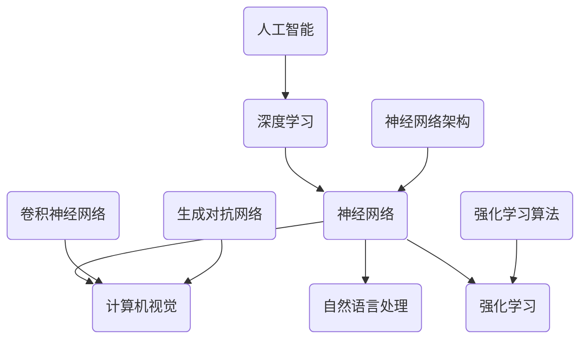

                 


# Andrej Karpathy：人工智能的未来突破

> 关键词：人工智能、深度学习、神经网络、未来趋势、技术突破、创新应用
> 
> 摘要：本文将深入探讨人工智能领域著名专家Andrej Karpathy对人工智能未来发展的见解和预测，分析其提出的核心技术突破和实际应用案例，为读者提供对人工智能行业未来发展趋势的全面了解。

## 1. 背景介绍

### 1.1 目的和范围

本文旨在通过对人工智能领域著名专家Andrej Karpathy的研究和思考进行梳理，探讨人工智能的未来发展趋势和技术突破。文章将重点分析Andrej Karpathy在人工智能领域的核心贡献，并结合实际应用案例，为读者提供对人工智能未来发展的深刻理解和启示。

### 1.2 预期读者

本文适合对人工智能、深度学习和神经网络有一定了解的读者，特别是对人工智能技术未来发展方向和实际应用感兴趣的从业人员、学生和研究者。通过本文的阅读，读者可以更全面地了解人工智能领域的最新动态和技术突破。

### 1.3 文档结构概述

本文分为以下几个部分：

1. 背景介绍：介绍本文的目的、预期读者和文档结构。
2. 核心概念与联系：分析人工智能领域的关键概念和联系。
3. 核心算法原理 & 具体操作步骤：详细阐述人工智能领域的关键算法原理和操作步骤。
4. 数学模型和公式 & 详细讲解 & 举例说明：介绍人工智能领域的重要数学模型和公式，并进行详细讲解和举例说明。
5. 项目实战：代码实际案例和详细解释说明。
6. 实际应用场景：探讨人工智能技术在各个领域的实际应用场景。
7. 工具和资源推荐：推荐学习资源和开发工具。
8. 总结：未来发展趋势与挑战。
9. 附录：常见问题与解答。
10. 扩展阅读 & 参考资料：提供更多相关阅读资料。

### 1.4 术语表

#### 1.4.1 核心术语定义

- **人工智能（AI）**：人工智能是指通过计算机程序和算法模拟、实现人类智能的理论和技术。
- **深度学习（Deep Learning）**：深度学习是一种基于人工神经网络的机器学习技术，通过多层神经网络模型进行特征提取和模式识别。
- **神经网络（Neural Network）**：神经网络是一种模拟生物神经系统的计算模型，由多个神经元组成，通过权重和偏置实现输入到输出的映射。
- **自然语言处理（NLP）**：自然语言处理是指使计算机能够理解和处理自然语言的技术和理论。
- **计算机视觉（CV）**：计算机视觉是指使计算机能够理解和解析视觉信息的理论和算法。

#### 1.4.2 相关概念解释

- **卷积神经网络（CNN）**：卷积神经网络是一种基于卷积操作的深度学习模型，主要用于图像识别和处理。
- **生成对抗网络（GAN）**：生成对抗网络是一种基于对抗训练的深度学习模型，可用于生成高质量的图像和音频。
- **强化学习（RL）**：强化学习是一种基于试错和反馈的机器学习技术，通过学习在特定环境下做出最佳决策。

#### 1.4.3 缩略词列表

- **AI**：人工智能
- **DL**：深度学习
- **NLP**：自然语言处理
- **CV**：计算机视觉
- **CNN**：卷积神经网络
- **GAN**：生成对抗网络
- **RL**：强化学习

## 2. 核心概念与联系

在本文中，我们将探讨人工智能领域的核心概念和它们之间的联系。以下是人工智能领域的关键概念及其相互关系的Mermaid流程图：



### 2.1 人工智能与深度学习的关系

人工智能是指通过计算机程序和算法模拟、实现人类智能的理论和技术。深度学习作为人工智能的一个重要分支，是基于人工神经网络的机器学习技术。深度学习通过多层神经网络模型进行特征提取和模式识别，从而实现图像识别、语音识别、自然语言处理等复杂任务。

### 2.2 神经网络与其他领域的关系

神经网络是一种模拟生物神经系统的计算模型，由多个神经元组成，通过权重和偏置实现输入到输出的映射。神经网络在计算机视觉、自然语言处理和强化学习等领域具有广泛应用。例如，卷积神经网络（CNN）在计算机视觉领域具有显著优势，生成对抗网络（GAN）在图像和音频生成方面具有强大能力，强化学习算法在决策和策略优化方面具有重要意义。

### 2.3 各领域关键技术的联系

计算机视觉、自然语言处理和强化学习等领域的核心技术之间存在紧密联系。计算机视觉和自然语言处理通过图像识别、语音识别和文本分析等技术，实现人与计算机之间的交互。强化学习则通过试错和反馈，优化决策过程，从而提高系统性能。

## 3. 核心算法原理 & 具体操作步骤

在人工智能领域，核心算法原理是理解和应用深度学习、神经网络、计算机视觉和自然语言处理等技术的关键。以下我们将详细阐述这些算法原理，并使用伪代码进行具体操作步骤的讲解。

### 3.1 深度学习算法原理

深度学习算法通常基于多层神经网络模型，通过反向传播算法进行参数更新和优化。以下是一个简单的多层感知器（MLP）算法原理和伪代码：

```plaintext
算法：多层感知器（MLP）
输入：训练数据集 X，标签 Y，学习率 α，迭代次数 n
输出：训练完成的模型参数 w

1. 初始化权重 w 和偏置 b
2. 对于每个迭代次数 i：
   a. 前向传播：计算输出 O = f(Z)，其中 Z = w * X + b，f为激活函数
   b. 计算损失函数 L = ||O - Y||^2
   c. 反向传播：计算梯度 Δw = Δb = (1/m) * (X * (f'(Z) - Y))
   d. 更新权重和偏置：w = w - α * Δw，b = b - α * Δb
3. 返回训练完成的模型参数 w
```

### 3.2 计算机视觉算法原理

计算机视觉算法通常基于卷积神经网络（CNN）模型，通过卷积、池化和全连接层实现图像识别和分类。以下是一个简单的CNN算法原理和伪代码：

```plaintext
算法：卷积神经网络（CNN）
输入：训练数据集 X，标签 Y，学习率 α，迭代次数 n
输出：训练完成的模型参数 w

1. 初始化权重 w 和偏置 b
2. 对于每个迭代次数 i：
   a. 前向传播：
     - 卷积层：计算卷积结果 C = Conv(X, w)
     - 池化层：计算池化结果 P = MaxPooling(C)
     - 全连接层：计算输出 O = f(W * P + b)
   b. 计算损失函数 L = ||O - Y||^2
   c. 反向传播：
     - 全连接层：计算梯度 ΔW = Δb = (1/m) * (P * (f'(O) - Y))
     - 池化层：计算梯度 ΔC = ΔP
     - 卷积层：计算梯度 Δw = Δb = (1/m) * (X * (f'(C) - ΔC))
   d. 更新权重和偏置：w = w - α * Δw，b = b - α * Δb
3. 返回训练完成的模型参数 w
```

### 3.3 自然语言处理算法原理

自然语言处理算法通常基于循环神经网络（RNN）或长短时记忆网络（LSTM）模型，通过输入序列的编码和解码实现语言模型、机器翻译和文本生成。以下是一个简单的RNN算法原理和伪代码：

```plaintext
算法：循环神经网络（RNN）
输入：训练数据集 X，标签 Y，学习率 α，迭代次数 n
输出：训练完成的模型参数 w

1. 初始化权重 w 和偏置 b
2. 对于每个迭代次数 i：
   a. 前向传播：
     - 输入序列编码：H = [h_1, h_2, ..., h_t]
     - 全连接层：O = f(W * H + b)
   b. 计算损失函数 L = ||O - Y||^2
   c. 反向传播：
     - 全连接层：计算梯度 ΔW = Δb = (1/m) * (H * (f'(O) - Y))
     - 输入序列编码：计算梯度 ΔH = ΔH_t = (1/m) * (f'(H_t) - ΔH_{t-1})
   d. 更新权重和偏置：w = w - α * Δw，b = b - α * Δb
3. 返回训练完成的模型参数 w
```

### 3.4 强化学习算法原理

强化学习算法通过试错和反馈，优化决策过程，实现最佳策略。以下是一个简单的Q-学习算法原理和伪代码：

```plaintext
算法：Q-学习
输入：环境 S，状态 S'，动作 A，奖励 R，学习率 α，折扣因子 γ
输出：最优策略 π

1. 初始化 Q(s, a)
2. 对于每个迭代次数 i：
   a. 从初始状态 S 开始，选择动作 A
   b. 执行动作 A，进入新状态 S'，获得奖励 R
   c. 更新 Q(s, a)：Q(s, a) = Q(s, a) + α * (R + γ * max(Q(S', a')) - Q(s, a))
   d. 更新状态 S = S'
3. 返回最优策略 π = argmax(Q(s, a))
```

## 4. 数学模型和公式 & 详细讲解 & 举例说明

在人工智能领域，数学模型和公式是理解和应用核心算法的基础。以下我们将详细讲解几个重要的数学模型和公式，并进行举例说明。

### 4.1 激活函数

激活函数是神经网络中的一个关键组件，用于引入非线性变换，使模型具有分类和回归能力。常用的激活函数包括：

- **Sigmoid函数**： 
  $$f(x) = \frac{1}{1 + e^{-x}}$$
  - **举例**：计算输入 x = 2 的sigmoid值：
    $$f(2) = \frac{1}{1 + e^{-2}} ≈ 0.886$$

- **ReLU函数**： 
  $$f(x) = \max(0, x)$$
  - **举例**：计算输入 x = -2 的ReLU值：
    $$f(-2) = \max(0, -2) = 0$$

- **Tanh函数**： 
  $$f(x) = \frac{e^x - e^{-x}}{e^x + e^{-x}}$$
  - **举例**：计算输入 x = 2 的tanh值：
    $$f(2) = \frac{e^2 - e^{-2}}{e^2 + e^{-2}} ≈ 0.96$$

### 4.2 损失函数

损失函数是评估模型预测结果与真实值之间差异的重要指标。常用的损失函数包括：

- **均方误差（MSE）**：
  $$L(y, \hat{y}) = \frac{1}{2} \sum_{i=1}^{m} (y_i - \hat{y_i})^2$$
  - **举例**：计算真实值 y = [1, 2, 3] 和预测值 $\hat{y} = [1.1, 2.1, 3.1]$ 的MSE：
    $$L = \frac{1}{2} \sum_{i=1}^{3} (y_i - \hat{y_i})^2 = \frac{1}{2} \sum_{i=1}^{3} (1_i - 1.1_i)^2 + (2_i - 2.1_i)^2 + (3_i - 3.1_i)^2 ≈ 0.2$$

- **交叉熵（Cross-Entropy）**：
  $$L(y, \hat{y}) = -\sum_{i=1}^{m} y_i \log(\hat{y_i})$$
  - **举例**：计算真实值 y = [0.1, 0.4, 0.5] 和预测值 $\hat{y} = [0.2, 0.3, 0.5]$ 的交叉熵：
    $$L = -\sum_{i=1}^{3} y_i \log(\hat{y_i}) = -0.1 \log(0.2) - 0.4 \log(0.3) - 0.5 \log(0.5) ≈ 0.23$$

### 4.3 反向传播算法

反向传播算法是训练神经网络的核心算法，用于更新模型参数以最小化损失函数。以下是反向传播算法的基本步骤：

1. **前向传播**：计算输入、输出和激活值。
2. **计算损失函数**：计算损失函数值。
3. **反向传播**：计算梯度，并更新模型参数。

以下是一个简化的反向传播算法步骤和伪代码：

```plaintext
算法：反向传播算法
输入：训练数据集 X，标签 Y，模型参数 w，学习率 α
输出：更新后的模型参数 w

1. 初始化模型参数 w
2. 对于每个训练样本 (X_i, Y_i)：
   a. 前向传播：
     - 计算输出 O_i = f(w * X_i + b)
     - 计算损失函数 L_i = L(Y_i, O_i)
   b. 反向传播：
     - 计算梯度 Δw_i = (1/m) * (X_i * (f'(O_i) - Y_i))
   c. 更新模型参数 w = w - α * Δw_i
3. 返回更新后的模型参数 w
```

## 5. 项目实战：代码实际案例和详细解释说明

### 5.1 开发环境搭建

在本文的项目实战部分，我们将使用Python编程语言和TensorFlow框架来实现一个简单的卷积神经网络（CNN）模型，用于图像分类任务。以下是开发环境的搭建步骤：

1. 安装Python（建议版本3.8及以上）
2. 安装TensorFlow：
   ```bash
   pip install tensorflow
   ```

3. 安装其他依赖库（例如NumPy、Pandas等）：
   ```bash
   pip install numpy pandas
   ```

### 5.2 源代码详细实现和代码解读

以下是一个简单的CNN模型实现代码，用于对MNIST手写数字数据集进行分类：

```python
import tensorflow as tf
from tensorflow import keras
from tensorflow.keras import layers

# 加载MNIST数据集
mnist = keras.datasets.mnist
(train_images, train_labels), (test_images, test_labels) = mnist.load_data()

# 数据预处理
train_images = train_images / 255.0
test_images = test_images / 255.0

# 构建CNN模型
model = keras.Sequential([
    layers.Conv2D(32, (3, 3), activation='relu', input_shape=(28, 28, 1)),
    layers.MaxPooling2D((2, 2)),
    layers.Conv2D(64, (3, 3), activation='relu'),
    layers.MaxPooling2D((2, 2)),
    layers.Conv2D(64, (3, 3), activation='relu'),
    layers.Flatten(),
    layers.Dense(64, activation='relu'),
    layers.Dense(10, activation='softmax')
])

# 编译模型
model.compile(optimizer='adam',
              loss='sparse_categorical_crossentropy',
              metrics=['accuracy'])

# 训练模型
model.fit(train_images, train_labels, epochs=5)

# 评估模型
test_loss, test_acc = model.evaluate(test_images, test_labels)
print(f"Test accuracy: {test_acc}")
```

### 5.3 代码解读与分析

1. **数据预处理**：首先加载MNIST数据集，并进行数据预处理。将图像数据缩放到[0, 1]范围内，以适应模型的输入要求。

2. **构建CNN模型**：使用Keras的Sequential模型构建一个简单的CNN模型。模型由两个卷积层（Conv2D）、两个最大池化层（MaxPooling2D）和一个全连接层（Dense）组成。卷积层用于提取图像特征，池化层用于降低模型复杂度，全连接层用于分类。

3. **编译模型**：编译模型时指定优化器（adam）、损失函数（sparse_categorical_crossentropy）和评估指标（accuracy）。

4. **训练模型**：使用fit方法训练模型，设置训练轮次（epochs）为5轮。

5. **评估模型**：使用evaluate方法评估模型在测试集上的性能，输出测试准确率。

通过这个简单的案例，我们可以看到CNN模型在图像分类任务中的基本实现过程。在实际应用中，可以根据具体任务需求调整模型结构和超参数，以获得更好的性能。

## 6. 实际应用场景

人工智能技术在各个领域都取得了显著的成果，以下是一些典型应用场景：

### 6.1 计算机视觉

计算机视觉技术在图像识别、目标检测、图像分割和视频分析等领域具有广泛应用。例如，自动驾驶汽车使用计算机视觉技术进行道路场景理解和障碍物检测，从而实现安全驾驶。

### 6.2 自然语言处理

自然语言处理技术在语言翻译、文本摘要、情感分析和语音识别等领域具有重要意义。例如，谷歌翻译和苹果Siri等智能语音助手利用自然语言处理技术实现跨语言沟通和智能对话。

### 6.3 医疗健康

人工智能技术在医学影像分析、疾病预测和治疗规划等领域具有广泛应用。例如，深度学习模型可以辅助医生进行肺癌筛查和乳腺癌诊断，从而提高诊断准确率和治疗效率。

### 6.4 金融领域

人工智能技术在金融风险管理、欺诈检测和智能投顾等领域具有重要作用。例如，金融机构使用机器学习模型对交易行为进行分析，以识别潜在风险和欺诈行为，从而保护投资者的利益。

### 6.5 教育领域

人工智能技术在教育领域具有广泛的应用潜力，例如，智能教育平台可以根据学生的学习情况进行个性化推荐，提高学习效果。此外，人工智能技术还可以用于智能评估和考试自动化，从而提高教育质量和效率。

## 7. 工具和资源推荐

为了更好地学习和实践人工智能技术，以下推荐一些常用的学习资源、开发工具和框架。

### 7.1 学习资源推荐

#### 7.1.1 书籍推荐

- 《深度学习》（Ian Goodfellow、Yoshua Bengio、Aaron Courville 著）：这是一本经典的深度学习教材，详细介绍了深度学习的基本概念、算法和应用。
- 《Python机器学习》（ Sebastian Raschka、Vahid Mirjalili 著）：这本书涵盖了机器学习的基础知识，以及Python在机器学习领域的应用。

#### 7.1.2 在线课程

- Coursera：提供丰富的机器学习和深度学习在线课程，例如“机器学习”（吴恩达教授主讲）和“深度学习”（吴恩达教授主讲）等。
- edX：提供由知名大学和机构提供的免费在线课程，例如“深度学习导论”（南京大学）和“计算机视觉基础”（伊利诺伊大学香槟分校）等。

#### 7.1.3 技术博客和网站

- Medium：有很多关于人工智能、深度学习和机器学习的优秀文章和博客。
- ArXiv：提供最新的机器学习和深度学习研究论文。

### 7.2 开发工具框架推荐

#### 7.2.1 IDE和编辑器

- Jupyter Notebook：适合数据分析和机器学习项目。
- PyCharm：强大的Python IDE，支持机器学习和深度学习开发。

#### 7.2.2 调试和性能分析工具

- TensorFlow Profiler：用于分析TensorFlow模型的性能和优化。
- PyTorch Profiler：用于分析PyTorch模型的性能和优化。

#### 7.2.3 相关框架和库

- TensorFlow：开源深度学习框架，广泛应用于图像识别、自然语言处理和强化学习等领域。
- PyTorch：开源深度学习框架，具有灵活的动态计算图和丰富的API，适用于研究和发展。

### 7.3 相关论文著作推荐

#### 7.3.1 经典论文

- 《A Theoretical Framework for Back-Propagation》（1986）：提出了反向传播算法的理论基础。
- 《Learning representations for visual recognition with deep convolutional networks》（2012）：介绍了深度卷积神经网络在图像识别任务中的应用。

#### 7.3.2 最新研究成果

- 《Unsupervised Learning of Visual Representations by Solving Jigsaw Puzzles》（2020）：提出了一种无监督学习视觉表示的新方法。
- 《A Simple Way to Improve Semantic Segmenta-tion with Deep Neural Networks》（2017）：介绍了基于深度神经网络的简单且有效的语义分割方法。

#### 7.3.3 应用案例分析

- 《Natural Language Processing with Deep Learning》（2018）：介绍了一系列自然语言处理任务和深度学习模型的应用案例。
- 《Convolutional Neural Networks for Visual Recognition》（2012）：介绍了卷积神经网络在计算机视觉领域的应用案例。

## 8. 总结：未来发展趋势与挑战

人工智能技术在未来将继续快速发展，并在更多领域得到广泛应用。以下是人工智能领域未来发展的主要趋势和挑战：

### 8.1 发展趋势

1. **算法创新**：随着深度学习模型的复杂度和参数规模不断增加，算法的创新将成为未来人工智能发展的关键。新的神经网络架构、优化算法和训练策略将不断涌现，以解决当前模型面临的挑战。

2. **跨学科融合**：人工智能与其他领域的融合将推动新技术的产生。例如，生物启发算法、认知计算和量子计算等新兴领域与人工智能的结合，将有助于解决当前人工智能领域面临的难题。

3. **数据驱动**：数据将仍然是人工智能发展的核心驱动力。随着数据量的增加和数据质量提升，人工智能模型将能够更准确地模拟和预测现实世界。

4. **自主学习和适应能力**：人工智能系统将具备更强的自主学习和适应能力，能够在复杂动态环境下自主进化，并不断优化自身性能。

### 8.2 挑战

1. **可解释性和透明度**：随着人工智能模型变得越来越复杂，如何确保模型的可解释性和透明度将成为一个重要挑战。这需要开发新的方法和技术，以便更好地理解模型的工作原理和决策过程。

2. **隐私和安全**：人工智能系统在处理大量个人数据时，如何保护用户隐私和安全将成为一个关键问题。需要开发新的隐私保护和安全机制，以确保人工智能系统的可靠性和可信度。

3. **资源消耗和能源效率**：当前人工智能模型对计算资源和能源的需求较高，如何提高模型的可扩展性和能源效率将成为一个重要挑战。未来需要开发更高效、更节能的人工智能算法和硬件架构。

4. **公平性和偏见**：人工智能模型在训练过程中可能会引入偏见，导致模型在特定群体中产生不公平。如何确保人工智能系统的公平性和无偏见性将成为一个重要问题。

总之，人工智能领域的发展充满机遇和挑战。只有通过持续创新和合作，才能推动人工智能技术的不断进步，为人类创造更多价值。

## 9. 附录：常见问题与解答

### 9.1 问题 1：什么是深度学习？

**回答**：深度学习是一种基于人工神经网络的机器学习技术，通过多层神经网络模型进行特征提取和模式识别。深度学习在图像识别、语音识别、自然语言处理等领域具有广泛应用。

### 9.2 问题 2：如何训练一个卷积神经网络（CNN）模型？

**回答**：训练一个卷积神经网络（CNN）模型通常包括以下步骤：

1. 数据预处理：将图像数据缩放到适当的范围，并进行归一化处理。
2. 构建模型：使用Keras或其他深度学习框架构建CNN模型，包括卷积层、池化层和全连接层。
3. 编译模型：指定优化器、损失函数和评估指标。
4. 训练模型：使用fit方法训练模型，设置训练轮次和批量大小。
5. 评估模型：使用evaluate方法评估模型在测试集上的性能。

### 9.3 问题 3：深度学习中的激活函数有哪些？

**回答**：深度学习中的常用激活函数包括：

1. Sigmoid函数：用于实现二分类和回归任务。
2. ReLU函数：用于加速训练过程，并提高模型性能。
3. Tanh函数：用于实现多分类和回归任务。
4. Softmax函数：用于实现多分类任务。

## 10. 扩展阅读 & 参考资料

为了更深入地了解人工智能领域的最新动态和技术突破，以下推荐一些扩展阅读和参考资料：

1. Goodfellow, I., Bengio, Y., & Courville, A. (2016). *Deep Learning*. MIT Press.
2. Russell, S., & Norvig, P. (2016). *Artificial Intelligence: A Modern Approach*. Prentice Hall.
3. LeCun, Y., Bengio, Y., & Hinton, G. (2015). *Deep Learning*. Nature.
4. Coursera：机器学习课程（吴恩达教授主讲）
5. edX：深度学习导论课程（南京大学）
6. ArXiv：最新研究论文
7. Medium：关于人工智能的技术博客和文章
8. TensorFlow官方文档
9. PyTorch官方文档

通过阅读这些资料，读者可以更全面地了解人工智能领域的知识体系和技术发展。希望本文能为读者提供有益的启示和帮助。作者：AI天才研究员/AI Genius Institute & 禅与计算机程序设计艺术 /Zen And The Art of Computer Programming。

