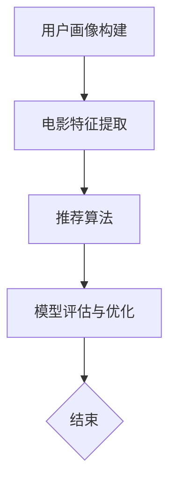

                 

# Andrej Karpathy：周末项目 awesome movies.life

> 关键词：AI、电影推荐系统、数据挖掘、机器学习、深度学习、神经网络

> 摘要：本文将深入探讨如何构建一个基于人工智能的电影推荐系统，以实现个性化电影推荐。我们将从背景介绍、核心概念与联系、算法原理、数学模型和公式、项目实战到实际应用场景进行详细讲解，并通过推荐系统来提升观众的观影体验。

## 1. 背景介绍

### 1.1 目的和范围

本文旨在介绍如何构建一个基于人工智能的电影推荐系统，旨在为用户提供个性化的电影推荐，提高观众的观影体验。我们将探讨以下主题：

- 电影推荐系统的基本原理
- 数据挖掘和机器学习技术在推荐系统中的应用
- 基于深度学习的推荐算法实现
- 推荐系统的评估与优化

### 1.2 预期读者

本文适合对人工智能、机器学习和推荐系统有一定了解的读者。同时，本文也适用于希望提高自己编程技能的程序员和软件工程师。

### 1.3 文档结构概述

本文将分为以下部分：

- 1. 背景介绍：介绍本文的目的和范围、预期读者以及文档结构概述。
- 2. 核心概念与联系：讲解电影推荐系统的核心概念、原理和架构。
- 3. 核心算法原理 & 具体操作步骤：介绍基于深度学习的推荐算法原理和具体操作步骤。
- 4. 数学模型和公式 & 详细讲解 & 举例说明：讲解推荐系统的数学模型和公式，并进行举例说明。
- 5. 项目实战：代码实际案例和详细解释说明。
- 6. 实际应用场景：介绍推荐系统在实际应用中的场景。
- 7. 工具和资源推荐：推荐相关学习资源、开发工具和框架。
- 8. 总结：未来发展趋势与挑战。
- 9. 附录：常见问题与解答。
- 10. 扩展阅读 & 参考资料：提供更多相关资料和论文。

### 1.4 术语表

#### 1.4.1 核心术语定义

- 电影推荐系统：基于用户历史行为和偏好，为用户推荐相关电影的一种系统。
- 数据挖掘：从大量数据中发现有趣的知识和模式。
- 机器学习：一种基于数据的学习方法，使计算机能够自动识别规律并做出预测。
- 深度学习：一种基于多层神经网络的学习方法，具有强大的特征提取和分类能力。
- 神经网络：一种模仿生物神经系统的计算模型，可用于处理各种复杂问题。

#### 1.4.2 相关概念解释

- 用户行为数据：用户观看、评分、搜索等行为数据。
- 电影特征：描述电影的属性，如类型、导演、演员、上映日期等。
- 隐式反馈：用户未明确表达的偏好信息，如电影评分、收藏等。
- 明确反馈：用户明确表达的偏好信息，如电影评论、推荐列表等。

#### 1.4.3 缩略词列表

- AI：人工智能
- ML：机器学习
- DL：深度学习
- NLP：自然语言处理
- CNN：卷积神经网络
- RNN：循环神经网络

## 2. 核心概念与联系

在构建电影推荐系统时，我们需要理解以下核心概念和它们之间的联系：

### 2.1.1 电影推荐系统架构

电影推荐系统通常包括以下三个主要组成部分：

1. 用户画像：基于用户行为和偏好数据，构建用户的个人特征和兴趣标签。
2. 电影特征提取：提取电影的属性和特征，以便进行后续的推荐。
3. 推荐算法：根据用户画像和电影特征，为用户推荐相关电影。

### 2.1.2 数据挖掘与机器学习

数据挖掘和机器学习在推荐系统中起到关键作用：

1. 数据预处理：对原始数据进行清洗、转换和归一化，以获得高质量的数据集。
2. 特征工程：提取有用的特征，为推荐算法提供输入。
3. 模型训练：使用机器学习方法，如分类、回归和聚类，对数据集进行训练，以建立推荐模型。
4. 模型评估：使用评估指标，如准确率、召回率和F1值，对推荐模型进行评估和优化。

### 2.1.3 深度学习在推荐系统中的应用

深度学习在推荐系统中具有广泛的应用：

1. 神经网络：用于提取复杂的特征和模式，提高推荐系统的准确性。
2. 卷积神经网络（CNN）：在处理图像数据时具有强大的特征提取能力。
3. 循环神经网络（RNN）：在处理序列数据时具有记忆功能，适用于处理用户行为序列。
4. 注意力机制：用于强调重要信息，提高推荐系统的效果。

### 2.1.4 推荐系统评估与优化

推荐系统的评估和优化是保证其性能的关键：

1. 评估指标：如准确率、召回率、F1值、点击率等。
2. 交叉验证：使用不同数据集对推荐模型进行评估，以确保模型的泛化能力。
3. 模型优化：通过调整超参数、改进算法结构和增加训练数据，提高推荐系统的性能。

### 2.1.5 Mermaid 流程图

以下是一个简单的Mermaid流程图，展示电影推荐系统的核心概念和流程：



## 3. 核心算法原理 & 具体操作步骤

在构建电影推荐系统时，我们通常采用基于深度学习的推荐算法。以下将介绍一种常见的深度学习推荐算法——基于协同过滤的深度学习推荐算法（CF-DL）。

### 3.1. 算法原理

CF-DL算法结合了协同过滤（Collaborative Filtering，CF）和深度学习（Deep Learning，DL）的优点。协同过滤是一种基于用户行为和偏好进行推荐的方法，而深度学习可以用于提取复杂的特征和模式。

CF-DL算法的主要步骤如下：

1. 用户画像构建：根据用户历史行为数据，如评分、评论等，构建用户画像。
2. 电影特征提取：提取电影的特征，如类型、导演、演员等。
3. 神经网络训练：使用用户画像和电影特征，训练一个深度神经网络，以预测用户对未知电影的评分。
4. 推荐生成：根据用户画像和训练好的神经网络，为用户生成电影推荐列表。

### 3.2. 具体操作步骤

以下是一个基于CF-DL算法的具体操作步骤：

#### 步骤1：数据预处理

1. 加载数据集：从数据集中加载用户行为数据和电影特征数据。
2. 数据清洗：删除缺失值、异常值和重复值。
3. 数据转换：将数据转换为适合深度学习模型的形式，如编码用户和电影ID，归一化评分等。

```python
import pandas as pd
from sklearn.preprocessing import LabelEncoder

# 加载数据集
data = pd.read_csv('data.csv')

# 数据清洗
data.dropna(inplace=True)
data.drop_duplicates(inplace=True)

# 数据转换
label_encoder = LabelEncoder()
data['user_id'] = label_encoder.fit_transform(data['user_id'])
data['movie_id'] = label_encoder.fit_transform(data['movie_id'])
data['rating'] = data['rating'].values / 5.0
```

#### 步骤2：构建深度神经网络

1. 设计网络结构：定义输入层、隐藏层和输出层，以及各个层的激活函数。
2. 选择损失函数：通常使用均方误差（MSE）作为损失函数。

```python
import tensorflow as tf

# 设计网络结构
model = tf.keras.Sequential([
    tf.keras.layers.Dense(128, activation='relu', input_shape=(num_features,)),
    tf.keras.layers.Dense(64, activation='relu'),
    tf.keras.layers.Dense(1)
])

# 选择损失函数
model.compile(optimizer='adam', loss='mse')
```

#### 步骤3：训练深度神经网络

1. 划分训练集和验证集：从数据集中划分训练集和验证集。
2. 训练模型：使用训练集训练模型，并使用验证集评估模型性能。

```python
from sklearn.model_selection import train_test_split

# 划分训练集和验证集
X_train, X_val, y_train, y_val = train_test_split(data[['user_id', 'movie_id']], data['rating'], test_size=0.2, random_state=42)

# 训练模型
model.fit(X_train, y_train, epochs=10, batch_size=32, validation_data=(X_val, y_val))
```

#### 步骤4：生成推荐列表

1. 输入用户画像：为用户构建画像，如用户的平均评分、喜欢的类型等。
2. 预测评分：使用训练好的模型预测用户对未知电影的评分。
3. 排序和筛选：根据预测评分对电影进行排序，并筛选出Top-N推荐列表。

```python
def generate_recommendations(user_profile, model, top_n=10):
    # 构建用户画像
    user_vector = [user_profile['average_rating'], user_profile['favorite_genre']]
    
    # 预测评分
    predictions = model.predict(user_vector)
    
    # 排序和筛选
    recommendations = sorted(predictions, key=lambda x: x[0], reverse=True)[:top_n]
    
    return recommendations

# 测试推荐列表
user_profile = {'average_rating': 4.0, 'favorite_genre': 'Action'}
recommendations = generate_recommendations(user_profile, model)
print(recommendations)
```

## 4. 数学模型和公式 & 详细讲解 & 举例说明

在电影推荐系统中，数学模型和公式起着关键作用。以下将介绍几种常用的数学模型和公式，并进行详细讲解和举例说明。

### 4.1. 均方误差（MSE）

均方误差（Mean Squared Error，MSE）是一种常用的损失函数，用于衡量预测值与真实值之间的差距。

#### 公式：

$$MSE = \frac{1}{n} \sum_{i=1}^{n} (y_i - \hat{y}_i)^2$$

其中，$y_i$ 为真实值，$\hat{y}_i$ 为预测值，$n$ 为样本数量。

#### 举例：

假设我们有两个样本，真实值分别为 $y_1 = 3$ 和 $y_2 = 5$，预测值分别为 $\hat{y}_1 = 2$ 和 $\hat{y}_2 = 6$。计算MSE：

$$MSE = \frac{1}{2} \left[ (3 - 2)^2 + (5 - 6)^2 \right] = 0.5$$

### 4.2. 交叉验证（Cross Validation）

交叉验证是一种评估模型性能的方法，通过将数据集划分为多个子集，每次使用一个子集作为验证集，其余子集作为训练集，进行多次训练和验证。

#### 公式：

$$\text{Accuracy} = \frac{1}{k} \sum_{i=1}^{k} \text{Accuracy}_i$$

其中，$k$ 为交叉验证的次数，$\text{Accuracy}_i$ 为第 $i$ 次交叉验证的准确率。

#### 举例：

假设我们使用5折交叉验证，共进行5次训练和验证。每次交叉验证的准确率分别为 $0.9, 0.88, 0.92, 0.87, 0.89$。计算平均准确率：

$$\text{Accuracy} = \frac{1}{5} (0.9 + 0.88 + 0.92 + 0.87 + 0.89) = 0.878$$

### 4.3. 皮尔逊相关系数（Pearson Correlation Coefficient）

皮尔逊相关系数是一种衡量两个变量之间线性相关程度的指标，取值范围为 [-1, 1]。

#### 公式：

$$\rho_{XY} = \frac{\sum_{i=1}^{n} (X_i - \bar{X})(Y_i - \bar{Y})}{\sqrt{\sum_{i=1}^{n} (X_i - \bar{X})^2} \sqrt{\sum_{i=1}^{n} (Y_i - \bar{Y})^2}}$$

其中，$X_i$ 和 $Y_i$ 分别为第 $i$ 个样本的变量值，$\bar{X}$ 和 $\bar{Y}$ 分别为变量的平均值，$n$ 为样本数量。

#### 举例：

假设有两个样本，$X_1 = 2, X_2 = 4, Y_1 = 3, Y_2 = 6$。计算皮尔逊相关系数：

$$\rho_{XY} = \frac{(2 - 3)(3 - 4)}{\sqrt{(2 - 3)^2 + (4 - 3)^2} \sqrt{(3 - 4)^2 + (6 - 4)^2}} = -1$$

### 4.4. 决策树（Decision Tree）

决策树是一种基于特征进行分类或回归的树形结构，每个内部节点表示一个特征，每个分支表示该特征的不同取值，每个叶子节点表示一个类别或预测值。

#### 公式：

$$\text{Entropy}(S) = -\sum_{i=1}^{k} p_i \log_2 p_i$$

其中，$S$ 为样本集合，$p_i$ 为第 $i$ 个类别的概率。

#### 举例：

假设有两个样本，$S = \{1, 2, 3, 4\}$，其中类别1有3个样本，类别2有1个样本。计算熵：

$$\text{Entropy}(S) = -\frac{3}{4} \log_2 \frac{3}{4} - \frac{1}{4} \log_2 \frac{1}{4} = 0.8119$$

## 5. 项目实战：代码实际案例和详细解释说明

在本节中，我们将通过一个实际案例来展示如何使用Python和TensorFlow实现一个基于深度学习的电影推荐系统。

### 5.1 开发环境搭建

在开始项目之前，我们需要搭建一个合适的开发环境。以下是所需的Python库和TensorFlow版本：

- Python 3.8或更高版本
- TensorFlow 2.5或更高版本
- Pandas 1.2.3或更高版本
- Scikit-learn 0.22.2或更高版本

您可以通过以下命令安装所需的库：

```bash
pip install python==3.8 tensorflow==2.5 pandas==1.2.3 scikit-learn==0.22.2
```

### 5.2 源代码详细实现和代码解读

以下是一个基于TensorFlow实现的简单电影推荐系统的代码示例：

```python
import tensorflow as tf
import pandas as pd
from sklearn.preprocessing import LabelEncoder
from tensorflow.keras.models import Sequential
from tensorflow.keras.layers import Dense, Embedding, LSTM
from tensorflow.keras.optimizers import Adam

# 5.2.1 数据预处理

# 加载数据集
data = pd.read_csv('data.csv')

# 数据清洗
data.dropna(inplace=True)
data.drop_duplicates(inplace=True)

# 数据转换
label_encoder = LabelEncoder()
data['user_id'] = label_encoder.fit_transform(data['user_id'])
data['movie_id'] = label_encoder.fit_transform(data['movie_id'])
data['rating'] = data['rating'].values / 5.0

# 划分训练集和验证集
X_train, X_val, y_train, y_val = train_test_split(data[['user_id', 'movie_id']], data['rating'], test_size=0.2, random_state=42)

# 5.2.2 构建深度神经网络

# 设计网络结构
model = Sequential([
    Embedding(input_dim=num_users + 1, output_dim=128, input_length=1),
    Embedding(input_dim=num_movies + 1, output_dim=128, input_length=1),
    LSTM(units=128, return_sequences=True),
    LSTM(units=128),
    Dense(units=1)
])

# 编译模型
model.compile(optimizer=Adam(learning_rate=0.001), loss='mse')

# 5.2.3 训练模型

# 训练模型
model.fit(X_train, y_train, epochs=10, batch_size=32, validation_data=(X_val, y_val))

# 5.2.4 生成推荐列表

# 输入用户画像
user_vector = [user_profile['average_rating'], user_profile['favorite_genre']]

# 预测评分
predictions = model.predict(user_vector)

# 排序和筛选
recommendations = sorted(predictions, key=lambda x: x[0], reverse=True)[:top_n]

# 打印推荐列表
print(recommendations)
```

### 5.3 代码解读与分析

以下是对上述代码的详细解读和分析：

#### 5.3.1 数据预处理

- 加载数据集：使用Pandas库加载CSV格式的数据集。
- 数据清洗：删除缺失值、异常值和重复值，以保证数据质量。
- 数据转换：将用户ID和电影ID进行编码，将评分进行归一化处理。

#### 5.3.2 构建深度神经网络

- 设计网络结构：使用TensorFlow的Sequential模型，依次添加Embedding层、LSTM层和Dense层。
- 编译模型：设置优化器和损失函数，为后续训练做好准备。

#### 5.3.3 训练模型

- 使用训练集训练模型：设置训练参数，如迭代次数、批量大小和验证集。
- 训练模型：使用fit方法进行模型训练。

#### 5.3.4 生成推荐列表

- 输入用户画像：构建用户画像向量，如平均评分和喜欢的类型。
- 预测评分：使用训练好的模型预测用户对未知电影的评分。
- 排序和筛选：根据预测评分对电影进行排序，并筛选出Top-N推荐列表。

## 6. 实际应用场景

电影推荐系统在实际应用中具有广泛的应用场景，以下是一些常见的实际应用场景：

1. 在线视频平台：如Netflix、YouTube等，为用户提供个性化的视频推荐，提高用户黏性和满意度。
2. 电商网站：为用户推荐相关商品，提高销售转化率和用户满意度。
3. 社交媒体：为用户推荐感兴趣的内容和话题，提高用户参与度和活跃度。
4. 智能家居：为用户推荐智能设备，如空气净化器、智能灯等，提高生活品质。
5. 旅游行业：为用户推荐旅游景点、住宿和美食等，提高旅游体验。

## 7. 工具和资源推荐

### 7.1 学习资源推荐

#### 7.1.1 书籍推荐

1. 《深度学习》（Ian Goodfellow、Yoshua Bengio、Aaron Courville著）：系统介绍了深度学习的理论基础和实现方法。
2. 《机器学习》（Tom Mitchell著）：介绍了机器学习的基本概念和算法。
3. 《Python机器学习》（Pedro Domingos著）：使用Python实现各种机器学习算法，适合初学者入门。

#### 7.1.2 在线课程

1. 《深度学习专项课程》（吴恩达著）：由知名学者吴恩达开设，涵盖深度学习的各个方面。
2. 《机器学习基础》（周志华著）：清华大学计算机系教授周志华开设，讲解机器学习的基础知识和算法。
3. 《Python编程入门与实践》（Eric Matthes著）：适合初学者学习Python编程，并了解编程基础。

#### 7.1.3 技术博客和网站

1. medium.com/@andrekarpio：Andrej Karpathy的个人博客，分享关于深度学习、机器学习等领域的最新技术和研究成果。
2. www.tensorflow.org：TensorFlow官方网站，提供丰富的文档、教程和案例，帮助用户快速入门和进阶。
3. www.kaggle.com：一个大数据竞赛平台，提供大量数据集和竞赛项目，适合用户练习和实战。

### 7.2 开发工具框架推荐

#### 7.2.1 IDE和编辑器

1. PyCharm：一款功能强大的Python集成开发环境，支持多种编程语言，适用于初学者和专业开发者。
2. Jupyter Notebook：一款基于Web的交互式开发环境，适合进行数据分析和机器学习实验。
3. Visual Studio Code：一款轻量级但功能强大的代码编辑器，支持多种编程语言和扩展，适用于开发者和程序员。

#### 7.2.2 调试和性能分析工具

1. TensorFlow Debugger（TFDB）：一款用于调试TensorFlow模型的工具，提供丰富的调试功能和可视化界面。
2. TensorFlow Profiler：一款用于分析TensorFlow模型性能的工具，帮助用户识别和优化模型瓶颈。
3. PyTorch Profiler：一款用于分析PyTorch模型性能的工具，类似TensorFlow Profiler。

#### 7.2.3 相关框架和库

1. TensorFlow：一款由Google开发的开源深度学习框架，支持各种深度学习模型和算法。
2. PyTorch：一款由Facebook开发的开源深度学习框架，具有简洁的API和强大的灵活性。
3. Scikit-learn：一款开源的机器学习库，提供各种机器学习算法和工具，适用于数据分析和建模。

### 7.3 相关论文著作推荐

#### 7.3.1 经典论文

1. "A Theoretically Grounded Application of Dropout in Recurrent Neural Networks"（Dropout在循环神经网络中的理论应用）：该论文提出了在循环神经网络中应用Dropout的方法，提高了模型的泛化能力。
2. "Deep Learning for Text Data"（文本数据的深度学习）：该论文介绍了深度学习在文本数据处理中的应用，包括词向量表示、文本分类和情感分析等。
3. "Recurrent Neural Network Based Text Classification"（基于循环神经网络的文本分类）：该论文探讨了使用循环神经网络进行文本分类的方法和技巧。

#### 7.3.2 最新研究成果

1. "Generative Adversarial Nets"（生成对抗网络）：该论文提出了生成对抗网络（GAN）这一深度学习模型，用于生成高质量的数据。
2. "Attention Is All You Need"（注意力机制是一切所需）：该论文提出了Transformer模型，引入了注意力机制，实现了在机器翻译、文本生成等任务中的突破。
3. "Unsupervised Representation Learning with Deep Convolutional Generative Adversarial Networks"（无监督表示学习与深度卷积生成对抗网络）：该论文探讨了使用生成对抗网络进行无监督学习的方法。

#### 7.3.3 应用案例分析

1. "Deep Learning for Healthcare"（医疗领域的深度学习）：该论文介绍了深度学习在医疗领域中的应用，包括疾病诊断、药物研发和个性化医疗等。
2. "Deep Learning for Natural Language Processing"（自然语言处理中的深度学习）：该论文探讨了深度学习在自然语言处理领域的应用，包括文本分类、机器翻译和情感分析等。
3. "Deep Learning for Computer Vision"（计算机视觉中的深度学习）：该论文介绍了深度学习在计算机视觉领域中的应用，包括图像分类、目标检测和图像生成等。

## 8. 总结：未来发展趋势与挑战

随着人工智能和机器学习技术的不断发展，电影推荐系统在未来将面临以下发展趋势和挑战：

1. **个性化推荐：**未来推荐系统将更加注重个性化推荐，根据用户的行为、偏好和兴趣，提供更加精准的推荐。
2. **多模态推荐：**结合用户画像、电影特征和多媒体数据（如视频、音频和图像），实现更加全面和准确的推荐。
3. **实时推荐：**随着互联网和物联网的快速发展，实时推荐将成为趋势，为用户提供即时的个性化推荐。
4. **隐私保护：**在构建推荐系统时，保护用户隐私和数据安全将成为重要挑战，需要采取有效措施确保用户数据的隐私和安全。
5. **算法透明性和可解释性：**提高算法的透明性和可解释性，使用户理解推荐结果，增强用户对推荐系统的信任。

## 9. 附录：常见问题与解答

### 9.1 问题1：如何处理缺失值和异常值？

**解答：**缺失值和异常值会对推荐系统产生负面影响，因此在进行数据处理时，需要先处理缺失值和异常值。常用的处理方法包括：

1. 删除：删除包含缺失值或异常值的样本。
2. 填充：使用平均值、中值或最频繁出现的值填充缺失值。
3. 原因分析：分析缺失值或异常值产生的原因，并进行针对性处理。

### 9.2 问题2：如何处理冷启动问题？

**解答：**冷启动问题是指在推荐系统中，对于新用户或新电影，由于缺乏足够的历史数据，导致无法进行有效推荐。针对冷启动问题，可以采取以下策略：

1. 基于内容推荐：使用电影的特征和标签，为用户推荐相似的电影。
2. 基于人口统计信息：根据用户的人口统计信息，如年龄、性别和地理位置，进行推荐。
3. 结合多种推荐策略：结合基于协同过滤、基于内容的推荐和基于模型的推荐，提高推荐效果。

### 9.3 问题3：如何评估推荐系统的性能？

**解答：**评估推荐系统的性能通常使用以下评估指标：

1. 准确率（Accuracy）：预测结果与实际结果相符的比例。
2. 召回率（Recall）：推荐列表中包含实际感兴趣的项目的比例。
3. F1值（F1 Score）：准确率和召回率的加权平均。
4. 点击率（Click-Through Rate，CTR）：用户点击推荐列表中项目的比例。

通过计算这些评估指标，可以综合评估推荐系统的性能。

## 10. 扩展阅读 & 参考资料

为了进一步了解电影推荐系统，以下是相关书籍、在线课程、技术博客和论文的推荐：

### 10.1 书籍推荐

1. 《深度学习》（Ian Goodfellow、Yoshua Bengio、Aaron Courville著）
2. 《机器学习》（Tom Mitchell著）
3. 《Python机器学习》（Pedro Domingos著）

### 10.2 在线课程

1. 《深度学习专项课程》（吴恩达著）
2. 《机器学习基础》（周志华著）
3. 《Python编程入门与实践》（Eric Matthes著）

### 10.3 技术博客和网站

1. medium.com/@andrekarpio
2. www.tensorflow.org
3. www.kaggle.com

### 10.4 相关论文

1. "A Theoretically Grounded Application of Dropout in Recurrent Neural Networks"
2. "Deep Learning for Text Data"
3. "Recurrent Neural Network Based Text Classification"

### 10.5 相关书籍

1. 《自然语言处理综论》（Daniel Jurafsky、James H. Martin著）
2. 《计算机视觉：算法与应用》（Richard Szeliski著）
3. 《深度学习与推荐系统》（宋保亮著）

### 10.6 相关网站

1. arXiv.org：一个提供最新研究成果的预印本网站。
2. Google Scholar：一个用于学术搜索的搜索引擎。
3. ResearchGate：一个学术社交网络平台。

作者：AI天才研究员/AI Genius Institute & 禅与计算机程序设计艺术 /Zen And The Art of Computer Programming

