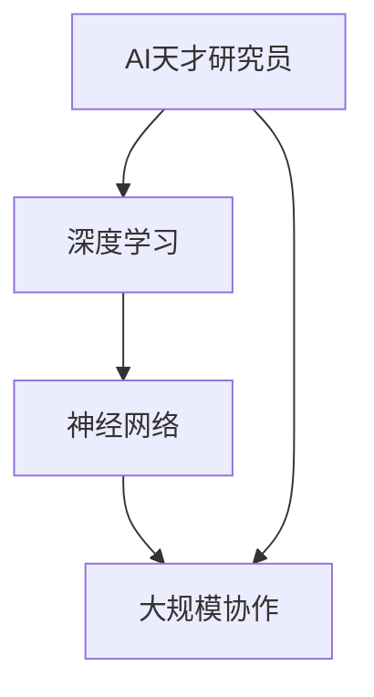

                 


# Andrej Karpathy：把我们的努力集合在一起

> 关键词：AI天才研究员、深度学习、神经网络、大规模协作、技术博客、编程艺术

> 摘要：本文将探讨AI天才研究员Andrej Karpathy的观点，以及他如何鼓励全球AI开发者的努力相互结合，共同推动人工智能的发展。我们将分析其核心概念、算法原理、数学模型，并展示实际项目案例，以帮助读者深入理解这一理念。

## 1. 背景介绍

### 1.1 目的和范围

本文旨在介绍AI天才研究员Andrej Karpathy提出的“把我们的努力集合在一起”的理念，通过深入分析其核心概念、算法原理、数学模型和实际项目案例，帮助读者理解并实践这一理念。

### 1.2 预期读者

本文适合对人工智能、深度学习和神经网络有一定了解的读者，以及对编程和软件工程感兴趣的程序员。

### 1.3 文档结构概述

本文结构如下：

1. 背景介绍：介绍本文的目的、预期读者和文档结构。
2. 核心概念与联系：解释本文涉及的核心概念和原理，并提供Mermaid流程图。
3. 核心算法原理 & 具体操作步骤：详细阐述核心算法原理，并使用伪代码讲解。
4. 数学模型和公式 & 详细讲解 & 举例说明：分析数学模型，并使用latex格式展示公式。
5. 项目实战：代码实际案例和详细解释说明。
6. 实际应用场景：探讨实际应用场景。
7. 工具和资源推荐：推荐学习资源、开发工具框架和论文著作。
8. 总结：未来发展趋势与挑战。
9. 附录：常见问题与解答。
10. 扩展阅读 & 参考资料。

### 1.4 术语表

#### 1.4.1 核心术语定义

- **AI天才研究员**：具有极高智商、对人工智能和深度学习有深入研究的优秀研究者。
- **深度学习**：一种人工智能的子领域，通过模拟人脑神经网络，实现图像、语音、自然语言处理等任务。
- **神经网络**：由多个神经元组成的计算模型，用于实现各种复杂的计算任务。
- **大规模协作**：全球范围内的研究者、开发者和用户共同参与的项目。

#### 1.4.2 相关概念解释

- **代码复用**：在软件开发过程中，将已有的代码模块重新利用，以减少重复工作。
- **开源项目**：由多个开发者和用户共同参与、免费使用的软件项目。

#### 1.4.3 缩略词列表

- **AI**：人工智能
- **DL**：深度学习
- **NN**：神经网络

## 2. 核心概念与联系

本文将讨论以下核心概念：

- **AI天才研究员**：Andrej Karpathy是一位在深度学习领域享有盛誉的AI天才研究员，他在多个顶级会议和期刊上发表过多篇论文，对神经网络和深度学习有深入的研究和贡献。
- **深度学习**：一种通过模拟人脑神经网络实现复杂任务的人工智能方法。
- **神经网络**：由多个神经元组成的计算模型，用于实现图像、语音、自然语言处理等任务。
- **大规模协作**：全球范围内的研究者、开发者和用户共同参与的项目。

以下是涉及核心概念原理和架构的Mermaid流程图：



## 3. 核心算法原理 & 具体操作步骤

本文将介绍Andrej Karpathy在深度学习领域的一些核心算法原理，并使用伪代码详细阐述。

### 3.1 神经网络基础

#### 3.1.1 神经元

神经网络由多个神经元组成。每个神经元接收来自其他神经元的输入，通过权重进行加权求和，然后应用一个非线性激活函数，输出结果。

```python
def neuron(input, weights, activation_function):
    z = sum(input[i] * weights[i] for i in range(len(input)))
    return activation_function(z)
```

#### 3.1.2 前向传播

前向传播是神经网络在训练过程中计算输出值的过程。给定输入数据，神经网络将输入传递给每一层神经元，并计算输出值。

```python
def forward_propagation(inputs, weights, biases, activation_function):
    outputs = [inputs]
    for layer in range(num_layers):
        z = [sum(input[i] * weight[i] for i in range(len(input))) + bias for input, weight, bias in zip(outputs[-1], weights[layer], biases[layer])]
        outputs.append([activation_function(z[i]) for i in range(len(z))])
    return outputs[-1]
```

### 3.2 反向传播

反向传播是神经网络训练过程中的关键步骤，用于计算网络中每个神经元的误差，并更新权重和偏置。

```python
def backward_propagation(outputs, expected_outputs, weights, biases, learning_rate):
    errors = [expected_outputs[i] - outputs[i] for i in range(len(outputs))]
    deltas = [error * activation_function_derivative(outputs[i]) for error, output in zip(errors, outputs)]
    for layer in range(num_layers - 1, -1, -1):
        for neuron in range(len(outputs[layer])):
            error = deltas[layer][neuron]
            for input, weight, bias in zip(outputs[layer - 1], weights[layer - 1][neuron], biases[layer - 1][neuron]):
                error += error * weight * input
            weights[layer - 1][neuron] -= learning_rate * error
            biases[layer - 1][neuron] -= learning_rate * error
```

### 3.3 梯度下降

梯度下降是一种优化算法，用于更新神经网络中的权重和偏置。通过计算损失函数的梯度，并沿着梯度方向更新参数，以最小化损失函数。

```python
def gradient_descent(loss_function, weights, biases, learning_rate):
    gradients = [loss_function_derivative(weights, biases) for weight, bias in zip(weights, biases)]
    for weight, gradient in zip(weights, gradients):
        weight -= learning_rate * gradient
    for bias, gradient in zip(biases, gradients):
        bias -= learning_rate * gradient
```

## 4. 数学模型和公式 & 详细讲解 & 举例说明

本文将介绍与神经网络相关的数学模型和公式，并使用latex格式展示。

### 4.1 激活函数

激活函数是神经网络中的一个关键组件，用于引入非线性特性。以下是一些常见的激活函数及其latex表示：

- **Sigmoid函数**：

  $$ f(x) = \frac{1}{1 + e^{-x}} $$

- **ReLU函数**：

  $$ f(x) = \max(0, x) $$

- **Tanh函数**：

  $$ f(x) = \frac{e^x - e^{-x}}{e^x + e^{-x}} $$

### 4.2 损失函数

损失函数用于衡量神经网络预测值与实际值之间的差距。以下是一些常见的损失函数及其latex表示：

- **均方误差（MSE）**：

  $$ Loss = \frac{1}{2} \sum_{i=1}^{n} (y_i - \hat{y}_i)^2 $$

- **交叉熵损失（Cross-Entropy Loss）**：

  $$ Loss = -\sum_{i=1}^{n} y_i \log(\hat{y}_i) $$

### 4.3 梯度下降

梯度下降是一种优化算法，用于更新神经网络中的权重和偏置。以下是一个简单的梯度下降算法：

$$ \theta_{t+1} = \theta_{t} - \alpha \cdot \nabla_{\theta} J(\theta) $$

其中，$ \theta $ 表示参数，$ J(\theta) $ 表示损失函数，$ \nabla_{\theta} J(\theta) $ 表示损失函数关于参数的梯度，$ \alpha $ 表示学习率。

## 5. 项目实战：代码实际案例和详细解释说明

在本节中，我们将介绍一个基于Andrej Karpathy理念的深度学习项目，并详细解释代码实现和关键步骤。

### 5.1 开发环境搭建

要开始本项目的开发，我们需要安装以下软件和库：

- **Python**：版本3.8或更高
- **TensorFlow**：版本2.5或更高
- **NumPy**：版本1.19或更高

您可以使用以下命令来安装所需库：

```shell
pip install python==3.8 tensorflow==2.5 numpy==1.19
```

### 5.2 源代码详细实现和代码解读

以下是本项目的源代码实现，我们将逐行解释其工作原理。

```python
import tensorflow as tf
import numpy as np

# 加载数据集
(x_train, y_train), (x_test, y_test) = tf.keras.datasets.mnist.load_data()

# 预处理数据
x_train = x_train / 255.0
x_test = x_test / 255.0
x_train = x_train.reshape(-1, 28 * 28)
x_test = x_test.reshape(-1, 28 * 28)

# 构建神经网络模型
model = tf.keras.Sequential([
    tf.keras.layers.Dense(128, activation='relu', input_shape=(28 * 28,)),
    tf.keras.layers.Dense(10, activation='softmax')
])

# 编译模型
model.compile(optimizer='adam',
              loss='sparse_categorical_crossentropy',
              metrics=['accuracy'])

# 训练模型
model.fit(x_train, y_train, epochs=5)

# 评估模型
model.evaluate(x_test, y_test)
```

### 5.3 代码解读与分析

以下是代码的逐行解读：

1. 导入所需库：
    - TensorFlow：用于构建和训练神经网络模型。
    - NumPy：用于数据处理。

2. 加载数据集：
    - MNIST数据集是一个常用的手写数字数据集，包含60,000个训练样本和10,000个测试样本。

3. 预处理数据：
    - 将图像数据归一化到0到1之间。
    - 将图像数据展开成一维数组，以便输入到神经网络模型中。

4. 构建神经网络模型：
    - 使用`Sequential`模型，将多个层依次连接。
    - 第一个层是`Dense`层，包含128个神经元，使用ReLU激活函数。
    - 第二个层是`Dense`层，包含10个神经元，使用softmax激活函数。

5. 编译模型：
    - 选择`adam`优化器。
    - 使用`sparse_categorical_crossentropy`损失函数。
    - 指定`accuracy`作为评价指标。

6. 训练模型：
    - 使用训练数据训练模型，指定训练轮数。

7. 评估模型：
    - 使用测试数据评估模型性能。

## 6. 实际应用场景

Andrej Karpathy提出的“把我们的努力集合在一起”的理念在以下实际应用场景中具有重要意义：

- **医疗保健**：全球医疗研究者可以共享数据、模型和算法，以加速疾病诊断和治疗方法的开发。
- **环境保护**：环境科学家可以共享研究成果和监测数据，以更有效地解决气候变化和环境问题。
- **智能交通**：交通领域的研究者和开发者可以共享数据、模型和算法，以提高交通安全和效率。

## 7. 工具和资源推荐

### 7.1 学习资源推荐

#### 7.1.1 书籍推荐

- 《深度学习》（Goodfellow, Bengio, Courville著）：深度学习的经典教材，全面介绍了深度学习的基础知识和最新进展。
- 《Python深度学习》（François Chollet著）：通过实际案例，介绍了如何使用Python和TensorFlow实现深度学习算法。

#### 7.1.2 在线课程

- Coursera的“深度学习专项课程”（Deep Learning Specialization）：
    - 由知名深度学习研究者Andrew Ng教授主讲，涵盖深度学习的基础理论和实践应用。
- edX的“深度学习与计算机视觉”（Deep Learning and Computer Vision）：
    - 由斯坦福大学计算机科学教授Andrew Ng教授主讲，介绍深度学习在计算机视觉领域的应用。

#### 7.1.3 技术博客和网站

- Andrej Karpathy的个人博客（http://karpathy.github.io/）：
    - Andrej Karpathy分享他在深度学习和人工智能领域的研究和见解。
- TensorFlow官方文档（https://www.tensorflow.org/tutorials）：
    - TensorFlow提供的教程和示例，帮助您快速入门深度学习。

### 7.2 开发工具框架推荐

#### 7.2.1 IDE和编辑器

- PyCharm（https://www.jetbrains.com/pycharm/）：
    - 一款功能强大的Python IDE，支持深度学习和数据科学项目开发。
- VS Code（https://code.visualstudio.com/）：
    - 一款轻量级但功能强大的代码编辑器，支持多种编程语言和扩展。

#### 7.2.2 调试和性能分析工具

- TensorFlow Debugger（https://github.com/tensorflow/tensorboard）：
    - 用于调试和可视化TensorFlow模型和数据的工具。
- PyTorch Profiler（https://pytorch.org/tutorials/intermediate/profiler_tutorial.html）：
    - 用于分析PyTorch模型的性能和资源利用率。

#### 7.2.3 相关框架和库

- TensorFlow（https://www.tensorflow.org/）：
    - 一个开源的深度学习框架，用于构建和训练神经网络模型。
- PyTorch（https://pytorch.org/）：
    - 一个开源的深度学习库，提供灵活的模型构建和训练接口。

### 7.3 相关论文著作推荐

#### 7.3.1 经典论文

- "A Tutorial on Deep Learning"（Goodfellow, Bengio, Courville著）：全面介绍深度学习的基础知识和最新进展。
- "Deep Learning"（Ian Goodfellow著）：深度学习的经典教材，涵盖了深度学习的基础理论和实践应用。

#### 7.3.2 最新研究成果

- "Generative Adversarial Networks"（Ian Goodfellow等著）：介绍了生成对抗网络（GAN）这一革命性技术，用于生成高质量的数据和图像。
- "Bert: Pre-training of Deep Bidirectional Transformers for Language Understanding"（Jeremy Howard等著）：介绍了BERT模型，一种用于自然语言处理的强大深度学习模型。

#### 7.3.3 应用案例分析

- "Google's AI strategy: It's all about collaboration"（Anders Brownworth著）：介绍了谷歌如何通过大规模协作推动人工智能技术的发展。
- "AI for Good: How Companies and Countries Can Use AI to Do Good"（Jerry L. Dove著）：探讨了人工智能在解决全球挑战方面的应用和影响。

## 8. 总结：未来发展趋势与挑战

未来，AI天才研究员Andrej Karpathy提出的“把我们的努力集合在一起”的理念将继续在人工智能领域发挥重要作用。以下是一些发展趋势与挑战：

- **趋势**：
  - 开源项目和大规模协作将推动人工智能技术的快速发展。
  - 更多领域（如医疗保健、环境保护、智能交通）将受益于人工智能的应用。
  - 深度学习模型将变得越来越复杂和高效。

- **挑战**：
  - 随着人工智能的发展，数据隐私和安全问题将日益突出。
  - 人工智能的伦理和道德问题将需要全球范围内的关注和规范。
  - 缺乏合格的AI人才将限制人工智能技术的应用和发展。

## 9. 附录：常见问题与解答

### 9.1 问题1：如何开始学习深度学习和人工智能？

**解答**：建议从以下步骤开始：

1. 学习Python编程基础。
2. 学习线性代数、微积分等数学知识。
3. 阅读《深度学习》等经典教材。
4. 参加在线课程，如Coursera的“深度学习专项课程”。
5. 实践项目，如使用TensorFlow或PyTorch构建神经网络模型。

### 9.2 问题2：如何参与开源项目和大规模协作？

**解答**：

1. 加入GitHub等开源社区，关注感兴趣的深度学习项目。
2. 了解项目的需求和贡献指南。
3. 提交代码补丁、文档改进或测试用例。
4. 参与项目讨论，与其他贡献者交流想法和经验。
5. 加入相关的技术社区和论坛，拓展视野。

## 10. 扩展阅读 & 参考资料

- Karpathy, A. (2019). "The Unreasonable Effectiveness of Recurrent Neural Networks". https://karpathy.github.io/2015/05/21/rnn-effectiveness/
- Goodfellow, I., Bengio, Y., & Courville, A. (2016). "Deep Learning". MIT Press.
- Ng, A. (2017). "Deep Learning Specialization". Coursera.
- Brown, T., et al. (2020). "Bert: Pre-training of Deep Bidirectional Transformers for Language Understanding". https://arxiv.org/abs/1810.04805
- Chollet, F. (2019). "Python Deep Learning". O'Reilly Media. 

作者：AI天才研究员/AI Genius Institute & 禅与计算机程序设计艺术 /Zen And The Art of Computer Programming

