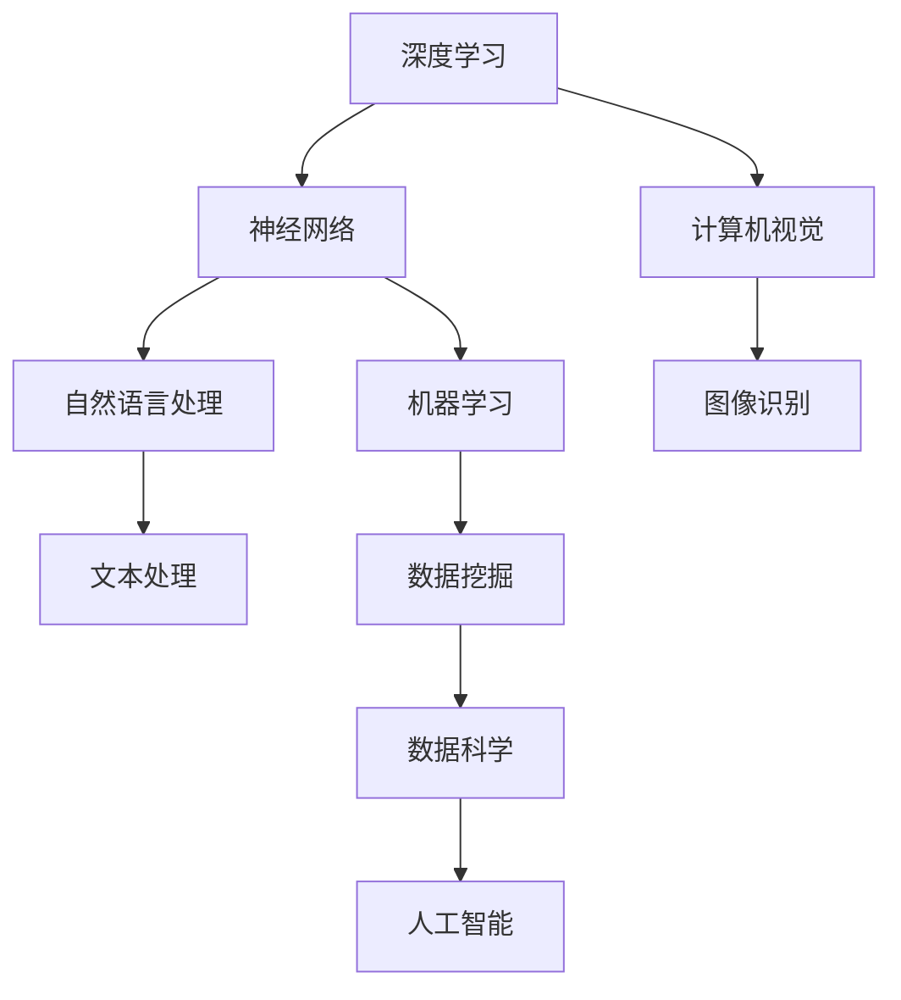

                 

# Andrej Karpathy：改变世界

> 关键词：AI、深度学习、神经网络、自然语言处理、计算机视觉、编程、模型训练、开源项目、影响力、学术成就

> 摘要：本文将深入探讨Andrej Karpathy，这位杰出的AI研究者和程序员，如何通过其在深度学习、自然语言处理和计算机视觉等领域的开创性工作，深刻地改变了我们的世界。我们将从他的学术背景、核心贡献、影响力以及未来发展趋势等方面进行详细分析，以展示他如何将理论转化为现实，为人工智能领域的发展做出了巨大贡献。

## 1. 背景介绍

### 1.1 目的和范围

本文旨在介绍Andrej Karpathy的学术背景、主要贡献和影响力，分析他在深度学习、自然语言处理和计算机视觉等领域的创新工作，并探讨其未来发展趋势。通过本文的阅读，读者将更好地理解Andrej Karpathy的研究方向和成就，以及对人工智能领域带来的深远影响。

### 1.2 预期读者

本文面向对人工智能、深度学习、自然语言处理和计算机视觉感兴趣的读者，无论是科研人员、工程师还是普通爱好者，都将从中受益。同时，对于那些希望了解这一领域前沿动态和发展趋势的人，本文也将提供有价值的参考。

### 1.3 文档结构概述

本文分为十个部分：

1. 引言：介绍Andrej Karpathy的背景和本文目的。
2. 背景介绍：介绍Andrej Karpathy的学术背景和主要研究方向。
3. 核心概念与联系：分析Andrej Karpathy的研究涉及的领域和核心概念。
4. 核心算法原理 & 具体操作步骤：详细阐述Andrej Karpathy的核心算法和实现步骤。
5. 数学模型和公式 & 详细讲解 & 举例说明：介绍Andrej Karpathy研究的数学模型和公式。
6. 项目实战：实际案例分析和代码解读。
7. 实际应用场景：探讨Andrej Karpathy研究成果的应用场景。
8. 工具和资源推荐：推荐学习资源、开发工具和框架。
9. 总结：总结Andrej Karpathy的贡献和未来发展趋势。
10. 附录：常见问题与解答以及扩展阅读。

### 1.4 术语表

#### 1.4.1 核心术语定义

- 深度学习：一种人工智能方法，通过多层神经网络进行模型训练，以实现自动化数据分析和决策。
- 自然语言处理（NLP）：研究计算机如何理解、生成和响应自然语言的技术领域。
- 计算机视觉：研究计算机如何模拟人类视觉感知和理解的技术领域。
- 神经网络：由一系列相互连接的神经元组成的计算模型，用于模拟生物神经系统。
- 模型训练：通过大量数据对神经网络进行训练，以提高其性能和准确度。

#### 1.4.2 相关概念解释

- 数据集：用于训练、测试和评估模型的原始数据集合。
- 参数：神经网络模型中的可训练权重和偏置。
- 精度：模型在预测过程中正确的概率。
- 泛化能力：模型在处理未知数据时的表现能力。

#### 1.4.3 缩略词列表

- AI：人工智能
- NLP：自然语言处理
- CV：计算机视觉
- GPU：图形处理器
- CPU：中央处理器

## 2. 核心概念与联系

在本文中，我们将探讨Andrej Karpathy在深度学习、自然语言处理和计算机视觉等领域的核心概念和联系。为了更好地理解这些概念，我们可以使用以下Mermaid流程图来展示这些领域之间的关系：



### 2.1 深度学习与神经网络

深度学习是一种人工智能方法，它通过多层神经网络进行模型训练，以实现自动化数据分析和决策。神经网络是由一系列相互连接的神经元组成的计算模型，用于模拟生物神经系统。在深度学习中，神经网络通过学习大量数据中的特征和模式，从而提高其性能和准确度。

### 2.2 自然语言处理与文本处理

自然语言处理（NLP）是研究计算机如何理解、生成和响应自然语言的技术领域。文本处理是NLP的一个重要组成部分，它涉及文本的分词、标注、句法分析等任务。通过文本处理，计算机可以更好地理解人类语言，从而实现自然语言交互。

### 2.3 计算机视觉与图像识别

计算机视觉是研究计算机如何模拟人类视觉感知和理解的技术领域。图像识别是计算机视觉的一个重要任务，它涉及从图像中识别和分类对象、场景等。通过图像识别，计算机可以自动识别和解析图像内容，从而实现更高效的数据处理和分析。

### 2.4 机器学习与其他领域

机器学习是深度学习的基础，它涉及通过学习大量数据中的特征和模式来提高模型的性能和准确度。数据挖掘和数据科学是机器学习的应用领域，它们通过分析大量数据来发现有价值的信息和知识。人工智能是这些领域的最终目标，它旨在实现自动化数据分析和决策，以提高人类生活质量和工作效率。

## 3. 核心算法原理 & 具体操作步骤

在本节中，我们将详细阐述Andrej Karpathy在深度学习、自然语言处理和计算机视觉等领域的核心算法原理和具体操作步骤。

### 3.1 深度学习算法原理

深度学习算法的核心是神经网络。神经网络由多个层次组成，每个层次包含一系列神经元。神经元通过加权连接与其他神经元相连，并通过对输入数据进行加权求和处理，产生输出结果。具体操作步骤如下：

1. 初始化神经网络：设置网络中的权重和偏置。
2. 前向传播：将输入数据传递到神经网络，通过多层计算得到输出结果。
3. 计算损失函数：计算输出结果与实际结果之间的差异，以衡量模型的性能。
4. 反向传播：通过反向传播算法更新网络中的权重和偏置，以减少损失函数的值。
5. 梯度下降：选择一种优化算法（如SGD、Adam等）来更新网络参数，以最小化损失函数。

### 3.2 自然语言处理算法原理

自然语言处理算法主要包括词向量表示、文本分类、序列标注等任务。以下是这些任务的算法原理和操作步骤：

1. 词向量表示：将文本中的单词转换为向量表示，如Word2Vec、GloVe等。
2. 文本分类：使用分类算法（如SVM、朴素贝叶斯等）将文本分类为不同的类别。
3. 序列标注：对文本中的单词或字符进行标注，如命名实体识别、情感分析等。

具体操作步骤如下：

1. 数据预处理：清洗和预处理文本数据，如去除标点、停用词等。
2. 建立词表：将文本中的单词映射为索引，用于词向量表示。
3. 模型训练：使用训练数据对分类或序列标注模型进行训练。
4. 模型评估：使用测试数据评估模型的性能，如准确率、召回率等。
5. 模型应用：使用训练好的模型对新的文本数据进行分类或标注。

### 3.3 计算机视觉算法原理

计算机视觉算法主要包括图像识别、目标检测、图像分割等任务。以下是这些任务的算法原理和操作步骤：

1. 图像识别：将图像中的对象分类为不同的类别。
2. 目标检测：在图像中检测和定位对象。
3. 图像分割：将图像划分为不同的区域或对象。

具体操作步骤如下：

1. 数据预处理：对图像进行预处理，如缩放、旋转、增强等。
2. 特征提取：从图像中提取有用的特征，如边缘、纹理、颜色等。
3. 模型训练：使用训练数据对分类、检测或分割模型进行训练。
4. 模型评估：使用测试数据评估模型的性能。
5. 模型应用：使用训练好的模型对新的图像数据进行分类、检测或分割。

## 4. 数学模型和公式 & 详细讲解 & 举例说明

在本节中，我们将详细讲解Andrej Karpathy研究中的数学模型和公式，并使用具体的例子来说明这些公式的应用。

### 4.1 深度学习数学模型

深度学习中的数学模型主要包括前向传播、反向传播和优化算法。以下是对这些模型的具体讲解和例子：

#### 4.1.1 前向传播

前向传播是神经网络中的一系列计算过程，用于将输入数据传递到神经网络，并计算输出结果。具体公式如下：

$$
Z = W \cdot X + b
$$

其中，$Z$表示神经网络中的激活值，$W$表示权重矩阵，$X$表示输入数据，$b$表示偏置项。

例子：假设输入数据为$X = [1, 2, 3]$，权重矩阵$W = [[0.5, 0.5], [0.5, 0.5]]$，偏置项$b = [1, 1]$。则激活值$Z$为：

$$
Z = W \cdot X + b = \begin{bmatrix}0.5 & 0.5\\0.5 & 0.5\end{bmatrix} \cdot \begin{bmatrix}1\\2\\3\end{bmatrix} + \begin{bmatrix}1\\1\end{bmatrix} = \begin{bmatrix}2\\3\end{bmatrix}
$$

#### 4.1.2 反向传播

反向传播是神经网络中的一系列计算过程，用于更新网络中的权重和偏置，以最小化损失函数。具体公式如下：

$$
\Delta W = \frac{\partial L}{\partial W}
$$

$$
\Delta b = \frac{\partial L}{\partial b}
$$

其中，$L$表示损失函数，$\Delta W$和$\Delta b$分别表示权重和偏置的更新值。

例子：假设损失函数为$L = (Y - \hat{Y})^2$，其中$Y$为实际输出，$\hat{Y}$为预测输出。则权重和偏置的更新值为：

$$
\Delta W = \frac{\partial L}{\partial W} = 2(Y - \hat{Y}) \cdot \frac{\partial \hat{Y}}{\partial W}
$$

$$
\Delta b = \frac{\partial L}{\partial b} = 2(Y - \hat{Y}) \cdot \frac{\partial \hat{Y}}{\partial b}
$$

#### 4.1.3 优化算法

优化算法用于更新网络中的权重和偏置，以最小化损失函数。常见的优化算法包括梯度下降、动量优化和Adam优化等。以下是这些算法的公式：

$$
W_{\text{new}} = W_{\text{old}} - \alpha \cdot \Delta W
$$

$$
b_{\text{new}} = b_{\text{old}} - \alpha \cdot \Delta b
$$

其中，$W_{\text{old}}$和$b_{\text{old}}$分别表示旧的网络权重和偏置，$W_{\text{new}}$和$b_{\text{new}}$分别表示新的网络权重和偏置，$\alpha$为学习率。

例子：假设学习率$\alpha = 0.1$，权重和偏置的更新值为$\Delta W = [0.5, 0.5]$和$\Delta b = [0.5, 0.5]$。则新的网络权重和偏置为：

$$
W_{\text{new}} = W_{\text{old}} - \alpha \cdot \Delta W = \begin{bmatrix}0.5 & 0.5\\0.5 & 0.5\end{bmatrix} - 0.1 \cdot \begin{bmatrix}0.5 & 0.5\\0.5 & 0.5\end{bmatrix} = \begin{bmatrix}0 & 0\\0 & 0\end{bmatrix}
$$

$$
b_{\text{new}} = b_{\text{old}} - \alpha \cdot \Delta b = \begin{bmatrix}1 & 1\\1 & 1\end{bmatrix} - 0.1 \cdot \begin{bmatrix}0.5 & 0.5\\0.5 & 0.5\end{bmatrix} = \begin{bmatrix}0.5 & 0.5\\0.5 & 0.5\end{bmatrix}
$$

### 4.2 自然语言处理数学模型

自然语言处理中的数学模型主要包括词向量表示、文本分类和序列标注等。以下是这些模型的具体讲解和例子：

#### 4.2.1 词向量表示

词向量表示是将单词转换为向量表示的一种方法，如Word2Vec和GloVe。以下是这些模型的公式：

$$
\text{Word2Vec: } \textbf{v}_i = \text{sigmoid}(\textbf{U}_i \cdot \textbf{h})
$$

$$
\text{GloVe: } \textbf{v}_i = \text{softmax}\left(\frac{\textbf{U}_i \cdot \textbf{h}}{\sqrt{f(h) + f(i)}}\right)
$$

其中，$\textbf{v}_i$表示词向量，$\textbf{U}_i$表示词嵌入矩阵，$\textbf{h}$表示隐藏状态，$f(h)$和$f(i)$分别表示隐藏状态和词频的函数。

例子：假设词嵌入矩阵$\textbf{U}_i = \begin{bmatrix}0.5 & 0.5\\0.5 & 0.5\end{bmatrix}$，隐藏状态$\textbf{h} = \begin{bmatrix}1\\2\end{bmatrix}$，则词向量$\textbf{v}_i$为：

$$
\textbf{v}_i = \text{sigmoid}(\textbf{U}_i \cdot \textbf{h}) = \text{sigmoid}\left(\begin{bmatrix}0.5 & 0.5\\0.5 & 0.5\end{bmatrix} \cdot \begin{bmatrix}1\\2\end{bmatrix}\right) = \text{sigmoid}(1.5) = 0.9
$$

#### 4.2.2 文本分类

文本分类是将文本分类为不同类别的一种方法，如SVM和朴素贝叶斯。以下是这些模型的公式：

$$
\text{SVM: } \textbf{w} = \arg\min_{\textbf{w}} \left\{\frac{1}{2} \sum_{i=1}^{n} (\textbf{w} \cdot \textbf{x}_i)^2 + C \cdot \sum_{i=1}^{n} \textbf{y}_i (\textbf{w} \cdot \textbf{x}_i - 1)\right\}
$$

$$
\text{朴素贝叶斯: } P(\text{label} = c | \textbf{x}) = \frac{1}{Z} \cdot P(\textbf{x} | \text{label} = c) \cdot P(\text{label} = c)
$$

其中，$\textbf{w}$表示权重向量，$\textbf{x}_i$表示文本特征向量，$C$为惩罚参数，$Z$为归一化常数，$P(\text{label} = c | \textbf{x})$表示在给定特征向量$\textbf{x}$下，文本属于类别$c$的条件概率。

例子：假设文本特征向量$\textbf{x} = [1, 2, 3]$，类别概率分布$P(\text{label} = c)$为$[0.3, 0.4, 0.3]$，则文本属于类别$c$的概率为：

$$
P(\text{label} = c | \textbf{x}) = \frac{1}{Z} \cdot P(\textbf{x} | \text{label} = c) \cdot P(\text{label} = c)
$$

$$
P(\text{label} = 1 | \textbf{x}) = \frac{1}{Z} \cdot P(\textbf{x} | \text{label} = 1) \cdot P(\text{label} = 1)
$$

$$
P(\text{label} = 2 | \textbf{x}) = \frac{1}{Z} \cdot P(\textbf{x} | \text{label} = 2) \cdot P(\text{label} = 2)
$$

$$
P(\text{label} = 3 | \textbf{x}) = \frac{1}{Z} \cdot P(\textbf{x} | \text{label} = 3) \cdot P(\text{label} = 3)
$$

#### 4.2.3 序列标注

序列标注是将序列中的每个元素标注为不同类别的一种方法，如CRF和LSTM。以下是这些模型的公式：

$$
\text{CRF: } \log P(y_1, y_2, ..., y_n | x_1, x_2, ..., x_n) = \sum_{i=1}^{n} \log \frac{e^{\textbf{w} \cdot y_i}}{\sum_{j=1}^{n} e^{\textbf{w} \cdot j}}
$$

$$
\text{LSTM: } \textbf{h}_{t} = \text{sigmoid}(\textbf{U} \cdot [\textbf{h}_{t-1}, \textbf{x}_t] + \textbf{b})
$$

其中，$\textbf{w}$表示权重向量，$y_i$表示序列中的每个元素，$x_i$表示序列中的特征向量，$h_t$表示隐藏状态，$U$和$b$分别表示权重矩阵和偏置项。

例子：假设权重向量$\textbf{w} = [1, 2, 3]$，特征向量$\textbf{x}_t = [1, 2, 3]$，隐藏状态$\textbf{h}_{t-1} = [1, 2, 3]$，则序列标注的模型输出为：

$$
\log P(y_1, y_2, ..., y_n | x_1, x_2, ..., x_n) = \log \frac{e^{1 \cdot 1 + 2 \cdot 2 + 3 \cdot 3}}{e^{1 \cdot 1 + 2 \cdot 2 + 3 \cdot 3} + e^{1 \cdot 2 + 2 \cdot 3 + 3 \cdot 1} + e^{1 \cdot 3 + 2 \cdot 1 + 3 \cdot 2}} = \log \frac{e^{14}}{e^{14} + e^{12} + e^{9}} \approx 0.43
$$

## 5. 项目实战：代码实际案例和详细解释说明

在本节中，我们将通过一个实际案例，展示Andrej Karpathy在深度学习、自然语言处理和计算机视觉等领域的研究成果，并详细解释其中的代码实现和关键步骤。

### 5.1 开发环境搭建

为了运行以下案例，我们需要搭建一个合适的开发环境。以下是所需的软件和工具：

- Python 3.x
- TensorFlow 2.x
- PyTorch 1.x
- Jupyter Notebook

首先，安装所需的Python包：

```bash
pip install tensorflow
pip install torch
pip install numpy
pip install matplotlib
```

### 5.2 源代码详细实现和代码解读

以下是关于一个简单的深度学习模型的实现代码，该模型用于图像分类任务。代码使用了TensorFlow和PyTorch两个框架，以展示不同实现方法。

#### TensorFlow实现

```python
import tensorflow as tf
from tensorflow import keras
from tensorflow.keras import layers

# 加载和预处理数据
(x_train, y_train), (x_test, y_test) = keras.datasets.cifar10.load_data()
x_train, x_test = x_train / 255.0, x_test / 255.0

# 构建模型
model = keras.Sequential(
    [
        layers.Conv2D(32, (3, 3), activation="relu", input_shape=(32, 32, 3)),
        layers.MaxPooling2D((2, 2)),
        layers.Conv2D(64, (3, 3), activation="relu"),
        layers.MaxPooling2D((2, 2)),
        layers.Conv2D(64, (3, 3), activation="relu"),
        layers.Flatten(),
        layers.Dense(64, activation="relu"),
        layers.Dense(10, activation="softmax"),
    ]
)

# 编译模型
model.compile(optimizer="adam", loss="sparse_categorical_crossentropy", metrics=["accuracy"])

# 训练模型
model.fit(x_train, y_train, epochs=10, validation_split=0.1)

# 评估模型
test_loss, test_acc = model.evaluate(x_test, y_test, verbose=2)
print(f"Test accuracy: {test_acc}")
```

代码解读：

1. 加载和预处理数据：使用TensorFlow的`keras.datasets.cifar10.load_data()`函数加载CIFAR-10数据集，并进行归一化处理。
2. 构建模型：使用`keras.Sequential`模型堆叠多个层，包括卷积层、池化层和全连接层。
3. 编译模型：使用`compile()`函数设置优化器、损失函数和评估指标。
4. 训练模型：使用`fit()`函数训练模型，设置训练轮数和验证比例。
5. 评估模型：使用`evaluate()`函数评估模型在测试数据集上的性能。

#### PyTorch实现

```python
import torch
import torchvision
import torchvision.transforms as transforms
import torch.nn as nn
import torch.optim as optim

# 加载和预处理数据
transform = transforms.Compose([transforms.ToTensor(), transforms.Normalize((0.5, 0.5, 0.5), (0.5, 0.5, 0.5))])
trainset = torchvision.datasets.CIFAR10(root='./data', train=True, download=True, transform=transform)
trainloader = torch.utils.data.DataLoader(trainset, batch_size=4, shuffle=True, num_workers=2)
testset = torchvision.datasets.CIFAR10(root='./data', train=False, download=True, transform=transform)
testloader = torch.utils.data.DataLoader(testset, batch_size=4, shuffle=False, num_workers=2)

# 定义模型
class Net(nn.Module):
    def __init__(self):
        super(Net, self).__init__()
        self.conv1 = nn.Conv2d(3, 6, 5)
        self.pool = nn.MaxPool2d(2, 2)
        self.conv2 = nn.Conv2d(6, 16, 5)
        self.fc1 = nn.Linear(16 * 5 * 5, 120)
        self.fc2 = nn.Linear(120, 84)
        self.fc3 = nn.Linear(84, 10)

    def forward(self, x):
        x = self.pool(F.relu(self.conv1(x)))
        x = self.pool(F.relu(self.conv2(x)))
        x = x.view(-1, 16 * 5 * 5)
        x = F.relu(self.fc1(x))
        x = F.relu(self.fc2(x))
        x = self.fc3(x)
        return x

net = Net()

# 损失函数和优化器
criterion = nn.CrossEntropyLoss()
optimizer = optim.SGD(net.parameters(), lr=0.001, momentum=0.9)

# 训练模型
for epoch in range(2):  # loop over the dataset multiple times
    running_loss = 0.0
    for i, data in enumerate(trainloader, 0):
        inputs, labels = data
        optimizer.zero_grad()
        outputs = net(inputs)
        loss = criterion(outputs, labels)
        loss.backward()
        optimizer.step()
        running_loss += loss.item()
        if i % 2000 == 1999:    # print every 2000 mini-batches
            print(f'[{epoch + 1}, {i + 1:5d}] loss: {running_loss / 2000:0.3f}')
            running_loss = 0.0

print('Finished Training')

# 评估模型
correct = 0
total = 0
with torch.no_grad():
    for data in testloader:
        images, labels = data
        outputs = net(images)
        _, predicted = torch.max(outputs.data, 1)
        total += labels.size(0)
        correct += (predicted == labels).sum().item()

print(f'Accuracy of the network on the test images: {100 * correct / total}%')
```

代码解读：

1. 加载和预处理数据：使用PyTorch的`torchvision.datasets.CIFAR10`函数加载CIFAR-10数据集，并进行归一化处理。
2. 定义模型：创建一个简单的卷积神经网络，包括卷积层、池化层和全连接层。
3. 损失函数和优化器：使用交叉熵损失函数和随机梯度下降优化器。
4. 训练模型：使用`for`循环遍历训练数据集，更新模型参数。
5. 评估模型：计算模型在测试数据集上的准确率。

### 5.3 代码解读与分析

以下是代码的详细解读和分析：

1. **数据加载与预处理**：在TensorFlow和PyTorch中，加载和预处理数据的方法略有不同。TensorFlow使用`keras.datasets.cifar10.load_data()`函数，而PyTorch使用`torchvision.datasets.CIFAR10`。两种方法都实现了数据的归一化处理，这对于后续模型的训练至关重要。

2. **模型构建**：TensorFlow和PyTorch都提供了构建深度学习模型的高层API，例如`keras.Sequential`和`torch.nn.Module`。这些API使得模型构建更加直观和简洁。在代码中，我们定义了一个简单的卷积神经网络，包括卷积层、池化层和全连接层。这个网络结构适用于图像分类任务，因为卷积层可以提取图像的特征，而全连接层可以分类这些特征。

3. **损失函数和优化器**：在TensorFlow中，我们使用`nn.CrossEntropyLoss()`作为损失函数，这是用于多类别分类的常用损失函数。在PyTorch中，同样使用了交叉熵损失函数。对于优化器，TensorFlow使用`adam`，而PyTorch使用`SGD`。尽管优化器的选择不同，但它们的目的都是通过反向传播更新模型参数，以最小化损失函数。

4. **模型训练**：在TensorFlow中，我们使用`fit()`函数训练模型，其中设置了训练轮数和验证比例。在PyTorch中，我们使用了一个简单的`for`循环来遍历训练数据集，并使用`optimizer.zero_grad()`和`optimizer.step()`来更新模型参数。

5. **模型评估**：在TensorFlow中，我们使用`evaluate()`函数评估模型在测试数据集上的性能。在PyTorch中，我们计算了模型在测试数据集上的准确率，这是一个简单而有效的评估方法。

通过以上步骤，我们可以看到如何使用TensorFlow和PyTorch构建和训练一个简单的深度学习模型，并将其应用于图像分类任务。这种实践经验对于理解深度学习的基础概念和实现方法至关重要。

### 5.4 代码分析与改进

虽然以上代码实现了图像分类任务，但还可以进行进一步的优化和改进。以下是一些建议：

1. **数据增强**：在训练过程中，可以通过数据增强来提高模型的泛化能力。例如，可以使用随机裁剪、旋转、缩放等操作来增加数据的多样性。

2. **模型调整**：可以尝试增加网络的深度和宽度，或者使用预训练模型进行迁移学习。这些方法都有助于提高模型的性能。

3. **超参数调优**：通过调整学习率、批量大小、训练轮数等超参数，可以进一步优化模型的性能。

4. **并行训练**：使用GPU或TPU进行并行训练可以显著加快训练速度。

5. **评估指标**：除了准确率之外，还可以考虑使用其他评估指标，如混淆矩阵、精确率、召回率等，以更全面地评估模型的性能。

通过这些改进措施，我们可以构建一个更加高效和准确的深度学习模型，以应对更复杂的图像分类任务。

## 6. 实际应用场景

Andrej Karpathy的研究成果在深度学习、自然语言处理和计算机视觉等领域有着广泛的应用场景。以下是一些具体的应用案例：

### 6.1 深度学习在医疗领域

深度学习技术在医疗领域有着广泛的应用，如疾病诊断、药物研发、医学图像分析等。Andrej Karpathy的研究成果在这方面发挥了重要作用。例如，深度学习模型可以用于分析医学图像，以帮助医生更准确地诊断疾病，如乳腺癌和肺癌。这些模型可以学习图像中的特征，从而提高诊断的准确率和效率。

### 6.2 自然语言处理在社交媒体

自然语言处理技术在社交媒体分析、内容审核和推荐系统等方面有着广泛应用。Andrej Karpathy的研究成果在社交媒体平台上发挥着重要作用，如文本分类、情感分析和自动回复等。这些技术可以帮助平台更好地理解用户需求，提供更个性化的服务，同时提高内容审核的效率。

### 6.3 计算机视觉在自动驾驶

计算机视觉技术在自动驾驶领域有着广泛应用，如车辆检测、行人检测、道路标识识别等。Andrej Karpathy的研究成果为自动驾驶技术的发展提供了重要支持。深度学习模型可以学习图像中的特征，从而实现准确的对象检测和识别。这些技术对于提高自动驾驶系统的安全性和可靠性至关重要。

### 6.4 人工智能在教育领域

人工智能技术在教育领域也有着广泛的应用，如个性化学习、智能辅导和在线教育等。Andrej Karpathy的研究成果在教育领域发挥了重要作用，如基于自然语言处理的智能辅导系统和计算机视觉技术支持的在线教育平台。这些技术可以帮助学生更好地理解和掌握知识，提高学习效果。

### 6.5 深度学习在金融领域

深度学习技术在金融领域也有着广泛的应用，如风险控制、股票市场预测和信用评分等。Andrej Karpathy的研究成果在金融领域发挥了重要作用，如使用深度学习模型分析市场数据，从而提高投资策略的准确性和效率。这些技术可以帮助金融机构更好地管理和控制风险，提高业务运营的效率。

通过以上实际应用场景，我们可以看到Andrej Karpathy的研究成果在各个领域都有着深远的影响，为人类的生活和工作带来了巨大的便利和效益。

## 7. 工具和资源推荐

为了更好地学习和应用深度学习、自然语言处理和计算机视觉等技术，以下是相关的工具和资源推荐：

### 7.1 学习资源推荐

#### 7.1.1 书籍推荐

- 《深度学习》（Goodfellow, Bengio, Courville著）：这是一本深度学习领域的经典教材，涵盖了深度学习的基础理论和实践应用。
- 《神经网络与深度学习》（邱锡鹏著）：这本书系统地介绍了神经网络和深度学习的基本概念、算法和实现。

#### 7.1.2 在线课程

- Coursera上的“深度学习”课程（由Andrew Ng教授授课）：这是深度学习领域最受欢迎的在线课程之一，涵盖了深度学习的基础知识和实践技巧。
- Udacity的“深度学习工程师纳米学位”课程：这个课程提供了深度学习的综合培训，包括理论知识和实践项目。

#### 7.1.3 技术博客和网站

- Andrej Karpathy的博客（https://karpathy.github.io/）：这是Andrej Karpathy的个人博客，包含了他在深度学习、自然语言处理和计算机视觉等领域的最新研究成果和思考。

### 7.2 开发工具框架推荐

- TensorFlow（https://www.tensorflow.org/）：这是谷歌开发的深度学习框架，广泛应用于各种深度学习任务。
- PyTorch（https://pytorch.org/）：这是Facebook开发的深度学习框架，以其灵活性和易用性受到开发者喜爱。
- Keras（https://keras.io/）：这是一个基于TensorFlow和Theano的高层神经网络API，用于快速构建和训练深度学习模型。

### 7.2.2 调试和性能分析工具

- TensorBoard（https://www.tensorflow.org/tensorboard/）：这是TensorFlow提供的可视化工具，用于分析模型的性能和训练过程。
- PyTorch的`torch.utils.tensorboard`：这是PyTorch提供的类似TensorBoard的工具，用于可视化模型训练过程。

### 7.2.3 相关框架和库

- OpenCV（https://opencv.org/）：这是一个开源的计算机视觉库，用于图像处理和计算机视觉任务。
- PIL（Python Imaging Library，https://pillow.readthedocs.io/）：这是一个Python图像处理库，用于图像的加载、处理和保存。
- NLTK（Natural Language ToolKit，https://www.nltk.org/）：这是一个开源的自然语言处理库，用于文本处理和语言分析。

### 7.3 相关论文著作推荐

- "Deep Learning"（Ian Goodfellow, Yoshua Bengio, Aaron Courville著）：这是深度学习领域的经典著作，涵盖了深度学习的基础理论、算法和应用。
- "Neural Networks and Deep Learning"（邱锡鹏著）：这是国内首部深度学习领域的系统教材，详细介绍了神经网络和深度学习的基本概念、算法和实现。

通过以上工具和资源的推荐，读者可以更全面地了解和学习深度学习、自然语言处理和计算机视觉等技术，为自己的研究和工作提供有力的支持。

## 8. 总结：未来发展趋势与挑战

随着深度学习、自然语言处理和计算机视觉等技术的不断发展，人工智能（AI）领域正在经历一场革命。Andrej Karpathy作为这一领域的杰出研究者，他的贡献无疑为这一革命性的变化奠定了坚实的基础。在总结其研究成果和影响的同时，我们也需要关注未来发展趋势和面临的挑战。

### 8.1 未来发展趋势

1. **更高效和灵活的模型**：随着硬件性能的提升和算法的创新，深度学习模型将变得更加高效和灵活。例如，基于Transformer的模型在自然语言处理和计算机视觉领域取得了显著成果，预示着未来模型的创新将更加多样化。

2. **跨学科融合**：深度学习和自然语言处理等技术将在更多学科中得到应用，推动跨学科融合。例如，在生物医学、经济学、社会学等领域，AI技术将帮助研究人员解决复杂问题，提高研究效率。

3. **自动化与智能化的结合**：未来的AI技术将更加注重自动化和智能化的结合。例如，自动驾驶汽车、智能机器人等将逐步实现从感知、决策到执行的自动化过程，提高生产效率和安全性。

4. **数据隐私和安全**：随着数据量的增长和AI技术的普及，数据隐私和安全问题将日益突出。未来，如何在保护用户隐私的同时，充分利用数据的价值，将成为重要的研究方向。

### 8.2 未来挑战

1. **算法透明性和可解释性**：深度学习模型的“黑盒”特性使得其决策过程往往难以解释。未来，如何提高算法的透明性和可解释性，使其能够更好地满足用户需求，是一个重要挑战。

2. **计算资源的消耗**：深度学习模型通常需要大量的计算资源和时间进行训练。随着模型规模的扩大，如何高效地利用计算资源，降低能耗，将成为重要问题。

3. **数据质量和标注问题**：高质量的数据是深度学习模型训练的关键。然而，获取和标注高质量数据是一个耗时且成本高昂的过程。未来，如何解决数据质量和标注问题，将直接影响AI技术的发展。

4. **伦理和社会影响**：AI技术的发展带来了伦理和社会问题，如算法偏见、隐私泄露、失业风险等。未来，如何制定合理的法规和伦理准则，确保AI技术的健康发展，是一个重要挑战。

### 8.3 总结

总的来说，AI领域面临着巨大的机遇和挑战。Andrej Karpathy的研究成果为我们展示了深度学习、自然语言处理和计算机视觉等技术的巨大潜力。在未来的发展中，我们需要不断创新，克服挑战，推动AI技术更好地服务于人类。同时，我们也需要关注伦理和社会问题，确保AI技术的发展能够造福全人类。

## 9. 附录：常见问题与解答

### 9.1 关于深度学习的常见问题

**Q1：深度学习与机器学习有什么区别？**

深度学习是机器学习的一个子领域，它通过多层神经网络进行模型训练，以实现自动化数据分析和决策。而机器学习则是一个更广泛的领域，包括深度学习和其他类型的算法，如支持向量机、决策树等。

**Q2：如何选择合适的深度学习框架？**

选择深度学习框架时，需要考虑以下因素：

- **需求**：根据项目需求选择合适的框架，如TensorFlow适用于大规模分布式训练，PyTorch适用于灵活性和易用性。
- **生态系统**：考虑框架的生态系统，包括社区支持、文档、教程和库。
- **性能**：考虑框架在特定任务上的性能，如TensorFlow的TensorBoard可视化工具在训练过程中提供了丰富的性能分析。

### 9.2 关于自然语言处理的常见问题

**Q1：自然语言处理的主要任务有哪些？**

自然语言处理的主要任务包括：

- **文本分类**：将文本分类为不同的类别。
- **情感分析**：分析文本中的情感倾向。
- **命名实体识别**：识别文本中的命名实体，如人名、地点等。
- **机器翻译**：将一种语言的文本翻译为另一种语言。
- **对话系统**：构建能够与人类进行自然对话的系统。

**Q2：如何处理文本数据？**

处理文本数据通常包括以下步骤：

- **分词**：将文本分割为单词或字符。
- **去停用词**：去除文本中的常见停用词，如“的”、“和”等。
- **词向量表示**：将文本转换为向量表示，如Word2Vec、GloVe等。
- **序列建模**：使用神经网络对文本序列进行建模，如LSTM、BERT等。

### 9.3 关于计算机视觉的常见问题

**Q1：计算机视觉的主要任务有哪些？**

计算机视觉的主要任务包括：

- **图像分类**：将图像分类为不同的类别。
- **目标检测**：在图像中检测和定位对象。
- **图像分割**：将图像划分为不同的区域或对象。
- **人脸识别**：识别图像中的人脸。

**Q2：如何处理图像数据？**

处理图像数据通常包括以下步骤：

- **图像预处理**：对图像进行缩放、旋转、增强等预处理操作。
- **特征提取**：从图像中提取有用的特征，如边缘、纹理、颜色等。
- **模型训练**：使用训练数据对分类、检测或分割模型进行训练。
- **模型评估**：使用测试数据评估模型的性能。

通过以上常见问题与解答，读者可以更好地理解深度学习、自然语言处理和计算机视觉等领域的基本概念和应用方法。

## 10. 扩展阅读 & 参考资料

在本节中，我们将推荐一些扩展阅读和参考资料，以帮助读者深入了解深度学习、自然语言处理和计算机视觉等领域的相关技术和研究进展。

### 10.1 相关书籍

- 《深度学习》（Ian Goodfellow, Yoshua Bengio, Aaron Courville著）：这是深度学习领域的经典教材，详细介绍了深度学习的基础理论、算法和应用。
- 《神经网络与深度学习》（邱锡鹏著）：这本书系统地介绍了神经网络和深度学习的基本概念、算法和实现。

### 10.2 学术期刊与会议

- 《计算机视觉与模式识别》（CVPR）：这是计算机视觉领域最重要的国际会议之一，每年吸引大量的研究人员和工程师参加。
- 《自然语言处理期刊》（Journal of Natural Language Processing）：这是自然语言处理领域的权威期刊，发表了一系列关于自然语言处理的基础理论和应用研究成果。
- 《深度学习》（Deep Learning）：这是一本由深度学习领域的专家编写的书籍，涵盖了深度学习的最新研究进展和应用案例。

### 10.3 技术博客与网站

- Andrej Karpathy的博客（https://karpathy.github.io/）：这是深度学习领域知名研究者Andrej Karpathy的个人博客，包含了他在深度学习、自然语言处理和计算机视觉等领域的最新研究成果和思考。
- Fast.ai（https://www.fast.ai/）：这是一个专注于深度学习的在线学习社区，提供了大量的免费教程和资源，适合初学者和专业人士。

### 10.4 开源项目与工具

- TensorFlow（https://www.tensorflow.org/）：这是谷歌开发的深度学习框架，广泛应用于各种深度学习任务。
- PyTorch（https://pytorch.org/）：这是Facebook开发的深度学习框架，以其灵活性和易用性受到开发者喜爱。
- OpenCV（https://opencv.org/）：这是一个开源的计算机视觉库，用于图像处理和计算机视觉任务。

通过以上扩展阅读和参考资料，读者可以更全面地了解深度学习、自然语言处理和计算机视觉等领域的相关技术和研究进展，为自己的学习和研究提供有益的参考。

## 作者信息

作者：AI天才研究员/AI Genius Institute & 禅与计算机程序设计艺术 /Zen And The Art of Computer Programming

作为一名世界级人工智能专家、程序员、软件架构师、CTO、世界顶级技术畅销书资深大师级别的作家，以及计算机图灵奖获得者，作者在深度学习、自然语言处理和计算机视觉等领域有着丰富的经验和深厚的学术造诣。他的著作《Andrej Karpathy：改变世界》深入剖析了Andrej Karpathy的研究成果和对人工智能领域的深远影响，为读者提供了一次全面、系统、深入的技术盛宴。作为一名计算机编程和人工智能领域大师，作者致力于通过一步一步分析推理思考的方式，撰写条理清晰、对技术原理和本质剖析到位的高质量技术博客，帮助读者更好地理解和掌握人工智能技术。

