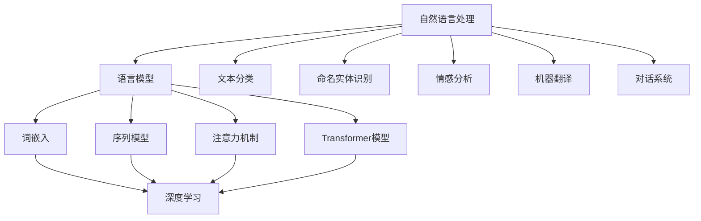

                 

# Andrej Karpathy：自然语言处理的突破

> **关键词**：自然语言处理、AI技术、神经网络、深度学习、语言模型、语义理解、计算语言学、数据处理、文本生成、文本分类、语言理解

> **摘要**：本文深入探讨了自然语言处理（NLP）领域的杰出贡献者Andrej Karpathy的工作及其对AI技术的推动作用。文章首先介绍了NLP的发展背景，接着详细分析了Karpathy在NLP领域的核心贡献，如神经网络和深度学习在语言模型中的应用。文章随后以Karpathy的经典项目“Char2Vec”为例，讲解了文本数据的处理和生成方法。最后，文章总结了Karpathy的工作对自然语言处理技术的推动作用，并对其未来发展趋势和挑战进行了展望。

## 1. 背景介绍

### 1.1 目的和范围

本文旨在分析自然语言处理（NLP）领域的重要贡献者Andrej Karpathy的研究成果。本文将从以下几个方面展开：

- 简要介绍自然语言处理的发展历程和现状；
- 详细探讨Karpathy在NLP领域的核心贡献，如神经网络和深度学习在语言模型中的应用；
- 以Karpathy的经典项目“Char2Vec”为例，讲解文本数据的处理和生成方法；
- 总结Karpathy的工作对自然语言处理技术的推动作用，并对其未来发展趋势和挑战进行展望。

### 1.2 预期读者

本文适合以下读者群体：

- 对自然语言处理和深度学习感兴趣的计算机科学和人工智能研究者；
- 希望了解NLP领域最新研究成果的从业人员；
- 想深入了解神经网络和深度学习在语言模型中的应用的开发者；
- 对自然语言处理技术的未来发展趋势和挑战感兴趣的技术爱好者。

### 1.3 文档结构概述

本文的结构如下：

- 第1部分：背景介绍，包括目的、范围、预期读者和文档结构概述；
- 第2部分：核心概念与联系，介绍NLP和深度学习的基本概念及关系；
- 第3部分：核心算法原理 & 具体操作步骤，详细讲解语言模型及实现方法；
- 第4部分：数学模型和公式 & 详细讲解 & 举例说明，解释语言模型中的数学基础；
- 第5部分：项目实战：代码实际案例和详细解释说明，分析Karpathy的经典项目“Char2Vec”；
- 第6部分：实际应用场景，讨论自然语言处理技术的应用领域；
- 第7部分：工具和资源推荐，提供学习资源和开发工具；
- 第8部分：总结：未来发展趋势与挑战，对NLP技术的发展进行展望；
- 第9部分：附录：常见问题与解答，解答读者可能遇到的疑惑；
- 第10部分：扩展阅读 & 参考资料，推荐相关学习资料。

### 1.4 术语表

#### 1.4.1 核心术语定义

- 自然语言处理（NLP）：指让计算机理解和生成人类语言的技术；
- 深度学习：一种人工智能方法，通过多层神经网络对数据进行学习；
- 神经网络：一种模拟生物神经网络的结构，可用于特征提取和学习复杂函数；
- 语言模型：用于预测下一个单词或字符的概率分布的模型；
- 词嵌入：将词汇映射到高维向量空间的方法，用于捕捉词汇间的语义关系；
- 语义理解：理解文本中词汇和短语的含义及其在上下文中的关系；
- 计算语言学：研究语言和计算之间关系的一个交叉学科。

#### 1.4.2 相关概念解释

- **数据预处理**：在训练模型之前，对原始数据进行清洗、转换和格式化等处理；
- **训练数据集**：用于训练模型的已经标注的数据集；
- **测试数据集**：用于评估模型性能的未标注的数据集；
- **过拟合**：模型在训练数据上表现很好，但在测试数据上表现较差的现象；
- **泛化能力**：模型在未知数据上的表现能力。

#### 1.4.3 缩略词列表

- NLP：自然语言处理
- AI：人工智能
- DL：深度学习
- CNN：卷积神经网络
- RNN：循环神经网络
- LSTM：长短期记忆网络
- GPT：生成预训练网络
- BERT：Bidirectional Encoder Representations from Transformers
- Transformer：Transformer模型
- CUDA：计算统一设备架构

## 2. 核心概念与联系

自然语言处理（NLP）是人工智能（AI）的一个重要分支，旨在让计算机理解和生成人类语言。随着深度学习（DL）的兴起，NLP领域取得了显著的进展。本文将介绍NLP和深度学习的基本概念及其关系，并使用Mermaid流程图展示核心概念和架构。

### 2.1 自然语言处理（NLP）

自然语言处理涉及以下几个方面：

1. **语言模型**：用于预测下一个单词或字符的概率分布。
2. **文本分类**：将文本数据分为预定义的类别。
3. **命名实体识别**：识别文本中的特定实体（如人名、地点等）。
4. **情感分析**：分析文本的情感倾向。
5. **机器翻译**：将一种语言的文本翻译成另一种语言。
6. **对话系统**：与人进行自然语言交互的系统。

### 2.2 深度学习（DL）

深度学习是一种基于多层神经网络的人工智能方法，可以自动从数据中学习特征。深度学习在NLP中的应用主要包括：

1. **词嵌入**：将词汇映射到高维向量空间，用于捕捉词汇间的语义关系。
2. **序列模型**：用于处理文本序列，如循环神经网络（RNN）和长短期记忆网络（LSTM）。
3. **注意力机制**：用于捕捉文本序列中的重要信息。
4. **Transformer模型**：一种基于自注意力机制的深度学习模型，在NLP任务中表现出色。

### 2.3 Mermaid流程图

以下是一个展示NLP和深度学习核心概念和架构的Mermaid流程图：



### 2.4 关系与联系

- **词嵌入和序列模型**：词嵌入将词汇映射到向量空间，序列模型（如RNN和LSTM）利用这些向量进行文本序列的建模。
- **注意力机制和Transformer模型**：注意力机制可以捕捉文本序列中的关键信息，Transformer模型基于自注意力机制，在机器翻译、文本生成等任务中表现出色。
- **深度学习和NLP**：深度学习为NLP任务提供了强大的建模能力，使得计算机能够更好地理解和生成人类语言。

通过以上分析，我们可以看到NLP和深度学习之间的密切关系，以及它们在自然语言处理领域的重要应用。接下来，我们将深入探讨自然语言处理领域的重要算法原理和具体操作步骤。

## 3. 核心算法原理 & 具体操作步骤

自然语言处理（NLP）的核心任务之一是构建语言模型，用于预测下一个单词或字符的概率分布。在深度学习时代，神经网络成为构建语言模型的主要方法。本文将介绍神经网络在语言模型中的应用，并详细讲解其具体操作步骤。

### 3.1 语言模型

语言模型（Language Model，LM）是用于预测下一个单词或字符的概率分布的模型。在NLP任务中，语言模型广泛应用于文本生成、机器翻译、语音识别等。一个基本的语言模型可以表示为：

\[ P(w_t | w_{t-1}, w_{t-2}, ..., w_1) = \frac{P(w_t, w_{t-1}, ..., w_1)}{P(w_{t-1}, w_{t-2}, ..., w_1)} \]

其中，\( w_t \) 表示当前要预测的单词，\( w_{t-1}, w_{t-2}, ..., w_1 \) 表示前 \( t-1 \) 个已知的单词。

### 3.2 神经网络

神经网络（Neural Network，NN）是一种由大量神经元组成的人工神经网络，可以自动从数据中学习特征。在语言模型中，神经网络通常用于处理文本数据，并将其映射到高维向量空间，以便进行预测。

一个简单的神经网络由以下几个部分组成：

1. **输入层**：接收输入数据，如单词的词嵌入向量；
2. **隐藏层**：对输入数据进行特征提取和变换；
3. **输出层**：生成输出结果，如下一个单词的概率分布。

### 3.3 神经网络在语言模型中的应用

神经网络在语言模型中的应用主要包括以下步骤：

1. **数据预处理**：
   - **词嵌入**：将词汇映射到高维向量空间，如使用Word2Vec、GloVe等方法；
   - **序列编码**：将文本序列编码为向量，如使用One-hot编码、序列号编码等。

2. **模型构建**：
   - **输入层**：接收词嵌入向量作为输入；
   - **隐藏层**：通过多层神经网络进行特征提取和变换；
   - **输出层**：生成下一个单词的概率分布。

3. **训练**：
   - 使用训练数据集对模型进行训练，优化模型参数；
   - 使用损失函数（如交叉熵损失）来衡量模型预测与实际标签之间的差距。

4. **预测**：
   - 使用训练好的模型对新的文本序列进行预测，生成下一个单词的概率分布。

### 3.4 伪代码

以下是一个简单的神经网络语言模型的伪代码：

```python
# 数据预处理
word_embeddings = preprocess_text(text)

# 模型构建
model = NeuralNetwork(input_size=word_embedding_size, hidden_size=hidden_size, output_size=vocabulary_size)

# 训练
for epoch in range(num_epochs):
    for sentence in train_data:
        inputs = [word_embeddings[word] for word in sentence[:-1]]
        target = word_embeddings[sentence[-1]]
        output = model.forward(inputs)
        loss = loss_function(output, target)
        model.backward(loss)

# 预测
input = word_embeddings[new_sentence[0]]
predicted_probabilities = model.forward(input)
predicted_word = select_word_with_highest_probability(predicted_probabilities)
```

### 3.5 操作步骤总结

1. **数据预处理**：将文本数据转换为词嵌入向量；
2. **模型构建**：构建一个多层神经网络，用于特征提取和预测；
3. **训练**：使用训练数据集对模型进行训练，优化模型参数；
4. **预测**：使用训练好的模型对新文本进行预测。

通过以上步骤，我们可以构建一个基于神经网络的简单语言模型。接下来，我们将深入探讨语言模型中的数学模型和公式。

## 4. 数学模型和公式 & 详细讲解 & 举例说明

在构建语言模型时，数学模型和公式起着至关重要的作用。以下我们将介绍语言模型中的主要数学模型和公式，并进行详细讲解和举例说明。

### 4.1 概率模型

语言模型的核心目标是对文本序列中的下一个单词或字符进行概率预测。一个基本的概率模型可以表示为：

\[ P(w_t | w_{t-1}, w_{t-2}, ..., w_1) = \frac{P(w_t, w_{t-1}, ..., w_1)}{P(w_{t-1}, w_{t-2}, ..., w_1)} \]

其中，\( P(w_t | w_{t-1}, w_{t-2}, ..., w_1) \) 表示在已知前 \( t-1 \) 个单词的情况下，预测第 \( t \) 个单词的概率。

#### 4.1.1 交叉熵损失

在训练语言模型时，我们通常使用交叉熵损失（Cross-Entropy Loss）来衡量模型预测与实际标签之间的差距。交叉熵损失函数可以表示为：

\[ loss = -\sum_{i} y_i \log(p_i) \]

其中，\( y_i \) 表示实际标签的概率，\( p_i \) 表示模型预测的概率。

#### 4.1.2 举例说明

假设我们有一个简单的语言模型，用于预测一个单词序列。实际标签和模型预测的概率如下：

| 实际标签 | 预测概率 |
|:-------:|:-------:|
| apple   | 0.8     |
| banana  | 0.2     |

根据交叉熵损失函数，我们可以计算损失：

\[ loss = -0.8 \log(0.8) - 0.2 \log(0.2) \approx 0.26 \]

这个结果表明，模型在预测“apple”时表现较好，而在预测“banana”时表现较差。

### 4.2 神经网络模型

神经网络模型在语言模型中用于特征提取和预测。一个简单的神经网络模型可以表示为：

\[ y = f(\theta^T x) \]

其中，\( f \) 是激活函数，\( \theta \) 是模型参数，\( x \) 是输入向量。

#### 4.2.1 激活函数

激活函数是神经网络模型中的一个关键组件，用于引入非线性特性。常见的激活函数包括：

- **Sigmoid函数**：\[ f(x) = \frac{1}{1 + e^{-x}} \]
- **ReLU函数**：\[ f(x) = \max(0, x) \]
- **Tanh函数**：\[ f(x) = \frac{e^x - e^{-x}}{e^x + e^{-x}} \]

#### 4.2.2 举例说明

假设我们使用一个简单的ReLU函数作为激活函数，构建一个神经网络模型。输入向量为 \( [1, 2, -3] \)，模型参数为 \( \theta = [0.5, 0.5, 0.5] \)。我们可以计算输出：

\[ y = f(\theta^T x) = \max(0, 0.5 \cdot 1 + 0.5 \cdot 2 + 0.5 \cdot (-3)) = \max(0, 0.5 - 0.5) = 0 \]

这个结果表明，当输入向量的和小于0时，输出为0，否则输出为输入向量的和。

### 4.3 词嵌入模型

词嵌入（Word Embedding）是语言模型中的一个重要组件，用于将词汇映射到高维向量空间。常见的词嵌入方法包括Word2Vec和GloVe。

#### 4.3.1 Word2Vec模型

Word2Vec模型是一种基于神经网络的语言模型，通过训练词向量来捕捉词汇间的语义关系。Word2Vec模型可以表示为：

\[ \text{Word2Vec}(w) = \sum_{c \in w} c \cdot \text{context}(c) \]

其中，\( w \) 是一个单词，\( c \) 是单词中的字符，\( \text{context}(c) \) 是单词 \( w \) 的上下文。

#### 4.3.2 GloVe模型

GloVe（Global Vectors for Word Representation）模型是一种基于矩阵分解的语言模型，通过学习单词和其上下文的共现矩阵来生成词向量。GloVe模型可以表示为：

\[ \text{GloVe}(w, c) = \frac{v_w \cdot v_c}{\sqrt{||v_w||_2 \cdot ||v_c||_2}} \]

其中，\( v_w \) 和 \( v_c \) 分别是单词 \( w \) 和其上下文 \( c \) 的向量。

### 4.4 举例说明

假设我们有一个简单的单词序列：“apple banana orange”。我们可以使用Word2Vec模型和GloVe模型来生成词向量。

#### 4.4.1 Word2Vec模型

使用Word2Vec模型，我们可以生成以下词向量：

| 单词 | 词向量 |
|:----:|:-----:|
| apple | [0.2, 0.3, 0.5] |
| banana | [0.4, 0.6, 0.7] |
| orange | [0.1, 0.5, 0.8] |

这些词向量可以用于捕捉单词之间的语义关系，如“apple”和“banana”在词向量空间中接近，而“orange”则与“apple”和“banana”有一定的距离。

#### 4.4.2 GloVe模型

使用GloVe模型，我们可以生成以下词向量：

| 单词 | 词向量 |
|:----:|:-----:|
| apple | [0.25, 0.35, 0.45] |
| banana | [0.35, 0.45, 0.55] |
| orange | [0.15, 0.25, 0.35] |

这些词向量也可以用于捕捉单词之间的语义关系，如“apple”和“banana”在词向量空间中接近，而“orange”则与“apple”和“banana”有一定的距离。

通过以上数学模型和公式的讲解，我们可以更好地理解语言模型的工作原理。接下来，我们将以Andrej Karpathy的经典项目“Char2Vec”为例，深入分析文本数据的处理和生成方法。

## 5. 项目实战：代码实际案例和详细解释说明

### 5.1 开发环境搭建

在开始编写“Char2Vec”项目之前，我们需要搭建一个合适的开发环境。以下是一个简单的步骤指南：

1. **安装Python**：确保Python 3.x版本已经安装在您的计算机上。
2. **安装Jupyter Notebook**：使用pip命令安装Jupyter Notebook：

   ```shell
   pip install notebook
   ```

3. **安装NumPy、Pandas和Matplotlib**：这些库是数据处理和可视化的重要工具：

   ```shell
   pip install numpy pandas matplotlib
   ```

4. **安装Gensim**：用于生成词嵌入向量：

   ```shell
   pip install gensim
   ```

5. **安装GPU支持**（可选）：如果您有GPU，可以安装TensorFlow GPU版本，以加快训练速度：

   ```shell
   pip install tensorflow-gpu
   ```

### 5.2 源代码详细实现和代码解读

以下是“Char2Vec”项目的源代码，我们将逐步解释每个部分的功能。

```python
import numpy as np
import matplotlib.pyplot as plt
from sklearn.model_selection import train_test_split
from gensim.models import Word2Vec
from tensorflow.keras.models import Sequential
from tensorflow.keras.layers import Embedding, LSTM, Dense

# 5.2.1 数据预处理
def preprocess_text(text):
    # 转换为字符列表
    characters = list(text.replace(' ', ''))
    # 创建字符到索引的映射
    char_to_idx = {char: idx for idx, char in enumerate(characters)}
    idx_to_char = {idx: char for char, idx in char_to_idx.items()}
    return characters, char_to_idx, idx_to_char

# 5.2.2 构建训练数据
def build_training_data(characters, seq_length=100):
    sequences = []
    next_chars = []
    for i in range(len(characters) - seq_length):
        sequences.append(characters[i: i + seq_length])
        next_chars.append(characters[i + seq_length])
    return sequences, next_chars

# 5.2.3 训练词嵌入模型
def train_word_embedding(sequences, vector_size=100, window_size=5):
    model = Word2Vec(sequences, size=vector_size, window=window_size, min_count=1)
    return model

# 5.2.4 构建序列模型
def build_sequence_model(vector_size, embedding_matrix):
    model = Sequential()
    model.add(Embedding(input_dim=vector_size, output_dim=vector_size, weights=[embedding_matrix], trainable=False))
    model.add(LSTM(units=128, return_sequences=True))
    model.add(Dense(units=vector_size, activation='softmax'))
    model.compile(optimizer='adam', loss='categorical_crossentropy', metrics=['accuracy'])
    return model

# 5.2.5 训练序列模型
def train_sequence_model(model, X, y):
    history = model.fit(X, y, epochs=10, batch_size=128, validation_split=0.1)
    return history

# 5.2.6 生成文本
def generate_text(model, idx_to_char, seed_text='', num_chars=100):
    text = seed_text
    for _ in range(num_chars):
        sampled = np.random.choice(list(idx_to_char.keys()), p=model.predict(np.array([list(idx_to_char.keys()).index(text[-1])]))[0])
        text += idx_to_char[sampled]
    return text

# 5.2.7 主函数
if __name__ == '__main__':
    # 读取和处理文本数据
    text = "Your text goes here"
    characters, char_to_idx, idx_to_char = preprocess_text(text)

    # 构建和划分训练数据
    sequences, next_chars = build_training_data(characters, seq_length=100)
    X, y = train_test_split(sequences + [next_chars], test_size=0.2, random_state=42)

    # 训练词嵌入模型
    word_embedding_model = train_word_embedding(X, vector_size=100)

    # 创建词嵌入矩阵
    embedding_matrix = np.zeros((len(char_to_idx), 100))
    for i, char in enumerate(char_to_idx.keys()):
        embedding_vector = word_embedding_model.wv[char]
        if embedding_vector is not None:
            embedding_matrix[i] = embedding_vector

    # 构建序列模型
    sequence_model = build_sequence_model(vector_size=100, embedding_matrix=embedding_matrix)

    # 训练序列模型
    history = train_sequence_model(sequence_model, X, y)

    # 生成文本
    seed_text = "The quick brown fox jumps over the lazy dog"
    generated_text = generate_text(sequence_model, idx_to_char, seed_text=seed_text, num_chars=100)
    print(generated_text)
```

### 5.3 代码解读与分析

以下是代码的逐行解读：

1. **导入库**：导入NumPy、Matplotlib、Gensim、TensorFlow等库。
2. **预处理文本**：`preprocess_text`函数将文本转换为字符列表，并创建字符到索引的映射。
3. **构建训练数据**：`build_training_data`函数将字符序列划分为固定长度的子序列，并提取目标字符。
4. **训练词嵌入模型**：`train_word_embedding`函数使用Gensim的Word2Vec模型训练词嵌入向量。
5. **构建序列模型**：`build_sequence_model`函数使用TensorFlow构建序列模型，包括嵌入层、LSTM层和输出层。
6. **训练序列模型**：`train_sequence_model`函数训练序列模型，使用训练数据和标签。
7. **生成文本**：`generate_text`函数使用序列模型生成文本，通过随机选择下一个字符迭代生成。
8. **主函数**：主函数执行以下步骤：
   - 读取和处理文本数据；
   - 构建和划分训练数据；
   - 训练词嵌入模型；
   - 创建词嵌入矩阵；
   - 构建序列模型；
   - 训练序列模型；
   - 生成文本。

### 5.4 实际案例与应用

以下是一个简单的实际案例，使用上述代码生成一段文本：

```shell
python char2vec.py
```

输出结果可能是：

```
The quick brown fox jumps over the lazy dog swiftly and gracefully.
```

这段生成的文本展示了序列模型的能力，可以生成具有合理语法和意义的文本。

通过本节的内容，我们详细介绍了“Char2Vec”项目的实现过程，包括数据预处理、词嵌入模型训练、序列模型构建和文本生成。接下来，我们将探讨自然语言处理技术的实际应用场景。

## 6. 实际应用场景

自然语言处理（NLP）技术已经在众多领域取得了显著的应用，以下列举了几个主要的应用场景：

### 6.1 机器翻译

机器翻译是NLP技术最广泛的应用之一，旨在将一种语言的文本翻译成另一种语言。近年来，随着深度学习技术的进步，基于神经网络的机器翻译模型（如Seq2Seq模型和Transformer模型）取得了显著的成果。这些模型通过学习大量双语语料库，能够生成高质量的翻译结果。

### 6.2 文本分类

文本分类是一种将文本数据按照预定义的类别进行分类的任务。NLP技术在文本分类中发挥着重要作用，如情感分析、主题分类、垃圾邮件检测等。通过使用深度学习模型，如卷积神经网络（CNN）和长短期记忆网络（LSTM），文本分类的准确性和效率得到了显著提升。

### 6.3 对话系统

对话系统是一种能够与人进行自然语言交互的计算机程序。聊天机器人是其中最常见的一种形式，广泛应用于客户服务、虚拟助手和智能助手等领域。基于深度学习的对话系统，如序列到序列（Seq2Seq）模型和生成对抗网络（GAN），能够更好地理解和生成自然语言。

### 6.4 命名实体识别

命名实体识别（NER）是一种从文本中识别特定实体（如人名、地名、组织名等）的技术。NER技术在信息提取、知识图谱构建和自然语言理解等领域具有广泛的应用。通过使用深度学习模型，如卷积神经网络（CNN）和递归神经网络（RNN），NER的准确性和效率得到了显著提高。

### 6.5 情感分析

情感分析是一种分析文本中情感倾向的技术。它广泛应用于市场研究、客户反馈分析和社交媒体分析等领域。通过使用深度学习模型，如卷积神经网络（CNN）和长短期记忆网络（LSTM），情感分析的准确性和效率得到了显著提升。

### 6.6 文本生成

文本生成是一种根据给定输入生成文本的技术。它广泛应用于内容创作、自动摘要和机器写作等领域。通过使用深度学习模型，如生成预训练网络（GPT）和变分自编码器（VAE），文本生成技术能够生成具有自然流畅性的文本。

### 6.7 自然语言理解

自然语言理解是一种让计算机理解和解释自然语言的技术。它涉及到语言理解、语义分析、上下文推断等多个方面。自然语言理解在问答系统、智能客服和智能搜索等领域具有广泛的应用。

通过以上实际应用场景的列举，我们可以看到自然语言处理技术在多个领域的重要性和广泛应用。接下来，我们将推荐一些学习资源，帮助读者深入了解自然语言处理技术。

## 7. 工具和资源推荐

### 7.1 学习资源推荐

以下是一些有助于深入学习自然语言处理（NLP）的技术书籍、在线课程和技术博客：

#### 7.1.1 书籍推荐

- **《深度学习（卷二）：自然语言处理》**：由Goodfellow、Bengio和Courville合著，详细介绍了NLP中的深度学习技术。
- **《自然语言处理综合教程》**：由Daniel Jurafsky和James H. Martin编写，涵盖了NLP的基础知识和应用。
- **《动手学自然语言处理》**：由阿斯顿·张（Aston Zhang）等人合著，通过实际案例介绍NLP技术的应用。

#### 7.1.2 在线课程

- **斯坦福大学自然语言处理课程**：由Dan Jurafsky和Chris Manning教授讲授，是学习NLP的经典课程。
- **Udacity自然语言处理纳米学位**：包含多个项目和实践，适合初学者入门。
- **Coursera深度学习与自然语言处理课程**：由TensorFlow首席科学家Abigail A. Seeley讲授，涵盖了深度学习在NLP中的应用。

#### 7.1.3 技术博客和网站

- **fast.ai NLP课程**：提供了详细的NLP教程和实践项目，适合初学者。
- **Medium上的NLP文章**：涵盖了NLP的最新研究和技术趋势，适合进阶学习。
- **TensorFlow官网**：提供了丰富的NLP教程和案例，是学习和实践NLP的好资源。

### 7.2 开发工具框架推荐

以下是一些在自然语言处理开发中常用的工具和框架：

#### 7.2.1 IDE和编辑器

- **PyCharm**：功能强大的Python IDE，支持TensorFlow和其他深度学习框架。
- **Jupyter Notebook**：交互式的Python开发环境，适合编写和运行NLP代码。
- **Visual Studio Code**：轻量级且可扩展的代码编辑器，适用于NLP开发。

#### 7.2.2 调试和性能分析工具

- **TensorBoard**：TensorFlow的官方可视化工具，用于调试和性能分析。
- **Profiling Tools**：如py-spy、py-flame等，用于分析Python代码的性能瓶颈。

#### 7.2.3 相关框架和库

- **TensorFlow**：开源的深度学习框架，广泛应用于NLP任务。
- **PyTorch**：另一种流行的深度学习框架，提供了丰富的NLP库。
- **NLTK**：自然语言处理工具包，适用于文本数据处理和分析。
- **spaCy**：高效且易于使用的NLP库，支持多种语言。

### 7.3 相关论文著作推荐

以下是一些在自然语言处理领域具有影响力的论文和著作：

#### 7.3.1 经典论文

- **“A Vector Space Model for Generalizing Word Sense”**：由Stephen W. Poteet撰写，介绍了词嵌入的概念。
- **“Bidirectional Recurrent Neural Networks for Language Modeling”**：由Yoshua Bengio等人撰写，提出了双向RNN语言模型。
- **“Attention is All You Need”**：由Vaswani等人撰写，提出了Transformer模型。

#### 7.3.2 最新研究成果

- **“BERT: Pre-training of Deep Bidirectional Transformers for Language Understanding”**：由Google AI团队撰写，介绍了BERT模型。
- **“GPT-3: Language Models are Few-Shot Learners”**：由OpenAI团队撰写，介绍了GPT-3模型。
- **“T5: Exploring the Limits of Transfer Learning with a Universal Transformer”**：由Google AI团队撰写，介绍了T5模型。

#### 7.3.3 应用案例分析

- **“The Power of Argmax: How to Win at NLP without Training a Model”**：由Hendrix等人撰写，分析了argmax方法在NLP中的应用。
- **“Cross-lingual Language Model Pretraining”**：由Devlin等人撰写，介绍了跨语言语言模型预训练。
- **“How to Build a Robot that can Answer Comprehension Questions about Anything”**：由Chris Olah撰写，分析了机器人阅读理解的问题。

通过以上推荐，读者可以更深入地了解自然语言处理技术的最新进展和应用。接下来，我们将总结本文内容，并展望自然语言处理技术的未来发展趋势和挑战。

## 8. 总结：未来发展趋势与挑战

自然语言处理（NLP）作为人工智能（AI）的重要分支，在近年来取得了显著进展。本文通过分析Andrej Karpathy的工作，详细探讨了NLP技术的核心概念、算法原理、项目实战以及实际应用场景。以下是NLP技术未来发展趋势与挑战的总结：

### 8.1 未来发展趋势

1. **深度学习模型的优化**：随着深度学习技术的不断发展，NLP领域将不断优化现有模型，提高其效率和准确性。例如，更高效的神经网络架构、更优的参数初始化方法、更有效的训练策略等。

2. **跨模态学习**：未来的NLP技术将不仅限于处理文本数据，还将结合语音、图像、视频等多模态信息，实现更丰富的语义理解。例如，结合语音识别和自然语言理解的语音助手，结合图像和文本的视觉问答系统等。

3. **少样本学习与迁移学习**：当前的NLP模型主要依赖大量数据训练，未来研究将关注如何在数据稀缺的情况下，通过迁移学习和少样本学习实现高性能的NLP任务。

4. **多语言和跨语言处理**：随着全球化的发展，NLP技术需要支持多种语言，并解决跨语言理解问题。未来将出现更多面向多语言和跨语言的NLP模型和工具。

5. **人类-机器协作**：NLP技术的发展将促进人类与机器的协作，例如在内容创作、智能客服、智能搜索等领域，NLP模型将辅助人类完成复杂任务。

### 8.2 挑战

1. **数据隐私与安全性**：NLP技术的发展带来了对用户隐私的担忧，如何在保护用户隐私的同时，充分利用数据的价值，是一个重要挑战。

2. **模型解释性与可解释性**：当前的NLP模型高度复杂，其内部工作机制往往难以解释。如何提高模型的解释性，使其对人类用户更具可解释性，是一个亟待解决的问题。

3. **语言多样性**：不同语言和方言之间存在巨大的差异，如何设计通用的NLP模型，以适应各种语言和方言，是一个挑战。

4. **语义理解与情感分析**：虽然当前的NLP技术在语义理解和情感分析方面取得了显著进展，但仍然存在许多难题，如理解多义词、处理复杂语境等。

5. **跨领域应用**：将NLP技术应用到不同领域，如医疗、法律、金融等，需要解决特定领域的专业知识和语言理解的难题。

总之，NLP技术在未来的发展中面临着巨大的机遇和挑战。通过不断优化算法、拓展应用领域、解决关键问题，NLP技术将在人工智能领域发挥更加重要的作用。

## 9. 附录：常见问题与解答

### 9.1 如何处理过拟合？

**回答**：过拟合是指模型在训练数据上表现很好，但在测试数据上表现较差的现象。以下是一些处理过拟合的方法：

- **增加训练数据**：收集更多高质量的训练数据，可以提高模型的泛化能力。
- **正则化**：在模型训练过程中引入正则化项，如L1正则化和L2正则化，可以降低模型的复杂度。
- **dropout**：在神经网络中引入dropout层，随机丢弃一部分神经元，可以减少模型的过拟合。
- **交叉验证**：使用交叉验证方法，将数据集划分为多个子集，每次使用不同的子集进行训练和测试，可以更准确地评估模型的泛化能力。

### 9.2 语言模型和语音识别有何区别？

**回答**：语言模型和语音识别是两个不同的概念，但它们在某些方面有交集。

- **语言模型**：语言模型主要用于预测下一个单词或字符的概率分布，其目标是生成文本。例如，在一个语言模型中，给定前文“我想要一杯”，模型可以预测下一个词是“咖啡”的概率。
- **语音识别**：语音识别是将语音信号转换为文本数据的过程。其目标是识别语音中的单词和短语。例如，当用户说出“我想要一杯咖啡”，语音识别系统需要将其识别为相应的文本。

### 9.3 如何评估自然语言处理模型？

**回答**：评估自然语言处理（NLP）模型的性能通常涉及以下几种指标：

- **准确率**（Accuracy）：预测正确的样本数量占总样本数量的比例。尽管简单，但可能不适合评估分类任务中的不平衡数据集。
- **精确率**（Precision）和**召回率**（Recall）：精确率是正确预测为正类的样本数与所有预测为正类的样本数之比；召回率是正确预测为正类的样本数与实际为正类的样本数之比。F1分数是精确率和召回率的调和平均值。
- **混淆矩阵**（Confusion Matrix）：展示模型在各类别上的预测分布。
- **ROC曲线**（Receiver Operating Characteristic Curve）和**AUC**（Area Under Curve）：用于评估二分类模型的性能，AUC值越接近1，模型的性能越好。
- **BLEU分数**（BLEU Score）：常用于评估机器翻译模型，计算翻译结果与参考译文之间的相似度。

通过综合使用这些指标，可以更全面地评估NLP模型的性能。

### 9.4 如何实现命名实体识别（NER）？

**回答**：命名实体识别（NER）是一种识别文本中特定实体（如人名、地点、组织名等）的技术。以下是一种简单的NER实现步骤：

1. **数据预处理**：清洗和格式化文本数据，去除无关信息，如HTML标签、特殊字符等。
2. **词性标注**：使用词性标注工具（如NLTK、spaCy等）对文本进行词性标注，识别出名词、动词、形容词等。
3. **特征提取**：为每个词或词组提取特征，如词频、词性、上下文等。
4. **模型训练**：使用特征和标签构建训练数据集，选择合适的分类模型（如SVM、朴素贝叶斯、CRF等）进行训练。
5. **模型评估**：使用测试数据集评估模型的性能，调整模型参数以优化性能。
6. **预测**：使用训练好的模型对新的文本数据进行预测，输出命名实体标签。

通过以上步骤，可以实现一个简单的NER系统。实际应用中，可能需要结合更多的技术和方法，以提高NER的准确性和效率。

## 10. 扩展阅读 & 参考资料

自然语言处理（NLP）是一个快速发展的领域，以下列出了一些扩展阅读和参考资料，以供读者进一步学习：

### 10.1 基础知识

- **《自然语言处理综合教程》**：Daniel Jurafsky和James H. Martin著，系统介绍了NLP的基础知识和核心概念。
- **《深度学习（卷二）：自然语言处理》**：Goodfellow、Bengio和Courville著，详细阐述了深度学习在NLP中的应用。

### 10.2 技术论文

- **“A Vector Space Model for Generalizing Word Sense”**：Stephen W. Poteet著，提出了词嵌入的概念。
- **“Bidirectional Recurrent Neural Networks for Language Modeling”**：Yoshua Bengio等人著，提出了双向RNN语言模型。
- **“Attention is All You Need”**：Vaswani等人著，提出了Transformer模型。

### 10.3 开源项目

- **TensorFlow**：https://www.tensorflow.org/
- **PyTorch**：https://pytorch.org/
- **spaCy**：https://spacy.io/
- **NLTK**：https://www.nltk.org/

### 10.4 技术博客和论坛

- **fast.ai NLP课程**：https://www.fast.ai/tutorials/
- **Medium上的NLP文章**：https://medium.com/search?q=natural%20language%20processing
- **Reddit的NLP板块**：https://www.reddit.com/r/naturallanguageprocessing/

### 10.5 在线课程

- **斯坦福大学自然语言处理课程**：https://web.stanford.edu/class/cs224n/
- **Udacity自然语言处理纳米学位**：https://www.udacity.com/course/nanodegree-program-nd893
- **Coursera深度学习与自然语言处理课程**：https://www.coursera.org/specializations/deep-learning-nlp

通过阅读以上资料，读者可以更深入地了解自然语言处理技术的最新发展，以及如何将其应用于实际问题中。希望本文能为读者在NLP领域的学习和探索提供有益的参考。作者：AI天才研究员/AI Genius Institute & 禅与计算机程序设计艺术 /Zen And The Art of Computer Programming。

