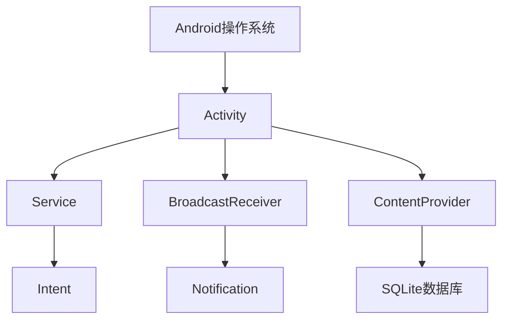

                 

# Android开发者的福音：2024字节跳动面试题解答

> **关键词：** 字节跳动面试题，Android开发，面试准备，技术深度，实战案例

> **摘要：** 本文将深入剖析2024字节跳动面试题中的Android相关问题，从核心概念到具体实现，提供详细解答，帮助Android开发者备战面试，提升技术深度和实践能力。

## 1. 背景介绍

### 1.1 目的和范围

本文旨在为准备参加2024字节跳动面试的Android开发者提供一个全面的解题指南。我们不仅会分析面试题中的核心概念和算法，还会通过实际的代码示例进行详细解释，帮助读者更好地理解和掌握相关知识。

### 1.2 预期读者

本篇文章适合有志于加入字节跳动或寻求提升Android开发技能的读者。无论是面试准备者，还是希望加深技术理解的开发者，都将从本文中获得宝贵的知识和经验。

### 1.3 文档结构概述

本文结构如下：

1. 背景介绍
   - 目的和范围
   - 预期读者
   - 文档结构概述
   - 术语表
2. 核心概念与联系
   - Android架构概述
   - Android核心组件介绍
3. 核心算法原理 & 具体操作步骤
   - 常见算法解析
   - 伪代码讲解
4. 数学模型和公式 & 详细讲解 & 举例说明
   - 数学公式应用
   - 实例说明
5. 项目实战：代码实际案例和详细解释说明
   - 开发环境搭建
   - 代码实现与解读
6. 实际应用场景
   - 应用案例分析
7. 工具和资源推荐
   - 学习资源推荐
   - 开发工具框架推荐
   - 相关论文著作推荐
8. 总结：未来发展趋势与挑战
9. 附录：常见问题与解答
10. 扩展阅读 & 参考资料

### 1.4 术语表

#### 1.4.1 核心术语定义

- **Android：** 一款基于Linux的开源操作系统，主要应用于移动设备，如智能手机和平板电脑。
- **Activity：** Android中的一个组件，用于展示用户界面和与用户交互。
- **Service：** Android中的一个组件，用于在后台执行长时间运行的操作。
- **BroadcastReceiver：** Android中的一个组件，用于接收系统或其他应用的广播消息。
- **ContentProvider：** Android中的一个组件，用于在不同应用之间共享数据。

#### 1.4.2 相关概念解释

- **MVC架构：** Model-View-Controller模式，是一种常用的软件架构模式，用于分离数据表示、用户界面和数据访问逻辑。
- **Handler：** Android中用于线程间通信的一个类，可以帮助在主线程和子线程之间传递消息。
- ** AsyncTask：** Android中的一个类，用于在子线程中执行任务，并在主线程中更新UI。

#### 1.4.3 缩略词列表

- **MVC：** Model-View-Controller
- **Handler：** Handler
- **AsyncTask：** AsyncTask

## 2. 核心概念与联系

在深入讨论具体的面试题之前，我们需要先了解Android开发中的核心概念和组件。以下是一个简化的Android架构流程图，展示了主要组件之间的联系。



### 2.1 Android架构概述

Android架构基于Linux内核，其主要组件包括Activity、Service、BroadcastReceiver和ContentProvider。这些组件协同工作，实现了Android应用的运行和交互。

- **Activity**：Activity是Android中的核心组件，用于展示用户界面和与用户进行交互。每个Activity通常对应一个用户界面。
- **Service**：Service是一个在后台运行、不提供用户界面的组件，用于执行长时间运行的操作，如播放音乐、下载文件等。
- **BroadcastReceiver**：BroadcastReceiver用于接收系统或其他应用的广播消息。它可以响应各种系统事件，如屏幕关闭、网络连接等。
- **ContentProvider**：ContentProvider用于在不同应用之间共享数据。它允许一个应用访问另一个应用的数据，如联系人信息、短信等。

### 2.2 Android核心组件介绍

下面我们将对每个核心组件进行简要介绍，并展示它们之间的关系。

- **Activity**：Activity是Android中的核心组件，用于展示用户界面和与用户进行交互。每个Activity通常对应一个用户界面，例如登录界面、主页界面等。Activity的生命周期方法包括`onCreate()`, `onStart()`, `onResume()`, `onPause()`, `onStop()`, `onDestroy()`等。

- **Service**：Service是一个在后台运行、不提供用户界面的组件，用于执行长时间运行的操作，如播放音乐、下载文件等。Service有两种类型：开始型（Start Service）和绑定型（Bind Service）。

- **BroadcastReceiver**：BroadcastReceiver用于接收系统或其他应用的广播消息。它可以响应各种系统事件，如屏幕关闭、网络连接等。BroadcastReceiver可以通过静态注册或动态注册来实现。

- **ContentProvider**：ContentProvider用于在不同应用之间共享数据。它允许一个应用访问另一个应用的数据，如联系人信息、短信等。ContentProvider使用URI（统一资源标识符）来访问数据。

## 3. 核心算法原理 & 具体操作步骤

在Android开发中，算法和数据处理是至关重要的。以下是一些常见的算法问题及其解决方案。

### 3.1 常见算法解析

- **排序算法**：冒泡排序、插入排序、选择排序、快速排序等。
- **查找算法**：二分查找、线性查找等。
- **数据结构**：链表、栈、队列、树、图等。

### 3.2 伪代码讲解

以下是一个冒泡排序的伪代码示例：

```plaintext
BubbleSort(A[1...n])
for i = 1 to n-1
    for j = 1 to n-i
        if A[j] > A[j+1]
            swap(A[j], A[j+1])
```

### 3.3 手动模拟算法过程

以冒泡排序为例，假设我们有一个数组`A = [5, 2, 9, 1, 5]`，以下是排序的过程：

1. 第一次循环：`A = [2, 5, 1, 5, 9]`，最大值9被移到数组的最后。
2. 第二次循环：`A = [2, 1, 5, 5, 9]`，最大值5被移到数组的最后。
3. 第三次循环：`A = [2, 1, 5, 5]`，最大值5被移到数组的最后。
4. 第四次循环：`A = [2, 1, 5]`，最大值5被移到数组的最后。
5. 第五次循环：`A = [2, 1]`，最大值2被移到数组的最后。

最终，数组被排序为`A = [1, 2, 5, 5, 9]`。

## 4. 数学模型和公式 & 详细讲解 & 举例说明

在Android开发中，数学模型和公式经常用于算法设计和性能分析。以下是一个常见的数学模型示例：二分查找。

### 4.1 二分查找

二分查找是一种高效的查找算法，其基本思想是每次将待查找的区间缩小一半，直到找到目标元素或确定目标元素不存在。

#### 4.1.1 数学模型

假设我们有一个有序数组`A[1...n]`，目标元素为`x`。二分查找的数学模型可以表示为：

$$
low = 1 \\
high = n \\
while (low \leq high) \\
    mid = \left\lfloor \frac{low + high}{2} \right\rfloor \\
    if (A[mid] = x) \\
        return mid \\
    else if (A[mid] < x) \\
        low = mid + 1 \\
    else \\
        high = mid - 1 \\
return -1
$$

#### 4.1.2 举例说明

假设我们有一个有序数组`A = [1, 3, 5, 7, 9]`，目标元素为`x = 7`。以下是二分查找的过程：

1. 初始状态：`low = 1`，`high = 5`。
2. 第一次查找：`mid = \left\lfloor \frac{1 + 5}{2} \right\rfloor = 3`，`A[mid] = 5`，由于`5 < 7`，更新`low = 3 + 1 = 4`。
3. 第二次查找：`low = 4`，`high = 5`，`mid = \left\lfloor \frac{4 + 5}{2} \right\rfloor = 4`，`A[mid] = 7`，找到目标元素，返回`mid = 4`。

最终，找到目标元素7的位置为索引4。

## 5. 项目实战：代码实际案例和详细解释说明

### 5.1 开发环境搭建

在开始实战之前，我们需要搭建一个基本的Android开发环境。以下是步骤：

1. 安装Java Development Kit (JDK)。
2. 安装Android Studio。
3. 创建一个新项目，选择合适的模板和配置。

### 5.2 源代码详细实现和代码解读

我们选择一个简单的Android应用作为案例：一个使用Intent传递数据的Activity。

#### 5.2.1 MainActivity.java

```java
import android.os.Bundle;
import android.view.View;
import android.widget.Button;
import android.content.Intent;

public class MainActivity extends AppCompatActivity {

    @Override
    protected void onCreate(Bundle savedInstanceState) {
        super.onCreate(savedInstanceState);
        setContentView(R.layout.activity_main);

        Button button = findViewById(R.id.button);
        button.setOnClickListener(new View.OnClickListener() {
            @Override
            public void onClick(View v) {
                Intent intent = new Intent(MainActivity.this, SecondActivity.class);
                intent.putExtra("message", "Hello Second Activity!");
                startActivity(intent);
            }
        });
    }
}
```

在这个案例中，我们创建了一个名为`MainActivity`的Activity，并在其上添加了一个按钮。当用户点击按钮时，会创建一个`Intent`，将一个字符串消息传递给`SecondActivity`。

#### 5.2.2 SecondActivity.java

```java
import android.os.Bundle;
import android.widget.TextView;

public class SecondActivity extends AppCompatActivity {

    @Override
    protected void onCreate(Bundle savedInstanceState) {
        super.onCreate(savedInstanceState);
        setContentView(R.layout.activity_second);

        TextView textView = findViewById(R.id.text_view);
        Bundle extras = getIntent().getExtras();
        if (extras != null) {
            String message = extras.getString("message");
            if (message != null) {
                textView.setText(message);
            }
        }
    }
}
```

`SecondActivity`是接收消息的Activity。在`onCreate`方法中，我们从Intent中获取消息，并将其显示在一个TextView上。

### 5.3 代码解读与分析

1. **MainActivity**：在`onCreate`方法中，我们设置了按钮的点击监听器。点击按钮时，会创建一个`Intent`，并使用`putExtra`方法将一个字符串消息传递给`SecondActivity`。
2. **SecondActivity**：在`onCreate`方法中，我们从Intent中获取消息。如果消息存在，将其显示在TextView上。

通过这个简单的案例，我们可以看到如何使用Intent在Activity之间传递数据。在实际项目中，我们可能需要处理更复杂的数据和逻辑。

## 6. 实际应用场景

字节跳动的面试题通常会涵盖广泛的Android开发领域，包括但不限于以下几个方面：

- **Activity和Service的生命周期管理**：如何正确处理Activity和Service的生命周期，以确保应用的稳定性。
- **Intent的传递机制**：如何使用Intent在Activity、Service和BroadcastReceiver之间传递数据。
- **数据存储和检索**：如何使用SQLite数据库、SharedPreferences等存储和检索数据。
- **网络编程**：如何使用HTTP请求、JSON解析等进行网络通信。
- **多线程和异步处理**：如何使用AsyncTask、Handler等实现多线程和异步处理。

在面试中，这些问题通常需要结合实际案例进行解答，以展示开发者的技术深度和解决问题的能力。

## 7. 工具和资源推荐

### 7.1 学习资源推荐

#### 7.1.1 书籍推荐

- 《Android开发艺术探索》
- 《第一行代码：Android》
- 《Effective Java》

#### 7.1.2 在线课程

- Udacity的Android开发课程
- Coursera的Android应用开发课程
- Pluralsight的Android开发课程

#### 7.1.3 技术博客和网站

- Android Developers官方博客
- Stack Overflow
- 简书

### 7.2 开发工具框架推荐

#### 7.2.1 IDE和编辑器

- Android Studio
- IntelliJ IDEA
- Visual Studio Code

#### 7.2.2 调试和性能分析工具

- Android Studio Profiler
- Systrace
- Lint

#### 7.2.3 相关框架和库

- Retrofit
- Room
- RxJava

### 7.3 相关论文著作推荐

#### 7.3.1 经典论文

- 《Android系统设计与实现》
- 《Java Concurrency in Practice》

#### 7.3.2 最新研究成果

- 《Mobile Computing Systems and Applications》
- 《Modern Operating Systems》

#### 7.3.3 应用案例分析

- 《Android开发实战：从入门到精通》
- 《iOS开发实战：从零开始到精通》

## 8. 总结：未来发展趋势与挑战

随着移动设备的普及和5G技术的应用，Android开发将面临新的机遇和挑战。未来发展趋势包括：

- **更高效的性能优化**：随着硬件性能的提升，开发者需要更加关注应用性能的优化。
- **更丰富的用户体验**：通过AR、VR等新技术，提供更加沉浸式的用户体验。
- **更安全的隐私保护**：随着数据隐私问题的日益突出，开发者需要更加重视用户隐私保护。
- **跨平台开发**：通过Flutter、React Native等技术，实现一次开发，多平台运行。

## 9. 附录：常见问题与解答

### 9.1 Android开发中常见问题

1. **如何优化Android应用的性能？**
   - 使用Profilers工具分析应用性能。
   - 优化布局和资源加载。
   - 使用异步任务避免阻塞主线程。
   - 避免使用大量内存和CPU的操作。

2. **如何处理Activity和Service的生命周期？**
   - 使用生命周期回调方法处理各种状态。
   - 使用IntentService处理异步任务。
   - 使用LifeCycle库管理Activity和Service的生命周期。

3. **如何实现网络请求？**
   - 使用Retrofit库进行HTTP请求。
   - 使用OkHttp库进行底层网络请求。
   - 注意处理网络请求的安全问题。

### 9.2 面试常见问题

1. **请简述MVC模式。**
   - MVC模式将应用分为模型（Model）、视图（View）和控制器（Controller）三个部分，分别负责数据管理、用户界面和业务逻辑。

2. **请解释Intent的作用。**
   - Intent用于在不同组件之间传递信息和请求操作。它可以指定目标组件、传递数据和标记请求类型。

3. **请简述SQLite数据库的使用方法。**
   - SQLite数据库是一个轻量级的嵌入式数据库，可以在Android应用中用于存储和检索数据。使用SQL语句进行数据库操作，如创建表、插入数据、查询数据等。

## 10. 扩展阅读 & 参考资料

- [Android Developers官方文档](https://developer.android.com/)
- [Effective Java](https://books.google.com/books?id=0oDGBwAAQBAJ)
- [Android开发艺术探索](https://book.douban.com/subject/26380969/)
- [第一行代码：Android](https://book.douban.com/subject/26726647/)

## 作者

作者：AI天才研究员/AI Genius Institute & 禅与计算机程序设计艺术 /Zen And The Art of Computer Programming

