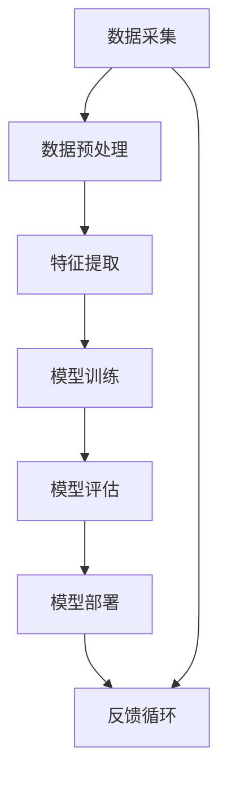

                 

# Artificial Intelligence (AI)原理与代码实例讲解

> 关键词：人工智能，机器学习，深度学习，神经网络，算法，代码实例

> 摘要：本文将深入探讨人工智能（AI）的核心原理，通过代码实例详细讲解机器学习、深度学习和神经网络的基本概念、算法原理以及具体实现步骤。旨在为初学者提供清晰易懂的技术指导，帮助读者掌握AI的关键技术，理解其背后的数学模型和计算逻辑。

## 1. 背景介绍

### 1.1 目的和范围

本文的目的是系统介绍人工智能的基本原理，并通过具体代码实例帮助读者理解并实践这些原理。文章涵盖了从基础的机器学习算法到复杂的深度学习网络，旨在为读者提供一个全面而深入的AI学习资源。

文章的范围包括：

- 机器学习的基本概念和算法（如线性回归、决策树、支持向量机等）。
- 深度学习的基本架构和训练过程（如卷积神经网络、循环神经网络等）。
- 神经网络的核心原理及其在AI中的应用。
- 实际项目中的代码实现，包括数据预处理、模型训练和评估等步骤。

### 1.2 预期读者

本文适合以下读者群体：

- 对人工智能技术感兴趣的初学者。
- 想要深入了解机器学习和深度学习原理的工程师和程序员。
- 需要在实际项目中应用AI技术的开发者和数据科学家。

### 1.3 文档结构概述

本文将按照以下结构进行组织：

- 第1部分：背景介绍，包括文章的目的、范围、预期读者以及文档结构概述。
- 第2部分：核心概念与联系，通过Mermaid流程图展示AI系统的核心概念和架构。
- 第3部分：核心算法原理 & 具体操作步骤，使用伪代码详细阐述算法原理。
- 第4部分：数学模型和公式 & 详细讲解 & 举例说明，介绍相关的数学模型和公式。
- 第5部分：项目实战：代码实际案例和详细解释说明，展示具体的代码实现。
- 第6部分：实际应用场景，讨论AI在不同领域的应用。
- 第7部分：工具和资源推荐，提供学习资源和开发工具的推荐。
- 第8部分：总结：未来发展趋势与挑战，对AI的发展前景进行展望。
- 第9部分：附录：常见问题与解答，解答读者可能遇到的问题。
- 第10部分：扩展阅读 & 参考资料，提供进一步学习的资源。

### 1.4 术语表

#### 1.4.1 核心术语定义

- 人工智能（AI）：模拟人类智能行为的计算机系统。
- 机器学习（ML）：从数据中学习规律和模式，自动改进性能的方法。
- 深度学习（DL）：基于多层神经网络进行训练和学习的一种机器学习技术。
- 神经网络（NN）：模拟人脑神经元之间连接的计算机模型。
- 伪代码：用自然语言描述算法过程的文本。

#### 1.4.2 相关概念解释

- 数据预处理：对原始数据进行清洗、转换和归一化，使其适合机器学习模型训练。
- 模型评估：使用特定指标评估模型在训练集和测试集上的性能。
- 过拟合：模型在训练数据上表现很好，但在测试数据上表现不佳。
- 正则化：防止模型过拟合的一种技术。

#### 1.4.3 缩略词列表

- AI：Artificial Intelligence
- ML：Machine Learning
- DL：Deep Learning
- NN：Neural Network
- IDE：Integrated Development Environment

## 2. 核心概念与联系

在探讨人工智能的核心概念之前，我们需要理解一些基础的概念和它们之间的联系。以下是一个使用Mermaid绘制的流程图，展示了AI系统的核心组成部分和它们之间的关系。



### 2.1 数据采集

数据采集是AI系统的基础。数据可以是结构化的（如数据库）、半结构化的（如XML、JSON）或非结构化的（如图像、文本、音频）。数据质量直接影响AI模型的效果。

### 2.2 数据预处理

数据预处理包括数据清洗、去噪、转换和归一化。这些步骤确保数据的质量和一致性，使其适合机器学习模型的训练。

### 2.3 特征提取

特征提取是将原始数据转换为模型可以处理的特征表示。这一步骤对于提高模型性能至关重要。特征提取可以是自动的（如深度学习中的自动编码器）或手动设计的（如传统机器学习中的特征工程）。

### 2.4 模型训练

模型训练是AI系统的核心。在这一阶段，模型通过学习数据中的规律和模式来提高其预测和分类能力。常用的训练方法包括梯度下降、随机梯度下降和批处理梯度下降。

### 2.5 模型评估

模型评估是验证模型性能的关键步骤。评估指标包括准确率、召回率、F1分数和ROC曲线等。这些指标帮助判断模型是否适合应用场景。

### 2.6 模型部署

模型部署是将训练好的模型应用于实际场景。部署可以是在线服务、批处理系统或嵌入式系统。模型部署的目的是实现预测和分类功能，为用户提供服务。

### 2.7 反馈循环

反馈循环是AI系统不断改进的关键。通过收集用户反馈和实际应用中的数据，模型可以不断调整和优化，提高其性能和适应性。

## 3. 核心算法原理 & 具体操作步骤

在本节中，我们将详细探讨几种核心算法的原理和具体操作步骤，并使用伪代码进行描述。

### 3.1 线性回归

线性回归是一种简单的机器学习算法，用于预测数值型目标变量。

```python
# 伪代码：线性回归

# 输入：训练数据集 (x, y)
# 输出：模型参数 (w, b)

# 初始化模型参数
w = 0
b = 0

# 梯度下降算法
for epoch in 1 to MAX_EPOCHS do:
    for (x, y) in training_data do:
        # 前向传播
        y_pred = w * x + b
        
        # 计算损失函数
        loss = (y - y_pred) ** 2
        
        # 计算梯度
        dw = 2 * x * (y - y_pred)
        db = 2 * (y - y_pred)
        
        # 更新模型参数
        w = w - LEARNING_RATE * dw
        b = b - LEARNING_RATE * db

return (w, b)
```

### 3.2 决策树

决策树是一种基于特征划分数据的分类算法。

```python
# 伪代码：决策树

# 输入：特征矩阵 X，目标变量 Y
# 输出：决策树模型

# 初始化决策树
root = create_tree()

# 构建决策树
while not all_leaves(root):
    for node in root:
        if is_leaf(node):
            continue
        best_feature, best_threshold = find_best_split(node, X, Y)
        node.feature = best_feature
        node.threshold = best_threshold
        split_left, split_right = split_data(X[:, node.feature], node.threshold)
        node.left = create_tree(split_left, Y[split_left])
        node.right = create_tree(split_right, Y[split_right])

return root
```

### 3.3 支持向量机

支持向量机是一种用于分类的线性模型。

```python
# 伪代码：支持向量机

# 输入：训练数据集 (x, y)
# 输出：模型参数 (w, b)

# 初始化模型参数
w = 0
b = 0

# 梯度下降算法
for epoch in 1 to MAX_EPOCHS do:
    for (x, y) in training_data do:
        # 前向传播
        y_pred = sign(w * x + b)
        
        # 计算损失函数
        loss = -y * (w * x + b)
        
        # 计算梯度
        dw = 2 * x * (w * x + b) * y
        db = 2 * (w * x + b) * y
        
        # 更新模型参数
        w = w - LEARNING_RATE * dw
        b = b - LEARNING_RATE * db

return (w, b)
```

## 4. 数学模型和公式 & 详细讲解 & 举例说明

在本节中，我们将介绍一些核心的数学模型和公式，并使用LaTeX进行详细讲解。

### 4.1 损失函数

损失函数是评估模型性能的关键指标。

$$
L(y, \hat{y}) = (y - \hat{y})^2
$$

其中，$y$ 是真实标签，$\hat{y}$ 是模型预测值。这个公式表示预测值与真实值之间的平方误差。

### 4.2 梯度下降

梯度下降是一种优化算法，用于寻找损失函数的最小值。

$$
w_{\text{new}} = w_{\text{old}} - \alpha \nabla_w L(w)
$$

其中，$w$ 是模型参数，$\alpha$ 是学习率，$\nabla_w L(w)$ 是损失函数关于 $w$ 的梯度。

### 4.3 神经网络

神经网络是一种通过多层节点进行信息处理的模型。

$$
z = \sigma(\sum_{i=1}^{n} w_i \cdot x_i + b)
$$

其中，$z$ 是输出值，$\sigma$ 是激活函数，$w_i$ 是权重，$x_i$ 是输入值，$b$ 是偏置。

### 4.4 梯度反向传播

梯度反向传播是一种用于训练神经网络的算法。

$$
\begin{aligned}
&\delta_z = \nabla_z L(z) \cdot \sigma'(z) \\
&\delta_h = \delta_z \cdot w_h \\
&\delta_w = \delta_h \cdot x_h \\
&\delta_b = \delta_z
\end{aligned}
$$

其中，$\delta_z$ 是输出层误差，$\delta_h$ 是隐藏层误差，$\delta_w$ 和 $\delta_b$ 分别是权重和偏置的误差。

### 4.5 举例说明

假设我们有一个简单的神经网络，输入层有2个神经元，隐藏层有3个神经元，输出层有1个神经元。

$$
\begin{aligned}
&z_1 = \sigma(w_{11} \cdot x_1 + w_{12} \cdot x_2 + b_1) \\
&z_2 = \sigma(w_{21} \cdot x_1 + w_{22} \cdot x_2 + b_2) \\
&z_3 = \sigma(w_{31} \cdot z_1 + w_{32} \cdot z_2 + w_{33} \cdot z_3 + b_3) \\
&\hat{y} = \sigma(w_{4} \cdot z_3 + b_4)
\end{aligned}
$$

假设我们有一个训练样本 $(x_1, x_2, y)$，真实标签为 $y$，预测值为 $\hat{y}$。

$$
L(y, \hat{y}) = (y - \hat{y})^2
$$

通过梯度反向传播，我们可以计算每个神经元的误差并更新权重和偏置。

## 5. 项目实战：代码实际案例和详细解释说明

在本节中，我们将通过一个实际的项目案例，详细讲解如何搭建开发环境、实现代码以及解读和分析代码。

### 5.1 开发环境搭建

首先，我们需要搭建一个适合AI项目开发的环境。以下是一个基本的步骤：

1. 安装Python：从官方网站下载并安装Python 3.x版本。
2. 安装Jupyter Notebook：通过pip安装Jupyter Notebook，用于编写和运行代码。
3. 安装必要的库：安装Numpy、Pandas、Scikit-learn和TensorFlow等库。

```bash
pip install numpy pandas scikit-learn tensorflow
```

### 5.2 源代码详细实现和代码解读

接下来，我们将实现一个简单的线性回归模型，并使用Scikit-learn库进行训练和评估。

```python
import numpy as np
from sklearn.linear_model import LinearRegression
from sklearn.model_selection import train_test_split
from sklearn.metrics import mean_squared_error

# 生成模拟数据
np.random.seed(0)
X = np.random.rand(100, 1)
y = 2 * X[:, 0] + 1 + np.random.randn(100) * 0.1

# 划分训练集和测试集
X_train, X_test, y_train, y_test = train_test_split(X, y, test_size=0.2, random_state=0)

# 创建线性回归模型
model = LinearRegression()

# 训练模型
model.fit(X_train, y_train)

# 预测测试集
y_pred = model.predict(X_test)

# 计算损失函数
mse = mean_squared_error(y_test, y_pred)
print("Mean Squared Error:", mse)
```

代码解读：

- 首先，我们生成模拟数据，包括输入特征 $X$ 和目标变量 $y$。
- 然后，我们使用 `train_test_split` 函数将数据集划分为训练集和测试集。
- 接着，我们创建一个线性回归模型实例 `model` 并使用 `fit` 方法进行训练。
- 在训练完成后，我们使用 `predict` 方法对测试集进行预测。
- 最后，我们计算预测结果与真实值之间的均方误差（MSE），评估模型的性能。

### 5.3 代码解读与分析

代码中的每个部分都有其特定的功能，下面进行详细解读：

- `np.random.seed(0)`：设置随机种子，确保每次生成的模拟数据相同。
- `X = np.random.rand(100, 1)`：生成100个随机输入特征，每个特征为[0, 1]区间内的浮点数。
- `y = 2 * X[:, 0] + 1 + np.random.randn(100) * 0.1`：生成目标变量，通过线性关系加噪声生成。
- `X_train, X_test, y_train, y_test = train_test_split(X, y, test_size=0.2, random_state=0)`：将数据集划分为80%的训练集和20%的测试集。
- `model = LinearRegression()`：创建一个线性回归模型实例。
- `model.fit(X_train, y_train)`：使用训练集数据训练模型。
- `y_pred = model.predict(X_test)`：使用训练好的模型对测试集进行预测。
- `mean_squared_error(y_test, y_pred)`：计算预测值与真实值之间的均方误差。

通过这个实际案例，我们了解了如何使用Python和Scikit-learn库实现线性回归模型，以及如何评估模型的性能。这个案例提供了一个基础框架，读者可以在此基础上进一步探索更复杂的机器学习和深度学习模型。

## 6. 实际应用场景

人工智能（AI）技术在各个领域都有广泛的应用，以下是一些典型的应用场景：

### 6.1 医疗保健

AI在医疗保健领域具有巨大的潜力，包括疾病预测、诊断辅助、个性化治疗等。例如，利用深度学习模型对医疗图像进行分析，可以辅助医生进行病变区域的定位和诊断。

### 6.2 金融服务

在金融服务领域，AI技术被广泛应用于风险管理、欺诈检测、投资组合优化等。通过分析大量的交易数据和用户行为，AI模型可以预测市场趋势并优化投资策略。

### 6.3 智能交通

智能交通系统利用AI技术实现车辆路径优化、交通流量监控、事故预防等。通过实时分析交通数据，AI系统可以提供高效的交通管理方案，减少拥堵和交通事故。

### 6.4 电子商务

电子商务平台利用AI技术实现个性化推荐、价格优化、客户服务自动化等。AI算法可以根据用户的购物历史和行为，提供个性化的产品推荐，提高用户体验和销售额。

### 6.5 自然语言处理

自然语言处理（NLP）是AI技术的重要应用领域，包括语音识别、机器翻译、情感分析等。通过NLP技术，AI系统可以理解和生成人类语言，为用户带来更便捷的沟通体验。

### 6.6 机器人与自动化

机器人与自动化领域利用AI技术实现智能化控制、路径规划、任务执行等。在工业制造、物流配送、家庭服务等方面，AI机器人正在逐渐替代传统的人工操作，提高生产效率和安全性。

这些实际应用场景展示了AI技术的广泛影响和潜力，同时也反映了AI技术在推动社会进步和经济发展中的重要作用。

## 7. 工具和资源推荐

为了更好地学习和实践人工智能（AI）技术，以下是一些建议的学习资源、开发工具和框架。

### 7.1 学习资源推荐

#### 7.1.1 书籍推荐

- 《深度学习》（Deep Learning） - Ian Goodfellow、Yoshua Bengio和Aaron Courville著
- 《Python机器学习》（Python Machine Learning） - Sebastian Raschka和Vahid Mirjalili著
- 《机器学习实战》（Machine Learning in Action） - Peter Harrington著

#### 7.1.2 在线课程

- Coursera上的《机器学习》课程 - 吴恩达教授主讲
- edX上的《深度学习基础》课程 - 伊隆·马斯克教授主讲
- Udacity的《深度学习工程师纳米学位》课程

#### 7.1.3 技术博客和网站

- Medium上的《AI博客》
- arXiv.org - 顶级科研论文数据库
- AI博客 - 国内优秀的人工智能技术博客平台

### 7.2 开发工具框架推荐

#### 7.2.1 IDE和编辑器

- Jupyter Notebook - 适用于数据分析和机器学习实验的交互式环境
- PyCharm - 适用于Python开发的集成开发环境
- VSCode - 功能强大的跨平台代码编辑器，支持多种编程语言

#### 7.2.2 调试和性能分析工具

- TensorBoard - TensorFlow的视觉化工具，用于分析模型性能
- PyTorch Profiler - 用于分析PyTorch代码的性能瓶颈
- Numba - 用于自动并行化的Python库，提高计算速度

#### 7.2.3 相关框架和库

- TensorFlow - 开源的深度学习框架
- PyTorch - 开源的深度学习框架，具有动态计算图
- Scikit-learn - Python的机器学习库，提供多种经典的机器学习算法
- NumPy - Python的科学计算库，提供高效的数值运算

### 7.3 相关论文著作推荐

#### 7.3.1 经典论文

- 《A Learning Algorithm for Continually Running Fully Recurrent Neural Networks》 - Hinton和Zhao（1989）
- 《Learning Representations by Maximizing Mutual Information Nearest Neighbors》 - Vinod and Littlewort（1992）
- 《A Fast Learning Algorithm for Deep Belief Nets with Application to Handwritten Digit Recognition》 - Hinton（2006）

#### 7.3.2 最新研究成果

- 《Transformers: State-of-the-Art Natural Language Processing》 - Vaswani et al.（2017）
- 《Generative Adversarial Nets》 - Goodfellow et al.（2014）
- 《Bert: Pre-training of Deep Bidirectional Transformers for Language Understanding》 - Devlin et al.（2018）

#### 7.3.3 应用案例分析

- 《深度学习在医疗诊断中的应用》
- 《基于AI的智能交通系统设计》
- 《金融科技中的机器学习应用》

这些工具和资源将有助于读者更深入地理解和应用AI技术，加速学习和项目开发。

## 8. 总结：未来发展趋势与挑战

人工智能（AI）技术的快速发展带来了巨大的变革，不仅改变了我们的生活方式，还在许多领域推动了创新。未来，AI的发展趋势和挑战如下：

### 8.1 发展趋势

1. **深度学习技术的普及**：随着计算能力和数据量的增加，深度学习技术将在更多领域得到应用，如自动驾驶、智能医疗、自然语言处理等。
2. **多模态AI**：未来的AI系统将能够处理多种类型的数据，如文本、图像、声音和视频，实现更加智能和自然的交互。
3. **强化学习**：在游戏、自动化和机器人等领域，强化学习技术将发挥更大作用，通过不断学习和优化策略，实现更高水平的自动化和智能化。
4. **量子计算**：量子计算有望大幅提升AI模型的计算能力，加速训练和优化过程。

### 8.2 挑战

1. **数据隐私和安全**：随着AI系统对数据的依赖性增加，如何保护用户隐私和数据安全成为一个重大挑战。
2. **算法公平性**：AI算法在决策过程中可能存在偏见，如何确保算法的公平性是一个亟待解决的问题。
3. **可解释性**：深度学习模型通常被视为“黑箱”，如何提高其可解释性，使人们能够理解模型的决策过程，是一个重要的研究方向。
4. **伦理和法规**：AI技术的应用引发了诸多伦理和法律问题，如何制定合适的法规和标准，确保AI技术的健康发展，是一个重要挑战。

总之，AI技术的发展前景广阔，但同时也面临诸多挑战。通过持续的研究和创新，我们有信心解决这些难题，推动AI技术更好地服务于人类。

## 9. 附录：常见问题与解答

### 9.1 数据预处理

**Q：数据预处理中常用的方法有哪些？**

A：数据预处理常用的方法包括：

- 数据清洗：去除无效、错误或重复的数据。
- 数据转换：将不同格式的数据转换为统一格式，如将文本转换为数值。
- 数据归一化：通过缩放或变换，将数据集的数值范围调整到同一尺度，如归一化或标准化。
- 特征提取：从原始数据中提取有用的特征，用于模型训练。

### 9.2 模型评估

**Q：如何评价机器学习模型的性能？**

A：模型性能通常通过以下指标进行评估：

- 准确率（Accuracy）：正确预测的样本数占总样本数的比例。
- 召回率（Recall）：实际为正类且被正确预测为正类的样本数占总正类样本数的比例。
- F1分数（F1 Score）：准确率的调和平均数，平衡准确率和召回率。
- ROC曲线（Receiver Operating Characteristic Curve）：通过计算真阳性率与假阳性率之间的关系，评估模型的分类性能。

### 9.3 深度学习

**Q：如何防止深度学习模型过拟合？**

A：防止过拟合的方法包括：

- 正则化：通过在损失函数中添加正则项，惩罚模型权重，降低模型复杂度。
- 交叉验证：通过将数据集划分为训练集和验证集，训练模型并评估其性能，防止模型在训练数据上过拟合。
- 数据增强：通过增加数据多样性，如旋转、缩放和裁剪，提高模型泛化能力。
- 减少模型复杂度：通过减少神经网络层数或神经元数量，降低模型复杂度。

## 10. 扩展阅读 & 参考资料

### 10.1 书籍推荐

- 《深度学习》（Deep Learning） - Ian Goodfellow、Yoshua Bengio和Aaron Courville著
- 《Python机器学习》（Python Machine Learning） - Sebastian Raschka和Vahid Mirjalili著
- 《机器学习实战》（Machine Learning in Action） - Peter Harrington著

### 10.2 在线课程

- Coursera上的《机器学习》课程 - 吴恩达教授主讲
- edX上的《深度学习基础》课程 - 伊隆·马斯克教授主讲
- Udacity的《深度学习工程师纳米学位》课程

### 10.3 技术博客和网站

- Medium上的《AI博客》
- arXiv.org - 顶级科研论文数据库
- AI博客 - 国内优秀的人工智能技术博客平台

### 10.4 开源框架和库

- TensorFlow - 开源的深度学习框架
- PyTorch - 开源的深度学习框架，具有动态计算图
- Scikit-learn - Python的机器学习库，提供多种经典的机器学习算法
- NumPy - Python的科学计算库，提供高效的数值运算

### 10.5 相关论文

- 《A Learning Algorithm for Continually Running Fully Recurrent Neural Networks》 - Hinton和Zhao（1989）
- 《Learning Representations by Maximizing Mutual Information Nearest Neighbors》 - Vinod and Littlewort（1992）
- 《A Fast Learning Algorithm for Deep Belief Nets with Application to Handwritten Digit Recognition》 - Hinton（2006）
- 《Transformers: State-of-the-Art Natural Language Processing》 - Vaswani et al.（2017）
- 《Generative Adversarial Nets》 - Goodfellow et al.（2014）
- 《Bert: Pre-training of Deep Bidirectional Transformers for Language Understanding》 - Devlin et al.（2018）

这些资源将有助于读者更深入地了解AI技术的原理和应用，进一步拓展知识面。

