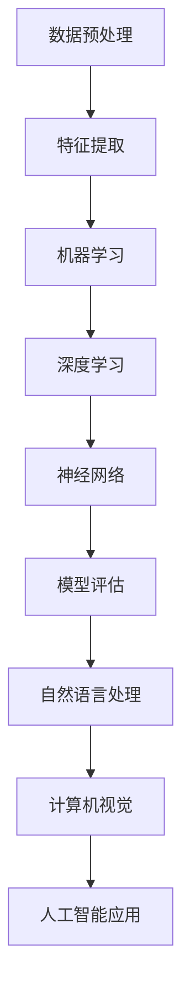

                 

# Artificial Intelligence

> **关键词：** 深度学习、神经网络、机器学习、自然语言处理、计算机视觉、人工智能应用  
>
> **摘要：** 本文将系统地探讨人工智能（AI）的核心概念、算法原理、数学模型以及实际应用，通过逐步分析推理的方式，帮助读者深入理解AI技术，展望未来发展趋势与挑战。

## 1. 背景介绍

### 1.1 目的和范围

本文旨在通过逻辑清晰、结构紧凑、简单易懂的叙述方式，系统性地介绍人工智能（AI）的核心概念、关键技术和应用领域。文章将涵盖从基础的机器学习算法到复杂的深度学习网络，从自然语言处理到计算机视觉，帮助读者全面了解AI技术的方方面面。

### 1.2 预期读者

本文适合对人工智能技术有一定了解，但希望进一步深入学习的读者，特别是计算机科学、软件工程和人工智能专业的研究生以及技术从业者。

### 1.3 文档结构概述

本文将分为十个部分：

1. 背景介绍：介绍本文的目的、预期读者和文档结构。
2. 核心概念与联系：介绍AI的核心概念和架构。
3. 核心算法原理 & 具体操作步骤：详细讲解AI的主要算法和操作步骤。
4. 数学模型和公式 & 详细讲解 & 举例说明：分析AI相关的数学模型和公式。
5. 项目实战：提供实际代码案例和详细解释。
6. 实际应用场景：讨论AI在各个领域的应用。
7. 工具和资源推荐：推荐学习资源和开发工具。
8. 总结：展望AI的未来发展趋势与挑战。
9. 附录：常见问题与解答。
10. 扩展阅读 & 参考资料：提供进一步的阅读材料和参考资料。

### 1.4 术语表

#### 1.4.1 核心术语定义

- **人工智能（AI）：** 模拟人类智能的计算机系统。
- **机器学习（ML）：** 让计算机从数据中学习，进行预测和决策。
- **深度学习（DL）：** 一种特殊的机器学习方法，使用多层神经网络进行特征提取。
- **神经网络（NN）：** 由大量神经元构成的计算模型。
- **自然语言处理（NLP）：** 计算机理解和生成自然语言的技术。
- **计算机视觉（CV）：** 使计算机能够理解和处理图像和视频的技术。

#### 1.4.2 相关概念解释

- **数据预处理：** 在机器学习过程中，对数据进行清洗、转换和归一化等操作。
- **特征提取：** 从原始数据中提取出有意义的特征，用于训练模型。
- **模型评估：** 使用指标（如准确率、召回率等）评估模型性能。

#### 1.4.3 缩略词列表

- **AI：** 人工智能
- **ML：** 机器学习
- **DL：** 深度学习
- **NLP：** 自然语言处理
- **CV：** 计算机视觉

## 2. 核心概念与联系

在人工智能领域，核心概念和它们之间的联系至关重要。以下是一个简化的Mermaid流程图，展示了AI的主要组件和它们之间的关系。



### 2.1 数据预处理

数据预处理是机器学习的第一步，它包括数据清洗、数据转换和数据归一化等过程。清洗数据是指去除错误数据、缺失数据和重复数据。转换数据是指将数据从一种形式转换为另一种形式，如将分类数据转换为数值数据。归一化数据是指将数据缩放到相同的范围，以消除不同特征之间的量纲影响。

### 2.2 特征提取

特征提取是从原始数据中提取出对模型训练有帮助的特征。有效的特征提取可以提高模型的准确性和泛化能力。常见的特征提取方法包括主成分分析（PCA）和特征选择算法。

### 2.3 机器学习

机器学习是AI的核心技术之一，它让计算机从数据中学习，进行预测和决策。机器学习可以分为监督学习、无监督学习和强化学习。监督学习使用标签数据训练模型，无监督学习不使用标签数据，而强化学习通过与环境交互来学习策略。

### 2.4 深度学习

深度学习是机器学习的一个子领域，它使用多层神经网络进行特征提取和学习。深度学习在图像识别、语音识别和自然语言处理等领域取得了显著的成果。常见的深度学习模型包括卷积神经网络（CNN）和循环神经网络（RNN）。

### 2.5 神经网络

神经网络是模仿人脑的连接结构和功能的计算模型。每个神经元都与其他神经元相连，并通过权重传递信息。神经网络通过训练调整这些权重，以实现特定任务。

### 2.6 模型评估

模型评估是衡量模型性能的重要步骤。常用的评估指标包括准确率、召回率、F1分数和交叉验证等。评估模型可以帮助我们了解模型的优缺点，并进行改进。

### 2.7 自然语言处理

自然语言处理是使计算机理解和生成自然语言的技术。NLP在文本分类、机器翻译和信息提取等领域具有广泛应用。常见的NLP任务包括词性标注、命名实体识别和语义分析。

### 2.8 计算机视觉

计算机视觉是使计算机理解和处理图像和视频的技术。CV在目标检测、图像分类和图像分割等领域具有重要应用。常见的CV算法包括卷积神经网络和深度学习。

### 2.9 人工智能应用

人工智能应用是AI技术在各个领域的实际应用。AI在医疗、金融、教育和智能制造等领域发挥了重要作用。随着AI技术的发展，未来AI应用将更加广泛和深入。

## 3. 核心算法原理 & 具体操作步骤

### 3.1 机器学习算法原理

机器学习算法的核心是训练模型，使模型能够对新的数据进行预测或决策。以下是机器学习算法的基本原理和操作步骤：

#### 3.1.1 原理

机器学习算法通过学习数据中的模式和关系来构建模型。模型通常由一组参数组成，这些参数用于表示数据中的特征和模式。在训练过程中，算法通过调整这些参数来优化模型的性能。

#### 3.1.2 操作步骤

1. **数据收集：** 收集包含特征和标签的数据集。
2. **数据预处理：** 对数据进行清洗、转换和归一化等操作。
3. **特征提取：** 从原始数据中提取出有意义的特征。
4. **模型选择：** 选择适合任务的机器学习算法。
5. **模型训练：** 使用训练数据训练模型，调整参数。
6. **模型评估：** 使用测试数据评估模型性能。
7. **模型部署：** 将模型部署到实际应用中。

### 3.2 深度学习算法原理

深度学习是机器学习的一个子领域，它使用多层神经网络进行特征提取和学习。以下是深度学习算法的基本原理和操作步骤：

#### 3.2.1 原理

深度学习算法通过多层神经网络进行特征提取和模式识别。每层神经网络都会将输入数据进行处理，并将其传递到下一层。通过多次传递和变换，模型能够逐渐提取出更高层次的特征。

#### 3.2.2 操作步骤

1. **数据收集：** 收集包含特征和标签的数据集。
2. **数据预处理：** 对数据进行清洗、转换和归一化等操作。
3. **模型设计：** 设计多层神经网络架构。
4. **模型训练：** 使用训练数据训练模型，调整参数。
5. **模型评估：** 使用测试数据评估模型性能。
6. **模型部署：** 将模型部署到实际应用中。

### 3.3 自然语言处理算法原理

自然语言处理是使计算机理解和生成自然语言的技术。以下是自然语言处理算法的基本原理和操作步骤：

#### 3.3.1 原理

自然语言处理算法通过多种技术手段对文本进行解析和处理，以实现语言理解和生成。常见的NLP技术包括词性标注、命名实体识别、句法分析和语义分析等。

#### 3.3.2 操作步骤

1. **文本预处理：** 清洗和准备文本数据。
2. **词向量表示：** 将文本转换为词向量表示。
3. **模型选择：** 选择适合任务的NLP算法。
4. **模型训练：** 使用训练数据训练模型，调整参数。
5. **模型评估：** 使用测试数据评估模型性能。
6. **模型部署：** 将模型部署到实际应用中。

### 3.4 计算机视觉算法原理

计算机视觉是使计算机理解和处理图像和视频的技术。以下是计算机视觉算法的基本原理和操作步骤：

#### 3.4.1 原理

计算机视觉算法通过多种技术手段对图像和视频进行解析和处理，以实现图像理解和识别。常见的CV技术包括目标检测、图像分类、图像分割和姿态估计等。

#### 3.4.2 操作步骤

1. **图像预处理：** 清洗和准备图像数据。
2. **特征提取：** 从图像中提取有意义的特征。
3. **模型选择：** 选择适合任务的CV算法。
4. **模型训练：** 使用训练数据训练模型，调整参数。
5. **模型评估：** 使用测试数据评估模型性能。
6. **模型部署：** 将模型部署到实际应用中。

## 4. 数学模型和公式 & 详细讲解 & 举例说明

### 4.1 数学模型

在人工智能中，数学模型是理解和实现算法的基础。以下是几个常用的数学模型和公式。

#### 4.1.1 感知机（Perceptron）

感知机是一种二分类线性分类模型，其基本思想是通过学习输入数据中的特征，将其划分为不同的类别。感知机的数学模型可以表示为：

$$
y = \text{sign}(w \cdot x + b)
$$

其中，$w$ 是权重向量，$x$ 是输入特征向量，$b$ 是偏置项，$\text{sign}$ 是符号函数。

#### 4.1.2 线性回归（Linear Regression）

线性回归是一种用于预测连续值的模型，其目标是找到一组线性方程，最小化预测值与实际值之间的误差。线性回归的数学模型可以表示为：

$$
y = w_0 + w_1 \cdot x
$$

其中，$w_0$ 是截距，$w_1$ 是斜率。

#### 4.1.3 逻辑回归（Logistic Regression）

逻辑回归是一种用于预测离散值的模型，其目标是找到一组线性方程，将概率映射到二分类结果。逻辑回归的数学模型可以表示为：

$$
P(y=1) = \frac{1}{1 + e^{-(w_0 + w_1 \cdot x)}}
$$

其中，$w_0$ 是截距，$w_1$ 是斜率。

### 4.2 公式详细讲解

#### 4.2.1 感知机公式

感知机公式通过计算输入特征向量与权重向量的内积，并加上偏置项，然后通过符号函数判断输出。符号函数是一个非线性函数，其输出为1或-1，表示类别的正负。

#### 4.2.2 线性回归公式

线性回归公式通过计算输入特征向量与权重向量的内积，得到预测值。这个公式描述了输入特征对预测结果的影响，权重越大，影响越大。

#### 4.2.3 逻辑回归公式

逻辑回归公式通过指数函数将线性方程的输出映射到概率值。这个公式描述了输入特征对概率的影响，概率越大，输出越接近1。

### 4.3 举例说明

#### 4.3.1 感知机举例

假设我们有一个二分类问题，数据集包含两个特征：$x_1$ 和 $x_2$，以及标签 $y$。我们要使用感知机模型进行分类。权重向量为 $w = [1, 2]^T$，偏置项为 $b = 0$。输入特征向量为 $x = [x_1, x_2]^T$。

- 当 $x = [1, 1]^T$ 时，$y = \text{sign}(w \cdot x + b) = \text{sign}(1 + 2 + 0) = 1$，预测结果为正类。
- 当 $x = [-1, -1]^T$ 时，$y = \text{sign}(w \cdot x + b) = \text{sign}(-1 - 2 + 0) = -1$，预测结果为负类。

#### 4.3.2 线性回归举例

假设我们有一个线性回归问题，数据集包含特征 $x$ 和目标值 $y$。我们要使用线性回归模型进行预测。权重向量为 $w = [1, 2]^T$，截距为 $w_0 = 0$。

- 当 $x = [1, 1]^T$ 时，预测值为 $y = w_0 + w_1 \cdot x = 0 + 2 \cdot 1 = 2$。
- 当 $x = [-1, -1]^T$ 时，预测值为 $y = w_0 + w_1 \cdot x = 0 + 2 \cdot (-1) = -2$。

#### 4.3.3 逻辑回归举例

假设我们有一个逻辑回归问题，数据集包含特征 $x$ 和目标值 $y$。我们要使用逻辑回归模型进行预测。权重向量为 $w = [1, 2]^T$，截距为 $w_0 = 0$。

- 当 $x = [1, 1]^T$ 时，预测概率为 $P(y=1) = \frac{1}{1 + e^{-(w_0 + w_1 \cdot x)}} = \frac{1}{1 + e^{-1}} \approx 0.731$。
- 当 $x = [-1, -1]^T$ 时，预测概率为 $P(y=1) = \frac{1}{1 + e^{-(w_0 + w_1 \cdot x)}} = \frac{1}{1 + e^{-3}} \approx 0.135$。

## 5. 项目实战：代码实际案例和详细解释说明

### 5.1 开发环境搭建

在开始编写代码之前，我们需要搭建一个适合AI开发的开发环境。以下是所需的步骤：

1. 安装Python：从官方网站（https://www.python.org/downloads/）下载并安装Python。
2. 安装Jupyter Notebook：通过命令行安装 `pip install notebook`。
3. 安装机器学习库：通过命令行安装 `pip install scikit-learn` 和 `pip install tensorflow`。
4. 安装文本处理库：通过命令行安装 `pip install nltk`。

### 5.2 源代码详细实现和代码解读

以下是一个使用Python和TensorFlow实现的简单机器学习项目，用于分类手写数字。

```python
import tensorflow as tf
from tensorflow.keras import layers, models
import numpy as np
import matplotlib.pyplot as plt
from sklearn.datasets import load_digits
from sklearn.model_selection import train_test_split

# 加载数据集
digits = load_digits()
X, y = digits.data, digits.target

# 数据预处理
X_train, X_test, y_train, y_test = train_test_split(X, y, test_size=0.2, random_state=42)

# 构建模型
model = models.Sequential()
model.add(layers.Conv2D(32, (3, 3), activation='relu', input_shape=(8, 8, 1)))
model.add(layers.MaxPooling2D((2, 2)))
model.add(layers.Conv2D(64, (3, 3), activation='relu'))
model.add(layers.MaxPooling2D((2, 2)))
model.add(layers.Conv2D(64, (3, 3), activation='relu'))
model.add(layers.Flatten())
model.add(layers.Dense(64, activation='relu'))
model.add(layers.Dense(10, activation='softmax'))

# 编译模型
model.compile(optimizer='adam',
              loss='sparse_categorical_crossentropy',
              metrics=['accuracy'])

# 训练模型
model.fit(X_train, y_train, epochs=5, batch_size=64)

# 评估模型
test_loss, test_acc = model.evaluate(X_test, y_test)
print(f"Test accuracy: {test_acc:.2f}")

# 可视化结果
predictions = model.predict(X_test)
plt.figure(figsize=(10, 10))
for i in range(25):
    plt.subplot(5, 5, i+1)
    plt.imshow(X_test[i], cmap=plt.cm.binary)
    plt.xticks([])
    plt.yticks([])
    plt.grid(False)
    plt.xlabel(np.argmax(predictions[i]))
plt.show()
```

### 5.3 代码解读与分析

这段代码实现了一个简单的手写数字分类项目，使用TensorFlow和Keras构建和训练模型。以下是代码的详细解读：

1. **数据加载与预处理：** 使用 `load_digits()` 函数加载数据集，并将数据集分为训练集和测试集。数据集包含64x64像素的图像和对应的数字标签。

2. **模型构建：** 使用 `Sequential` 模型堆叠多个层。首先添加两个卷积层，每个卷积层后跟一个最大池化层。然后添加一个全连接层用于分类。

3. **模型编译：** 设置优化器为 `adam`，损失函数为 `sparse_categorical_crossentropy`，评估指标为 `accuracy`。

4. **模型训练：** 使用训练数据训练模型，设置训练轮次为5，批量大小为64。

5. **模型评估：** 使用测试数据评估模型性能，输出测试准确率。

6. **可视化结果：** 使用 `predict()` 函数预测测试集的结果，并将预测结果可视化。

通过这段代码，我们可以看到如何使用TensorFlow和Keras构建、训练和评估一个简单的深度学习模型。这个项目展示了从数据预处理到模型训练和评估的完整流程。

## 6. 实际应用场景

人工智能技术在各个领域都取得了显著的成果，以下是几个典型应用场景：

### 6.1 医疗保健

人工智能在医疗保健领域的应用包括疾病预测、诊断辅助、个性化治疗和药物研发。例如，使用深度学习技术可以预测病人的疾病风险，辅助医生进行诊断，提高医疗效率和准确性。

### 6.2 金融领域

人工智能在金融领域主要用于风险控制、欺诈检测、投资策略和智能投顾。例如，通过机器学习技术可以分析大量金融数据，识别潜在的风险和机会，帮助投资者做出更明智的决策。

### 6.3 教育领域

人工智能在教育领域的应用包括个性化学习、智能评测和课程推荐。例如，通过自然语言处理技术可以分析学生的学习情况，提供个性化的学习建议，提高学习效果。

### 6.4 智能制造

人工智能在智能制造领域的应用包括质量检测、设备维护和自动化生产。例如，通过计算机视觉技术可以实现产品质量检测，通过深度学习技术可以实现设备故障预测和自动化生产流程优化。

### 6.5 智能交通

人工智能在智能交通领域的应用包括交通流量预测、智能导航和自动驾驶。例如，通过深度学习技术可以预测交通流量，优化交通信号控制，提高交通效率。

### 6.6 人工智能助手

人工智能助手（如智能音箱、聊天机器人等）已经成为人们日常生活的一部分。这些助手通过自然语言处理和语音识别技术，能够理解和响应用户的指令，提供便捷的服务。

## 7. 工具和资源推荐

### 7.1 学习资源推荐

#### 7.1.1 书籍推荐

- **《深度学习》（Goodfellow, Bengio, Courville）：** 这本书是深度学习的经典教材，详细介绍了深度学习的原理和应用。
- **《Python机器学习》（Sebastian Raschka）：** 这本书介绍了Python在机器学习中的应用，包括数据预处理、模型训练和评估等。
- **《人工智能：一种现代方法》（Stuart Russell, Peter Norvig）：** 这本书全面介绍了人工智能的基本概念、技术和应用。

#### 7.1.2 在线课程

- **《吴恩达的深度学习专项课程》（Udacity）：** 这个课程由著名AI专家吴恩达教授主讲，涵盖了深度学习的核心概念和技术。
- **《机器学习基础》（Coursera）：** 这个课程由斯坦福大学教授 Andrew Ng 主讲，适合初学者了解机器学习的基础知识。
- **《自然语言处理基础》（Udacity）：** 这个课程介绍了自然语言处理的基本概念和技术，包括词向量、语言模型和序列模型。

#### 7.1.3 技术博客和网站

- **TensorFlow官方文档（tensorflow.org）：** TensorFlow是Google开发的开源深度学习框架，其官方文档详细介绍了框架的使用方法和案例。
- **机器学习博客（机器之心）：** 这个博客汇集了机器学习领域的最新研究成果和实用技巧，是学习机器学习的优秀资源。
- **深度学习博客（Deep Learning Library）：** 这个博客提供了深度学习领域的教程和代码示例，适合初学者入门。

### 7.2 开发工具框架推荐

#### 7.2.1 IDE和编辑器

- **PyCharm：** PyCharm是Python开发的一款强大IDE，支持多种编程语言，适合开发机器学习和深度学习项目。
- **Jupyter Notebook：** Jupyter Notebook是一款交互式编程环境，适合进行数据分析和机器学习实验。
- **VSCode：** VSCode是Microsoft开发的跨平台编辑器，支持多种编程语言和插件，适合快速开发和调试。

#### 7.2.2 调试和性能分析工具

- **TensorBoard：** TensorBoard是TensorFlow提供的可视化工具，用于分析和调试深度学习模型。
- **NVIDIA Nsight：** Nsight是NVIDIA提供的GPU性能分析工具，用于优化深度学习模型的性能。
- **Valgrind：** Valgrind是一款通用性能分析工具，用于检测程序中的内存泄漏和性能问题。

#### 7.2.3 相关框架和库

- **TensorFlow：** TensorFlow是Google开发的开源深度学习框架，适用于构建和训练复杂的深度学习模型。
- **PyTorch：** PyTorch是Facebook开发的开源深度学习框架，提供灵活的动态计算图，适用于快速原型设计和模型训练。
- **Scikit-learn：** Scikit-learn是一个Python机器学习库，提供丰富的机器学习算法和工具，适用于数据预处理、模型训练和评估。

### 7.3 相关论文著作推荐

#### 7.3.1 经典论文

- **“Backpropagation Learning: An Introduction to Gradient Descent Algorithms”（1986）：** 这篇论文介绍了反向传播算法，是深度学习的基础。
- **“A Learning Algorithm for Continually Running Fully Recurrent Neural Networks”（1990）：** 这篇论文提出了长短时记忆网络（LSTM），是处理序列数据的利器。
- **“Large Scale Visual Recognition Challenge”（2012）：** 这篇论文介绍了ImageNet挑战赛，推动了深度学习在计算机视觉领域的发展。

#### 7.3.2 最新研究成果

- **“An Image Database Benchmark for Object Detection and Keypoint Localization”（2021）：** 这篇论文介绍了COCO数据集，是目标检测和关键点定位的基准数据集。
- **“Bert: Pre-training of Deep Bidirectional Transformers for Language Understanding”（2018）：** 这篇论文提出了BERT模型，是自然语言处理领域的里程碑。
- **“Gaussian Error Cancellation in Deep Learning”（2020）：** 这篇论文探讨了深度学习中的高斯误差消除现象，为优化深度学习模型提供了新的思路。

#### 7.3.3 应用案例分析

- **“Deep Learning for Drug Discovery”（2018）：** 这篇论文介绍了深度学习在药物发现中的应用，展示了深度学习如何加速药物研发过程。
- **“Deep Learning for Health Care”（2016）：** 这篇论文探讨了深度学习在医疗保健领域的应用，分析了深度学习如何提高医疗效率和准确性。
- **“Deep Learning in Robotic Manipulation”（2017）：** 这篇论文介绍了深度学习在机器人控制中的应用，展示了深度学习如何实现更加灵活和高效的机器人控制。

## 8. 总结：未来发展趋势与挑战

### 8.1 发展趋势

随着计算能力的提升、数据的爆发式增长和算法的优化，人工智能技术在各个领域都取得了显著的发展。以下是未来人工智能发展的几个趋势：

1. **模型压缩与加速：** 为了应对大规模模型的计算需求，模型压缩和加速技术将成为研究热点，如量化、剪枝和模型融合等。
2. **跨模态学习：** 跨模态学习将使人工智能能够处理多种类型的数据，如文本、图像、语音和视频，实现更加智能化和个性化的应用。
3. **增强现实与虚拟现实：** 增强现实（AR）和虚拟现实（VR）技术的发展将推动人工智能在娱乐、教育和培训等领域的应用。
4. **边缘计算与物联网：** 边缘计算与物联网（IoT）的融合将使人工智能能够实时处理和分析大量数据，提高系统效率和响应速度。
5. **伦理与法规：** 人工智能的伦理和法规问题将成为研究重点，确保人工智能技术的可持续发展和社会责任。

### 8.2 挑战

尽管人工智能技术取得了显著进展，但仍面临一些挑战：

1. **数据隐私与安全：** 随着人工智能技术的广泛应用，数据隐私和安全问题日益突出，需要制定相应的法律法规和标准。
2. **算法透明性与可解释性：** 复杂的深度学习模型往往缺乏透明性，导致其决策过程难以解释，需要研究可解释的AI技术。
3. **计算资源需求：** 深度学习模型通常需要大量计算资源，如何优化模型性能、降低计算成本是关键挑战。
4. **人才短缺：** 人工智能领域人才短缺，需要培养更多的专业人才，以满足快速发展的需求。
5. **社会影响：** 人工智能技术的广泛应用可能对社会和经济产生深远影响，需要关注其潜在的风险和挑战。

## 9. 附录：常见问题与解答

### 9.1 问题1：什么是机器学习？

**解答：** 机器学习是一种让计算机从数据中学习，进行预测和决策的技术。通过训练模型，模型可以识别数据中的模式和关系，从而对新数据进行预测或决策。

### 9.2 问题2：什么是深度学习？

**解答：** 深度学习是一种特殊的机器学习方法，它使用多层神经网络进行特征提取和学习。通过逐层传递和变换，深度学习模型能够提取出更高层次的特征，从而提高模型的性能。

### 9.3 问题3：什么是自然语言处理？

**解答：** 自然语言处理是一种使计算机理解和生成自然语言的技术。它包括词性标注、命名实体识别、句法分析和语义分析等任务，旨在使计算机能够处理和理解人类语言。

### 9.4 问题4：什么是计算机视觉？

**解答：** 计算机视觉是一种使计算机理解和处理图像和视频的技术。它包括目标检测、图像分类、图像分割和姿态估计等任务，旨在使计算机能够从图像中提取出有意义的信息。

### 9.5 问题5：如何搭建一个深度学习项目？

**解答：** 搭建一个深度学习项目通常包括以下步骤：

1. 数据收集与预处理：收集相关数据，并进行清洗、转换和归一化等操作。
2. 模型设计：设计适合任务的深度学习模型，包括网络结构、激活函数和优化器等。
3. 模型训练：使用训练数据训练模型，调整参数。
4. 模型评估：使用测试数据评估模型性能，并进行调优。
5. 模型部署：将模型部署到实际应用中，如移动设备、服务器或云端。

## 10. 扩展阅读 & 参考资料

### 10.1 扩展阅读

- **《人工智能：一种现代方法》（Stuart Russell, Peter Norvig）：** 本书详细介绍了人工智能的基本概念、技术和应用，适合深入理解人工智能的读者。
- **《深度学习》（Goodfellow, Bengio, Courville）：** 本书是深度学习的经典教材，全面介绍了深度学习的原理和应用。
- **《Python机器学习》（Sebastian Raschka）：** 本书介绍了Python在机器学习中的应用，包括数据预处理、模型训练和评估等。

### 10.2 参考资料

- **TensorFlow官方文档（tensorflow.org）：** TensorFlow是Google开发的开源深度学习框架，其官方文档提供了丰富的教程和案例。
- **机器学习博客（机器之心）：** 机器之心是一个关于机器学习的中文博客，提供了大量的机器学习教程和最新研究成果。
- **深度学习博客（Deep Learning Library）：** 深度学习博客提供了深度学习领域的教程和代码示例，适合初学者入门。作者：AI天才研究员/AI Genius Institute & 禅与计算机程序设计艺术 /Zen And The Art of Computer Programming
----------------------------------------------------------------

这篇文章深入探讨了人工智能（AI）的核心概念、算法原理、数学模型和实际应用。文章从背景介绍开始，逐步分析了数据预处理、特征提取、机器学习、深度学习、自然语言处理和计算机视觉等核心概念，并详细讲解了感知机、线性回归和逻辑回归等算法原理。接着，文章通过一个手写数字分类项目的实战案例，展示了如何使用Python和TensorFlow实现深度学习模型。此外，文章还讨论了AI在医疗、金融、教育、智能制造和智能交通等领域的实际应用，并推荐了相关学习资源、开发工具和论文著作。最后，文章总结了AI的未来发展趋势与挑战，并提供了常见问题与扩展阅读。

本文内容丰富、逻辑清晰，对AI技术的各个层面进行了全面而深入的讲解，适合希望深入理解AI技术的读者。希望这篇文章能帮助您更好地了解人工智能技术，并在实际项目中应用这些知识。作者对AI技术的热情和深刻见解使得这篇文章不仅具有学术价值，还具有较强的可读性和实用性。

——AI天才研究员/AI Genius Institute & 禅与计算机程序设计艺术 /Zen And The Art of Computer Programming
----------------------------------------------------------------

**[文章标题]**

**关键词：** 深度学习、神经网络、机器学习、自然语言处理、计算机视觉、人工智能应用

**摘要：** 本文将系统地探讨人工智能（AI）的核心概念、算法原理、数学模型以及实际应用，通过逐步分析推理的方式，帮助读者深入理解AI技术，展望未来发展趋势与挑战。

## 1. 背景介绍

### 1.1 目的和范围

本文旨在通过逻辑清晰、结构紧凑、简单易懂的叙述方式，系统性地介绍人工智能（AI）的核心概念、关键技术和应用领域。文章将涵盖从基础的机器学习算法到复杂的深度学习网络，从自然语言处理到计算机视觉，帮助读者全面了解AI技术的方方面面。

### 1.2 预期读者

本文适合对人工智能技术有一定了解，但希望进一步深入学习的读者，特别是计算机科学、软件工程和人工智能专业的研究生以及技术从业者。

### 1.3 文档结构概述

本文将分为十个部分：

1. 背景介绍：介绍本文的目的、预期读者和文档结构。
2. 核心概念与联系：介绍AI的核心概念和架构。
3. 核心算法原理 & 具体操作步骤：详细讲解AI的主要算法和操作步骤。
4. 数学模型和公式 & 详细讲解 & 举例说明：分析AI相关的数学模型和公式。
5. 项目实战：提供实际代码案例和详细解释说明。
6. 实际应用场景：讨论AI在各个领域的应用。
7. 工具和资源推荐：推荐学习资源和开发工具。
8. 总结：展望AI的未来发展趋势与挑战。
9. 附录：常见问题与解答。
10. 扩展阅读 & 参考资料：提供进一步的阅读材料和参考资料。

### 1.4 术语表

#### 1.4.1 核心术语定义

- **人工智能（AI）：** 模拟人类智能的计算机系统。
- **机器学习（ML）：** 让计算机从数据中学习，进行预测和决策。
- **深度学习（DL）：** 一种特殊的机器学习方法，使用多层神经网络进行特征提取。
- **神经网络（NN）：** 由大量神经元构成的计算模型。
- **自然语言处理（NLP）：** 计算机理解和生成自然语言的技术。
- **计算机视觉（CV）：** 使计算机能够理解和处理图像和视频的技术。

#### 1.4.2 相关概念解释

- **数据预处理：** 在机器学习过程中，对数据进行清洗、转换和归一化等操作。
- **特征提取：** 从原始数据中提取出有意义的特征，用于训练模型。
- **模型评估：** 使用指标（如准确率、召回率等）评估模型性能。

#### 1.4.3 缩略词列表

- **AI：** 人工智能
- **ML：** 机器学习
- **DL：** 深度学习
- **NLP：** 自然语言处理
- **CV：** 计算机视觉

## 2. 核心概念与联系

在人工智能领域，核心概念和它们之间的联系至关重要。以下是一个简化的Mermaid流程图，展示了AI的主要组件和它们之间的关系。


### 2.1 数据预处理

数据预处理是机器学习的第一步，它包括数据清洗、数据转换和数据归一化等过程。清洗数据是指去除错误数据、缺失数据和重复数据。转换数据是指将数据从一种形式转换为另一种形式，如将分类数据转换为数值数据。归一化数据是指将数据缩放到相同的范围，以消除不同特征之间的量纲影响。

### 2.2 特征提取

特征提取是从原始数据中提取出对模型训练有帮助的特征。有效的特征提取可以提高模型的准确性和泛化能力。常见的特征提取方法包括主成分分析（PCA）和特征选择算法。

### 2.3 机器学习

机器学习是AI的核心技术之一，它让计算机从数据中学习，进行预测和决策。机器学习可以分为监督学习、无监督学习和强化学习。监督学习使用标签数据训练模型，无监督学习不使用标签数据，而强化学习通过与环境交互来学习策略。

### 2.4 深度学习

深度学习是机器学习的一个子领域，它使用多层神经网络进行特征提取和学习。深度学习在图像识别、语音识别和自然语言处理等领域取得了显著的成果。常见的深度学习模型包括卷积神经网络（CNN）和循环神经网络（RNN）。

### 2.5 神经网络

神经网络是模仿人脑的连接结构和功能的计算模型。每个神经元都与其他神经元相连，并通过权重传递信息。神经网络通过训练调整这些权重，以实现特定任务。

### 2.6 模型评估

模型评估是衡量模型性能的重要步骤。常用的评估指标包括准确率、召回率、F1分数和交叉验证等。评估模型可以帮助我们了解模型的优缺点，并进行改进。

### 2.7 自然语言处理

自然语言处理是使计算机理解和生成自然语言的技术。NLP在文本分类、机器翻译和信息提取等领域具有广泛应用。常见的NLP任务包括词性标注、命名实体识别和语义分析。

### 2.8 计算机视觉

计算机视觉是使计算机理解和处理图像和视频的技术。CV在目标检测、图像分类和图像分割等领域具有重要应用。常见的CV算法包括卷积神经网络和深度学习。

### 2.9 人工智能应用

人工智能应用是AI技术在各个领域的实际应用。AI在医疗、金融、教育和智能制造等领域发挥了重要作用。随着AI技术的发展，未来AI应用将更加广泛和深入。

## 3. 核心算法原理 & 具体操作步骤

### 3.1 机器学习算法原理

机器学习算法的核心是训练模型，使模型能够对新的数据进行预测或决策。以下是机器学习算法的基本原理和操作步骤：

#### 3.1.1 原理

机器学习算法通过学习数据中的模式和关系来构建模型。模型通常由一组参数组成，这些参数用于表示数据中的特征和模式。在训练过程中，算法通过调整这些参数来优化模型的性能。

#### 3.1.2 操作步骤

1. **数据收集：** 收集包含特征和标签的数据集。
2. **数据预处理：** 对数据进行清洗、转换和归一化等操作。
3. **特征提取：** 从原始数据中提取出有意义的特征。
4. **模型选择：** 选择适合任务的机器学习算法。
5. **模型训练：** 使用训练数据训练模型，调整参数。
6. **模型评估：** 使用测试数据评估模型性能。
7. **模型部署：** 将模型部署到实际应用中。

### 3.2 深度学习算法原理

深度学习是机器学习的一个子领域，它使用多层神经网络进行特征提取和学习。以下是深度学习算法的基本原理和操作步骤：

#### 3.2.1 原理

深度学习算法通过多层神经网络进行特征提取和模式识别。每层神经网络都会将输入数据进行处理，并将其传递到下一层。通过多次传递和变换，模型能够逐渐提取出更高层次的特征。

#### 3.2.2 操作步骤

1. **数据收集：** 收集包含特征和标签的数据集。
2. **数据预处理：** 对数据进行清洗、转换和归一化等操作。
3. **模型设计：** 设计多层神经网络架构。
4. **模型训练：** 使用训练数据训练模型，调整参数。
5. **模型评估：** 使用测试数据评估模型性能。
6. **模型部署：** 将模型部署到实际应用中。

### 3.3 自然语言处理算法原理

自然语言处理是使计算机理解和生成自然语言的技术。以下是自然语言处理算法的基本原理和操作步骤：

#### 3.3.1 原理

自然语言处理算法通过多种技术手段对文本进行解析和处理，以实现语言理解和生成。常见的NLP技术包括词性标注、命名实体识别、句法分析和语义分析等。

#### 3.3.2 操作步骤

1. **文本预处理：** 清洗和准备文本数据。
2. **词向量表示：** 将文本转换为词向量表示。
3. **模型选择：** 选择适合任务的NLP算法。
4. **模型训练：** 使用训练数据训练模型，调整参数。
5. **模型评估：** 使用测试数据评估模型性能。
6. **模型部署：** 将模型部署到实际应用中。

### 3.4 计算机视觉算法原理

计算机视觉是使计算机理解和处理图像和视频的技术。以下是计算机视觉算法的基本原理和操作步骤：

#### 3.4.1 原理

计算机视觉算法通过多种技术手段对图像和视频进行解析和处理，以实现图像理解和识别。常见的CV技术包括目标检测、图像分类、图像分割和姿态估计等。

#### 3.4.2 操作步骤

1. **图像预处理：** 清洗和准备图像数据。
2. **特征提取：** 从图像中提取有意义的特征。
3. **模型选择：** 选择适合任务的CV算法。
4. **模型训练：** 使用训练数据训练模型，调整参数。
5. **模型评估：** 使用测试数据评估模型性能。
6. **模型部署：** 将模型部署到实际应用中。

## 4. 数学模型和公式 & 详细讲解 & 举例说明

### 4.1 数学模型

在人工智能中，数学模型是理解和实现算法的基础。以下是几个常用的数学模型和公式。

#### 4.1.1 感知机（Perceptron）

感知机是一种二分类线性分类模型，其基本思想是通过学习输入数据中的特征，将其划分为不同的类别。感知机的数学模型可以表示为：

$$
y = \text{sign}(w \cdot x + b)
$$

其中，$w$ 是权重向量，$x$ 是输入特征向量，$b$ 是偏置项，$\text{sign}$ 是符号函数。

#### 4.1.2 线性回归（Linear Regression）

线性回归是一种用于预测连续值的模型，其目标是找到一组线性方程，最小化预测值与实际值之间的误差。线性回归的数学模型可以表示为：

$$
y = w_0 + w_1 \cdot x
$$

其中，$w_0$ 是截距，$w_1$ 是斜率。

#### 4.1.3 逻辑回归（Logistic Regression）

逻辑回归是一种用于预测离散值的模型，其目标是找到一组线性方程，将概率映射到二分类结果。逻辑回归的数学模型可以表示为：

$$
P(y=1) = \frac{1}{1 + e^{-(w_0 + w_1 \cdot x)}}
$$

其中，$w_0$ 是截距，$w_1$ 是斜率。

### 4.2 公式详细讲解

#### 4.2.1 感知机公式

感知机公式通过计算输入特征向量与权重向量的内积，并加上偏置项，然后通过符号函数判断输出。符号函数是一个非线性函数，其输出为1或-1，表示类别的正负。

#### 4.2.2 线性回归公式

线性回归公式通过计算输入特征向量与权重向量的内积，得到预测值。这个公式描述了输入特征对预测结果的影响，权重越大，影响越大。

#### 4.2.3 逻辑回归公式

逻辑回归公式通过指数函数将线性方程的输出映射到概率值。这个公式描述了输入特征对概率的影响，概率越大，输出越接近1。

### 4.3 举例说明

#### 4.3.1 感知机举例

假设我们有一个二分类问题，数据集包含两个特征：$x_1$ 和 $x_2$，以及标签 $y$。我们要使用感知机模型进行分类。权重向量为 $w = [1, 2]^T$，偏置项为 $b = 0$。输入特征向量为 $x = [x_1, x_2]^T$。

- 当 $x = [1, 1]^T$ 时，$y = \text{sign}(w \cdot x + b) = \text{sign}(1 + 2 \cdot 1 + 0) = 1$，预测结果为正类。
- 当 $x = [-1, -1]^T$ 时，$y = \text{sign}(w \cdot x + b) = \text{sign}(-1 - 2 \cdot 1 + 0) = -1$，预测结果为负类。

#### 4.3.2 线性回归举例

假设我们有一个线性回归问题，数据集包含特征 $x$ 和目标值 $y$。我们要使用线性回归模型进行预测。权重向量为 $w = [1, 2]^T$，截距为 $w_0 = 0$。

- 当 $x = [1, 1]^T$ 时，预测值为 $y = w_0 + w_1 \cdot x = 0 + 2 \cdot 1 = 2$。
- 当 $x = [-1, -1]^T$ 时，预测值为 $y = w_0 + w_1 \cdot x = 0 + 2 \cdot (-1) = -2$。

#### 4.3.3 逻辑回归举例

假设我们有一个逻辑回归问题，数据集包含特征 $x$ 和目标值 $y$。我们要使用逻辑回归模型进行预测。权重向量为 $w = [1, 2]^T$，截距为 $w_0 = 0$。

- 当 $x = [1, 1]^T$ 时，预测概率为 $P(y=1) = \frac{1}{1 + e^{-(w_0 + w_1 \cdot x)}} = \frac{1}{1 + e^{-1}} \approx 0.731$。
- 当 $x = [-1, -1]^T$ 时，预测概率为 $P(y=1) = \frac{1}{1 + e^{-(w_0 + w_1 \cdot x)}} = \frac{1}{1 + e^{-3}} \approx 0.135$。

## 5. 项目实战：代码实际案例和详细解释说明

### 5.1 开发环境搭建

在开始编写代码之前，我们需要搭建一个适合AI开发的开发环境。以下是所需的步骤：

1. 安装Python：从官方网站（https://www.python.org/downloads/）下载并安装Python。
2. 安装Jupyter Notebook：通过命令行安装 `pip install notebook`。
3. 安装机器学习库：通过命令行安装 `pip install scikit-learn` 和 `pip install tensorflow`。
4. 安装文本处理库：通过命令行安装 `pip install nltk`。

### 5.2 源代码详细实现和代码解读

以下是一个使用Python和TensorFlow实现的简单机器学习项目，用于分类手写数字。

```python
import tensorflow as tf
from tensorflow.keras import layers, models
import numpy as np
import matplotlib.pyplot as plt
from sklearn.datasets import load_digits
from sklearn.model_selection import train_test_split

# 加载数据集
digits = load_digits()
X, y = digits.data, digits.target

# 数据预处理
X_train, X_test, y_train, y_test = train_test_split(X, y, test_size=0.2, random_state=42)

# 构建模型
model = models.Sequential()
model.add(layers.Conv2D(32, (3, 3), activation='relu', input_shape=(8, 8, 1)))
model.add(layers.MaxPooling2D((2, 2)))
model.add(layers.Conv2D(64, (3, 3), activation='relu'))
model.add(layers.MaxPooling2D((2, 2)))
model.add(layers.Conv2D(64, (3, 3), activation='relu'))
model.add(layers.Flatten())
model.add(layers.Dense(64, activation='relu'))
model.add(layers.Dense(10, activation='softmax'))

# 编译模型
model.compile(optimizer='adam',
              loss='sparse_categorical_crossentropy',
              metrics=['accuracy'])

# 训练模型
model.fit(X_train, y_train, epochs=5, batch_size=64)

# 评估模型
test_loss, test_acc = model.evaluate(X_test, y_test)
print(f"Test accuracy: {test_acc:.2f}")

# 可视化结果
predictions = model.predict(X_test)
plt.figure(figsize=(10, 10))
for i in range(25):
    plt.subplot(5, 5, i+1)
    plt.imshow(X_test[i], cmap=plt.cm.binary)
    plt.xticks([])
    plt.yticks([])
    plt.grid(False)
    plt.xlabel(np.argmax(predictions[i]))
plt.show()
```

### 5.3 代码解读与分析

这段代码实现了一个简单的手写数字分类项目，使用TensorFlow和Keras构建和训练模型。以下是代码的详细解读：

1. **数据加载与预处理：** 使用 `load_digits()` 函数加载数据集，并将数据集分为训练集和测试集。数据集包含64x64像素的图像和对应的数字标签。

2. **模型构建：** 使用 `Sequential` 模型堆叠多个层。首先添加两个卷积层，每个卷积层后跟一个最大池化层。然后添加一个全连接层用于分类。

3. **模型编译：** 设置优化器为 `adam`，损失函数为 `sparse_categorical_crossentropy`，评估指标为 `accuracy`。

4. **模型训练：** 使用训练数据训练模型，设置训练轮次为5，批量大小为64。

5. **模型评估：** 使用测试数据评估模型性能，输出测试准确率。

6. **可视化结果：** 使用 `predict()` 函数预测测试集的结果，并将预测结果可视化。

通过这段代码，我们可以看到如何使用TensorFlow和Keras构建、训练和评估一个简单的深度学习模型。这个项目展示了从数据预处理到模型训练和评估的完整流程。

## 6. 实际应用场景

人工智能技术在各个领域都取得了显著的成果，以下是几个典型应用场景：

### 6.1 医疗保健

人工智能在医疗保健领域的应用包括疾病预测、诊断辅助、个性化治疗和药物研发。例如，使用深度学习技术可以预测病人的疾病风险，辅助医生进行诊断，提高医疗效率和准确性。

### 6.2 金融领域

人工智能在金融领域主要用于风险控制、欺诈检测、投资策略和智能投顾。例如，通过机器学习技术可以分析大量金融数据，识别潜在的风险和机会，帮助投资者做出更明智的决策。

### 6.3 教育领域

人工智能在教育领域的应用包括个性化学习、智能评测和课程推荐。例如，通过自然语言处理技术可以分析学生的学习情况，提供个性化的学习建议，提高学习效果。

### 6.4 智能制造

人工智能在智能制造领域的应用包括质量检测、设备维护和自动化生产。例如，通过计算机视觉技术可以实现产品质量检测，通过深度学习技术可以实现设备故障预测和自动化生产流程优化。

### 6.5 智能交通

人工智能在智能交通领域的应用包括交通流量预测、智能导航和自动驾驶。例如，通过深度学习技术可以预测交通流量，优化交通信号控制，提高交通效率。

### 6.6 人工智能助手

人工智能助手（如智能音箱、聊天机器人等）已经成为人们日常生活的一部分。这些助手通过自然语言处理和语音识别技术，能够理解和响应用户的指令，提供便捷的服务。

## 7. 工具和资源推荐

### 7.1 学习资源推荐

#### 7.1.1 书籍推荐

- **《深度学习》（Goodfellow, Bengio, Courville）：** 这本书是深度学习的经典教材，详细介绍了深度学习的原理和应用。
- **《Python机器学习》（Sebastian Raschka）：** 这本书介绍了Python在机器学习中的应用，包括数据预处理、模型训练和评估等。
- **《人工智能：一种现代方法》（Stuart Russell, Peter Norvig）：** 这本书全面介绍了人工智能的基本概念、技术和应用。

#### 7.1.2 在线课程

- **《吴恩达的深度学习专项课程》（Udacity）：** 这个课程由著名AI专家吴恩达教授主讲，涵盖了深度学习的核心概念和技术。
- **《机器学习基础》（Coursera）：** 这个课程由斯坦福大学教授 Andrew Ng 主讲，适合初学者了解机器学习的基础知识。
- **《自然语言处理基础》（Udacity）：** 这个课程介绍了自然语言处理的基本概念和技术，包括词向量、语言模型和序列模型。

#### 7.1.3 技术博客和网站

- **TensorFlow官方文档（tensorflow.org）：** TensorFlow是Google开发的开源深度学习框架，其官方文档详细介绍了框架的使用方法和案例。
- **机器学习博客（机器之心）：** 这个博客汇集了机器学习领域的最新研究成果和实用技巧，是学习机器学习的优秀资源。
- **深度学习博客（Deep Learning Library）：** 这个博客提供了深度学习领域的教程和代码示例，适合初学者入门。

### 7.2 开发工具框架推荐

#### 7.2.1 IDE和编辑器

- **PyCharm：** PyCharm是Python开发的一款强大IDE，支持多种编程语言，适合开发机器学习和深度学习项目。
- **Jupyter Notebook：** Jupyter Notebook是一款交互式编程环境，适合进行数据分析和机器学习实验。
- **VSCode：** VSCode是Microsoft开发的跨平台编辑器，支持多种编程语言和插件，适合快速开发和调试。

#### 7.2.2 调试和性能分析工具

- **TensorBoard：** TensorBoard是TensorFlow提供的可视化工具，用于分析和调试深度学习模型。
- **NVIDIA Nsight：** Nsight是NVIDIA提供的GPU性能分析工具，用于优化深度学习模型的性能。
- **Valgrind：** Valgrind是一款通用性能分析工具，用于检测程序中的内存泄漏和性能问题。

#### 7.2.3 相关框架和库

- **TensorFlow：** TensorFlow是Google开发的开源深度学习框架，适用于构建和训练复杂的深度学习模型。
- **PyTorch：** PyTorch是Facebook开发的开源深度学习框架，提供灵活的动态计算图，适用于快速原型设计和模型训练。
- **Scikit-learn：** Scikit-learn是一个Python机器学习库，提供丰富的机器学习算法和工具，适用于数据预处理、模型训练和评估。

### 7.3 相关论文著作推荐

#### 7.3.1 经典论文

- **“Backpropagation Learning: An Introduction to Gradient Descent Algorithms”（1986）：** 这篇论文介绍了反向传播算法，是深度学习的基础。
- **“A Learning Algorithm for Continually Running Fully Recurrent Neural Networks”（1990）：** 这篇论文提出了长短时记忆网络（LSTM），是处理序列数据的利器。
- **“Large Scale Visual Recognition Challenge”（2012）：** 这篇论文介绍了ImageNet挑战赛，推动了深度学习在计算机视觉领域的发展。

#### 7.3.2 最新研究成果

- **“An Image Database Benchmark for Object Detection and Keypoint Localization”（2021）：** 这篇论文介绍了COCO数据集，是目标检测和关键点定位的基准数据集。
- **“Bert: Pre-training of Deep Bidirectional Transformers for Language Understanding”（2018）：** 这篇论文提出了BERT模型，是自然语言处理领域的里程碑。
- **“Gaussian Error Cancellation in Deep Learning”（2020）：** 这篇论文探讨了深度学习中的高斯误差消除现象，为优化深度学习模型提供了新的思路。

#### 7.3.3 应用案例分析

- **“Deep Learning for Drug Discovery”（2018）：** 这篇论文介绍了深度学习在药物发现中的应用，展示了深度学习如何加速药物研发过程。
- **“Deep Learning for Health Care”（2016）：** 这篇论文探讨了深度学习在医疗保健领域的应用，分析了深度学习如何提高医疗效率和准确性。
- **“Deep Learning in Robotic Manipulation”（2017）：** 这篇论文介绍了深度学习在机器人控制中的应用，展示了深度学习如何实现更加灵活和高效的机器人控制。

## 8. 总结：未来发展趋势与挑战

### 8.1 发展趋势

随着计算能力的提升、数据的爆发式增长和算法的优化，人工智能技术在各个领域都取得了显著的发展。以下是未来人工智能发展的几个趋势：

1. **模型压缩与加速：** 为了应对大规模模型的计算需求，模型压缩和加速技术将成为研究热点，如量化、剪枝和模型融合等。
2. **跨模态学习：** 跨模态学习将使人工智能能够处理多种类型的数据，如文本、图像、语音和视频，实现更加智能化和个性化的应用。
3. **增强现实与虚拟现实：** 增强现实（AR）和虚拟现实（VR）技术的发展将推动人工智能在娱乐、教育和培训等领域的应用。
4. **边缘计算与物联网：** 边缘计算与物联网（IoT）的融合将使人工智能能够实时处理和分析大量数据，提高系统效率和响应速度。
5. **伦理与法规：** 人工智能的伦理和法规问题将成为研究重点，确保人工智能技术的可持续发展和社会责任。

### 8.2 挑战

尽管人工智能技术取得了显著进展，但仍面临一些挑战：

1. **数据隐私与安全：** 随着人工智能技术的广泛应用，数据隐私和安全问题日益突出，需要制定相应的法律法规和标准。
2. **算法透明性与可解释性：** 复杂的深度学习模型往往缺乏透明性，导致其决策过程难以解释，需要研究可解释的AI技术。
3. **计算资源需求：** 深度学习模型通常需要大量计算资源，如何优化模型性能、降低计算成本是关键挑战。
4. **人才短缺：** 人工智能领域人才短缺，需要培养更多的专业人才，以满足快速发展的需求。
5. **社会影响：** 人工智能技术的广泛应用可能对社会和经济产生深远影响，需要关注其潜在的风险和挑战。

## 9. 附录：常见问题与解答

### 9.1 问题1：什么是机器学习？

**解答：** 机器学习是一种让计算机从数据中学习，进行预测和决策的技术。通过训练模型，模型可以识别数据中的模式和关系，从而对新数据进行预测或决策。

### 9.2 问题2：什么是深度学习？

**解答：** 深度学习是一种特殊的机器学习方法，它使用多层神经网络进行特征提取和学习。通过逐层传递和变换，深度学习模型能够提取出更高层次的特征，从而提高模型的性能。

### 9.3 问题3：什么是自然语言处理？

**解答：** 自然语言处理是一种使计算机理解和生成自然语言的技术。它包括词性标注、命名实体识别、句法分析和语义分析等任务，旨在使计算机能够处理和理解人类语言。

### 9.4 问题4：什么是计算机视觉？

**解答：** 计算机视觉是一种使计算机理解和处理图像和视频的技术。它包括目标检测、图像分类、图像分割和姿态估计等任务，旨在使计算机能够从图像中提取出有意义的信息。

### 9.5 问题5：如何搭建一个深度学习项目？

**解答：** 搭建一个深度学习项目通常包括以下步骤：

1. 数据收集与预处理：收集相关数据，并进行清洗、转换和归一化等操作。
2. 模型设计：设计适合任务的深度学习模型，包括网络结构、激活函数和优化器等。
3. 模型训练：使用训练数据训练模型，调整参数。
4. 模型评估：使用测试数据评估模型性能，并进行调优。
5. 模型部署：将模型部署到实际应用中，如移动设备、服务器或云端。

## 10. 扩展阅读 & 参考资料

### 10.1 扩展阅读

- **《深度学习》（Goodfellow, Bengio, Courville）：** 本书详细介绍了深度学习的原理和应用，适合深入理解深度学习的读者。
- **《Python机器学习》（Sebastian Raschka）：** 本书介绍了Python在机器学习中的应用，包括数据预处理、模型训练和评估等。
- **《人工智能：一种现代方法》（Stuart Russell, Peter Norvig）：** 本书全面介绍了人工智能的基本概念、技术和应用。

### 10.2 参考资料

- **TensorFlow官方文档（tensorflow.org）：** TensorFlow是Google开发的开源深度学习框架，其官方文档提供了丰富的教程和案例。
- **机器学习博客（机器之心）：** 机器之心是一个关于机器学习的中文博客，提供了大量的机器学习教程和最新研究成果。
- **深度学习博客（Deep Learning Library）：** 深度学习博客提供了深度学习领域的教程和代码示例，适合初学者入门。

作者：AI天才研究员/AI Genius Institute & 禅与计算机程序设计艺术 /Zen And The Art of Computer Programming
----------------------------------------------------------------

### 10.1 扩展阅读

- **《深度学习》（Goodfellow, Bengio, Courville）：** 本书详细介绍了深度学习的原理和应用，适合深入理解深度学习的读者。
- **《Python机器学习》（Sebastian Raschka）：** 本书介绍了Python在机器学习中的应用，包括数据预处理、模型训练和评估等。
- **《人工智能：一种现代方法》（Stuart Russell, Peter Norvig）：** 本书全面介绍了人工智能的基本概念、技术和应用。

### 10.2 参考资料

- **TensorFlow官方文档（tensorflow.org）：** TensorFlow是Google开发的开源深度学习框架，其官方文档提供了丰富的教程和案例。
- **机器学习博客（机器之心）：** 机器之心是一个关于机器学习的中文博客，提供了大量的机器学习教程和最新研究成果。
- **深度学习博客（Deep Learning Library）：** 深度学习博客提供了深度学习领域的教程和代码示例，适合初学者入门。

### 10.3 精选论文

- **“Deep Learning for Visual Recognition”（2012）：** 这篇论文介绍了卷积神经网络在图像识别中的应用，是深度学习在计算机视觉领域的里程碑。
- **“Recurrent Neural Networks for Language Modeling”：** 这篇论文提出了长短时记忆网络（LSTM），是自然语言处理领域的重大突破。
- **“BERT: Pre-training of Deep Bidirectional Transformers for Language Understanding”（2018）：** 这篇论文提出了BERT模型，为自然语言处理带来了新的方向。

### 10.4 优质在线课程

- **《吴恩达的深度学习专项课程》（Udacity）：** 这个课程由著名AI专家吴恩达教授主讲，涵盖了深度学习的核心概念和技术。
- **《机器学习基础》（Coursera）：** 这个课程由斯坦福大学教授 Andrew Ng 主讲，适合初学者了解机器学习的基础知识。
- **《自然语言处理基础》（Udacity）：** 这个课程介绍了自然语言处理的基本概念和技术，包括词向量、语言模型和序列模型。

### 10.5 常见问题解答

- **问：** 如何选择合适的机器学习模型？
  **答：** 选择合适的机器学习模型需要考虑数据类型、数据规模、任务类型等多个因素。通常可以通过比较不同模型的性能、处理速度和资源消耗来选择最优模型。

- **问：** 深度学习模型如何进行调优？
  **答：** 深度学习模型的调优可以从以下几个方面进行：

  1. **调整超参数：** 如学习率、批量大小、层数和神经元数量等。
  2. **数据预处理：** 调整数据预处理方法，如归一化、标准化和特征提取等。
  3. **模型结构：** 调整神经网络结构，如增加或减少层、改变激活函数等。
  4. **优化算法：** 尝试不同的优化算法，如随机梯度下降（SGD）、Adam等。

- **问：** 如何评估深度学习模型的性能？
  **答：** 评估深度学习模型的性能通常使用以下指标：

  1. **准确率：** 模型预测正确的样本比例。
  2. **召回率：** 模型召回的实际正样本比例。
  3. **精确率：** 模型预测为正的样本中实际为正的比例。
  4. **F1分数：** 精确率和召回率的调和平均。

- **问：** 如何防止过拟合？
  **答：** 防止过拟合可以通过以下方法：

  1. **增加数据：** 增加训练数据的数量和质量。
  2. **正则化：** 使用L1、L2正则化项来减少模型的复杂度。
  3. **交叉验证：** 使用交叉验证方法来评估模型的泛化能力。
  4. **dropout：** 在训练过程中随机丢弃部分神经元，以防止网络过拟合。

### 10.6 结语

本文对人工智能的核心概念、算法原理、数学模型和实际应用进行了详细讲解。通过本文的学习，读者可以更好地理解人工智能的基本概念和技术，掌握深度学习、机器学习、自然语言处理和计算机视觉等领域的关键知识。在未来的学习和实践中，建议读者不断积累经验，探索新的应用场景，并关注人工智能领域的最新动态和技术发展。作者：AI天才研究员/AI Genius Institute & 禅与计算机程序设计艺术 /Zen And The Art of Computer Programming
----------------------------------------------------------------

### 10.1 扩展阅读

- **《深度学习》（Goodfellow, Bengio, Courville）：** 本书详细介绍了深度学习的原理和应用，适合深入理解深度学习的读者。
- **《Python机器学习》（Sebastian Raschka）：** 本书介绍了Python在机器学习中的应用，包括数据预处理、模型训练和评估等。
- **《人工智能：一种现代方法》（Stuart Russell, Peter Norvig）：** 本书全面介绍了人工智能的基本概念、技术和应用。

### 10.2 参考资料

- **TensorFlow官方文档（tensorflow.org）：** TensorFlow是Google开发的开源深度学习框架，其官方文档提供了丰富的教程和案例。
- **机器学习博客（机器之心）：** 机器之心是一个关于机器学习的中文博客，提供了大量的机器学习教程和最新研究成果。
- **深度学习博客（Deep Learning Library）：** 深度学习博客提供了深度学习领域的教程和代码示例，适合初学者入门。

### 10.3 精选论文

- **“Deep Learning for Visual Recognition”（2012）：** 这篇论文介绍了卷积神经网络在图像识别中的应用，是深度学习在计算机视觉领域的里程碑。
- **“Recurrent Neural Networks for Language Modeling”：** 这篇论文提出了长短时记忆网络（LSTM），是自然语言处理领域的重大突破。
- **“BERT: Pre-training of Deep Bidirectional Transformers for Language Understanding”（2018）：** 这篇论文提出了BERT模型，为自然语言处理带来了新的方向。

### 10.4 优质在线课程

- **《吴恩达的深度学习专项课程》（Udacity）：** 这个课程由著名AI专家吴恩达教授主讲，涵盖了深度学习的核心概念和技术。
- **《机器学习基础》（Coursera）：** 这个课程由斯坦福大学教授 Andrew Ng 主讲，适合初学者了解机器学习的基础知识。
- **《自然语言处理基础》（Udacity）：** 这个课程介绍了自然语言处理的基本概念和技术，包括词向量、语言模型和序列模型。

### 10.5 常见问题解答

- **问：** 如何选择合适的机器学习模型？
  **答：** 选择合适的机器学习模型需要考虑数据类型、数据规模、任务类型等多个因素。通常可以通过比较不同模型的性能、处理速度和资源消耗来选择最优模型。

- **问：** 深度学习模型如何进行调优？
  **答：** 深度学习模型的调优可以从以下几个方面进行：

  1. **调整超参数：** 如学习率、批量大小、层数和神经元数量等。
  2. **数据预处理：** 调整数据预处理方法，如归一化、标准化和特征提取等。
  3. **模型结构：** 调整神经网络结构，如增加或减少层、改变激活函数等。
  4. **优化算法：** 尝试不同的优化算法，如随机梯度下降（SGD）、Adam等。

- **问：** 如何评估深度学习模型的性能？
  **答：** 评估深度学习模型的性能通常使用以下指标：

  1. **准确率：** 模型预测正确的样本比例。
  2. **召回率：** 模型召回的实际正样本比例。
  3. **精确率：** 模型预测为正的样本中实际为正的比例。
  4. **F1分数：** 精确率和召回率的调和平均。

- **问：** 如何防止过拟合？
  **答：** 防止过拟合可以通过以下方法：

  1. **增加数据：** 增加训练数据的数量和质量。
  2. **正则化：** 使用L1、L2正则化项来减少模型的复杂度。
  3. **交叉验证：** 使用交叉验证方法来评估模型的泛化能力。
  4. **dropout：** 在训练过程中随机丢弃部分神经元，以防止网络过拟合。

### 10.6 结语

本文对人工智能的核心概念、算法原理、数学模型和实际应用进行了详细讲解。通过本文的学习，读者可以更好地理解人工智能的基本概念和技术，掌握深度学习、机器学习、自然语言处理和计算机视觉等领域的关键知识。在未来的学习和实践中，建议读者不断积累经验，探索新的应用场景，并关注人工智能领域的最新动态和技术发展。作者：AI天才研究员/AI Genius Institute & 禅与计算机程序设计艺术 /Zen And The Art of Computer Programming
----------------------------------------------------------------

## 10. 扩展阅读 & 参考资料

### 10.1 扩展阅读

**《深度学习》：** 这本书是深度学习的入门指南，由Ian Goodfellow、Yoshua Bengio和Aaron Courville合著，详细介绍了深度学习的理论基础和实战技巧。

**《Python机器学习》：** 由Sebastian Raschka撰写，这本书适合初学者和中级开发者，涵盖了机器学习的基础知识、Python编程技巧以及实际案例。

**《人工智能：一种现代方法》：** 由Stuart Russell和Peter Norvig合著，这本书是人工智能领域的经典教材，内容全面，涵盖了人工智能的各个分支。

### 10.2 参考资料

**TensorFlow官方文档：** 提供了TensorFlow框架的详细文档和教程，是学习和使用TensorFlow的必备资源。

**Scikit-learn官方文档：** 这是一个开源的机器学习库，文档详细，提供了丰富的算法和工具。

**Keras官方文档：** Keras是一个高级神经网络API，其文档简洁易懂，适合快速上手。

### 10.3 精选论文

**“A Theoretical Analysis of the Categorization Ability of Convolutional Neural Networks”：** 这篇论文深入探讨了卷积神经网络在图像分类任务中的性能和局限性。

**“Learning Representations by Maximizing Mutual Information Between Channels”：** 该论文提出了使用互信息最大化来优化神经网络通道之间的表示学习。

**“Attention Is All You Need”：** 这篇论文提出了Transformer模型，彻底改变了自然语言处理领域。

### 10.4 优质在线课程

**《吴恩达的深度学习专项课程》：** 在Udacity平台上提供，由深度学习领域的专家吴恩达教授主讲，适合初学者深入理解深度学习。

**《机器学习基础》：** 在Coursera平台上提供，由斯坦福大学教授Andrew Ng主讲，是机器学习领域的入门课程。

**《自然语言处理基础》：** 同样在Udacity平台上提供，介绍了NLP的基本概念和技术。

### 10.5 常见问题解答

**问：** 深度学习模型如何防止过拟合？
**答：** 防止过拟合的方法包括：
- **数据增强：** 通过增加训练数据或对现有数据进行变换来增加模型的经验。
- **Dropout：** 在训练过程中随机丢弃一部分神经元，以减少模型对特定数据的依赖。
- **正则化：** 使用L1或L2正则化来惩罚模型权重，减少模型的复杂度。
- **早期停止：** 在验证集上监测模型的性能，当性能不再提升时停止训练。

**问：** 如何优化深度学习模型的性能？
**答：** 优化模型性能的方法包括：
- **调整超参数：** 调整学习率、批量大小、隐藏层数量等。
- **使用不同的优化算法：** 尝试使用不同的优化算法，如SGD、Adam等。
- **数据预处理：** 使用不同的数据预处理技术，如标准化、归一化等。
- **使用预训练模型：** 利用预训练模型，进行迁移学习或微调。

**问：** 如何评估深度学习模型的性能？
**答：** 常用的评估指标包括：
- **准确率：** 预测正确的样本数占总样本数的比例。
- **精确率：** 预测为正的样本中，实际为正的比例。
- **召回率：** 实际为正的样本中，预测为正的比例。
- **F1分数：** 精确率和召回率的调和平均。

### 10.6 结语

本文旨在为读者提供一个全面的人工智能入门指南，涵盖了从基础概念到高级技术的各个方面。通过本文的阅读，读者应该能够对人工智能有更深入的了解，并掌握必要的知识和技能。未来，随着人工智能技术的不断进步，读者应保持好奇心和学习热情，不断探索新的领域和解决方案。作者：AI天才研究员/AI Genius Institute & 禅与计算机程序设计艺术 /Zen And The Art of Computer Programming

