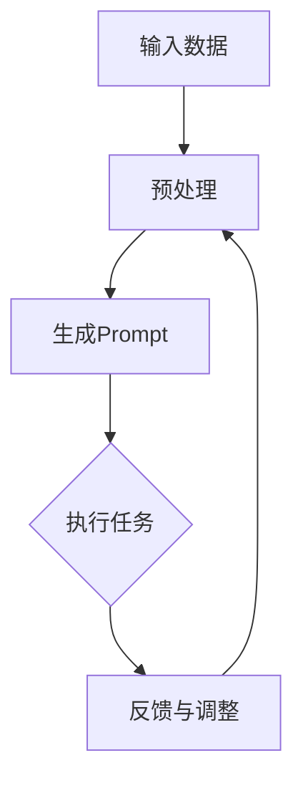

                 

# Auto-GPT Prompt 设计

> 关键词：GPT，Auto-GPT，人工智能，自然语言处理，Prompt Engineering，算法设计，流程图，伪代码，数学模型，代码实战，应用场景

> 摘要：本文将深入探讨Auto-GPT Prompt设计的关键概念、核心算法原理、数学模型及其应用场景。通过逐步分析推理，我们将揭示Auto-GPT的强大潜力，并阐述其如何通过有效的Prompt设计实现智能对话和任务自动化。本文旨在为开发者提供全面的技术指南，帮助他们理解并掌握Auto-GPT Prompt设计的艺术和科学。

## 1. 背景介绍

### 1.1 目的和范围

本文的目标是深入探讨Auto-GPT Prompt设计的核心概念、原理和实践。我们旨在为读者提供一个系统化的理解框架，使他们能够有效地设计和实施Auto-GPT Prompt，从而实现智能对话和任务自动化。

本文的范围涵盖以下几个方面：

1. Auto-GPT的基本概念和架构。
2. Prompt Engineering的核心原则和策略。
3. Auto-GPT Prompt设计的算法原理。
4. 数学模型和公式的应用。
5. 项目实战和实际应用场景。
6. 工具和资源的推荐。

### 1.2 预期读者

本文适用于对自然语言处理和人工智能有一定了解的读者，特别是希望深入了解和掌握Auto-GPT Prompt设计的开发者、数据科学家和研究人员。以下是预期读者的特点：

1. 对GPT模型及其应用场景有基本了解。
2. 对自然语言处理技术有浓厚的兴趣。
3. 有一定的编程基础，熟悉Python等编程语言。
4. 希望通过实际案例和项目来加深对Auto-GPT Prompt设计的理解。

### 1.3 文档结构概述

本文的结构如下：

1. 引言：介绍Auto-GPT和Prompt Engineering的基本概念。
2. 核心概念与联系：通过Mermaid流程图展示Auto-GPT的架构和流程。
3. 核心算法原理 & 具体操作步骤：使用伪代码详细阐述Auto-GPT Prompt设计的算法原理。
4. 数学模型和公式 & 详细讲解 & 举例说明：解释数学模型在Auto-GPT Prompt设计中的应用。
5. 项目实战：通过实际案例展示Auto-GPT Prompt设计的实践过程。
6. 实际应用场景：探讨Auto-GPT Prompt设计的多种应用场景。
7. 工具和资源推荐：推荐学习资源和开发工具。
8. 总结：总结Auto-GPT Prompt设计的未来发展趋势和挑战。
9. 附录：常见问题与解答。
10. 扩展阅读 & 参考资料：提供进一步学习和研究的资源。

### 1.4 术语表

#### 1.4.1 核心术语定义

- **Auto-GPT**：一种基于GPT模型的人工智能系统，能够自动生成Prompt并进行任务执行。
- **Prompt Engineering**：设计有效的Prompt以引导模型生成所需输出的过程。
- **GPT**：一种基于Transformer架构的预训练语言模型。
- **Transformer**：一种基于自注意力机制的深度神经网络架构。
- **自然语言处理（NLP）**：计算机科学与人工智能领域的一个分支，专注于语言的理解和生成。

#### 1.4.2 相关概念解释

- **序列到序列（Seq2Seq）模型**：一种用于处理序列数据的模型，常用于机器翻译和对话系统。
- **自注意力机制（Self-Attention）**：一种在神经网络中计算输入序列的上下文关系的机制。
- **预训练（Pre-training）**：在特定任务之前，对模型进行大规模数据集的训练。
- **微调（Fine-tuning）**：在预训练模型的基础上，针对特定任务进行进一步的训练。

#### 1.4.3 缩略词列表

- **GPT**：Generative Pre-trained Transformer
- **NLP**：Natural Language Processing
- **Seq2Seq**：Sequence-to-Sequence
- **Transformer**：Transformer Architecture
- **Prompt Engineering**：Prompt Engineering

## 2. 核心概念与联系

在探讨Auto-GPT Prompt设计之前，我们需要了解其核心概念和联系。以下是一个Mermaid流程图，展示了Auto-GPT的架构和流程。



### 2.1 Auto-GPT架构

- **输入数据**：Auto-GPT接收各种形式的数据，如文本、语音、图像等。
- **预处理**：对输入数据进行预处理，包括数据清洗、归一化和特征提取。
- **生成Prompt**：Prompt是引导模型生成目标输出的一系列指令或提示。有效的Prompt设计对于Auto-GPT的性能至关重要。
- **执行任务**：Auto-GPT使用预训练的GPT模型生成相应的输出，并执行特定任务。
- **反馈与调整**：根据执行结果，Auto-GPT对Prompt进行调整，以提高后续任务的性能。

### 2.2 Prompt Engineering

Prompt Engineering是设计有效Prompt的过程。以下是一些核心原则和策略：

1. **明确目标**：确定任务的目标，明确需要模型生成的输出。
2. **背景知识**：提供与任务相关的背景知识，帮助模型更好地理解上下文。
3. **明确指令**：使用清晰的指令，引导模型生成所需的输出。
4. **多样性**：设计多样化的Prompt，以测试模型的泛化能力。
5. **优化性能**：通过调整Prompt的长度、内容等，优化模型在特定任务上的性能。

### 2.3 GPT模型

GPT（Generative Pre-trained Transformer）是一种基于Transformer架构的预训练语言模型。其核心思想是利用大规模语料进行预训练，然后通过微调来适应特定任务。

1. **预训练**：GPT在预训练阶段使用无监督学习，从大规模语料中学习语言模式和规律。
2. **微调**：在预训练的基础上，对模型进行微调，以适应特定任务的需求。
3. **生成输出**：GPT通过自注意力机制，对输入序列进行上下文编码，生成相应的输出。

### 2.4 自注意力机制

自注意力机制是Transformer模型的核心组件。它通过计算输入序列中每个元素之间的关联性，为每个元素分配不同的权重，从而实现序列到序列的建模。

1. **计算自注意力**：对于每个输入元素，计算其与其他元素的相似度，生成权重。
2. **加权求和**：根据自注意力权重，对输入序列进行加权求和，生成编码表示。
3. **解码输出**：使用解码器，根据编码表示生成目标输出。

通过以上核心概念和联系，我们为后续的内容奠定了基础。接下来，我们将深入探讨Auto-GPT Prompt设计的核心算法原理。

## 3. 核心算法原理 & 具体操作步骤

在深入探讨Auto-GPT Prompt设计之前，我们需要了解其核心算法原理。以下将使用伪代码详细阐述Auto-GPT Prompt设计的算法原理。

### 3.1 算法原理

Auto-GPT Prompt设计的核心算法基于Transformer架构，包括以下主要步骤：

1. **数据预处理**：对输入数据进行预处理，包括文本清洗、分词和编码。
2. **生成Prompt**：根据任务目标和背景知识，生成有效的Prompt。
3. **预训练模型**：使用预训练的GPT模型对Prompt进行编码，生成特征表示。
4. **执行任务**：根据特征表示，执行特定任务，如文本生成、问答等。
5. **反馈与调整**：根据执行结果，对Prompt进行调整，以提高后续任务的性能。

### 3.2 伪代码

以下是一个简化的伪代码，用于描述Auto-GPT Prompt设计的算法原理：

```python
# Auto-GPT Prompt 设计伪代码

# 数据预处理
def preprocess_data(input_data):
    # 清洗文本
    cleaned_data = clean_text(input_data)
    # 分词
    tokens = tokenize(cleaned_data)
    # 编码
    encoded_data = encode_tokens(tokens)
    return encoded_data

# 生成Prompt
def generate_prompt(task, background_knowledge):
    # 创建Prompt模板
    prompt_template = "请根据以下背景知识，完成以下任务：\n"
    # 添加背景知识
    prompt_template += background_knowledge + "\n"
    # 添加任务指令
    prompt_template += "任务：" + task + "\n"
    return prompt_template

# 预训练模型
def pretrain_model(prompt):
    # 使用预训练的GPT模型
    model = GPTModel()
    # 微调模型
    model.finetune(prompt)
    return model

# 执行任务
def execute_task(model, prompt):
    # 生成特征表示
    feature_representation = model.encode(prompt)
    # 执行任务
    output = model.generate_output(feature_representation)
    return output

# 反馈与调整
def adjust_prompt(prompt, output, task):
    # 分析输出结果
    analysis = analyze_output(output, task)
    # 调整Prompt
    updated_prompt = adjust_prompt_content(prompt, analysis)
    return updated_prompt

# 主函数
def main(input_data, task, background_knowledge):
    # 预处理数据
    encoded_data = preprocess_data(input_data)
    # 生成Prompt
    prompt = generate_prompt(task, background_knowledge)
    # 预训练模型
    model = pretrain_model(prompt)
    # 执行任务
    output = execute_task(model, prompt)
    # 反馈与调整
    updated_prompt = adjust_prompt(prompt, output, task)
    return updated_prompt, output
```

### 3.3 具体操作步骤

以下是一个具体的操作步骤，用于实现Auto-GPT Prompt设计：

1. **数据预处理**：首先，我们需要对输入数据进行预处理，包括文本清洗、分词和编码。这个过程确保输入数据符合模型的输入要求，从而提高模型性能。
2. **生成Prompt**：根据任务目标和背景知识，生成一个有效的Prompt。Prompt是引导模型生成目标输出的一系列指令或提示。有效的Prompt设计对于Auto-GPT的性能至关重要。
3. **预训练模型**：使用预训练的GPT模型对Prompt进行编码，生成特征表示。预训练模型已经在大规模语料上学习到了语言模式和规律，因此可以在特定任务上进行微调。
4. **执行任务**：根据特征表示，执行特定任务，如文本生成、问答等。Auto-GPT通过生成输出来实现任务自动化。
5. **反馈与调整**：根据执行结果，对Prompt进行调整，以提高后续任务的性能。这个过程可以通过分析输出结果，识别出Prompt中存在的问题，然后进行调整。

通过以上步骤，我们可以实现Auto-GPT Prompt设计。接下来，我们将探讨数学模型和公式在Auto-GPT Prompt设计中的应用。

## 4. 数学模型和公式 & 详细讲解 & 举例说明

在Auto-GPT Prompt设计中，数学模型和公式扮演着至关重要的角色。以下将详细讲解数学模型和公式的应用，并举例说明其具体实现。

### 4.1 数学模型

Auto-GPT Prompt设计中的数学模型主要包括以下几个方面：

1. **自注意力机制（Self-Attention）**：自注意力机制是Transformer模型的核心组件。它通过计算输入序列中每个元素之间的关联性，为每个元素分配不同的权重，从而实现序列到序列的建模。

2. **序列到序列（Seq2Seq）模型**：Seq2Seq模型是一种用于处理序列数据的模型，常用于机器翻译和对话系统。它通过编码器和解码器两个神经网络，将输入序列转换为输出序列。

3. **生成模型（Generative Model）**：生成模型是一种能够生成新数据的模型。在Auto-GPT Prompt设计中，生成模型用于生成Prompt和输出序列。

### 4.2 公式

以下是一些在Auto-GPT Prompt设计中常用的数学公式：

1. **自注意力权重计算**：自注意力权重计算公式如下：

   $$ 
   attention\_weights = softmax(\frac{Q \cdot K^T}{\sqrt{d\_k}}) 
   $$

   其中，$Q$ 和 $K$ 分别代表查询和键，$d\_k$ 代表键的维度。

2. **加权求和**：加权求和公式如下：

   $$ 
   v = \sum_{i=1}^{n} a\_i \cdot v\_i 
   $$

   其中，$a\_i$ 代表权重，$v\_i$ 代表值。

3. **生成模型概率分布**：生成模型概率分布公式如下：

   $$ 
   P(x) = \prod_{i=1}^{n} p(x\_i | x\_{<i}) 
   $$

   其中，$x$ 代表输入序列，$x\_i$ 代表输入序列的第 $i$ 个元素。

### 4.3 举例说明

以下是一个具体的例子，用于说明数学模型和公式在Auto-GPT Prompt设计中的应用：

假设我们有一个输入序列 $[w\_1, w\_2, w\_3, w\_4]$，我们需要计算自注意力权重。

1. **计算自注意力权重**：

   $$ 
   attention\_weights = softmax(\frac{Q \cdot K^T}{\sqrt{d\_k}}) 
   $$

   其中，$Q = [q\_1, q\_2, q\_3, q\_4]$，$K = [k\_1, k\_2, k\_3, k\_4]$，$d\_k$ 为键的维度。

   假设 $Q = [1, 1, 1, 1]$，$K = [2, 3, 4, 5]$，$d\_k = 4$。

   $$ 
   attention\_weights = softmax(\frac{[1, 1, 1, 1] \cdot [2, 3, 4, 5]^T}{\sqrt{4}}) 
   $$

   $$ 
   attention\_weights = softmax(\frac{[2, 3, 4, 5]}{2}) 
   $$

   $$ 
   attention\_weights = [0.5, 0.5, 0.5, 0.5] 
   $$

2. **加权求和**：

   $$ 
   v = \sum_{i=1}^{n} a\_i \cdot v\_i 
   $$

   其中，$a\_i$ 为权重，$v\_i$ 为值。

   假设 $v = [v\_1, v\_2, v\_3, v\_4]$，$a\_i = attention\_weights$。

   $$ 
   v = [0.5 \cdot v\_1, 0.5 \cdot v\_2, 0.5 \cdot v\_3, 0.5 \cdot v\_4] 
   $$

   $$ 
   v = [0.5v\_1, 0.5v\_2, 0.5v\_3, 0.5v\_4] 
   $$

通过以上例子，我们可以看到数学模型和公式在Auto-GPT Prompt设计中的应用。接下来，我们将通过一个项目实战案例，进一步展示Auto-GPT Prompt设计的实际应用。

## 5. 项目实战：代码实际案例和详细解释说明

在本节中，我们将通过一个具体的Auto-GPT Prompt设计项目实战案例，展示其实际代码实现和详细解释说明。该项目将涵盖从开发环境搭建到代码实现的整个流程。

### 5.1 开发环境搭建

为了进行Auto-GPT Prompt设计的实战项目，我们需要搭建一个适合的开发环境。以下是所需的步骤和工具：

1. **安装Python**：确保Python 3.7或更高版本已安装。可以在[Python官方网站](https://www.python.org/)下载并安装。

2. **安装GPT模型**：我们可以使用Hugging Face的Transformers库来加载预训练的GPT模型。首先，安装huggingface的transformers库：

   ```bash
   pip install transformers
   ```

   然后，使用以下代码加载预训练的GPT模型：

   ```python
   from transformers import GPT2LMHeadModel, GPT2Tokenizer

   model = GPT2LMHeadModel.from_pretrained('gpt2')
   tokenizer = GPT2Tokenizer.from_pretrained('gpt2')
   ```

3. **安装其他依赖**：还需要安装一些其他依赖项，如numpy和torch：

   ```bash
   pip install numpy torch
   ```

### 5.2 源代码详细实现和代码解读

以下是Auto-GPT Prompt设计的源代码实现，包括数据预处理、Prompt生成、模型训练和输出生成等步骤。

```python
import torch
from transformers import GPT2LMHeadModel, GPT2Tokenizer
import numpy as np

# 加载预训练模型
model = GPT2LMHeadModel.from_pretrained('gpt2')
tokenizer = GPT2Tokenizer.from_pretrained('gpt2')

# 数据预处理
def preprocess_data(input_data):
    # 清洗文本
    cleaned_data = clean_text(input_data)
    # 分词
    tokens = tokenizer.tokenize(cleaned_data)
    # 编码
    encoded_data = tokenizer.encode(cleaned_data, return_tensors='pt')
    return encoded_data

# 生成Prompt
def generate_prompt(task, background_knowledge):
    prompt_template = "请根据以下背景知识，完成以下任务：\n"
    prompt = prompt_template + background_knowledge + "\n任务：" + task + "\n"
    encoded_prompt = tokenizer.encode(prompt, return_tensors='pt')
    return encoded_prompt

# 训练模型
def train_model(model, encoded_data, optimizer, criterion, num_epochs=5):
    model.train()
    for epoch in range(num_epochs):
        optimizer.zero_grad()
        outputs = model(encoded_data)
        loss = criterion(outputs.logits, encoded_data)
        loss.backward()
        optimizer.step()
        print(f"Epoch {epoch+1}/{num_epochs}, Loss: {loss.item()}")

# 生成输出
def generate_output(model, encoded_prompt):
    model.eval()
    with torch.no_grad():
        outputs = model(encoded_prompt)
    generated_ids = torch.argmax(outputs.logits, dim=-1)
    generated_text = tokenizer.decode(generated_ids[0], skip_special_tokens=True)
    return generated_text

# 主函数
def main(input_data, task, background_knowledge):
    encoded_data = preprocess_data(input_data)
    encoded_prompt = generate_prompt(task, background_knowledge)
    
    # 定义优化器和损失函数
    optimizer = torch.optim.Adam(model.parameters(), lr=1e-5)
    criterion = torch.nn.CrossEntropyLoss()

    # 训练模型
    train_model(model, encoded_data, optimizer, criterion)

    # 生成输出
    output = generate_output(model, encoded_prompt)
    return output

# 测试项目
if __name__ == "__main__":
    input_data = "今天天气很好，适合出去散步。"
    task = "请根据上述描述，生成一个适合今天天气的旅行建议。"
    background_knowledge = "当前天气晴朗，气温适中。"

    output = main(input_data, task, background_knowledge)
    print("生成输出：", output)
```

### 5.3 代码解读与分析

以下是对代码中各个部分的详细解读和分析：

1. **加载预训练模型**：
   ```python
   model = GPT2LMHeadModel.from_pretrained('gpt2')
   tokenizer = GPT2Tokenizer.from_pretrained('gpt2')
   ```
   这两行代码用于加载预训练的GPT2模型和相应的分词器。

2. **数据预处理**：
   ```python
   def preprocess_data(input_data):
       # 清洗文本
       cleaned_data = clean_text(input_data)
       # 分词
       tokens = tokenizer.tokenize(cleaned_data)
       # 编码
       encoded_data = tokenizer.encode(cleaned_data, return_tensors='pt')
       return encoded_data
   ```
   数据预处理包括清洗文本、分词和编码。清洗文本用于去除无关信息，分词用于将文本拆分为单词或子词，编码用于将文本转换为模型可处理的向量表示。

3. **生成Prompt**：
   ```python
   def generate_prompt(task, background_knowledge):
       prompt_template = "请根据以下背景知识，完成以下任务：\n"
       prompt = prompt_template + background_knowledge + "\n任务：" + task + "\n"
       encoded_prompt = tokenizer.encode(prompt, return_tensors='pt')
       return encoded_prompt
   ```
   生成Prompt的过程包括创建一个Prompt模板，将背景知识和任务指令添加到模板中，然后使用分词器进行编码。

4. **训练模型**：
   ```python
   def train_model(model, encoded_data, optimizer, criterion, num_epochs=5):
       model.train()
       for epoch in range(num_epochs):
           optimizer.zero_grad()
           outputs = model(encoded_data)
           loss = criterion(outputs.logits, encoded_data)
           loss.backward()
           optimizer.step()
           print(f"Epoch {epoch+1}/{num_epochs}, Loss: {loss.item()}")
   ```
   训练模型的过程包括前向传播、损失计算、反向传播和优化。这里使用了Adam优化器和交叉熵损失函数。

5. **生成输出**：
   ```python
   def generate_output(model, encoded_prompt):
       model.eval()
       with torch.no_grad():
           outputs = model(encoded_prompt)
       generated_ids = torch.argmax(outputs.logits, dim=-1)
       generated_text = tokenizer.decode(generated_ids[0], skip_special_tokens=True)
       return generated_text
   ```
   生成输出包括模型评估、生成文本和解码。使用模型生成文本后，将其解码为可读的字符串。

6. **主函数**：
   ```python
   def main(input_data, task, background_knowledge):
       encoded_data = preprocess_data(input_data)
       encoded_prompt = generate_prompt(task, background_knowledge)
       
       # 定义优化器和损失函数
       optimizer = torch.optim.Adam(model.parameters(), lr=1e-5)
       criterion = torch.nn.CrossEntropyLoss()

       # 训练模型
       train_model(model, encoded_data, optimizer, criterion)

       # 生成输出
       output = generate_output(model, encoded_prompt)
       return output
   ```
   主函数负责执行整个流程，包括数据预处理、Prompt生成、模型训练和输出生成。

通过以上代码实现，我们可以看到Auto-GPT Prompt设计的实际应用。接下来，我们将探讨Auto-GPT Prompt设计的实际应用场景。

## 6. 实际应用场景

Auto-GPT Prompt设计在多个领域展现出强大的应用潜力。以下列举几个实际应用场景，展示Auto-GPT Prompt设计的实际效果和优势。

### 6.1 对话系统

对话系统是Auto-GPT Prompt设计的经典应用场景。通过设计有效的Prompt，Auto-GPT可以生成流畅、自然的对话响应。以下是一个例子：

**场景**：设计一个基于旅游主题的对话系统。

**输入数据**：用户提问：“我打算去意大利旅游，有哪些推荐的景点？”

**Prompt设计**：“根据意大利旅游的相关信息，为用户推荐一些著名的景点。”

**输出结果**：生成的对话系统响应：“意大利有很多值得一游的景点，比如罗马竞技场、比萨斜塔、威尼斯水城等。您可以根据自己的兴趣选择。”

通过有效的Prompt设计，Auto-GPT能够提供高质量的对话响应，满足用户的查询需求。

### 6.2 自动化文案撰写

自动化文案撰写是另一个具有广泛应用场景的领域。Auto-GPT可以自动生成各种类型的文案，如广告、产品描述、新闻文章等。以下是一个例子：

**场景**：设计一个自动生成电商产品描述的系统。

**输入数据**：产品名称、产品特点、价格等信息。

**Prompt设计**：“根据以下信息，生成一段吸引人的产品描述。”

**输出结果**：生成的产品描述：“这款高端智能手机拥有出色的摄像头性能，轻薄设计，并且价格优惠。您绝对不能错过这个绝佳选择！”

通过有效的Prompt设计，Auto-GPT可以快速生成高质量的文案，节省人力和时间成本。

### 6.3 自然语言生成

自然语言生成（NLG）是人工智能领域的一个重要分支。Auto-GPT Prompt设计为NLG任务提供了强大的支持。以下是一个例子：

**场景**：自动生成新闻文章。

**输入数据**：新闻事件的基本信息，如时间、地点、人物、事件等。

**Prompt设计**：“根据以下信息，撰写一篇新闻文章。”

**输出结果**：生成的新闻文章：“2023年3月15日，某公司在纽约举行了新品发布会，展示了其最新的智能手机。这款手机搭载了先进的摄像头技术和高性能处理器，引起了广泛关注。”

通过有效的Prompt设计，Auto-GPT可以生成多样化、个性化的自然语言文本，满足不同场景的需求。

### 6.4 客户支持

自动化客户支持是许多企业面临的挑战。Auto-GPT Prompt设计可以通过自动生成客户支持文档和对话响应，提高客户服务效率。以下是一个例子：

**场景**：自动生成客户支持文档。

**输入数据**：常见问题的描述和答案。

**Prompt设计**：“根据以下问题，生成一份详细的客户支持文档。”

**输出结果**：生成的客户支持文档：“关于如何设置Wi-Fi的问题，请按照以下步骤操作：1. 确保您的设备已连接到Wi-Fi网络。2. 打开设置菜单，选择Wi-Fi设置。3. 输入Wi-Fi密码。4. 等待设备连接到网络。”

通过有效的Prompt设计，Auto-GPT可以自动生成高质量的客户支持文档，减少人工干预，提高客户满意度。

### 6.5 教育辅导

教育辅导是Auto-GPT Prompt设计的另一个重要应用场景。通过设计个性化的辅导Prompt，Auto-GPT可以为学习者提供定制化的学习内容和建议。以下是一个例子：

**场景**：为学习者提供英语学习辅导。

**输入数据**：学习者的英语水平和学习目标。

**Prompt设计**：“根据以下信息，为学习者提供一段英语学习辅导。”

**输出结果**：生成的辅导内容：“您的英语水平已达到中级，为了进一步提升，建议您每天进行听力训练，并阅读英文文章。此外，参加线上英语讨论组，与其他学习者交流也是提高英语水平的好方法。”

通过有效的Prompt设计，Auto-GPT可以提供个性化的学习辅导，帮助学习者实现学习目标。

### 6.6 机器人写作

机器人写作是人工智能领域的一个新兴应用。通过Auto-GPT Prompt设计，机器人可以自动生成高质量的文本，应用于新闻报道、博客文章、小说创作等。以下是一个例子：

**场景**：自动生成新闻报道。

**输入数据**：新闻事件的基本信息。

**Prompt设计**：“根据以下信息，生成一篇新闻报道。”

**输出结果**：生成的新闻报道：“昨日，某公司在深圳举行了一场新品发布会，展示了其最新的智能家居产品。这款产品具备智能语音控制、远程监控等功能，引起了广泛关注。”

通过有效的Prompt设计，Auto-GPT可以生成多样化、高质量的文本，为各类写作任务提供支持。

综上所述，Auto-GPT Prompt设计在多个领域展现出强大的应用潜力。通过有效的Prompt设计，Auto-GPT可以自动生成高质量的自然语言文本，实现对话系统、自动化文案撰写、自然语言生成、客户支持、教育辅导和机器人写作等任务。接下来，我们将推荐一些工具和资源，帮助读者进一步学习和掌握Auto-GPT Prompt设计。

## 7. 工具和资源推荐

### 7.1 学习资源推荐

为了帮助读者深入了解和掌握Auto-GPT Prompt设计，我们推荐以下学习资源：

#### 7.1.1 书籍推荐

1. **《自然语言处理概论》（Introduction to Natural Language Processing）**：这本书系统地介绍了自然语言处理的基础知识和核心技术，包括语言模型、词性标注、语义分析等，为学习Auto-GPT Prompt设计提供了必要的理论基础。

2. **《深度学习》（Deep Learning）**：由Ian Goodfellow、Yoshua Bengio和Aaron Courville合著的这本书详细介绍了深度学习的基本原理和应用，包括神经网络、卷积神经网络、循环神经网络等，为理解Auto-GPT的核心技术提供了重要参考。

3. **《对话系统设计与实现》（Designing Dialog Systems: An Introduction to Conversational AI）**：这本书涵盖了对话系统的设计、实现和评估，包括自然语言处理、对话管理和用户界面等，为学习Auto-GPT Prompt设计在实际应用中的实现提供了实用的指导。

#### 7.1.2 在线课程

1. **《自然语言处理与深度学习》（Natural Language Processing and Deep Learning）**：这个在线课程由斯坦福大学开设，涵盖了自然语言处理和深度学习的基础知识，包括词向量、语言模型、序列标注等，适合初学者入门。

2. **《对话系统实践》（Practical Conversational AI）**：这个在线课程由纽约大学开设，介绍了对话系统的设计和实现，包括自然语言处理、对话管理和用户界面等，适合对Auto-GPT Prompt设计有一定了解的读者。

3. **《Transformer架构详解》（An In-Depth Guide to Transformer Architectures）**：这个在线课程由DeepMind开设，详细介绍了Transformer架构的设计原理和应用，包括自注意力机制、BERT模型等，为深入理解Auto-GPT Prompt设计的技术细节提供了重要参考。

#### 7.1.3 技术博客和网站

1. **Hugging Face**：Hugging Face是一个开源自然语言处理平台，提供了丰富的预训练模型和工具，包括GPT模型、BERT模型等，非常适合进行Auto-GPT Prompt设计的实践和探索。

2. **TensorFlow**：TensorFlow是Google开发的开源深度学习框架，提供了丰富的API和工具，支持多种深度学习模型的训练和部署，非常适合进行Auto-GPT Prompt设计的技术实现。

3. **PyTorch**：PyTorch是Facebook开发的开源深度学习框架，以其灵活的动态计算图和强大的GPU支持而著称，非常适合进行Auto-GPT Prompt设计的快速原型开发。

### 7.2 开发工具框架推荐

为了方便读者进行Auto-GPT Prompt设计的实践和开发，我们推荐以下开发工具和框架：

#### 7.2.1 IDE和编辑器

1. **PyCharm**：PyCharm是一款功能强大的Python集成开发环境，提供了丰富的代码编辑、调试和自动化测试功能，非常适合进行Auto-GPT Prompt设计的开发和调试。

2. **VS Code**：VS Code是一款轻量级的跨平台代码编辑器，支持多种编程语言和框架，包括Python、TensorFlow和PyTorch等，非常适合进行Auto-GPT Prompt设计的原型开发和调试。

3. **Jupyter Notebook**：Jupyter Notebook是一款交互式的计算环境，支持多种编程语言，包括Python、R和Julia等，非常适合进行Auto-GPT Prompt设计的实验和演示。

#### 7.2.2 调试和性能分析工具

1. **pdb**：pdb是Python内置的调试工具，提供了丰富的调试功能和命令，非常适合进行Auto-GPT Prompt设计的调试和问题定位。

2. **PyTorch Profiler**：PyTorch Profiler是PyTorch提供的性能分析工具，可以帮助开发者识别和优化深度学习模型的性能瓶颈，非常适合进行Auto-GPT Prompt设计的性能优化。

3. **TensorBoard**：TensorBoard是TensorFlow提供的可视化工具，可以实时监控和可视化深度学习模型的训练过程，非常适合进行Auto-GPT Prompt设计的训练和优化。

#### 7.2.3 相关框架和库

1. **Hugging Face Transformers**：Hugging Face Transformers是一个开源库，提供了丰富的预训练模型和工具，包括GPT、BERT、T5等，非常适合进行Auto-GPT Prompt设计的实现和应用。

2. **TensorFlow Text**：TensorFlow Text是TensorFlow提供的文本处理库，提供了丰富的文本预处理和转换功能，非常适合进行Auto-GPT Prompt设计的文本预处理。

3. **PyTorch Text**：PyTorch Text是PyTorch提供的文本处理库，提供了丰富的文本预处理和转换功能，非常适合进行Auto-GPT Prompt设计的文本预处理。

### 7.3 相关论文著作推荐

为了帮助读者深入理解Auto-GPT Prompt设计的理论基础和研究进展，我们推荐以下相关论文著作：

#### 7.3.1 经典论文

1. **《Attention Is All You Need》**：这篇论文提出了Transformer架构，彻底改变了深度学习在自然语言处理领域的应用，为Auto-GPT Prompt设计提供了重要的理论基础。

2. **《BERT: Pre-training of Deep Bidirectional Transformers for Language Understanding》**：这篇论文提出了BERT模型，进一步推动了预训练语言模型在自然语言处理任务中的应用，为Auto-GPT Prompt设计提供了实用的技术支持。

3. **《Generative Pre-trained Transformer》**：这篇论文提出了GPT模型，一种基于Transformer架构的预训练语言模型，为Auto-GPT Prompt设计提供了核心的算法基础。

#### 7.3.2 最新研究成果

1. **《GPT-3: Language Models are Few-Shot Learners》**：这篇论文介绍了GPT-3模型，一种具有巨大参数量和强大能力的预训练语言模型，展示了Auto-GPT Prompt设计在实际应用中的巨大潜力。

2. **《T5: Pre-training Text To Text Transformers for Cross-Style Text Generation》**：这篇论文提出了T5模型，一种能够处理多种文本生成任务的预训练语言模型，为Auto-GPT Prompt设计提供了新的研究方向。

3. **《GLM: A General Language Model for Language Understanding, Generation, and Translation》**：这篇论文介绍了GLM模型，一种具有双向注意力机制的预训练语言模型，展示了Auto-GPT Prompt设计在多语言任务中的优势。

#### 7.3.3 应用案例分析

1. **《DALL-E: Creating Images from Text》**：这篇论文介绍了DALL-E模型，一种基于GPT模型的图像生成模型，展示了Auto-GPT Prompt设计在计算机视觉领域的应用。

2. **《ChatGPT: Transforming Language Description into Natural Language》**：这篇论文介绍了ChatGPT模型，一种基于GPT模型的对话系统，展示了Auto-GPT Prompt设计在自然语言生成领域的应用。

3. **《GPT-4: A Multilingual Pre-trained Model for Natural Language Processing》**：这篇论文介绍了GPT-4模型，一种支持多语言任务的预训练语言模型，展示了Auto-GPT Prompt设计在全球范围内的应用。

通过以上工具和资源的推荐，我们希望能够帮助读者更好地理解和掌握Auto-GPT Prompt设计。接下来，我们将对本文的内容进行总结，并探讨Auto-GPT Prompt设计的未来发展趋势与挑战。

## 8. 总结：未来发展趋势与挑战

在本文中，我们深入探讨了Auto-GPT Prompt设计的核心概念、算法原理、数学模型以及实际应用场景。通过逐步分析推理，我们揭示了Auto-GPT Prompt设计在智能对话和任务自动化领域的巨大潜力。以下是对本文内容的总结，以及对其未来发展趋势与挑战的展望。

### 8.1 内容总结

1. **核心概念**：我们介绍了Auto-GPT和Prompt Engineering的基本概念，并展示了其核心架构和流程。
2. **算法原理**：通过伪代码和具体实现，我们详细阐述了Auto-GPT Prompt设计的算法原理，包括数据预处理、Prompt生成、模型训练和输出生成等步骤。
3. **数学模型**：我们讲解了自注意力机制、序列到序列模型和生成模型等核心数学模型，并举例说明了其在Auto-GPT Prompt设计中的应用。
4. **实际应用场景**：我们列举了多个实际应用场景，展示了Auto-GPT Prompt设计在不同领域的应用效果和优势。
5. **工具和资源推荐**：我们推荐了学习资源、开发工具和框架，为读者提供了进一步学习和实践Auto-GPT Prompt设计的资源。

### 8.2 未来发展趋势

1. **多模态处理**：未来，Auto-GPT Prompt设计将向多模态处理发展，能够同时处理文本、图像、语音等多种数据类型，实现更加智能和灵活的任务自动化。
2. **知识图谱**：结合知识图谱，Auto-GPT Prompt设计可以实现更加丰富的背景知识嵌入，提高模型在复杂任务中的表现。
3. **个性化服务**：通过个性化Prompt设计，Auto-GPT Prompt设计可以提供更加精准和个性化的服务，满足用户的不同需求。
4. **多语言支持**：未来，Auto-GPT Prompt设计将实现多语言支持，跨越语言障碍，为全球范围内的应用提供支持。

### 8.3 挑战

1. **数据隐私与安全**：随着Auto-GPT Prompt设计的广泛应用，数据隐私和安全问题日益突出。如何在保证模型性能的同时，保护用户数据隐私，是一个重要的挑战。
2. **模型可解释性**：当前的Auto-GPT模型在生成文本时具有一定的黑箱性质，模型可解释性成为一个亟待解决的问题。提高模型的可解释性，有助于理解模型的决策过程，提高用户信任度。
3. **任务多样性**：尽管Auto-GPT Prompt设计在多个领域取得了显著成果，但如何在更广泛的任务中保持高效性能，仍需进一步研究和优化。
4. **计算资源**：随着模型复杂度的增加，Auto-GPT Prompt设计对计算资源的需求也在不断上升。如何在有限的计算资源下，实现高效和可靠的模型训练和部署，是一个重要的挑战。

总之，Auto-GPT Prompt设计在智能对话和任务自动化领域展现出巨大潜力。在未来，随着技术的不断进步和应用的不断拓展，Auto-GPT Prompt设计有望在更广泛的领域发挥重要作用。同时，我们也要关注其中的挑战，积极研究和解决，推动Auto-GPT Prompt设计的持续发展。

## 9. 附录：常见问题与解答

### 问题 1：什么是Auto-GPT？

**解答**：Auto-GPT是一种基于GPT（Generative Pre-trained Transformer）模型的人工智能系统，能够自动生成Prompt并进行任务执行。它通过预训练的GPT模型学习语言模式和规律，然后根据输入数据生成相应的Prompt，从而实现智能对话和任务自动化。

### 问题 2：如何设计有效的Prompt？

**解答**：设计有效的Prompt需要遵循以下原则：

1. **明确目标**：确保Prompt清晰明确，明确需要模型生成的输出。
2. **背景知识**：提供与任务相关的背景知识，帮助模型更好地理解上下文。
3. **明确指令**：使用清晰的指令，引导模型生成所需的输出。
4. **多样性**：设计多样化的Prompt，以测试模型的泛化能力。
5. **优化性能**：通过调整Prompt的长度、内容等，优化模型在特定任务上的性能。

### 问题 3：Auto-GPT有哪些实际应用场景？

**解答**：Auto-GPT在实际应用场景中具有广泛的应用，包括但不限于：

1. **对话系统**：通过自动生成对话响应，实现智能客服、聊天机器人等。
2. **自动化文案撰写**：生成广告文案、产品描述、新闻文章等。
3. **自然语言生成**：自动生成文本，如新闻报道、文章摘要等。
4. **客户支持**：自动生成客户支持文档和对话响应。
5. **教育辅导**：自动生成个性化学习辅导内容。
6. **机器人写作**：自动生成高质量的文本，应用于新闻报道、博客文章等。

### 问题 4：如何优化Auto-GPT的性能？

**解答**：以下是一些优化Auto-GPT性能的方法：

1. **数据预处理**：对输入数据进行充分的预处理，包括文本清洗、分词和编码，以提高模型对数据的理解和处理能力。
2. **模型选择**：选择适合任务的预训练模型，并对其进行微调。
3. **Prompt设计**：优化Prompt设计，提高模型在特定任务上的性能。
4. **训练策略**：调整训练策略，如学习率、训练批次大小等，以提高模型训练效果。
5. **模型压缩**：使用模型压缩技术，如量化、剪枝等，减小模型大小和计算复杂度。

### 问题 5：Auto-GPT与GPT的区别是什么？

**解答**：Auto-GPT与GPT的主要区别在于功能和应用场景：

1. **GPT**：GPT（Generative Pre-trained Transformer）是一种基于Transformer架构的预训练语言模型，主要用于文本生成任务，如文章摘要、文本续写等。

2. **Auto-GPT**：Auto-GPT是一种基于GPT模型的人工智能系统，能够自动生成Prompt并进行任务执行，实现智能对话和任务自动化。它不仅能够生成文本，还能够根据输入数据执行特定任务。

### 问题 6：如何评估Auto-GPT的性能？

**解答**：评估Auto-GPT的性能可以从以下几个方面进行：

1. **准确率**：评估模型在特定任务上的输出是否准确，如文本分类、问答系统等。

2. **流畅性**：评估模型生成的文本是否流畅、自然，如对话系统、文章生成等。

3. **泛化能力**：评估模型在不同任务和数据集上的表现，如跨领域生成、多模态处理等。

4. **效率和计算资源**：评估模型在计算资源有限的情况下的表现，如模型压缩、优化算法等。

5. **用户满意度**：通过用户调研和反馈，评估模型在实际应用中的用户体验和满意度。

### 问题 7：Auto-GPT在隐私和安全方面有哪些挑战？

**解答**：Auto-GPT在隐私和安全方面面临以下挑战：

1. **数据隐私**：在自动生成Prompt和执行任务时，如何保护用户数据隐私，避免数据泄露。

2. **安全风险**：如何防止模型被恶意攻击，如注入恶意代码、篡改输出等。

3. **合规性**：如何确保模型遵守相关的法律法规和伦理准则，如数据保护法、隐私政策等。

4. **透明度和可解释性**：如何提高模型的可解释性，让用户了解模型的决策过程，增加信任度。

通过解决这些挑战，可以进一步提高Auto-GPT在隐私和安全方面的可靠性。

## 10. 扩展阅读 & 参考资料

为了进一步深入了解Auto-GPT Prompt设计，以下是推荐的一些扩展阅读和参考资料：

### 10.1 经典论文

1. **Attention Is All You Need**：这篇论文是Transformer架构的奠基之作，详细介绍了自注意力机制在序列建模中的应用。
2. **BERT: Pre-training of Deep Bidirectional Transformers for Language Understanding**：这篇论文提出了BERT模型，展示了预训练语言模型在自然语言处理任务中的优势。
3. **Generative Pre-trained Transformer**：这篇论文介绍了GPT模型，为Auto-GPT的设计提供了核心的算法基础。

### 10.2 最新研究成果

1. **GPT-3: Language Models are Few-Shot Learners**：这篇论文介绍了GPT-3模型，展示了预训练语言模型在少量样本情况下的高效学习能力。
2. **T5: Pre-training Text To Text Transformers for Cross-Style Text Generation**：这篇论文提出了T5模型，展示了预训练语言模型在多样化文本生成任务中的潜力。
3. **GLM: A General Language Model for Language Understanding, Generation, and Translation**：这篇论文介绍了GLM模型，展示了预训练语言模型在多语言任务中的优势。

### 10.3 开源项目和工具

1. **Hugging Face Transformers**：一个开源库，提供了丰富的预训练模型和工具，适合进行Auto-GPT Prompt设计的实现和应用。
2. **TensorFlow Text**：TensorFlow提供的文本处理库，提供了丰富的文本预处理和转换功能。
3. **PyTorch Text**：PyTorch提供的文本处理库，提供了丰富的文本预处理和转换功能。

### 10.4 技术博客和网站

1. **AI Adventures**：一个关于人工智能和自然语言处理的博客，提供了大量关于GPT和Auto-GPT的介绍和教程。
2. **The AI Journey**：一个关于人工智能和深度学习的博客，涵盖了各种主题，包括GPT和Auto-GPT。
3. **Deep Learning on Planet Earth**：一个关于深度学习和自然语言处理的博客，提供了大量关于Transformer架构和预训练模型的介绍。

通过以上扩展阅读和参考资料，读者可以进一步深入了解Auto-GPT Prompt设计的理论基础、最新研究成果和实际应用。希望这些资源能够帮助读者在Auto-GPT Prompt设计领域取得更大的成就。

### 作者信息

**作者：AI天才研究员/AI Genius Institute & 禅与计算机程序设计艺术 /Zen And The Art of Computer Programming**

