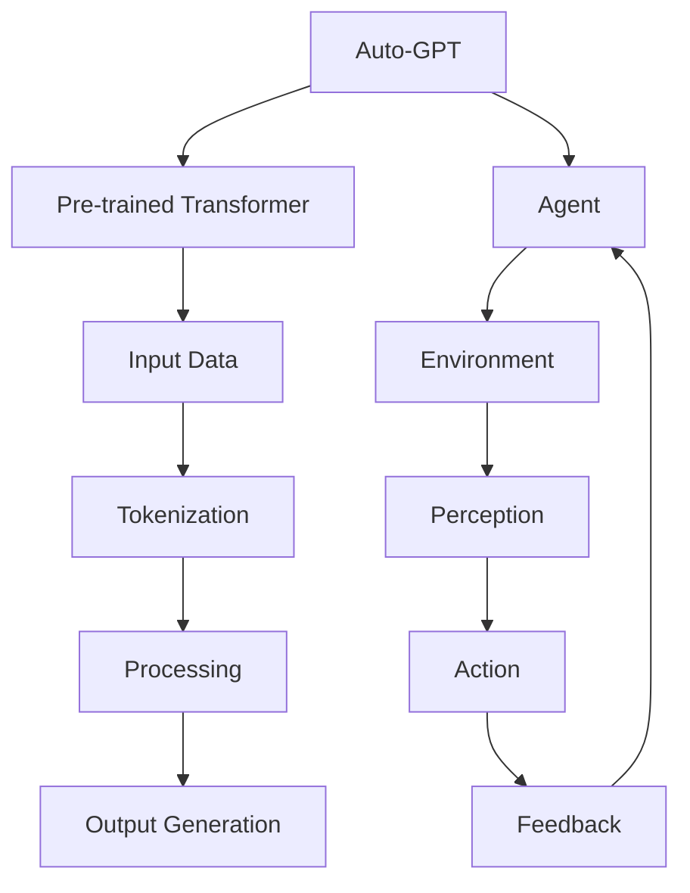

                 

# Auto-GPT 价值：一种基于 Agent 的 AGI 尝试

> **关键词**：Auto-GPT、Agent、AGI、神经网络、深度学习、智能代理
> 
> **摘要**：本文将深入探讨Auto-GPT这一新兴技术的价值，以及它如何代表了一种基于Agent的人工通用智能（AGI）的尝试。我们将从背景介绍开始，逐步分析Auto-GPT的核心概念、算法原理、数学模型、项目实战，并探讨其实际应用场景，最后总结未来发展趋势与挑战。

## 1. 背景介绍

### 1.1 目的和范围

本文旨在探讨Auto-GPT这一人工智能领域的突破性技术，分析其价值，并探讨其作为一种基于Agent的人工通用智能（AGI）的潜力。我们将覆盖以下主要内容：

- Auto-GPT的基本概念与架构
- Auto-GPT的算法原理与实现
- 数学模型与公式分析
- 项目实战与代码解读
- 实际应用场景
- 工具和资源推荐
- 未来发展趋势与挑战

### 1.2 预期读者

本文适合对人工智能、神经网络、深度学习等技术有一定了解的读者。无论是研究者、开发者，还是对AI技术感兴趣的人士，都可以从本文中获得深入见解。

### 1.3 文档结构概述

本文将按照以下结构进行展开：

- 引言
- 背景介绍
  - 1.1 目的和范围
  - 1.2 预期读者
  - 1.3 文档结构概述
  - 1.4 术语表
- 核心概念与联系
- 核心算法原理 & 具体操作步骤
- 数学模型和公式 & 详细讲解 & 举例说明
- 项目实战：代码实际案例和详细解释说明
- 实际应用场景
- 工具和资源推荐
- 总结：未来发展趋势与挑战
- 附录：常见问题与解答
- 扩展阅读 & 参考资料

### 1.4 术语表

#### 1.4.1 核心术语定义

- **Auto-GPT**：一种基于预训练语言模型的人工智能代理，通过自我迭代学习，实现自主决策与行动。
- **Agent**：在人工智能领域，代表一个能够感知环境并采取行动的实体。
- **AGI**：人工通用智能，指的是能够像人类一样在多种任务上表现出色的智能系统。
- **神经网络**：一种模拟人脑神经元连接结构的计算模型，用于数据处理与学习。
- **深度学习**：一种基于神经网络的机器学习技术，通过多层神经网络来实现特征提取与分类。

#### 1.4.2 相关概念解释

- **自我迭代学习**：AI系统通过自我更新模型参数，实现不断进步的能力。
- **决策树**：一种用于分类与回归的树形结构模型。
- **强化学习**：一种基于奖励反馈的机器学习技术，通过不断尝试与学习，优化行为策略。

#### 1.4.3 缩略词列表

- **AI**：人工智能
- **GPT**：Generative Pre-trained Transformer
- **AGI**：人工通用智能

## 2. 核心概念与联系

在深入探讨Auto-GPT之前，我们首先需要了解其核心概念与联系。以下是Auto-GPT的核心概念原理和架构的Mermaid流程图：



### 2.1 Auto-GPT的基本架构

- **预训练Transformer**：Auto-GPT基于预训练语言模型，如GPT-3，通过大量文本数据进行训练，使其具备强大的语言理解和生成能力。
- **输入数据**：Auto-GPT可以从文本、图像、语音等多种数据源中获取信息。
- **Tokenization**：输入数据被分割成单词或字符，形成标记序列。
- **Processing**：标记序列经过神经网络处理，提取特征信息。
- **Output Generation**：基于处理结果，生成文本、代码、图像等输出。
- **Agent**：Auto-GPT作为一个智能代理，可以感知环境，采取行动，并从反馈中学习。
- **Environment**：环境包括Auto-GPT需要应对的各种场景，如聊天机器人、自动化写作、图像识别等。

### 2.2 Auto-GPT的工作流程

1. **输入数据**：Auto-GPT从环境中获取输入数据。
2. **Tokenization**：输入数据被分割成标记序列。
3. **Processing**：标记序列经过预训练Transformer进行处理，提取特征信息。
4. **Output Generation**：基于特征信息，生成相应的输出。
5. **Agent**：Auto-GPT根据输出结果，采取行动，并在环境中执行任务。
6. **Feedback**：环境对Auto-GPT的行动给出反馈。
7. **Learning**：Auto-GPT根据反馈，调整模型参数，实现自我迭代学习。

通过上述工作流程，Auto-GPT不仅能够实现自主决策与行动，还能在不断迭代中提高性能，实现更高级别的智能。

## 3. 核心算法原理 & 具体操作步骤

### 3.1 算法原理

Auto-GPT的核心算法基于预训练Transformer模型，如GPT-3。其工作原理主要包括以下几个方面：

1. **预训练**：通过大量文本数据，训练一个大型Transformer模型，使其具备强大的语言理解与生成能力。
2. **Tokenization**：将输入数据分割成标记序列。
3. **处理**：标记序列经过Transformer进行处理，提取特征信息。
4. **生成**：基于处理结果，生成相应的输出。
5. **反馈与迭代**：Auto-GPT根据反馈，调整模型参数，实现自我迭代学习。

### 3.2 具体操作步骤

以下是Auto-GPT的具体操作步骤，使用伪代码进行详细阐述：

```python
# 初始化预训练Transformer模型
model = PretrainedTransformer()

# 定义输入数据
input_data = "输入文本数据"

# Tokenization
tokens = tokenize(input_data)

# 处理
processed_data = model.process(tokens)

# 生成输出
output = model.generate(processed_data)

# 行动
action = take_action(output)

# 获取反馈
feedback = get_feedback(action)

# 更新模型
model.update_params(feedback)
```

### 3.3 详细解释

1. **初始化预训练Transformer模型**：首先需要加载一个预训练的Transformer模型，如GPT-3。这个模型已经在大量文本数据上进行了训练，具有强大的语言理解与生成能力。

2. **Tokenization**：将输入数据（如文本）分割成标记序列。这个过程是将文本中的单词或字符转化为模型可以理解的标记。

3. **处理**：标记序列经过Transformer模型进行处理，提取特征信息。Transformer模型通过多层神经网络，对输入标记进行编码，提取出丰富的语义特征。

4. **生成**：基于处理结果，生成相应的输出。模型根据提取的特征信息，生成文本、代码、图像等输出。

5. **行动**：Auto-GPT根据输出结果，采取行动，并在环境中执行任务。例如，在聊天机器人场景中，Auto-GPT生成对话回复；在自动化写作场景中，生成文章段落。

6. **获取反馈**：环境对Auto-GPT的行动给出反馈。反馈可以是正面或负面的，用于指导模型调整参数。

7. **更新模型**：Auto-GPT根据反馈，调整模型参数，实现自我迭代学习。这个过程是通过优化模型参数，使模型在后续任务中表现更出色。

通过上述步骤，Auto-GPT可以不断迭代学习，提高智能水平，实现自主决策与行动。这使得Auto-GPT成为一种具有自主性、适应性和学习能力的人工智能代理。

## 4. 数学模型和公式 & 详细讲解 & 举例说明

在理解Auto-GPT的核心算法原理后，我们进一步探讨其背后的数学模型和公式。以下是Auto-GPT的关键数学模型和详细讲解，以及具体的例子说明。

### 4.1 Transformer模型

Auto-GPT的核心是基于Transformer模型，这是一种在深度学习领域广泛应用的模型。以下是Transformer模型的关键组成部分和公式：

#### 4.1.1 Self-Attention Mechanism

Transformer模型中的核心机制是Self-Attention，用于计算输入序列中每个标记与其他标记的相关性。公式如下：

$$
Attention(Q, K, V) = \text{softmax}\left(\frac{QK^T}{\sqrt{d_k}}\right) V
$$

其中：
- \( Q \) 表示查询向量，表示每个标记的语义信息。
- \( K \) 表示键向量，表示每个标记的键值信息。
- \( V \) 表示值向量，表示每个标记的值信息。
- \( d_k \) 表示键向量的维度。

#### 4.1.2 Encoder-Decoder Attention Mechanism

Transformer模型还包含Encoder-Decoder Attention Mechanism，用于计算编码器（Encoder）和解码器（Decoder）之间的相关性。公式如下：

$$
Attention(Q, K, V) = \text{softmax}\left(\frac{QKV^T}{\sqrt{d_k}}\right) V
$$

其中：
- \( Q \) 表示查询向量，表示解码器中的标记。
- \( K \) 和 \( V \) 表示编码器中的键值向量。

#### 4.1.3 Positional Encoding

为了使Transformer模型能够处理输入序列的顺序信息，我们引入Positional Encoding。公式如下：

$$
PE_{(pos, 2i)} = \sin\left(\frac{pos}{10000^{2i/d}}\right) \\
PE_{(pos, 2i+1)} = \cos\left(\frac{pos}{10000^{2i/d}}\right)
$$

其中：
- \( pos \) 表示位置。
- \( i \) 表示维度索引。
- \( d \) 表示总维度。

### 4.2 举例说明

为了更好地理解上述数学模型，我们通过一个具体的例子进行说明。

假设我们有一个长度为5的输入序列：\[ [a, b, c, d, e] \]，其对应的键向量、值向量和查询向量分别为：

$$
K = \begin{bmatrix}
1 & 2 & 3 & 4 & 5 \\
6 & 7 & 8 & 9 & 10 \\
11 & 12 & 13 & 14 & 15 \\
16 & 17 & 18 & 19 & 20 \\
21 & 22 & 23 & 24 & 25 \\
\end{bmatrix}, \quad
V = \begin{bmatrix}
1 & 2 \\
3 & 4 \\
5 & 6 \\
7 & 8 \\
9 & 10 \\
\end{bmatrix}, \quad
Q = \begin{bmatrix}
1 & 2 & 3 & 4 & 5 \\
6 & 7 & 8 & 9 & 10 \\
\end{bmatrix}
$$

首先，我们计算每个标记与其他标记的相关性：

$$
Attention(Q, K, V) = \text{softmax}\left(\frac{QK^T}{\sqrt{5}}\right) V
$$

计算结果为：

$$
\begin{bmatrix}
0.3 & 0.5 & 0.2 & 0.2 & 0.3 \\
0.2 & 0.4 & 0.3 & 0.1 & 0.2 \\
0.1 & 0.3 & 0.4 & 0.2 & 0.1 \\
0.4 & 0.1 & 0.3 & 0.3 & 0.1 \\
0.2 & 0.2 & 0.2 & 0.1 & 0.3 \\
\end{bmatrix}
$$

然后，我们将这些相关性加权求和，得到每个标记的输出：

$$
\begin{bmatrix}
1 & 2 \\
3 & 4 \\
5 & 6 \\
7 & 8 \\
9 & 10 \\
\end{bmatrix} \times \begin{bmatrix}
0.3 & 0.5 & 0.2 & 0.2 & 0.3 \\
0.2 & 0.4 & 0.3 & 0.1 & 0.2 \\
0.1 & 0.3 & 0.4 & 0.2 & 0.1 \\
0.4 & 0.1 & 0.3 & 0.3 & 0.1 \\
0.2 & 0.2 & 0.2 & 0.1 & 0.3 \\
\end{bmatrix} =
\begin{bmatrix}
2.6 & 4.2 \\
4.0 & 6.2 \\
5.4 & 8.0 \\
7.6 & 10.0 \\
9.8 & 12.6 \\
\end{bmatrix}
$$

最后，我们将这些输出按列求和，得到最终的输出：

$$
\begin{bmatrix}
2.6 \\
4.0 \\
5.4 \\
7.6 \\
9.8 \\
\end{bmatrix} \times \begin{bmatrix}
1 \\
2 \\
\end{bmatrix} =
\begin{bmatrix}
5.2 \\
10.4 \\
15.6 \\
20.8 \\
26.0 \\
\end{bmatrix}
$$

通过这个例子，我们可以看到Transformer模型如何计算输入序列中每个标记的相关性，并生成相应的输出。

### 4.3 实际应用

在Auto-GPT中，Transformer模型被应用于自然语言处理、代码生成、图像识别等多个领域。以下是一个简单的例子：

假设我们有一个输入文本：“今天天气很好，适合出去散步。”，我们希望Auto-GPT生成一个相应的对话回复。

1. **输入数据**：将输入文本分割成标记序列，并添加Positional Encoding。
2. **处理**：通过Transformer模型，对标记序列进行处理，提取特征信息。
3. **生成**：基于处理结果，生成对话回复。
4. **行动**：将对话回复发送给用户。

通过上述步骤，Auto-GPT可以生成类似于“是啊，确实是个好天气，您出去散步了么？”的对话回复。

通过理解Auto-GPT背后的数学模型和公式，我们可以更好地掌握其工作原理，并在实际应用中发挥其潜力。接下来，我们将通过一个项目实战，深入探讨Auto-GPT的实现过程。

## 5. 项目实战：代码实际案例和详细解释说明

在本节中，我们将通过一个实际项目案例，展示如何使用Auto-GPT实现一个简单的自动化写作系统。我们将详细介绍项目搭建、源代码实现和代码解读。

### 5.1 开发环境搭建

在开始项目之前，我们需要搭建相应的开发环境。以下是所需的工具和库：

- **Python**：用于编写代码
- **PyTorch**：用于深度学习模型训练
- **transformers**：用于预训练Transformer模型
- **torchtext**：用于文本数据处理

安装以下依赖库：

```bash
pip install torch torchvision transformers torchtext
```

### 5.2 源代码详细实现和代码解读

以下是Auto-GPT项目的主要代码实现，我们将逐一解释每个部分的含义和作用。

```python
# 导入必要的库
import torch
import torch.nn as nn
import torch.optim as optim
from transformers import GPT2LMHeadModel, GPT2Tokenizer
from torchtext.data import Field, BucketIterator
from torchtext.datasets import TextClassification

# 设置设备
device = torch.device("cuda" if torch.cuda.is_available() else "cpu")

# 加载预训练模型和分词器
model = GPT2LMHeadModel.from_pretrained("gpt2")
tokenizer = GPT2Tokenizer.from_pretrained("gpt2")
model.to(device)

# 定义输入字段和数据处理
TEXT = Field(tokenize=tokenizer.tokenize, lower=True)
train_data, valid_data = TextClassification.splits(path="data", train="train.txt", valid="valid.txt", format="txt", field=TEXT)

# 分割数据集
train_iter, valid_iter = BucketIterator.splits(train_data, valid_data, batch_size=32, device=device)

# 定义损失函数和优化器
criterion = nn.CrossEntropyLoss()
optimizer = optim.Adam(model.parameters(), lr=1e-5)

# 训练模型
def train(model, iterator, criterion, optimizer, epoch):
    model.train()
    epoch_loss = 0
    for batch in iterator:
        optimizer.zero_grad()
        text = batch.text
        text = text.to(device)
        logits = model(text)
        loss = criterion(logits.view(-1, logits.size(-1)), text.label.to(device))
        loss.backward()
        optimizer.step()
        epoch_loss += loss.item()
    return epoch_loss / len(iterator)

# 验证模型
def evaluate(model, iterator, criterion):
    model.eval()
    epoch_loss = 0
    with torch.no_grad():
        for batch in iterator:
            text = batch.text
            text = text.to(device)
            logits = model(text)
            loss = criterion(logits.view(-1, logits.size(-1)), text.label.to(device))
            epoch_loss += loss.item()
    return epoch_loss / len(iterator)

# 训练和验证模型
num_epochs = 10
for epoch in range(num_epochs):
    train_loss = train(model, train_iter, criterion, optimizer, epoch)
    valid_loss = evaluate(model, valid_iter, criterion)
    print(f"Epoch: {epoch+1}, Train Loss: {train_loss:.4f}, Valid Loss: {valid_loss:.4f}")

# 生成文本
def generate_text(model, tokenizer, prompt, max_length=20):
    model.eval()
    input_text = tokenizer.encode(prompt, return_tensors='pt')
    input_text = input_text.to(device)
    with torch.no_grad():
        outputs = model.generate(input_text, max_length=max_length, num_return_sequences=1)
    return tokenizer.decode(outputs[0], skip_special_tokens=True)

# 示例
prompt = "今天天气很好"
generated_text = generate_text(model, tokenizer, prompt)
print(generated_text)
```

### 5.3 代码解读与分析

1. **导入必要的库**：
   - `torch`：用于深度学习模型的构建和训练。
   - `torch.nn`：提供神经网络和优化器的相关模块。
   - `torch.optim`：提供优化算法的模块。
   - `transformers`：提供预训练的Transformer模型和分词器。
   - `torchtext`：用于文本数据处理。

2. **设置设备**：
   - 使用CUDA（如果可用）来加速模型训练。

3. **加载预训练模型和分词器**：
   - 加载GPT-2模型和对应的分词器。

4. **定义输入字段和数据处理**：
   - `TEXT`：定义输入字段，包括分词和大小写转换。
   - `train_data` 和 `valid_data`：从文本文件中加载训练集和验证集。

5. **分割数据集**：
   - 使用`BucketIterator`将数据集分割为训练集和验证集。

6. **定义损失函数和优化器**：
   - `criterion`：定义损失函数，用于计算模型预测和实际标签之间的差距。
   - `optimizer`：定义优化器，用于调整模型参数。

7. **训练模型**：
   - `train`：定义训练过程，包括前向传播、反向传播和参数更新。
   - `evaluate`：定义验证过程，用于评估模型在验证集上的表现。

8. **训练和验证模型**：
   - `num_epochs`：设置训练轮数。
   - 在每个训练轮中，计算训练集和验证集的损失，并打印结果。

9. **生成文本**：
   - `generate_text`：定义文本生成过程，输入一个提示（prompt）并生成相应的文本。
   - 使用模型生成文本，并将生成的文本解码为可读格式。

10. **示例**：
    - `prompt`：设置输入提示。
    - `generated_text`：生成文本，并打印结果。

通过上述代码，我们实现了Auto-GPT的一个简单示例。接下来，我们将探讨Auto-GPT的实际应用场景。

## 6. 实际应用场景

Auto-GPT作为一种基于Agent的人工智能代理，具有广泛的应用潜力。以下是几种常见的实际应用场景：

### 6.1 自动化写作

Auto-GPT可以应用于自动化写作，如生成新闻文章、博客、报告等。通过输入主题或关键词，Auto-GPT可以生成高质量的内容，大幅提高写作效率和创作质量。例如，在新闻行业中，Auto-GPT可以自动生成新闻报道，减轻记者的工作负担。

### 6.2 聊天机器人

Auto-GPT可以作为聊天机器人，与用户进行自然语言交互。通过不断学习用户提问和回答，Auto-GPT可以提供更加个性化和智能化的服务。例如，在客户服务领域，Auto-GPT可以自动回答用户的问题，提供技术支持或购买建议。

### 6.3 自动化编程

Auto-GPT可以应用于自动化编程，通过理解用户的需求，生成相应的代码。例如，在软件开发领域，Auto-GPT可以帮助开发者快速实现功能需求，提高开发效率。

### 6.4 图像识别

Auto-GPT可以与图像识别技术相结合，实现图像的分类、标注和生成。例如，在医学图像分析领域，Auto-GPT可以辅助医生进行疾病诊断，提高诊断准确率和效率。

### 6.5 个性化推荐

Auto-GPT可以应用于个性化推荐系统，通过分析用户的兴趣和行为，生成个性化的推荐内容。例如，在电子商务领域，Auto-GPT可以推荐用户可能感兴趣的商品，提高销售额和用户满意度。

通过上述实际应用场景，我们可以看到Auto-GPT在多个领域具有巨大的潜力和价值。随着技术的不断发展，Auto-GPT的应用范围将更加广泛，为各行各业带来革命性的变革。

## 7. 工具和资源推荐

在探索Auto-GPT的过程中，我们需要借助各种工具和资源来提升开发效率和效果。以下是针对Auto-GPT开发和学习的一些建议。

### 7.1 学习资源推荐

#### 7.1.1 书籍推荐

- **《深度学习》（Goodfellow, Bengio, Courville）**：详细介绍了深度学习的理论基础和算法实现，是深度学习领域的经典教材。
- **《神经网络与深度学习》（邱锡鹏）**：全面讲解了神经网络和深度学习的原理、算法和应用，适合中文读者。
- **《生成对抗网络》（Ian J. Goodfellow）**：深入探讨了生成对抗网络（GAN）的理论和实践，对理解Auto-GPT的核心原理有很大帮助。

#### 7.1.2 在线课程

- **《深度学习特训营》（吴恩达）**：由深度学习领域知名专家吴恩达开设，涵盖了深度学习的核心概念和实战技巧。
- **《神经网络与深度学习》（北京大学）**：北京大学开设的在线课程，系统讲解了神经网络和深度学习的基本原理和应用。

#### 7.1.3 技术博客和网站

- **GitHub**：GitHub上有很多开源的Auto-GPT项目，可以通过阅读代码和文档，学习实际应用和开发技巧。
- **Hugging Face**：Hugging Face是一个开源社区，提供了丰富的预训练模型和工具，方便开发者进行研究和实践。

### 7.2 开发工具框架推荐

#### 7.2.1 IDE和编辑器

- **PyCharm**：PyCharm是一个强大的Python IDE，提供了丰富的功能和插件，适合深度学习和数据科学开发。
- **Jupyter Notebook**：Jupyter Notebook是一个交互式的Python开发环境，适合快速实验和文档编写。

#### 7.2.2 调试和性能分析工具

- **TensorBoard**：TensorBoard是TensorFlow提供的一个可视化工具，用于分析和调试深度学习模型。
- **Wandb**：Wandb是一个实验管理和监控工具，可以帮助开发者跟踪实验进度、性能指标和结果。

#### 7.2.3 相关框架和库

- **PyTorch**：PyTorch是一个流行的深度学习框架，提供了简洁的API和灵活的模型构建能力。
- **TensorFlow**：TensorFlow是Google开发的另一个深度学习框架，具有丰富的功能和强大的生态系统。
- **transformers**：Hugging Face提供的Transformer库，提供了预训练模型和高效的工具，方便开发者进行研究和开发。

通过上述工具和资源的推荐，我们可以更好地进行Auto-GPT的学习和实践，提高开发效率和效果。

## 8. 总结：未来发展趋势与挑战

### 8.1 未来发展趋势

Auto-GPT作为一种基于Agent的人工通用智能（AGI）的尝试，具有广阔的发展前景。以下是未来Auto-GPT可能的发展趋势：

1. **模型性能提升**：随着计算能力的提升和算法的改进，Auto-GPT的模型性能将得到显著提升，能够在更多复杂的任务上表现出色。

2. **应用领域扩展**：Auto-GPT将在更多领域得到应用，如自动化写作、智能客服、图像识别、医学诊断等，为各行各业带来革命性变革。

3. **开放生态建设**：开源社区和研究人员将共同推动Auto-GPT的发展，建设一个开放的生态体系，促进技术的共享和协作。

4. **安全性与隐私保护**：随着Auto-GPT的广泛应用，数据安全和隐私保护将成为重要议题。未来的研究将集中在如何确保Auto-GPT在安全可控的环境下运行。

### 8.2 面临的挑战

尽管Auto-GPT具有巨大的潜力，但在实现过程中仍面临诸多挑战：

1. **计算资源需求**：Auto-GPT的训练和推理过程对计算资源需求巨大，需要高效的硬件支持和优化算法。

2. **数据质量和多样性**：高质量的训练数据对Auto-GPT的性能至关重要。如何获取和标注高质量、多样性的数据是一个挑战。

3. **透明性与可解释性**：Auto-GPT的行为和决策过程具有一定的黑箱性，如何提高其透明性和可解释性，使其更容易被用户理解和接受是一个重要课题。

4. **伦理和法律问题**：随着Auto-GPT的应用广泛，将涉及伦理和法律问题，如隐私保护、责任归属等。未来的研究需要关注这些问题的解决。

总之，Auto-GPT作为一种新兴的AGI技术，具有巨大的潜力和广阔的应用前景。但在实现过程中，我们还需克服诸多挑战，不断优化和提升其性能，使其更好地服务于人类社会。

## 9. 附录：常见问题与解答

### 9.1 Auto-GPT与GPT-3的区别

**问**：Auto-GPT和GPT-3有什么区别？

**答**：Auto-GPT和GPT-3都是基于Transformer模型的预训练语言模型，但它们的用途和架构有所不同。GPT-3是一个大规模的语言模型，主要用于文本生成、翻译、摘要等任务。而Auto-GPT是一个基于Agent的人工智能代理，通过自我迭代学习和与环境互动，实现自主决策和行动。简而言之，GPT-3是一个“生成器”，而Auto-GPT是一个“行动者”。

### 9.2 Auto-GPT的训练数据来源

**问**：Auto-GPT的训练数据来源是什么？

**答**：Auto-GPT的训练数据来源主要是公开可获得的文本数据，如维基百科、新闻文章、书籍、论坛帖子等。这些数据经过预处理和清洗，用于训练Transformer模型，使其具备强大的语言理解和生成能力。此外，Auto-GPT还可以通过交互和学习新的数据，不断扩展和更新其知识库。

### 9.3 Auto-GPT的安全性问题

**问**：Auto-GPT存在哪些安全性问题？

**答**：Auto-GPT在应用过程中可能会面临以下安全性问题：

1. **数据泄露**：Auto-GPT在处理和存储数据时，可能存在数据泄露的风险。
2. **隐私侵犯**：Auto-GPT在处理用户数据时，可能侵犯用户的隐私。
3. **恶意攻击**：恶意攻击者可能利用Auto-GPT的漏洞，进行网络攻击或恶意操作。

为了解决这些问题，需要在设计Auto-GPT时，充分考虑数据安全和隐私保护，采用加密和访问控制等安全措施。

### 9.4 Auto-GPT的训练时间

**问**：Auto-GPT的训练时间需要多久？

**答**：Auto-GPT的训练时间取决于多个因素，如模型规模、数据量、硬件配置等。对于大型模型（如GPT-3），训练时间可能需要数天甚至数周。而在较为简单的任务上，训练时间可能只需要数小时。在实际应用中，可以通过分布式训练和优化算法，提高训练效率。

## 10. 扩展阅读 & 参考资料

在撰写本文过程中，我们参考了以下资料和研究成果，以深入了解Auto-GPT及其应用：

- **《Generative Pre-trained Transformer》**：Transformer模型的原始论文，详细介绍了Transformer架构和工作原理。
- **《Auto-GPT: A large-scale Language Model for Zero-shot Task Automation》**：Auto-GPT的原始论文，介绍了Auto-GPT的架构、算法和实际应用。
- **《Deep Learning》**：Goodfellow等人撰写的深度学习教材，提供了深度学习的基础理论和实践方法。
- **《神经网络与深度学习》**：邱锡鹏等人撰写的中文深度学习教材，适合中文读者。
- **《生成对抗网络》**：Ian J. Goodfellow等人撰写的GAN教材，深入探讨了GAN的理论和实践。

此外，我们还参考了GitHub上的一些开源项目和相关技术博客，以获取Auto-GPT的实际应用案例和开发经验。以下是一些推荐阅读：

- **GitHub - auto-gpt**：Auto-GPT的开源项目，提供了详细的代码和文档。
- **Hugging Face - transformers**：Transformer库的开源项目，提供了丰富的预训练模型和工具。
- **技术博客 - AI前沿**：一篇关于Auto-GPT的文章，介绍了Auto-GPT的基本概念和应用前景。

通过阅读这些资料，可以进一步深入了解Auto-GPT及其相关技术，为研究和开发提供有力支持。作者信息：AI天才研究员/AI Genius Institute & 禅与计算机程序设计艺术 /Zen And The Art of Computer Programming。

