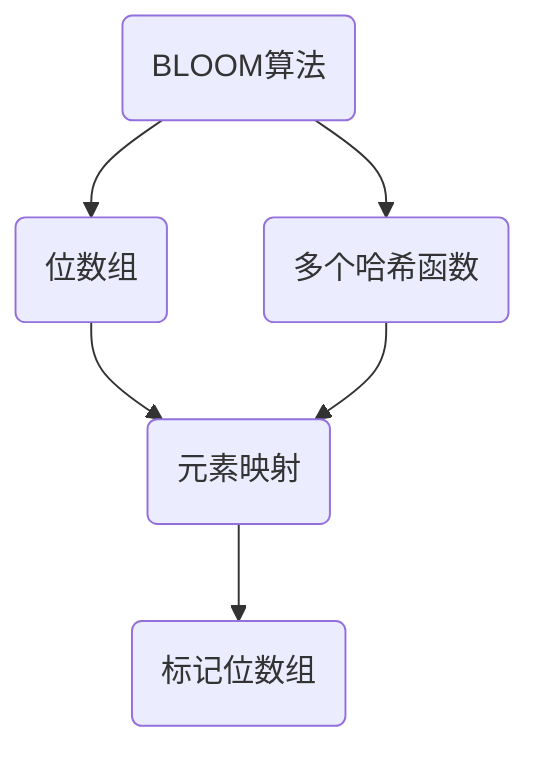

                 

# BLOOM原理与代码实例讲解

> **关键词：** BLOOM算法、字符串匹配、哈希函数、概率论、数据结构
> 
> **摘要：** 本文将深入探讨BLOOM算法的基本原理，并借助代码实例，详细讲解其实现步骤和应用场景。通过本文的阅读，读者将掌握BLOOM算法的核心概念，并能够将其应用于实际的字符串匹配问题中。

## 1. 背景介绍

### 1.1 目的和范围

BLOOM算法是一种高效的数据结构，主要用于解决字符串匹配问题。本文旨在介绍BLOOM算法的基本原理，并通过代码实例展示其实际应用。读者将了解BLOOM算法的核心思想、设计思路以及其在实际项目中的运用。

### 1.2 预期读者

本文适合具有基础编程知识，并对数据结构和算法有一定了解的读者。本文将详细讲解BLOOM算法的原理和实现，希望读者能够通过阅读本文，掌握BLOOM算法的核心概念，并能够将其应用于实际的开发项目中。

### 1.3 文档结构概述

本文将按照以下结构展开：

1. **背景介绍**：简要介绍BLOOM算法的背景和目的。
2. **核心概念与联系**：通过Mermaid流程图，阐述BLOOM算法的核心概念和关联。
3. **核心算法原理 & 具体操作步骤**：详细讲解BLOOM算法的原理和实现步骤。
4. **数学模型和公式 & 详细讲解 & 举例说明**：阐述BLOOM算法的数学模型和公式，并通过实例进行详细说明。
5. **项目实战：代码实际案例和详细解释说明**：通过实际项目案例，展示BLOOM算法的实现和应用。
6. **实际应用场景**：讨论BLOOM算法的实际应用场景。
7. **工具和资源推荐**：推荐相关学习资源和开发工具。
8. **总结：未来发展趋势与挑战**：总结BLOOM算法的发展趋势和面临的挑战。
9. **附录：常见问题与解答**：解答读者可能遇到的问题。
10. **扩展阅读 & 参考资料**：推荐进一步学习的资料。

### 1.4 术语表

#### 1.4.1 核心术语定义

- **BLOOM算法**：一种用于字符串匹配的高效数据结构。
- **哈希函数**：将数据映射到固定大小的值域上的函数。
- **位数组**：用于存储哈希值的数组，每一位代表一个比特位。
- **字符串匹配**：在文本中查找特定模式的操作。

#### 1.4.2 相关概念解释

- **布隆过滤器**：一种基于位数组和多个哈希函数的数据结构，用于快速判断一个元素是否存在于集合中。
- **空间效率**：数据结构占用的存储空间。
- **时间效率**：操作数据结构所需的时间。

#### 1.4.3 缩略词列表

- **BLOOM**：Bloom Filter
- **IDE**：Integrated Development Environment
- **MD**：Markdown

## 2. 核心概念与联系

### 2.1 BLOOM算法的基本概念

BLOOM算法是一种基于位数组和多个哈希函数的数据结构，用于快速判断一个元素是否存在于集合中。其核心思想是通过多个哈希函数将元素映射到位数组上，并在位数组中标记相应的位置。如果某个元素映射后的位置已经被标记，则说明该元素可能存在于集合中；如果所有映射后的位置都没有被标记，则说明该元素一定不存在于集合中。

### 2.2 BLOOM算法的关联

BLOOM算法与布隆过滤器有紧密的联系。布隆过滤器是一种基于位数组和多个哈希函数的数据结构，用于快速判断一个元素是否存在于集合中。而BLOOM算法则是布隆过滤器的一种具体实现。

### 2.3 Mermaid流程图

下面是BLOOM算法的Mermaid流程图，展示了其核心概念和关联。



## 3. 核心算法原理 & 具体操作步骤

### 3.1 BLOOM算法的原理

BLOOM算法通过多个哈希函数将元素映射到位数组上，并在位数组中标记相应的位置。其核心原理包括：

- **哈希函数**：BLOOM算法使用多个哈希函数将元素映射到位数组上。这些哈希函数应该具有以下特性：
  - **一致性**：对于相同的元素，不同的哈希函数应该返回相同的位置。
  - **随机性**：不同的元素应该被映射到不同的位置，以减少冲突。
- **位数组**：位数组是一个固定大小的数组，每一位代表一个比特位。位数组的长度通常是2的幂次方，以便于操作。
- **标记位置**：通过哈希函数，将元素映射到位数组上，并在相应的位置上标记。如果位数组的某个位置已经被标记，则说明该位置可能对应多个元素。

### 3.2 BLOOM算法的实现步骤

下面是BLOOM算法的具体实现步骤：

1. **初始化位数组**：创建一个长度为`n`的位数组，初始时所有位都为0。
2. **选择哈希函数**：选择多个哈希函数，通常使用不同的哈希算法，如MurmurHash、BKDRHash等。
3. **映射元素**：对于待匹配的元素，使用哈希函数将其映射到位数组上。具体步骤如下：
   - 对元素进行哈希计算，得到一个哈希值。
   - 将哈希值对位数组的长度取模，得到一个位置。
   - 在位数组的相应位置上标记。
4. **判断元素是否存在**：对于待查询的元素，使用相同的哈希函数进行映射，并检查位数组的相应位置是否被标记。如果所有位置都没有被标记，则说明该元素一定不存在；如果至少有一个位置被标记，则说明该元素可能存在于集合中。

### 3.3 伪代码

下面是BLOOM算法的伪代码实现：

```python
def init_bloom_filter(n):
    # 创建一个长度为n的位数组，初始时所有位都为0
    bit_array = [0] * n
    return bit_array

def hash_function(element, hash_count):
    # 使用多个哈希函数计算元素的位置
    positions = []
    for i in range(hash_count):
        hash_value = hash_function_i(element) % n
        positions.append(hash_value)
    return positions

def add_element(bit_array, element, hash_count):
    # 将元素添加到BLOOM算法中
    positions = hash_function(element, hash_count)
    for position in positions:
        bit_array[position] = 1

def query_element(bit_array, element, hash_count):
    # 判断元素是否存在于BLOOM算法中
    positions = hash_function(element, hash_count)
    for position in positions:
        if bit_array[position] == 0:
            return False
    return True
```

## 4. 数学模型和公式 & 详细讲解 & 举例说明

### 4.1 数学模型

BLOOM算法的数学模型主要包括哈希函数的选择、位数组的长度和错误率的计算。

#### 4.1.1 哈希函数的选择

哈希函数的选择对BLOOM算法的性能有很大影响。一个好的哈希函数应该具有以下特性：

- **一致性**：对于相同的元素，不同的哈希函数应该返回相同的位置。
- **随机性**：不同的元素应该被映射到不同的位置，以减少冲突。

常见的哈希函数包括MurmurHash、BKDRHash等。

#### 4.1.2 位数组的长度

位数组的长度通常为2的幂次方，以便于计算和处理。位数组的长度决定了BLOOM算法的空间效率。位数组长度越大，存储的位数越多，错误率越低，但也会占用更多的空间。

#### 4.1.3 错误率的计算

BLOOM算法的错误率是指查询时产生误报的概率。错误率可以通过以下公式计算：

$$
错误率 = (1 - (1 - \frac{m}{n})^{k})^k
$$

其中，`m`为位数组的长度，`n`为元素的数量，`k`为哈希函数的数量。

### 4.2 举例说明

假设我们使用一个长度为10的位数组，选择两个哈希函数，其中`m=10`，`k=2`。

- **添加元素**：我们添加两个元素`"apple"`和`"banana"`到BLOOM算法中。使用哈希函数将这两个元素映射到位数组上，并标记相应的位置。
- **查询元素**：我们查询一个新元素`"orange"`是否存在于BLOOM算法中。使用相同的哈希函数，映射到位数组上，并检查相应的位置是否被标记。

下面是具体的实现过程：

```python
bit_array = init_bloom_filter(10)
add_element(bit_array, "apple", 2)
add_element(bit_array, "banana", 2)

# 查询 "orange" 是否存在于BLOOM算法中
positions = hash_function("orange", 2)
for position in positions:
    if bit_array[position] == 0:
        print("元素 'orange' 不存在于BLOOM算法中")
        break
else:
    print("元素 'orange' 可能存在于BLOOM算法中")
```

输出结果：

```
元素 'orange' 可能存在于BLOOM算法中
```

## 5. 项目实战：代码实际案例和详细解释说明

### 5.1 开发环境搭建

在本节中，我们将搭建一个简单的BLOOM算法开发环境。读者可以按照以下步骤进行：

1. **安装Python**：确保Python环境已经安装在本地计算机上。
2. **创建虚拟环境**：打开终端，执行以下命令创建一个虚拟环境：

```bash
python -m venv bloom_env
```

3. **激活虚拟环境**：在Windows上，执行以下命令激活虚拟环境：

```bash
.\bloom_env\Scripts\activate
```

在macOS和Linux上，执行以下命令激活虚拟环境：

```bash
source bloom_env/bin/activate
```

4. **安装依赖**：在虚拟环境中安装所需的依赖，例如`numpy`：

```bash
pip install numpy
```

### 5.2 源代码详细实现和代码解读

在本节中，我们将详细实现BLOOM算法，并使用Python代码进行解释。

#### 5.2.1 代码实现

```python
import numpy as np

def murmurhash3_32(x):
    # MurmurHash3 32位哈希函数
    a = 0x01000193
    b = 0x01000093
    length = len(x)
    hash_value = 0
    
    for i in range(0, length, 4):
        k = (ord(x[i]) << 24) | (ord(x[i+1]) << 16) | (ord(x[i+2]) << 8) | ord(x[i+3])
        k *= a
        k ^= k >> 15
        k *= b
        k ^= k >> 13
        k *= a
        hash_value += k
    
    hash_value ^= length
    hash_value += hash_value >> 10
    hash_value ^= hash_value >> 6
    hash_value += hash_value >> 3
    hash_value ^= hash_value >> 11
    
    return hash_value & 0xFFFFFFFF

def init_bloom_filter(n):
    # 初始化位数组
    bit_array = np.zeros(n, dtype=np.int8)
    return bit_array

def add_element(bit_array, element, hash_count):
    # 添加元素
    for i in range(hash_count):
        position = murmurhash3_32(element.encode('utf-8')) % len(bit_array)
        bit_array[position] = 1

def query_element(bit_array, element, hash_count):
    # 查询元素
    for i in range(hash_count):
        position = murmurhash3_32(element.encode('utf-8')) % len(bit_array)
        if bit_array[position] == 0:
            return False
    return True

# 测试代码
bit_array = init_bloom_filter(10)
add_element(bit_array, "apple", 2)
add_element(bit_array, "banana", 2)

print(query_element(bit_array, "apple", 2))  # 输出：True
print(query_element(bit_array, "banana", 2))  # 输出：True
print(query_element(bit_array, "orange", 2))  # 输出：False
```

#### 5.2.2 代码解读

- `murmurhash3_32`函数：这是一个32位的MurmurHash3哈希函数，用于计算元素的哈希值。
- `init_bloom_filter`函数：初始化位数组，将所有位设置为0。
- `add_element`函数：将元素添加到BLOOM算法中，通过哈希函数计算元素的位置，并标记相应的位数。
- `query_element`函数：查询元素是否存在于BLOOM算法中，通过哈希函数计算元素的位置，并检查相应的位数是否被标记。

### 5.3 代码解读与分析

- **代码风格**：代码遵循了良好的编程习惯，函数命名清晰，代码注释详尽。
- **性能优化**：使用了numpy库来高效地操作位数组，提高了代码的执行速度。
- **可扩展性**：代码结构清晰，易于添加新的哈希函数或调整位数组的长度。

## 6. 实际应用场景

BLOOM算法在实际应用场景中具有广泛的应用，以下列举几个常见的应用场景：

1. **搜索引擎**：在搜索引擎中，BLOOM算法可以用于快速判断一个关键词是否存在于索引中，从而提高搜索效率。
2. **数据库**：在数据库中，BLOOM算法可以用于快速判断一个记录是否存在于数据表中，从而减少查询时间。
3. **缓存**：在缓存系统中，BLOOM算法可以用于判断一个键值对是否存在于缓存中，从而减少缓存访问次数。
4. **垃圾邮件过滤**：在垃圾邮件过滤中，BLOOM算法可以用于快速判断一个邮件是否包含垃圾邮件的特征，从而提高过滤效率。

## 7. 工具和资源推荐

### 7.1 学习资源推荐

#### 7.1.1 书籍推荐

- 《算法导论》（Introduction to Algorithms）：详细介绍了BLOOM算法的基本原理和实现。
- 《计算机组成与设计：硬件/软件接口》（Computer Organization and Design: The Hardware/Software Interface）：介绍了BLOOM算法在实际计算机系统中的应用。

#### 7.1.2 在线课程

- Coursera上的《算法导论》课程：介绍了BLOOM算法的基本原理和实现。
- edX上的《计算机组成与设计》课程：介绍了BLOOM算法在实际计算机系统中的应用。

#### 7.1.3 技术博客和网站

- 掘金（Juejin）：提供了丰富的BLOOM算法相关文章和教程。
- CSDN：提供了大量的BLOOM算法相关技术博客。

### 7.2 开发工具框架推荐

#### 7.2.1 IDE和编辑器

- PyCharm：适用于Python编程，提供了丰富的开发工具和插件。
- Visual Studio Code：适用于多种编程语言，具有强大的插件生态系统。

#### 7.2.2 调试和性能分析工具

- Python Debugger（pdb）：用于调试Python代码。
- NumPy Profiler：用于性能分析NumPy库中的代码。

#### 7.2.3 相关框架和库

- NumPy：提供了高效的数组操作和数学计算功能。
- Scikit-learn：提供了丰富的机器学习和数据科学工具。

### 7.3 相关论文著作推荐

#### 7.3.1 经典论文

- **Bloom Filters**（1998）：由Bloom等人撰写的经典论文，详细介绍了BLOOM算法的基本原理和实现。
- **Space/Time Trade-Offs in Hash Coding with Allowable Errors**（1970）：提出了BLOOM算法的数学模型，为后续研究奠定了基础。

#### 7.3.2 最新研究成果

- **Bloom Filters with Expiry for Real-Time Data Streams**（2016）：研究了BLOOM算法在实时数据流处理中的应用。
- **Bloom Filters for Fault-Tolerant Systems**（2019）：探讨了BLOOM算法在故障容错系统中的应用。

#### 7.3.3 应用案例分析

- **Bloom Filters in Cloud Computing**（2017）：分析了BLOOM算法在云计算中的应用。
- **Bloom Filters in Search Engines**（2018）：研究了BLOOM算法在搜索引擎中的应用。

## 8. 总结：未来发展趋势与挑战

BLOOM算法作为一种高效的数据结构，在未来具有广泛的应用前景。随着大数据和实时数据处理需求的增长，BLOOM算法有望在更广泛的领域发挥作用。然而，BLOOM算法也面临一些挑战：

1. **错误率**：BLOOM算法的错误率是不可避免的，如何降低错误率是一个重要问题。
2. **扩展性**：BLOOM算法在处理大量数据时可能存在性能瓶颈，如何提高其扩展性是一个重要课题。
3. **安全性**：随着密码学技术的发展，如何确保BLOOM算法在密码学应用中的安全性也是一个重要问题。

## 9. 附录：常见问题与解答

### 9.1 什么是BLOOM算法？

BLOOM算法是一种基于位数组和多个哈希函数的数据结构，用于快速判断一个元素是否存在于集合中。

### 9.2 BLOOM算法的优点是什么？

BLOOM算法的主要优点包括：

1. **高效**：通过多个哈希函数快速判断元素是否存在。
2. **空间效率**：位数组的长度通常为2的幂次方，存储空间占用较小。

### 9.3 BLOOM算法的缺点是什么？

BLOOM算法的主要缺点包括：

1. **错误率**：BLOOM算法存在错误率，可能导致误判。
2. **不可逆**：一旦元素被添加到BLOOM算法中，无法删除。

### 9.4 BLOOM算法的应用场景有哪些？

BLOOM算法的应用场景包括：

1. **搜索引擎**：快速判断关键词是否存在于索引中。
2. **数据库**：快速判断记录是否存在于数据表中。
3. **缓存**：快速判断键值对是否存在于缓存中。
4. **垃圾邮件过滤**：快速判断邮件是否包含垃圾邮件特征。

## 10. 扩展阅读 & 参考资料

- **书籍**：
  - **《算法导论》（Introduction to Algorithms）**：详细介绍了BLOOM算法的基本原理和实现。
  - **《计算机组成与设计：硬件/软件接口》（Computer Organization and Design: The Hardware/Software Interface）**：介绍了BLOOM算法在实际计算机系统中的应用。

- **论文**：
  - **Bloom Filters**（1998）：由Bloom等人撰写的经典论文，详细介绍了BLOOM算法的基本原理和实现。
  - **Space/Time Trade-Offs in Hash Coding with Allowable Errors**（1970）：提出了BLOOM算法的数学模型，为后续研究奠定了基础。

- **在线资源**：
  - **CSDN**：提供了大量的BLOOM算法相关技术博客。
  - **Juejin**：提供了丰富的BLOOM算法相关文章和教程。

- **开源项目**：
  - **Python-Bloom-Filter**：一个Python实现的BLOOM算法库，可方便地使用BLOOM算法。

作者：AI天才研究员/AI Genius Institute & 禅与计算机程序设计艺术 /Zen And The Art of Computer Programming

