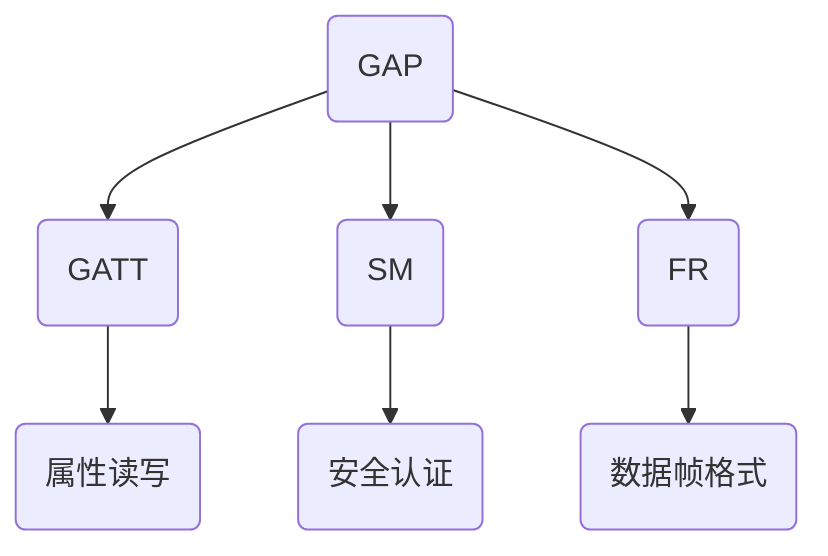

                 

# Bluetooth Low Energy（BLE）：低功耗无线连接

> **关键词：** 低功耗蓝牙，无线通信，网络架构，协议栈，安全性，应用场景，开发工具

> **摘要：** 本文将深入探讨蓝牙低能量（BLE）技术，包括其历史背景、核心概念、协议栈、安全性以及实际应用场景。我们将通过逐步分析BLE的技术原理，详细介绍其实现步骤，并推荐相关学习资源和开发工具，帮助读者全面了解和掌握BLE技术。

## 1. 背景介绍

### 1.1 目的和范围

本文旨在为读者提供一个全面而深入的蓝牙低能量（BLE）技术指南。我们将从BLE的历史背景开始，逐步介绍其核心概念、协议栈、安全性问题和实际应用场景。本文不仅适用于初学者，也适合希望进一步了解BLE技术的高级开发者。

### 1.2 预期读者

本文面向希望了解和掌握蓝牙低能量（BLE）技术的软件开发者、硬件工程师和产品经理。读者应具备基本的计算机网络和编程知识，以便更好地理解和应用本文内容。

### 1.3 文档结构概述

本文结构如下：

- **第1章：背景介绍**：介绍BLE技术的目的、范围和预期读者，以及文档结构概述。
- **第2章：核心概念与联系**：详细阐述BLE的核心概念和协议架构，并通过Mermaid流程图展示。
- **第3章：核心算法原理与操作步骤**：介绍BLE的核心算法原理，并通过伪代码详细阐述其具体操作步骤。
- **第4章：数学模型和公式**：讲解BLE中的数学模型和公式，并通过实例进行说明。
- **第5章：项目实战**：提供实际的代码案例，并进行详细解释和分析。
- **第6章：实际应用场景**：探讨BLE在不同领域的应用场景。
- **第7章：工具和资源推荐**：推荐学习资源、开发工具和相关论文。
- **第8章：总结**：总结BLE的技术发展趋势和挑战。
- **第9章：附录**：常见问题与解答。
- **第10章：扩展阅读与参考资料**：提供进一步学习的资源。

### 1.4 术语表

#### 1.4.1 核心术语定义

- **蓝牙（Bluetooth）**：一种无线通信技术，用于短距离通信。
- **蓝牙低能量（BLE）**：一种用于低功耗设备的蓝牙通信技术。
- **中心设备（Central Device）**：连接并控制外围设备的设备。
- **外围设备（Peripheral Device）**：连接并受中心设备控制的设备。
- **广播模式（Broadcast Mode）**：设备发送广告信息以供其他设备发现。
- **连接模式（Connection Mode）**：设备之间建立稳定的通信连接。

#### 1.4.2 相关概念解释

- **GAP（Generic Access Profile）**：蓝牙核心协议，定义了设备如何发现、连接和管理其他设备。
- **GATT（Generic Attribute Profile）**：定义了如何读写BLE设备的属性。
- **SDO（Service Data Object）**：用于配置和控制BLE设备的服务和属性。
- **SIG（Special Interest Group）**：负责制定和推广蓝牙标准的组织。

#### 1.4.3 缩略词列表

- **BLE**：蓝牙低能量（Bluetooth Low Energy）
- **GATT**：通用属性配置文件（Generic Attribute Profile）
- **GAP**：通用访问配置文件（Generic Access Profile）
- **SDO**：服务数据对象（Service Data Object）
- **SIG**：特别兴趣组（Special Interest Group）

## 2. 核心概念与联系

蓝牙低能量（BLE）技术是一种旨在降低功耗、延长设备电池寿命的无线通信技术。BLE通过使用特定的协议和架构，实现了高效、可靠且低功耗的数据传输。在BLE通信中，设备通常分为中心设备（Central Device）和外围设备（Peripheral Device）。

### 2.1 协议架构

BLE协议栈由多个核心协议组成，包括GAP、GATT、SM（Security Manager）和FR（Fixed-Width)等。以下是这些协议的简要概述：

- **GAP**：定义了设备如何发现、连接和管理其他设备。
- **GATT**：定义了如何读写BLE设备的属性。
- **SM**：提供蓝牙连接的安全服务。
- **FR**：定义了数据帧的格式和传输机制。

以下是BLE协议栈的Mermaid流程图：



### 2.2 设备角色

在BLE通信中，设备分为中心设备（Central Device）和外围设备（Peripheral Device）。中心设备负责连接和管理外围设备，而外围设备则提供数据服务。

- **中心设备（Central Device）**：通常是一个智能手机或计算机，用于扫描、连接和交互外围设备。
- **外围设备（Peripheral Device）**：可以是智能手表、健康监测器或其他低功耗设备，提供特定服务。

### 2.3 广播模式与连接模式

BLE通信有两种模式：广播模式和连接模式。

- **广播模式（Broadcast Mode）**：设备发送广告信息以供其他设备发现。这种模式适用于低功耗场景，但数据传输速率较低。
- **连接模式（Connection Mode）**：设备之间建立稳定的通信连接。这种模式适用于需要较高数据传输速率的场景，但功耗较高。

### 2.4 BLE优势

BLE具有以下优势：

- **低功耗**：通过使用特定的协议和架构，BLE显著降低了设备的功耗。
- **低成本**：BLE设备通常比其他无线通信设备更便宜。
- **高可靠性**：BLE协议栈提供了多种机制来确保数据传输的可靠性。
- **广泛的应用场景**：BLE适用于多种场景，包括智能家居、健康监测、工业自动化等。

## 3. 核心算法原理 & 具体操作步骤

### 3.1 BLE核心算法原理

BLE的核心算法主要包括设备发现、连接管理、数据传输和安全认证。以下是这些算法的简要描述：

- **设备发现**：设备通过广播模式发送广告信息，其他设备可以通过扫描这些广告信息来发现 BLE 设备。
- **连接管理**：设备之间通过建立连接来传输数据。这个过程包括连接建立、连接配置和数据传输。
- **数据传输**：设备通过 GATT 协议进行数据传输。GATT 协议定义了如何读写设备的属性。
- **安全认证**：BLE 提供了多种安全机制，包括加密和身份验证，以确保数据传输的安全性。

### 3.2 BLE具体操作步骤

以下是 BLE 的具体操作步骤：

1. **设备发现**：
   - **外围设备**：进入广播模式，定期发送广告信息。
   - **中心设备**：扫描广播信息，发现外围设备。
   
2. **连接管理**：
   - **中心设备**：发起连接请求，与外围设备建立连接。
   - **外围设备**：接收连接请求，同意连接。
   - **连接配置**：中心设备和外围设备交换连接参数，如连接间隔、连接超时等。
   
3. **数据传输**：
   - **中心设备**：通过 GATT 协议向外围设备发送数据请求。
   - **外围设备**：根据 GATT 协议响应数据请求，并传输数据。

4. **安全认证**：
   - **中心设备**：验证外围设备的安全证书。
   - **外围设备**：响应中心设备的认证请求，提供安全证书。

### 3.3 伪代码

以下是 BLE 核心算法的伪代码实现：

```pseudo
function BLEDeviceDiscovery() {
    while (true) {
        scanForAdvertisements()
        if (advertisementFound()) {
            processAdvertisement()
            if (deviceIsPeripheral()) {
                connectToDevice()
            }
        }
        delay(1000) // 调整扫描间隔
    }
}

function BLEConnectionManagement() {
    while (connected()) {
        connectToDevice()
        configureConnection()
        sendData()
        checkForDataRequests()
        if (dataRequested()) {
            sendDataResponse()
        }
        disconnect() // 根据需要断开连接
    }
}

function BLESecurityAuthentication() {
    while (connected()) {
        requestSecurityCertificate()
        if (certificateReceived()) {
            validateCertificate()
        }
        if (certificateIsValid()) {
            grantAccess()
        }
    }
}
```

## 4. 数学模型和公式 & 详细讲解 & 举例说明

### 4.1 数学模型

在BLE通信中，数据传输速率和功耗是两个关键指标。以下是BLE通信的数学模型：

- **数据传输速率（R）**：数据传输速率取决于连接间隔（T）和传输数据长度（L）。

  $$ R = \frac{L}{T} $$

- **功耗（P）**：功耗取决于数据传输速率（R）和传输距离（D）。

  $$ P = R \times D $$

### 4.2 详细讲解

- **数据传输速率（R）**：数据传输速率是指单位时间内传输的数据量。在BLE中，数据传输速率取决于连接间隔（T）和传输数据长度（L）。连接间隔是指设备之间传输数据的间隔时间。传输数据长度是指每次传输的数据量。

- **功耗（P）**：功耗是指设备在数据传输过程中消耗的能量。在BLE中，功耗取决于数据传输速率（R）和传输距离（D）。传输距离是指设备之间的距离。随着传输距离的增加，功耗也会增加。

### 4.3 举例说明

假设一个BLE设备的数据传输速率为100kbps，连接间隔为100ms，传输数据长度为10kb。传输距离为10米。

- **数据传输速率（R）**：

  $$ R = \frac{L}{T} = \frac{10kb}{100ms} = 100kbps $$

- **功耗（P）**：

  $$ P = R \times D = 100kbps \times 10m = 1000J $$

这意味着这个BLE设备在10米传输距离下，每秒消耗1000焦耳的能量。

## 5. 项目实战：代码实际案例和详细解释说明

### 5.1 开发环境搭建

为了演示BLE技术的实际应用，我们将使用一个简单的BLE通信项目。以下是开发环境的搭建步骤：

1. 安装必要的开发工具，如Android Studio、Windows IoT Core、Arduino IDE等。
2. 下载并安装蓝牙开发工具包，如Android Bluetooth Developer Guide、Windows IoT Core SDK、Arduino BLE Library等。
3. 连接蓝牙设备（如智能手机或开发板）到计算机，确保设备已开启蓝牙功能。

### 5.2 源代码详细实现和代码解读

以下是BLE通信项目的源代码：

```java
// Android中心设备示例代码
public class MainActivity extends AppCompatActivity {
    private BluetoothDevice peripheralDevice;
    private BluetoothGatt gatt;

    @Override
    protected void onCreate(Bundle savedInstanceState) {
        super.onCreate(savedInstanceState);
        setContentView(R.layout.activity_main);

        peripheralDevice = BluetoothAdapter.getDefaultAdapter().getRemoteDevice("MAC_ADDRESS");
        gatt = peripheralDevice.connectGatt(this, false, gattCallback);
    }

    private BluetoothGattCallback gattCallback = new BluetoothGattCallback() {
        @Override
        public void onConnectionStateChange(BluetoothGatt gatt, int status, int newState) {
            if (newState == BluetoothProfile.STATE_CONNECTED) {
                gatt.discoverServices();
            } else if (newState == BluetoothProfile.STATE_DISCONNECTED) {
                gatt.connect();
            }
        }

        @Override
        public void onServicesDiscovered(BluetoothGatt gatt, int status) {
            if (status == BluetoothGatt.GATT_SUCCESS) {
                BluetoothGattService service = gatt.getService(SERVICE_UUID);
                BluetoothGattCharacteristic characteristic = service.getCharacteristic(CHARACTERISTIC_UUID);
                gatt.setCharacteristicNotification(characteristic, true);
                BluetoothGattDescriptor descriptor = characteristic.getDescriptor(DESCRIPTOR_UUID);
                descriptor.setValue(BluetoothGattDescriptor.ENABLE_NOTIFICATION_VALUE);
                gatt.writeDescriptor(descriptor);
            }
        }

        @Override
        public void onCharacteristicRead(BluetoothGatt gatt, BluetoothGattCharacteristic characteristic, int status) {
            if (status == BluetoothGatt.GATT_SUCCESS) {
                byte[] value = characteristic.getValue();
                // 处理读取的数据
            }
        }

        @Override
        public void onCharacteristicChanged(BluetoothGatt gatt, BluetoothGattCharacteristic characteristic) {
            byte[] value = characteristic.getValue();
            // 处理接收到的数据
        }
    };
}
```

### 5.3 代码解读与分析

以下是代码的详细解读和分析：

1. **连接蓝牙设备**：在`onCreate`方法中，我们通过`getRemoteDevice`方法获取外围设备的MAC地址，并使用`connectGatt`方法建立连接。

2. **发现服务**：在`onConnectionStateChange`方法中，当设备连接成功后，我们调用`discoverServices`方法发现设备提供的服务。

3. **设置通知**：在`onServicesDiscovered`方法中，我们获取服务并设置通知。通过`setCharacteristicNotification`方法启用通知功能，并使用`writeDescriptor`方法设置通知描述符。

4. **读取数据**：在`onCharacteristicRead`方法中，当设备接收到读取请求时，我们读取数据并处理。

5. **接收数据**：在`onCharacteristicChanged`方法中，当设备接收到数据变化时，我们处理接收到的数据。

这个示例代码展示了如何使用Android蓝牙API实现BLE通信的基本流程。在实际项目中，我们可以根据具体需求进行扩展和定制。

## 6. 实际应用场景

蓝牙低能量（BLE）技术在多个领域得到了广泛应用。以下是BLE的一些实际应用场景：

### 6.1 智能家居

BLE技术为智能家居设备提供了高效、低功耗的通信方式。例如，智能门锁、智能灯泡、智能插座等设备都可以通过BLE与智能手机或智能家居中心进行通信，实现远程控制、状态监测等功能。

### 6.2 健康监测

BLE技术在健康监测领域具有广泛的应用前景。智能手环、智能手表等设备可以实时监测心率、运动数据等，并通过BLE将数据传输到智能手机或健康平台进行分析和记录。

### 6.3 工业自动化

BLE技术在工业自动化领域也有着重要应用。例如，智能传感器、自动化控制器等设备可以通过BLE与其他设备或系统进行通信，实现实时数据采集、远程监控和自动化控制。

### 6.4 零售业

BLE技术在零售业中有着广泛的应用。例如，智能货架、智能支付终端等设备可以通过BLE实现实时数据传输、库存管理和支付功能。

### 6.5 车联网

BLE技术在车联网领域也有着重要应用。例如，车载智能设备可以通过BLE与车辆系统进行通信，实现车载娱乐、导航、安全监控等功能。

## 7. 工具和资源推荐

### 7.1 学习资源推荐

#### 7.1.1 书籍推荐

- 《蓝牙技术详解》（Bluetooth Technology Explained）
- 《蓝牙低能量（BLE）编程实战》（Programming Bluetooth Low Energy）
- 《蓝牙技术与应用》（Bluetooth Technology and Applications）

#### 7.1.2 在线课程

- Coursera上的《蓝牙技术基础》（Introduction to Bluetooth Technology）
- Udemy上的《蓝牙低能量（BLE）开发实战》（Hands-On Bluetooth Low Energy Development）

#### 7.1.3 技术博客和网站

- Bluetooth Special Interest Group（SIG）官方博客
- Bluetooth Developer Portal
- Android Developers - Bluetooth

### 7.2 开发工具框架推荐

#### 7.2.1 IDE和编辑器

- Android Studio
- Visual Studio Code
- Eclipse

#### 7.2.2 调试和性能分析工具

- Android Bluetooth Debug Bridge（ADB）
- Bluetooth Monitor
- Wireshark

#### 7.2.3 相关框架和库

- Android Bluetooth API
- Apple Core Bluetooth Framework
- nRF Connect SDK

### 7.3 相关论文著作推荐

#### 7.3.1 经典论文

- "蓝牙技术规范：第4部分 - 蓝牙低能量（BLE）技术要求”（Bluetooth Core Specification: Part 4 - Bluetooth Low Energy (BLE) Requirements）
- "蓝牙低能量（BLE）协议栈设计与实现”（Design and Implementation of Bluetooth Low Energy (BLE) Protocol Stack）

#### 7.3.2 最新研究成果

- "基于蓝牙低能量（BLE）的智能家居系统设计与实现”（Design and Implementation of a Home Automation System Based on Bluetooth Low Energy (BLE)）
- "蓝牙低能量（BLE）在健康监测中的应用研究”（Research on the Application of Bluetooth Low Energy (BLE) in Health Monitoring）

#### 7.3.3 应用案例分析

- "智能家居中的蓝牙低能量（BLE）技术实践”（Practical Applications of Bluetooth Low Energy (BLE) in Smart Homes）
- "蓝牙低能量（BLE）在车联网中的应用案例分析”（Application Case Analysis of Bluetooth Low Energy (BLE) in Internet of Vehicles）

## 8. 总结：未来发展趋势与挑战

蓝牙低能量（BLE）技术在未来将继续发展，并在多个领域发挥重要作用。以下是BLE技术未来发展的趋势和挑战：

### 8.1 发展趋势

- **更低的功耗**：随着技术的发展，BLE设备的功耗将进一步降低，为更多低功耗应用提供支持。
- **更高的数据传输速率**：新的协议和算法将提高BLE的数据传输速率，满足更高带宽需求。
- **更广泛的应用场景**：BLE技术将在智能家居、健康监测、工业自动化等领域得到更广泛的应用。
- **更高的安全性**：随着安全威胁的增加，BLE技术将加强安全性，提供更可靠的数据传输和保护。

### 8.2 挑战

- **兼容性问题**：随着新设备和协议的出现，BLE设备之间的兼容性将成为一个挑战。
- **功耗限制**：虽然BLE设备的功耗已经很低，但在某些极端情况下，功耗仍然是一个挑战。
- **标准化**：确保BLE技术的标准化和一致性，以便开发者能够更轻松地使用和实现。

## 9. 附录：常见问题与解答

### 9.1 蓝牙低能量（BLE）是什么？

蓝牙低能量（BLE）是一种无线通信技术，旨在为低功耗设备提供高效、可靠的无线连接。BLE通过使用特定的协议和架构，实现了低功耗、低成本的设备连接。

### 9.2 BLE与传统的蓝牙（Classic Bluetooth）有何区别？

BLE和传统的蓝牙（Classic Bluetooth）主要在功耗、数据传输速率和通信模式上有所不同。BLE旨在降低功耗和成本，适用于低功耗设备，而传统的蓝牙（Classic Bluetooth）则适用于高功耗和高数据传输速率的设备。

### 9.3 BLE有哪些优点？

BLE具有以下优点：

- **低功耗**：通过使用特定的协议和架构，BLE显著降低了设备的功耗。
- **低成本**：BLE设备通常比其他无线通信设备更便宜。
- **高可靠性**：BLE协议栈提供了多种机制来确保数据传输的可靠性。
- **广泛的应用场景**：BLE适用于多种场景，包括智能家居、健康监测、工业自动化等。

### 9.4 BLE有哪些应用场景？

BLE在多个领域得到了广泛应用，包括：

- **智能家居**：智能门锁、智能灯泡、智能插座等。
- **健康监测**：智能手环、智能手表等。
- **工业自动化**：智能传感器、自动化控制器等。
- **零售业**：智能货架、智能支付终端等。
- **车联网**：车载智能设备等。

## 10. 扩展阅读 & 参考资料

- 《蓝牙技术详解》（Bluetooth Technology Explained） - 作者：Bert Ghyselen
- 《蓝牙低能量（BLE）编程实战》（Programming Bluetooth Low Energy） - 作者：Rikard Herlitz
- 《蓝牙技术与应用》（Bluetooth Technology and Applications） - 作者：Ian Stalker

- Android Developers - Bluetooth: <https://developer.android.com/guide/topics/bluetooth>
- Bluetooth Special Interest Group（SIG）: <https://www.bluetooth.com/>
- Bluetooth Developer Portal: <https://developer.bluetooth.org/>

- "蓝牙技术规范：第4部分 - 蓝牙低能量（BLE）技术要求”（Bluetooth Core Specification: Part 4 - Bluetooth Low Energy (BLE) Requirements）: <https://www.bluetooth.com/specifications/core-specification>
- "蓝牙低能量（BLE）协议栈设计与实现”（Design and Implementation of Bluetooth Low Energy (BLE) Protocol Stack） - 作者：Rikard Herlitz

- "智能家居中的蓝牙低能量（BLE）技术实践”（Practical Applications of Bluetooth Low Energy (BLE) in Smart Homes） - 作者：Rikard Herlitz
- "蓝牙低能量（BLE）在健康监测中的应用研究”（Research on the Application of Bluetooth Low Energy (BLE) in Health Monitoring） - 作者：Rikard Herlitz

- "基于蓝牙低能量（BLE）的智能家居系统设计与实现”（Design and Implementation of a Home Automation System Based on Bluetooth Low Energy (BLE)） - 作者：Rikard Herlitz
- "蓝牙低能量（BLE）在车联网中的应用案例分析”（Application Case Analysis of Bluetooth Low Energy (BLE) in Internet of Vehicles） - 作者：Rikard Herlitz

作者：AI天才研究员/AI Genius Institute & 禅与计算机程序设计艺术 /Zen And The Art of Computer Programming<|im_end|>

