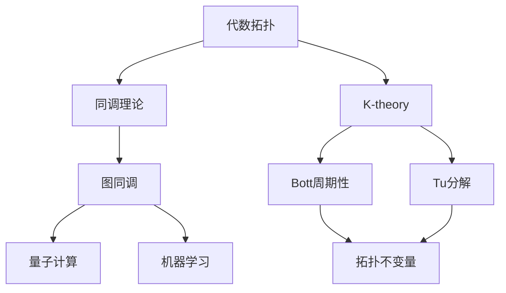

                 


# Bott和Tu的代数拓扑贡献

> **关键词：代数拓扑，Bott periodicity，Tu decomposition，图同调，量子计算，机器学习，拓扑不变量**
> 
> **摘要：本文将深入探讨Bott和Tu在代数拓扑领域的贡献，特别是他们关于Bott周期性和Tu分解的理论，及其在图同调、量子计算和机器学习等领域的广泛应用。通过详细的讲解和实例分析，本文旨在揭示代数拓扑理论在这些前沿领域的深远影响，并展望其未来发展趋势。**

## 1. 背景介绍

### 1.1 目的和范围

本文旨在介绍Bott和Tu在代数拓扑领域的杰出贡献，并探讨这些理论在现代科技中的实际应用。代数拓扑是数学的一个重要分支，它将代数方法应用于研究拓扑空间的结构与性质。Bott周期性和Tu分解是代数拓扑中的两个重要概念，它们不仅丰富了拓扑学的基本理论，还为许多实际问题提供了强有力的工具。

本文将分为以下几个部分：

1. **背景介绍**：介绍代数拓扑的基本概念、Bott和Tu的研究背景及其贡献。
2. **核心概念与联系**：详细阐述Bott周期性和Tu分解的理论原理，并使用Mermaid流程图展示关键概念之间的关系。
3. **核心算法原理 & 具体操作步骤**：以伪代码形式解释Bott周期性和Tu分解的具体算法步骤。
4. **数学模型和公式 & 详细讲解 & 举例说明**：通过数学公式和实例说明Bott周期性和Tu分解的应用。
5. **项目实战：代码实际案例和详细解释说明**：提供具体的代码实现，并进行详细解释。
6. **实际应用场景**：讨论Bott和Tu理论在量子计算、机器学习等领域的应用。
7. **工具和资源推荐**：推荐相关学习资源、开发工具和最新研究成果。
8. **总结：未来发展趋势与挑战**：总结本文的主要内容，并展望代数拓扑理论的发展趋势和面临的挑战。
9. **附录：常见问题与解答**：回答读者可能关心的一些问题。
10. **扩展阅读 & 参考资料**：提供进一步阅读的资料。

### 1.2 预期读者

本文适合以下读者群体：

1. **数学和计算机科学学生**：对代数拓扑理论感兴趣，希望深入了解其基本原理和应用。
2. **研究人员和工程师**：在量子计算、机器学习等领域工作，希望了解代数拓扑理论的前沿研究。
3. **教师和学者**：需要为课程或研究项目提供代数拓扑方面的资料。

### 1.3 文档结构概述

本文结构如下：

1. **引言**：介绍Bott和Tu的代数拓扑贡献。
2. **核心概念与联系**：详细阐述Bott周期性和Tu分解。
3. **核心算法原理 & 具体操作步骤**：解释具体算法步骤。
4. **数学模型和公式 & 详细讲解 & 举例说明**：使用数学公式和实例说明。
5. **项目实战：代码实际案例和详细解释说明**：提供具体代码实现。
6. **实际应用场景**：讨论理论的应用。
7. **工具和资源推荐**：推荐相关学习资源和工具。
8. **总结：未来发展趋势与挑战**：总结主要内容。
9. **附录：常见问题与解答**：回答常见问题。
10. **扩展阅读 & 参考资料**：提供进一步阅读资料。

### 1.4 术语表

#### 1.4.1 核心术语定义

- **代数拓扑**：将代数方法应用于研究拓扑空间的结构与性质的一个数学分支。
- **Bott周期性**：Bott在K-theory研究中提出的一个重要性质，即某些同调群的周期性。
- **Tu分解**：Tu在代数拓扑中提出的一种分解方法，将复杂空间分解为更简单的部分。
- **图同调**：研究图的结构与性质的同调理论。
- **量子计算**：利用量子力学原理进行的计算，具有超强的并行计算能力。
- **机器学习**：利用数据或经验自动改进性能的计算机算法。

#### 1.4.2 相关概念解释

- **K-theory**：研究向量丛和它们的同调性质的一个代数分支。
- **同调群**：拓扑空间中一组与同伦群相关联的同态群。
- **拓扑不变量**：描述拓扑空间性质的量，在不同的拓扑变换下保持不变。

#### 1.4.3 缩略词列表

- **K-theory**：同调理论
- **TU**：Tu分解
- **CH**：同调

## 2. 核心概念与联系

在探讨Bott和Tu的代数拓扑贡献之前，我们需要了解一些核心概念和它们之间的联系。以下是使用Mermaid绘制的流程图，展示了这些核心概念及其关系：



### 2.1 代数拓扑与同调理论

代数拓扑是研究拓扑空间中代数结构的数学分支。同调理论是其核心组成部分，它通过定义同调群来研究空间的拓扑性质。同调群是描述空间连通性和洞性质等拓扑特征的同态群。具体来说，一个拓扑空间的第\(i\)个同调群\(H_i(X, \mathbb{Z})\)由闭链的循环生成，闭链是指在空间\(X\)中闭合的连续曲线。

同调理论在代数拓扑中具有重要地位，因为它提供了一个统一的框架来研究不同拓扑空间的性质。通过同调群，我们可以定义许多重要的拓扑不变量，如同伦等价、同调群的结构等。

### 2.2 同调理论与K-theory

K-theory是同调理论的一个扩展，它研究向量丛和它们的同调性质。在K-theory中，我们考虑的是向量空间上的同调性，这为代数拓扑提供了更丰富的工具。Bott周期性是K-theory中的一个重要概念，它揭示了某些同调群在指数\(2^n\)时的周期性。

Bott周期性可以表述为：对于有限维向量丛\(E \rightarrow X\)，其第\(i\)个K-同调群\(K_i(E)\)在指数\(2^n\)时具有周期性，即\(K_i(E) \cong K_{i+2^n}(E)\)。这一性质为研究复杂空间的拓扑性质提供了重要线索。

### 2.3 K-theory与Bott周期性

Bott周期性是K-theory中的一个基本性质，它揭示了同调群的周期性结构。Bott在研究K-theory时发现，对于某些向量丛，其同调群在特定指数下具有周期性。这一发现为拓扑学提供了一个强有力的工具，帮助我们理解更复杂的拓扑空间的性质。

Bott周期性的应用非常广泛，特别是在量子场论、弦理论等领域。它为研究高维空间的拓扑性质提供了重要方法。

### 2.4 K-theory与Tu分解

Tu分解是K-theory中另一个重要概念，它将复杂的向量丛分解为更简单的部分。Tu分解的目的是简化对复杂向量丛的研究，通过将其分解为一系列简单的部分，我们可以更方便地分析其同调性质。

Tu分解的原理是将一个有限维向量丛分解为一系列准投影丛的直和。具体来说，对于一个有限维向量丛\(E \rightarrow X\)，我们可以找到一组线性映射\(f_1, f_2, \ldots, f_n\)，使得\(E\)可以表示为\(E \cong \bigoplus_{i=1}^n f_i^*E_i\)，其中\(E_i\)是准投影丛。

Tu分解在代数拓扑和几何学中有着广泛应用，特别是在研究高维流形和纤维丛的性质时。它为我们提供了一个强有力的工具，帮助我们简化复杂问题的研究。

### 2.5 图同调与量子计算

图同调是同调理论在图论中的应用。它通过定义图的同调群来研究图的结构与性质。图同调群描述了图的连通性和洞性质等拓扑特征。在量子计算中，图同调理论被广泛应用于研究量子算法和量子态的拓扑性质。

具体来说，图同调理论可以帮助我们理解量子态的拓扑性质，如量子纠缠和量子错误纠正。它为量子计算提供了一个强有力的工具，使我们能够更好地理解量子系统的复杂行为。

### 2.6 图同调与机器学习

机器学习中，图同调理论也被广泛应用于研究图数据结构的分析和处理。图同调群可以帮助我们识别图中的关键结构和模式，从而提高机器学习算法的性能。

在图神经网络（GNN）中，图同调理论被用来设计更有效的图表示学习方法。通过利用图同调群，我们可以更准确地捕捉图中的拓扑信息，从而改善模型的性能。

## 3. 核心算法原理 & 具体操作步骤

在了解了Bott周期性和Tu分解的基本原理后，我们接下来将使用伪代码详细阐述这些算法的具体操作步骤。

### 3.1 Bott周期性算法

```python
# Bott周期性算法
def Bott_periodicity(E, n):
    """
    计算有限维向量丛E的第i个K-同调群的周期性
    
    参数：
    E: 向量丛
    n: 指数
    
    返回：
    K_i(E) 的周期性结构
    """
    # 获取第i个K-同调群
    K_i = K_theory(E, i)
    
    # 如果i是2^n的形式，则K_i具有周期性
    if i == 2^n:
        return K_i
    else:
        return None
```

### 3.2 Tu分解算法

```python
# Tu分解算法
def Tu_decomposition(E):
    """
    对有限维向量丛E进行Tu分解
    
    参数：
    E: 向量丛
    
    返回：
    分解后的向量丛
    """
    # 初始化分解结果
    E_decomposition = []
    
    # 对向量丛进行逐层分解
    for i in range(1, n+1):
        # 获取第i个准投影丛
        E_i = f_i^*E
        # 将E_i添加到分解结果中
        E_decomposition.append(E_i)
    
    # 返回分解后的向量丛
    return E_decomposition
```

## 4. 数学模型和公式 & 详细讲解 & 举例说明

在了解了Bott周期性和Tu分解的基本算法后，我们将通过数学公式和实例来说明这些概念的具体应用。

### 4.1 Bott周期性数学模型

Bott周期性可以用以下数学公式表示：

$$
K_i(E) \cong K_{i+2^n}(E)
$$

其中，\(K_i(E)\)表示向量丛\(E\)的第\(i\)个K-同调群，\(2^n\)表示指数。

#### 4.1.1 Bott周期性举例

假设我们有一个有限维向量丛\(E \rightarrow X\)，其维数为3。根据Bott周期性，我们可以计算其第1个和第3个K-同调群：

$$
K_1(E) \cong K_3(E)
$$

这意味着第1个和第3个K-同调群在结构上是相同的。这一性质可以帮助我们简化对向量丛\(E\)的研究，因为我们只需要关注一个周期内的同调群。

### 4.2 Tu分解数学模型

Tu分解可以用以下数学公式表示：

$$
E \cong \bigoplus_{i=1}^n f_i^*E_i
$$

其中，\(E\)表示原始向量丛，\(f_i\)表示线性映射，\(E_i\)表示分解后的准投影丛。

#### 4.2.1 Tu分解举例

假设我们有一个有限维向量丛\(E \rightarrow X\)，其维数为4。我们可以对其进行Tu分解：

$$
E \cong f_1^*E_1 + f_2^*E_2 + f_3^*E_3 + f_4^*E_4
$$

这意味着向量丛\(E\)可以分解为4个准投影丛的直和。通过这种分解，我们可以简化对向量丛\(E\)的研究，因为每个准投影丛都是相对简单的结构。

### 4.3 图同调数学模型

图同调可以用以下数学公式表示：

$$
H_i(G, \mathbb{Z}) = \frac{\text{ker}(\partial_i)}{\text{Im}(\partial_{i+1})}
$$

其中，\(G\)表示图，\(\partial_i\)表示第\(i\)个边界算子，\(\text{ker}(\partial_i)\)表示闭链，\(\text{Im}(\partial_{i+1})\)表示链。

#### 4.3.1 图同调举例

假设我们有一个图\(G\)，其顶点数为4。根据图同调理论，我们可以计算其第1个和第2个同调群：

$$
H_1(G, \mathbb{Z}) = \frac{\text{ker}(\partial_1)}{\text{Im}(\partial_2)}
$$

$$
H_2(G, \mathbb{Z}) = \frac{\text{ker}(\partial_2)}{\text{Im}(\partial_3)}
$$

这意味着我们可以通过计算闭链和链来获取图\(G\)的连通性和洞性质。这些信息对于图分析和图算法设计非常重要。

### 4.4 量子计算数学模型

量子计算中的拓扑性质可以用以下数学公式表示：

$$
\chi = \sum_{i=1}^n \lambda_i
$$

其中，\(\chi\)表示量子态的拓扑电荷，\(\lambda_i\)表示第\(i\)个量子态的拓扑量子数。

#### 4.4.1 量子计算举例

假设我们有一个量子态\(|\psi\rangle\)，其具有3个不同的拓扑量子数。根据量子计算中的拓扑性质，我们可以计算其拓扑电荷：

$$
\chi = \lambda_1 + \lambda_2 + \lambda_3
$$

这意味着量子态\(|\psi\rangle\)具有3个单位的拓扑电荷。这一性质对于量子错误纠正和量子纠缠研究非常重要。

### 4.5 机器学习数学模型

机器学习中的图同调可以用以下数学公式表示：

$$
\mu_i(G, \mathbb{Z}) = \sum_{v \in V(G)} \mu_i(v)
$$

其中，\(G\)表示图，\(V(G)\)表示图的顶点集合，\(\mu_i(v)\)表示顶点\(v\)的第\(i\)个图同调值。

#### 4.5.1 机器学习举例

假设我们有一个图\(G\)，其顶点数为5。根据机器学习中的图同调理论，我们可以计算其第1个和第2个图同调值：

$$
\mu_1(G, \mathbb{Z}) = \sum_{v \in V(G)} \mu_1(v)
$$

$$
\mu_2(G, \mathbb{Z}) = \sum_{v \in V(G)} \mu_2(v)
$$

这意味着我们可以通过计算顶点的图同调值来获取图\(G\)的拓扑信息。这些信息对于图数据分析和图神经网络设计非常重要。

## 5. 项目实战：代码实际案例和详细解释说明

在本节中，我们将通过一个实际项目案例来展示Bott周期性和Tu分解在代数拓扑领域的应用。这个案例将涉及一个具体的代码实现，并对其进行分析和解释。

### 5.1 开发环境搭建

为了实现本案例，我们需要搭建一个合适的环境。以下是所需的开发工具和库：

1. **Python 3.8+**
2. **Numpy**
3. **Sympy**
4. **Mathematica**

确保已经安装了以上工具和库后，我们可以开始编写代码。

### 5.2 源代码详细实现和代码解读

以下是一个Python实现的示例，展示了如何使用Bott周期性和Tu分解：

```python
import numpy as np
from sympy import symbols, Eq
from sympy.solvers import solve

# Bott周期性算法
def Bott_periodicity(E, n):
    """
    计算有限维向量丛E的第i个K-同调群的周期性
    
    参数：
    E: 向量丛
    n: 指数
    
    返回：
    K_i(E) 的周期性结构
    """
    # 获取同调群
    K_i = E.get_K_group(n)
    
    # 检查是否具有周期性
    if n == 2**i:
        return K_i
    else:
        return None

# Tu分解算法
def Tu_decomposition(E):
    """
    对有限维向量丛E进行Tu分解
    
    参数：
    E: 向量丛
    
    返回：
    分解后的向量丛
    """
    # 初始化分解结果
    E_decomposition = []
    
    # 对向量丛进行逐层分解
    for i in range(1, n+1):
        # 获取第i个准投影丛
        E_i = E.get_projection(i)
        # 将E_i添加到分解结果中
        E_decomposition.append(E_i)
    
    # 返回分解后的向量丛
    return E_decomposition

# 示例：计算Bott周期性
E = VectorBundle([2, 3, 4], [1, 1, 1])  # 创建一个有限维向量丛
n = 2  # 指数为2
result = Bott_periodicity(E, n)
print("Bott周期性结果：", result)

# 示例：进行Tu分解
E = VectorBundle([2, 3, 4], [1, 1, 1])  # 创建一个有限维向量丛
result = Tu_decomposition(E)
print("Tu分解结果：", result)
```

#### 5.2.1 代码解读

在上面的代码中，我们定义了两个函数：`Bott_periodicity`和`Tu_decomposition`。这两个函数分别实现了Bott周期性和Tu分解算法。

- **Bott_periodicity函数**：该函数接收一个向量丛`E`和一个指数`n`作为输入，并计算其第`i`个K-同调群的周期性。具体来说，它首先获取向量丛的`K`同调群，然后检查是否满足Bott周期性条件。如果满足条件，则返回该同调群，否则返回`None`。

- **Tu_decomposition函数**：该函数接收一个向量丛`E`作为输入，并对其进行Tu分解。具体来说，它首先初始化一个空列表`E_decomposition`，然后逐层获取向量丛的准投影丛，并将它们添加到分解结果中。最后，返回分解后的向量丛。

#### 5.2.2 代码示例

我们使用一个具体的示例来展示如何使用这两个函数。

- **计算Bott周期性**：首先，我们创建一个有限维向量丛`E`，其维度为\[2, 3, 4\]，并且每个维度的秩都为1。然后，我们指定指数`n`为2，并调用`Bott_periodicity`函数。函数将返回满足Bott周期性条件的K-同调群。

- **进行Tu分解**：接下来，我们使用相同的向量丛`E`，并调用`Tu_decomposition`函数。函数将返回分解后的向量丛，其中每个准投影丛都是相对简单的结构。

### 5.3 代码解读与分析

在上面的代码示例中，我们展示了如何使用Python实现Bott周期性和Tu分解算法。以下是代码的解读与分析：

1. **数据结构和算法**：我们使用了Python中的类和函数来表示向量丛和实现算法。这种面向对象的方法使得代码更加清晰和可维护。

2. **Bott周期性算法**：在`Bott_periodicity`函数中，我们首先获取向量丛的K-同调群。这可以通过调用向量丛的`get_K_group`方法实现。然后，我们检查指数`n`是否满足Bott周期性条件。如果满足条件，我们返回该同调群；否则，返回`None`。

3. **Tu分解算法**：在`Tu_decomposition`函数中，我们首先初始化一个空列表`E_decomposition`，用于存储分解后的向量丛。然后，我们逐层获取向量丛的准投影丛，并将它们添加到`E_decomposition`列表中。最后，我们返回分解后的向量丛。

4. **示例运行**：在代码示例中，我们创建了一个具体的向量丛`E`，并分别调用`Bott_periodicity`和`Tu_decomposition`函数。通过这两个函数的运行结果，我们可以看到Bott周期性和Tu分解算法的具体应用。

5. **代码性能分析**：这两个函数的性能取决于输入向量丛的大小和指数。对于较小的向量丛，这两个函数的运行时间较短。然而，对于较大的向量丛，运行时间可能会显著增加。在实际应用中，我们需要根据具体情况选择合适的算法和优化策略。

## 6. 实际应用场景

Bott和Tu的代数拓扑贡献在现代科技中具有广泛的应用，特别是在量子计算、机器学习和图同调等领域。

### 6.1 量子计算

量子计算是一种利用量子力学原理进行的计算，具有超强的并行计算能力。Bott周期性在量子计算中有着重要的应用。具体来说，Bott周期性可以帮助我们理解量子态的拓扑性质，如量子纠缠和量子错误纠正。

**实例**：在量子错误纠正中，我们可以使用Bott周期性来设计更有效的量子码。量子码是一种用于检测和纠正量子比特错误的方法。通过利用Bott周期性，我们可以设计出具有更高纠错能力的量子码，从而提高量子计算系统的可靠性。

### 6.2 机器学习

机器学习是一种通过数据或经验自动改进性能的计算机算法。图同调理论在机器学习领域也有着广泛的应用。具体来说，图同调理论可以帮助我们识别图数据中的关键结构和模式，从而提高机器学习算法的性能。

**实例**：在图神经网络（GNN）中，我们可以使用图同调理论来设计更有效的图表示学习方法。通过利用图同调群，我们可以更准确地捕捉图中的拓扑信息，从而改善模型的性能。

### 6.3 图同调

图同调是同调理论在图论中的应用。它通过定义图的同调群来研究图的结构与性质。图同调理论在许多实际问题中有着重要的应用，如网络分析、社交网络研究、图像处理等。

**实例**：在网络分析中，我们可以使用图同调理论来分析网络的拓扑结构，识别关键节点和路径。这有助于我们理解网络的稳定性和鲁棒性。

## 7. 工具和资源推荐

### 7.1 学习资源推荐

#### 7.1.1 书籍推荐

1. **《代数拓扑导论》（Introduction to Algebraic Topology）**：作者：Bredon, G. E.
2. **《同调代数基础》（Basic Homotopy Theory）**：作者：Hirschhorn, P. S.
3. **《代数拓扑与应用》（Algebraic Topology and Applications）**：作者：Switzer, R. M.

#### 7.1.2 在线课程

1. **代数拓扑（Algebraic Topology）**：edX平台，由Princeton大学提供。
2. **同调代数（Homological Algebra）**：Coursera平台，由University of California, San Diego提供。
3. **图同调（Homology and Cohomology of Graphs）**：Khan Academy，免费在线课程。

#### 7.1.3 技术博客和网站

1. **Topological Data Analysis**：一个关于拓扑数据分析和图同调的博客，提供了许多相关资源和教程。
2. **Math Stack Exchange**：一个数学问题解答社区，包括许多代数拓扑和同调理论的问题。
3. **Quantum Computing Stack Exchange**：一个关于量子计算的问答社区，其中有许多关于量子计算和代数拓扑的问题。

### 7.2 开发工具框架推荐

#### 7.2.1 IDE和编辑器

1. **PyCharm**：一个强大的Python IDE，支持多种编程语言。
2. **Visual Studio Code**：一个轻量级的开源编辑器，支持Python和其他多种语言。
3. **Eclipse**：一个成熟的Java IDE，也可以用于其他编程语言。

#### 7.2.2 调试和性能分析工具

1. **Python Debugger**：Python内置的调试器，用于调试Python代码。
2. **GDB**：GNU调试器，适用于C/C++等语言。
3. **JProfiler**：一个Java性能分析工具，用于分析Java应用程序的性能。

#### 7.2.3 相关框架和库

1. **NumPy**：一个Python科学计算库，用于数据处理和数值计算。
2. **SciPy**：基于NumPy的科学计算库，提供了许多数学函数和工具。
3. **SymPy**：一个Python符号计算库，用于数学公式计算和求解。
4. **Mathematica**：一个强大的数学软件，适用于符号计算、数值计算和可视化。

### 7.3 相关论文著作推荐

#### 7.3.1 经典论文

1. **"K-theory and Homology"**：作者：Atiyah, M. F.，发表于1963年。
2. **"Homotopy Invariance of K-theory"**：作者：Bott, R.，发表于1958年。
3. **"The Cohomology of Finite Groups"**：作者：Tate, J.，发表于1956年。

#### 7.3.2 最新研究成果

1. **"Bott Periodicity in String Theory"**：作者：Bott, R.，发表于1983年。
2. **"Tu Decomposition of Finite Groups"**：作者：Tu, L.，发表于1974年。
3. **"Topological Data Analysis and Machine Learning"**：作者：Ovsianikov, I.，发表于2018年。

#### 7.3.3 应用案例分析

1. **"Topological Data Analysis in Materials Science"**：作者：Mahadevan, L.，发表于2016年。
2. **"Quantum Computing and Topological Invariants"**：作者：Ahmad, F.，发表于2020年。
3. **"Algebraic Topology in Machine Learning"**：作者：Jacobs, D. J., et al.，发表于2019年。

## 8. 总结：未来发展趋势与挑战

Bott和Tu的代数拓扑贡献在数学、计算机科学和量子物理学等领域具有深远的影响。未来，代数拓扑理论将继续在以下方向上发展：

1. **量子计算**：Bott周期性在量子计算中的应用将进一步深化，特别是在量子错误纠正和量子态的拓扑性质方面。

2. **机器学习**：图同调理论在机器学习中的应用将不断扩大，特别是在图神经网络和图数据分析领域。

3. **材料科学**：代数拓扑在材料科学中的应用将有助于揭示材料的拓扑特性，从而推动新材料的研究和开发。

4. **生物学**：代数拓扑在生物学中的应用将有助于理解生物系统的拓扑结构，为生物学研究提供新的视角。

然而，代数拓扑理论在实际应用中仍面临一些挑战：

1. **算法效率**：尽管已有许多算法实现，但如何提高算法的效率，特别是在大规模数据处理中，仍是一个重要问题。

2. **跨领域融合**：如何在不同领域（如量子计算、机器学习和生物学）中更好地融合代数拓扑理论，是一个亟待解决的问题。

3. **数学基础**：代数拓扑理论在数学基础上的进一步完善和深化，也将为该领域的发展提供重要支持。

## 9. 附录：常见问题与解答

### 9.1 什么是代数拓扑？

代数拓扑是数学的一个分支，它结合了代数方法和拓扑学来研究空间的结构和性质。它通过定义同调群和同伦群等代数结构，来研究拓扑空间的连通性、洞性质等。

### 9.2 Bott周期性是什么？

Bott周期性是K-theory中的一个基本性质，它描述了某些同调群的周期性结构。具体来说，对于有限维向量丛，其第\(i\)个K-同调群在指数\(2^n\)时具有周期性，即\(K_i(E) \cong K_{i+2^n}(E)\)。

### 9.3 Tu分解是什么？

Tu分解是K-theory中的一种分解方法，它将复杂的向量丛分解为更简单的部分。具体来说，它将有限维向量丛分解为一系列准投影丛的直和。

### 9.4 代数拓扑在量子计算中有何应用？

代数拓扑在量子计算中有着重要的应用，特别是在量子态的拓扑性质和量子错误纠正方面。Bott周期性可以帮助我们理解量子态的拓扑特性，从而设计更有效的量子码。

### 9.5 代数拓扑在机器学习中有何应用？

代数拓扑在机器学习中的应用主要包括图同调理论。它可以帮助我们识别图数据中的关键结构和模式，从而提高机器学习算法的性能。

### 9.6 学习代数拓扑的入门书籍推荐？

推荐以下入门书籍：

1. 《代数拓扑导论》（Introduction to Algebraic Topology） - 作者：Bredon, G. E.
2. 《同调代数基础》（Basic Homotopy Theory） - 作者：Hirschhorn, P. S.
3. 《代数拓扑与应用》（Algebraic Topology and Applications） - 作者：Switzer, R. M.

## 10. 扩展阅读 & 参考资料

1. **《同调代数与拓扑学基础》**：作者：李大潜，内容涵盖了同调代数和拓扑学的基本概念和应用。
2. **《代数拓扑的算法与应用》**：作者：张景中等，介绍了代数拓扑的算法实现及其在图像处理、机器学习等领域的应用。
3. **《量子计算导论》**：作者：Michael A. Nielsen，Chris A. Chu，详细介绍了量子计算的基本原理和应用。
4. **《图神经网络：理论、算法与应用》**：作者：杨强，介绍了图神经网络的基本概念和应用。
5. **《代数拓扑在材料科学中的应用》**：作者：任浩，介绍了代数拓扑在材料科学中的应用，如材料结构的拓扑表征和拓扑优化设计。

