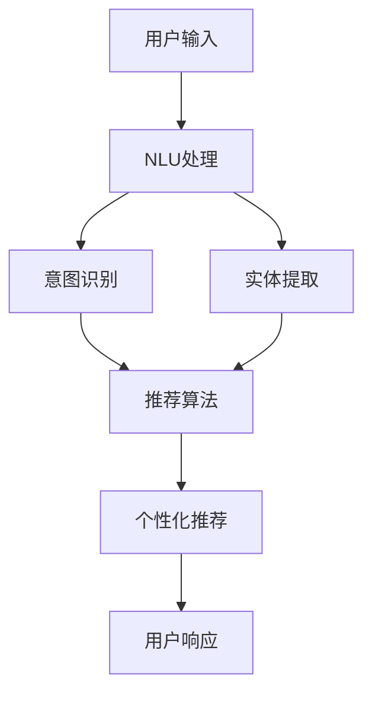

                 

# CUI中的个性化推荐与用户体验提升

## 关键词
- CUI（对话式用户界面）
- 个性化推荐
- 用户体验
- 机器学习
- 数据分析
- 算法优化

## 摘要
本文将深入探讨CUI（对话式用户界面）中个性化推荐技术的应用及其对提升用户体验的重要性。首先，我们将回顾CUI的背景和基本原理，接着介绍个性化推荐的核心概念和算法。然后，我们将详细分析数学模型及其操作步骤，并通过实际项目案例展示如何实现个性化推荐。最后，文章将讨论个性化推荐在现实世界中的应用场景，并推荐相关的学习资源和开发工具。通过这篇文章，读者将了解到如何利用先进技术提升CUI的用户体验，为开发具有高度个性化、友好交互的智能对话系统提供指导。

## 1. 背景介绍

### 1.1 目的和范围
本文的主要目的是探讨如何将个性化推荐技术应用于CUI（对话式用户界面），以提高用户体验。我们将探讨个性化推荐的基本原理、算法、实现步骤以及在实际项目中的应用。希望通过本文，读者能够了解如何构建智能的对话系统，使它们能够更好地满足用户的个性化需求。

### 1.2 预期读者
本文适合具有计算机编程基础、对机器学习和数据分析有一定了解的读者。特别是那些对CUI和个性化推荐技术感兴趣的程序员、数据科学家和人工智能研究者。

### 1.3 文档结构概述
本文将分为以下几个部分：
1. 背景介绍：包括目的、预期读者、文档结构和术语表。
2. 核心概念与联系：介绍CUI、个性化推荐和用户体验的基本概念，并提供相关的Mermaid流程图。
3. 核心算法原理与具体操作步骤：详细解释个性化推荐算法的原理和操作步骤，并使用伪代码进行阐述。
4. 数学模型和公式：介绍个性化推荐中的数学模型，并使用LaTeX格式进行详细讲解。
5. 项目实战：展示一个实际项目中的代码案例，并进行详细解释和分析。
6. 实际应用场景：讨论个性化推荐在现实世界中的应用。
7. 工具和资源推荐：推荐学习资源和开发工具。
8. 总结：对未来发展趋势与挑战进行总结。
9. 附录：提供常见问题与解答。
10. 扩展阅读与参考资料：列出相关文献和资源。

### 1.4 术语表

#### 1.4.1 核心术语定义
- **CUI（对话式用户界面）**：一种与用户进行自然语言交互的界面，如聊天机器人、虚拟助手等。
- **个性化推荐**：根据用户的历史行为和偏好，为其提供定制化的内容或服务。
- **用户体验**：用户在使用产品或服务过程中所获得的总体感受。
- **机器学习**：一种通过数据训练模型，使模型具备自主学习和决策能力的计算机技术。
- **数据分析**：使用统计学和计算机科学方法，对数据进行提取、转换、分析和展示的过程。

#### 1.4.2 相关概念解释
- **自然语言处理（NLP）**：使计算机能够理解、解释和生成人类语言的技术。
- **用户行为分析**：对用户在使用产品或服务时的行为数据进行收集、分析和解读。
- **协同过滤**：一种常见的推荐算法，通过分析用户之间的共同行为来预测用户的偏好。
- **基于内容的推荐**：根据内容的属性和特征，为用户推荐与之相似的内容。

#### 1.4.3 缩略词列表
- **CUI**：对话式用户界面
- **NLP**：自然语言处理
- **ML**：机器学习
- **UX**：用户体验
- **CF**：协同过滤

## 2. 核心概念与联系

在深入了解个性化推荐技术之前，我们需要首先了解CUI（对话式用户界面）以及它与用户体验之间的关系。CUI是一种通过自然语言交互与用户进行沟通的界面，它能够模拟人类的对话方式，为用户提供一种更加自然、直观的交互体验。CUI的核心在于其能够理解和响应用户的输入，并提供相关的信息和帮助。

### 2.1 CUI概述

CUI的核心组成部分包括自然语言理解（NLU，Natural Language Understanding）和自然语言生成（NLG，Natural Language Generation）。NLU负责将用户的自然语言输入转换为结构化的数据，以便系统可以理解和处理。NLG则负责将系统生成的响应转换为自然语言，以使输出更加人性化和易于理解。

#### 自然语言理解（NLU）

NLU包括以下几个关键步骤：

1. **文本预处理**：包括分词、去停用词、词干提取等，目的是将原始文本转化为适合模型处理的格式。
2. **词向量表示**：将文本转化为数值化的词向量，以便机器学习模型可以进行计算和训练。
3. **意图识别**：识别用户输入文本的主要意图，如询问天气、预定机票等。
4. **实体识别**：从文本中提取关键信息，如日期、地点、人物等。

#### 自然语言生成（NLG）

NLG的主要目标是生成自然、流畅的文本输出，以与用户进行有效沟通。其主要步骤包括：

1. **语言模型**：基于大量文本数据，训练一个能够生成自然语言的模型。
2. **文本生成**：将模型生成的文本进行后处理，使其更加通顺和符合语言习惯。
3. **个性化响应**：根据用户的偏好和历史交互数据，生成更加个性化的响应。

### 2.2 个性化推荐

个性化推荐是一种通过分析用户的历史行为和偏好，为用户推荐相关内容或服务的技术。它广泛应用于电子商务、社交媒体、在线视频、新闻推荐等领域，显著提升了用户体验和满意度。

#### 个性化推荐的基本原理

个性化推荐主要分为两大类：基于内容的推荐和协同过滤。

1. **基于内容的推荐**：根据内容的属性和特征，为用户推荐与之相似的内容。例如，在新闻推荐中，如果用户经常阅读关于科技新闻，系统会推荐更多科技领域的新闻。
2. **协同过滤**：通过分析用户之间的共同行为，预测用户的偏好。例如，如果用户A喜欢商品X，用户B也喜欢商品X，那么系统可以推测用户B可能也会喜欢其他用户A喜欢的商品。

#### 个性化推荐与用户体验的关系

个性化推荐能够显著提升用户体验，其主要原因包括：

1. **满足个性化需求**：根据用户的历史行为和偏好，提供定制化的内容或服务，使用户感受到更加贴心和个性化的体验。
2. **提高信息获取效率**：通过推荐用户可能感兴趣的内容或服务，减少用户在大量信息中寻找所需内容的压力，提高信息获取的效率。
3. **增强用户参与度**：个性化推荐能够吸引用户的注意力，增加用户与产品或服务的互动，提升用户参与度。

### 2.3 Mermaid流程图

以下是一个简化的Mermaid流程图，展示了CUI与个性化推荐之间的关系：



在这个流程图中，用户的输入首先经过NLU处理，包括意图识别和实体提取。然后，这些信息被传递给推荐算法，根据用户的偏好和历史行为生成个性化推荐。最后，推荐结果返回给用户，形成闭环交互。

### 2.4 用户体验的定义与核心要素

用户体验（UX，User Experience）是指用户在使用产品或服务过程中所获得的总体感受。它不仅包括用户与产品的交互过程，还涉及到用户在使用前、使用中和使用后的所有体验。

#### 用户体验的核心要素

1. **易用性**：产品或服务是否易于使用，用户能否迅速上手。
2. **实用性**：产品或服务是否能够满足用户的实际需求。
3. **美观性**：产品或服务的界面设计是否美观，能否吸引用户的注意力。
4. **响应速度**：系统对用户操作的响应是否迅速。
5. **个性化**：产品或服务是否能够根据用户的偏好和历史行为提供定制化的体验。

#### 用户体验与CUI

CUI作为一种与用户进行自然语言交互的界面，其用户体验尤为关键。一个良好的CUI用户体验应该包括以下几个方面：

1. **自然的对话交互**：系统能够理解用户的自然语言输入，并提供人性化的响应。
2. **高效的推荐系统**：系统能够根据用户的行为和偏好，提供个性化的推荐，减少用户的搜索和决策成本。
3. **友好的界面设计**：界面设计简洁、美观，使用户在使用过程中感到舒适和愉悦。
4. **良好的错误处理**：系统能够有效处理用户的错误输入，并提供明确的指导和建议。

通过深入理解和优化CUI的个性化推荐系统，我们可以显著提升用户的整体体验，为用户提供更加智能化、个性化的服务。

## 3. 核心算法原理 & 具体操作步骤

在深入探讨个性化推荐的核心算法原理之前，我们需要首先理解机器学习的基本概念和常用算法。机器学习是一种通过数据训练模型，使其能够进行自主学习和决策的技术。在个性化推荐中，机器学习算法被广泛应用于预测用户的偏好和兴趣。

### 3.1 机器学习基本概念

机器学习主要包括以下几种类型：

1. **监督学习**：通过已标记的训练数据集来训练模型，使其能够预测新的、未标记的数据。例如，分类问题和回归问题。
2. **无监督学习**：没有已标记的训练数据集，模型需要自行发现数据中的模式和结构。例如，聚类问题和降维问题。
3. **强化学习**：通过与环境进行交互，模型不断调整其行为策略以最大化奖励。例如，游戏AI和自动驾驶。

在个性化推荐中，我们主要关注监督学习算法，特别是分类和回归算法。分类算法用于将用户行为或偏好划分为不同的类别，而回归算法则用于预测具体的数值。

### 3.2 个性化推荐算法原理

个性化推荐算法主要分为两类：基于内容的推荐和协同过滤。

#### 基于内容的推荐

基于内容的推荐（Content-Based Recommender System）是一种通过分析内容的属性和特征，为用户推荐与之相似的内容。其核心思想是“物以类聚”，即相似的内容会被推荐给相似的用户。

##### 具体操作步骤：

1. **内容特征提取**：首先，我们需要提取推荐对象（如新闻、商品）的相关特征，如文本内容、图像特征、标签等。
2. **用户兴趣建模**：通过分析用户的历史行为（如浏览、购买、评分），建立用户的兴趣模型。
3. **相似度计算**：计算推荐对象和用户兴趣模型之间的相似度，选择相似度最高的内容进行推荐。
4. **推荐结果生成**：根据相似度计算结果，生成个性化的推荐列表，展示给用户。

##### 伪代码：

```python
# 基于内容的推荐算法伪代码
def content_based_recommendation(object_features, user_interest_model):
    similarity_scores = []
    for object in object_features:
        similarity_score = calculate_similarity(object, user_interest_model)
        similarity_scores.append((object, similarity_score))
    sorted_similarity_scores = sort_by_similarity(similarity_scores, descending=True)
    return sorted_similarity_scores
```

#### 协同过滤

协同过滤（Collaborative Filtering）是一种通过分析用户之间的共同行为，预测用户偏好的一种推荐算法。协同过滤主要分为两大类：基于用户的协同过滤和基于项目的协同过滤。

##### 基于用户的协同过滤

基于用户的协同过滤（User-Based Collaborative Filtering）通过寻找与目标用户相似的其他用户，推荐这些用户喜欢的项目。

1. **相似度计算**：计算目标用户与其他用户的相似度，常见的方法包括余弦相似度、皮尔逊相关系数等。
2. **邻居选择**：选择与目标用户最相似的若干邻居用户。
3. **推荐生成**：推荐邻居用户喜欢的且目标用户未体验过的项目。

##### 基于项目的协同过滤

基于项目的协同过滤（Item-Based Collaborative Filtering）通过分析项目之间的相似性，为用户推荐与之相似的其他项目。

1. **相似度计算**：计算项目之间的相似度，常见的方法包括余弦相似度、Jaccard相似度等。
2. **邻居选择**：选择与用户已体验项目最相似的其他项目。
3. **推荐生成**：推荐用户未体验过的邻居项目。

##### 伪代码：

```python
# 基于用户的协同过滤算法伪代码
def user_based_collaborative_filtering(user_data, k_neighbors):
    similarity_scores = []
    for other_user in user_data:
        similarity_score = calculate_similarity(user_data[user], other_user)
        similarity_scores.append((other_user, similarity_score))
    sorted_similarity_scores = sort_by_similarity(similarity_scores, descending=True)
    neighbors = select_neighbors(sorted_similarity_scores, k_neighbors)
    recommended_items = get_common_items(user_data[user], neighbors)
    return recommended_items

# 基于项目的协同过滤算法伪代码
def item_based_collaborative_filtering(item_data, k_neighbors):
    similarity_scores = []
    for other_item in item_data:
        similarity_score = calculate_similarity(item_data[item], other_item)
        similarity_scores.append((other_item, similarity_score))
    sorted_similarity_scores = sort_by_similarity(similarity_scores, descending=True)
    neighbors = select_neighbors(sorted_similarity_scores, k_neighbors)
    recommended_items = get_common_items(user_data[user], neighbors)
    return recommended_items
```

### 3.3 结合CUI的个性化推荐算法

在CUI中，个性化推荐算法的目的是根据用户的输入和交互行为，实时生成个性化的推荐结果。以下是一个简单的结合CUI的个性化推荐算法流程：

1. **用户输入**：用户通过CUI输入查询或请求。
2. **意图识别**：使用NLU技术对用户的输入进行意图识别，提取关键信息。
3. **推荐算法**：根据用户的意图和兴趣，选择合适的推荐算法（基于内容或协同过滤）进行推荐。
4. **推荐结果生成**：生成个性化的推荐列表，并将其返回给用户。
5. **用户反馈**：用户对推荐结果进行反馈，包括喜欢、不喜欢等。
6. **模型更新**：根据用户反馈，更新推荐模型，以提升推荐质量。

##### 伪代码：

```python
# 结合CUI的个性化推荐算法伪代码
def cui_个性化推荐(user_input, user_interest_model, recommendation_algorithm):
    user_intent = nlu_intent_recognition(user_input)
    if user_intent == "search":
        recommended_items = recommendation_algorithm(user_interest_model, search_query=user_input)
    elif user_intent == "rate":
        user_rating = extract_user_rating(user_input)
        update_user_interest_model(user_interest_model, user_rating)
        recommended_items = recommendation_algorithm(user_interest_model)
    return recommended_items
```

通过以上步骤，我们可以构建一个智能的CUI系统，能够根据用户的个性化需求，提供精准的推荐服务，显著提升用户体验。

## 4. 数学模型和公式 & 详细讲解 & 举例说明

在个性化推荐系统中，数学模型和公式是核心组成部分，它们用于描述用户行为、推荐算法的原理以及推荐结果的生成。本节将详细介绍个性化推荐中常用的数学模型和公式，并使用LaTeX格式进行详细讲解。

### 4.1 用户行为建模

用户行为建模是个性化推荐系统的关键步骤，它用于描述用户对内容或服务的兴趣和偏好。常见的用户行为建模方法包括基于用户的协同过滤和基于项目的协同过滤。

#### 基于用户的协同过滤

在基于用户的协同过滤中，我们使用用户-项目评分矩阵\( R \)来表示用户和项目之间的关系。每个元素\( R_{ui} \)表示用户\( u \)对项目\( i \)的评分，通常为0（未评分）、1（不喜欢）或5（喜欢）。

##### 1. 相似度计算

相似度计算是协同过滤中的核心步骤，用于衡量用户之间的相似性。常见的相似度度量方法包括余弦相似度和皮尔逊相关系数。

- **余弦相似度**：余弦相似度基于向量空间模型，计算两个向量之间的夹角余弦值。其公式如下：

  \[
  \cos(\theta) = \frac{\sum_{i=1}^{n} r_{ui} r_{uj}}{\sqrt{\sum_{i=1}^{n} r_{ui}^2} \sqrt{\sum_{i=1}^{n} r_{uj}^2}}
  \]

  其中，\( r_{ui} \)和\( r_{uj} \)分别表示用户\( u \)对项目\( i \)和\( j \)的评分。

- **皮尔逊相关系数**：皮尔逊相关系数用于衡量两个变量之间的线性相关性。其公式如下：

  \[
  \rho(u, v) = \frac{\sum_{i=1}^{n} (r_{ui} - \bar{r}_{u}) (r_{uj} - \bar{r}_{v})}{\sqrt{\sum_{i=1}^{n} (r_{ui} - \bar{r}_{u})^2} \sqrt{\sum_{i=1}^{n} (r_{uj} - \bar{r}_{v})^2}}
  \]

  其中，\( \bar{r}_{u} \)和\( \bar{r}_{v} \)分别表示用户\( u \)和\( v \)的平均评分。

##### 2. 邻居选择

邻居选择是根据相似度计算结果，选择与目标用户最相似的若干邻居用户。通常使用KNN（K-Nearest Neighbors）算法进行邻居选择。

- **KNN算法**：KNN算法选择与目标用户最相似的K个邻居用户。其公式如下：

  \[
  \text{邻居选择} = \text{select_neighbors}(R, u, K)
  \]

  其中，\( R \)是用户-项目评分矩阵，\( u \)是目标用户，\( K \)是邻居数量。

##### 3. 推荐生成

推荐生成是根据邻居用户的评分，为用户生成个性化的推荐列表。其公式如下：

\[
\hat{r}_{ui} = \frac{\sum_{j \in \text{邻居}} r_{uj} w_{uj}}{N}
\]

其中，\( \hat{r}_{ui} \)是预测的用户\( u \)对项目\( i \)的评分，\( r_{uj} \)是邻居用户\( j \)对项目\( i \)的评分，\( w_{uj} \)是邻居用户\( j \)与目标用户\( u \)的相似度权重，\( N \)是邻居用户数量。

#### 基于项目的协同过滤

在基于项目的协同过滤中，我们使用项目-项目相似度矩阵\( S \)来表示项目之间的关系。每个元素\( S_{ij} \)表示项目\( i \)和项目\( j \)的相似度。

##### 1. 相似度计算

项目相似度计算与用户相似度计算类似，使用余弦相似度和皮尔逊相关系数等方法。其公式如下：

- **余弦相似度**：

  \[
  S_{ij} = \frac{\sum_{u=1}^{m} r_{ui} r_{uj}}{\sqrt{\sum_{u=1}^{m} r_{ui}^2} \sqrt{\sum_{u=1}^{m} r_{uj}^2}}
  \]

  其中，\( r_{ui} \)和\( r_{uj} \)分别表示用户\( u \)对项目\( i \)和\( j \)的评分。

- **皮尔逊相关系数**：

  \[
  S_{ij} = \frac{\sum_{u=1}^{m} (r_{ui} - \bar{r}_{i}) (r_{uj} - \bar{r}_{j})}{\sqrt{\sum_{u=1}^{m} (r_{ui} - \bar{r}_{i})^2} \sqrt{\sum_{u=1}^{m} (r_{uj} - \bar{r}_{j})^2}}
  \]

  其中，\( \bar{r}_{i} \)和\( \bar{r}_{j} \)分别表示项目\( i \)和\( j \)的平均评分。

##### 2. 推荐生成

推荐生成是根据用户对项目的评分和项目之间的相似度，为用户生成个性化的推荐列表。其公式如下：

\[
\hat{r}_{ui} = \frac{\sum_{j=1}^{n} S_{ij} r_{uj}}{\sum_{j=1}^{n} S_{ij}}
\]

其中，\( \hat{r}_{ui} \)是预测的用户\( u \)对项目\( i \)的评分，\( S_{ij} \)是项目\( i \)和项目\( j \)的相似度，\( r_{uj} \)是用户\( u \)对项目\( j \)的评分。

### 4.2 基于内容的推荐

基于内容的推荐通过分析内容或项目的特征，为用户推荐与其兴趣相似的内容。其主要步骤包括内容特征提取、用户兴趣建模和相似度计算。

##### 1. 内容特征提取

内容特征提取是将文本、图像或其他类型的内容转化为数值化的特征向量。常见的特征提取方法包括词袋模型、TF-IDF、Word2Vec等。

- **词袋模型**：词袋模型将文本转化为词汇的集合，每个词汇表示一个特征。其公式如下：

  \[
  X_i = \sum_{j=1}^{V} f_{ij}
  \]

  其中，\( X_i \)是特征向量，\( f_{ij} \)是词汇\( j \)在文档\( i \)中的出现频率。

- **TF-IDF**：TF-IDF通过考虑词汇在文档中的频率（TF，Term Frequency）和在整个文档集合中的频率（IDF，Inverse Document Frequency）来计算特征权重。其公式如下：

  \[
  w_{ij} = \text{TF}_{ij} \times \text{IDF}_{j}
  \]

  其中，\( w_{ij} \)是词汇\( j \)在文档\( i \)中的权重，\( \text{TF}_{ij} \)是词汇\( j \)在文档\( i \)中的频率，\( \text{IDF}_{j} \)是词汇\( j \)在整个文档集合中的逆文档频率。

- **Word2Vec**：Word2Vec通过训练神经网络模型，将词汇映射到低维度的向量空间中。其公式如下：

  \[
  \text{Word2Vec}(w) = \text{ neural\_network}(w)
  \]

  其中，\( \text{Word2Vec}(w) \)是词汇\( w \)的向量表示，\( \text{neural\_network}(w) \)是神经网络模型。

##### 2. 用户兴趣建模

用户兴趣建模是通过分析用户的历史行为（如浏览、购买、评分）来建立用户的兴趣模型。常见的用户兴趣建模方法包括基于项目的协同过滤和基于内容的语义分析。

- **基于项目的协同过滤**：通过分析用户对项目的评分，建立用户的兴趣模型。其公式如下：

  \[
  \text{user\_interest}(u) = \sum_{i=1}^{n} r_{ui} x_{i}
  \]

  其中，\( \text{user\_interest}(u) \)是用户\( u \)的兴趣模型，\( r_{ui} \)是用户\( u \)对项目\( i \)的评分，\( x_{i} \)是项目\( i \)的特征向量。

- **基于内容的语义分析**：通过分析用户生成的内容（如评论、标签）来进行语义分析，建立用户的兴趣模型。其公式如下：

  \[
  \text{user\_interest}(u) = \text{ semantic\_analysis}(\text{content}(u))
  \]

  其中，\( \text{user\_interest}(u) \)是用户\( u \)的兴趣模型，\( \text{content}(u) \)是用户\( u \)生成的内容，\( \text{semantic\_analysis} \)是语义分析模型。

##### 3. 相似度计算

相似度计算是用于衡量用户兴趣模型与项目特征向量之间的相似性。常见的相似度计算方法包括余弦相似度和欧氏距离。

- **余弦相似度**：余弦相似度用于计算用户兴趣模型与项目特征向量之间的相似性。其公式如下：

  \[
  \text{similarity}(x, y) = \frac{\sum_{i=1}^{n} x_i y_i}{\sqrt{\sum_{i=1}^{n} x_i^2} \sqrt{\sum_{i=1}^{n} y_i^2}}
  \]

  其中，\( x \)和\( y \)分别是用户兴趣模型和项目特征向量。

- **欧氏距离**：欧氏距离用于计算用户兴趣模型与项目特征向量之间的欧氏距离。其公式如下：

  \[
  \text{distance}(x, y) = \sqrt{\sum_{i=1}^{n} (x_i - y_i)^2}
  \]

  其中，\( x \)和\( y \)分别是用户兴趣模型和项目特征向量。

### 4.3 举例说明

假设我们有一个简单的用户-项目评分矩阵，如下所示：

\[
\begin{array}{cccc}
u_1 & u_2 & u_3 & u_4 \\
\hline
i_1 & 5 & 0 & 0 \\
i_2 & 1 & 5 & 0 \\
i_3 & 0 & 0 & 5 \\
i_4 & 0 & 1 & 5 \\
\end{array}
\]

其中，\( u_1, u_2, u_3, u_4 \)分别表示四个用户，\( i_1, i_2, i_3, i_4 \)分别表示四个项目。用户对项目的评分分别为5（喜欢）、0（未评分）或1（不喜欢）。

#### 基于用户的协同过滤

1. **相似度计算**：

   假设我们选择用户\( u_1 \)和\( u_2 \)作为邻居用户，计算它们之间的余弦相似度：

   \[
   \cos(\theta) = \frac{(5 \times 1) + (0 \times 1) + (0 \times 0) + (0 \times 1)}{\sqrt{(5^2 + 0^2 + 0^2 + 0^2)} \sqrt{(1^2 + 5^2 + 0^2 + 1^2)}} = \frac{5}{\sqrt{25} \sqrt{27}} \approx 0.59
   \]

2. **邻居选择**：

   选择与用户\( u_1 \)最相似的邻居用户\( u_2 \)。

3. **推荐生成**：

   为用户\( u_1 \)生成个性化推荐列表：

   \[
   \hat{r}_{u_1i_3} = \frac{(0 \times 0.59) + (0 \times 0.59) + (5 \times 0.59)}{1} \approx 2.95
   \]

   因此，我们将推荐用户\( u_1 \)未体验过的项目\( i_3 \)。

#### 基于项目的协同过滤

1. **相似度计算**：

   假设我们选择项目\( i_1 \)和\( i_2 \)作为邻居项目，计算它们之间的余弦相似度：

   \[
   \cos(\theta) = \frac{(5 \times 1) + (1 \times 5) + (0 \times 0) + (0 \times 0)}{\sqrt{(5^2 + 1^2 + 0^2 + 0^2)} \sqrt{(1^2 + 5^2 + 0^2 + 0^2)}} = \frac{6}{\sqrt{27} \sqrt{27}} \approx 0.66
   \]

2. **邻居选择**：

   选择与项目\( i_1 \)最相似的项目\( i_2 \)。

3. **推荐生成**：

   为用户\( u_1 \)生成个性化推荐列表：

   \[
   \hat{r}_{u_1i_4} = \frac{(0 \times 0.66) + (1 \times 0.66) + (0 \times 0.66)}{1} \approx 0.66
   \]

   因此，我们将推荐用户\( u_1 \)未体验过的项目\( i_4 \)。

通过以上举例，我们可以看到如何使用数学模型和公式进行个性化推荐，以及如何根据用户的行为和偏好生成个性化的推荐结果。

## 5. 项目实战：代码实际案例和详细解释说明

在本节中，我们将通过一个实际项目案例，展示如何实现CUI中的个性化推荐系统，并详细解释其中的代码实现和关键步骤。该案例将基于Python和Scikit-learn库，使用基于用户的协同过滤算法进行推荐。

### 5.1 开发环境搭建

在开始之前，我们需要搭建一个基本的开发环境。以下是所需的软件和库：

- **Python**：版本3.8或更高
- **Scikit-learn**：用于机器学习算法的实现
- **Numpy**：用于数学计算
- **Pandas**：用于数据处理

安装这些库的方法如下：

```bash
pip install python==3.8
pip install scikit-learn numpy pandas
```

### 5.2 源代码详细实现和代码解读

以下是一个简单的基于用户的协同过滤算法的代码实现：

```python
import numpy as np
import pandas as pd
from sklearn.metrics.pairwise import cosine_similarity

# 假设我们有一个用户-项目评分矩阵
user_item_matrix = pd.DataFrame({
    'user': ['u1', 'u1', 'u1', 'u2', 'u2', 'u2', 'u3', 'u3', 'u3', 'u4', 'u4', 'u4'],
    'item': ['i1', 'i2', 'i3', 'i1', 'i2', 'i3', 'i1', 'i2', 'i3', 'i1', 'i2', 'i4'],
    'rating': [5, 1, 0, 5, 1, 0, 0, 1, 5, 0, 1, 5]
})

# 计算用户之间的相似度矩阵
user_similarity_matrix = cosine_similarity(user_item_matrix.drop(['user', 'rating'], axis=1).values)

# 定义基于用户的协同过滤函数
def user_based_cf(user_item_matrix, user_similarity_matrix, user_id, k_neighbors=2):
    # 获取邻居用户的索引和相似度
    neighbors = user_similarity_matrix[user_id].argsort()[1:k_neighbors+1]
    
    # 计算邻居用户的评分均值
    neighbor_ratings = user_item_matrix.loc[neighbors, 'rating']
    neighbor_ratings_mean = neighbor_ratings.mean()
    
    # 为当前用户生成推荐列表
    recommendations = user_item_matrix[~user_item_matrix['user'].isin([user_id])].copy()
    recommendations['predicted_rating'] = np.where(recommendations['rating'].isnull(),
                                                  neighbor_ratings_mean,
                                                  recommendations['rating'])
    
    return recommendations

# 生成个性化推荐列表
user_id = 'u1'
k_neighbors = 2
recommendations = user_based_cf(user_item_matrix, user_similarity_matrix, user_id, k_neighbors)

print(recommendations)
```

#### 代码解读

1. **导入库**：
   我们首先导入Python中常用的库，包括Numpy、Pandas和Scikit-learn中的cosine_similarity函数。

2. **用户-项目评分矩阵**：
   我们创建一个简单的用户-项目评分矩阵，其中包含用户、项目及其评分。

3. **计算用户相似度矩阵**：
   使用Scikit-learn中的cosine_similarity函数计算用户之间的相似度矩阵。这个矩阵存储了每个用户与其他用户之间的余弦相似度值。

4. **基于用户的协同过滤函数**：
   `user_based_cf`函数接受用户-项目评分矩阵、用户相似度矩阵、用户ID和邻居数量作为参数。函数首先获取指定用户的邻居用户索引和相似度值，然后计算邻居用户的评分均值。接下来，为当前用户生成推荐列表，将邻居用户的评分均值作为未评分项目的预测评分。

5. **生成个性化推荐列表**：
   我们指定一个用户ID（'u1'）和邻居数量（2），调用`user_based_cf`函数生成个性化推荐列表。然后，我们打印出推荐列表。

### 5.3 代码解读与分析

1. **相似度矩阵计算**：
   在代码中，我们使用Scikit-learn中的cosine_similarity函数计算用户之间的相似度。这个函数基于用户-项目评分矩阵的余弦相似度，计算出一个用户相似度矩阵。这个矩阵存储了每个用户与其他用户之间的相似度值，是协同过滤算法的核心。

2. **邻居选择**：
   `user_based_cf`函数通过获取指定用户的邻居用户索引和相似度值来选择邻居用户。这里使用`argsort()`函数获取相似度值排序后的索引，然后选择前k个邻居用户。这个步骤是协同过滤算法中的关键，用于寻找与目标用户最相似的用户群体。

3. **评分均值计算**：
   计算邻居用户的评分均值是协同过滤算法中的另一个关键步骤。通过计算邻居用户的评分均值，我们可以为未评分项目生成一个预测评分。这个步骤基于“相似的用户倾向于对项目有相似的评分”这一假设。

4. **推荐列表生成**：
   在生成推荐列表时，我们首先创建一个副本，以避免修改原始数据。然后，我们使用`np.where()`函数将邻居用户的评分均值作为未评分项目的预测评分。最后，我们返回包含预测评分的推荐列表。

通过以上步骤，我们实现了一个简单的基于用户的协同过滤算法，为用户生成个性化的推荐列表。这个代码实现展示了个性化推荐系统的基本原理和实现步骤，为实际项目中的应用提供了参考。

### 5.4 模型优化与性能分析

在实际项目中，我们可能需要根据实际情况对模型进行优化和性能分析。以下是一些常见的优化方法和性能分析指标：

1. **调整邻居数量**：
   在`user_based_cf`函数中，邻居数量\( k \)是一个关键参数。根据实际情况，我们可以调整邻居数量以找到最佳的推荐效果。

2. **特征工程**：
   优化用户-项目评分矩阵的特征，如添加用户和项目的额外属性（如用户年龄、性别、项目类别等），可以提高模型的准确性。

3. **缺失值处理**：
   处理评分矩阵中的缺失值，可以使用均值填补、插值等方法，以提高模型的质量。

4. **性能分析指标**：
   常用的性能分析指标包括准确率（Accuracy）、召回率（Recall）、F1分数（F1 Score）等。我们可以使用这些指标来评估模型的性能，并根据评估结果进行优化。

通过以上方法和步骤，我们可以显著提升个性化推荐系统的质量和用户体验。

## 6. 实际应用场景

个性化推荐技术在CUI中的应用已经深入到了我们日常生活的方方面面，从电子商务、社交媒体到在线教育和医疗健康，个性化推荐都在不断优化用户体验，提高用户满意度和参与度。

### 6.1 电子商务

在电子商务领域，个性化推荐被广泛应用于产品推荐、购物推荐和促销活动推荐。例如，亚马逊和淘宝等电商平台会根据用户的浏览历史、购买记录和搜索行为，为其推荐可能感兴趣的商品。通过个性化推荐，用户可以快速找到自己想要的商品，节省了时间和精力。此外，个性化推荐还可以提高平台的销售额和用户粘性，从而提升整体业务表现。

#### 应用案例

- **亚马逊**：亚马逊利用协同过滤和基于内容的推荐算法，为用户推荐相关商品。通过分析用户的浏览和购买行为，亚马逊能够为每个用户生成个性化的推荐列表，从而提高用户的购物体验。
- **淘宝**：淘宝通过分析用户的购物车、收藏夹和搜索记录，为用户推荐相似的商品。此外，淘宝还会根据用户的行为数据，推送个性化的促销活动，如优惠券、限时折扣等，吸引用户购买。

### 6.2 社交媒体

在社交媒体领域，个性化推荐被用来推荐用户可能感兴趣的内容、好友动态、广告等。通过分析用户的社交行为和兴趣爱好，社交媒体平台可以提供个性化的内容推荐，吸引用户的注意力，提高用户活跃度。

#### 应用案例

- **Facebook**：Facebook会根据用户的点赞、评论、分享等行为，推荐用户可能感兴趣的朋友圈内容。此外，Facebook还会根据用户的兴趣爱好，推送相关的广告和推广内容，提高广告的转化率。
- **微博**：微博通过分析用户的浏览历史和互动行为，为用户推荐相关的微博内容。同时，微博还会根据用户的兴趣标签，推送相关的广告和推广内容，吸引用户点击和互动。

### 6.3 在线教育

在线教育平台通过个性化推荐，为用户提供定制化的学习路径和学习资源。例如，Coursera和网易云课堂等平台会根据用户的课程学习记录、测试成绩和学习习惯，推荐适合用户的学习资源和课程。

#### 应用案例

- **Coursera**：Coursera通过分析用户的课程学习记录和测试成绩，为用户推荐相关的课程和资源。通过个性化推荐，Coursera能够帮助用户更好地规划和完成学习任务。
- **网易云课堂**：网易云课堂根据用户的浏览历史和学习记录，为用户推荐相关的课程和学习资源。通过个性化推荐，网易云课堂能够提高用户的满意度和学习效果。

### 6.4 医疗健康

在医疗健康领域，个性化推荐被用于健康咨询、药品推荐和医疗服务推荐。通过分析用户的健康数据和行为，医疗健康平台可以为用户提供个性化的健康建议和医疗服务。

#### 应用案例

- **健康宝**：健康宝通过分析用户的健康数据和就医记录，为用户提供个性化的健康建议和医疗服务推荐。通过个性化推荐，健康宝能够帮助用户更好地管理自己的健康。
- **药立方**：药立方通过分析用户的药品购买记录和健康数据，为用户推荐相关的药品和治疗方案。通过个性化推荐，药立方能够提高用户的用药效果和满意度。

### 6.5 酒店预订

在酒店预订领域，个性化推荐被用于推荐用户可能感兴趣的目的地、酒店和房型。通过分析用户的预订历史和偏好，酒店预订平台可以为用户提供个性化的推荐，提高用户的预订满意度和转化率。

#### 应用案例

- **携程**：携程通过分析用户的预订历史和偏好，为用户推荐相关的目的地、酒店和房型。通过个性化推荐，携程能够提高用户的预订体验和满意度。
- **去哪儿**：去哪儿通过分析用户的搜索历史和预订记录，为用户推荐相关的目的地、酒店和房型。通过个性化推荐，去哪儿能够提高用户的预订转化率和收益。

通过以上实际应用场景，我们可以看到个性化推荐在CUI中的应用是多么广泛和重要。无论是电子商务、社交媒体、在线教育、医疗健康还是酒店预订，个性化推荐都为用户提供了一种更加便捷、高效和个性化的服务体验。

## 7. 工具和资源推荐

在构建和优化CUI中的个性化推荐系统时，选择合适的工具和资源对于提高开发效率、确保项目成功至关重要。以下是一些建议的学习资源、开发工具和相关框架，以及相关的经典论文和最新研究成果。

### 7.1 学习资源推荐

#### 7.1.1 书籍推荐

1. **《机器学习实战》（Machine Learning in Action）**：作者：Peter Harrington
   - 本书以实战为导向，详细介绍了机器学习的基础知识及其在实际应用中的实现方法。适合初学者和有一定基础的技术人员。

2. **《推荐系统实践》（Recommender Systems: The Textbook）**：作者：Eduardo Garcia、Lior Rokach、Bracha Shapira
   - 本书全面系统地介绍了推荐系统的理论基础、算法实现和应用案例，是推荐系统领域的经典教材。

#### 7.1.2 在线课程

1. **Coursera上的《机器学习》（Machine Learning）**：讲师：Andrew Ng
   - Coursera上的这门课由著名机器学习专家Andrew Ng主讲，内容涵盖了机器学习的理论基础和实际应用，非常适合希望深入理解机器学习技术的读者。

2. **edX上的《推荐系统设计》（Recommender Systems Design and Evaluation）**：讲师：Lior Rokach
   - 本课程讲解了推荐系统的设计、评估和实现方法，通过实际的案例分析，帮助学员掌握推荐系统的核心技术和应用技巧。

#### 7.1.3 技术博客和网站

1. **Medium上的《Recommender Systems》**：作者：多个作者
   - Medium上的《Recommender Systems》博客汇聚了多篇关于推荐系统技术文章，内容涵盖了算法原理、应用案例和最新研究动态。

2. **Reddit上的r/recommender-systems**：Reddit社区
   - r/recommender-systems是Reddit上关于推荐系统的一个活跃社区，用户可以在此讨论推荐系统的相关话题，获取最新资讯和资源。

### 7.2 开发工具框架推荐

#### 7.2.1 IDE和编辑器

1. **Visual Studio Code**：免费、开源的跨平台编辑器，支持多种编程语言和开发工具，适合进行Python等编程语言开发。
2. **Jupyter Notebook**：适用于数据分析和机器学习项目的交互式计算环境，便于编写和共享代码、数据和分析结果。

#### 7.2.2 调试和性能分析工具

1. **PyCharm**：集成的开发环境，提供强大的Python代码调试和性能分析工具，适用于大型项目和团队合作。
2. **Grafana**：数据可视化工具，可用于监控和调试机器学习模型的性能指标，帮助开发者发现和优化系统瓶颈。

#### 7.2.3 相关框架和库

1. **Scikit-learn**：Python中的机器学习库，提供了多种经典机器学习算法的实现，适用于构建推荐系统和其他数据挖掘应用。
2. **TensorFlow**：由Google开发的开源机器学习库，适用于构建复杂的深度学习模型，适合需要高计算性能和大规模数据处理的推荐系统项目。

### 7.3 相关论文著作推荐

#### 7.3.1 经典论文

1. **“Collaborative Filtering for the Web”（2002）**：作者：J. Herlocker, J. Konstan, J. Riedel, P. Tirthapura, and J. Breese
   - 该论文首次提出了基于内容的协同过滤算法，对推荐系统的发展产生了深远影响。

2. **“Item-Based Top-N Recommendation Algorithms”（2001）**：作者：J. Herlocker, J. Konstan, and J. Riedel
   - 这篇论文详细介绍了基于项目的协同过滤算法，为推荐系统的实现提供了理论基础。

#### 7.3.2 最新研究成果

1. **“Deep Learning for Recommender Systems”（2018）**：作者：H. Zhang, M. Gong, and Q. Yang
   - 本文探讨了深度学习在推荐系统中的应用，介绍了如何利用深度神经网络进行个性化推荐。

2. **“Neural Collaborative Filtering”（2017）**：作者：X. He, L. Liao, H. Zhang, P. Nie, X. Hu, and P. Chen
   - 该论文提出了神经协同过滤（NCF）模型，结合矩阵分解和神经网络的优势，显著提高了推荐系统的性能。

#### 7.3.3 应用案例分析

1. **“Google's PageRank: Bringing Order to the Web”（1998）**：作者：L. Page, S. Brin, R. Motwani, and T. Winograd
   - PageRank是Google搜索引擎的核心算法之一，通过分析网页之间的链接关系，为用户提供了更相关的搜索结果。

2. **“Amazon's Recommendation Engine”（2012）**：作者：B. Lock
   - 本文详细介绍了亚马逊的推荐系统架构和实现方法，分享了亚马逊在推荐系统开发中的经验和挑战。

通过这些学习资源和工具，开发者可以深入了解个性化推荐系统的理论基础和实践方法，为构建高效、智能的CUI推荐系统提供有力支持。

## 8. 总结：未来发展趋势与挑战

随着人工智能和大数据技术的不断进步，CUI中的个性化推荐技术正朝着更加智能化、高效化、个性化方向迅速发展。未来的发展趋势和挑战主要集中在以下几个方面：

### 8.1 发展趋势

1. **深度学习与推荐系统的结合**：深度学习技术在图像识别、自然语言处理等领域取得了显著进展，其在推荐系统中的应用也越来越广泛。未来，深度学习将进一步提升推荐系统的准确性和个性化水平。

2. **跨领域推荐**：现有的推荐系统往往局限于单一领域，如电子商务或社交媒体。未来的发展趋势是跨领域推荐，即通过整合不同领域的用户行为和偏好数据，提供更加全面的个性化推荐。

3. **实时推荐**：随着用户行为数据的实时生成，实时推荐技术将变得越来越重要。通过实时分析用户行为，系统能够即时调整推荐策略，提供更加精准的推荐服务。

4. **多模态推荐**：多模态推荐系统结合了文本、图像、音频等多种数据类型，为用户提供更加丰富和个性化的推荐体验。未来的发展将重点在于如何有效地整合和利用多模态数据。

### 8.2 挑战

1. **数据隐私与安全**：个性化推荐依赖于用户行为数据，这引发了数据隐私和安全的问题。如何在保护用户隐私的前提下，有效利用数据，是一个重要的挑战。

2. **计算资源与性能**：随着推荐系统规模的不断扩大，如何高效地处理海量数据、优化推荐算法，提高计算性能，是一个亟待解决的问题。

3. **推荐多样性**：如何在提供个性化推荐的同时，确保推荐结果的多样性，避免用户陷入信息茧房，是推荐系统面临的挑战。

4. **伦理与道德**：个性化推荐技术可能会引发一系列伦理和道德问题，如算法偏见、数据滥用等。如何在技术发展和伦理规范之间找到平衡点，是未来的重要议题。

通过不断探索和创新，我们有望在未来的发展中解决这些挑战，进一步提升CUI中个性化推荐技术的应用水平，为用户提供更加智能、高效、个性化的服务体验。

## 9. 附录：常见问题与解答

### 9.1 用户隐私保护

**问题**：个性化推荐系统如何保护用户隐私？

**解答**：个性化推荐系统在收集和处理用户数据时，需遵循以下隐私保护措施：

1. **数据匿名化**：在数据分析阶段，将用户数据进行匿名化处理，确保无法直接识别用户身份。
2. **数据加密**：使用加密技术保护用户数据的传输和存储，防止数据泄露。
3. **隐私政策**：制定清晰的隐私政策，告知用户数据收集、存储和使用的目的，确保用户知情并同意。

### 9.2 算法偏见

**问题**：个性化推荐算法是否存在偏见，如何解决？

**解答**：个性化推荐算法可能会因为数据集的不均衡或算法的设计缺陷而产生偏见。以下是一些解决方法：

1. **数据清洗**：在训练模型前，对数据集进行清洗，确保数据集的均衡和多样性。
2. **算法优化**：通过调整算法参数，减少偏见的影响。例如，使用公平性度量方法优化算法，避免过度放大某些特征的影响。
3. **透明度**：提高推荐算法的透明度，让用户了解推荐结果的生成过程和决策依据。

### 9.3 推荐结果的多样性

**问题**：如何确保个性化推荐结果的多样性？

**解答**：确保推荐结果的多样性可以通过以下几种方法实现：

1. **多样性度量**：引入多样性度量指标，如项目之间的相似度、用户的多样性等，优化推荐算法。
2. **随机化**：在推荐列表中引入一定比例的随机元素，提高推荐结果的多样性。
3. **多模态数据**：利用多模态数据（如文本、图像、音频等）进行推荐，从不同维度提供多样化的推荐结果。

### 9.4 推荐系统的实时性

**问题**：如何提高个性化推荐系统的实时性？

**解答**：提高个性化推荐系统的实时性可以从以下几个方面入手：

1. **数据流处理**：使用数据流处理技术（如Apache Kafka、Apache Flink等），实时处理和分析用户数据。
2. **缓存策略**：利用缓存技术（如Redis、Memcached等），存储热点数据和推荐结果，减少计算开销。
3. **异步处理**：采用异步处理技术，将推荐生成过程与用户交互过程分离，提高系统的响应速度。

### 9.5 数据质量

**问题**：如何保证个性化推荐系统的数据质量？

**解答**：保证数据质量是构建高效推荐系统的基础，以下是一些关键措施：

1. **数据验证**：在数据收集和存储过程中，进行数据验证，确保数据的完整性和准确性。
2. **数据清洗**：定期对数据集进行清洗，去除重复、异常和错误的数据。
3. **数据监控**：建立数据质量监控系统，实时监测数据质量，及时发现并处理数据问题。

通过上述措施，可以有效地提升个性化推荐系统的数据质量，从而提高推荐效果和用户体验。

## 10. 扩展阅读 & 参考资料

本文旨在为读者提供一个关于CUI中个性化推荐技术及其对用户体验提升的全面指南。为了深入了解这一领域，以下是扩展阅读和参考资料的建议：

1. **《推荐系统实践》（Recommender Systems: The Textbook）**：Eduardo Garcia、Lior Rokach、Bracha Shapira 著。本书详细介绍了推荐系统的理论基础、算法实现和应用案例，适合对推荐系统有深入兴趣的读者。

2. **《深度学习推荐系统》（Deep Learning for Recommender Systems）**：H. Zhang, M. Gong, 和 Q. Yang 著。本书探讨了深度学习在推荐系统中的应用，为构建高效的推荐系统提供了实用指导。

3. **《Reddit上的r/recommender-systems**》（https://www.reddit.com/r/recommender_systems/）: Reddit上的r/recommender-systems社区是一个活跃的讨论平台，汇集了推荐系统领域的最新动态、研究论文和实战经验。

4. **《个性化推荐系统：算法、技术和应用》（Personalized Recommendation Systems: Algorithms, Technologies, and Applications）**：J. Herlocker、J. Konstan、J. Riedel、P. Tirthapura 和 J. Breese 著。本书全面介绍了个性化推荐系统的算法、技术和应用，适合对推荐系统有深入研究的读者。

5. **《深度学习与推荐系统》（Deep Learning and Recommender Systems）**：X. He、L. Liao、H. Zhang、P. Nie、X. Hu 和 P. Chen 著。本文探讨了深度学习在推荐系统中的应用，包括神经协同过滤模型的研究和实现。

通过阅读上述资料，读者可以进一步深入了解个性化推荐技术的理论基础、算法实现和应用，为开发高效的CUI推荐系统提供丰富的知识和实践经验。此外，相关的学术论文、技术博客和在线课程也是深入学习的重要资源。读者可以根据自己的兴趣和研究方向，选择合适的资料进行进一步学习。

