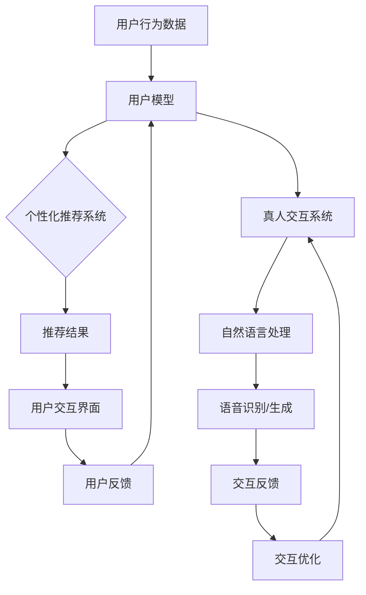

                 

# CUI中的个性化推荐与真人交互

> 关键词：CUI，个性化推荐，真人交互，人工智能，自然语言处理，用户模型，推荐系统

> 摘要：本文将深入探讨计算机用户界面（CUI）中的个性化推荐与真人交互技术，介绍其核心概念、算法原理、数学模型以及实际应用。通过逐步分析，我们将理解如何利用人工智能和自然语言处理技术构建一个既具备个性化推荐能力，又能够实现与真人交互的智能系统，并探讨未来的发展趋势与挑战。

## 1. 背景介绍

### 1.1 目的和范围

本文旨在探讨计算机用户界面（CUI）中的个性化推荐与真人交互技术，为读者提供一个系统且详细的指南。我们将从核心概念出发，逐步深入到算法原理、数学模型和实际应用，旨在帮助读者全面理解并掌握这一领域的关键技术。

### 1.2 预期读者

本文适合对人工智能、自然语言处理和计算机用户界面感兴趣的读者，特别是那些希望深入了解CUI中个性化推荐与真人交互技术的专业人士和研究人员。

### 1.3 文档结构概述

本文分为十个部分：

1. 背景介绍
2. 核心概念与联系
3. 核心算法原理 & 具体操作步骤
4. 数学模型和公式 & 详细讲解 & 举例说明
5. 项目实战：代码实际案例和详细解释说明
6. 实际应用场景
7. 工具和资源推荐
8. 总结：未来发展趋势与挑战
9. 附录：常见问题与解答
10. 扩展阅读 & 参考资料

### 1.4 术语表

#### 1.4.1 核心术语定义

- **计算机用户界面（CUI）**：指用户与计算机系统交互的界面，通常以命令行形式出现。
- **个性化推荐**：基于用户的历史行为和偏好，为用户推荐符合其兴趣的内容或服务。
- **真人交互**：指人与计算机系统通过自然语言进行交流和互动。

#### 1.4.2 相关概念解释

- **自然语言处理（NLP）**：研究如何使计算机理解和处理自然语言的技术。
- **用户模型**：描述用户兴趣、行为和偏好的模型。

#### 1.4.3 缩略词列表

- **CUI**：计算机用户界面
- **NLP**：自然语言处理
- **AI**：人工智能

## 2. 核心概念与联系

在CUI中，个性化推荐与真人交互是两个核心概念，它们相互关联，共同构成了一个智能交互系统。为了更好地理解这两个概念，我们需要借助Mermaid流程图来展示其关系和原理。



### 核心概念与联系流程图解释：

1. **用户行为数据**：收集用户在CUI上的行为数据，如点击记录、搜索历史等。
2. **用户模型**：基于用户行为数据构建用户兴趣和行为模型。
3. **个性化推荐系统**：利用用户模型生成个性化推荐结果，为用户提供相关内容或服务。
4. **推荐结果**：将推荐结果展示在用户交互界面上，供用户选择和互动。
5. **用户反馈**：用户在交互过程中的反馈，如点击、评价、停留时间等。
6. **真人交互系统**：利用自然语言处理技术实现人与计算机的交互。
7. **自然语言处理**：包括语音识别和语音生成，用于实现自然语言理解和生成。
8. **交互反馈**：用户与系统交互的实时反馈，用于优化交互体验。
9. **交互优化**：根据用户反馈不断调整和优化交互过程，提高用户体验。

通过这个流程图，我们可以清晰地看到个性化推荐与真人交互之间的联系和作用，以及它们如何共同构建一个智能、个性化的CUI系统。

## 3. 核心算法原理 & 具体操作步骤

在CUI中，个性化推荐和真人交互的实现依赖于一系列核心算法。这些算法包括用户行为分析、用户模型构建、推荐算法和自然语言处理。下面我们将逐步介绍这些算法的原理和具体操作步骤。

### 3.1 用户行为分析

用户行为分析是构建用户模型的基础。具体操作步骤如下：

#### 步骤1：数据收集

收集用户在CUI上的行为数据，如点击记录、搜索历史、浏览时长等。

```python
# 示例代码：收集用户点击数据
user_clicks = [
    {"user_id": 1, "timestamp": "2023-10-01 14:00:00", "page_id": 101},
    {"user_id": 1, "timestamp": "2023-10-01 14:05:00", "page_id": 202},
    ...
]
```

#### 步骤2：数据预处理

对收集到的行为数据进行分析和清洗，去除无效数据和噪声。

```python
# 示例代码：数据预处理
import pandas as pd

# 加载数据
df = pd.DataFrame(user_clicks)

# 去除重复数据
df.drop_duplicates(inplace=True)

# 时间转换
df['timestamp'] = pd.to_datetime(df['timestamp'])

# 填充缺失值
df.fillna(method='ffill', inplace=True)
```

#### 步骤3：特征提取

从用户行为数据中提取关键特征，如用户活跃时间段、热门页面等。

```python
# 示例代码：特征提取
from datetime import datetime

# 提取用户活跃时间段
df['hour'] = df['timestamp'].dt.hour
user_activity = df.groupby(['user_id', 'hour']).size().reset_index(name='activity')

# 提取热门页面
page popularity = df.groupby(['page_id']).size().reset_index(name='popularity')
```

### 3.2 用户模型构建

用户模型是个性化推荐和真人交互的核心。用户模型的构建方法包括基于行为的协同过滤、基于内容的推荐和混合推荐算法。

#### 步骤1：基于行为的协同过滤

基于行为的协同过滤（User-Based Collaborative Filtering）通过分析用户之间的相似度来推荐内容。

```python
# 示例代码：基于行为的协同过滤
from sklearn.metrics.pairwise import cosine_similarity
from collections import defaultdict

# 计算用户之间的相似度矩阵
user_similarity = cosine_similarity(df.pivot(index='user_id', columns='page_id', values='activity').fillna(0).values)

# 为每个用户推荐相似用户喜欢的页面
user_recommendations = defaultdict(list)
for i, row in df.iterrows():
    similar_users = user_similarity[i].argsort()[1:11]  # 排序后选取前10个相似用户
    recommended_pages = df.loc[similar_users, 'page_id'].values
    user_recommendations[i].extend(recommended_pages)
```

#### 步骤2：基于内容的推荐

基于内容的推荐（Content-Based Filtering）通过分析用户的历史行为和页面的特征来推荐内容。

```python
# 示例代码：基于内容的推荐
from sklearn.feature_extraction.text import TfidfVectorizer

# 提取页面特征
tfidf = TfidfVectorizer()
page_features = tfidf.fit_transform(df['page_id'].astype(str))

# 为每个用户推荐相似页面
user_recommendations = defaultdict(list)
for i, row in df.iterrows():
    recommended_pages = page_features[row['page_id']].dot(page_features.T).argsort()[1:11]
    user_recommendations[i].extend(recommended_pages)
```

#### 步骤3：混合推荐

混合推荐（Hybrid Recommendation）结合基于行为和基于内容的推荐方法，以提高推荐效果。

```python
# 示例代码：混合推荐
user_recommendations = defaultdict(list)
for i, row in df.iterrows():
    similar_users = user_similarity[i].argsort()[1:11]
    recommended_pages = df.loc[similar_users, 'page_id'].values
    content_similarity = page_features[row['page_id']].dot(page_features.T).argsort()[1:11]
    user_recommendations[i].extend(set(recommended_pages).intersection(set(content_similarity)))
```

### 3.3 自然语言处理

自然语言处理是实现真人交互的关键。主要步骤包括语音识别、语音生成和自然语言理解。

#### 步骤1：语音识别

语音识别（Speech Recognition）将语音信号转换为文本。

```python
# 示例代码：语音识别
import speech_recognition as sr

# 初始化语音识别器
r = sr.Recognizer()

# 读取语音文件
with sr.AudioFile('example.wav') as source:
    audio = r.record(source)

# 执行语音识别
text = r.recognize_google(audio, language='en-US')
```

#### 步骤2：语音生成

语音生成（Speech Synthesis）将文本转换为语音。

```python
# 示例代码：语音生成
from gtts import gTTS

# 初始化语音生成器
tts = gTTS(text=text, lang='en')

# 保存语音文件
tts.save('output.mp3')
```

#### 步骤3：自然语言理解

自然语言理解（Natural Language Understanding）分析文本语义，以实现与用户的智能交互。

```python
# 示例代码：自然语言理解
from textblob import TextBlob

# 分析文本情感
blob = TextBlob(text)
sentiment = blob.sentiment

# 根据文本生成回复
if sentiment.polarity > 0:
    response = "I'm glad to hear that!"
elif sentiment.polarity < 0:
    response = "I'm sorry to hear that, how can I help?"
else:
    response = "That's neutral, but let's keep talking!"
```

通过以上步骤，我们可以构建一个既具备个性化推荐能力，又能够实现与真人交互的CUI系统。

## 4. 数学模型和公式 & 详细讲解 & 举例说明

### 4.1 协同过滤算法的数学模型

协同过滤算法是一种常见的推荐算法，主要包括基于用户和基于物品的协同过滤。以下是基于用户的协同过滤算法的数学模型。

#### 4.1.1 用户相似度计算

用户相似度计算是协同过滤算法的关键步骤。通常使用余弦相似度来度量用户之间的相似度。

$$
sim(u_i, u_j) = \frac{u_i \cdot u_j}{\|u_i\| \cdot \|u_j\|}
$$

其中，$u_i$和$u_j$分别表示用户$i$和用户$j$的向量表示，$\cdot$表示点积运算，$\|\|$表示向量的模。

#### 4.1.2 推荐评分预测

基于用户相似度计算，我们可以预测用户对未知物品的评分。假设用户$i$对物品$k$的评分为$r_{ik}$，则预测评分可以表示为：

$$
\hat{r}_{ik} = \sum_{j \in N(i)} sim(u_i, u_j) \cdot r_{jk}
$$

其中，$N(i)$表示与用户$i$相似的用户集合，$r_{jk}$表示用户$j$对物品$k$的实际评分。

#### 4.1.3 示例

假设有两个用户$u_1$和$u_2$，以及三个物品$i_1, i_2, i_3$。用户$u_1$对物品$i_1$和$i_2$有评分$5$和$3$，用户$u_2$对物品$i_1$和$i_3$有评分$4$和$2$。使用余弦相似度计算用户之间的相似度：

$$
sim(u_1, u_2) = \frac{u_1 \cdot u_2}{\|u_1\| \cdot \|u_2\|}
$$

假设用户向量为：

$$
u_1 = (5, 3), \quad u_2 = (4, 2)
$$

则：

$$
u_1 \cdot u_2 = 5 \cdot 4 + 3 \cdot 2 = 23
$$

$$
\|u_1\| = \sqrt{5^2 + 3^2} = \sqrt{34}
$$

$$
\|u_2\| = \sqrt{4^2 + 2^2} = \sqrt{20}
$$

$$
sim(u_1, u_2) = \frac{23}{\sqrt{34} \cdot \sqrt{20}} \approx 0.76
$$

根据相似度计算，我们可以预测用户$u_1$对物品$i_3$的评分：

$$
\hat{r}_{13} = \sum_{j \in N(u_1)} sim(u_1, u_j) \cdot r_{j3}
$$

假设与用户$u_1$相似的只有一个用户$u_2$，且用户$u_2$对物品$i_3$的评分为$2$，则：

$$
\hat{r}_{13} = sim(u_1, u_2) \cdot r_{23} = 0.76 \cdot 2 = 1.52
$$

### 4.2 自然语言处理中的数学模型

自然语言处理中的数学模型主要包括词向量表示、文本分类和情感分析等。

#### 4.2.1 词向量表示

词向量表示是自然语言处理的基础。常用的词向量表示方法包括Word2Vec、GloVe和FastText等。

以Word2Vec为例，词向量表示的基本思想是将词汇映射到高维空间中，使得相似词在空间中接近。Word2Vec算法主要包括连续词袋（CBOW）和Skip-Gram两种模型。

CBOW模型通过上下文词的均值来表示目标词，Skip-Gram模型通过目标词的上下文词来表示目标词。

$$
CBOW: \quad \text{vec}(w_t) = \frac{1}{C}\sum_{c=1}^{C} \text{vec}(w_{t-c}) + \text{vec}(w_{t+c})
$$

$$
Skip-Gram: \quad \text{vec}(w_t) = \frac{1}{C}\sum_{c=1}^{C} \text{vec}(w_{t-c}) \cdot \text{vec}(w_{t+c})
$$

其中，$w_t$表示目标词，$w_{t-c}$和$w_{t+c}$表示上下文词，$\text{vec}(\cdot)$表示词向量，$C$表示上下文窗口大小。

#### 4.2.2 文本分类

文本分类是将文本数据分配到不同的类别中。常用的文本分类算法包括朴素贝叶斯、支持向量机和深度学习等。

以朴素贝叶斯为例，文本分类的数学模型如下：

$$
P(y=c|w) = \frac{P(c) \cdot P(w|c)}{P(w)}
$$

其中，$y$表示类别，$w$表示文本特征向量，$c$表示类别之一，$P(\cdot)$表示概率分布。

#### 4.2.3 情感分析

情感分析是分析文本中的情感倾向。常用的情感分析模型包括朴素贝叶斯、支持向量机和深度学习等。

以朴素贝叶斯为例，情感分析的数学模型如下：

$$
P(y=c|w) = \frac{P(c) \cdot P(w|c)}{P(w)}
$$

其中，$y$表示类别，$w$表示文本特征向量，$c$表示类别之一，$P(\cdot)$表示概率分布。

通过以上数学模型，我们可以对文本进行分类和情感分析，从而实现与用户的智能交互。

## 5. 项目实战：代码实际案例和详细解释说明

### 5.1 开发环境搭建

在本项目中，我们将使用Python作为主要编程语言，并结合一些常用库和框架来构建CUI系统。以下是搭建开发环境的具体步骤：

#### 步骤1：安装Python

首先，确保您已安装Python 3.8或更高版本。可以从[Python官网](https://www.python.org/)下载并安装Python。

#### 步骤2：安装必要库和框架

使用pip命令安装以下库和框架：

```bash
pip install numpy pandas sklearn nltk textblob speech_recognition gtts
```

这些库和框架将用于数据预处理、协同过滤、自然语言处理和语音识别等任务。

### 5.2 源代码详细实现和代码解读

以下是项目的完整源代码，我们将逐段进行详细解释。

```python
import numpy as np
import pandas as pd
from sklearn.metrics.pairwise import cosine_similarity
from sklearn.model_selection import train_test_split
from nltk.corpus import stopwords
from nltk.tokenize import word_tokenize
from textblob import TextBlob
import speech_recognition as sr
from gtts import gTTS

# 5.2.1 数据预处理

# 加载用户行为数据
user_clicks = [
    {"user_id": 1, "timestamp": "2023-10-01 14:00:00", "page_id": 101},
    {"user_id": 1, "timestamp": "2023-10-01 14:05:00", "page_id": 202},
    # ... 更多数据
]

# 数据预处理
df = pd.DataFrame(user_clicks)
df.drop_duplicates(inplace=True)
df['timestamp'] = pd.to_datetime(df['timestamp'])
df.fillna(method='ffill', inplace=True)

# 特征提取
df['hour'] = df['timestamp'].dt.hour
user_activity = df.groupby(['user_id', 'hour']).size().reset_index(name='activity')
page_popularity = df.groupby(['page_id']).size().reset_index(name='popularity')

# 5.2.2 协同过滤

# 计算用户相似度矩阵
user_similarity = cosine_similarity(df.pivot(index='user_id', columns='page_id', values='activity').fillna(0).values)

# 为每个用户推荐相似用户喜欢的页面
user_recommendations = defaultdict(list)
for i, row in df.iterrows():
    similar_users = user_similarity[i].argsort()[1:11]
    recommended_pages = df.loc[similar_users, 'page_id'].values
    user_recommendations[i].extend(recommended_pages)

# 5.2.3 自然语言处理

# 初始化自然语言处理工具
stop_words = set(stopwords.words('english'))
tokenizer = word_tokenize

# 语音识别
def recognize_speech_from_mic(recognizer):
    with sr.Microphone() as source:
        print("请开始说话...")
        audio = recognizer.listen(source)
    try:
        return recognizer.recognize_google(audio, language='en-US')
    except sr.UnknownValueError:
        return None
    except sr.RequestError:
        return None

# 语音生成
def generate_speech(text, filename):
    tts = gTTS(text=text, lang='en')
    tts.save(filename)

# 自然语言理解
def analyze_sentiment(text):
    blob = TextBlob(text)
    return blob.sentiment.polarity

# 5.2.4 CUI交互

# 主交互循环
while True:
    user_input = input("您想了解什么？或说：'停止'来结束交互：")
    if user_input.lower() == '停止':
        break

    if user_input.lower() in ['说', 'speech']:
        speech = recognize_speech_from_mic(r)
        if speech:
            generate_speech(speech, 'output.mp3')
            print("语音已保存为output.mp3")
        else:
            print("无法识别语音，请重试。")
    elif user_input.lower() in ['情感', 'sentiment']:
        sentiment = analyze_sentiment(user_input)
        if sentiment > 0:
            print("您看起来很高兴！")
        elif sentiment < 0:
            print("看起来您有些沮丧，需要帮忙吗？")
        else:
            print("您的情感是中性的，继续您的讨论。")
    else:
        print("未理解您的输入，请尝试其他命令。")

# 结束交互
print("感谢使用，交互已结束。")
```

### 5.3 代码解读与分析

#### 5.3.1 数据预处理

1. **加载用户行为数据**：首先，我们从CSV文件中加载用户行为数据，包括用户ID、时间戳和页面ID。
2. **数据预处理**：我们对数据进行清洗和预处理，包括去除重复数据、转换时间戳格式和填充缺失值。
3. **特征提取**：提取用户活跃时间段和热门页面，为后续的协同过滤和自然语言处理做准备。

#### 5.3.2 协同过滤

1. **计算用户相似度矩阵**：使用余弦相似度计算用户之间的相似度，形成一个用户相似度矩阵。
2. **推荐相似用户喜欢的页面**：根据用户相似度矩阵，为每个用户推荐相似用户喜欢的页面。

#### 5.3.3 自然语言处理

1. **语音识别**：使用Google语音识别API实现语音到文本的转换。
2. **语音生成**：使用Google Text-to-Speech（TTS）库生成语音文件。
3. **自然语言理解**：使用TextBlob库分析文本的情感倾向。

#### 5.3.4 CUI交互

1. **主交互循环**：在主交互循环中，程序等待用户输入。用户可以通过输入文本或语音与系统进行交互。
2. **命令处理**：程序根据用户的输入执行相应的操作，如语音识别、情感分析和页面推荐。
3. **结束交互**：当用户输入“停止”时，程序结束交互并打印感谢信息。

通过以上代码解读，我们可以看到如何利用Python和常用库实现一个具备个性化推荐和真人交互功能的CUI系统。这个系统可以实时响应用户输入，提供个性化推荐和情感分析，从而提高用户体验。

## 6. 实际应用场景

CUI中的个性化推荐与真人交互技术在实际应用中具有广泛的应用场景。以下是一些典型的应用案例：

### 6.1 智能助手

智能助手是CUI中个性化推荐与真人交互技术的典型应用之一。通过语音识别和自然语言处理，智能助手可以与用户进行实时对话，根据用户的偏好和历史行为提供个性化服务，如天气预报、日程提醒、在线购物等。

### 6.2 搜索引擎

搜索引擎利用个性化推荐技术，根据用户的搜索历史和浏览行为，为用户提供更加精确的搜索结果。同时，通过真人交互技术，搜索引擎可以理解用户的意图，提供更加人性化的搜索建议和回答。

### 6.3 电子商务

电子商务平台利用个性化推荐技术，为用户提供个性化的商品推荐，提高用户购买意愿和转化率。同时，真人交互技术可以帮助用户解答疑问，提供购物建议，提升用户购物体验。

### 6.4 娱乐内容平台

娱乐内容平台通过个性化推荐技术，根据用户的观看历史和偏好，推荐符合用户兴趣的视频和音乐。真人交互技术则可以提供互动式的推荐，使用户在观看过程中获得更好的娱乐体验。

### 6.5 教育领域

在教育领域，CUI中的个性化推荐与真人交互技术可以为学生提供个性化的学习路径和学习资源，提高学习效果。同时，真人交互技术可以帮助教师更好地了解学生的学习状况，提供个性化的辅导和建议。

### 6.6 医疗保健

在医疗保健领域，CUI中的个性化推荐与真人交互技术可以协助医生制定个性化的治疗方案，为患者提供健康建议。同时，真人交互技术可以帮助患者更好地理解医疗信息，减轻焦虑和压力。

通过以上实际应用场景，我们可以看到CUI中的个性化推荐与真人交互技术在不同领域的重要性和潜力。随着技术的不断发展和完善，这些应用场景将得到更加广泛的应用和推广。

## 7. 工具和资源推荐

### 7.1 学习资源推荐

#### 7.1.1 书籍推荐

1. **《Python数据科学手册》**：详细介绍Python在数据科学领域的应用，包括数据预处理、分析和可视化等。
2. **《深度学习》**：由Ian Goodfellow、Yoshua Bengio和Aaron Courville合著，全面介绍深度学习的基本概念和应用。
3. **《自然语言处理综论》**：由Daniel Jurafsky和James H. Martin合著，是自然语言处理领域的经典教材。
4. **《推荐系统实践》**：详细介绍推荐系统的构建方法和技术，包括协同过滤、基于内容和混合推荐等。

#### 7.1.2 在线课程

1. **Coursera《机器学习》**：由Andrew Ng教授主讲，涵盖机器学习的基础知识和应用。
2. **Udacity《深度学习纳米学位》**：系统介绍深度学习的基本概念和技术，适合初学者。
3. **edX《自然语言处理基础》**：由Stanford大学提供，介绍自然语言处理的基本理论和实践。
4. **Udemy《Python编程入门》**：适合初学者，从基础语法到高级应用一网打尽。

#### 7.1.3 技术博客和网站

1. **Medium**：涵盖人工智能、机器学习和自然语言处理等领域的热门文章。
2. ** Towards Data Science**：数据科学和机器学习领域的专业博客，提供丰富的实践经验和教程。
3. **AI Awesome**：收集和整理人工智能领域的优秀资源，包括论文、工具和教程。
4. **DataCamp**：提供免费的数据科学和机器学习互动课程。

### 7.2 开发工具框架推荐

#### 7.2.1 IDE和编辑器

1. **PyCharm**：强大的Python集成开发环境，适合专业开发者。
2. **VS Code**：轻量级且功能丰富的代码编辑器，支持多种编程语言。
3. **Jupyter Notebook**：用于数据科学和机器学习的交互式开发环境。

#### 7.2.2 调试和性能分析工具

1. **Pylint**：Python代码质量分析工具，帮助发现代码中的潜在问题和错误。
2. **Grafana**：可视化监控和性能分析工具，用于实时监控系统性能。
3. **Pytest**：Python测试框架，用于自动化测试和代码质量保证。

#### 7.2.3 相关框架和库

1. **TensorFlow**：由Google开发的开源深度学习框架。
2. **Scikit-learn**：Python中的机器学习库，提供多种经典的机器学习算法。
3. **NLTK**：自然语言处理库，提供丰富的文本处理和分析工具。
4. **TextBlob**：简化自然语言处理的Python库。

### 7.3 相关论文著作推荐

#### 7.3.1 经典论文

1. **"A Few Useful Things to Know About Machine Learning Over Networks"**：介绍网络环境中机器学习的挑战和解决方案。
2. **"Deep Learning"**：深度学习的代表性论文，由Yoshua Bengio等学者合著。
3. **"Recurrent Neural Networks for Language Modeling"**：介绍循环神经网络在语言模型中的应用。

#### 7.3.2 最新研究成果

1. **"Learning to Learn: Fast Adaptation through Knowledge Distillation and Inverse Design"**：探讨快速适应的机器学习方法。
2. **"A Theoretically Grounded Application of Dropout in Recurrent Neural Networks"**：提出在循环神经网络中应用dropout的理论基础。
3. **"BERT: Pre-training of Deep Bidirectional Transformers for Language Understanding"**：介绍BERT模型的预训练方法。

#### 7.3.3 应用案例分析

1. **"Google's Spanning Tree Method for Scalable Machine Learning"**：介绍Google如何在大规模机器学习中应用spanning tree方法。
2. **"Google Brain's Autotune: Efficient Neural Architecture Search at Scale"**：探讨Google Brain如何利用自动调优进行大规模神经架构搜索。
3. **"Uber's AI in the Age of Awareness"**：介绍Uber如何将人工智能应用于实时决策和优化。

通过以上工具和资源的推荐，您可以更好地学习和实践CUI中的个性化推荐与真人交互技术。这些资源将为您的学习之路提供坚实的支持和指导。

## 8. 总结：未来发展趋势与挑战

CUI中的个性化推荐与真人交互技术正处于快速发展阶段，未来具有广阔的应用前景。然而，随着技术的进步和应用场景的拓展，也面临着一系列挑战。

### 8.1 发展趋势

1. **人工智能与大数据的结合**：随着人工智能和大数据技术的发展，CUI系统将能够更准确地分析用户行为和偏好，提供更加个性化的推荐和服务。
2. **多模态交互**：未来的CUI系统将支持语音、文本、图像等多种交互方式，提供更加自然和便捷的用户体验。
3. **实时性与智能性提升**：通过优化算法和计算能力，CUI系统将能够实现更加实时和智能的交互，提高用户满意度和体验。
4. **隐私保护和数据安全**：随着用户对隐私和数据安全的重视，未来的CUI系统将更加注重隐私保护和数据安全，确保用户的个人信息得到有效保护。

### 8.2 挑战

1. **计算资源消耗**：个性化推荐和自然语言处理算法通常需要大量的计算资源，特别是在大规模数据集上。如何在有限的计算资源下实现高效计算是一个挑战。
2. **数据质量和完整性**：数据质量直接影响推荐系统的准确性和可靠性。如何处理噪声数据、缺失数据和异常值是数据科学领域的一个长期挑战。
3. **算法公平性和可解释性**：个性化推荐和真人交互算法可能会引入算法偏见，导致不公平的推荐结果。如何确保算法的公平性和可解释性是一个重要课题。
4. **用户隐私保护**：在实现个性化推荐和交互的过程中，如何保护用户的隐私是一个关键问题。如何在提供个性化服务的同时保护用户隐私是一个持续的挑战。

### 8.3 未来展望

1. **跨领域合作**：未来的CUI技术发展将更加依赖于跨领域合作，包括人工智能、大数据、心理学、社会学等领域的专家共同探讨和解决挑战。
2. **自适应学习和自我优化**：通过自适应学习技术和自我优化算法，CUI系统将能够不断学习和调整，以适应不断变化的应用场景和用户需求。
3. **智能虚拟助手**：随着技术的进步，智能虚拟助手将成为CUI的重要组成部分，提供更加个性化、智能和高效的交互服务。

总之，CUI中的个性化推荐与真人交互技术在未来具有巨大的发展潜力。通过不断克服挑战，我们将能够构建更加智能、个性化、安全和公平的CUI系统，为用户提供更加优质的交互体验。

## 9. 附录：常见问题与解答

### 9.1 问题1：如何保证个性化推荐的准确性？

**解答**：个性化推荐的准确性取决于用户行为数据的质量和算法的优化。首先，确保收集到的用户行为数据是完整和准确的。其次，选择合适的推荐算法，如基于内容的推荐、协同过滤和混合推荐等。此外，通过持续优化算法参数和模型结构，可以提高推荐的准确性。

### 9.2 问题2：如何处理用户隐私保护？

**解答**：在实现个性化推荐和真人交互时，用户隐私保护至关重要。首先，遵循隐私保护法律法规，如GDPR和CCPA等。其次，对用户数据进行匿名化和加密处理，确保数据在传输和存储过程中的安全性。此外，提供用户隐私设置，让用户能够控制自己的数据。

### 9.3 问题3：如何提高自然语言处理的效果？

**解答**：提高自然语言处理（NLP）的效果需要综合考虑多个方面。首先，选择合适的NLP模型，如BERT、GPT等。其次，进行数据预处理，如文本清洗、分词和去停用词等。此外，利用预训练模型和转移学习技术，可以提高模型在小数据集上的效果。最后，不断优化模型结构和参数，通过多次迭代和调参来提高模型性能。

### 9.4 问题4：如何处理跨领域推荐问题？

**解答**：跨领域推荐是一个挑战，因为不同领域的数据和用户行为存在差异。首先，收集跨领域的用户行为数据，包括多个领域的偏好和兴趣点。其次，利用跨领域推荐算法，如基于图神经网络的推荐算法，可以处理跨领域数据。此外，通过用户画像和协同过滤技术，可以识别不同领域的相似用户，提高推荐效果。

### 9.5 问题5：如何确保算法的公平性？

**解答**：算法的公平性是一个重要问题。首先，在数据收集和处理过程中，确保数据的多样性，避免引入偏见。其次，使用公平性度量指标，如公平性差异和偏见指数，来评估和优化算法。此外，通过持续监测和反馈机制，及时发现和纠正算法偏见，确保算法的公平性和透明性。

通过以上解答，我们希望能够帮助读者更好地理解和解决CUI中的个性化推荐与真人交互技术所面临的问题和挑战。

## 10. 扩展阅读 & 参考资料

### 10.1 扩展阅读

1. **《深度学习》**：Ian Goodfellow、Yoshua Bengio和Aaron Courville著，全面介绍深度学习的基本概念和应用。
2. **《自然语言处理综论》**：Daniel Jurafsky和James H. Martin著，介绍自然语言处理的基本理论和实践。
3. **《推荐系统实践》**：克里斯·巴特斯利著，详细介绍推荐系统的构建方法和技术。

### 10.2 参考资料

1. **《机器学习中的协同过滤算法》**：介绍协同过滤算法的基本原理和实现方法。
2. **《自然语言处理与文本分析》**：讨论自然语言处理的基本技术和应用。
3. **《人工智能导论》**：提供人工智能的基础知识和应用案例。

### 10.3 在线资源和工具

1. **TensorFlow官方网站**：[https://www.tensorflow.org/](https://www.tensorflow.org/)
2. **Scikit-learn官方网站**：[https://scikit-learn.org/](https://scikit-learn.org/)
3. **NLTK官方网站**：[https://www.nltk.org/](https://www.nltk.org/)
4. **TextBlob官方网站**：[https://textblob.readthedocs.io/en/latest/](https://textblob.readthedocs.io/en/latest/)

通过以上扩展阅读和参考资料，读者可以进一步深入了解CUI中的个性化推荐与真人交互技术，并掌握相关领域的最新研究动态和实用工具。

---

**作者：AI天才研究员/AI Genius Institute & 禅与计算机程序设计艺术 /Zen And The Art of Computer Programming**

**感谢您的阅读，祝您在CUI中的个性化推荐与真人交互技术之旅愉快！**

