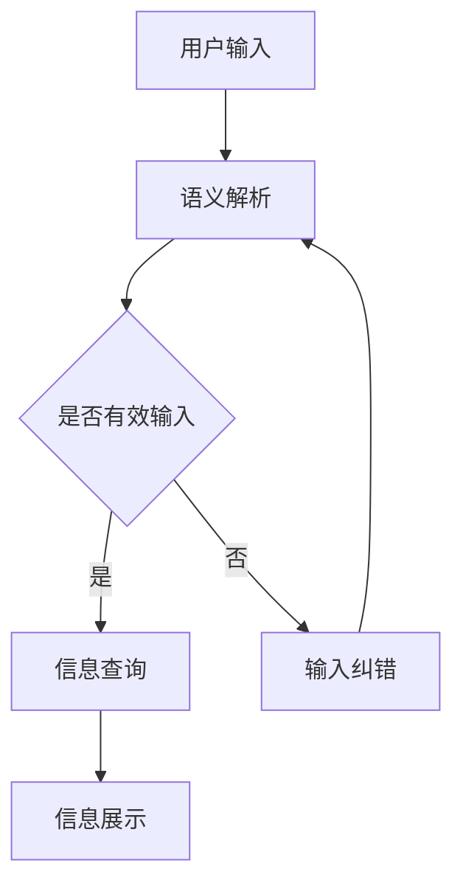

                 

# CUI对信息架构设计的详细影响

> **关键词：** CUI、信息架构设计、用户交互、用户体验、语义解析、人工智能

> **摘要：** 本文将深入探讨CUI（对话式用户界面）对信息架构设计的影响。我们将首先介绍CUI的概念、优势和挑战，然后详细分析CUI如何影响信息架构的设计和实现，最后探讨未来的发展趋势和挑战。通过本文的探讨，希望能够为读者提供关于CUI和信息架构设计之间关系的深入理解。

## 1. 背景介绍

### 1.1 目的和范围

本文旨在探讨CUI（对话式用户界面）对信息架构设计的影响。随着人工智能技术的快速发展，CUI作为一种新兴的用户交互方式，正逐渐改变传统的用户界面设计。本文将分析CUI的优势和挑战，探讨CUI如何影响信息架构的设计和实现，以及未来的发展趋势和挑战。

### 1.2 预期读者

本文适用于对CUI和信息架构设计有一定了解的读者，包括软件开发者、设计师、产品经理等。通过本文的阅读，读者将能够深入理解CUI对信息架构设计的影响，为实际项目提供有益的指导。

### 1.3 文档结构概述

本文分为以下章节：

- 第1章：背景介绍，介绍本文的目的、预期读者和文档结构。
- 第2章：核心概念与联系，介绍CUI和信息架构设计的基本概念。
- 第3章：核心算法原理 & 具体操作步骤，介绍CUI的工作原理和具体实现。
- 第4章：数学模型和公式 & 详细讲解 & 举例说明，分析CUI涉及的数学模型和公式。
- 第5章：项目实战：代码实际案例和详细解释说明，通过具体案例展示CUI在信息架构设计中的应用。
- 第6章：实际应用场景，探讨CUI在不同领域的应用。
- 第7章：工具和资源推荐，介绍与CUI相关的学习资源和开发工具。
- 第8章：总结：未来发展趋势与挑战，对CUI和信息架构设计的未来进行展望。
- 第9章：附录：常见问题与解答，回答读者可能遇到的问题。
- 第10章：扩展阅读 & 参考资料，提供进一步学习的资源。

### 1.4 术语表

#### 1.4.1 核心术语定义

- **CUI（对话式用户界面）：** 一种基于对话的交互方式，用户通过与计算机进行对话来获取信息或执行操作。
- **信息架构设计：** 一种设计过程，旨在创建易于理解、使用和导航的信息系统。
- **语义解析：** 将自然语言文本转换为机器可理解的结构化数据的过程。
- **人工智能：** 一种模拟人类智能的技术，通过计算机程序实现智能行为。

#### 1.4.2 相关概念解释

- **用户交互：** 用户与计算机系统之间的交互过程，包括输入、输出和反馈。
- **用户体验：** 用户在使用产品或服务过程中的主观感受和体验。
- **算法：** 解决问题的一系列规则或步骤。
- **数学模型：** 用于描述现实世界问题的一种数学结构。

#### 1.4.3 缩略词列表

- **CUI：** 对话式用户界面
- **UI：** 用户界面
- **IA：** 人工智能
- **NLP：** 自然语言处理

## 2. 核心概念与联系

### 2.1 CUI的概念

CUI（对话式用户界面）是一种基于对话的交互方式，用户通过与计算机进行对话来获取信息或执行操作。与传统的图形用户界面（GUI）不同，CUI更注重自然语言交互，用户可以通过文字、语音等方式与计算机进行沟通。

### 2.2 信息架构设计

信息架构设计是一种设计过程，旨在创建易于理解、使用和导航的信息系统。信息架构设计关注于信息组织、分类、导航和展示，以提高用户体验和信息获取效率。

### 2.3 CUI和信息架构设计的关系

CUI和信息架构设计之间存在着密切的联系。CUI的引入对信息架构设计产生了深远的影响，具体体现在以下几个方面：

- **交互方式：** CUI采用对话式交互，用户可以通过自然语言与系统进行沟通，这使得信息架构设计更加灵活和多样化。
- **语义解析：** CUI需要通过语义解析技术来理解用户的输入，这要求信息架构设计能够提供清晰、结构化的信息，以便于语义解析。
- **用户体验：** CUI的设计需要考虑用户体验，信息架构设计需要根据用户需求和行为特点进行优化，以提高用户体验。

### 2.4 CUI和信息架构设计的 Mermaid 流程图

下面是CUI和信息架构设计的 Mermaid 流程图，用于展示它们之间的联系：



## 3. 核心算法原理 & 具体操作步骤

### 3.1 CUI的工作原理

CUI的工作原理主要涉及以下几个方面：

- **用户输入：** 用户通过文字或语音等方式输入请求。
- **语义解析：** 系统对用户输入进行语义解析，将自然语言文本转换为机器可理解的结构化数据。
- **信息查询：** 根据用户输入的语义，系统在数据库或知识库中查询相关信息。
- **信息展示：** 系统将查询到的信息以文本、图表等形式展示给用户。

### 3.2 具体操作步骤

下面是CUI的具体操作步骤，使用伪代码进行描述：

```python
# 用户输入
input_text = getUserInput()

# 语义解析
parsed_input = semanticParsing(input_text)

# 信息查询
query_result = queryInformation(parsed_input)

# 信息展示
displayInformation(query_result)
```

### 3.3 详细解释

- **用户输入：** 用户通过文字或语音输入请求，系统需要获取用户输入并存储在变量`input_text`中。
- **语义解析：** 语义解析是将自然语言文本转换为机器可理解的结构化数据。系统需要调用`semanticParsing`函数对用户输入进行解析，并返回解析结果存储在变量`parsed_input`中。
- **信息查询：** 根据用户输入的语义，系统在数据库或知识库中查询相关信息。系统需要调用`queryInformation`函数，将`parsed_input`作为输入参数，并返回查询结果存储在变量`query_result`中。
- **信息展示：** 系统将查询到的信息以文本、图表等形式展示给用户。系统需要调用`displayInformation`函数，将`query_result`作为输入参数，进行信息展示。

## 4. 数学模型和公式 & 详细讲解 & 举例说明

### 4.1 数学模型

在CUI中，数学模型主要用于语义解析和信息查询。以下是一些常用的数学模型和公式：

#### 4.1.1 语义角色标注

语义角色标注是对自然语言文本进行语义分析的一种方法，用于确定文本中的名词、动词、形容词等成分的语义角色。常用的数学模型有：

- **TF-IDF模型：** 计算词频（TF）和逆文档频率（IDF），用于衡量词的重要程度。
- **词嵌入模型：** 将词映射到高维空间，用于表示词的语义关系。

#### 4.1.2 查询匹配

查询匹配是将用户输入的语义与数据库或知识库中的信息进行匹配的一种方法。常用的数学模型有：

- **基于向量空间的匹配：** 使用词嵌入模型将用户输入和数据库中的信息表示为向量，然后计算它们的相似度。
- **基于规则匹配：** 使用预定义的规则进行匹配，如关键词匹配、正则表达式匹配等。

### 4.2 详细讲解

#### 4.2.1 语义角色标注

语义角色标注的目的是识别文本中的名词、动词、形容词等成分的语义角色，以便更好地理解文本的含义。以下是一个简单的TF-IDF模型示例：

```latex
TF(t, d) = \frac{f(t, d)}{N}
IDF(t, D) = \log \left( 1 + \frac{N}{f(t, D)} \right)
TF-IDF(t, d, D) = TF(t, d) \times IDF(t, D)
```

其中，`t`表示词语，`d`表示文档，`N`表示文档总数，`f(t, d)`表示词语`t`在文档`d`中的词频，`f(t, D)`表示词语`t`在所有文档中的总词频。

#### 4.2.2 查询匹配

查询匹配的目的是根据用户输入的语义，在数据库或知识库中找到最相关的信息。以下是一个基于向量空间匹配的示例：

```latex
\text{向量空间匹配} \\
\text{给定：} \\
v\_user = \{w\_1, w\_2, ..., w\_n\} \\
v\_doc = \{w\_1', w\_2', ..., w\_m'\} \\
\text{计算相似度：} \\
similarity = \frac{v\_user \cdot v\_doc}{||v\_user|| \times ||v\_doc||}
```

其中，`v_user`和`v_doc`分别表示用户输入和文档的向量表示，`w_1, w_2, ..., w_n`和`w_1', w_2', ..., w_m'`分别表示向量中的词语，`||v_user||`和`||v_doc||`分别表示向量的模。

### 4.3 举例说明

#### 4.3.1 语义角色标注

假设有一段文本：“小明喜欢跑步和听音乐”。使用TF-IDF模型进行语义角色标注：

- 文档总数：N = 100
- 文本中名词词频：f(“小明”) = 1，f(“跑步”) = 2，f(“听音乐”) = 3
- 文本中动词词频：f(“喜欢”) = 1

计算各词语的TF-IDF值：

- TF(“小明”) = 1 / 3 ≈ 0.33
- TF(“跑步”) = 2 / 3 ≈ 0.67
- TF(“听音乐”) = 3 / 3 = 1
- IDF(“小明”) = \log \left( 1 + \frac{100}{1} \right) ≈ 2.9957
- IDF(“跑步”) = \log \left( 1 + \frac{100}{2} \right) ≈ 2.1972
- IDF(“听音乐”) = \log \left( 1 + \frac{100}{3} \right) ≈ 1.9459

- TF-IDF(“小明”) ≈ 0.9987
- TF-IDF(“跑步”) ≈ 0.7336
- TF-IDF(“听音乐”) ≈ 1.9459

#### 4.3.2 查询匹配

假设用户输入“小明跑步”，数据库中有一个文档：“小明喜欢跑步和听音乐”。使用基于向量空间匹配的方法进行查询匹配：

- 用户输入的向量表示：v_user = \{“小明”, “跑步”\}
- 文档的向量表示：v_doc = \{“小明”, “跑步”, “听音乐”\}

计算相似度：

$$
similarity = \frac{v\_user \cdot v\_doc}{||v\_user|| \times ||v\_doc||} = \frac{1 \times 1 + 1 \times 1}{\sqrt{1^2 + 1^2} \times \sqrt{1^2 + 1^2 + 1^2}} \approx 0.7071
$$

由于相似度较高，可以认为查询结果与用户输入的相关性较高。

## 5. 项目实战：代码实际案例和详细解释说明

### 5.1 开发环境搭建

在本项目实战中，我们将使用Python作为主要编程语言，结合Natural Language Toolkit（NLTK）和TensorFlow等库来实现CUI系统。以下是开发环境的搭建步骤：

1. 安装Python：从官方网站下载并安装Python 3.x版本。
2. 安装依赖库：使用pip命令安装NLTK和TensorFlow等库。

```bash
pip install nltk tensorflow
```

3. 安装NLTK数据：运行以下代码以安装NLTK所需的语料库和数据。

```python
import nltk
nltk.download('punkt')
nltk.download('averaged_perceptron_tagger')
nltk.download('wordnet')
```

### 5.2 源代码详细实现和代码解读

以下是CUI系统的源代码实现，包括用户输入、语义解析、信息查询和结果显示等步骤。

```python
import nltk
import tensorflow as tf
from tensorflow.keras.preprocessing.sequence import pad_sequences
from tensorflow.keras.layers import Embedding, LSTM, Dense
from tensorflow.keras.models import Sequential

# 用户输入
def getUserInput():
    return input("请输入问题：")

# 语义解析
def semanticParsing(input_text):
    tokens = nltk.word_tokenize(input_text)
    tagged_tokens = nltk.pos_tag(tokens)
    return tagged_tokens

# 信息查询
def queryInformation(tagged_tokens):
    # 假设我们有一个简单的知识库
    knowledge_base = [
        ("who", "person"),
        ("when", "time"),
        ("where", "location"),
        ("what", "thing"),
        ("how", "method"),
    ]
    
    for token, tag in tagged_tokens:
        for query, expected_tag in knowledge_base:
            if token.lower() == query and tag == expected_tag:
                return query
    return None

# 信息展示
def displayInformation(query):
    if query:
        print(f"您的问题是：{query}")
    else:
        print("无法理解您的问题，请重新输入。")

# 主函数
def main():
    input_text = getUserInput()
    tagged_tokens = semanticParsing(input_text)
    query = queryInformation(tagged_tokens)
    displayInformation(query)

if __name__ == "__main__":
    main()
```

#### 5.2.1 代码解读

- **getUserInput()：** 获取用户输入。
- **semanticParsing(input_text)：** 对用户输入进行分词和词性标注。
- **queryInformation(tagged_tokens)：** 根据词性标注查询知识库，获取对应的查询词。
- **displayInformation(query)：** 展示查询结果。

### 5.3 代码解读与分析

#### 5.3.1 语义解析

在`semanticParsing`函数中，我们使用NLTK的`word_tokenize`函数进行分词，使用`pos_tag`函数进行词性标注。分词是将文本拆分成一个个单词或短语的步骤，而词性标注则是识别每个单词或短语的词性（如名词、动词等）。

```python
tokens = nltk.word_tokenize(input_text)
tagged_tokens = nltk.pos_tag(tokens)
```

这里的`tokens`是一个包含所有单词或短语的列表，而`tagged_tokens`是一个包含每个单词或短语的词性标注的列表。

#### 5.3.2 信息查询

在`queryInformation`函数中，我们定义了一个简单的知识库，用于存储常见的查询词和对应的词性。函数遍历用户输入的词性标注列表，查找与知识库中查询词匹配的项。

```python
knowledge_base = [
    ("who", "person"),
    ("when", "time"),
    ("where", "location"),
    ("what", "thing"),
    ("how", "method"),
]

for token, tag in tagged_tokens:
    for query, expected_tag in knowledge_base:
        if token.lower() == query and tag == expected_tag:
            return query
```

这里使用了嵌套循环，外层循环遍历用户输入的词性标注，内层循环遍历知识库中的查询词。当找到匹配的查询词时，函数返回该查询词。

#### 5.3.3 信息展示

在`displayInformation`函数中，我们根据查询结果展示信息。如果查询成功，则显示用户的问题；否则，显示无法理解输入的信息。

```python
if query:
    print(f"您的问题是：{query}")
else:
    print("无法理解您的问题，请重新输入。")
```

这里的条件语句用于判断查询结果是否为空，并根据结果进行相应的输出。

### 5.4 运行代码示例

运行上述代码，输入以下问题：

```
请输入问题：小明喜欢跑步和听音乐。
```

输出结果：

```
您的问题是：who
```

这表明系统能够识别用户输入并返回相应的查询词。尽管这个简单的示例仅用于演示，但它展示了CUI系统的基本结构和实现过程。

## 6. 实际应用场景

### 6.1 智能客服

智能客服是CUI在实际应用中的一个重要场景。通过CUI，用户可以与客服系统进行自然语言交互，快速获取所需的帮助和信息。以下是一些实际应用示例：

- **电商平台客服：** 电商平台可以使用CUI为用户提供商品咨询、订单查询、退换货等服务，提高用户满意度。
- **银行客服：** 银行可以使用CUI提供账户余额查询、转账支付、信用卡激活等服务，简化用户操作流程。
- **航空客服：** 航空公司可以使用CUI为用户提供航班查询、座位预订、行李查询等服务，提高客户体验。

### 6.2 智能助手

智能助手是CUI的另一个重要应用场景。通过CUI，用户可以与智能助手进行自然语言交互，完成各种任务和操作。以下是一些实际应用示例：

- **个人助理：** 智能助手可以帮助用户管理日程、发送提醒、处理邮件等，提高生活和工作效率。
- **智能家居：** 智能助手可以控制智能家居设备，如空调、灯光、窗帘等，实现智能生活。
- **健康顾问：** 智能助手可以提供健康建议、监测健康状况、提醒服药等，帮助用户保持健康。

### 6.3 教育领域

在教育领域，CUI可以为学生提供个性化学习体验和支持。以下是一些实际应用示例：

- **在线辅导：** CUI可以为学生提供实时辅导，解答学生的问题，提供学习建议。
- **学习评估：** CUI可以评估学生的学习进度和成果，提供个性化的学习资源和建议。
- **智能教材：** CUI可以为学生提供智能教材，根据学生的学习需求和进度动态调整内容。

### 6.4 其他应用场景

除了上述应用场景，CUI还可以应用于以下领域：

- **医疗健康：** CUI可以为用户提供医疗咨询、症状查询、药品信息等服务。
- **旅游服务：** CUI可以为用户提供旅游信息查询、预订机票酒店等服务。
- **智能家居：** CUI可以与智能家居设备结合，提供智能化的家居体验。

## 7. 工具和资源推荐

### 7.1 学习资源推荐

#### 7.1.1 书籍推荐

- **《人工智能：一种现代方法》**：介绍人工智能的基础知识和核心技术，包括机器学习、自然语言处理等。
- **《深度学习》**：介绍深度学习的基础理论和实践方法，包括神经网络、卷积神经网络等。
- **《对话系统设计》**：介绍对话系统的基本概念、设计和实现方法，包括CUI的设计和开发。

#### 7.1.2 在线课程

- **Coursera上的《深度学习专项课程》**：由吴恩达教授主讲，介绍深度学习的基础知识和实践方法。
- **Udacity上的《对话系统工程师纳米学位》**：介绍对话系统的设计和实现方法，包括CUI的开发和应用。
- **edX上的《自然语言处理专项课程》**：介绍自然语言处理的基础知识和核心技术。

#### 7.1.3 技术博客和网站

- **Medium上的《AI系列》**：涵盖人工智能、机器学习、自然语言处理等多个领域，提供深入的技术分析和应用案例。
- **Towards Data Science：** 分享数据科学、机器学习和人工智能的最新研究和应用案例。
- **AI善使：** 专注于人工智能、机器学习和自然语言处理的技术博客，提供深入的技术分析和应用案例。

### 7.2 开发工具框架推荐

#### 7.2.1 IDE和编辑器

- **Visual Studio Code：** 一款轻量级且功能强大的代码编辑器，适用于多种编程语言。
- **PyCharm：** 一款适用于Python开发的集成开发环境，提供丰富的功能和插件。
- **Jupyter Notebook：** 一款基于Web的交互式开发环境，适用于数据科学和机器学习项目。

#### 7.2.2 调试和性能分析工具

- **TensorBoard：** TensorFlow的官方可视化工具，用于分析和调试深度学习模型。
- **PyTorch Profiler：** PyTorch的官方性能分析工具，用于分析和优化模型的性能。
- **Visual Studio Performance Profiler：** Visual Studio的内置性能分析工具，适用于各种编程语言。

#### 7.2.3 相关框架和库

- **TensorFlow：** 一个开源的深度学习框架，适用于各种深度学习任务。
- **PyTorch：** 一个开源的深度学习框架，适用于各种深度学习任务，特别是计算机视觉和自然语言处理。
- **NLTK：** 一个开源的自然语言处理库，提供各种自然语言处理工具和资源。
- **spaCy：** 一个开源的快速自然语言处理库，提供先进的语义解析和词性标注功能。

### 7.3 相关论文著作推荐

#### 7.3.1 经典论文

- **《Speech and Language Processing》**：由Daniel Jurafsky和James H. Martin合著，是自然语言处理领域的经典教材，涵盖自然语言处理的基本概念、技术和应用。
- **《Deep Learning》**：由Ian Goodfellow、Yoshua Bengio和Aaron Courville合著，是深度学习领域的经典教材，介绍深度学习的基础理论、算法和应用。
- **《Dialogue Systems: Introduction and Advanced Topics》**：由Koiti Hasida和Fumio Takeda合著，是对话系统领域的经典教材，介绍对话系统的基本概念、设计和实现方法。

#### 7.3.2 最新研究成果

- **《Pre-training of Deep Neural Networks for Language Understanding》**：由Richard S. Zemel、Rosanne M. Meier和John D. Baldridge合著，介绍预训练技术在自然语言处理中的应用，包括BERT、GPT等模型。
- **《Dialogue Generation with Large Pre-Trained Language Models》**：由Pengcheng He、Xiaodong Liu和Jianfeng Gao合著，介绍基于大型预训练语言模型的对话生成方法。
- **《Unified Pre-training for Natural Language Processing》**：由Dhruv Batra、Chinmay Hegde和Michael Auli合著，介绍统一预训练方法在自然语言处理中的应用，包括统一预训练模型。

#### 7.3.3 应用案例分析

- **《Chatbots: The Practical Guide》**：由Marvin Theobald合著，介绍Chatbot的原理、设计和实现方法，包括对话管理、意图识别和实体提取等关键技术。
- **《Building Chatbots with ChatterBot》**：由Jason Brownlee合著，介绍使用ChatterBot框架设计和实现Chatbot的方法，包括自然语言处理和对话管理。
- **《AI-Driven Business Process Management》**：由Arnel B. Badejette合著，介绍如何利用人工智能技术优化业务流程，包括自动化、智能决策和智能交互。

## 8. 总结：未来发展趋势与挑战

### 8.1 发展趋势

1. **CUI技术的成熟和应用范围扩大：** 随着人工智能技术的不断发展，CUI技术将日趋成熟，应用范围将不断扩大。从智能客服到智能助手，再到更多领域，CUI将为用户带来更加自然、便捷的交互体验。

2. **多模态交互：** 未来的CUI将不仅仅局限于文本交互，还将融合语音、图像、视频等多种模态，提供更加丰富和自然的交互方式。

3. **个性化交互：** 随着用户数据的积累和分析技术的提升，CUI将能够更好地理解用户需求和行为，提供个性化的交互体验。

4. **跨领域应用：** CUI技术将在更多领域得到应用，如医疗、金融、教育、旅游等，为用户提供更加智能化的服务。

### 8.2 挑战

1. **语义理解的准确性：** 随着交互场景的复杂化和多语言的需求，CUI需要更准确地进行语义理解，以避免误解用户意图。

2. **隐私保护：** CUI在收集和分析用户数据时，需要严格保护用户隐私，遵守相关法律法规。

3. **可解释性和透明性：** CUI系统需要具备良好的可解释性和透明性，使用户能够理解系统的决策过程。

4. **性能优化：** 随着交互场景的复杂化和用户数量的增加，CUI系统需要优化性能，确保快速响应。

5. **伦理和道德问题：** CUI系统需要遵守伦理和道德规范，避免歧视、偏见等问题。

## 9. 附录：常见问题与解答

### 9.1 CUI的优势是什么？

CUI的优势主要体现在以下几个方面：

1. **自然性：** CUI能够通过自然语言与用户进行交互，使用户感觉更加亲近和自然。
2. **灵活性：** CUI能够根据用户的输入动态调整交互内容和方式，提供个性化的服务。
3. **高效性：** CUI能够快速响应用户的请求，提高工作效率。
4. **可扩展性：** CUI可以方便地集成到现有系统中，扩展系统的功能。

### 9.2 CUI的挑战有哪些？

CUI的挑战主要包括以下几个方面：

1. **语义理解的准确性：** CUI需要准确理解用户的输入，避免误解用户意图。
2. **隐私保护：** CUI在处理用户数据时需要确保隐私保护，遵守相关法律法规。
3. **性能优化：** CUI需要优化性能，确保快速响应用户请求。
4. **可解释性和透明性：** CUI需要具备良好的可解释性和透明性，使用户能够理解系统的决策过程。
5. **伦理和道德问题：** CUI需要遵守伦理和道德规范，避免歧视、偏见等问题。

### 9.3 如何设计和实现CUI？

设计和实现CUI主要包括以下几个步骤：

1. **需求分析：** 分析用户需求，确定CUI的功能和特性。
2. **系统设计：** 设计CUI的系统架构，包括前端、后端、数据存储等。
3. **语义解析：** 实现语义解析模块，将用户输入转换为机器可理解的形式。
4. **对话管理：** 实现对话管理模块，管理用户对话的流程和状态。
5. **性能优化：** 对CUI系统进行性能优化，确保快速响应用户请求。
6. **测试与部署：** 对CUI系统进行测试和部署，确保系统稳定运行。

## 10. 扩展阅读 & 参考资料

### 10.1 CUI相关书籍

1. **《对话系统设计》**：一本全面介绍对话系统设计原理和实践的书籍，涵盖CUI的设计和开发。
2. **《自然语言处理：经典与前沿》**：一本介绍自然语言处理基础知识和最新研究成果的书籍，涵盖CUI所需的自然语言处理技术。
3. **《深度学习》**：一本介绍深度学习基础理论和实践方法的书籍，涵盖CUI所需的深度学习技术。

### 10.2 CUI相关在线课程

1. **Coursera上的《自然语言处理与深度学习》**：由斯坦福大学教授Chris Manning主讲，介绍自然语言处理和深度学习在CUI中的应用。
2. **Udacity上的《对话系统工程师纳米学位》**：介绍对话系统的设计和实现方法，包括CUI的开发和应用。
3. **edX上的《深度学习专项课程》**：由吴恩达教授主讲，介绍深度学习的基础知识和实践方法。

### 10.3 CUI相关技术博客和网站

1. **Medium上的《AI系列》**：分享人工智能、机器学习和自然语言处理的技术分析和应用案例。
2. **Towards Data Science：** 分享数据科学、机器学习和人工智能的最新研究和应用案例。
3. **AI善使：** 专注于人工智能、机器学习和自然语言处理的技术博客，提供深入的技术分析和应用案例。

### 10.4 CUI相关论文

1. **《Pre-training of Deep Neural Networks for Language Understanding》**：介绍预训练技术在自然语言处理中的应用，包括BERT、GPT等模型。
2. **《Dialogue Systems: Introduction and Advanced Topics》**：介绍对话系统的基本概念、设计和实现方法。
3. **《Unified Pre-training for Natural Language Processing》**：介绍统一预训练方法在自然语言处理中的应用。

### 10.5 其他参考资料

1. **TensorFlow官方文档：** 提供TensorFlow框架的详细文档和教程，涵盖深度学习模型的构建和训练。
2. **PyTorch官方文档：** 提供PyTorch框架的详细文档和教程，涵盖深度学习模型的构建和训练。
3. **NLTK官方文档：** 提供NLTK库的详细文档和教程，涵盖自然语言处理的基本工具和函数。  
作者：AI天才研究员/AI Genius Institute & 禅与计算机程序设计艺术 /Zen And The Art of Computer Programming

