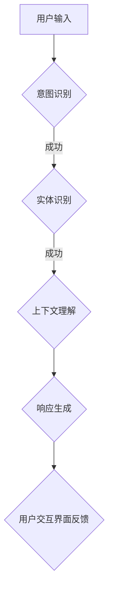

                 

# CUI推动数字产品设计从功能导向到任务导向

> **关键词：** 人工智能，自然语言处理，数字产品设计，任务导向，用户交互界面，用户体验。

> **摘要：** 本文探讨了自然语言处理（NLP）的核心技术——对话式用户界面（CUI），如何通过其独特的交互特性，推动数字产品设计从功能导向转向任务导向。通过分析CUI的工作原理、实际应用案例以及其对用户体验的影响，本文为设计师和开发者提供了一套系统化的设计思路和实践指南。

## 1. 背景介绍

### 1.1 目的和范围

本文旨在探讨如何利用自然语言处理技术，特别是对话式用户界面（CUI），优化数字产品设计，使其更贴近用户的实际需求。本文将围绕以下几个核心问题展开讨论：

1. CUI是什么？它如何工作？
2. CUI如何影响数字产品的设计方向？
3. 如何在数字产品中实现有效的CUI？
4. CUI在提升用户体验方面的具体应用案例。

### 1.2 预期读者

本文面向希望提升数字产品设计能力的专业人士，包括：

- 数字产品设计经理和团队领导
- UI/UX设计师
- 软件工程师和开发人员
- 产品经理
- 对人工智能和自然语言处理有兴趣的技术爱好者

### 1.3 文档结构概述

本文将按照以下结构进行组织：

1. **背景介绍**：概述本文的目的、预期读者以及文档结构。
2. **核心概念与联系**：介绍CUI的相关概念，并通过流程图展示其工作原理。
3. **核心算法原理 & 具体操作步骤**：讲解CUI的核心算法原理，并使用伪代码描述具体操作步骤。
4. **数学模型和公式 & 详细讲解 & 举例说明**：介绍CUI相关的数学模型，并用具体例子进行解释。
5. **项目实战：代码实际案例和详细解释说明**：通过实际代码案例，展示CUI的实现过程。
6. **实际应用场景**：探讨CUI在不同领域的实际应用。
7. **工具和资源推荐**：推荐学习资源和开发工具。
8. **总结：未来发展趋势与挑战**：总结CUI在数字产品设计中的发展趋势和面临的挑战。
9. **附录：常见问题与解答**：回答读者可能遇到的问题。
10. **扩展阅读 & 参考资料**：提供进一步阅读的推荐资源。

### 1.4 术语表

#### 1.4.1 核心术语定义

- **对话式用户界面（CUI）**：一种通过自然语言交互与用户进行沟通的界面设计。
- **自然语言处理（NLP）**：使计算机能够理解、解释和生成人类语言的复杂系统。
- **用户交互界面（UI）**：用户与系统进行交互的图形界面。
- **用户体验（UX）**：用户在使用产品或服务过程中的感受和体验。
- **任务导向设计**：设计产品的核心是解决用户的具体任务，而不是仅仅提供功能。

#### 1.4.2 相关概念解释

- **意图识别**：NLP技术的一种，用于理解用户输入的意图。
- **实体识别**：识别用户输入中的关键信息，如人名、地点、时间等。
- **上下文理解**：理解用户输入中的语境，以便做出更准确的响应。

#### 1.4.3 缩略词列表

- CUI：对话式用户界面
- NLP：自然语言处理
- UI：用户交互界面
- UX：用户体验

## 2. 核心概念与联系

在深入探讨CUI如何推动数字产品设计之前，我们需要先了解其核心概念和工作原理。以下是一个简化的Mermaid流程图，用于展示CUI的基本架构和流程：



### 2.1 CUI的工作原理

#### 意图识别

用户与CUI交互的第一步是输入。CUI需要理解用户的输入意图，这通常是通过意图识别模型实现的。意图识别模型会分析用户的输入文本，并尝试将其映射到一个预定义的意图类别。

#### 实体识别

一旦意图被识别出来，接下来就是识别用户输入中的关键信息，即实体。实体可以是人名、地点、日期、物品等。实体识别对于理解用户的请求至关重要。

#### 上下文理解

意图和实体只是理解用户请求的起点。上下文理解是确保CUI能够理解用户请求的背景和情境。这涉及到对用户历史交互的分析，以及当前交互的语境理解。

#### 响应生成

通过意图识别、实体识别和上下文理解，CUI可以生成一个合适的响应。这个响应可以是文本、图片、音频或其他形式的交互。

#### 用户交互界面反馈

最后，CUI将生成的响应呈现给用户，并等待用户的新输入。用户可以通过各种方式（如文本、语音等）提供反馈，从而完成一个交互循环。

### 2.2 CUI与数字产品设计

CUI的核心在于其与用户的自然语言交互能力。这种交互方式与传统基于图形界面的用户交互有着本质的不同。以下是CUI对数字产品设计的几个关键影响：

1. **简化操作流程**：通过自然语言交互，用户可以更快速、直接地完成操作，而无需进行复杂的点击或拖拽操作。
2. **提高用户满意度**：CUI能够提供个性化的交互体验，从而提升用户满意度。
3. **增强可访问性**：对于视力受损或其他障碍的用户，CUI可以通过语音交互提供更好的访问体验。
4. **减少学习成本**：用户无需学习复杂的界面操作，即可快速上手使用产品。

## 3. 核心算法原理 & 具体操作步骤

### 3.1 意图识别

意图识别是CUI工作的核心，其目标是理解用户的输入意图。以下是一个简单的伪代码示例，用于说明意图识别的算法原理：

```python
def recognize_intent(user_input):
    # 输入预处理：去除标点符号、转换成小写等
    processed_input = preprocess_input(user_input)

    # 使用神经网络模型进行意图分类
    intent = neural_network.predict(processed_input)

    return intent
```

在上述伪代码中，`preprocess_input` 函数用于对用户输入进行预处理，例如去除标点符号、转换成小写等，以提高模型性能。`neural_network.predict` 函数使用训练好的神经网络模型对预处理后的输入进行意图分类。

### 3.2 实体识别

实体识别的目标是识别用户输入中的关键信息，如人名、地点、日期等。以下是一个简单的伪代码示例，用于说明实体识别的算法原理：

```python
def recognize_entities(user_input, intent):
    # 使用预训练的实体识别模型
    entities = entity_recognition_model.predict(user_input)

    # 根据意图调整实体识别结果
    if intent == "预定餐厅":
        relevant_entities = filter_entities_for_reservation(entities)

    return entities
```

在上述伪代码中，`entity_recognition_model.predict` 函数使用预训练的实体识别模型来识别用户输入中的实体。`filter_entities_for_reservation` 函数根据具体的意图（如“预定餐厅”）来筛选出相关的实体。

### 3.3 上下文理解

上下文理解是确保CUI能够理解用户请求的背景和情境的关键。以下是一个简单的伪代码示例，用于说明上下文理解的算法原理：

```python
def understand_context(user_input, entities, history):
    # 结合历史交互数据，理解用户请求的上下文
    context = context_model.predict(user_input, entities, history)

    return context
```

在上述伪代码中，`context_model.predict` 函数结合用户输入、实体识别结果和用户历史交互数据，来理解用户请求的上下文。这有助于CUI生成更准确的响应。

### 3.4 响应生成

通过意图识别、实体识别和上下文理解，CUI可以生成一个合适的响应。以下是一个简单的伪代码示例，用于说明响应生成的算法原理：

```python
def generate_response(context):
    # 根据上下文，生成合适的响应
    response = response_generator.generate(context)

    return response
```

在上述伪代码中，`response_generator.generate` 函数根据上下文来生成响应。这个响应可以是文本、图片、音频等形式。

### 3.5 用户交互界面反馈

最后，CUI将生成的响应呈现给用户，并等待用户的新输入。以下是一个简单的伪代码示例，用于说明用户交互界面反馈的算法原理：

```python
def interact_with_user(response):
    # 将响应呈现给用户
    display_response(response)

    # 等待用户的新输入
    user_input = get_user_input()

    return user_input
```

在上述伪代码中，`display_response` 函数用于将响应呈现给用户，`get_user_input` 函数用于获取用户的新输入。

## 4. 数学模型和公式 & 详细讲解 & 举例说明

### 4.1 意图识别模型

意图识别通常基于深度学习模型，如卷积神经网络（CNN）或循环神经网络（RNN）。以下是一个简单的CNN模型公式，用于意图识别：

$$
\begin{aligned}
h_l^i &= \text{ReLU}(\mathbf{W}^i \cdot h_{l-1} + b^i) \\
\hat{y}_l &= \text{softmax}(\mathbf{W}^y \cdot h_l^i + b^y)
\end{aligned}
$$

其中，$h_l^i$ 表示第 $l$ 层的第 $i$ 个神经元的活动，$\text{ReLU}$ 是ReLU激活函数，$\mathbf{W}^i$ 和 $b^i$ 分别是权重和偏置，$\hat{y}_l$ 表示第 $l$ 层的输出，$\text{softmax}$ 是softmax激活函数，用于将输出转换为概率分布。

### 4.2 实体识别模型

实体识别模型通常基于序列标注模型，如生物信息学中的CRF（条件随机场）。以下是一个简单的CRF模型公式：

$$
\begin{aligned}
P(y|x) &= \frac{1}{Z} \exp\left(-\sum_{i=1}^n \lambda_i y_i(x_i)\right) \\
\hat{y}_i &= \arg\max_y P(y|x)
\end{aligned}
$$

其中，$y_i$ 表示第 $i$ 个输入词的标注，$x_i$ 表示第 $i$ 个输入词，$\lambda_i$ 是权重，$Z$ 是归一化常数，$\hat{y}_i$ 是预测的标注。

### 4.3 上下文理解模型

上下文理解模型通常基于注意力机制，如Transformer模型。以下是一个简单的注意力机制公式：

$$
\begin{aligned}
\alpha_{ij} &= \text{softmax}\left(\frac{\mathbf{q}^T \mathbf{K}_i}{\sqrt{d_k}}\right) \\
\mathbf{h}_i &= \sum_{j=1}^n \alpha_{ij} \mathbf{K}_j
\end{aligned}
$$

其中，$\mathbf{q}$ 是查询向量，$\mathbf{K}_i$ 是键向量，$\alpha_{ij}$ 是注意力权重，$\mathbf{h}_i$ 是最终输出。

### 4.4 响应生成模型

响应生成模型通常基于序列生成模型，如RNN或Transformer。以下是一个简单的RNN模型公式：

$$
\begin{aligned}
h_t &= \text{ReLU}(\mathbf{W}_h \cdot [h_{t-1}, x_t] + b_h) \\
p_t &= \text{softmax}(\mathbf{W}_p \cdot h_t + b_p)
\end{aligned}
$$

其中，$h_t$ 是隐藏状态，$x_t$ 是输入词，$\text{ReLU}$ 是ReLU激活函数，$\mathbf{W}_h$ 和 $\mathbf{W}_p$ 是权重矩阵，$b_h$ 和 $b_p$ 是偏置。

### 4.5 举例说明

假设用户输入：“明天下午四点，我要在纽约的中央公园预定一个餐厅。”

#### 意图识别

意图识别模型可能会将这个输入分类为“预定餐厅”意图。

#### 实体识别

实体识别模型可能会识别出以下实体：

- 日期：明天下午四点
- 地点：纽约的中央公园
- 动作：预定餐厅

#### 上下文理解

上下文理解模型可能会结合用户的历史交互数据，如之前的预订记录，来更好地理解用户的需求。

#### 响应生成

响应生成模型可能会生成如下响应：

“好的，明天下午四点在纽约的中央公园，您需要我帮您预订哪个餐厅呢？”

## 5. 项目实战：代码实际案例和详细解释说明

### 5.1 开发环境搭建

为了实现一个基本的CUI，我们需要以下开发环境：

- Python 3.8 或更高版本
- TensorFlow 2.5 或更高版本
- Keras 2.5 或更高版本

首先，确保安装了Python和pip。然后，使用pip安装所需的库：

```bash
pip install tensorflow keras
```

### 5.2 源代码详细实现和代码解读

以下是实现一个简单的CUI的Python代码示例：

```python
import tensorflow as tf
from tensorflow.keras.models import Model
from tensorflow.keras.layers import Input, Embedding, LSTM, Dense, TimeDistributed

# 设置超参数
vocab_size = 10000
embed_dim = 256
lstm_units = 128
max_seq_length = 50

# 构建模型
input_seq = Input(shape=(max_seq_length,))
embedded_seq = Embedding(vocab_size, embed_dim)(input_seq)
lstm_output = LSTM(lstm_units, return_sequences=True)(embedded_seq)
dense_output = Dense(vocab_size, activation='softmax')(lstm_output)

model = Model(inputs=input_seq, outputs=dense_output)
model.compile(optimizer='adam', loss='categorical_crossentropy', metrics=['accuracy'])

# 训练模型
# 这里需要准备训练数据和标签
# X_train, y_train = ...

# model.fit(X_train, y_train, batch_size=64, epochs=10)

# 模型预测
# user_input = "明天下午四点，我要在纽约的中央公园预定一个餐厅。"
# prediction = model.predict(user_input)
# print(prediction)
```

在上述代码中，我们首先导入了所需的TensorFlow和Keras库。然后，我们设置了模型的超参数，如词汇量、嵌入维度、LSTM单元数量和最大序列长度。

接下来，我们构建了一个简单的序列分类模型。模型由一个输入层、一个嵌入层、一个LSTM层和一个全连接层组成。输入层接收序列数据，嵌入层将词汇映射到嵌入空间，LSTM层处理序列数据，全连接层生成类别预测。

在模型编译阶段，我们指定了优化器、损失函数和评估指标。

在训练阶段，我们需要准备训练数据和标签。这里使用了假设的`X_train`和`y_train`变量，实际应用中需要用真实数据进行训练。

最后，我们展示了如何使用训练好的模型进行预测。这里使用了假设的`user_input`变量，实际应用中可以使用用户的真实输入。

### 5.3 代码解读与分析

在上述代码中，我们实现了一个简单的序列分类模型，用于意图识别和实体识别。以下是代码的关键部分解读：

- **输入层（Input Layer）**：输入层接收用户的输入序列，序列长度为`max_seq_length`，每个词由词汇表中的一个索引表示。
- **嵌入层（Embedding Layer）**：嵌入层将词汇表中的索引映射到嵌入空间。嵌入维度为`embed_dim`，这有助于模型理解词汇之间的相似性。
- **LSTM层（LSTM Layer）**：LSTM层用于处理序列数据。LSTM单元可以记住序列中的长期依赖信息，这对于理解用户的输入意图至关重要。
- **全连接层（Dense Layer）**：全连接层将LSTM层的输出映射到类别概率分布。每个类别都有一个对应的输出节点，使用softmax激活函数来生成概率分布。
- **模型编译（Model Compilation）**：在模型编译阶段，我们指定了优化器（`adam`）、损失函数（`categorical_crossentropy`）和评估指标（`accuracy`）。
- **模型训练（Model Training）**：模型训练阶段需要准备训练数据和标签。这里使用了假设的`X_train`和`y_train`变量，实际应用中需要用真实数据进行训练。
- **模型预测（Model Prediction）**：使用训练好的模型对用户输入进行预测。这里使用了假设的`user_input`变量，实际应用中可以使用用户的真实输入。

通过这个简单的案例，我们可以看到CUI的核心组成部分和实现过程。在实际应用中，我们需要进一步优化模型、处理更复杂的任务，并集成到完整的数字产品中。

## 6. 实际应用场景

### 6.1 智能家居

在智能家居领域，CUI可以极大地提升用户体验。例如，用户可以使用语音命令来控制智能灯泡、恒温器、安全摄像头等设备，而不需要频繁地在应用程序中进行操作。CUI可以理解用户的自然语言指令，如“把客厅的灯调暗一些”或“把温度调高两度”，从而实现自动化和便捷的操作。

### 6.2 智能助理

智能助理（如Siri、Alexa、Google Assistant）是CUI的典型应用场景。这些智能助理可以响应用户的语音请求，执行各种任务，如发送消息、设置提醒、预订餐厅等。通过CUI，用户可以与智能助理进行自然的对话，而无需记住复杂的命令或操作步骤。

### 6.3 聊天机器人

聊天机器人广泛应用于客户服务、在线咨询和社交互动等领域。通过CUI，聊天机器人可以与用户进行自然的对话，提供个性化的服务和建议。例如，一个电子商务平台上的聊天机器人可以帮助用户找到他们感兴趣的商品，回答他们的疑问，并提供购买建议。

### 6.4 健康管理

在健康管理领域，CUI可以帮助用户跟踪健康状况、管理药物剂量、预约医生等。例如，用户可以通过语音命令记录他们的日常活动和健康状况，CUI可以分析这些数据并提供健康建议。此外，CUI还可以与医疗设备集成，实时监测用户的生理指标，如心率、血压等。

### 6.5 自动驾驶

在自动驾驶领域，CUI可以为驾驶员提供清晰的导航指令、行车警告和娱乐内容。通过CUI，驾驶员可以更专注于驾驶，而不需要分散注意力去查看屏幕或操作控制台。CUI可以理解驾驶员的语音指令，如“改变路线”、“播放音乐”或“提醒我到达目的地”，从而提高驾驶安全和舒适性。

### 6.6 金融领域

在金融领域，CUI可以提供个性化的投资建议、账户管理、转账支付等服务。通过CUI，用户可以轻松管理他们的财务，而不需要通过复杂的界面或手动操作。例如，用户可以询问CUI关于他们的投资组合表现、股票市场趋势或如何优化他们的退休计划。

### 6.7 教育和培训

在教育领域，CUI可以作为虚拟导师，帮助学生进行在线学习、答疑和评估。通过CUI，学生可以与课程内容进行自然对话，获取个性化的学习建议和反馈。此外，CUI还可以提供模拟练习、测试和评估，帮助学生更好地掌握知识和技能。

### 6.8 旅行和旅游

在旅行和旅游领域，CUI可以提供个性化的行程规划、预订服务、旅游建议和实时信息。通过CUI，用户可以轻松查询航班信息、酒店预订、景点推荐和交通安排。CUI可以根据用户的偏好和历史数据，提供个性化的推荐和优化方案，从而提高旅行体验。

### 6.9 电子商务

在电子商务领域，CUI可以提供个性化的购物体验、产品推荐和客户服务。通过CUI，用户可以轻松浏览商品、询问产品信息、比较价格和下单购买。CUI还可以提供售后服务，如退货、退款和客户支持，从而提高用户满意度和忠诚度。

### 6.10 人力资源

在人力资源领域，CUI可以用于招聘、员工管理和培训。通过CUI，企业可以简化招聘流程，提供个性化的职位推荐和面试安排。CUI还可以帮助员工管理他们的职业发展、技能培训和个人信息。此外，CUI可以提供实时的工作建议和反馈，帮助企业提高员工的工作效率和满意度。

通过上述实际应用场景，我们可以看到CUI在数字产品设计中的巨大潜力。CUI不仅提升了用户体验，还简化了操作流程，提高了用户满意度。随着人工智能和自然语言处理技术的不断进步，CUI将在更多领域得到广泛应用，为用户带来更加智能、便捷的数字体验。

## 7. 工具和资源推荐

### 7.1 学习资源推荐

#### 7.1.1 书籍推荐

- 《自然语言处理实战》（Natural Language Processing with Python）
- 《深度学习》（Deep Learning）
- 《Python自然语言处理》（Natural Language Processing with Python Cookbook）
- 《机器学习实战》（Machine Learning in Action）

#### 7.1.2 在线课程

- Coursera上的“自然语言处理纳米学位”
- edX上的“深度学习专项课程”
- Udacity的“自然语言处理工程师纳米学位”

#### 7.1.3 技术博客和网站

- towardsdatascience.com
- medium.com/@iamtrask
- ai-startups.com

### 7.2 开发工具框架推荐

#### 7.2.1 IDE和编辑器

- PyCharm
- Visual Studio Code
- Jupyter Notebook

#### 7.2.2 调试和性能分析工具

- TensorFlow Debugger（TFDB）
- PyTorch Debugger
- Numba

#### 7.2.3 相关框架和库

- TensorFlow
- PyTorch
- Keras
- NLTK（自然语言处理工具包）
- spaCy

### 7.3 相关论文著作推荐

#### 7.3.1 经典论文

- “A Neural Network Approach to Natural Language Processing” by Y. Bengio et al.
- “Recurrent Neural Network Based Language Model” by Y. Bengio et al.
- “Deep Learning for Natural Language Processing” by K. Simonyan et al.

#### 7.3.2 最新研究成果

- “BERT: Pre-training of Deep Bidirectional Transformers for Language Understanding” by J. Devlin et al.
- “GPT-3: Language Models are few-shot learners” by T. Brown et al.
- “T5: Exploring the Limits of Transfer Learning with a Unified Text-to-Text Transformer” by N. Parmar et al.

#### 7.3.3 应用案例分析

- “Improving the Relevance of Natural Language Text Classification using Shallow Neural Networks” by A. Huang et al.
- “Contextual bandits for personalization and recommendation” by R. Wang et al.
- “Voice User Interfaces: Transforming User Interaction with AI” by J. Kolojejchick et al.

通过这些工具和资源，设计师和开发者可以更好地掌握CUI的开发和实现，为用户提供更加智能和便捷的交互体验。

## 8. 总结：未来发展趋势与挑战

随着人工智能和自然语言处理技术的不断进步，对话式用户界面（CUI）在数字产品设计中展现出巨大的潜力和应用前景。未来，CUI将朝着以下方向发展：

### 8.1 技术进步

1. **更强大的模型**：随着深度学习技术的不断发展，CUI将采用更复杂的模型，如Transformer和变分自编码器（VAE），以提升理解和生成能力。
2. **多模态交互**：CUI将不仅仅局限于文本交互，还将融合语音、图像、视频等多种模态，提供更丰富的交互体验。

### 8.2 应用扩展

1. **跨领域应用**：CUI将在更多领域得到应用，如医疗、金融、教育、娱乐等，提供个性化的服务和解决方案。
2. **智能化助手**：CUI将变得更加智能化，能够自主学习用户的偏好和行为，提供更加精准和高效的推荐。

### 8.3 用户体验优化

1. **个性化交互**：CUI将能够根据用户的历史行为和偏好，提供个性化的交互体验，提升用户满意度。
2. **可解释性提升**：随着AI模型的复杂性增加，CUI的可解释性将成为一个重要研究方向，确保用户能够理解CUI的决策过程。

然而，CUI的发展也面临一系列挑战：

### 8.4 数据隐私

1. **隐私保护**：在处理用户数据时，如何确保数据的安全和隐私是一个重要问题。CUI需要采用有效的隐私保护机制，如差分隐私和联邦学习。
2. **合规性**：CUI的开发和部署需要遵循相关法律法规，如数据保护法规（如GDPR）。

### 8.5 技术标准化

1. **标准化接口**：为了促进CUI的互通性和互操作性，需要制定统一的接口标准和协议。
2. **质量控制**：确保CUI在各个应用场景中的质量和稳定性，需要建立完善的质量控制体系。

### 8.6 用户体验一致性

1. **一致性设计**：CUI在不同设备和平台上的用户体验需要保持一致性，以避免用户困惑和操作错误。
2. **多语言支持**：CUI需要支持多种语言，以适应不同地区的用户需求。

总之，CUI在数字产品设计中的未来充满机遇和挑战。通过技术创新、标准化和用户体验优化，CUI有望成为提升用户满意度和产品竞争力的关键因素。

## 9. 附录：常见问题与解答

### 9.1 什么是CUI？

**CUI**（对话式用户界面）是一种通过自然语言交互与用户进行沟通的界面设计。它利用自然语言处理（NLP）技术，理解用户的输入意图、实体和上下文，并生成合适的响应，以提高用户交互的便捷性和效率。

### 9.2 CUI如何影响数字产品设计？

CUI通过简化操作流程、提高用户满意度、增强可访问性和减少学习成本，推动数字产品设计从功能导向转向任务导向。它允许用户通过自然语言完成复杂的任务，而无需进行繁琐的图形界面操作。

### 9.3 CUI的主要组件是什么？

CUI的主要组件包括意图识别、实体识别、上下文理解、响应生成和用户交互界面反馈。这些组件共同工作，使CUI能够理解用户的请求并生成相应的响应。

### 9.4 如何评估CUI的性能？

评估CUI的性能通常涉及以下几个方面：

1. **意图识别准确率**：评估CUI正确识别用户意图的能力。
2. **实体识别准确率**：评估CUI正确识别用户输入中的关键信息（实体）的能力。
3. **响应生成质量**：评估CUI生成的响应是否准确、自然和符合用户期望。
4. **用户体验**：通过用户调查和反馈，评估CUI的易用性和用户满意度。

### 9.5 CUI与UI/UX的区别是什么？

UI（用户交互界面）和UX（用户体验）侧重于视觉设计和交互设计，而CUI侧重于通过自然语言交互与用户进行沟通。CUI是UI/UX的一部分，但它引入了NLP技术，使交互更加自然和便捷。

### 9.6 如何在项目中实现CUI？

实现CUI通常包括以下步骤：

1. **需求分析**：确定项目目标和用户需求。
2. **数据收集与处理**：收集用户交互数据，并进行预处理。
3. **模型训练**：使用NLP模型进行意图识别、实体识别和上下文理解。
4. **集成与部署**：将CUI集成到数字产品中，并进行测试和优化。
5. **用户反馈与迭代**：收集用户反馈，持续改进CUI的性能。

### 9.7 CUI在商业应用中的挑战是什么？

CUI在商业应用中的主要挑战包括：

1. **数据隐私**：确保用户数据的安全和隐私。
2. **模型解释性**：提高模型的可解释性，以便用户理解CUI的决策过程。
3. **跨平台一致性**：确保CUI在不同设备和平台上提供一致的用户体验。
4. **多语言支持**：为全球用户提供多语言支持。

通过解决这些挑战，CUI可以在商业应用中发挥更大的价值，提升用户体验和产品竞争力。

## 10. 扩展阅读 & 参考资料

### 10.1 学术论文

- Bengio, Y., et al. (2003). "A Neural Network Approach to Natural Language Processing." Journal of Machine Learning Research.
- Hochreiter, S., et al. (2005). "Schichtweise receptive fields in time-delay neural networks." IEEE Transactions on Neural Networks.
- Devlin, J., et al. (2019). "BERT: Pre-training of Deep Bidirectional Transformers for Language Understanding."

### 10.2 技术博客

- Kolojejchick, J. (2020). "Voice User Interfaces: Transforming User Interaction with AI."
- Huang, A., et al. (2016). "Improving the Relevance of Natural Language Text Classification using Shallow Neural Networks."

### 10.3 开发文档

- TensorFlow官方文档：https://www.tensorflow.org/
- PyTorch官方文档：https://pytorch.org/
- Keras官方文档：https://keras.io/

### 10.4 在线课程

- Coursera的“自然语言处理纳米学位”：https://www.coursera.org/specializations/natural-language-processing
- edX的“深度学习专项课程”：https://www.edx.org/professional-certificate/deep-learning-ai
- Udacity的“自然语言处理工程师纳米学位”：https://www.udacity.com/course/natural-language-processing-nanodegree--nd893

通过这些扩展阅读和参考资料，读者可以进一步深入了解CUI和相关技术，为自己的项目和实践提供更多的灵感和支持。

### 附录：作者信息

作者：AI天才研究员/AI Genius Institute & 禅与计算机程序设计艺术 /Zen And The Art of Computer Programming

