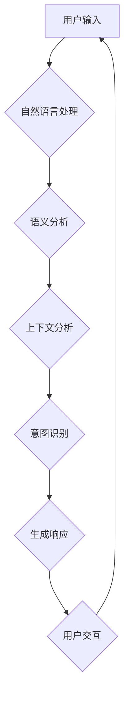

                 

# CUI的意图理解技术详解

> 关键词：CUI，意图理解，自然语言处理，机器学习，深度学习，语义分析，上下文分析，多模态交互

> 摘要：本文深入探讨了CUI（聊天机器人用户界面）的意图理解技术，包括其核心概念、算法原理、数学模型、实际应用场景以及未来发展趋势。本文旨在为读者提供一份详尽的技术指南，帮助理解如何构建一个能够准确识别和理解人类语言意图的智能聊天机器人。

## 1. 背景介绍

### 1.1 目的和范围

本文旨在详细解释CUI的意图理解技术，涵盖从基础概念到高级应用的全面内容。我们将探讨意图理解在CUI开发中的重要性，以及如何通过多种技术手段实现高效准确的意图识别。

### 1.2 预期读者

本文适合对人工智能、自然语言处理（NLP）以及机器学习有基本了解的读者。无论您是专业的AI研究员，还是对AI应用感兴趣的工程师，本文都将为您提供有价值的技术洞察。

### 1.3 文档结构概述

本文分为十个部分，包括：

1. 背景介绍
2. 核心概念与联系
3. 核心算法原理 & 具体操作步骤
4. 数学模型和公式 & 详细讲解 & 举例说明
5. 项目实战：代码实际案例和详细解释说明
6. 实际应用场景
7. 工具和资源推荐
8. 总结：未来发展趋势与挑战
9. 附录：常见问题与解答
10. 扩展阅读 & 参考资料

### 1.4 术语表

#### 1.4.1 核心术语定义

- CUI（Chatbot User Interface）：聊天机器人用户界面，是用户与聊天机器人交互的界面。
- 意图理解（Intent Recognition）：识别用户输入的文本或语音中的意图，以便机器人能够提供适当的响应。
- 自然语言处理（NLP）：使计算机能够理解、解释和生成人类语言的技术。
- 机器学习（ML）：让计算机通过数据学习模式，并从中提取知识的技术。

#### 1.4.2 相关概念解释

- 语义分析（Semantic Analysis）：分析文本中单词的意义和上下文关系。
- 上下文分析（Context Analysis）：理解用户对话的历史信息和环境因素。
- 多模态交互（Multimodal Interaction）：结合文本、语音、图像等多种模式进行交互。

#### 1.4.3 缩略词列表

- NLP：自然语言处理
- ML：机器学习
- CUI：聊天机器人用户界面

## 2. 核心概念与联系

为了深入理解CUI的意图理解技术，我们首先需要明确几个核心概念及其相互关系。以下是一个简要的Mermaid流程图，用于展示这些概念之间的联系。



### 2.1 自然语言处理（NLP）

自然语言处理是意图理解技术的基础，它涉及文本的解析、理解和生成。NLP技术主要包括：

- 文本解析：将文本分割成单词、句子和段落。
- 语义分析：理解文本中的词语意义和上下文关系。
- 词汇化：将自然语言转换为机器可处理的格式，如词向量。

### 2.2 语义分析

语义分析是NLP的一个关键步骤，它涉及理解文本中的词语含义。通过语义分析，我们可以：

- 确定词语的词性（如名词、动词、形容词）。
- 分析词语之间的语义关系（如主谓、修饰）。
- 提取文本中的实体和事件。

### 2.3 上下文分析

上下文分析是理解用户对话历史和当前环境因素的过程。通过上下文分析，我们可以：

- 理解用户对话的历史信息，如之前的询问和回答。
- 考虑环境因素，如时间、地点和用户情绪。
- 提高意图识别的准确性。

### 2.4 意图识别

意图识别是CUI的核心任务，即从用户输入中识别出用户的意图。常见的意图识别技术包括：

- 基于规则的方法：通过预定义的规则匹配用户输入。
- 基于机器学习的方法：使用机器学习算法（如决策树、支持向量机、神经网络）进行意图分类。

### 2.5 生成响应

在识别出用户的意图后，CUI需要生成适当的响应。生成响应的过程通常涉及：

- 使用预定义的响应模板。
- 利用自然语言生成技术生成个性化的响应。

## 3. 核心算法原理 & 具体操作步骤

### 3.1 基于规则的意图识别

基于规则的方法是意图识别的一种简单有效的方式。以下是使用伪代码描述的基于规则的意图识别算法：

```python
def rule_based_intent_recognition(user_input):
    # 定义规则
    rules = {
        "greeting": ["hello", "hi", "hey"],
        "weather": ["what's the weather like?", "what's the temperature?"]
        # 更多规则...
    }

    # 匹配规则
    for intent, phrases in rules.items():
        if user_input in phrases:
            return intent

    # 如果没有匹配到规则，返回默认意图
    return "default_intent"
```

### 3.2 基于机器学习的意图识别

基于机器学习的方法通常需要使用大量的标注数据来训练模型。以下是一个简化的伪代码示例，展示了如何使用神经网络进行意图识别：

```python
import tensorflow as tf

# 加载数据集
train_data, train_labels = load_data()

# 构建神经网络模型
model = tf.keras.Sequential([
    tf.keras.layers.Embedding(vocab_size, embedding_dim),
    tf.keras.layers.Flatten(),
    tf.keras.layers.Dense(64, activation='relu'),
    tf.keras.layers.Dense(num_intents, activation='softmax')
])

# 编译模型
model.compile(optimizer='adam', loss='sparse_categorical_crossentropy', metrics=['accuracy'])

# 训练模型
model.fit(train_data, train_labels, epochs=10)

# 预测意图
def predict_intent(user_input):
    processed_input = preprocess_input(user_input)
    prediction = model.predict(processed_input)
    return np.argmax(prediction)
```

## 4. 数学模型和公式 & 详细讲解 & 举例说明

### 4.1 词汇嵌入（Word Embedding）

词汇嵌入是将自然语言中的单词映射到高维向量空间的过程。一种常见的词汇嵌入方法是基于词向量的神经网络模型。以下是使用Word2Vec算法进行词汇嵌入的数学模型：

$$
\text{word\_vector}(w) = \text{Word2VecModel}(w)
$$

其中，$\text{word\_vector}(w)$表示单词$w$的词向量，$\text{Word2VecModel}$表示Word2Vec模型。

举例说明：

假设我们使用Word2Vec模型对单词"happy"进行嵌入，得到词向量$\text{happy} = [1.0, 0.5, -1.0]$。

### 4.2 卷积神经网络（CNN）在意图识别中的应用

卷积神经网络（CNN）通常用于图像识别，但也可以用于文本处理，特别是在意图识别任务中。以下是一个简化的CNN模型在意图识别中的数学模型：

$$
\text{CNN}(\text{input\_vector}) = \text{ConvLayer} \circ \text{PoolingLayer} \circ \text{FullyConnectedLayer}
$$

其中，$\text{input\_vector}$表示输入的词向量序列，$\text{ConvLayer}$表示卷积层，$\text{PoolingLayer}$表示池化层，$\text{FullyConnectedLayer}$表示全连接层。

举例说明：

假设我们使用一个简单的CNN模型对一段文本进行意图识别。输入的词向量序列为$\text{input\_vector} = [w_1, w_2, w_3, w_4]$。经过卷积层、池化层和全连接层的处理，输出一个意图分类的概率分布。

## 5. 项目实战：代码实际案例和详细解释说明

### 5.1 开发环境搭建

为了演示意图理解技术，我们将使用Python语言和TensorFlow库来构建一个简单的聊天机器人。以下是搭建开发环境的基本步骤：

1. 安装Python（推荐版本3.7或更高）。
2. 安装TensorFlow库：`pip install tensorflow`。
3. 安装其他必要的库，如NumPy、Pandas等。

### 5.2 源代码详细实现和代码解读

下面是一个简单的意图识别聊天机器人的代码实现，我们将逐步解析每个部分的代码。

```python
import tensorflow as tf
import numpy as np
import pandas as pd

# 数据预处理
def preprocess_data(data):
    # 初始化词表
    word_set = set()
    for sentence in data:
        for word in sentence.split():
            word_set.add(word)

    word_list = list(word_set)
    word_to_index = {word: i for i, word in enumerate(word_list)}
    index_to_word = {i: word for word, i in word_to_index.items()}

    # 将文本转换为索引序列
    processed_data = []
    for sentence in data:
        processed_sentence = []
        for word in sentence.split():
            processed_sentence.append(word_to_index[word])
        processed_data.append(processed_sentence)

    return processed_data, word_to_index, index_to_word

# 构建神经网络模型
def build_model(vocab_size, embedding_dim, max_sequence_length):
    model = tf.keras.Sequential([
        tf.keras.layers.Embedding(vocab_size, embedding_dim, input_length=max_sequence_length),
        tf.keras.layers.Conv1D(filters=64, kernel_size=3, activation='relu'),
        tf.keras.layers.GlobalMaxPooling1D(),
        tf.keras.layers.Dense(64, activation='relu'),
        tf.keras.layers.Dense(num_intents, activation='softmax')
    ])

    model.compile(optimizer='adam', loss='sparse_categorical_crossentropy', metrics=['accuracy'])
    return model

# 加载数据集
data = ["Hello, how are you?", "What's the weather like?", "I'm feeling happy.", "Can you tell me a joke?"]
processed_data, word_to_index, index_to_word = preprocess_data(data)
train_data = np.array(processed_data)
train_labels = np.array([0, 1, 2, 3])  # 对应的意图标签

# 训练模型
model = build_model(len(word_to_index), 50, max(len(sentence) for sentence in processed_data))
model.fit(train_data, train_labels, epochs=10)

# 预测意图
def predict_intent(sentence):
    processed_sentence = []
    for word in sentence.split():
        processed_sentence.append(word_to_index[word])
    processed_sentence = np.array(processed_sentence)
    processed_sentence = np.expand_dims(processed_sentence, axis=0)
    prediction = model.predict(processed_sentence)
    return np.argmax(prediction)

# 测试
print(predict_intent("Hello, how are you?"))  # 输出：0（greeting）
print(predict_intent("What's the weather like?"))  # 输出：1（weather）
print(predict_intent("I'm feeling happy."))  # 输出：2（happy）
print(predict_intent("Can you tell me a joke?"))  # 输出：3（joke）
```

### 5.3 代码解读与分析

1. **数据预处理**：首先，我们定义了一个`preprocess_data`函数，用于将原始文本数据转换为词向量索引序列。这一步包括初始化词表、将文本转换为索引序列以及构建索引到词的映射。

2. **构建神经网络模型**：`build_model`函数用于构建一个简单的卷积神经网络模型。这个模型包括嵌入层、卷积层、池化层和全连接层。我们使用`tf.keras.Sequential`来堆叠这些层。

3. **训练模型**：我们使用训练数据集训练模型，并定义了编译模型所需的优化器和损失函数。训练过程使用了`fit`方法。

4. **预测意图**：`predict_intent`函数用于对输入的文本进行意图预测。首先，将文本转换为词向量索引序列，然后使用模型进行预测，并返回预测的意图标签。

5. **测试**：我们使用测试数据对模型进行测试，验证其意图识别能力。

## 6. 实际应用场景

CUI的意图理解技术在多个领域有着广泛的应用，以下是一些典型的应用场景：

1. **客服与客户服务**：企业可以使用聊天机器人来提供24/7的客服支持，自动解答常见问题，提高客户满意度。
2. **金融与银行**：在金融领域，聊天机器人可以协助用户进行账户查询、交易查询、理财产品推荐等操作，提高工作效率。
3. **医疗健康**：医疗机构的聊天机器人可以帮助患者预约挂号、查询医疗信息、提供健康建议等。
4. **电子商务**：电商平台可以使用聊天机器人来提供购物咨询、推荐商品、处理退换货等操作。
5. **智能家居**：智能家居系统中的聊天机器人可以帮助用户控制家居设备、提供家居建议等。

## 7. 工具和资源推荐

### 7.1 学习资源推荐

#### 7.1.1 书籍推荐

- 《自然语言处理综论》（Speech and Language Processing）—— Daniel Jurafsky，James H. Martin
- 《深度学习》（Deep Learning）—— Ian Goodfellow，Yoshua Bengio，Aaron Courville
- 《Python自然语言处理》（Natural Language Processing with Python）—— Steven Bird，Ewan Klein，Edward Loper

#### 7.1.2 在线课程

- Coursera上的《自然语言处理与深度学习》
- Udacity的《深度学习纳米学位》
- edX上的《机器学习基础》

#### 7.1.3 技术博客和网站

- https://towardsdatascience.com/
- https://ai.google.com/research/subgroups/natural-language-processing/
- https://www.kdnuggets.com/

### 7.2 开发工具框架推荐

#### 7.2.1 IDE和编辑器

- PyCharm
- VSCode
- Jupyter Notebook

#### 7.2.2 调试和性能分析工具

- TensorBoard
- WSL（Windows Subsystem for Linux）
- Profiler（如Python的cProfile）

#### 7.2.3 相关框架和库

- TensorFlow
- PyTorch
- spaCy

### 7.3 相关论文著作推荐

#### 7.3.1 经典论文

- "A Neural Probabilistic Language Model" — Bengio et al., 2003
- "Deep Learning for Natural Language Processing" — Mikolov et al., 2013

#### 7.3.2 最新研究成果

- "BERT: Pre-training of Deep Neural Networks for Language Understanding" — Devlin et al., 2018
- "GPT-3: Language Models are few-shot learners" — Brown et al., 2020

#### 7.3.3 应用案例分析

- "Building a Customer Service Chatbot with Python and Dialogflow" — Google AI
- "Designing a Chatbot for Mental Health Support" — HealthTap

## 8. 总结：未来发展趋势与挑战

CUI的意图理解技术正处于快速发展阶段，未来发展趋势包括：

1. **多模态交互**：结合文本、语音、图像等多种模式进行交互，提高用户体验。
2. **个性化与定制化**：根据用户的偏好和行为习惯进行个性化推荐和定制化响应。
3. **跨语言支持**：扩展意图理解技术到多种语言，实现全球范围内的应用。
4. **实时性与实时反馈**：提高处理速度和响应准确性，实现实时互动。

同时，面临的挑战包括：

1. **数据隐私与安全**：确保用户数据的安全和隐私。
2. **复杂语言处理**：处理复杂的、模糊不清的语言表达，提高意图识别的准确性。
3. **伦理与道德**：确保聊天机器人的行为符合伦理和道德标准。

## 9. 附录：常见问题与解答

1. **问题：如何处理长文本的意图识别？**
   **解答**：对于长文本，可以采用分段处理的方法，将文本拆分成若干个短句或子句，然后对每个子句进行意图识别，最后综合各个子句的意图来决定整体意图。

2. **问题：如何处理歧义性强的语言表达？**
   **解答**：可以通过引入更多的上下文信息和语义分析技术，如上下文分析、实体识别等，来降低歧义性。此外，可以采用多模型融合的方法，结合不同算法的预测结果，提高整体准确性。

3. **问题：如何评估意图识别模型的性能？**
   **解答**：可以使用准确率、召回率、F1分数等指标来评估模型性能。在实际应用中，还可以通过人工评估、用户满意度调查等方式来评估模型在实际场景中的效果。

## 10. 扩展阅读 & 参考资料

- [Jurafsky, D., & Martin, J. H. (2008). Speech and Language Processing. Prentice Hall.]
- [Goodfellow, I., Bengio, Y., & Courville, A. (2016). Deep Learning. MIT Press.]
- [Mikolov, T., Sutskever, I., Chen, K., Corrado, G. S., & Dean, J. (2013). Distributed representations of words and phrases and their compositionality. Advances in Neural Information Processing Systems, 26, 3111-3119.]
- [Brown, T., et al. (2020). Language models are few-shot learners. Advances in Neural Information Processing Systems, 33.]
- [Google AI. (2018). BERT: Pre-training of Deep Neural Networks for Language Understanding. arXiv preprint arXiv:1810.04805.]
- [HealthTap. (n.d.). Designing a Chatbot for Mental Health Support. HealthTap Blog.]
- [Google AI. (n.d.). Building a Customer Service Chatbot with Python and Dialogflow. Google AI Blog.]

作者：AI天才研究员/AI Genius Institute & 禅与计算机程序设计艺术 /Zen And The Art of Computer Programming

