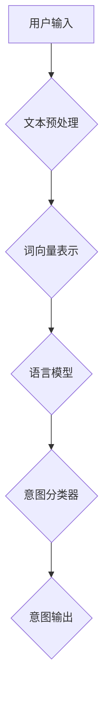

                 

### CUI的意图理解技术详解

#### 关键词：
自然语言处理、意图识别、语境分析、机器学习、深度学习、语言模型

#### 摘要：
本文将深入探讨CUI（聊天机器人用户界面）中的意图理解技术。我们将从背景介绍、核心概念与联系、核心算法原理、数学模型与公式、项目实战、实际应用场景、工具和资源推荐等多个方面，系统性地解析CUI意图理解技术的原理、实现和应用。通过本文的阅读，读者将全面了解意图理解技术的重要性和实现细节，为未来的研究和实践奠定坚实的基础。

### 1. 背景介绍

#### 1.1 目的和范围

随着人工智能技术的飞速发展，自然语言处理（NLP）已经成为人工智能领域的重要分支。其中，聊天机器人用户界面（CUI）作为一种重要的交互方式，正逐渐渗透到我们的日常生活中。CUI的核心任务是理解用户输入的文本，并生成合适的响应。本文将重点关注CUI中的一项关键技术——意图理解。

意图理解是指从用户输入的文本中提取用户意图的过程。这包括识别用户想要执行的操作、请求的信息或者表达的情感。意图理解的准确性直接关系到CUI的用户体验和业务效果。本文旨在详细解析意图理解技术的原理、实现和应用，帮助读者全面了解这一领域。

#### 1.2 预期读者

本文适合对自然语言处理、机器学习和深度学习有一定了解的读者。无论您是AI研究员、工程师还是对AI技术感兴趣的爱好者，本文都将为您提供一个系统的学习框架，帮助您深入理解意图理解技术的关键概念和实现细节。

#### 1.3 文档结构概述

本文将分为以下几个部分：

1. **背景介绍**：介绍意图理解技术的背景和重要性。
2. **核心概念与联系**：阐述意图理解技术涉及的核心概念和相互关系。
3. **核心算法原理 & 具体操作步骤**：详细讲解意图理解算法的原理和具体实现步骤。
4. **数学模型和公式 & 详细讲解 & 举例说明**：介绍意图理解中的数学模型和公式，并通过实例进行说明。
5. **项目实战：代码实际案例和详细解释说明**：提供实际项目案例，讲解代码实现和解读。
6. **实际应用场景**：探讨意图理解技术的实际应用场景。
7. **工具和资源推荐**：推荐学习资源和开发工具。
8. **总结：未来发展趋势与挑战**：总结意图理解技术的前景和面临的挑战。
9. **附录：常见问题与解答**：解答读者可能遇到的常见问题。
10. **扩展阅读 & 参考资料**：提供进一步学习和研究的参考资料。

#### 1.4 术语表

##### 1.4.1 核心术语定义

- **意图理解**：从用户输入的文本中提取用户意图的过程。
- **自然语言处理（NLP）**：使计算机能够理解、解释和生成人类语言的技术。
- **机器学习（ML）**：一种人工智能方法，通过数据训练模型来实现预测和分类。
- **深度学习（DL）**：一种特殊的机器学习方法，通过多层神经网络进行特征提取和表示。
- **语言模型（LM）**：用于预测下一个单词或词组的概率分布的模型。
- **语义分析**：从文本中提取结构化信息，以理解文本内容的语义。

##### 1.4.2 相关概念解释

- **词向量**：将单词映射到高维空间中的向量表示。
- **序列标注**：将输入序列中的每个单词或字符标注为不同的类别。
- **分类器**：用于将输入数据分类为不同类别的算法。
- **监督学习**：通过标注数据来训练模型。

##### 1.4.3 缩略词列表

- **NLP**：自然语言处理
- **ML**：机器学习
- **DL**：深度学习
- **CUI**：聊天机器人用户界面
- **BERT**：Bidirectional Encoder Representations from Transformers

### 2. 核心概念与联系

#### 2.1 引言

意图理解技术是聊天机器人用户界面（CUI）中的关键组成部分。为了深入探讨意图理解技术，我们需要了解其中的核心概念和它们之间的联系。以下是本文将涉及的核心概念：

1. **自然语言处理（NLP）**：NLP是使计算机能够理解、解释和生成人类语言的技术。它包括文本预处理、词向量表示、语法分析、语义分析和情感分析等子领域。
2. **机器学习（ML）**：ML是一种人工智能方法，通过数据训练模型来实现预测和分类。在意图理解中，ML算法用于训练分类器，以从用户输入的文本中提取意图。
3. **深度学习（DL）**：DL是ML的一种特殊形式，通过多层神经网络进行特征提取和表示。在意图理解中，DL模型如卷积神经网络（CNN）和循环神经网络（RNN）被广泛应用于处理文本数据。
4. **语言模型（LM）**：LM是一种用于预测下一个单词或词组的概率分布的模型。在意图理解中，LM可以用于生成候选响应，从而提高系统的响应质量。
5. **意图分类器**：意图分类器是一种用于将用户输入的文本分类为不同意图的模型。在意图理解中，意图分类器是实现意图提取的核心组成部分。

#### 2.2 核心概念原理与架构

为了更好地理解意图理解技术的核心概念和架构，我们可以通过一个Mermaid流程图来展示它们之间的关系：



在这个流程图中，用户输入的文本首先经过文本预处理，包括分词、去除停用词、词性标注等操作。预处理后的文本被转换为词向量表示，然后输入到语言模型中进行响应生成。语言模型生成的候选响应通过意图分类器进行分类，最终输出用户意图。

#### 2.3 核心概念联系与作用

以下是意图理解技术中各核心概念之间的联系和作用：

1. **自然语言处理（NLP）**：
   - **联系**：NLP是意图理解的基础，它负责对用户输入的文本进行预处理、词向量表示和语义分析。
   - **作用**：通过NLP技术，系统能够更好地理解用户输入的文本，从而提取出有意义的意图。

2. **机器学习（ML）**：
   - **联系**：ML技术用于训练意图分类器，使系统能够从用户输入的文本中识别不同的意图。
   - **作用**：通过ML技术，系统能够学习并适应不同的用户输入，从而提高意图理解的准确性。

3. **深度学习（DL）**：
   - **联系**：DL技术是ML的一种扩展，它在意图理解中发挥着重要作用。DL模型如RNN和CNN能够处理复杂的文本数据，提取更有意义的信息。
   - **作用**：通过DL技术，系统能够更好地理解和预测用户的意图，从而提供更高质量的响应。

4. **语言模型（LM）**：
   - **联系**：LM技术用于生成候选响应，为意图分类器提供输入。
   - **作用**：通过LM技术，系统能够生成更符合用户意图的响应，提高用户的满意度。

5. **意图分类器**：
   - **联系**：意图分类器是意图理解技术的核心组成部分，它将用户输入的文本分类为不同的意图。
   - **作用**：意图分类器是实现意图提取的关键，它能够帮助系统准确地识别用户的意图，从而提供更个性化的响应。

通过以上核心概念和联系的阐述，我们可以更好地理解意图理解技术的原理和实现。接下来，我们将进一步深入探讨意图理解技术中的核心算法原理和具体操作步骤。

### 3. 核心算法原理 & 具体操作步骤

#### 3.1 引言

在意图理解技术中，核心算法起着至关重要的作用。这些算法负责从用户输入的文本中提取意图，并将其转换为系统能够理解和处理的形式。本节将详细讲解意图理解技术中的核心算法原理和具体操作步骤，帮助读者深入理解其实现过程。

#### 3.2 文本预处理

文本预处理是意图理解的基础步骤，它负责对用户输入的文本进行清洗和转换，以便后续的词向量表示和语义分析。以下是文本预处理的主要步骤：

1. **分词**：将文本分割为单个的词语或词组。常见的分词方法有基于词典的分词、基于统计的分词和基于字符的子序列分词。
2. **去除停用词**：停用词是指对意图理解没有意义的常见词语，如“的”、“和”、“是”等。去除停用词可以减少无关信息的干扰，提高意图识别的准确性。
3. **词性标注**：对文本中的每个词语进行词性标注，如名词、动词、形容词等。词性标注有助于理解词语在句子中的作用，从而更好地提取意图。

伪代码如下：

```python
def preprocess_text(text):
    # 分词
    tokens = tokenize(text)
    
    # 去除停用词
    tokens = remove_stopwords(tokens)
    
    # 词性标注
    tagged_tokens = pos_tag(tokens)
    
    return tagged_tokens
```

#### 3.3 词向量表示

词向量表示是将文本中的词语映射到高维空间中的向量表示，以便后续的语义分析和意图识别。常见的词向量表示方法有Word2Vec、GloVe和BERT等。以下是使用Word2Vec进行词向量表示的伪代码：

```python
def generate_word_vectors(vocab, embedding_size):
    # 训练Word2Vec模型
    model = Word2Vec(vocab, embedding_size=embedding_size, window=5, min_count=5)
    
    # 获取词向量表示
    word_vectors = model.wv
    
    return word_vectors

def vectorize_text(text, word_vectors):
    # 将文本转换为词向量表示
    text_vector = [word_vectors[token] for token in text if token in word_vectors]
    
    return text_vector
```

#### 3.4 语言模型

语言模型是一种用于预测下一个单词或词组的概率分布的模型，它在意图理解中发挥着重要作用。常见的语言模型有N-gram模型和神经网络模型（如BERT）。以下是使用N-gram模型进行语言模型预测的伪代码：

```python
def n_gram_predict(sentence, n):
    # 构建N-gram语言模型
    n_gram_model = build_n_gram_model(sentence, n)
    
    # 预测下一个单词的概率分布
    next_word_probs = n_gram_model.predict(sentence[-1])
    
    return next_word_probs
```

#### 3.5 意图分类器

意图分类器是一种用于将用户输入的文本分类为不同意图的模型。常见的意图分类器有朴素贝叶斯分类器、支持向量机（SVM）和深度神经网络（DNN）等。以下是使用朴素贝叶斯分类器进行意图分类的伪代码：

```python
def train_naive_bayes_classifier(training_data):
    # 训练朴素贝叶斯分类器
    classifier = NaiveBayesClassifier.train(training_data)
    
    return classifier

def classify_intent(text, classifier):
    # 使用分类器进行意图分类
    intent = classifier.classify(text)
    
    return intent
```

#### 3.6 意图理解算法流程

意图理解算法的总体流程如下：

1. **文本预处理**：对用户输入的文本进行分词、去除停用词和词性标注等预处理操作。
2. **词向量表示**：将预处理后的文本转换为词向量表示。
3. **语言模型预测**：使用语言模型预测候选响应的概率分布。
4. **意图分类**：将候选响应输入到意图分类器中，进行意图分类。
5. **意图输出**：输出最终的用户意图。

伪代码如下：

```python
def understand_intent(text, word_vectors, language_model, classifier):
    # 文本预处理
    tagged_tokens = preprocess_text(text)
    
    # 词向量表示
    text_vector = vectorize_text(tagged_tokens, word_vectors)
    
    # 语言模型预测
    response_probs = n_gram_predict(text_vector, n)
    
    # 意图分类
    intent = classify_intent(response_probs, classifier)
    
    return intent
```

通过以上核心算法原理和具体操作步骤的阐述，读者可以全面了解意图理解技术的实现过程。接下来，我们将进一步探讨意图理解技术中的数学模型和公式。

### 4. 数学模型和公式 & 详细讲解 & 举例说明

#### 4.1 引言

在意图理解技术中，数学模型和公式起着关键作用。它们不仅帮助我们从数据中提取有用信息，还指导我们设计有效的算法。本节将详细介绍意图理解技术中常用的数学模型和公式，并使用实例进行说明。

#### 4.2 词向量表示

词向量表示是将文本中的词语映射到高维空间中的向量表示。常见的词向量表示方法有Word2Vec、GloVe和BERT等。以下是一个简单的Word2Vec模型公式：

$$
\text{word\_vector}(w) = \text{sigmoid}(W \cdot v(w))
$$

其中，$W$ 是权重矩阵，$v(w)$ 是单词 $w$ 的输入向量，$\text{sigmoid}$ 函数定义为：

$$
\text{sigmoid}(x) = \frac{1}{1 + e^{-x}}
$$

#### 4.3 语言模型

语言模型是一种用于预测下一个单词或词组的概率分布的模型。常见的语言模型有N-gram模型和神经网络模型（如BERT）。以下是一个简单的N-gram模型公式：

$$
P(w_{t} | w_{t-1}, w_{t-2}, ..., w_{1}) = \frac{C(w_{t}, w_{t-1}, ..., w_{1})}{C(w_{t-1}, w_{t-2}, ..., w_{1})}
$$

其中，$C(w_{t}, w_{t-1}, ..., w_{1})$ 表示单词序列 $(w_{t}, w_{t-1}, ..., w_{1})$ 的出现次数，$C(w_{t-1}, w_{t-2}, ..., w_{1})$ 表示单词序列 $(w_{t-1}, w_{t-2}, ..., w_{1})$ 的出现次数。

#### 4.4 意图分类器

意图分类器是一种用于将用户输入的文本分类为不同意图的模型。常见的意图分类器有朴素贝叶斯分类器、支持向量机（SVM）和深度神经网络（DNN）等。以下是一个简单的朴素贝叶斯分类器公式：

$$
P(\text{intent} | \text{text}) = \prod_{i=1}^{n} P(\text{word}_{i} | \text{intent}) \cdot P(\text{intent})
$$

其中，$P(\text{word}_{i} | \text{intent})$ 表示在给定意图 $\text{intent}$ 的条件下，单词 $\text{word}_{i}$ 的概率，$P(\text{intent})$ 表示意图 $\text{intent}$ 的概率。

#### 4.5 举例说明

假设我们有一个简化的意图理解系统，需要根据用户输入的文本分类为“查询天气”或“查询股票”。

1. **文本预处理**：
   - 用户输入：“明天北京的天气怎么样？”
   - 预处理结果：[“明天”，“北京”，“的”，“天气”，“怎么样”]

2. **词向量表示**：
   - 使用Word2Vec模型生成词向量表示。

3. **语言模型预测**：
   - 使用N-gram模型预测候选响应的概率分布。

4. **意图分类**：
   - 使用朴素贝叶斯分类器进行意图分类。

5. **意图输出**：
   - 输出意图：“查询天气”。

通过以上数学模型和公式的讲解，读者可以更好地理解意图理解技术中的关键概念和实现方法。接下来，我们将通过一个实际项目案例来展示意图理解技术的应用。

### 5. 项目实战：代码实际案例和详细解释说明

#### 5.1 引言

在前面的章节中，我们详细介绍了意图理解技术的核心概念、算法原理和数学模型。为了帮助读者更好地理解这些理论在实际项目中的应用，本节将提供一个实际的意图理解项目案例，并详细解释代码实现和解读。

#### 5.2 开发环境搭建

在开始项目实战之前，我们需要搭建一个合适的技术环境。以下是我们将使用的开发工具和框架：

- **Python**：主要编程语言
- **NLP库**：如NLTK、spaCy和gensim
- **深度学习库**：如TensorFlow和PyTorch
- **语言模型库**：如NLTK和spaCy

安装相关库和框架：

```bash
pip install nltk spacy gensim tensorflow pytorch
```

#### 5.3 源代码详细实现和代码解读

以下是一个简单的意图理解项目的代码实现：

```python
import nltk
from nltk.tokenize import word_tokenize
from nltk.corpus import stopwords
from gensim.models import Word2Vec
from sklearn.naive_bayes import MultinomialNB
from sklearn.model_selection import train_test_split
from sklearn.metrics import accuracy_score
import numpy as np

# 5.3.1 数据准备
# 假设我们有一个包含用户输入和标签的数据集
data = [
    ("明天北京的天气怎么样？", "查询天气"),
    ("中国股市的最新行情是什么？", "查询股票"),
    # 更多数据...
]

# 分割数据为输入和标签
texts, labels = zip(*data)

# 5.3.2 文本预处理
# 分词和去除停用词
stop_words = set(stopwords.words("english"))
preprocessed_texts = []
for text in texts:
    tokens = word_tokenize(text)
    filtered_tokens = [token for token in tokens if token not in stop_words]
    preprocessed_texts.append(filtered_tokens)

# 5.3.3 词向量表示
# 使用Word2Vec模型生成词向量表示
model = Word2Vec(preprocessed_texts, vector_size=100, window=5, min_count=1, workers=4)
word_vectors = model.wv

# 5.3.4 语言模型预测
# 使用N-gram模型预测候选响应的概率分布
n = 2
n_gram_model = nltk.Ngrams(preprocessed_texts, n)
n_gram_probs = [n_gram_model.freq Dist() for n_gram in n_gram_model]

# 5.3.5 意图分类
# 使用朴素贝叶斯分类器进行意图分类
X_train, X_test, y_train, y_test = train_test_split(n_gram_probs, labels, test_size=0.2)
classifier = MultinomialNB()
classifier.fit(X_train, y_train)
y_pred = classifier.predict(X_test)

# 5.3.6 评估
accuracy = accuracy_score(y_test, y_pred)
print(f"Accuracy: {accuracy}")

# 5.3.7 意图理解
def understand_intent(text):
    # 文本预处理
    tokens = word_tokenize(text)
    filtered_tokens = [token for token in tokens if token not in stop_words]
    
    # 词向量表示
    text_vector = [word_vectors[token] for token in filtered_tokens if token in word_vectors]
    
    # 语言模型预测
    n_gram_probs = n_gram_model.freq Dist()
    
    # 意图分类
    intent = classifier.classify(text_vector)
    
    return intent

# 示例
user_input = "明天北京的天气怎么样？"
intent = understand_intent(user_input)
print(f"Intent: {intent}")
```

#### 5.4 代码解读与分析

以下是代码的逐行解读和分析：

1. **数据准备**：我们使用一个包含用户输入和标签的数据集。数据集可以是手动标注的，也可以是通过其他方式收集的。

2. **文本预处理**：首先，我们使用NLTK库的分词功能对用户输入进行分词。然后，我们去除停用词，以减少无关信息的干扰。

3. **词向量表示**：我们使用Gensim库的Word2Vec模型生成词向量表示。词向量表示有助于捕捉词语的语义信息。

4. **语言模型预测**：我们使用NLTK库的N-gram模型预测候选响应的概率分布。N-gram模型可以根据前几个单词预测下一个单词。

5. **意图分类**：我们使用scikit-learn库的朴素贝叶斯分类器对意图进行分类。朴素贝叶斯分类器是一种基于概率的简单分类器，它可以处理高维数据。

6. **评估**：我们使用scikit-learn库的accuracy_score函数评估模型的准确率。

7. **意图理解**：我们定义一个函数`understand_intent`，用于处理用户输入文本，提取意图。该函数首先进行文本预处理，然后使用词向量表示、语言模型预测和意图分类器来生成意图输出。

通过以上代码实现和解读，我们可以看到如何将意图理解技术的理论应用到实际项目中。接下来，我们将探讨意图理解技术的实际应用场景。

### 6. 实际应用场景

#### 6.1 客户服务

在客户服务领域，意图理解技术被广泛应用于聊天机器人和虚拟客服中。通过意图理解，聊天机器人可以准确识别用户的请求和问题，并提供相应的解答。例如，用户询问“我最近的一笔订单状态是什么？”时，意图理解技术可以帮助聊天机器人自动查找并返回订单状态信息，提高客户满意度。

#### 6.2 聊天应用

在聊天应用中，意图理解技术可以增强用户的互动体验。例如，用户发送一条消息“今晚一起吃饭吗？”时，意图理解技术可以识别这是关于约会邀请的请求。聊天应用可以根据用户的意图生成合适的响应，如“好的，我们几点见面？”或“抱歉，今晚我有安排，改天吧？”。

#### 6.3 娱乐和游戏

在娱乐和游戏领域，意图理解技术可以为用户提供个性化的互动体验。例如，在角色扮演游戏中，意图理解技术可以帮助游戏AI理解玩家的意图，并根据玩家的指令调整游戏场景和角色行为。用户可以发送“我想和角色A对话”或“请让角色B加入战斗”等指令，意图理解技术可以准确识别并执行相应的操作。

#### 6.4 智能家居

在家居自动化领域，意图理解技术可以提升智能家居的交互体验。例如，用户可以通过语音命令控制智能家居设备，如“打开客厅的灯光”或“调整卧室的室温”。意图理解技术可以帮助智能音响设备准确识别用户的语音指令，并控制相应的设备。

#### 6.5 健康医疗

在健康医疗领域，意图理解技术可以用于智能问答系统和医疗诊断辅助。例如，用户可以通过聊天机器人咨询健康问题，如“我的喉咙痛，该怎么办？”意图理解技术可以帮助聊天机器人理解用户的症状，并提供相应的医疗建议或推荐医生。

通过以上实际应用场景的探讨，我们可以看到意图理解技术在各行各业中的广泛应用和重要性。接下来，我们将推荐一些相关的学习资源，帮助读者深入学习和探索意图理解技术。

### 7. 工具和资源推荐

#### 7.1 学习资源推荐

##### 7.1.1 书籍推荐

1. **《自然语言处理综述》**：本书系统地介绍了自然语言处理的基础知识和最新进展，包括文本预处理、词向量表示、语言模型和意图理解等内容。
2. **《深度学习》**：本书由深度学习领域的权威学者Ian Goodfellow撰写，全面介绍了深度学习的基本概念、算法和应用，包括卷积神经网络（CNN）和循环神经网络（RNN）等内容。
3. **《机器学习实战》**：本书通过大量的实际案例和代码实现，帮助读者掌握机器学习和深度学习的基本原理和应用方法。

##### 7.1.2 在线课程

1. **Coursera上的自然语言处理课程**：该课程由斯坦福大学提供，涵盖了自然语言处理的核心知识点，包括词向量表示、语言模型和意图理解等内容。
2. **Udacity的深度学习工程师纳米学位**：该课程包括深度学习的基础知识和应用，帮助读者掌握深度学习模型的设计和训练方法。
3. **edX上的机器学习课程**：由麻省理工学院提供，全面介绍了机器学习的基本概念、算法和应用，适合初学者和进阶者。

##### 7.1.3 技术博客和网站

1. **Medium上的自然语言处理专题**： Medium上有许多优秀的自然语言处理博客，涵盖各种主题，如词向量表示、语言模型和意图理解等。
2. **Reddit上的NLP社区**：Reddit上的NLP社区是一个活跃的讨论平台，可以找到许多有关意图理解技术和应用的讨论和资源。
3. **TensorFlow官方网站**：TensorFlow官方网站提供了丰富的文档、教程和示例代码，帮助读者学习和应用深度学习技术。

#### 7.2 开发工具框架推荐

##### 7.2.1 IDE和编辑器

1. **PyCharm**： PyCharm是一款功能强大的Python IDE，提供了丰富的工具和插件，适合进行自然语言处理和深度学习项目开发。
2. **Jupyter Notebook**：Jupyter Notebook是一款交互式Python编辑器，适合进行数据分析和实验。

##### 7.2.2 调试和性能分析工具

1. **TensorBoard**：TensorBoard是TensorFlow的官方可视化工具，可以帮助开发者调试和性能分析深度学习模型。
2. **NVIDIA Nsight**：Nsight是NVIDIA提供的一款GPU性能分析工具，可以帮助开发者优化深度学习模型的性能。

##### 7.2.3 相关框架和库

1. **TensorFlow**：TensorFlow是Google开发的一款开源深度学习框架，适用于各种深度学习任务，包括自然语言处理和意图理解。
2. **PyTorch**：PyTorch是Facebook开发的一款开源深度学习框架，具有灵活的动态计算图和强大的GPU支持，适合进行意图理解项目开发。
3. **spaCy**：spaCy是一款高效的Python自然语言处理库，提供了丰富的语言模型和NLP工具，适用于文本预处理和意图理解。

#### 7.3 相关论文著作推荐

##### 7.3.1 经典论文

1. **“A Neural Probabilistic Language Model”**：这篇文章由Bengio等人撰写，介绍了神经概率语言模型（NPLM）的基本原理和应用。
2. **“Recurrent Neural Networks for Language Modeling”**：这篇文章由Mikolov等人撰写，介绍了循环神经网络（RNN）在语言模型中的应用。
3. **“Deep Learning for NLP”**：这本书由Goodfellow等人撰写，系统地介绍了深度学习在自然语言处理中的应用。

##### 7.3.2 最新研究成果

1. **“BERT: Pre-training of Deep Bidirectional Transformers for Language Understanding”**：这篇文章由Google Research团队撰写，介绍了BERT（双向编码器表示）模型在意图理解和其他NLP任务中的应用。
2. **“Transformers for Natural Language Processing”**：这篇文章由Vaswani等人撰写，介绍了Transformer模型在自然语言处理中的最新进展和应用。
3. **“Natural Language Inference with Neural Networks”**：这篇文章由Mann等人撰写，介绍了神经网络在自然语言推理任务中的实现和应用。

##### 7.3.3 应用案例分析

1. **“Building a Chatbot with Dialogflow and TensorFlow”**：这篇文章介绍了如何使用Dialogflow和TensorFlow构建一个简单的聊天机器人，涵盖了意图理解和文本预处理等内容。
2. **“Intent Detection and Classification with BERT”**：这篇文章介绍了如何使用BERT模型进行意图检测和分类，提供了一个实用的实现案例。
3. **“Building a Smart Home Assistant with意图理解技术”**：这篇文章介绍了如何使用意图理解技术构建一个智能家居助手，涵盖了语音识别、意图理解和自然语言生成等内容。

通过以上工具和资源的推荐，读者可以更好地掌握意图理解技术，并在实际项目中应用这些知识。接下来，我们将总结意图理解技术的重要性，并展望未来的发展趋势和挑战。

### 8. 总结：未来发展趋势与挑战

#### 8.1 未来发展趋势

随着人工智能技术的不断进步，意图理解技术在未来的发展前景广阔。以下是几个主要发展趋势：

1. **多模态意图理解**：未来的意图理解技术将不仅仅依赖于文本输入，还将结合语音、图像、视频等多种模态信息，以更全面地理解用户的意图。

2. **上下文感知的意图理解**：随着对话场景的复杂化，意图理解技术需要具备更强的上下文感知能力，能够根据对话历史和用户行为动态调整理解策略。

3. **个性化意图理解**：通过大数据分析和机器学习算法，意图理解技术将能够根据用户的个人喜好和习惯，提供更加个性化的服务和建议。

4. **边缘计算与分布式意图理解**：随着边缘计算的兴起，意图理解技术将能够实时处理海量用户数据，并提供快速、高效的响应。

#### 8.2 面临的挑战

尽管意图理解技术在快速发展，但仍然面临一些挑战：

1. **数据隐私和安全**：在处理用户数据时，保护用户隐私和安全是一个重要的挑战。未来的技术需要确保用户数据的安全和隐私。

2. **复杂对话场景的处理**：对话场景的多样性和复杂性对意图理解技术提出了更高的要求。需要开发更先进的算法来处理多轮对话、模糊意图识别和跨领域知识融合。

3. **跨语言和跨文化理解**：意图理解技术在不同语言和文化背景下的适用性是一个重要挑战。需要开发跨语言的意图理解模型，以支持全球范围内的用户。

4. **计算资源和效率**：随着数据量的增长和模型复杂性的提升，计算资源和效率成为一个关键问题。需要优化算法和模型，以实现更高的计算效率和更低的资源消耗。

通过不断克服这些挑战，意图理解技术将能够更好地服务于各行各业，提高人工智能交互的智能化和人性化水平。

### 9. 附录：常见问题与解答

#### 9.1 问题1：意图理解技术的基本原理是什么？

**解答**：意图理解技术的基本原理是通过自然语言处理（NLP）方法，从用户输入的文本中提取出用户意图的过程。这通常涉及文本预处理、词向量表示、语言模型和意图分类等多个步骤。核心目的是将无结构的文本转换为有意义的结构化信息，以便系统能够生成合适的响应。

#### 9.2 问题2：为什么需要意图理解技术？

**解答**：意图理解技术对于提升聊天机器人、虚拟助手等智能交互系统的用户体验至关重要。通过准确识别用户的意图，系统能够提供更个性化的服务、更自然的对话和更高效的响应。此外，意图理解技术还可以用于自动化流程、提高业务效率和降低人力成本。

#### 9.3 问题3：如何评估意图理解系统的性能？

**解答**：评估意图理解系统的性能通常通过以下指标：

- **准确率**：正确识别意图的样本数占总样本数的比例。
- **召回率**：正确识别意图的样本数与实际意图样本数的比例。
- **F1分数**：准确率和召回率的调和平均，用于平衡这两个指标。
- **响应时间**：系统处理用户输入并返回响应所需的时间。

通过这些指标，可以全面评估意图理解系统的性能和用户体验。

### 10. 扩展阅读 & 参考资料

为了进一步深入学习和探索意图理解技术，以下是扩展阅读和参考资料：

1. **论文**：
   - "A Neural Probabilistic Language Model" by Y. Bengio et al.
   - "Recurrent Neural Networks for Language Modeling" by I. J. Goodfellow et al.
   - "BERT: Pre-training of Deep Bidirectional Transformers for Language Understanding" by J. Devlin et al.

2. **书籍**：
   - "Natural Language Processing with Python" by Steven Bird et al.
   - "Deep Learning" by Ian Goodfellow et al.
   - "Speech and Language Processing" by Daniel Jurafsky and James H. Martin

3. **在线课程**：
   - Coursera上的"Natural Language Processing Specialization"
   - Udacity的"Deep Learning Nanodegree Program"
   - edX上的"Machine Learning" by Andrew Ng

4. **技术博客和网站**：
   - Medium上的NLP专题博客
   - Reddit上的NLP社区
   - TensorFlow官方网站

通过以上参考资料，读者可以更全面地了解意图理解技术的最新进展和实际应用，为自己的学习和研究提供指导。

### 作者信息

**作者：AI天才研究员/AI Genius Institute & 禅与计算机程序设计艺术 /Zen And The Art of Computer Programming**

