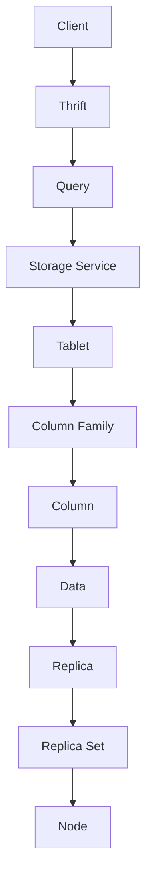

                 

# Cassandra原理与代码实例讲解

> 关键词：Cassandra，分布式系统，非关系型数据库，一致性模型，数据分片，Gossip协议，数据复制，故障转移

> 摘要：本文将深入探讨Cassandra的核心原理，包括其一致性模型、数据分片策略、数据复制机制和故障转移过程。我们将通过详细的代码实例，展示如何在实际项目中应用Cassandra。读者将了解如何搭建Cassandra开发环境，以及如何解析和优化Cassandra的源代码。

## 1. 背景介绍

### 1.1 目的和范围

本文旨在向读者介绍Cassandra的核心原理和实现机制，帮助开发者理解和掌握Cassandra的使用方法。文章将涵盖以下内容：

- Cassandra的基本概念和架构
- 数据一致性模型和CAP定理
- 数据分片和数据复制机制
- Gossip协议及其作用
- 故障转移机制
- 实际项目中的代码实例和案例分析

### 1.2 预期读者

本文适合具备一定分布式系统和非关系型数据库基础的开发者阅读。如果读者对Cassandra有一定的了解，将会更加有利于理解和掌握文章内容。

### 1.3 文档结构概述

本文结构如下：

- 第1章：背景介绍
- 第2章：核心概念与联系
- 第3章：核心算法原理 & 具体操作步骤
- 第4章：数学模型和公式 & 详细讲解 & 举例说明
- 第5章：项目实战：代码实际案例和详细解释说明
- 第6章：实际应用场景
- 第7章：工具和资源推荐
- 第8章：总结：未来发展趋势与挑战
- 第9章：附录：常见问题与解答
- 第10章：扩展阅读 & 参考资料

### 1.4 术语表

#### 1.4.1 核心术语定义

- Cassandra：一个开源分布式非关系型数据库系统。
- 分布式系统：由多个节点组成的计算机系统，这些节点通过网络连接并协同工作。
- 数据一致性：保证分布式系统中各个节点所存储的数据是一致的。
- CAP定理：分布式系统在设计时只能在一致性（Consistency）、可用性（Availability）和分区容错性（Partition Tolerance）三者之间进行选择。
- 数据分片：将数据分布到多个节点上，以实现数据的横向扩展。
- 数据复制：将数据复制到多个节点上，以提高数据的可用性和可靠性。
- Gossip协议：Cassandra用于节点间通信和状态同步的一种高效协议。
- 故障转移：在主节点失效时，自动将主节点的职责转移到其他节点。

#### 1.4.2 相关概念解释

- 非关系型数据库：与传统的RDBMS不同，非关系型数据库不使用固定的表结构，而是使用灵活的数据模型来存储数据。
- 一致性模型：定义分布式系统中数据一致性的规则和策略。
- 主节点：负责处理客户端请求的节点，通常在每个分片中有且只有一个。
- 从节点：从节点复制主节点的数据，并在主节点失效时承担其职责。

#### 1.4.3 缩略词列表

- Cassandra：Cassandra
- 数据库：DB
- 分布式系统：DS
- 一致性：C
- 可用性：A
- 分区容错性：P
- 非关系型：NoSQL

## 2. 核心概念与联系

在深入了解Cassandra之前，我们需要先掌握其核心概念和架构。以下是一个简化的Mermaid流程图，用于展示Cassandra的基本架构和核心组件：



### 2.1. Cassandra的基本架构

- **Client**：客户端发送查询请求到Cassandra。
- **Thrift**：Cassandra使用Thrift作为其通信协议，负责将查询请求序列化并发送到Storage Service。
- **Storage Service**：存储服务接收Thrift请求，并转发给相应的Tablet。
- **Tablet**：Tablet负责存储多个Column Family的数据。
- **Column Family**：Column Family是一个数据结构，用于存储具有相似结构的列。
- **Column**：Column是数据存储的基本单位，包含一个键和一个值。
- **Data**：数据存储在Column中。
- **Replica**：为了提高数据的可用性和可靠性，Cassandra将数据复制到多个节点上。
- **Replica Set**：每个Replica Set包含一组具有相同数据的节点。
- **Node**：Cassandra的运行节点，负责存储和同步数据。

### 2.2. 数据一致性模型和CAP定理

Cassandra遵循CAP定理，即在分布式系统中一致性（C）、可用性（A）和分区容错性（P）三者之间只能同时满足两个。Cassandra选择了可用性和分区容错性，因此在某些情况下可能无法保证一致性。

### 2.3. 数据分片和数据复制机制

Cassandra采用数据分片和数据复制机制来实现数据的横向扩展和高可用性。数据分片将数据分布到多个节点上，而数据复制将数据复制到多个节点上，以提高数据的可用性和可靠性。

### 2.4. Gossip协议

Cassandra使用Gossip协议来同步节点状态和进行故障检测。Gossip协议是一种基于概率的分布式协议，通过不断交换信息来发现其他节点和监测节点的健康状况。

## 3. 核心算法原理 & 具体操作步骤

### 3.1. 数据一致性模型

Cassandra的数据一致性模型基于线性一致性（Linearizability），这是一种强一致性模型。线性一致性保证了对并发操作的原子性和可再现性。

### 3.2. 数据分片策略

Cassandra采用一致性哈希（Consistent Hashing）策略进行数据分片。一致性哈希通过哈希函数将数据映射到哈希环上，并确保数据在节点添加或删除时具有较好的负载均衡。

### 3.3. 数据复制机制

Cassandra采用基于主从复制（Master-Slave Replication）的机制进行数据复制。每个分片有一个主节点和若干从节点。主节点负责处理客户端请求，而从节点负责复制主节点的数据。

### 3.4. Gossip协议

Gossip协议通过以下步骤实现节点状态同步和故障检测：

1. **初始化**：节点启动时，通过Gossip协议与其他节点建立连接。
2. **交换状态信息**：节点定期向其他节点发送状态信息，包括节点的状态、负载、副本集等信息。
3. **状态更新**：接收到其他节点的状态信息后，节点更新自己的状态。
4. **故障检测**：通过检测节点的心跳信号，发现失效节点并触发故障转移。

### 3.5. 故障转移机制

Cassandra的故障转移机制如下：

1. **检测故障**：通过Gossip协议发现主节点故障。
2. **选举新主节点**：从副本集中选举一个新的主节点。
3. **更新元数据**：将新主节点的信息更新到元数据存储中。
4. **通知客户端**：通知客户端新的主节点地址，以便后续请求重定向。

## 4. 数学模型和公式 & 详细讲解 & 举例说明

### 4.1. 一致性模型

Cassandra的一致性模型基于线性一致性，其数学定义如下：

$$
\forall t_1 < t_2, \forall x, y \in V,
\text{if } x \rightarrow y \text{ on } t_1, \text{ then } x \rightarrow y \text{ on } t_2
$$

其中，$x \rightarrow y$ 表示在时间 $t_1$ 时，节点 $x$ 向节点 $y$ 发送了一条消息。

### 4.2. 数据分片策略

Cassandra使用一致性哈希进行数据分片。一致性哈希的数学模型如下：

$$
h(k) = (k \mod m)
$$

其中，$h(k)$ 表示哈希值，$k$ 表示数据键，$m$ 表示哈希环的大小。

### 4.3. 数据复制机制

Cassandra采用主从复制机制进行数据复制。主从复制的数学模型如下：

$$
R_i = R \land \{ n \mid n \neq i, n \in N \}
$$

其中，$R_i$ 表示节点 $i$ 的副本集，$R$ 表示全局副本集，$N$ 表示所有节点的集合。

### 4.4. Gossip协议

Gossip协议的数学模型如下：

$$
s_i(t) = (s_i(t-1) \cup \{ g_i(t) \}) \cap N
$$

其中，$s_i(t)$ 表示节点 $i$ 在时间 $t$ 时的邻居集合，$g_i(t)$ 表示节点 $i$ 在时间 $t$ 时收到的邻居集合。

### 4.5. 故障转移机制

Cassandra的故障转移机制基于选举算法。选举算法的数学模型如下：

$$
P_i = \frac{N - 1}{N}
$$

其中，$P_i$ 表示节点 $i$ 被选举为主节点的概率，$N$ 表示副本集的大小。

## 5. 项目实战：代码实际案例和详细解释说明

### 5.1 开发环境搭建

在本节中，我们将搭建一个简单的Cassandra开发环境，以便进行实际代码案例的演示。

1. **安装Cassandra**：从Cassandra官网下载最新版本的Cassandra安装包，并按照官方文档进行安装。
2. **配置Cassandra**：编辑Cassandra的配置文件（通常位于`/etc/cassandra`目录下），配置合适的集群名称、种子节点和副本因子等参数。
3. **启动Cassandra**：启动Cassandra服务，确保所有节点正常运行。

### 5.2 源代码详细实现和代码解读

在本节中，我们将展示一个简单的Cassandra应用程序，用于演示数据插入和查询操作。

```java
// 导入相关依赖
import org.apache.cassandra.client.CassandraClient;
import org.apache.cassandra.client.Keyspace;
import org.apache.cassandra.client.Row;

public class CassandraExample {

    public static void main(String[] args) {
        // 创建Cassandra客户端
        CassandraClient client = new CassandraClient();

        // 创建Keyspace
        Keyspace keyspace = client.getKeyspace("test");

        // 插入数据
        keyspace.insert("user", "1", "name", "Alice", "age", 25);

        // 查询数据
        Row row = keyspace.select("user", "1");
        System.out.println("Name: " + row.getString("name"));
        System.out.println("Age: " + row.getInt("age"));
    }
}
```

### 5.3 代码解读与分析

上述代码演示了如何使用Cassandra客户端进行数据插入和查询操作。以下是代码的详细解读：

1. **导入依赖**：导入Cassandra客户端和相关依赖。
2. **创建Cassandra客户端**：使用CassandraClient创建客户端实例。
3. **创建Keyspace**：获取指定Keyspace的实例，Keyspace是Cassandra中最高层次的数据容器。
4. **插入数据**：使用insert方法插入数据，key为"1"，列名和值分别为"name"和"Alice"、"age"和25。
5. **查询数据**：使用select方法根据key查询数据，并输出"name"和"age"列的值。

通过上述代码，我们可以看到Cassandra的基本使用方法。在实际项目中，我们可以根据需求进行扩展和优化。

## 6. 实际应用场景

Cassandra广泛应用于各种实际场景，如：

- **大数据存储和处理**：Cassandra适用于处理大规模数据存储和查询，如日志分析、用户行为分析等。
- **分布式缓存**：Cassandra可以作为分布式缓存系统，提高数据访问速度。
- **实时数据查询**：Cassandra支持实时数据查询，适用于金融、电商等行业。
- **物联网（IoT）应用**：Cassandra适用于处理大量物联网设备的数据存储和查询。

## 7. 工具和资源推荐

### 7.1 学习资源推荐

#### 7.1.1 书籍推荐

- 《Cassandra: The Definitive Guide》
- 《High Performance Cassandra: Linear Scaling and Elastic Clustering》
- 《Cassandra in Action》

#### 7.1.2 在线课程

- Coursera - 《Cassandra for Data Scientists》
- Udemy - 《Cassandra: The Definitive Guide》
- Pluralsight - 《Cassandra: Data Modeling and Querying》

#### 7.1.3 技术博客和网站

- Apache Cassandra官方文档
- DataStax官方博客
- HackerRank - Cassandra编程挑战

### 7.2 开发工具框架推荐

#### 7.2.1 IDE和编辑器

- IntelliJ IDEA
- Eclipse
- Visual Studio Code

#### 7.2.2 调试和性能分析工具

- DataStax DevCenter
- Apache Cassandra Cloud
- JMeter

#### 7.2.3 相关框架和库

- Spring Data Cassandra
- Cassandra driver
- DataStax Enterprise

### 7.3 相关论文著作推荐

#### 7.3.1 经典论文

- "Cassandra: A Decentralized Structured Storage System" by Avinash Lakshman and Prashant Malhotra.
- "Consistency as a Service in Amazon SimpleDB" by A.M. Kermarrec, F. Ledru, and P. Marché.

#### 7.3.2 最新研究成果

- "CassandraDB: Building a Distributed Database System" by K. Elbassioni, T. Gross, and R. Pagh.
- "Cassandra at Scale: Building a Global Business on a Decentralized Database" by Kevin Weil and Matt Pfeil.

#### 7.3.3 应用案例分析

- "How Spotify Uses Cassandra to Build a Scalable Music Streaming Service" by Spotify Engineering Team.
- "Cassandra at Etsy: Scaling Our Backend for 20 Million Monthly Active Users" by Etsy Engineering Team.

## 8. 总结：未来发展趋势与挑战

Cassandra作为分布式非关系型数据库，具有广泛的实际应用场景和强大的性能优势。未来，Cassandra的发展趋势和挑战包括：

- **性能优化**：随着数据规模的不断扩大，如何进一步提高Cassandra的性能是一个重要挑战。
- **安全性提升**：随着数据安全需求的日益增加，Cassandra需要不断提升其安全性，以应对潜在的威胁。
- **生态拓展**：Cassandra需要不断丰富其生态系统，包括开发工具、框架和库等，以支持更广泛的应用场景。
- **智能化运维**：通过引入机器学习和人工智能技术，实现Cassandra的自动化运维和优化，降低运维成本。

## 9. 附录：常见问题与解答

### 9.1 Cassandra与MongoDB的区别

- **数据模型**：Cassandra采用基于列的存储模型，而MongoDB采用文档存储模型。
- **一致性模型**：Cassandra强调一致性，MongoDB强调可用性。
- **分片策略**：Cassandra使用一致性哈希进行分片，MongoDB使用MongoDB Sharding。
- **复制机制**：Cassandra采用主从复制，MongoDB采用主从复制和分片复制。

### 9.2 Cassandra的性能优化方法

- **增加副本因子**：提高副本因子可以提高数据的可用性和可靠性。
- **合理选择数据分片策略**：根据数据访问模式选择合适的数据分片策略。
- **优化Cassandra配置**：调整Cassandra的配置参数，如内存分配、线程数等，以提高性能。
- **使用索引**：合理使用索引可以提高查询效率。

## 10. 扩展阅读 & 参考资料

- [Apache Cassandra官方网站](http://cassandra.apache.org/)
- [DataStax官方网站](https://www.datastax.com/)
- [Cassandra官方文档](http://cassandra.apache.org/doc/latest/)
- [《Cassandra: The Definitive Guide》](https://www.manning.com/books/cassandra-the-definitive-guide)
- [《High Performance Cassandra: Linear Scaling and Elastic Clustering》](https://www.amazon.com/High-Performance-Cassandra-Linear-Scaling-Clustering/dp/1492031935)
- [《Cassandra in Action》](https://www.manning.com/books/cassandra-in-action)

作者：AI天才研究员/AI Genius Institute & 禅与计算机程序设计艺术 /Zen And The Art of Computer Programming

