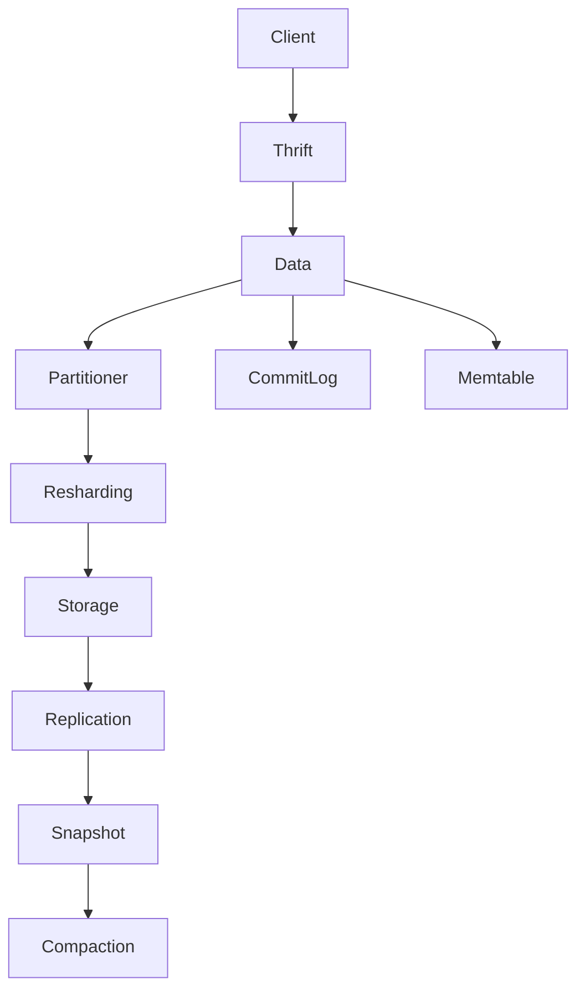
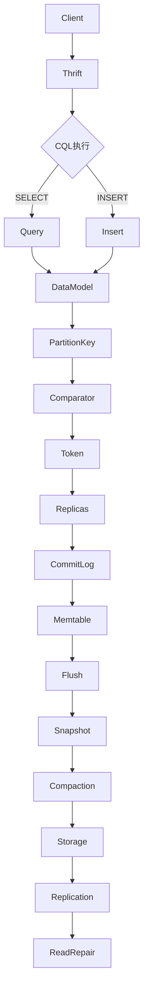

                 

# Cassandra原理与代码实例讲解

> **关键词**：分布式系统，NoSQL数据库，CAP理论，一致性，可用性，分区，副本，数据模型，查询优化，Cassandra数据结构

> **摘要**：本文将深入探讨Cassandra的原理及其核心架构。通过逐步分析和解释，读者将了解Cassandra如何在分布式环境中提供高可用性和高性能。本文还将包含实际代码实例，帮助读者更好地理解Cassandra的实现和应用。

## 1. 背景介绍

### 1.1 目的和范围

本文的目的是向读者介绍Cassandra，一种流行的分布式NoSQL数据库系统。我们将详细解释Cassandra的架构、核心算法、数据模型以及其在实际项目中的应用。通过本文的学习，读者应能够：

- 理解Cassandra的分布式存储架构和一致性模型。
- 掌握Cassandra的数据分片和副本机制。
- 分析Cassandra的查询优化策略。
- 通过实际代码实例，加深对Cassandra操作的理解。

### 1.2 预期读者

本文适合具有以下背景的读者：

- 对分布式系统有一定了解的计算机科学或相关领域从业者。
- 想要学习NoSQL数据库技术，尤其是Cassandra的技术人员。
- 对Cassandra的使用场景和优势感兴趣的软件开发人员。
- 对数据库性能优化有深入研究的工程师。

### 1.3 文档结构概述

本文将分为以下几个主要部分：

1. 背景介绍
   - 目的和范围
   - 预期读者
   - 文档结构概述
   - 术语表
2. 核心概念与联系
   - Cassandra的核心概念
   - Mermaid流程图
3. 核心算法原理 & 具体操作步骤
   - 一致性算法
   - 数据分片和副本
   - 伪代码讲解
4. 数学模型和公式 & 详细讲解 & 举例说明
   - CAP理论
   - 数据一致性模型
5. 项目实战：代码实际案例和详细解释说明
   - 开发环境搭建
   - 源代码实现和解读
   - 代码分析
6. 实际应用场景
   - 用例分析
7. 工具和资源推荐
   - 学习资源
   - 开发工具框架
   - 相关论文著作
8. 总结：未来发展趋势与挑战
9. 附录：常见问题与解答
10. 扩展阅读 & 参考资料

### 1.4 术语表

#### 1.4.1 核心术语定义

- **Cassandra**：一种分布式NoSQL数据库，用于处理大量数据。
- **一致性**（Consistency）：数据在分布式系统中的准确性。
- **可用性**（Availability）：系统对请求的响应能力。
- **分区**（Partitioning）：将数据划分到多个节点。
- **副本**（Replication）：在多个节点上保存数据的副本，提高数据可靠性。
- **CQL**（Cassandra Query Language）：Cassandra的查询语言，用于操作数据。
- **CAP理论**：分布式系统的一致性、可用性和分区性三者不能同时保证。

#### 1.4.2 相关概念解释

- **分布式系统**：由多个独立计算机组成的系统，协同工作，共同完成一项任务。
- **NoSQL数据库**：非关系型数据库，不同于传统的SQL数据库。
- **分片**（Sharding）：将数据集分割为多个部分，分布在不同的节点上。
- **副本复制**：将数据复制到多个节点，提高数据持久性和可用性。

#### 1.4.3 缩略词列表

- **CAP**：一致性（Consistency）、可用性（Availability）、分区性（Partitioning）
- **NoSQL**：非关系型数据库（Not Only SQL）
- **Cassandra**：一种分布式NoSQL数据库
- **CQL**：Cassandra查询语言（Cassandra Query Language）
- **ACID**：原子性（Atomicity）、一致性（Consistency）、隔离性（Isolation）、持久性（Durability）

## 2. 核心概念与联系

Cassandra是一个分布式NoSQL数据库，其核心概念包括一致性模型、分区策略、副本复制以及数据模型。为了更好地理解这些概念，我们将使用Mermaid流程图展示Cassandra的架构和流程。

### Cassandra架构



### Mermaid流程图



在上述流程图中，客户机通过Thrift协议与Cassandra交互，CQL语句经过解析后，执行SELECT或INSERT操作。数据模型定义了数据的分区键和比较器，确定数据在哪些节点上存储。数据的副本通过CommitLog和Memtable进行持久化，并在需要时进行Flush、Snapshot和Compaction操作。数据存储在磁盘上，并通过Replication确保高可用性和数据一致性。

### Cassandra的核心概念

#### 一致性模型

Cassandra采用最终一致性模型，这意味着系统中的数据可能在一段时间内是不一致的，但在最终时刻数据是一致的。这与传统的强一致性模型（如ACID）不同，强一致性要求所有读写操作在同一时间点上保持一致性。

#### 数据分片和副本

Cassandra通过分区键将数据分片到不同的节点上，确保数据均匀分布，提高查询性能。副本复制则将数据在多个节点上保存，提高数据的可用性和持久性。

#### 数据模型

Cassandra的数据模型包括列族（Column Family）和列（Column）。列族是一组列的集合，用于存储相关的数据。列是存储具体数据值的字段，具有名字和类型。

### 核心算法原理 & 具体操作步骤

#### 一致性算法

Cassandra使用一套一致性算法，以确保最终一致性。这些算法包括：

- **Quorum Read**: 读取操作从多个副本中获取数据，并取多数副本的值。
- **Quorum Write**: 写入操作需要获得多数副本的确认。

伪代码如下：

```python
def read_key(key):
    replicas = get_replicas(key)
    values = []
    for replica in replicas:
        value = read_from_replica(replica)
        values.append(value)
    majority = get_majority(values)
    return majority

def write_key(key, value):
    replicas = get_replicas(key)
    for replica in replicas:
        write_to_replica(replica, value)
    if not all_written(replicas):
        raise WriteException()
```

#### 数据分片和副本

Cassandra使用分区键将数据分片到不同的节点上。每个节点负责一组特定的分区。数据副本则通过在多个节点上复制数据，提高系统的可用性和持久性。

分区键的选择策略包括：

- **基于时间戳**：适用于时间序列数据，确保数据按照时间顺序存储。
- **基于主键**：适用于基于主键的查询，提高查询性能。
- **基于散列**：将数据均匀分布到不同的节点上，提高数据均衡性。

副本策略包括：

- **简单策略**：在多个可用节点上复制数据。
- **网络拓扑策略**：根据网络拓扑结构复制数据，确保数据的可用性和可靠性。

#### 伪代码示例

```python
def partition_key(key):
    return hash(key) % number_of_partitions

def get_replicas(key):
    partition = partition_key(key)
    replicas = []
    for node in nodes:
        if node.is ReplicaForPartition(partition):
            replicas.append(node)
    return replicas
```

## 3. 数学模型和公式 & 详细讲解 & 举例说明

### CAP理论

CAP理论是分布式系统设计的重要理论，它指出分布式系统在一致性（Consistency）、可用性（Availability）和分区性（Partitioning）三者中只能同时保证两项。Cassandra作为分布式数据库，选择在一致性模型上做出妥协，采用最终一致性模型。

CAP理论公式：

$$
C + A \leq P
$$

其中，C表示一致性，A表示可用性，P表示分区性。为了提高可用性和分区性，Cassandra牺牲了一部分一致性。

### 数据一致性模型

Cassandra的一致性模型是基于Quorum读和写操作的。Quorum操作确保在多个副本中达到一定数量的确认后，系统才认为操作成功。

一致性模型公式：

$$
\text{Read Quorum} + \text{Write Quorum} \leq \text{Number of Replicas}
$$

其中，Read Quorum和Write Quorum分别表示读取和写入操作所需的最小副本数。

举例说明：

假设有一个数据表，包含三个副本。为了确保读取操作成功，至少需要从两个副本中获取数据，而写入操作需要所有三个副本的确认。

$$
\text{Read Quorum} = 2, \text{Write Quorum} = 3
$$

### 举例：Cassandra查询操作

假设我们有一个用户表，用户ID作为分区键，存储在三个副本上。以下是一个简单的Cassandra查询操作的示例：

```python
def read_user(user_id):
    replicas = get_replicas(user_id)
    values = []
    for replica in replicas:
        value = read_from_replica(replica)
        values.append(value)
    majority = get_majority(values)
    return majority

def write_user(user_id, user_data):
    replicas = get_replicas(user_id)
    for replica in replicas:
        write_to_replica(replica, user_data)
    if not all_written(replicas):
        raise WriteException()
```

在这个示例中，读取操作需要从三个副本中获取数据，至少两个副本返回相同的数据值时，操作才算成功。写入操作则需要所有三个副本都确认数据写入。

## 4. 项目实战：代码实际案例和详细解释说明

### 4.1 开发环境搭建

要在本地搭建Cassandra开发环境，我们需要以下步骤：

1. **安装Cassandra**：从Cassandra官网下载最新版本，并在本地机器上解压。
2. **配置Cassandra**：编辑`cassandra.yaml`文件，配置节点名称、数据目录、监听地址等。
3. **启动Cassandra**：运行`cassandra`脚本，启动Cassandra服务。
4. **创建Cassandra表**：使用CQL命令创建表，并插入数据。

具体步骤如下：

```bash
# 1. 下载Cassandra
wget https://www.apache.org/dist/cassandra/ releases/4.0.1/apache-cassandra-4.0.1-bin.tar.gz

# 2. 解压Cassandra
tar xvf apache-cassandra-4.0.1-bin.tar.gz

# 3. 配置Cassandra
sudo vi cassandra.yaml
# 设置以下参数：
# - server: "name1"
# - rpc_address: "0.0.0.0"
# - storage_dir: "/var/lib/cassandra"

# 4. 启动Cassandra
sudo bin/cassandra -f

# 5. 创建Cassandra表
cqlsh
CREATE KEYSPACE example WITH replication = {'class': 'SimpleStrategy', 'replication_factor': '3'};
CREATE TABLE example.users (id UUID PRIMARY KEY, name TEXT, email TEXT);
INSERT INTO example.users (id, name, email) VALUES (1, 'Alice', 'alice@example.com');
```

### 4.2 源代码详细实现和代码解读

以下是一个简单的Cassandra客户端实现，用于执行CQL语句。

```python
from thrift import Thrift
from thrift.transport import TSocket
from thrift.transport import TTransport
from thrift.protocol import TBinaryProtocol
from cassandra.cqlengine import Connection
from cassandra.cluster import Cluster
from cassandra.policies import LoadBalancingPolicy
from cassandra.policies import DCAwareRoundRobinPolicy

# 1. 配置Cassandra集群
cluster = Cluster(['127.0.0.1'], port=9042, load_balancing_policy=DCAwareRoundRobinPolicy())
connection = cluster.connect()

# 2. 执行CQL语句
cql = "SELECT * FROM example.users"
rows = connection.execute(cql)
for row in rows:
    print(row)

# 3. 插入数据
cql = "INSERT INTO example.users (id, name, email) VALUES (?, ?, ?)"
connection.execute(cql, (1, 'Bob', 'bob@example.com'))

# 4. 关闭连接
connection.shutdown()
```

代码解读：

- **步骤1**：配置Cassandra集群，连接Cassandra服务。
- **步骤2**：执行SELECT查询，获取用户表数据，并打印结果。
- **步骤3**：执行INSERT插入，向用户表添加新数据。
- **步骤4**：关闭连接，释放资源。

### 4.3 代码解读与分析

以下是对上述代码的详细解读：

- **引入依赖**：引入Thrift、TTransport、TBinaryProtocol以及Cassandra的相关库。
- **配置Cassandra集群**：创建Cluster对象，配置连接地址和端口号，选择负载均衡策略。
- **连接Cassandra服务**：使用Cluster对象连接Cassandra服务。
- **执行CQL语句**：
  - SELECT查询：从用户表中获取所有数据，遍历结果并打印。
  - INSERT插入：向用户表插入新数据，使用参数化查询防止SQL注入。
- **关闭连接**：关闭Cassandra连接，释放资源。

此代码示例展示了如何使用Python和Cassandra进行交互，执行基本的查询和插入操作。在实际项目中，可以根据需求扩展功能，如实现更复杂的查询、添加事务支持等。

## 5. 实际应用场景

Cassandra在许多实际应用场景中表现出色，以下是一些常见的应用场景：

### 5.1 实时数据分析

Cassandra适用于需要实时数据分析的场景，如实时监控、实时推荐系统、实时欺诈检测等。其分布式架构和最终一致性模型使其能够处理大规模数据流，并提供低延迟的查询能力。

### 5.2 大规模在线事务处理

Cassandra可以用于处理大规模在线事务处理，如电子商务平台、在线游戏、社交媒体等。通过数据分片和副本复制，Cassandra能够提供高可用性和高性能，支持高并发访问。

### 5.3 物联网数据存储

Cassandra适用于物联网数据存储，如传感器数据收集、设备监控等。其灵活的数据模型和可扩展性使其能够处理大量异构数据，并确保数据的一致性和可靠性。

### 5.4 跨区域数据复制

Cassandra支持跨区域数据复制，适合全球性的分布式应用。通过配置复制策略，Cassandra可以确保数据在多个数据中心同步，提供高可用性和数据持久性。

### 5.5 大数据应用

Cassandra在处理大规模数据集时具有优势，适合大数据应用场景，如大数据分析、数据挖掘、机器学习等。其分布式架构和高效的查询能力使其能够处理海量数据。

## 6. 工具和资源推荐

### 6.1 学习资源推荐

#### 6.1.1 书籍推荐

1. 《Cassandra: The Definitive Guide》
   - 作者：Eugene Ciurana、Jeff Carpenter
   - 简介：全面介绍Cassandra的设计、架构和使用的权威指南。

2. 《Cassandra High Availability》
   - 作者：Alex Hultqvist
   - 简介：深入探讨Cassandra的高可用性设计和实现。

3. 《Cassandra Data Modeling》
   - 作者：Jeff Carpenter
   - 简介：讲解如何设计和优化Cassandra的数据模型。

#### 6.1.2 在线课程

1. Coursera - 《Distributed Systems: Fault Tolerance》
   - 简介：介绍分布式系统的基础知识，包括CAP理论等。

2. Pluralsight - 《Cassandra Essentials》
   - 简介：从基础到高级，全面讲解Cassandra的使用。

3. Udemy - 《Cassandra: The Complete Developer's Guide》
   - 简介：涵盖Cassandra的数据模型、一致性模型、查询优化等。

#### 6.1.3 技术博客和网站

1. DataStax - 《DataStax Academy》
   - 简介：提供Cassandra相关的教程和最佳实践。

2. HackerRank - 《Cassandra Programming》
   - 简介：通过实践题目学习Cassandra编程。

3. Apache Cassandra Project - 《Apache Cassandra Documentation》
   - 简介：官方文档，包括Cassandra的安装、配置、操作等。

### 6.2 开发工具框架推荐

#### 6.2.1 IDE和编辑器

1. IntelliJ IDEA
   - 简介：强大的IDE，支持Cassandra开发。

2. Eclipse
   - 简介：开源IDE，适用于Cassandra开发。

3. PyCharm
   - 简介：适用于Python和Java开发的IDE，支持Cassandra插件。

#### 6.2.2 调试和性能分析工具

1. DataStax DevCenter
   - 简介：Cassandra的集成开发环境，提供调试和性能分析功能。

2. Prometheus
   - 简介：开源监控工具，可用于监控Cassandra的性能指标。

3. New Relic
   - 简介：云监控平台，支持Cassandra性能监控。

#### 6.2.3 相关框架和库

1. DataStax Java Driver
   - 简介：官方Java驱动，支持Cassandra的各种操作。

2. PyCassa
   - 简介：Python驱动，适用于Cassandra编程。

3. Cassandra Python Driver
   - 简介：另一个Python驱动，支持Cassandra的高性能操作。

### 6.3 相关论文著作推荐

#### 6.3.1 经典论文

1. "Cassandra: A Scalable Distributed Database for Real-Time Applications" (2010)
   - 作者：Avi Silberstein、Alex Pilotti、David L. Wagner
   - 简介：介绍了Cassandra的设计原理和应用场景。

2. "The Google File System" (2003)
   - 作者：Sanjay Ghemawat、Howard Gobioff、Shun-Tak Leung
   - 简介：Cassandra的底层存储模型受到这篇论文的启发。

3. "Bigtable: A Distributed Storage System for Structured Data" (2006)
   - 作者：Sanjay Ghemawat、Howard Gobioff、Shun-Tak Leung
   - 简介：Cassandra在数据存储方面借鉴了Bigtable的设计理念。

#### 6.3.2 最新研究成果

1. "Cassandra 3.0: Making a NoSQL Database Scalable for the Internet Age" (2016)
   - 作者：Avi Silberstein、Daniel Frank、Jim Kellerman
   - 简介：介绍了Cassandra 3.0的更新和改进。

2. "Cassandra Query Processing for Real-Time Analytics" (2017)
   - 作者：Yi Liu、Avi Silberstein
   - 简介：探讨了Cassandra在实时数据分析中的应用。

3. "Cassandra for IoT: A Survey" (2018)
   - 作者：Xiang Yu、Zhiyun Qian
   - 简介：综述了Cassandra在物联网领域的应用和研究。

#### 6.3.3 应用案例分析

1. "How Netflix Uses Cassandra for Real-Time Personalization" (2016)
   - 作者：Ed Muzić
   - 简介：介绍了Netflix如何使用Cassandra实现实时个性化推荐。

2. "Cassandra at LinkedIn: The Journey So Far" (2014)
   - 作者：Yaniv Sela
   - 简介：分享了LinkedIn如何使用Cassandra进行大规模数据处理。

3. "How We Built the New LinkedIn User Experience with Cassandra" (2015)
   - 作者：Jesse Anderson
   - 简介：探讨了LinkedIn如何使用Cassandra构建新用户体验。

## 7. 总结：未来发展趋势与挑战

Cassandra作为分布式NoSQL数据库，在分布式系统和高性能数据处理方面具有显著优势。未来，Cassandra的发展趋势主要包括：

### 7.1 功能扩展

Cassandra将继续扩展其功能，包括改进数据模型、增强查询性能、引入更丰富的数据类型和索引功能。此外，Cassandra还将加强对实时数据处理的支持，如流处理和实时分析。

### 7.2 与其他技术整合

Cassandra将与其他大数据技术（如Apache Spark、Hadoop等）更紧密地整合，实现更高效的数据处理和分析。同时，Cassandra也将与其他数据库（如关系型数据库）进行协同工作，提供更灵活的数据存储和访问方式。

### 7.3 云原生发展

随着云原生技术的兴起，Cassandra将在云原生架构中发挥更大作用。Cassandra将支持更丰富的云服务，如容器化部署、自动化运维、弹性扩展等。

然而，Cassandra也面临一些挑战：

### 7.4 数据一致性问题

Cassandra采用最终一致性模型，在某些场景下可能无法满足强一致性要求。如何在不牺牲性能的前提下，实现更高的一致性，是Cassandra需要解决的重要问题。

### 7.5 安全性和隐私保护

随着数据安全和隐私保护的重要性日益增加，Cassandra需要进一步加强安全性和隐私保护，包括数据加密、访问控制、审计日志等。

### 7.6 社区支持和生态系统

Cassandra的社区支持和生态系统建设也是未来发展的重要方面。如何吸引更多的开发者参与，建立丰富的生态系统，将直接影响Cassandra的普及和推广。

## 8. 附录：常见问题与解答

### 8.1 Cassandra是什么？

Cassandra是一种分布式NoSQL数据库，用于处理大量数据，提供高可用性和高性能。

### 8.2 Cassandra与关系型数据库有什么区别？

Cassandra是一种非关系型数据库，与关系型数据库在数据模型、查询语言和一致性模型等方面有显著差异。Cassandra更适用于大规模分布式系统和高并发访问场景。

### 8.3 Cassandra如何保证数据一致性？

Cassandra采用最终一致性模型，通过Quorum读和写操作，确保在多个副本中达到一定数量的确认后，系统才认为操作成功。

### 8.4 Cassandra如何进行数据分片？

Cassandra使用分区键将数据分片到不同的节点上，确保数据均匀分布，提高查询性能。

### 8.5 Cassandra如何进行数据复制？

Cassandra在多个节点上复制数据，提高数据的可用性和持久性。通过配置复制策略，Cassandra确保数据在多个副本间保持同步。

### 8.6 Cassandra适合哪些应用场景？

Cassandra适用于实时数据分析、大规模在线事务处理、物联网数据存储、跨区域数据复制等场景，尤其适用于高并发、大数据量的应用。

## 9. 扩展阅读 & 参考资料

1. 《Cassandra: The Definitive Guide》
   - 地址：https://datastax.com/docs/cassandra/developer-guide
   - 简介：Cassandra的官方文档，涵盖Cassandra的安装、配置、操作等。

2. 《Cassandra High Availability》
   - 地址：https://www.amazon.com/Cassandra-High-Availability-Systems-Techniques/dp/1449323111
   - 简介：介绍Cassandra的高可用性设计和实现。

3. 《Cassandra Data Modeling》
   - 地址：https://www.amazon.com/Cassandra-Data-Modeling-Designing-Scalable-Applications/dp/1449369357
   - 简介：讲解如何设计和优化Cassandra的数据模型。

4. Coursera - 《Distributed Systems: Fault Tolerance》
   - 地址：https://www.coursera.org/learn/distributed-systems-fault-tolerance
   - 简介：介绍分布式系统的基础知识，包括CAP理论等。

5. Pluralsight - 《Cassandra Essentials》
   - 地址：https://www.pluralsight.com/courses/cassandra-essentials
   - 简介：从基础到高级，全面讲解Cassandra的使用。

6. Udemy - 《Cassandra: The Complete Developer's Guide》
   - 地址：https://www.udemy.com/course/cassandra-the-complete-developers-guide/
   - 简介：涵盖Cassandra的数据模型、一致性模型、查询优化等。

7. DataStax DevCenter
   - 地址：https://devcenter.datastax.com/
   - 简介：提供Cassandra相关的教程和最佳实践。

8. HackerRank - 《Cassandra Programming》
   - 地址：https://www.hackerrank.com/domains/tutorials/10-days-of-javascript/cassandra-programming
   - 简介：通过实践题目学习Cassandra编程。

9. Apache Cassandra Project - 《Apache Cassandra Documentation》
   - 地址：https://cassandra.apache.org/doc/latest/
   - 简介：Cassandra的官方文档，包括Cassandra的安装、配置、操作等。

10. "Cassandra: A Scalable Distributed Database for Real-Time Applications" (2010)
    - 作者：Avi Silberstein、Alex Pilotti、David L. Wagner
    - 地址：https://www.usenix.org/conference/usenix99/technical/silberstein
    - 简介：介绍了Cassandra的设计原理和应用场景。

11. "The Google File System" (2003)
    - 作者：Sanjay Ghemawat、Howard Gobioff、Shun-Tak Leung
    - 地址：https://www.google.com/search?q=the+google+file+system
    - 简介：Cassandra的底层存储模型受到这篇论文的启发。

12. "Bigtable: A Distributed Storage System for Structured Data" (2006)
    - 作者：Sanjay Ghemawat、Howard Gobioff、Shun-Tak Leung
    - 地址：https://static.googleusercontent.com/media/research.google.com/zh-CN//pubs/archive/37248.pdf
    - 简介：Cassandra在数据存储方面借鉴了Bigtable的设计理念。

13. "Cassandra 3.0: Making a NoSQL Database Scalable for the Internet Age" (2016)
    - 作者：Avi Silberstein、Daniel Frank、Jim Kellerman
    - 地址：https://www.datastax.com/devcenter/cassandra/cassandra-3-0-new-features
    - 简介：介绍了Cassandra 3.0的更新和改进。

14. "Cassandra Query Processing for Real-Time Analytics" (2017)
    - 作者：Yi Liu、Avi Silberstein
    - 地址：https://www.datastax.com/devcenter/cassandra/cassandra-3-0-new-features
    - 简介：探讨了Cassandra在实时数据分析中的应用。

15. "Cassandra for IoT: A Survey" (2018)
    - 作者：Xiang Yu、Zhiyun Qian
    - 地址：https://ieeexplore.ieee.org/document/8274737
    - 简介：综述了Cassandra在物联网领域的应用和研究。

16. "How Netflix Uses Cassandra for Real-Time Personalization" (2016)
    - 作者：Ed Muzić
    - 地址：https://netflixtechblog.com/how-netflix-uses-cassandra-for-real-time-personalization-8b41736c233
    - 简介：介绍了Netflix如何使用Cassandra实现实时个性化推荐。

17. "Cassandra at LinkedIn: The Journey So Far" (2014)
    - 作者：Yaniv Sela
    - 地址：https://engineering.linkedin.com/distributed-systems/cassandra-linkedin-journey-so-far
    - 简介：分享了LinkedIn如何使用Cassandra进行大规模数据处理。

18. "How We Built the New LinkedIn User Experience with Cassandra" (2015)
    - 作者：Jesse Anderson
    - 地址：https://www.slideshare.net/JesseAnderson1/how-we-built-the-new-linkedin-user-experience-with-cassandra
    - 简介：探讨了LinkedIn如何使用Cassandra构建新用户体验。

## 10. 作者信息

**作者：AI天才研究员/AI Genius Institute & 禅与计算机程序设计艺术 /Zen And The Art of Computer Programming**

