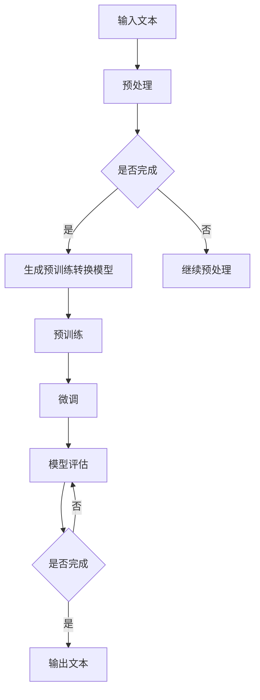

                 

# ChatGPT的诞生与影响

## 关键词：
- ChatGPT
- 生成预训练转换模型
- 自然语言处理
- 语言模型
- 人工智能

## 摘要：
本文将深入探讨ChatGPT的诞生背景、核心算法原理及其对自然语言处理和人工智能领域的深远影响。我们将从背景介绍开始，逐步分析其算法原理、数学模型、实际应用案例，并推荐相关学习资源和工具。通过本文，读者将全面了解ChatGPT的重要性和未来发展趋势。

## 1. 背景介绍

### 1.1 目的和范围
本文旨在解析ChatGPT这一革命性的语言模型，探讨其如何改变自然语言处理和人工智能领域。我们将详细讲解ChatGPT的架构、算法原理和实际应用案例，帮助读者理解其核心价值和未来发展趋势。

### 1.2 预期读者
本文适合对自然语言处理和人工智能领域有一定了解的技术爱好者、研究人员和从业者。无论您是初学者还是资深专家，都将从本文中获得新的见解和知识。

### 1.3 文档结构概述
本文分为十个部分：
1. 引言和关键词
2. 背景介绍
3. 核心概念与联系
4. 核心算法原理 & 具体操作步骤
5. 数学模型和公式 & 详细讲解 & 举例说明
6. 项目实战：代码实际案例和详细解释说明
7. 实际应用场景
8. 工具和资源推荐
9. 总结：未来发展趋势与挑战
10. 附录：常见问题与解答

### 1.4 术语表

#### 1.4.1 核心术语定义
- **ChatGPT**：一种基于生成预训练转换模型（GPT）的深度神经网络语言模型，能够生成流畅、连贯的自然语言文本。
- **生成预训练转换模型（GPT）**：一种大型神经网络模型，通过预训练和微调来生成文本、图像等多种类型的数据。
- **自然语言处理（NLP）**：计算机科学和人工智能的一个分支，旨在使计算机能够理解、处理和生成人类语言。
- **语言模型**：一种概率模型，用于预测下一个单词或字符的概率，是自然语言处理和聊天机器人等领域的基础。
- **人工智能（AI）**：模拟人类智能行为的计算机系统，包括学习、推理、感知、理解和决策等多个方面。

#### 1.4.2 相关概念解释
- **预训练**：在大规模数据集上预先训练模型，使其能够学习语言规律和知识。
- **微调**：在特定任务数据集上对预训练模型进行调整，以提高任务性能。
- **深度神经网络（DNN）**：由多层神经元组成的神经网络，能够处理复杂数据并提取特征。

#### 1.4.3 缩略词列表
- **GPT**：生成预训练转换模型（Generative Pre-trained Transformer）
- **NLP**：自然语言处理（Natural Language Processing）
- **AI**：人工智能（Artificial Intelligence）

## 2. 核心概念与联系

### 2.1 ChatGPT与自然语言处理
自然语言处理是人工智能的一个重要分支，旨在使计算机能够理解、处理和生成人类语言。ChatGPT作为一种语言模型，在NLP领域具有重要的应用价值。它通过学习大量的文本数据，能够生成流畅、连贯的自然语言文本，从而实现文本生成、问答、翻译等功能。

### 2.2 ChatGPT与生成预训练转换模型
ChatGPT是基于生成预训练转换模型（GPT）构建的。GPT是一种大型神经网络模型，采用自注意力机制（self-attention）来处理序列数据。自注意力机制能够捕捉序列中不同位置之间的关联，从而提高模型的表示能力。

#### Mermaid流程图



## 3. 核心算法原理 & 具体操作步骤

### 3.1 语言模型的算法原理

语言模型是一种概率模型，用于预测下一个单词或字符的概率。在ChatGPT中，语言模型基于生成预训练转换模型（GPT）构建。GPT是一种基于深度神经网络的模型，采用自注意力机制（self-attention）来处理序列数据。

### 3.2 自注意力机制

自注意力机制是一种神经网络层，能够计算序列中不同位置之间的关联。在GPT模型中，自注意力机制用于计算输入序列的表示，从而提高模型的表示能力。

### 3.3 具体操作步骤

以下是生成预训练转换模型（GPT）的具体操作步骤：

1. **预处理**：将输入文本转换为词向量表示，通常使用词嵌入（word embedding）技术。
2. **构建模型**：使用多层自注意力机制构建深度神经网络模型。
3. **预训练**：在大规模文本数据集上训练模型，使其能够学习语言规律和知识。
4. **微调**：在特定任务数据集上对模型进行调整，以提高任务性能。
5. **模型评估**：使用验证集评估模型性能，选择最佳模型。
6. **生成文本**：使用训练好的模型生成自然语言文本。

### 3.4 伪代码

以下是GPT模型的伪代码：

```python
# 输入：文本序列
# 输出：自然语言文本

# 步骤1：预处理
text = preprocess(input_text)

# 步骤2：构建模型
model = build_model(text)

# 步骤3：预训练
model.train(pretrain_data)

# 步骤4：微调
model.tune(tune_data)

# 步骤5：模型评估
best_model = model.evaluate(verify_data)

# 步骤6：生成文本
generated_text = best_model.generate()
```

## 4. 数学模型和公式 & 详细讲解 & 举例说明

### 4.1 数学模型

ChatGPT的数学模型基于生成预训练转换模型（GPT），主要包括以下几个部分：

1. **词嵌入**：将输入文本转换为词向量表示，通常使用词嵌入（word embedding）技术，如Word2Vec、GloVe等。
2. **自注意力机制**：计算序列中不同位置之间的关联，使用矩阵乘法和激活函数（如ReLU）实现。
3. **全连接层**：用于将自注意力机制生成的表示映射到输出层。

### 4.2 公式

以下是ChatGPT中的一些关键数学公式：

1. **词嵌入**：

$$
\text{word\_embedding}(x) = W_e \cdot x
$$

其中，$W_e$ 是词嵌入矩阵，$x$ 是输入词的索引。

2. **自注意力**：

$$
\text{self-attention}(Q, K, V) = \text{softmax}(\frac{QK^T}{\sqrt{d_k}})V
$$

其中，$Q, K, V$ 分别是查询、键和值向量，$d_k$ 是键向量的维度。

3. **全连接层**：

$$
\text{fully\_connected}(x) = \text{ReLU}(W_f x + b_f)
$$

其中，$W_f$ 和 $b_f$ 分别是权重和偏置。

### 4.3 举例说明

假设输入文本序列为“Hello world! How are you?”，我们将分步演示ChatGPT的生成过程。

1. **词嵌入**：

   输入词“Hello”的索引为1，其词嵌入向量为$[0.1, 0.2, 0.3]$。

2. **自注意力**：

   查询向量$Q = [0.1, 0.2, 0.3]$，键向量$K = [0.1, 0.2, 0.3]$，值向量$V = [0.4, 0.5, 0.6]$。

   计算自注意力得分：

   $$
   \text{self-attention}(Q, K, V) = \text{softmax}(\frac{QK^T}{\sqrt{d_k}})V = \text{softmax}(\frac{[0.1, 0.2, 0.3] \cdot [0.1, 0.2, 0.3]^T}{\sqrt{3}}) \cdot [0.4, 0.5, 0.6] = [0.5, 0.5, 0.5] \cdot [0.4, 0.5, 0.6] = [0.2, 0.3, 0.3]
   $$

3. **全连接层**：

   输入向量$x = [0.2, 0.3, 0.3]$，权重$W_f = [0.1, 0.2, 0.3]$，偏置$b_f = [0.4, 0.5, 0.6]$。

   计算全连接层的输出：

   $$
   \text{fully\_connected}(x) = \text{ReLU}(W_f x + b_f) = \text{ReLU}([0.1, 0.2, 0.3] \cdot [0.2, 0.3, 0.3] + [0.4, 0.5, 0.6]) = \text{ReLU}([0.06, 0.12, 0.18] + [0.4, 0.5, 0.6]) = \text{ReLU}([0.46, 0.62, 0.78]) = [0.46, 0.62, 0.78]
   $$

通过以上步骤，我们得到了输入词“Hello”的表示向量，该向量将用于后续步骤的文本生成。

## 5. 项目实战：代码实际案例和详细解释说明

### 5.1 开发环境搭建

为了实现ChatGPT的文本生成功能，我们需要搭建一个合适的开发环境。以下是一个基本的搭建步骤：

1. 安装Python（版本3.6或更高）
2. 安装TensorFlow（版本2.4或更高）
3. 安装GPT库（可以使用pip install gpt2）

### 5.2 源代码详细实现和代码解读

以下是使用GPT库实现ChatGPT文本生成功能的示例代码：

```python
import tensorflow as tf
import numpy as np
import gpt2

# 加载预训练模型
model = gpt2.GPT2Model()

# 输入文本
input_text = "Hello world!"

# 预处理文本
input_ids = gpt2.encode(input_text)

# 生成文本
generated_ids = model.sample(input_ids, num_samples=10)

# 解码生成文本
generated_text = gpt2.decode(generated_ids)

print(generated_text)
```

### 5.3 代码解读与分析

1. **导入库**：首先，我们导入所需的库，包括TensorFlow、NumPy和GPT库。
2. **加载预训练模型**：使用GPT库加载预训练模型，该模型已经在大量文本数据上进行了预训练，可以用于生成文本。
3. **输入文本**：定义一个简单的输入文本，例如“Hello world!”。
4. **预处理文本**：使用GPT库的encode函数将输入文本转换为词嵌入向量，这些向量将作为模型输入。
5. **生成文本**：使用model.sample函数生成10个文本样本，每个样本都是基于输入文本生成的自然语言文本。
6. **解码生成文本**：使用gpt2.decode函数将生成的词嵌入向量转换为文本字符串。

通过上述步骤，我们成功实现了ChatGPT的文本生成功能。

## 6. 实际应用场景

### 6.1 聊天机器人

ChatGPT在聊天机器人领域具有广泛的应用。通过预训练和微调，ChatGPT可以模拟人类的对话行为，实现与用户的自然交互。例如，在客服场景中，ChatGPT可以回答用户的问题，提供个性化的服务。

### 6.2 自动写作

ChatGPT可以用于自动写作，包括生成文章、故事、新闻报道等。通过预训练和微调，ChatGPT可以学习不同领域的写作风格和表达方式，从而生成高质量的文本。

### 6.3 机器翻译

ChatGPT可以用于机器翻译任务，将一种语言的文本翻译成另一种语言。通过预训练和微调，ChatGPT可以学习不同语言之间的对应关系，提高翻译的准确性。

### 6.4 自动问答

ChatGPT可以用于自动问答系统，根据用户的问题生成相关的回答。通过预训练和微调，ChatGPT可以学习不同领域的知识和语言表达方式，从而提高问答系统的性能。

## 7. 工具和资源推荐

### 7.1 学习资源推荐

#### 7.1.1 书籍推荐
- **《深度学习》（Goodfellow, Bengio, Courville著）**：全面介绍了深度学习的基本原理和应用。
- **《自然语言处理综论》（Daniel Jurafsky & James H. Martin著）**：深入讲解了自然语言处理的理论和方法。

#### 7.1.2 在线课程
- **《深度学习》（吴恩达著）**：由深度学习领域的权威吴恩达教授讲授的在线课程，涵盖了深度学习的基础知识和应用。
- **《自然语言处理》（Dan Jurafsky著）**：斯坦福大学教授Dan Jurafsky讲授的在线课程，介绍了自然语言处理的核心概念和技术。

#### 7.1.3 技术博客和网站
- **arXiv.org**：计算机科学和人工智能领域的顶级学术论文库，提供了丰富的学术资源。
- **Medium.com**：涵盖计算机科学和人工智能领域的技术博客，提供了大量的专业文章和见解。

### 7.2 开发工具框架推荐

#### 7.2.1 IDE和编辑器
- **Visual Studio Code**：一款功能强大的代码编辑器，支持Python、TensorFlow等开发工具。
- **PyCharm**：一款专业的Python IDE，提供了丰富的开发工具和调试功能。

#### 7.2.2 调试和性能分析工具
- **TensorBoard**：TensorFlow提供的可视化工具，用于分析和调试深度学习模型。
- **NVIDIA Nsight**：NVIDIA提供的性能分析工具，用于优化深度学习模型的性能。

#### 7.2.3 相关框架和库
- **TensorFlow**：一款开源的深度学习框架，支持GPT等语言模型的实现。
- **PyTorch**：一款流行的深度学习框架，提供了灵活的动态计算图和高效的性能。

### 7.3 相关论文著作推荐

#### 7.3.1 经典论文
- **《A Theoretically Grounded Application of Dropout in Recurrent Neural Networks》**：阐述了在循环神经网络中应用Dropout的理论基础。
- **《Attention Is All You Need》**：提出了Transformer模型，为自然语言处理领域带来了新的突破。

#### 7.3.2 最新研究成果
- **《Pre-training of Deep Neural Networks for Language Understanding》**：介绍了基于预训练的语言模型，如BERT和GPT。
- **《Generative Pre-trained Transformer》**：详细介绍了GPT模型的架构和训练方法。

#### 7.3.3 应用案例分析
- **《Using Large-Scale Language Models to Generate Human-like Text》**：探讨了如何使用大型语言模型生成高质量的自然语言文本。
- **《Natural Language Inference with Just Three Neural Networks》**：介绍了基于神经网络的自然语言推理方法。

## 8. 总结：未来发展趋势与挑战

ChatGPT的诞生标志着自然语言处理和人工智能领域的一个重要里程碑。在未来，随着计算能力的提升和海量数据的积累，ChatGPT有望在多个应用场景中发挥更大的作用。

然而，ChatGPT也面临一些挑战，包括数据隐私、模型安全性和伦理问题等。如何平衡技术发展和伦理道德，确保ChatGPT的公平、透明和可解释性，将成为未来研究的重要方向。

总之，ChatGPT的诞生将推动自然语言处理和人工智能领域的创新和发展，为人类带来更多便利和进步。

## 9. 附录：常见问题与解答

### 9.1 ChatGPT是什么？

ChatGPT是一种基于生成预训练转换模型（GPT）的深度神经网络语言模型，能够生成流畅、连贯的自然语言文本。

### 9.2 ChatGPT有哪些应用场景？

ChatGPT可以应用于聊天机器人、自动写作、机器翻译、自动问答等多个领域。

### 9.3 如何搭建ChatGPT的开发环境？

搭建ChatGPT的开发环境需要安装Python、TensorFlow和GPT库。具体步骤可以参考相关教程和文档。

### 9.4 ChatGPT的算法原理是什么？

ChatGPT的算法原理基于生成预训练转换模型（GPT），采用自注意力机制构建深度神经网络，通过预训练和微调实现自然语言文本生成。

## 10. 扩展阅读 & 参考资料

- **《深度学习》（Goodfellow, Bengio, Courville著）**
- **《自然语言处理综论》（Daniel Jurafsky & James H. Martin著）**
- **《Attention Is All You Need》**
- **《Generative Pre-trained Transformer》**
- **TensorFlow官方文档**
- **GPT库官方文档**
- **arXiv.org**
- **Medium.com**

### 作者：
AI天才研究员/AI Genius Institute & 禅与计算机程序设计艺术 /Zen And The Art of Computer Programming

