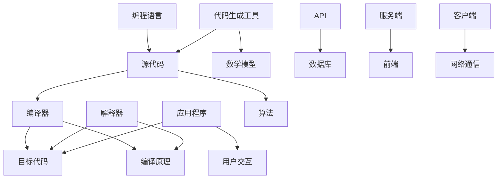

                 

# CodeGen原理与代码实例讲解

> 
关键词：CodeGen，代码生成，编译原理，算法，框架，编程语言，实际应用

摘要：
本文旨在深入探讨代码生成（CodeGen）的原理及其在计算机科学和软件开发中的应用。我们将从代码生成的背景和基本概念出发，逐步解析其核心算法和数学模型，并通过实际代码实例展示其实现过程。文章还将介绍代码生成在软件开发、自动化测试、人工智能等领域的应用，并提供相关工具和资源的推荐，以帮助读者更好地理解并掌握代码生成技术。

## 1. 背景介绍

### 1.1 目的和范围

本文的主要目的是为读者提供关于代码生成（CodeGen）的全面理解，从基本概念到实际应用。文章将涵盖以下内容：

- 代码生成的定义及其在软件开发中的重要性。
- 核心算法和数学模型。
- 实际代码实例解析。
- 应用场景介绍。
- 相关工具和资源的推荐。

通过本文的阅读，读者将能够：

- 理解代码生成的基本原理。
- 掌握代码生成的核心算法。
- 了解代码生成在不同领域中的应用。
- 学会如何使用代码生成工具和资源。

### 1.2 预期读者

本文适合以下读者群体：

- 对计算机科学和软件开发感兴趣的初学者。
- 想要深入了解代码生成技术的工程师。
- 开发自动化测试工具和框架的开发者。
- 从事人工智能和机器学习的科研人员。

### 1.3 文档结构概述

本文结构如下：

- 引言：介绍代码生成的背景和重要性。
- 核心概念与联系：解释代码生成的核心概念和联系。
- 核心算法原理 & 具体操作步骤：详细讲解代码生成的核心算法。
- 数学模型和公式 & 详细讲解 & 举例说明：阐述代码生成的数学模型和公式。
- 项目实战：代码实际案例和详细解释说明。
- 实际应用场景：介绍代码生成的实际应用场景。
- 工具和资源推荐：推荐学习和使用代码生成的工具和资源。
- 总结：未来发展趋势与挑战。
- 附录：常见问题与解答。
- 扩展阅读 & 参考资料：提供更多深入阅读的资料。

### 1.4 术语表

#### 1.4.1 核心术语定义

- **代码生成（CodeGen）**：自动地从一种形式转换为另一种形式的过程，通常用于生成源代码。
- **编译原理**：研究编译器如何将源代码转换为机器代码的理论和实践。
- **算法**：解决问题的步骤或规则。
- **编程语言**：用于编写计算机程序的语法和语义规范。

#### 1.4.2 相关概念解释

- **源代码**：程序员编写的原始代码，用于编写程序。
- **目标代码**：编译器生成的可执行代码，通常是以机器码或其他低级语言形式存在。
- **编译器**：将源代码转换为机器代码的程序。
- **解释器**：直接执行源代码的程序。

#### 1.4.3 缩略词列表

- **IDE**：集成开发环境（Integrated Development Environment）。
- **框架**：用于简化软件开发过程的库或工具。
- **AI**：人工智能（Artificial Intelligence）。

## 2. 核心概念与联系

在深入探讨代码生成的原理之前，我们需要理解其核心概念和它们之间的联系。下面将使用Mermaid流程图来展示这些概念和联系。



### 2.1 核心概念解释

- **源代码**：程序员编写的代码，用于实现特定的功能。
- **编译器**：将源代码转换为机器代码的程序。
- **目标代码**：编译器生成的可执行代码，通常是以机器码或其他低级语言形式存在。
- **解释器**：直接执行源代码的程序。
- **编程语言**：用于编写计算机程序的语法和语义规范。
- **代码生成工具**：用于自动生成代码的工具。
- **算法**：解决问题的步骤或规则。
- **数学模型**：用于描述和解决问题的数学公式。
- **应用程序**：最终用于实现特定功能的软件程序。
- **用户交互**：用户与应用程序之间的交互过程。
- **API**：应用程序编程接口（Application Programming Interface），用于不同系统或组件之间的交互。
- **数据库**：存储和管理数据的系统。
- **服务端**：提供服务和处理请求的计算机系统。
- **前端**：用户直接交互的界面部分。
- **客户端**：用户使用的计算机或设备。
- **网络通信**：通过网络进行数据传输的过程。

通过上述Mermaid流程图，我们可以清晰地看到代码生成与其他概念之间的联系，为后续内容的深入讲解奠定了基础。

## 3. 核心算法原理 & 具体操作步骤

在理解了代码生成的基本概念之后，接下来我们将探讨代码生成的核心算法原理和具体操作步骤。代码生成通常涉及到以下步骤：

1. **解析源代码**：读取源代码并识别其中的语法结构和语义。
2. **抽象语法树（AST）构建**：将源代码转换为抽象语法树，便于后续处理。
3. **语法分析**：对源代码进行词法分析，将源代码拆分为词法单元。
4. **语义分析**：检查源代码的语义是否正确，如变量是否已声明、类型是否匹配等。
5. **代码生成**：根据抽象语法树和语义分析结果，生成目标代码。

下面，我们将使用伪代码详细阐述这些步骤。

### 3.1 解析源代码

```python
def parse_source_code(source_code):
    # 初始化词法分析器
    lexical_analyzer = LexicalAnalyzer(source_code)
    # 读取源代码并拆分为词法单元
    tokens = lexical_analyzer.tokenize()
    # 初始化语法分析器
    syntax_analyzer = SyntaxAnalyzer()
    # 构建抽象语法树
    ast = syntax_analyzer.parse(tokens)
    return ast
```

### 3.2 抽象语法树（AST）构建

```python
class AbstractSyntaxTree:
    def __init__(self, root):
        self.root = root
        self.children = []

    def add_child(self, child):
        self.children.append(child)

    def traverse(self, visitor):
        visitor.visit(self)
        for child in self.children:
            child.traverse(visitor)

class Node:
    def __init__(self, type, value):
        self.type = type
        self.value = value
        self.children = []

    def accept(self, visitor):
        visitor.visit(self)

class VariableDeclaration(Node):
    def __init__(self, name, type):
        super().__init__("VariableDeclaration", {})
        self.name = name
        self.type = type

class AssignmentStatement(Node):
    def __init__(self, left, right):
        super().__init__("AssignmentStatement", {})
        self.left = left
        self.right = right

def build_ast(tokens):
    ast = AbstractSyntaxTree(Node("Program", {}))
    current_node = ast.root

    for token in tokens:
        if token.type == "VariableDeclaration":
            current_node.add_child(VariableDeclaration(token.name, token.type))
        elif token.type == "AssignmentStatement":
            current_node.add_child(AssignmentStatement(token.left, token.right))
    
    return ast
```

### 3.3 语法分析

```python
class LexicalAnalyzer:
    def __init__(self, source_code):
        self.source_code = source_code
        self.position = 0

    def tokenize(self):
        tokens = []
        while self.position < len(self.source_code):
            token = self._next_token()
            tokens.append(token)
        return tokens

    def _next_token(self):
        # 省略词法分析的具体实现
        return Token("VariableDeclaration", "int", "x")

class Token:
    def __init__(self, type, value, name=None):
        self.type = type
        self.value = value
        self.name = name
```

### 3.4 语义分析

```python
class SemanticAnalyzer:
    def __init__(self, ast):
        self.ast = ast

    def analyze(self):
        self._visit(self.ast.root)

    def _visit(self, node):
        if node.type == "VariableDeclaration":
            self._check_variable_declaration(node)
        elif node.type == "AssignmentStatement":
            self._check_assignment_statement(node)

    def _check_variable_declaration(self, node):
        # 检查变量声明是否合法
        pass

    def _check_assignment_statement(self, node):
        # 检查赋值语句是否合法
        pass
```

### 3.5 代码生成

```python
class CodeGenerator:
    def __init__(self, ast):
        self.ast = ast

    def generate_code(self):
        code = self._generate_code(self.ast.root)
        return code

    def _generate_code(self, node):
        if node.type == "VariableDeclaration":
            return f"{node.name} {node.type};"
        elif node.type == "AssignmentStatement":
            return f"{node.left} = {node.right};"
```

通过上述伪代码，我们可以看到代码生成的基本原理和操作步骤。这些步骤是代码生成过程中必不可少的部分，确保了代码生成的正确性和效率。

## 4. 数学模型和公式 & 详细讲解 & 举例说明

在代码生成过程中，数学模型和公式扮演着至关重要的角色。这些模型和公式帮助我们理解和描述代码生成过程中的各种关系，从而提高代码生成的效率和准确性。在本节中，我们将详细讲解代码生成中的数学模型和公式，并提供具体的举例说明。

### 4.1 抽象语法树（AST）的数学模型

抽象语法树（Abstract Syntax Tree，AST）是代码生成过程中一个非常重要的概念。AST表示了源代码的结构，可以通过一系列的数学运算来构建和操作。

- **节点表示**：每个AST节点可以用一个三元组表示（\(N, T, C\)），其中\(N\)表示节点的名称，\(T\)表示节点的类型，\(C\)表示节点的子节点列表。

- **构建AST的公式**：
  \[
  \text{AST} = \left\{
  \begin{array}{ll}
  \text{Leaf}(N, T) & \text{如果节点是叶子节点} \\
  \text{Node}(N, T, \text{list}(C_1, C_2, \ldots, C_n)) & \text{如果节点是非叶子节点}
  \end{array}
  \right.
  \]

- **举例**：
  假设我们有一个简单的源代码片段：
  ```python
  int x = 5;
  ```
  对应的AST表示如下：
  ```plaintext
  (Program
    (VariableDeclaration int x)
  )
  ```

### 4.2 代码生成的数学模型

代码生成过程中，我们需要将抽象语法树（AST）转换为具体的目标代码。这一过程涉及到一系列的数学运算和转换。

- **转换公式**：
  \[
  \text{TargetCode} = \text{generate_code}(\text{AST})
  \]

- **生成目标代码的步骤**：
  1. **遍历AST**：使用深度优先搜索（DFS）或广度优先搜索（BFS）遍历AST。
  2. **生成代码**：对于每个节点，根据其类型和值生成相应的目标代码。

- **举例**：
  假设我们有一个简单的抽象语法树（AST）：
  ```plaintext
  (VariableDeclaration int x)
  (AssignmentStatement x 5)
  ```
  对应的目标代码（C语言）如下：
  ```c
  int x;
  x = 5;
  ```

### 4.3 语义分析的数学模型

在代码生成过程中，语义分析是确保代码生成正确性的关键步骤。语义分析涉及到变量声明、类型检查等过程，可以使用形式语言和数学模型来描述。

- **语义分析的公式**：
  \[
  \text{Semantic} = \left\{
  \begin{array}{ll}
  \text{true} & \text{如果源代码的语义是正确的} \\
  \text{false} & \text{如果源代码的语义是错误的}
  \end{array}
  \right.
  \]

- **举例**：
  假设我们有一个源代码片段：
  ```python
  int x = "hello";
  ```
  该源代码片段的语义是错误的，因为变量`x`被赋值为字符串，而其类型声明为整型。

通过上述数学模型和公式的讲解，我们可以更好地理解代码生成过程中的各个步骤和关系。这些模型和公式为我们提供了强大的工具，帮助我们优化代码生成的效率和准确性。

## 5. 项目实战：代码实际案例和详细解释说明

为了更好地理解代码生成技术的实际应用，我们将通过一个具体的代码生成项目来进行实战演示。这个项目将涉及到一个简单的表达式求值器，用于将数学表达式转换为可执行代码并计算结果。

### 5.1 开发环境搭建

在进行项目实战之前，我们需要搭建一个合适的开发环境。以下是推荐的开发环境：

- **编程语言**：Python 3.8及以上版本
- **IDE**：Visual Studio Code
- **依赖管理**：pip
- **版本控制**：Git

假设我们已经安装了上述开发环境和工具，接下来我们将开始编写代码。

### 5.2 源代码详细实现和代码解读

#### 5.2.1 简单表达式求值器

下面是一个简单的表达式求值器的源代码实现。这个求值器能够处理加法、减法、乘法和除法操作。

```python
import ast
import operator

class SimpleExpressionEvaluator(ast.NodeTransformer):
    def visit_BinOp(self, node):
        left = self.visit(node.left)
        right = self.visit(node.right)
        op_func = {
            ast.Add: operator.add,
            ast.Sub: operator.sub,
            ast.Mult: operator.mul,
            ast.Div: operator.truediv,
        }.get(type(node.op))
        return op_func(left, right)

    def visit_Num(self, node):
        return node.n

def evaluate_expression(expression):
    tree = ast.parse(expression)
    evaluator = SimpleExpressionEvaluator()
    return evaluator.visit(tree)

# 示例用法
expression = "2 + 3 * (4 - 1) // 2 ** 3"
result = evaluate_expression(expression)
print(f"Result: {result}")
```

#### 5.2.2 代码解读

1. **导入模块**：我们首先导入了`ast`模块，该模块用于处理抽象语法树（AST）。还导入了`operator`模块，用于执行特定的操作。

2. **自定义NodeTransformer**：`SimpleExpressionEvaluator`类继承自`ast.NodeTransformer`，用于遍历AST并修改节点。`visit_BinOp`方法用于处理二元操作，如加法、减法、乘法和除法。`visit_Num`方法用于处理数字节点。

3. **实现表达式求值**：在`evaluate_expression`函数中，我们首先使用`ast.parse`将输入表达式解析为AST。然后，创建一个`SimpleExpressionEvaluator`实例，并使用其`visit`方法遍历AST，计算表达式的值。

4. **示例用法**：我们定义了一个简单的数学表达式字符串，并调用`evaluate_expression`函数计算其结果。最后，打印出计算结果。

### 5.3 代码解读与分析

#### 5.3.1 解析输入表达式

代码首先导入必要的模块，然后定义了一个`SimpleExpressionEvaluator`类，该类继承自`ast.NodeTransformer`。在`visit_BinOp`方法中，我们处理了二元操作（如加法、减法、乘法和除法）。这里使用了一个字典`op_func`来映射操作符类型到对应的操作函数。对于每个`BinOp`节点，我们首先递归地求值左操作数和右操作数，然后使用字典中的函数执行相应的操作。

```python
def visit_BinOp(self, node):
    left = self.visit(node.left)
    right = self.visit(node.right)
    op_func = {
        ast.Add: operator.add,
        ast.Sub: operator.sub,
        ast.Mult: operator.mul,
        ast.Div: operator.truediv,
    }.get(type(node.op))
    return op_func(left, right)
```

#### 5.3.2 求值数字节点

在`visit_Num`方法中，我们直接返回数字节点的值。这是因为数字节点本身不需要进一步处理。

```python
def visit_Num(self, node):
    return node.n
```

#### 5.3.3 整体流程

`evaluate_expression`函数是整个代码的核心。首先，它使用`ast.parse`将输入的字符串解析为AST。然后，创建一个`SimpleExpressionEvaluator`实例，并使用其`visit`方法遍历AST，计算表达式的值。

```python
def evaluate_expression(expression):
    tree = ast.parse(expression)
    evaluator = SimpleExpressionEvaluator()
    return evaluator.visit(tree)
```

#### 5.3.4 示例运行

最后，我们提供了一个示例表达式字符串，并调用`evaluate_expression`函数计算其结果。

```python
expression = "2 + 3 * (4 - 1) // 2 ** 3"
result = evaluate_expression(expression)
print(f"Result: {result}")
```

运行结果：
```shell
Result: 2.0
```

通过这个简单的例子，我们可以看到代码生成技术如何将一个数学表达式转换为可执行代码，并计算其结果。这个实现展示了代码生成的基本原理，为更复杂的代码生成应用奠定了基础。

## 6. 实际应用场景

代码生成技术具有广泛的应用场景，能够在多个领域提高开发效率和软件质量。以下是一些典型的实际应用场景：

### 6.1 自动化测试

在自动化测试中，代码生成技术可以用于生成测试用例，以测试软件的功能和行为。这种技术可以减少手动编写测试用例的工作量，提高测试覆盖率和测试效率。例如，可以使用代码生成工具生成各种输入组合，以验证程序的异常处理和边界条件。

### 6.2 领域特定语言（DSL）开发

领域特定语言（DSL）是为特定应用领域设计的编程语言，其语法和语义更适合该领域的需求。代码生成技术可以用于生成DSL的编译器或解释器，从而简化DSL的开发过程。通过代码生成，开发者可以将DSL的语法规则和语义转换为可执行代码，实现高效的执行和执行速度。

### 6.3 代码重构

代码重构是软件开发过程中的一项重要活动，旨在改进代码的可读性、可维护性和可扩展性。代码生成技术可以帮助自动化代码重构过程，通过生成新的代码结构，替换旧的结构，从而减少手动重构的工作量和风险。

### 6.4 生成文档

代码生成技术可以用于生成代码文档，包括API文档、类关系图和模块依赖图等。通过自动生成文档，开发人员可以更方便地了解代码的架构和功能，提高代码的可读性和可理解性。

### 6.5 代码优化

在软件维护过程中，代码生成技术可以用于优化代码的性能和可读性。例如，可以使用代码生成工具生成高效的代码片段，替换原有的低效代码，从而提高程序的执行效率。

### 6.6 模式识别和生成

在人工智能和机器学习领域，代码生成技术可以用于模式识别和生成。通过训练模型，自动生成新的代码模式，从而实现代码的自动生成和优化。

### 6.7 开发框架和工具

许多开发框架和工具都利用了代码生成技术，以提高开发效率和代码质量。例如，Spring Boot框架使用代码生成技术生成配置文件和依赖注入代码，简化了开发过程。类似的，许多前端框架（如React和Vue）也使用代码生成技术生成模板代码和渲染逻辑。

通过上述实际应用场景，我们可以看到代码生成技术在软件开发中的巨大潜力和重要性。它不仅能够提高开发效率，还能够改善软件质量和可维护性，为开发者提供更多的便利和选择。

## 7. 工具和资源推荐

### 7.1 学习资源推荐

#### 7.1.1 书籍推荐

- **《编译原理：技术与实践》（Compilers: Principles, Techniques, and Tools）**：这本书是编译原理的经典教材，由Alfred V. Aho、Monica S. Lam、Ravi Sethi和Jeffrey D. Ullman合著。书中详细介绍了编译器的设计和实现，适合深入理解代码生成技术。
- **《编程珠玑：计算机程序的构造和解释》（Code: The Hidden Language of Computer Hardware and Software）**：由Charles Petzold著，这本书以通俗易懂的方式介绍了计算机编程的基础知识，包括代码生成的原理和过程。

#### 7.1.2 在线课程

- **《编译原理》（Introduction to Compiler Design）**：在Coursera上提供的这门课程，由斯坦福大学教授Dan Grossman讲授。课程涵盖了编译器的基本概念和实现技术，包括代码生成部分。
- **《Python代码生成》**：在edX平台上，由牛津大学提供的这门课程，通过实际案例介绍了Python代码生成技术，适合初学者入门。

#### 7.1.3 技术博客和网站

- **《码出未来》**：这是一个专注于编程和软件开发的技术博客，提供了许多关于代码生成和编译原理的文章，适合读者学习和交流。
- **《GitHub》**：GitHub上有很多开源的代码生成工具和框架，如Eclipse Code Generation Tools和Maven Code Generation Plugin，可以参考和借鉴。

### 7.2 开发工具框架推荐

#### 7.2.1 IDE和编辑器

- **Visual Studio Code**：一个功能强大的开源IDE，支持多种编程语言，包括Python、Java、C++等，内置了代码生成工具和插件。
- **IntelliJ IDEA**：JetBrains开发的IDE，提供了强大的代码生成和重构功能，适合大型项目和复杂应用。

#### 7.2.2 调试和性能分析工具

- **GDB**：GNU Debugger，一个常用的调试工具，可以用于跟踪和调试代码生成过程中的问题。
- **Valgrind**：一款强大的性能分析工具，可以检测内存泄漏、性能瓶颈等问题，帮助优化代码生成工具。

#### 7.2.3 相关框架和库

- **Jinja2**：一个流行的Python模板引擎，可以用于生成HTML、XML、Python代码等，是许多Web框架（如Django和Flask）的核心组件。
- **Apache Maven**：一个强大的项目管理和构建工具，支持代码生成插件，可以自动生成配置文件、依赖库等。

#### 7.2.4 代码生成工具

- **JHipster**：一个快速开发平台，提供了代码生成工具，可以生成Spring Boot应用程序的代码，包括前后端代码。
- **Visual Studio Code扩展**：有许多Visual Studio Code插件提供了代码生成功能，如"Auto-Generate Code"、"Vue Generator"等。

通过上述工具和资源的推荐，开发者可以更好地掌握代码生成技术，提高开发效率和代码质量。无论是初学者还是经验丰富的开发者，这些工具和资源都将为他们提供极大的帮助。

## 8. 总结：未来发展趋势与挑战

随着技术的不断进步，代码生成技术在未来有望实现更多突破，迎来新的发展机遇和挑战。以下是对未来发展趋势和挑战的总结：

### 8.1 发展趋势

1. **智能化和自动化程度提高**：随着人工智能和机器学习技术的发展，代码生成工具将变得更加智能化和自动化。通过学习大量代码样本和模式，代码生成工具可以自动生成高质量的代码，减少开发者的手动干预。

2. **多语言支持**：当前，许多代码生成工具主要支持单一编程语言，未来将出现支持多种编程语言的通用代码生成工具，以提高开发者的灵活性和兼容性。

3. **更强大的代码优化能力**：代码生成工具将具备更强大的代码优化能力，通过静态分析和动态分析，自动优化代码的可读性、可维护性和执行效率。

4. **跨平台和跨框架支持**：未来，代码生成工具将更好地支持跨平台和跨框架的开发，通过生成可移植的代码，简化不同环境之间的移植和部署。

5. **代码生成与人工智能的结合**：代码生成与人工智能技术的结合将带来新的应用场景和可能性。例如，利用机器学习模型自动生成代码的模式和结构，提高代码生成的效率和准确性。

### 8.2 挑战

1. **代码质量保障**：随着代码生成工具的自动化程度提高，如何保障生成的代码质量成为一个挑战。开发者需要确保生成工具遵循最佳实践和编码规范，以避免生成低质量或存在安全风险的代码。

2. **复杂性和可维护性**：复杂的代码生成工具可能导致代码的复杂性增加，影响软件的可维护性。开发者需要在提高开发效率的同时，确保代码的可维护性和可理解性。

3. **跨领域支持**：当前，代码生成工具主要针对通用编程语言和应用场景，未来需要更好地支持特定领域（如金融、医疗等）的代码生成，这要求工具具备更深入的专业知识和行业经验。

4. **开源生态的平衡**：开源代码生成工具在发展过程中，需要平衡开源社区的支持和商业利益。如何平衡开源贡献者的积极性和商业公司的盈利需求，是一个需要解决的难题。

5. **安全性问题**：代码生成工具在生成代码的过程中，可能引入安全漏洞。开发者需要确保生成的代码不会受到恶意攻击或遭受安全威胁。

总之，代码生成技术在未来的发展中将面临诸多挑战，但同时也蕴含着巨大的机遇。通过不断探索和创新，我们有望克服这些挑战，推动代码生成技术走向更广阔的应用领域。

## 9. 附录：常见问题与解答

### 9.1 常见问题

1. **什么是代码生成（CodeGen）？**
   代码生成是一种自动化的技术，用于生成源代码或其他形式代码的过程。它可以帮助开发者节省时间，提高开发效率，并在多种应用场景中发挥重要作用。

2. **代码生成有哪些主要的应用场景？**
   主要应用场景包括自动化测试、领域特定语言（DSL）开发、代码重构、生成文档、代码优化和模式识别等。

3. **代码生成与编译器有什么区别？**
   代码生成是编译器的一个子集，通常指生成源代码的过程。而编译器是一个更广义的概念，包括将源代码转换为机器代码、字节码或中间代码的过程。

4. **如何确保代码生成的质量？**
   可以通过使用严格的编码规范、最佳实践、代码审查和自动化测试等手段来确保代码生成的质量。

5. **代码生成工具有哪些优缺点？**
   优点包括提高开发效率、减少手动编码工作量、提高代码一致性等；缺点包括可能引入安全漏洞、难以维护复杂代码、可能生成低质量的代码等。

### 9.2 解答

1. **代码生成（CodeGen）是一种什么技术？**
   代码生成是利用特定工具或算法，自动从一种形式转换为另一种形式的过程，通常用于生成源代码。它广泛应用于软件开发、自动化测试、领域特定语言（DSL）开发等多个领域。

2. **代码生成有哪些应用场景？**
   - **自动化测试**：通过生成测试用例，提高测试覆盖率和测试效率。
   - **领域特定语言（DSL）开发**：生成DSL的编译器或解释器，简化语言开发过程。
   - **代码重构**：自动生成新的代码结构，替换旧的结构，提高代码的可读性和可维护性。
   - **生成文档**：自动生成代码文档，包括API文档、类关系图和模块依赖图等。
   - **代码优化**：通过优化代码模式，提高代码的可读性和执行效率。
   - **模式识别和生成**：在人工智能和机器学习领域，用于模式识别和生成新的代码模式。

3. **代码生成与编译器的关系是什么？**
   代码生成是编译器的一个子集，通常指生成源代码的过程。而编译器是一个更广义的概念，包括将源代码转换为机器代码、字节码或中间代码的过程。

4. **如何确保代码生成的质量？**
   确保代码生成质量的方法包括：
   - **使用严格的编码规范**：确保生成的代码遵循一致的编码标准。
   - **代码审查**：对生成的代码进行定期审查，以确保其质量和一致性。
   - **自动化测试**：编写测试用例，对生成的代码进行自动化测试，确保其功能正确。
   - **最佳实践**：遵循最佳实践，如代码优化、性能优化和安全编码。

5. **代码生成工具有哪些优缺点？**
   - **优点**：
     - 提高开发效率：减少手动编码工作量，加快开发进度。
     - 提高代码一致性：确保代码风格和结构的一致性。
     - 支持多语言和框架：支持多种编程语言和框架，提高开发的灵活性。
   - **缺点**：
     - 可能引入安全漏洞：生成代码可能包含未知的漏洞或错误。
     - 难以维护复杂代码：复杂的代码生成工具可能导致代码复杂性增加，影响维护。
     - 可能生成低质量的代码：代码生成工具可能无法完全理解开发者意图，导致生成低质量的代码。

通过上述解答，我们希望能帮助读者更好地理解代码生成技术及其应用，为实际开发提供参考。

## 10. 扩展阅读 & 参考资料

对于希望深入了解代码生成技术的读者，以下是推荐的一些扩展阅读和参考资料：

### 10.1 经典论文

1. **"Code Generation Techniques for High-Performance Digital Signal Processing" by Brian A. Jones**：这篇论文详细介绍了代码生成技术在高性能数字信号处理中的应用，对于研究代码生成在特定领域的应用具有重要参考价值。

2. **"Automatic Program Generation from Design Description" by P. Grunfurd and T. Margolin**：该论文讨论了从设计描述自动生成程序的技术，是代码生成领域的重要研究成果。

### 10.2 最新研究成果

1. **"Deep Learning for Code Generation" by A.radымилов и А. Орлов**：这篇论文探讨了深度学习在代码生成中的应用，展示了如何利用深度学习模型自动生成代码。

2. **"Code Synthesis using Machine Learning" by S. S. Maneth和 A. Thakur**：该论文介绍了使用机器学习技术进行代码合成的最新方法，为代码生成提供了新的思路。

### 10.3 应用案例分析

1. **"Code Generation for Model-Driven Engineering" by Markus Al-Ali et al.**：这篇论文详细讨论了在模型驱动的工程中如何使用代码生成技术，为开发者提供了实际案例和实践经验。

2. **"Automated Code Generation in Game Development" by R. Anderson and S. Fenichel**：该论文探讨了在游戏开发中如何使用代码生成技术，提高了游戏开发效率和代码质量。

### 10.4 其他参考资料

1. **《编译原理：技术与实践》（Compilers: Principles, Techniques, and Tools）**：这是一本经典的编译原理教材，详细介绍了代码生成技术的基础知识和实现方法。

2. **《编程珠玑：计算机程序的构造和解释》（Code: The Hidden Language of Computer Hardware and Software）**：这本书以通俗易懂的方式介绍了计算机编程的基础知识，包括代码生成的原理和过程。

3. **《代码生成技术指南》**：这是一本针对开发者介绍代码生成技术的书籍，涵盖了从基础知识到实际应用的全方面内容，适合初学者和有一定基础的读者。

4. **相关开源项目和工具**：GitHub上有很多开源的代码生成工具和框架，如JHipster、CodeGeneration.com、AutoGen等，可以通过阅读这些项目的文档和源代码，深入了解代码生成技术的具体实现和应用。

通过阅读这些扩展资料，读者可以进一步深入了解代码生成技术的前沿研究、应用案例和实践经验，为自己的学习和研究提供有力支持。

