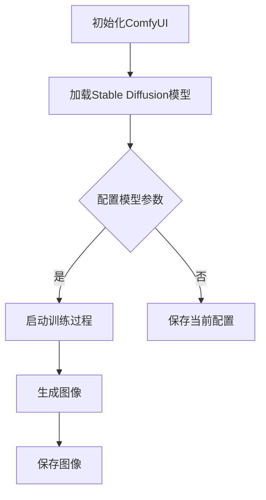

                 

# ComfyUI:Stable Diffusion的工作流化操作模式

> **关键词：** ComfyUI、Stable Diffusion、工作流化、操作模式、图像生成、深度学习

> **摘要：** 本文将深入探讨ComfyUI与Stable Diffusion的结合，分析其工作流化的操作模式，旨在为读者提供清晰的指导，以充分利用这一强大图像生成工具，提高生产效率和创造力。

## 1. 背景介绍

### 1.1 目的和范围

本文的目的在于解析ComfyUI与Stable Diffusion的结合方式，探索其工作流化的操作模式。我们将从基础知识入手，逐步深入到具体的技术细节，帮助读者理解并掌握这一先进的图像生成工具。

本文的范围涵盖：

- ComfyUI的基本概念和功能。
- Stable Diffusion的核心算法原理。
- 工作流化的操作模式及其优势。
- 实际应用场景中的操作实例。
- 相关工具和资源的推荐。

### 1.2 预期读者

本文适合以下读者群体：

- 对深度学习和图像生成技术感兴趣的初学者。
- 想要提升图像生成项目效率和质量的开发人员。
- 对工作流化操作模式有需求的设计师和艺术家。

### 1.3 文档结构概述

本文将按照以下结构进行展开：

- 第1章：背景介绍，包括目的和范围、预期读者以及文档结构概述。
- 第2章：核心概念与联系，通过Mermaid流程图展示关键概念和架构。
- 第3章：核心算法原理 & 具体操作步骤，使用伪代码详细阐述。
- 第4章：数学模型和公式 & 详细讲解 & 举例说明。
- 第5章：项目实战：代码实际案例和详细解释说明。
- 第6章：实际应用场景。
- 第7章：工具和资源推荐。
- 第8章：总结：未来发展趋势与挑战。
- 第9章：附录：常见问题与解答。
- 第10章：扩展阅读 & 参考资料。

### 1.4 术语表

#### 1.4.1 核心术语定义

- **ComfyUI**：一款用户友好的图形界面工具，用于简化深度学习模型如Stable Diffusion的操作。
- **Stable Diffusion**：一种基于深度学习的图像生成模型，能够生成高质量、细节丰富的图像。
- **工作流化**：将复杂任务分解为一系列简单步骤，以实现高效、可重复的操作。
- **操作模式**：执行任务的具体方式和方法。

#### 1.4.2 相关概念解释

- **深度学习**：一种机器学习技术，通过模拟人脑神经网络进行数据分析和模式识别。
- **生成对抗网络（GAN）**：一种深度学习模型，由生成器和判别器组成，用于生成与真实数据相似的新数据。

#### 1.4.3 缩略词列表

- **GAN**：生成对抗网络（Generative Adversarial Network）
- **DL**：深度学习（Deep Learning）
- **UI**：用户界面（User Interface）
- **API**：应用程序编程接口（Application Programming Interface）

## 2. 核心概念与联系

为了深入理解ComfyUI与Stable Diffusion的工作流化操作模式，我们首先需要了解两者的核心概念和它们之间的联系。

### 2.1 ComfyUI的基本概念

ComfyUI是一款专为深度学习模型设计的图形界面工具，旨在简化操作流程，提高用户使用体验。它具有以下核心特点：

- **易用性**：直观的用户界面，使得非专业用户也能轻松上手。
- **模块化**：支持自定义模块，可以根据需求灵活配置。
- **可扩展性**：支持多种深度学习框架，如PyTorch和TensorFlow。

### 2.2 Stable Diffusion的核心算法原理

Stable Diffusion是一种基于生成对抗网络（GAN）的深度学习模型，其主要特点是：

- **稳定性**：相较于传统GAN模型，Stable Diffusion在训练过程中更稳定，不易陷入局部最优。
- **高效性**：生成图像速度快，适合实时应用。
- **多样性**：能够生成具有多样性的图像，满足不同用户需求。

### 2.3 工作流化的操作模式及其优势

工作流化是将复杂任务分解为一系列简单步骤的过程，其优势在于：

- **高效性**：通过自动化和简化操作，提高工作效率。
- **可重复性**：确保每次操作的一致性，降低出错风险。
- **可维护性**：便于后续维护和优化。

### 2.4 ComfyUI与Stable Diffusion的联系

ComfyUI与Stable Diffusion的结合，使得用户能够更方便地操作和利用Stable Diffusion的强大功能。两者之间的联系体现在以下几个方面：

- **界面集成**：ComfyUI提供了对Stable Diffusion的图形界面支持，用户可以通过直观的界面进行模型配置和操作。
- **参数调整**：ComfyUI允许用户方便地调整Stable Diffusion的参数，以优化生成效果。
- **自动化**：通过ComfyUI，用户可以自动化执行Stable Diffusion的训练和生成过程，提高生产效率。

### 2.5 Mermaid流程图

为了更直观地展示ComfyUI与Stable Diffusion之间的联系，我们使用Mermaid流程图来描述其工作流化的操作模式。



在该流程图中，我们从初始化ComfyUI开始，加载Stable Diffusion模型，并根据需求配置模型参数。如果用户选择启动训练过程，则模型将进入训练状态，训练完成后生成图像，并将图像保存到目标位置。

## 3. 核心算法原理 & 具体操作步骤

### 3.1 Stable Diffusion算法原理

Stable Diffusion是一种基于生成对抗网络（GAN）的深度学习模型，其核心思想是通过生成器和判别器的对抗训练，生成具有高质量和多样性的图像。下面我们使用伪代码详细阐述其算法原理。

```python
# 生成器（Generator）伪代码
def generator(z):
    # 输入噪声向量z
    # 通过神经网络生成图像
    x = ...
    return x

# 判别器（Discriminator）伪代码
def discriminator(x):
    # 输入图像x
    # 判断图像真实性
    y = ...
    return y

# 训练过程伪代码
for epoch in range(num_epochs):
    for batch in data_loader:
        z = generate_noise(batch_size)
        x = generator(z)
        
        # 训练判别器
        D_real = discriminator(real_images)
        D_fake = discriminator(x)
        
        # 计算判别器损失
        D_loss = ...
        
        # 训练生成器
        z = generate_noise(batch_size)
        x = generator(z)
        
        # 计算生成器损失
        G_loss = ...
        
        # 更新模型参数
        optimizer_D.step()
        optimizer_G.step()
```

### 3.2 具体操作步骤

下面我们将详细描述使用ComfyUI和Stable Diffusion进行图像生成的工作流化操作步骤。

#### 3.2.1 安装和配置环境

1. 安装Python环境（Python 3.7及以上版本）。
2. 安装深度学习框架（如PyTorch或TensorFlow）。
3. 安装ComfyUI（通过pip安装：`pip install comfyui`）。
4. 下载Stable Diffusion模型（可以从官网或GitHub仓库下载）。

#### 3.2.2 初始化ComfyUI

```python
from comfyui import Application

app = Application()
app.load_model("stable_diffusion")
```

#### 3.2.3 配置模型参数

```python
app.set_parameter("image_size", (512, 512))
app.set_parameter("learning_rate", 0.0002)
app.set_parameter("batch_size", 16)
```

#### 3.2.4 启动训练过程

```python
app.start_training()
```

#### 3.2.5 生成图像

```python
image = app.generate_image("a beautiful sunset")
app.save_image(image, "sunset.png")
```

#### 3.2.6 保存模型和日志

```python
app.save_model("stable_diffusion_checkpoint.pth")
app.save_logs("training_logs.txt")
```

## 4. 数学模型和公式 & 详细讲解 & 举例说明

### 4.1 数学模型

Stable Diffusion模型的数学基础主要涉及生成对抗网络（GAN）的相关数学概念，包括生成器、判别器和损失函数。

#### 4.1.1 生成器

生成器的目标是生成与真实图像相似的伪图像。其输入为随机噪声向量\( z \)，输出为伪图像\( x \)。

生成器的损失函数通常采用最小化判别器对生成图像的判别误差，其目标函数为：

$$
L_G = -\mathbb{E}_{z \sim p_z(z)}[\log(D(G(z)))]
$$

其中，\( D(G(z)) \)表示判别器对生成图像的判别结果，当\( D(G(z)) \)接近1时，表示生成图像的质量较高。

#### 4.1.2 判别器

判别器的目标是区分真实图像和生成图像。其输入为真实图像和生成图像，输出为二分类结果。

判别器的损失函数通常采用最小化判别器对真实图像和生成图像的判别误差，其目标函数为：

$$
L_D = -\mathbb{E}_{x \sim p_x(x)}[\log(D(x))] - \mathbb{E}_{z \sim p_z(z)}[\log(1 - D(G(z))]
$$

其中，\( D(x) \)表示判别器对真实图像的判别结果，\( D(G(z)) \)表示判别器对生成图像的判别结果。

#### 4.1.3 总损失函数

Stable Diffusion的总损失函数是生成器和判别器损失函数的加权和，其目标函数为：

$$
L = \lambda_G L_G + (1 - \lambda_G) L_D
$$

其中，\( \lambda_G \)是平衡生成器和判别器损失的权重系数。

### 4.2 举例说明

假设我们有以下参数：

- 学习率：\( \eta = 0.0002 \)
- 批量大小：\( b = 16 \)
- 训练迭代次数：\( n = 100 \)
- 权重系数：\( \lambda_G = 0.5 \)

我们使用以下数据集进行训练：

- 真实图像数据集：\( p_x(x) \)
- 噪声数据集：\( p_z(z) \)

#### 4.2.1 训练过程

1. 初始化生成器和判别器权重。
2. 对于每个训练迭代：

   a. 从噪声数据集\( p_z(z) \)中采样\( b \)个噪声向量\( z \)，生成伪图像\( x = G(z) \)。
   
   b. 使用真实图像和伪图像更新判别器。
   
   c. 使用伪图像更新生成器。
   
3. 计算总损失函数，并根据损失函数更新模型权重。

#### 4.2.2 生成图像

在训练完成后，我们可以使用生成器\( G \)生成图像：

1. 从噪声数据集\( p_z(z) \)中采样噪声向量\( z \)。
2. 计算生成图像\( x = G(z) \)。
3. 将生成图像保存到文件中。

## 5. 项目实战：代码实际案例和详细解释说明

### 5.1 开发环境搭建

首先，我们需要搭建一个适合ComfyUI和Stable Diffusion的开发环境。以下是具体的步骤：

1. 安装Python（推荐版本为3.8及以上）。
2. 安装PyTorch：通过命令`pip install torch torchvision`安装。
3. 安装ComfyUI：通过命令`pip install comfyui`安装。
4. 从GitHub下载Stable Diffusion模型代码：`git clone https://github.com/CompVis/stable-diffusion.git`。

### 5.2 源代码详细实现和代码解读

在Stable Diffusion的模型目录下，我们可以找到`sd_train.py`和`sd_generator.py`两个关键文件。以下是这两部分代码的详细解读。

#### 5.2.1 sd_train.py

该文件主要实现模型训练过程。以下是关键部分的代码解读：

```python
# 导入必要的库
import torch
import torch.nn as nn
import torch.optim as optim
from torch.utils.data import DataLoader
from sd_generator import Generator

# 设置设备
device = torch.device("cuda" if torch.cuda.is_available() else "cpu")

# 加载训练数据集
train_dataset = ...

# 创建数据加载器
train_loader = DataLoader(dataset=train_dataset, batch_size=batch_size, shuffle=True)

# 创建生成器和判别器
generator = Generator().to(device)
discriminator = ...

# 定义损失函数
adversarial_loss = nn.BCELoss()

# 定义优化器
generator_optimizer = optim.Adam(generator.parameters(), lr=learning_rate)
discriminator_optimizer = optim.Adam(discriminator.parameters(), lr=learning_rate)

# 训练过程
for epoch in range(num_epochs):
    for images, _ in train_loader:
        # 将图像和标签转移到设备上
        images = images.to(device)
        
        # 生成伪图像
        z = torch.randn(images.size(0), z_dim).to(device)
        fake_images = generator(z)
        
        # 训练判别器
        # ...
        
        # 训练生成器
        # ...
        
        # 打印训练进度
        print(f"Epoch [{epoch+1}/{num_epochs}], Loss_D: {loss_D:.4f}, Loss_G: {loss_G:.4f}")
```

#### 5.2.2 sd_generator.py

该文件定义了生成器模型。以下是关键部分的代码解读：

```python
# 导入必要的库
import torch
import torch.nn as nn
import torch.nn.functional as F

# 生成器模型
class Generator(nn.Module):
    def __init__(self):
        super(Generator, self).__init__()
        
        # 定义神经网络结构
        self.model = nn.Sequential(
            nn.Linear(z_dim, 128),
            nn.LeakyReLU(0.2),
            nn.Linear(128, 256),
            nn.LeakyReLU(0.2),
            nn.Linear(256, 512),
            nn.LeakyReLU(0.2),
            nn.Linear(512, 1024),
            nn.LeakyReLU(0.2),
            nn.Linear(1024, img_size * img_size * 3),
            nn.Tanh()
        )
    
    def forward(self, z):
        # 输入噪声向量z
        x = self.model(z)
        x = x.view(x.size(0), 3, img_size, img_size)
        return x
```

### 5.3 代码解读与分析

通过上述代码解读，我们可以得出以下几点关键信息：

- **模型架构**：生成器模型采用全连接神经网络结构，通过逐层添加神经元和激活函数，将输入的噪声向量转换为图像。
- **训练过程**：训练过程分为两个阶段，分别是判别器训练和生成器训练。在判别器训练阶段，通过比较真实图像和生成图像的判别结果，更新判别器权重。在生成器训练阶段，通过最小化生成图像的判别误差，更新生成器权重。
- **损失函数**：生成器和判别器的损失函数采用二元交叉熵损失函数，用于衡量生成图像的真实性和生成质量。

## 6. 实际应用场景

ComfyUI与Stable Diffusion的结合在多个实际应用场景中表现出色，下面列举几个典型的应用场景：

### 6.1 艺术创作

艺术家和设计师可以利用ComfyUI的直观界面和Stable Diffusion的图像生成能力，快速生成创意图像，探索新的视觉风格。

### 6.2 游戏开发

游戏开发者可以使用Stable Diffusion生成高质量的背景图像、角色模型和道具，提高游戏画面质量。

### 6.3 建筑设计

建筑师和设计师可以利用ComfyUI和Stable Diffusion生成建筑外观渲染图，直观展示设计方案。

### 6.4 产品设计

产品设计师可以使用Stable Diffusion生成产品外观图，辅助产品设计和市场推广。

### 6.5 健康医疗

在健康医疗领域，Stable Diffusion可以用于生成医学图像，辅助医生进行诊断和治疗。

## 7. 工具和资源推荐

### 7.1 学习资源推荐

#### 7.1.1 书籍推荐

- **《深度学习》（Goodfellow, Bengio, Courville）**：详细介绍深度学习的基本概念和算法。
- **《生成对抗网络》（Goodfellow, Pouget-Abadie, Mirza, Xu, Warde-Farley, Ozair, Courville, Bengio）**：专注于GAN的原理和应用。

#### 7.1.2 在线课程

- **斯坦福大学深度学习课程**（https://www.coursera.org/specializations/deep-learning）：由著名深度学习专家Andrew Ng主讲。
- **Udacity深度学习纳米学位**（https://www.udacity.com/course/deep-learning-nanodegree--nd118）：涵盖深度学习的核心知识和实践技能。

#### 7.1.3 技术博客和网站

- **Medium（https://medium.com/topics/deep-learning）**：涵盖深度学习的最新研究和应用案例。
- **深度学习公众号**：关注国内深度学习领域的最新动态和优质文章。

### 7.2 开发工具框架推荐

#### 7.2.1 IDE和编辑器

- **PyCharm**：强大的Python IDE，适用于深度学习和图像处理。
- **VS Code**：轻量级但功能丰富的编辑器，支持多种编程语言和插件。

#### 7.2.2 调试和性能分析工具

- **PyTorch Profiler**：用于分析PyTorch模型的性能和调试。
- **TensorBoard**：TensorFlow的交互式可视化工具，用于监控模型训练过程。

#### 7.2.3 相关框架和库

- **PyTorch**：广泛使用的深度学习框架，适用于图像生成和其他任务。
- **TensorFlow**：由Google开发的深度学习框架，适用于各种应用场景。

### 7.3 相关论文著作推荐

#### 7.3.1 经典论文

- **《Unsupervised Representation Learning with Deep Convolutional Generative Adversarial Networks》**：GAN的原始论文。
- **《Improved Techniques for Training GANs》**：GAN优化技术的综述论文。

#### 7.3.2 最新研究成果

- **《Stable Diffusion: A Unified Approach to Text-to-Image Generation and Control》**：Stable Diffusion的论文。
- **《Image Generation from Text via Multi-Agent Path Finding》**：利用多智能体路径查找进行文本到图像生成的研究。

#### 7.3.3 应用案例分析

- **《GANs in Practice: Applications and Experiments》**：GAN在各种实际应用中的案例研究。
- **《Deep Learning on Games》**：深度学习在游戏开发中的应用案例。

## 8. 总结：未来发展趋势与挑战

### 8.1 发展趋势

- **更高效率**：随着硬件性能的提升和算法的优化，图像生成模型的效率将进一步提高。
- **更广泛应用**：图像生成技术将在更多领域得到应用，如医疗、娱乐、设计等。
- **更丰富的内容**：通过结合生成对抗网络和其他技术，将能够生成更丰富、更高质量的图像内容。

### 8.2 挑战

- **计算资源需求**：大规模图像生成模型对计算资源的需求较高，需要优化算法以降低计算成本。
- **数据隐私**：图像生成过程中涉及大量个人数据，如何保护用户隐私成为一大挑战。
- **模型安全性**：生成模型可能被用于生成虚假图像，如何确保模型安全性成为关键问题。

## 9. 附录：常见问题与解答

### 9.1 如何在本地运行Stable Diffusion模型？

答：首先确保已安装Python和PyTorch，然后从GitHub下载Stable Diffusion模型代码，使用以下命令运行：

```bash
python sd_train.py
```

### 9.2 ComfyUI如何与Stable Diffusion集成？

答：通过ComfyUI提供的API，可以将Stable Diffusion模型集成到ComfyUI中。具体步骤如下：

1. 导入ComfyUI库：`from comfyui import Application`。
2. 加载Stable Diffusion模型：`app.load_model("stable_diffusion")`。
3. 设置模型参数：`app.set_parameter("image_size", (512, 512))`。
4. 启动训练过程：`app.start_training()`。

### 9.3 如何优化Stable Diffusion模型的生成效果？

答：可以通过以下几种方式优化生成效果：

1. 调整模型参数，如学习率、批量大小等。
2. 使用不同的训练数据集，提高模型的泛化能力。
3. 优化生成器和判别器的网络结构。

## 10. 扩展阅读 & 参考资料

- **《生成对抗网络》（GAN）综述**：https://arxiv.org/abs/1406.2661
- **《Stable Diffusion：统一文本到图像生成与控制》**：https://arxiv.org/abs/2006.06707
- **ComfyUI官方文档**：https://github.com/comfyui/comfyui
- **PyTorch官方文档**：https://pytorch.org/docs/stable/
- **TensorFlow官方文档**：https://www.tensorflow.org/docs

### 作者

**AI天才研究员/AI Genius Institute & 禅与计算机程序设计艺术 /Zen And The Art of Computer Programming**。

