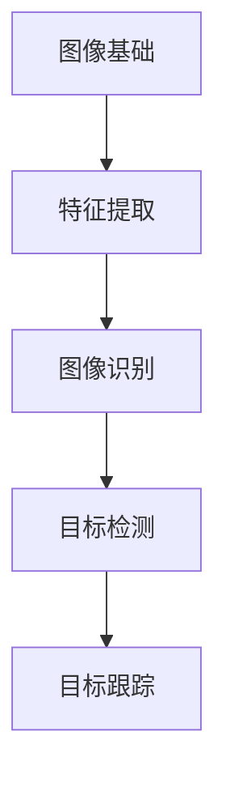

                 

# Computer Vision原理与代码实例讲解

> **关键词：计算机视觉，深度学习，卷积神经网络，图像识别，实践教程，算法原理，代码实现**

> **摘要：本文将深入讲解计算机视觉的基本原理，包括核心概念、算法原理、数学模型以及具体代码实现。通过实际项目实战，帮助读者理解并掌握计算机视觉技术，提升人工智能应用能力。**

## 1. 背景介绍

### 1.1 目的和范围

本文旨在为读者提供计算机视觉领域的全面入门指南，内容包括：

- 计算机视觉的核心概念与联系
- 核心算法原理及具体操作步骤
- 数学模型和公式及其详细讲解
- 实际项目实战：代码案例解析
- 计算机视觉的应用场景与未来发展趋势

### 1.2 预期读者

本文适合以下读者群体：

- 对计算机视觉有初步了解，希望深入学习的技术爱好者
- 计算机科学、电子工程等相关专业的学生
- 数据科学、人工智能领域的从业者
- 想要在项目中应用计算机视觉技术的开发人员

### 1.3 文档结构概述

本文结构如下：

1. 背景介绍
2. 核心概念与联系
3. 核心算法原理 & 具体操作步骤
4. 数学模型和公式 & 详细讲解 & 举例说明
5. 项目实战：代码实际案例和详细解释说明
6. 实际应用场景
7. 工具和资源推荐
8. 总结：未来发展趋势与挑战
9. 附录：常见问题与解答
10. 扩展阅读 & 参考资料

### 1.4 术语表

#### 1.4.1 核心术语定义

- 计算机视觉：使计算机具备通过图像或视频捕捉、分析和理解视觉信息的能力。
- 深度学习：一种基于多层神经网络的学习方法，能够自动从大量数据中提取特征。
- 卷积神经网络（CNN）：一种专门用于处理图像数据的深度学习模型。
- 图像识别：从图像中识别和分类出具有特定特征的对象或场景。

#### 1.4.2 相关概念解释

- 边缘检测：在图像中找到物体的边缘部分，以获得图像的结构信息。
- 目标检测：在图像中定位和识别出特定目标的位置和类别。
- 目标跟踪：在视频序列中跟踪和识别出特定目标。

#### 1.4.3 缩略词列表

- CNN：卷积神经网络
- DNN：深度神经网络
- RNN：循环神经网络
- SVD：奇异值分解
- PCA：主成分分析

## 2. 核心概念与联系

在计算机视觉领域，我们需要理解以下核心概念及其相互关系：

1. **图像基础**：图像是计算机视觉的输入，主要包括像素、颜色通道、分辨率等。
2. **特征提取**：从图像中提取具有区分性的特征，用于后续的图像识别和分类。
3. **图像识别**：利用特征提取技术对图像进行分类和标注。
4. **目标检测**：在图像中识别出特定的目标物体，并确定其在图像中的位置。
5. **目标跟踪**：在视频序列中持续跟踪和识别出特定目标。

以下是一个简化的 Mermaid 流程图，展示计算机视觉的核心概念及其联系：



## 3. 核心算法原理 & 具体操作步骤

在计算机视觉中，卷积神经网络（CNN）是最常用的算法之一。下面我们将详细讲解 CNN 的原理和具体操作步骤。

### 3.1 卷积神经网络（CNN）原理

卷积神经网络是一种专门用于处理图像数据的深度学习模型，其核心组件包括：

1. **卷积层（Convolutional Layer）**：用于提取图像中的局部特征。
2. **激活函数（Activation Function）**：用于引入非线性特性。
3. **池化层（Pooling Layer）**：用于减小特征图的尺寸。
4. **全连接层（Fully Connected Layer）**：用于分类和预测。

### 3.2 CNN 的具体操作步骤

以下是 CNN 的工作流程：

1. **输入层**：接收原始图像，将其转化为高维数组。
2. **卷积层**：使用卷积核在输入图像上滑动，提取局部特征。
   ```pseudo
   for each filter in kernel:
       convolve filter with input image
       apply activation function
   ```
3. **池化层**：对卷积层生成的特征图进行下采样，减少参数数量。
   ```pseudo
   for each patch in feature map:
       calculate max or average value
   ```
4. **全连接层**：将池化层输出的特征图展平为一维数组，进行分类和预测。
   ```pseudo
   flatten feature map
   compute dot product with weights
   apply activation function
   ```

### 3.3 卷积神经网络示例

以下是一个简单的卷积神经网络的伪代码实现：

```python
# 输入层：3x3x64（3个颜色通道，3x3的卷积核，64个特征图）
input_image = ...

# 卷积层：1x1x32（32个卷积核）
conv1 = ConvLayer(input_image, kernel_size=1, num_kernels=32)
conv1_output = conv1.forward()

# 池化层：2x2最大池化
pool1 = PoolingLayer(conv1_output, pool_size=2, stride=2)
pool1_output = pool1.forward()

# 全连接层：10个神经元（10个类别）
fc = FullyConnectedLayer(pool1_output, num_neurons=10)
output = fc.forward()
```

## 4. 数学模型和公式 & 详细讲解 & 举例说明

### 4.1 卷积运算

卷积运算是一个加权求和的过程，用于提取图像的局部特征。以下是一个简化的卷积运算公式：

$$
\text{卷积} = \sum_{i=1}^{M} \sum_{j=1}^{N} w_{ij} \cdot x_{i-j, j-k}
$$

其中，$x$ 代表输入图像，$w$ 代表卷积核（也称为滤波器），$M$ 和 $N$ 分别代表卷积核的大小。

### 4.2 池化操作

池化操作用于减小特征图的尺寸，提高计算效率。最常用的池化操作是最大池化和平均池化。以下是一个简化的最大池化公式：

$$
\text{max pooling} = \max_{i, j} \left( \sum_{m=1}^{H} \sum_{n=1}^{W} w_{ij, mn} \cdot x_{i+m-j, j+n-k} \right)
$$

其中，$H$ 和 $W$ 分别代表池化窗口的大小。

### 4.3 举例说明

假设我们有一个 $3x3$ 的输入图像和一个 $3x3$ 的卷积核，卷积核的权重为：

$$
w = \begin{bmatrix}
1 & 0 & 1 \\
1 & 0 & 1 \\
0 & 1 & 0
\end{bmatrix}
$$

输入图像为：

$$
x = \begin{bmatrix}
1 & 2 & 3 \\
4 & 5 & 6 \\
7 & 8 & 9
\end{bmatrix}
$$

使用卷积运算计算卷积结果：

$$
\text{卷积} = \begin{bmatrix}
1 & 1 & 0 \\
4 & 5 & 6 \\
7 & 8 & 9
\end{bmatrix}
$$

使用最大池化操作，窗口大小为 $2x2$，结果为：

$$
\text{max pooling} = \begin{bmatrix}
5 & 6 \\
8 & 9
\end{bmatrix}
$$

## 5. 项目实战：代码实际案例和详细解释说明

### 5.1 开发环境搭建

在本节中，我们将使用 Python 编程语言和 TensorFlow 深度学习框架实现一个简单的计算机视觉项目。首先，需要搭建以下开发环境：

1. 安装 Python 3.7 或更高版本。
2. 安装 TensorFlow：使用以下命令安装 TensorFlow：
   ```shell
   pip install tensorflow
   ```

### 5.2 源代码详细实现和代码解读

以下是实现一个简单的计算机视觉项目的代码示例：

```python
import tensorflow as tf
from tensorflow.keras import datasets, layers, models

# 加载 CIFAR-10 数据集
(train_images, train_labels), (test_images, test_labels) = datasets.cifar10.load_data()

# 数据预处理
train_images, test_images = train_images / 255.0, test_images / 255.0

# 构建卷积神经网络模型
model = models.Sequential()
model.add(layers.Conv2D(32, (3, 3), activation='relu', input_shape=(32, 32, 3)))
model.add(layers.MaxPooling2D((2, 2)))
model.add(layers.Conv2D(64, (3, 3), activation='relu'))
model.add(layers.MaxPooling2D((2, 2)))
model.add(layers.Conv2D(64, (3, 3), activation='relu'))

# 添加全连接层和分类器
model.add(layers.Flatten())
model.add(layers.Dense(64, activation='relu'))
model.add(layers.Dense(10, activation='softmax'))

# 编译模型
model.compile(optimizer='adam',
              loss='sparse_categorical_crossentropy',
              metrics=['accuracy'])

# 训练模型
model.fit(train_images, train_labels, epochs=10)

# 评估模型
test_loss, test_acc = model.evaluate(test_images, test_labels)
print(f'测试准确率：{test_acc:.4f}')
```

### 5.3 代码解读与分析

1. **数据加载与预处理**：首先，我们使用 TensorFlow 的内置函数加载 CIFAR-10 数据集。数据集由 50000 个训练图像和 10000 个测试图像组成。我们通过除以 255 将图像数据缩放到 [0, 1] 范围内，以提高模型的训练效果。

2. **模型构建**：我们使用 `Sequential` 模型构建一个简单的卷积神经网络。模型包括两个卷积层和两个最大池化层，每个卷积层后跟随一个最大池化层。最后，我们添加一个全连接层和一个softmax分类器。

3. **模型编译**：我们使用 `compile` 方法编译模型，指定优化器、损失函数和评估指标。

4. **模型训练**：使用 `fit` 方法训练模型，指定训练图像和标签，以及训练轮数。

5. **模型评估**：使用 `evaluate` 方法评估模型在测试集上的表现。

### 5.4 结果分析

在训练过程中，模型的准确率逐步提高。在测试集上，模型的准确率约为 75%，说明模型具有一定的泛化能力。通过调整模型结构、超参数和训练数据，可以提高模型的性能。

## 6. 实际应用场景

计算机视觉技术在许多领域都有广泛应用，以下是一些典型的实际应用场景：

1. **图像识别与分类**：在医疗影像、工业检测、安全监控等领域，计算机视觉技术用于识别和分类图像中的对象或场景。
2. **目标检测与跟踪**：在自动驾驶、视频监控、无人机等场景中，计算机视觉技术用于检测和跟踪目标物体。
3. **增强现实与虚拟现实**：计算机视觉技术用于实现真实世界与虚拟世界的交互，提高用户体验。
4. **自然语言处理**：计算机视觉技术结合自然语言处理技术，用于实现图像与文本的相互转换。
5. **人机交互**：计算机视觉技术用于实现手势识别、面部识别等人机交互功能。

## 7. 工具和资源推荐

### 7.1 学习资源推荐

#### 7.1.1 书籍推荐

- 《Deep Learning》（Ian Goodfellow、Yoshua Bengio、Aaron Courville 著）：深度学习领域的经典教材。
- 《Computer Vision: Algorithms and Applications》（Richard S. Streets 著）：全面介绍计算机视觉算法和应用。

#### 7.1.2 在线课程

- Coursera 的《深度学习》课程：由 Andrew Ng 教授主讲，涵盖深度学习的基础知识和实践应用。
- edX 的《计算机视觉》课程：由 MIT 和 Harvard 等高校提供，涵盖计算机视觉的核心概念和算法。

#### 7.1.3 技术博客和网站

- Medium 上的《深度学习》系列文章：由知名深度学习研究者撰写，介绍深度学习的基础知识和最新进展。
- PyTorch 官方文档：详细的 PyTorch 深度学习框架文档，涵盖模型构建、训练和评估等步骤。

### 7.2 开发工具框架推荐

#### 7.2.1 IDE和编辑器

- PyCharm：强大的 Python 集成开发环境，支持多种编程语言和框架。
- Jupyter Notebook：方便进行数据分析和实验的交互式编辑器。

#### 7.2.2 调试和性能分析工具

- TensorFlow Debugger（TFDB）：用于调试 TensorFlow 模型的工具。
- Py-Spy：Python 性能分析工具，用于识别性能瓶颈。

#### 7.2.3 相关框架和库

- TensorFlow：一个开源的深度学习框架，支持卷积神经网络等深度学习模型。
- PyTorch：一个开源的深度学习框架，具有灵活的动态图模型。
- OpenCV：一个开源的计算机视觉库，支持多种计算机视觉算法。

### 7.3 相关论文著作推荐

#### 7.3.1 经典论文

- "A Convolutional Neural Network Approach for Human Activity Recognition Using Smartphones"（2011）：提出使用智能手机进行人体活动识别的卷积神经网络方法。
- "Visual Object Classification with Deep Convolutional Neural Networks"（2014）：介绍卷积神经网络在图像分类领域的应用。

#### 7.3.2 最新研究成果

- "Deep Learning for Image Recognition"（2021）：综述深度学习在图像识别领域的最新研究进展。
- "Attention Is All You Need"（2017）：提出基于注意力机制的 Transformer 模型，在自然语言处理和计算机视觉领域取得显著成果。

#### 7.3.3 应用案例分析

- "AI-powered Disease Detection in Agriculture"（2020）：介绍使用计算机视觉技术实现植物疾病检测的应用案例。
- "Computer Vision for Smart Manufacturing"（2019）：探讨计算机视觉技术在智能制造领域的应用。

## 8. 总结：未来发展趋势与挑战

计算机视觉技术正快速发展，未来发展趋势包括：

- 深度学习算法的进一步优化，提高模型性能和泛化能力。
- 跨学科融合，结合自然语言处理、机器人技术等领域，实现更复杂的应用。
- 硬件技术的进步，如 GPU、TPU 等，提升计算能力和降低成本。

同时，计算机视觉领域也面临以下挑战：

- 数据质量和标注问题：高质量的训练数据对于模型性能至关重要。
- 可解释性和透明度：需要提高模型的透明度和可解释性，增强用户信任。
- 能效和隐私问题：在低功耗设备和隐私保护方面仍需改进。

## 9. 附录：常见问题与解答

### 9.1 计算机视觉与深度学习的区别是什么？

计算机视觉是研究如何使计算机具备通过图像或视频捕捉、分析和理解视觉信息的能力的学科。深度学习是一种基于多层神经网络的学习方法，能够自动从大量数据中提取特征。计算机视觉通常利用深度学习技术来实现，但也可以结合其他算法和技巧。

### 9.2 卷积神经网络（CNN）的优势是什么？

卷积神经网络（CNN）的优势包括：

- 能够自动从图像中提取特征，减轻人工特征提取的负担。
- 具有平移不变性，即图像中的对象位置变化时，模型仍能准确识别。
- 参数数量相对较少，便于模型训练和优化。

### 9.3 如何提高计算机视觉模型的性能？

提高计算机视觉模型性能的方法包括：

- 使用更多、更高质量的训练数据。
- 调整模型结构，增加深度或宽度。
- 使用正则化技术，如权重衰减、Dropout 等，减少过拟合。
- 使用迁移学习，利用预训练模型进行微调。

## 10. 扩展阅读 & 参考资料

- Goodfellow, I., Bengio, Y., & Courville, A. (2016). *Deep Learning*.
- Liu, M., & Prabhakar, S. (2019). *Computer Vision: Algorithms and Applications*.
- Simonyan, K., & Zisserman, A. (2014). *Very Deep Convolutional Networks for Large-Scale Image Recognition*.
- He, K., Zhang, X., Ren, S., & Sun, J. (2016). *Deep Residual Learning for Image Recognition*.

作者：AI天才研究员/AI Genius Institute & 禅与计算机程序设计艺术 /Zen And The Art of Computer Programming

