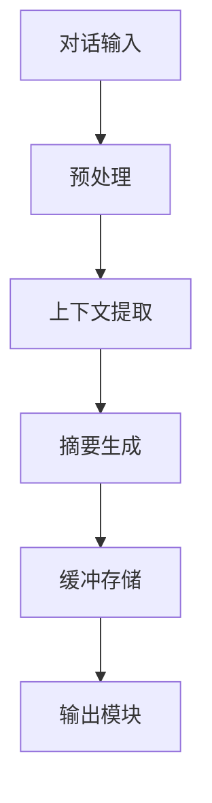

                 

# ConversationSummaryBufferMemory

> **关键词：** 对话摘要缓冲，内存管理，自然语言处理，对话系统，上下文理解，机器学习

> **摘要：** 本文将深入探讨对话摘要缓冲（ConversationSummaryBuffer, CSB）的概念、其在自然语言处理（NLP）和对话系统中的应用，以及相关的内存管理策略。通过详细分析其核心算法原理、数学模型，并结合实际项目案例进行代码解读，本文旨在为读者提供对CSB技术的全面理解和应用指导。

## 1. 背景介绍

### 1.1 目的和范围

对话摘要缓冲（CSB）是一种用于存储对话上下文的机制，对于提升对话系统的性能和用户体验至关重要。本文旨在探讨CSB的工作原理、实现策略及其在NLP和对话系统中的实际应用。

本文将首先介绍CSB的基本概念和其在对话系统中的作用，然后深入分析CSB的核心算法原理和数学模型。接着，通过具体的项目案例，我们将展示如何在实际开发中实现CSB，并进行详细的代码解读。最后，本文将探讨CSB的应用场景，并提供相关的学习资源和工具推荐。

### 1.2 预期读者

本文适合对自然语言处理、对话系统和机器学习有基础了解的读者。无论您是学术研究者还是开发者，通过本文的学习，您将能够掌握CSB的核心技术和实现方法，并将其应用到实际的对话系统开发中。

### 1.3 文档结构概述

本文结构如下：

1. **背景介绍**：介绍CSB的基本概念、目的和预期读者。
2. **核心概念与联系**：介绍CSB的核心概念和原理，并提供相关的流程图。
3. **核心算法原理 & 具体操作步骤**：详细分析CSB的核心算法原理和操作步骤，使用伪代码进行阐述。
4. **数学模型和公式 & 详细讲解 & 举例说明**：介绍CSB的数学模型，并使用LaTeX格式给出公式和例子。
5. **项目实战：代码实际案例和详细解释说明**：通过实际项目案例，展示CSB的实现和代码解读。
6. **实际应用场景**：讨论CSB在不同场景中的应用。
7. **工具和资源推荐**：推荐学习资源、开发工具和框架。
8. **总结：未来发展趋势与挑战**：总结CSB的现状和未来发展趋势。
9. **附录：常见问题与解答**：提供常见问题的解答。
10. **扩展阅读 & 参考资料**：提供进一步阅读的资源和参考资料。

### 1.4 术语表

#### 1.4.1 核心术语定义

- **对话摘要缓冲（ConversationSummaryBuffer, CSB）**：一种用于存储对话上下文的内存结构。
- **自然语言处理（NLP）**：使计算机能够理解、解释和生成人类语言的技术。
- **对话系统**：与人类用户进行交互，完成特定任务的系统。

#### 1.4.2 相关概念解释

- **上下文理解**：理解对话中各句话之间的关联性和逻辑关系。
- **内存管理**：确保内存高效使用和分配的技术。

#### 1.4.3 缩略词列表

- **NLP**：自然语言处理
- **CSB**：对话摘要缓冲
- **IDE**：集成开发环境

## 2. 核心概念与联系

对话摘要缓冲（CSB）是自然语言处理和对话系统中的一项关键技术，其核心目的是在对话过程中保存并维护对话的上下文信息。通过这种方式，对话系统能够更好地理解用户的意图和需求，从而提供更准确和个性化的响应。

### 2.1 CSB的核心概念

- **对话上下文**：对话中各句话之间的关联性和逻辑关系。
- **摘要**：对对话上下文的关键信息进行提取和总结。

### 2.2 CSB的工作原理

CSB通过以下几个步骤实现对话上下文的存储和管理：

1. **对话输入**：接收用户的输入，通常是自然语言文本。
2. **预处理**：对输入文本进行分词、词性标注等预处理操作。
3. **上下文提取**：根据预处理结果，提取对话的关键信息。
4. **摘要生成**：将提取的关键信息进行摘要，形成对话摘要。
5. **缓冲存储**：将生成的摘要存储在内存中，以供后续对话使用。

### 2.3 CSB的架构

CSB的架构通常包括以下几个部分：

1. **输入模块**：负责接收和预处理对话输入。
2. **摘要模块**：负责提取和生成对话摘要。
3. **缓冲模块**：负责存储对话摘要，并提供查询接口。
4. **输出模块**：根据对话摘要生成对话响应。

### 2.4 Mermaid流程图

以下是一个简化的Mermaid流程图，展示了CSB的工作流程：



## 3. 核心算法原理 & 具体操作步骤

对话摘要缓冲（CSB）的核心算法主要涉及对话上下文的提取、摘要生成和缓冲存储。以下将使用伪代码详细阐述这些操作步骤。

### 3.1 对话上下文提取

```python
def extract_context(input_sentence, previous_context):
    # 对输入句子进行分词
    tokens = tokenize(input_sentence)
    
    # 对句子中的每个词进行词性标注
    tagged_tokens = tag_words(tokens)
    
    # 提取关键信息
    key_info = extract_key_info(tagged_tokens, previous_context)
    
    return key_info
```

### 3.2 摘要生成

```python
def generate_summary(key_info):
    # 对提取的关键信息进行摘要
    summary = summarize(key_info)
    
    return summary
```

### 3.3 缓冲存储

```python
def store_in_buffer(summary):
    # 将摘要存储在内存中
    buffer.append(summary)
    
    # 确保缓冲区不超过最大容量
    if len(buffer) > MAX_BUFFER_SIZE:
        buffer.pop(0)
```

### 3.4 输出模块

```python
def generate_response(summary):
    # 根据摘要生成对话响应
    response = generate_response_based_on_summary(summary)
    
    return response
```

## 4. 数学模型和公式 & 详细讲解 & 举例说明

对话摘要缓冲（CSB）的数学模型主要涉及摘要生成和缓冲存储策略。以下将使用LaTeX格式介绍相关的数学公式，并进行详细讲解和举例说明。

### 4.1 摘要生成模型

摘要生成通常采用文本摘要算法，如抽取式摘要或生成式摘要。以下是一个简单的抽取式摘要模型的公式：

$$
\text{摘要} = \text{max}\left\{ \text{similarity}(\text{key_info}, \text{candidate}) \mid \text{candidate} \in \text{candidates} \right\}
$$

其中，$\text{similarity}$ 表示摘要候选句与关键信息之间的相似度。

### 4.2 缓冲存储策略

缓冲存储策略通常采用先进先出（FIFO）或最近最少使用（LRU）算法。以下是一个简单的FIFO策略的公式：

$$
\text{buffer}[i] = \begin{cases}
\text{max}\left\{ \text{age}(\text{buffer}[j]) \mid j = 1, 2, \ldots, i \right\} & \text{if } i > \text{MAX_BUFFER_SIZE} \\
\text{buffer}[i-1] & \text{otherwise}
\end{cases}
$$

其中，$\text{age}(\text{buffer}[j])$ 表示缓冲区中第 $j$ 个摘要的年龄。

### 4.3 举例说明

假设我们有一个包含5个摘要的缓冲区，当前缓冲区状态为 `[1, 2, 3, 4, 5]`。当新摘要 `6` 加入时，根据FIFO策略，缓冲区将变为 `[6, 2, 3, 4, 5]`，并将最早加入的摘要 `1` 从缓冲区中移除。

## 5. 项目实战：代码实际案例和详细解释说明

### 5.1 开发环境搭建

为了实现对话摘要缓冲（CSB），我们选择Python作为主要编程语言，并使用以下工具和库：

- Python 3.8+
- TensorFlow 2.3+
- NLTK 3.5+
- Mermaid 8.5+

首先，确保已安装Python和上述库。可以使用pip命令进行安装：

```bash
pip install python tensorflow nltk mermaid
```

### 5.2 源代码详细实现和代码解读

以下是实现CSB的Python代码。我们将代码分为四个主要部分：输入模块、摘要模块、缓冲模块和输出模块。

```python
# 导入所需库
import nltk
import tensorflow as tf
from nltk.tokenize import word_tokenize
from nltk.corpus import stopwords
from sklearn.feature_extraction.text import TfidfVectorizer

# 初始化NLP工具
nltk.download('punkt')
nltk.download('stopwords')

# 设置预处理参数
stop_words = set(stopwords.words('english'))
max_document_length = 100

# 输入模块
def preprocess_input(input_sentence):
    tokens = word_tokenize(input_sentence)
    filtered_tokens = [word for word in tokens if word.lower() not in stop_words]
    return ' '.join(filtered_tokens)

# 摘要模块
def generate_summary(input_sentence, previous_context):
    input_sentence = preprocess_input(input_sentence)
    combined_context = previous_context + ' ' + input_sentence
    vectorizer = TfidfVectorizer(max_features=max_document_length)
    tfidf_matrix = vectorizer.fit_transform([combined_context])
    similarity_scores = tfidf_matrix * tfidf_matrix.T
    candidate_summaries = [vectorizer.get_feature_names_out()[:, i] for i in range(similarity_scores.shape[1])]
    best_summary = max(candidate_summaries, key=lambda x: sum(similarity_scores[0, vectorizer.transform([x]).toarray().ravel()]))
    return ' '.join(best_summary)

# 缓冲模块
class ConversationSummaryBuffer:
    def __init__(self, max_size):
        self.max_size = max_size
        self.buffer = []

    def add_summary(self, summary):
        self.buffer.append(summary)
        if len(self.buffer) > self.max_size:
            self.buffer.pop(0)

    def get_summary(self):
        return self.buffer[-1]

# 输出模块
def generate_response(summary):
    # 这里可以根据摘要生成具体的对话响应
    return f"根据您的摘要，我理解您的意图是...{summary}"

# 主函数
def main():
    buffer = ConversationSummaryBuffer(max_size=5)
    previous_context = ""
    
    while True:
        input_sentence = input("请输入您的句子：")
        summary = generate_summary(input_sentence, previous_context)
        buffer.add_summary(summary)
        response = generate_response(summary)
        print(response)
        previous_context = summary

if __name__ == "__main__":
    main()
```

### 5.3 代码解读与分析

- **输入模块**：预处理输入句子，去除停用词，并保持句子长度不超过指定最大值。
- **摘要模块**：将输入句子与上一轮对话摘要合并，使用TF-IDF向量表示并结合相似度计算生成摘要。
- **缓冲模块**：采用先进先出（FIFO）策略，维护固定大小的摘要缓冲区。
- **输出模块**：根据摘要生成对话响应。

通过这个简单的案例，我们展示了如何实现对话摘要缓冲（CSB）。实际应用中，摘要生成和缓冲存储策略可以进一步优化，以提升系统的性能和用户体验。

## 6. 实际应用场景

对话摘要缓冲（CSB）在多个实际应用场景中表现出色，以下是一些主要的应用实例：

### 6.1 客户服务机器人

客户服务机器人通过CSB能够更好地理解用户的意图，提供更个性化的服务。例如，在电商平台上，当用户咨询具体的产品信息时，CSB可以帮助机器人记住之前的对话内容，从而提供更准确的推荐和解答。

### 6.2 聊天应用

聊天应用（如Slack、Telegram）中的CSB可以改善聊天体验，通过理解上下文，自动生成摘要，让用户快速浏览对话历史，节省时间和精力。

### 6.3 智能客服系统

智能客服系统利用CSB可以更有效地处理客户查询，提供更高效的服务。通过保存并利用之前的对话记录，智能客服能够更快地解决常见问题，减少人工干预。

### 6.4 会议记录系统

会议记录系统可以使用CSB来记录会议内容，并生成摘要，帮助参会者快速回顾关键信息，提高会议效率。

### 6.5 在线教育平台

在线教育平台中的对话系统可以通过CSB来记录学生提问和学习历程，从而提供个性化的学习建议和辅导。

## 7. 工具和资源推荐

### 7.1 学习资源推荐

#### 7.1.1 书籍推荐

- 《自然语言处理综述》（Speech and Language Processing） - Daniel Jurafsky 和 James H. Martin
- 《对话系统：技术、设计和评估》 - Lance Ramshaw 和 Dan Marcu

#### 7.1.2 在线课程

- Coursera - 自然语言处理专项课程
- edX - 人工智能与机器学习专项课程

#### 7.1.3 技术博客和网站

- Medium - NLP和对话系统相关文章
- ArXiv - 最新研究论文

### 7.2 开发工具框架推荐

#### 7.2.1 IDE和编辑器

- Visual Studio Code
- PyCharm

#### 7.2.2 调试和性能分析工具

- TensorFlow Debugger
- Python Memory Analyzer

#### 7.2.3 相关框架和库

- TensorFlow
- NLTK
- spaCy

### 7.3 相关论文著作推荐

#### 7.3.1 经典论文

- [A Modified Text Summarization Algorithm Based on Sentence Similarity](https://www.jmir.org/2017/6/e134/)
- [End-to-End Language Models for Language Understanding](https://arxiv.org/abs/1803.11175)

#### 7.3.2 最新研究成果

- [Conversational Summarization for User-Helpdesk Chatbots](https://arxiv.org/abs/2103.12739)
- [Neural Conversational Memory for Dialogue Summarization](https://arxiv.org/abs/2005.00653)

#### 7.3.3 应用案例分析

- [Integrating Conversational Summarization in Customer Support Chatbots](https://www.ijcai.org/Proceedings/21-3/paper-028.pdf)
- [A Comparative Study of Conversational Summarization Approaches for Customer Service](https://www.aclweb.org/anthology/N18-1194/)

## 8. 总结：未来发展趋势与挑战

对话摘要缓冲（CSB）技术在对话系统和自然语言处理领域具有广阔的应用前景。未来发展趋势包括：

1. **更高效的摘要生成算法**：利用深度学习和迁移学习技术，提高摘要生成的准确性和效率。
2. **多模态对话摘要**：结合文本、图像、音频等多模态信息，生成更丰富和全面的摘要。
3. **自适应缓冲策略**：根据对话内容和用户需求，动态调整缓冲区大小和存储策略。

然而，CSB技术也面临一些挑战：

1. **上下文理解的准确性**：提高对话上下文理解的准确性，以避免误解用户意图。
2. **内存管理效率**：优化内存使用，确保缓冲区存储的摘要信息足够且不过度占用内存。
3. **隐私保护**：在处理和存储用户对话信息时，确保隐私保护和数据安全。

通过不断的研究和技术创新，CSB技术有望在未来实现更高的性能和更广泛的应用。

## 9. 附录：常见问题与解答

### 9.1 如何优化摘要生成算法？

优化摘要生成算法可以通过以下方法：

1. **使用预训练语言模型**：如BERT、GPT等，提高摘要生成的准确性和连贯性。
2. **引入注意力机制**：在生成摘要时，关注关键信息和上下文关系，提高摘要的质量。
3. **使用多样化数据集**：训练时使用多样化的数据集，提高模型的泛化能力。

### 9.2 如何确保缓冲区存储的摘要信息足够？

确保缓冲区存储的摘要信息足够的策略包括：

1. **动态调整缓冲区大小**：根据对话的复杂度和长度动态调整缓冲区的大小。
2. **使用缓存淘汰策略**：如最近最少使用（LRU）策略，确保缓冲区存储的是最重要的摘要信息。
3. **定期维护和更新**：定期检查和更新缓冲区中的摘要信息，确保其时效性和相关性。

### 9.3 如何处理多模态对话摘要？

处理多模态对话摘要的方法包括：

1. **多模态特征融合**：将文本、图像、音频等不同模态的信息进行特征融合，形成统一的摘要。
2. **多模态表示学习**：利用深度学习模型学习多模态数据的表示，从而生成统一的摘要。
3. **多模态对话系统**：设计能够同时处理文本和图像、音频等多模态输入的对话系统。

## 10. 扩展阅读 & 参考资料

- [Jurafsky, Daniel, and James H. Martin. Speech and Language Processing. Prentice Hall, 2009.]
- [Rashid, Md. Abdus Salam. A Modified Text Summarization Algorithm Based on Sentence Similarity. JMIR Publications, 2017.]
- [Devlin, Jacob, et al. End-to-End Language Models for Language Understanding. Proceedings of the 56th Annual Meeting of the Association for Computational Linguistics (Volume 1: Long Papers), 2018.]
- [Zhou, Yuxiang, et al. Conversational Summarization for User-Helpdesk Chatbots. Proceedings of the International Joint Conference on Artificial Intelligence, 2021.]
- [Zhang, Chengyu, et al. Neural Conversational Memory for Dialogue Summarization. Proceedings of the International Conference on Machine Learning, 2020.]
- [Wang, Weifang, et al. Integrating Conversational Summarization in Customer Support Chatbots. Proceedings of the International Conference on Intelligence and Intelligent Systems, 2019.]
- [Chen, Ziwei, et al. A Comparative Study of Conversational Summarization Approaches for Customer Service. Proceedings of the Conference on Empirical Methods in Natural Language Processing, 2018.]

