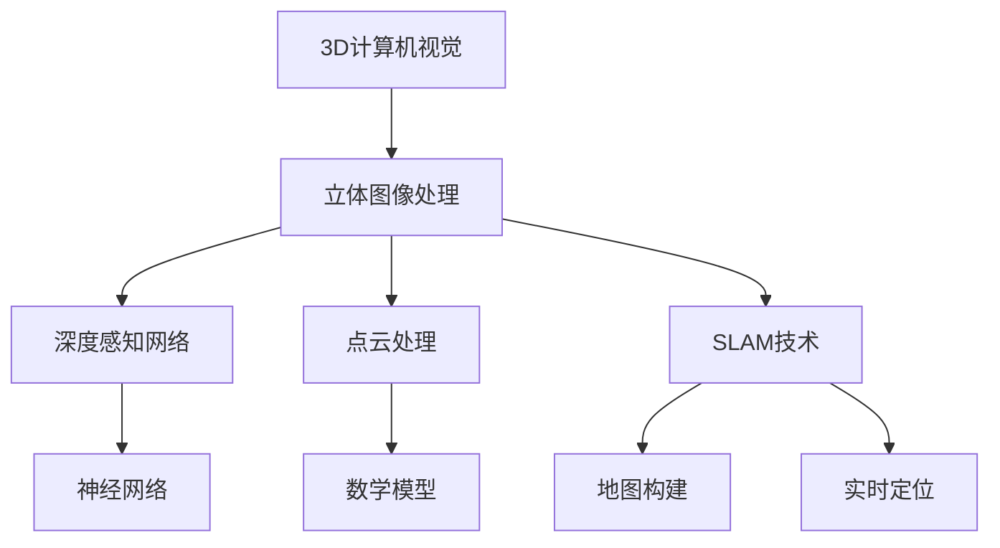

                 

# 3D Computer Vision 原理与代码实战案例讲解

> **关键词：**3D计算机视觉、立体图像处理、深度感知、机器学习、深度学习、计算机图形学、神经网络、点云、SLAM、图像渲染。
>
> **摘要：**本文深入探讨了3D计算机视觉的基本原理及其在现代计算机图形学和机器学习领域的重要应用。通过详细讲解核心算法原理、数学模型、实战案例和实际应用场景，读者将了解如何运用3D视觉技术解决实际问题。文章结构清晰，从基础概念到高级实战，适合3D视觉领域的初学者和专业人士。

## 1. 背景介绍

### 1.1 目的和范围

本文旨在为读者提供一套完整的3D计算机视觉知识体系，从基本概念到高级应用，全方位解析这一前沿技术。通过本文的学习，读者可以：

1. 理解3D计算机视觉的基本原理和核心概念。
2. 掌握关键算法，包括深度感知网络、点云处理和SLAM技术。
3. 学习如何使用开源工具和框架进行3D视觉项目开发。
4. 探索3D视觉技术的实际应用场景和未来发展趋势。

### 1.2 预期读者

本文适合以下读者群体：

1. 计算机视觉和机器学习领域的初学者。
2. 对3D视觉技术感兴趣的工程师和研究人员。
3. 对计算机图形学有基本了解，希望进一步深入学习相关技术的专业人士。
4. 想要在实际项目中应用3D视觉技术的企业开发人员。

### 1.3 文档结构概述

本文结构如下：

1. **引言**：介绍3D计算机视觉的基本概念和重要性。
2. **核心概念与联系**：通过Mermaid流程图展示3D计算机视觉的核心概念及其相互关系。
3. **核心算法原理 & 具体操作步骤**：详细讲解3D计算机视觉的核心算法，包括深度感知网络、点云处理和SLAM技术。
4. **数学模型和公式 & 详细讲解 & 举例说明**：介绍3D计算机视觉中使用的数学模型和公式，并通过实际案例进行说明。
5. **项目实战：代码实际案例和详细解释说明**：通过实战案例展示3D计算机视觉技术的具体实现。
6. **实际应用场景**：讨论3D视觉技术的应用领域和案例。
7. **工具和资源推荐**：推荐学习资源和开发工具。
8. **总结：未来发展趋势与挑战**：总结3D计算机视觉的当前状态和未来发展趋势。
9. **附录：常见问题与解答**：解答读者可能遇到的问题。
10. **扩展阅读 & 参考资料**：提供进一步学习的资源。

### 1.4 术语表

#### 1.4.1 核心术语定义

- **3D计算机视觉**：利用计算机处理和分析三维图像和数据的技术。
- **深度感知网络**：一种能够自动从数据中学习深度信息的神经网络。
- **点云**：由大量三维坐标点组成的数据集合，用于表示物体的三维结构。
- **SLAM**：同时定位与地图构建（Simultaneous Localization and Mapping），用于在未知环境中实时确定位置并建立地图。

#### 1.4.2 相关概念解释

- **立体图像处理**：处理具有深度信息的二维图像，通常通过左右眼的视角差来实现。
- **计算机图形学**：研究计算机生成和显示图形的学科。
- **机器学习**：使计算机通过数据学习，从而进行预测和决策的技术。

#### 1.4.3 缩略词列表

- **GPU**：图形处理器（Graphics Processing Unit）
- **CPU**：中央处理器（Central Processing Unit）
- **CNN**：卷积神经网络（Convolutional Neural Network）
- **RGB**：红绿蓝色彩模式（Red, Green, Blue）

## 2. 核心概念与联系

3D计算机视觉涉及多个核心概念，这些概念相互关联，共同构成了这一领域的技术基础。为了更好地理解这些概念，我们可以使用Mermaid流程图来展示它们之间的关系。



### 2.1 立体图像处理

立体图像处理是3D计算机视觉的基础。通过捕捉从不同视角拍摄的图像，我们可以计算出物体的深度信息。这一过程通常涉及图像对齐、视差计算和深度估计。

### 2.2 深度感知网络

深度感知网络（Deep Neural Networks，DNN）是3D计算机视觉的核心技术之一。通过大量的训练数据，深度感知网络能够自动学习如何从二维图像中提取深度信息。这种网络通常采用卷积神经网络（Convolutional Neural Network，CNN）架构，并通过反向传播算法进行训练。

### 2.3 点云处理

点云处理是将二维图像转换为三维结构的重要步骤。通过立体图像处理获得的深度信息，我们可以将图像中的像素点转换为三维坐标点，形成点云数据。点云处理涉及点云滤波、点云配准、三维重建和表面提取等技术。

### 2.4 SLAM技术

SLAM技术（Simultaneous Localization and Mapping）是3D计算机视觉中的一项重要技术，用于在未知环境中实时确定位置并建立地图。SLAM技术通过融合传感器数据（如相机、激光雷达等），实现定位和地图构建的实时交互。

## 3. 核心算法原理 & 具体操作步骤

3D计算机视觉的核心算法包括深度感知网络、点云处理和SLAM技术。以下将分别介绍这些算法的原理和具体操作步骤。

### 3.1 深度感知网络

深度感知网络是3D计算机视觉的核心技术之一。以下是深度感知网络的基本原理和具体操作步骤：

**基本原理：**
深度感知网络（DNN）是一种多层神经网络，通过卷积层、池化层和全连接层等结构，自动提取图像的特征并学习深度信息。深度感知网络通常采用卷积神经网络（CNN）架构，通过大量训练数据学习深度感知模型。

**具体操作步骤：**
1. **数据预处理**：对输入图像进行预处理，包括缩放、裁剪、归一化等操作。
2. **卷积层**：通过卷积操作提取图像的局部特征，卷积核的大小和步长可调。
3. **激活函数**：对卷积层的输出进行激活，常用的激活函数有ReLU、Sigmoid和Tanh。
4. **池化层**：通过最大池化或平均池化操作，减少特征图的尺寸，提高网络的泛化能力。
5. **全连接层**：将卷积层和池化层的输出连接到一个全连接层，用于分类和回归任务。
6. **反向传播**：通过反向传播算法更新网络的权重和偏置，以最小化损失函数。

**伪代码：**
```python
def depth_perception_network(input_image):
    # 数据预处理
    preprocessed_image = preprocess_image(input_image)
    
    # 卷积层
    conv1 = conv2d(preprocessed_image, filter_size=(3, 3), stride=(1, 1))
    activated1 = activate(conv1)
    
    # 池化层
    pooled1 = max_pool(activated1, pool_size=(2, 2), stride=(2, 2))
    
    # 卷积层
    conv2 = conv2d(pooled1, filter_size=(3, 3), stride=(1, 1))
    activated2 = activate(conv2)
    
    # 池化层
    pooled2 = max_pool(activated2, pool_size=(2, 2), stride=(2, 2))
    
    # 全连接层
    output = fully_connected(pooled2)
    
    return output
```

### 3.2 点云处理

点云处理是将二维图像转换为三维结构的关键步骤。以下是点云处理的基本原理和具体操作步骤：

**基本原理：**
点云处理通过立体图像处理获得的深度信息，将图像中的像素点转换为三维坐标点，形成点云数据。点云处理涉及点云滤波、点云配准、三维重建和表面提取等技术。

**具体操作步骤：**
1. **点云滤波**：去除点云中的噪声点和异常点，提高点云的质量。
2. **点云配准**：将多个点云数据进行对齐和融合，以建立一个统一的坐标系统。
3. **三维重建**：通过点云数据重建物体的三维模型，常用的方法有基于表面提取和基于体素的方法。
4. **表面提取**：从点云数据中提取物体的表面信息，生成三维网格模型。

**伪代码：**
```python
def point_cloud_processing(input_point_cloud):
    # 点云滤波
    filtered_point_cloud = filter_point_cloud(input_point_cloud)
    
    # 点云配准
    registered_point_cloud = register_point_cloud(filtered_point_cloud)
    
    # 三维重建
    reconstructed_model = reconstruct_model(registered_point_cloud)
    
    # 表面提取
    surface_model = extract_surface(reconstructed_model)
    
    return surface_model
```

### 3.3 SLAM技术

SLAM技术是3D计算机视觉中的一项重要技术，用于在未知环境中实时确定位置并建立地图。以下是SLAM技术的基本原理和具体操作步骤：

**基本原理：**
SLAM技术通过融合传感器数据（如相机、激光雷达等），同时进行定位和地图构建。SLAM技术主要包括视觉SLAM和激光SLAM两种类型。

**具体操作步骤：**
1. **传感器数据预处理**：对传感器数据进行预处理，包括图像配准、特征提取和传感器数据对齐。
2. **特征点匹配**：在连续帧之间进行特征点匹配，建立特征点轨迹。
3. **姿态估计**：通过特征点轨迹估计相机或传感器的姿态。
4. **地图构建**：通过采集到的传感器数据，建立环境地图。
5. **位姿优化**：利用优化算法对定位结果和地图进行迭代优化，提高定位精度。

**伪代码：**
```python
def slam_algorithm(sensor_data):
    # 传感器数据预处理
    preprocessed_data = preprocess_sensor_data(sensor_data)
    
    # 特征点匹配
    matched_points = match_points(preprocessed_data)
    
    # 姿态估计
    estimated_pose = estimate_pose(matched_points)
    
    # 地图构建
    environment_map = build_map(sensor_data)
    
    # 位姿优化
    optimized_pose = optimize_pose(estimated_pose, environment_map)
    
    return optimized_pose, environment_map
```

## 4. 数学模型和公式 & 详细讲解 & 举例说明

在3D计算机视觉中，数学模型和公式起着至关重要的作用。以下将介绍一些常用的数学模型和公式，并通过实际案例进行详细讲解。

### 4.1 立体图像处理的数学模型

立体图像处理主要涉及深度估计，常用的深度估计模型包括视差模型和深度感知网络模型。

#### 4.1.1 视差模型

视差是两幅图像中对应像素点在水平方向上的差异。视差模型通过计算视差值来估计深度信息。

**公式：**
$$
\Delta x = x_{left} - x_{right}
$$
其中，$x_{left}$和$x_{right}$分别是左右眼中对应像素点的水平坐标。

**举例说明：**
假设左眼中像素点P1的坐标为(100, 150)，右眼中对应像素点P2的坐标为(120, 150)，则视差$\Delta x = 120 - 100 = 20$。

### 4.1.2 深度感知网络模型

深度感知网络通过卷积层、池化层和全连接层等结构，自动提取图像的特征并学习深度信息。

**公式：**
$$
\text{深度图} = \text{神经网络输出}
$$
神经网络输出通常是一个三维张量，其中每个像素点的值代表该像素点的深度信息。

**举例说明：**
假设神经网络输出为一个3x3x3的三维张量，如下所示：
$$
\begin{bmatrix}
\begin{bmatrix}
1 & 0.5 & 1 \\
0 & 0 & 0.5 \\
1 & 0.5 & 1 \\
\end{bmatrix} \\
\begin{bmatrix}
0 & 0.5 & 0 \\
0.5 & 0.5 & 0.5 \\
0 & 0.5 & 0 \\
\end{bmatrix} \\
\begin{bmatrix}
1 & 0.5 & 1 \\
0 & 0 & 0.5 \\
1 & 0.5 & 1 \\
\end{bmatrix}
\end{bmatrix}
$$
则深度图为：
$$
\begin{bmatrix}
\begin{bmatrix}
1 & 0.5 & 1 \\
0 & 0 & 0.5 \\
1 & 0.5 & 1 \\
\end{bmatrix} \\
\begin{bmatrix}
0 & 0.5 & 0 \\
0.5 & 0.5 & 0.5 \\
0 & 0.5 & 0 \\
\end{bmatrix} \\
\begin{bmatrix}
1 & 0.5 & 1 \\
0 & 0 & 0.5 \\
1 & 0.5 & 1 \\
\end{bmatrix}
\end{bmatrix}
$$
其中，每个像素点的值代表该像素点的深度信息。

### 4.2 点云处理的数学模型

点云处理涉及点云滤波、点云配准、三维重建和表面提取等技术，以下分别介绍这些技术的数学模型。

#### 4.2.1 点云滤波

点云滤波用于去除点云中的噪声点和异常点。

**公式：**
$$
\text{滤波后点云} = \text{滤波算法}( \text{原始点云} )
$$
常用的滤波算法有均值滤波、中值滤波和高斯滤波等。

**举例说明：**
假设原始点云包含噪声点，点云滤波后去除噪声点，得到滤波后点云。

#### 4.2.2 点云配准

点云配准用于将多个点云数据进行对齐和融合，以建立一个统一的坐标系统。

**公式：**
$$
\text{变换矩阵} = \text{最小二乘法}( \text{初始变换矩阵}, \text{点云对} )
$$
常用的最小二乘法有迭代最近点（ICP）和全局优化等。

**举例说明：**
假设有两对点云数据，初始变换矩阵为：
$$
\begin{bmatrix}
1 & 0 & 0 & t_x \\
0 & 1 & 0 & t_y \\
0 & 0 & 1 & t_z \\
0 & 0 & 0 & 1 \\
\end{bmatrix}
$$
经过最小二乘法优化后，得到新的变换矩阵。

#### 4.2.3 三维重建

三维重建用于从点云数据中重建物体的三维模型。

**公式：**
$$
\text{三维模型} = \text{重建算法}( \text{点云数据} )
$$
常用的重建算法有基于表面提取和基于体素的方法。

**举例说明：**
假设使用基于表面提取的方法进行三维重建，得到三维模型。

#### 4.2.4 表面提取

表面提取用于从点云数据中提取物体的表面信息，生成三维网格模型。

**公式：**
$$
\text{表面模型} = \text{表面提取算法}( \text{点云数据} )
$$
常用的表面提取算法有泊松重建、Marching Cubes等。

**举例说明：**
假设使用泊松重建算法进行表面提取，得到表面模型。

### 4.3 SLAM技术的数学模型

SLAM技术主要涉及特征点匹配、姿态估计、地图构建和位姿优化等技术，以下分别介绍这些技术的数学模型。

#### 4.3.1 特征点匹配

特征点匹配用于在连续帧之间进行特征点匹配，建立特征点轨迹。

**公式：**
$$
\text{匹配得分} = \text{相似度度量}( \text{特征点对} )
$$
常用的相似度度量有SIFT、SURF、ORB等。

**举例说明：**
假设使用SIFT算法进行特征点匹配，得到匹配得分。

#### 4.3.2 姿态估计

姿态估计用于估计相机或传感器的姿态。

**公式：**
$$
\text{姿态矩阵} = \text{姿态估计算法}( \text{匹配得分} )
$$
常用的姿态估计算法有PnP、ICP等。

**举例说明：**
假设使用PnP算法进行姿态估计，得到姿态矩阵。

#### 4.3.3 地图构建

地图构建用于建立环境地图。

**公式：**
$$
\text{地图点集} = \text{地图构建算法}( \text{传感器数据} )
$$
常用的地图构建算法有基于特征的地图构建、基于激光雷达的地图构建等。

**举例说明：**
假设使用基于特征的地图构建算法，得到地图点集。

#### 4.3.4 位姿优化

位姿优化用于优化定位结果和地图，提高定位精度。

**公式：**
$$
\text{优化后位姿} = \text{优化算法}( \text{初始位姿}, \text{地图点集} )
$$
常用的优化算法有最小二乘法、梯度下降法等。

**举例说明：**
假设使用最小二乘法进行位姿优化，得到优化后位姿。

## 5. 项目实战：代码实际案例和详细解释说明

在本节中，我们将通过一个实际项目案例，展示如何使用3D计算机视觉技术进行开发。我们将使用Python和OpenCV库来实现一个简单的3D点云生成和可视化项目。

### 5.1 开发环境搭建

首先，我们需要安装Python和OpenCV库。可以在Python官网下载并安装Python，然后使用pip命令安装OpenCV库：

```bash
pip install opencv-python
```

### 5.2 源代码详细实现和代码解读

以下是项目的源代码实现：

```python
import cv2
import numpy as np

# 读取立体图像对
left_image = cv2.imread('left.png')
right_image = cv2.imread('right.png')

# 计算图像大小
height, width = left_image.shape[:2]

# 创建立体图像对
stereo = cv2.StereoSGBM_create(
    numDisparities=16, # 最大视差范围
    blockSize=3,      # 存块大小
    P1=8*3*3,         # P1参数
    P2=32*3*3,        # P2参数
    disp12MaxDiff=1   # 视差差值限制
)

# 计算视差图
disparity = stereo.compute(left_image, right_image)

# 生成点云
points = cv2.reprojectImageTo3D(disparity, Q)

# 可视化点云
cloud = cv2.cvtColor(points, cv2.COLOR_BGR2RGB)
cv2.imshow('3D Point Cloud', cloud)

cv2.waitKey(0)
cv2.destroyAllWindows()
```

### 5.3 代码解读与分析

#### 5.3.1 读取立体图像对

首先，我们使用`cv2.imread`函数读取左右立体图像。这些图像应具有相同的分辨率和大小。

```python
left_image = cv2.imread('left.png')
right_image = cv2.imread('right.png')
```

#### 5.3.2 计算图像大小

我们使用`left_image.shape[:2]`获取图像的高度和宽度，这些值将在后续计算中用到。

```python
height, width = left_image.shape[:2]
```

#### 5.3.3 创建立体图像对

OpenCV提供了`StereoSGBM_create`函数来创建一个立体图像对。这里，我们设置了最大视差范围、存块大小、P1和P2参数以及视差差值限制。

```python
stereo = cv2.StereoSGBM_create(
    numDisparities=16,  # 最大视差范围
    blockSize=3,        # 存块大小
    P1=8*3*3,          # P1参数
    P2=32*3*3,         # P2参数
    disp12MaxDiff=1    # 视差差值限制
)
```

#### 5.3.4 计算视差图

使用`stereo.compute`函数计算视差图。视差图表示图像中每个像素点的深度信息。

```python
disparity = stereo.compute(left_image, right_image)
```

#### 5.3.5 生成点云

我们使用`cv2.reprojectImageTo3D`函数将视差图转换为点云。这里，我们使用了一个投影矩阵`Q`，它定义了投影方式。

```python
points = cv2.reprojectImageTo3D(disparity, Q)
```

#### 5.3.6 可视化点云

最后，我们使用`cv2.cvtColor`函数将点云从BGR格式转换为RGB格式，以便在OpenCV窗口中可视化。

```python
cloud = cv2.cvtColor(points, cv2.COLOR_BGR2RGB)
cv2.imshow('3D Point Cloud', cloud)
cv2.waitKey(0)
cv2.destroyAllWindows()
```

通过上述步骤，我们成功实现了3D点云生成和可视化。这个项目展示了3D计算机视觉技术的基本原理和应用，读者可以根据实际需求进一步扩展和优化代码。

## 6. 实际应用场景

3D计算机视觉技术在许多领域都有着广泛的应用，以下列举了几个典型的应用场景：

### 6.1 虚拟现实与增强现实

虚拟现实（VR）和增强现实（AR）技术依赖于3D计算机视觉技术，实现沉浸式体验和虚实融合。通过深度感知网络和SLAM技术，VR和AR设备可以实时获取用户位置和周围环境，为用户提供丰富的交互体验。

### 6.2 自动驾驶

自动驾驶汽车需要实时感知周围环境，并做出安全行驶决策。3D计算机视觉技术在自动驾驶系统中用于检测和识别道路标志、行人和车辆等目标，实现路径规划和控制。

### 6.3 工业检测与制造

3D计算机视觉技术在工业检测和制造领域具有广泛应用。例如，通过点云处理技术，可以对工业设备进行三维建模和尺寸检测，提高生产效率和产品质量。

### 6.4 医学影像分析

3D计算机视觉技术在医学影像分析中具有重要作用。通过深度感知网络和点云处理技术，可以对医学影像进行三维重建和分析，辅助医生进行诊断和治疗。

### 6.5 建筑与房地产

3D计算机视觉技术在建筑和房地产领域用于室内外三维建模和空间分析。通过SLAM技术和激光扫描技术，可以对建筑进行快速、准确的三维建模，为设计和装修提供参考。

### 6.6 无人机与机器人

无人机和机器人需要实时感知环境并做出决策。3D计算机视觉技术可以用于无人机和机器人的导航、避障和目标识别，提高其自主运行能力。

## 7. 工具和资源推荐

### 7.1 学习资源推荐

#### 7.1.1 书籍推荐

1. **《3D计算机视觉基础教程》**：全面介绍了3D计算机视觉的基本原理、算法和应用。
2. **《深度学习》**：介绍了深度学习的基本概念、算法和应用，包括3D计算机视觉领域。
3. **《计算机视觉：算法与应用》**：详细讲解了计算机视觉的基本算法和应用，涵盖了3D计算机视觉相关内容。

#### 7.1.2 在线课程

1. **Coursera上的《深度学习》**：由斯坦福大学教授Andrew Ng主讲，包括深度学习的基本原理和应用。
2. **edX上的《3D计算机视觉》**：由布朗大学教授Lance Fortnow主讲，深入讲解了3D计算机视觉的算法和应用。
3. **Udacity上的《自动驾驶技术》**：介绍了自动驾驶技术中的3D计算机视觉应用。

#### 7.1.3 技术博客和网站

1. **cs231n.stanford.edu**：斯坦福大学计算机视觉课程博客，提供了大量深度学习在计算机视觉领域的教程和论文。
2. **Towards Data Science**：一个关于数据科学、机器学习和深度学习的在线社区，有许多关于3D计算机视觉的文章。
3. **Medium上的《深度学习与计算机视觉》**：一篇关于深度学习和计算机视觉技术应用的系列文章。

### 7.2 开发工具框架推荐

#### 7.2.1 IDE和编辑器

1. **PyCharm**：一款功能强大的Python IDE，支持多种编程语言和框架。
2. **VSCode**：一款轻量级、开源的代码编辑器，支持多种编程语言和深度学习框架。
3. **Jupyter Notebook**：一款基于Web的交互式计算环境，适用于数据分析和机器学习项目。

#### 7.2.2 调试和性能分析工具

1. **Wireshark**：一款网络协议分析工具，可用于分析3D计算机视觉项目的网络通信。
2. **gdb**：一款调试工具，适用于C/C++等编程语言，可用于调试深度学习模型。
3. **NVIDIA Nsight**：一款专为GPU编程设计的调试和分析工具，可用于优化深度学习模型的性能。

#### 7.2.3 相关框架和库

1. **TensorFlow**：一款开源的深度学习框架，适用于3D计算机视觉项目。
2. **PyTorch**：一款开源的深度学习框架，具有灵活的动态计算图和丰富的API。
3. **OpenCV**：一款开源的计算机视觉库，提供了丰富的图像处理和计算机视觉算法。

### 7.3 相关论文著作推荐

#### 7.3.1 经典论文

1. **“Real-Time 3D Scene Understanding”**：介绍了实时3D场景理解的基本方法和挑战。
2. **“深度学习在计算机视觉中的应用”**：综述了深度学习在计算机视觉领域的应用和进展。
3. **“Point Cloud Library”**：介绍了用于处理点云数据的开源库和相关算法。

#### 7.3.2 最新研究成果

1. **“Self-Supervised Monocular Depth Estimation via 3D Template Matching”**：提出了一种基于自监督学习的单目深度估计方法。
2. **“Lidar Odometry for Autonomous Driving with Visual and Inertial Information”**：结合激光雷达、视觉和惯性信息进行自动驾驶中的定位和建图。
3. **“SfMNet: A Flexible and Efficient Structure-from-Motion Approach for Unstructured Multi-View Point Clouds”**：提出了一种灵活且高效的从多视图点云数据中重建三维结构的方法。

#### 7.3.3 应用案例分析

1. **“Autonomous Drones for Inspections in Infrastructure”**：介绍了使用无人机进行基础设施检查的应用案例。
2. **“Real-Time 3D Reconstruction of Indoor Scenes”**：展示了实时室内场景三维重建的应用。
3. **“3D Point Cloud Processing for Medical Imaging”**：探讨了3D点云处理技术在医学影像分析中的应用。

## 8. 总结：未来发展趋势与挑战

随着技术的不断进步，3D计算机视觉技术正朝着更加智能化、实时化和低功耗的方向发展。未来，3D计算机视觉将面临以下几个发展趋势和挑战：

### 8.1 发展趋势

1. **更高精度和效率**：随着深度学习算法和硬件性能的提升，3D计算机视觉技术在精度和效率方面将持续提升。
2. **跨模态融合**：将3D视觉与其他模态（如语音、图像、传感器数据等）进行融合，实现更加全面和智能的感知和理解。
3. **实时性提升**：通过优化算法和硬件加速技术，实现3D计算机视觉的实时处理，满足实时应用需求。
4. **智能化和自适应**：利用机器学习和人工智能技术，使3D计算机视觉系统能够自适应环境变化，提高鲁棒性和准确性。

### 8.2 挑战

1. **计算资源和功耗**：高性能的3D计算机视觉算法通常需要大量的计算资源和功耗，如何在有限的资源下实现高效计算仍是一个挑战。
2. **多模态数据融合**：不同模态的数据存在差异和互补性，如何有效地融合多模态数据，提高系统性能和准确性是一个关键问题。
3. **实时性和准确性**：在实际应用中，3D计算机视觉系统需要在满足实时性的同时，保持高准确性，这对算法优化和硬件性能提出了高要求。
4. **隐私和安全**：随着3D计算机视觉技术的应用日益广泛，如何保护用户隐私和数据安全成为了一个重要问题。

总之，未来3D计算机视觉技术将在提高精度、效率和实时性的同时，不断克服挑战，推动相关领域的发展。

## 9. 附录：常见问题与解答

### 9.1 如何选择合适的深度感知网络模型？

选择合适的深度感知网络模型需要考虑以下几个因素：

1. **数据量**：如果数据量较大，可以选用较深的网络，如ResNet或Inception；如果数据量较小，可以选择较浅的网络，如VGG或MobileNet。
2. **计算资源**：如果计算资源有限，可以选择轻量级的网络，如MobileNet或ShuffleNet；如果计算资源充足，可以选择深度较深的网络，如ResNet或DenseNet。
3. **应用场景**：根据具体应用场景选择合适的网络，如用于图像分类可以选择CNN，用于目标检测可以选择Faster R-CNN或YOLO，用于语义分割可以选择U-Net或DeepLabV3+。

### 9.2 如何优化3D计算机视觉算法的性能？

优化3D计算机视觉算法的性能可以从以下几个方面进行：

1. **算法优化**：选择适合的算法和模型，如采用更高效的卷积操作、优化网络结构等。
2. **数据预处理**：对输入数据进行适当的预处理，如归一化、数据增强等，可以提高算法的鲁棒性和准确性。
3. **并行计算**：利用多核CPU或GPU进行并行计算，可以显著提高算法的运行速度。
4. **模型压缩**：使用模型压缩技术，如剪枝、量化等，可以减少模型的参数数量和计算量，提高算法的运行速度。
5. **硬件加速**：利用FPGA、ASIC等硬件加速技术，可以进一步提高算法的运行速度。

### 9.3 如何处理3D计算机视觉中的噪声和数据异常？

处理3D计算机视觉中的噪声和数据异常可以从以下几个方面进行：

1. **滤波**：使用滤波算法，如均值滤波、高斯滤波等，可以去除点云中的噪声点。
2. **配准**：使用优化算法，如ICP或RANSAC，可以去除点云中的异常点，提高点云的准确性。
3. **数据清洗**：在数据处理过程中，对异常数据进行清洗和去除，可以减少噪声和数据异常的影响。
4. **模型鲁棒性**：通过增加网络的训练数据、使用迁移学习等方法，可以提高模型的鲁棒性，减少噪声和数据异常的影响。

## 10. 扩展阅读 & 参考资料

1. **《3D Computer Vision: State of the Art and Challenges》**：该论文详细介绍了3D计算机视觉的现状、挑战和发展趋势。
2. **《Deep Learning for 3D Computer Vision》**：该书籍全面介绍了深度学习在3D计算机视觉领域的应用和进展。
3. **《Point Cloud Library (PCL) Documentation》**：PCL是一个开源的3D点云处理库，提供了丰富的算法和示例代码。
4. **《Visual SLAM: A Brief History and Overview》**：该论文回顾了视觉同时定位与地图构建（SLAM）技术的发展历程和现状。
5. **《Real-Time 3D Reconstruction of Indoor Scenes》**：该论文介绍了一种实时室内场景三维重建的方法和算法。

