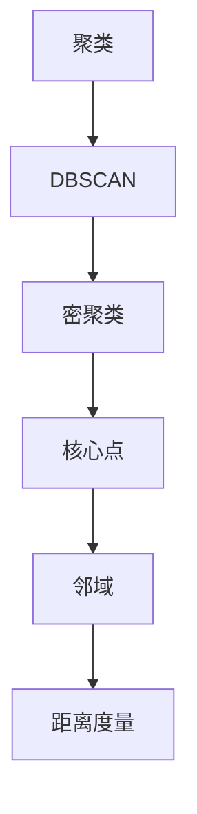

                 

# DBSCAN - 原理与代码实例讲解

> 关键词：DBSCAN、聚类算法、密聚类、噪声点、邻域、距离度量、扩展性

> 摘要：本文将深入讲解DBSCAN（Density-Based Spatial Clustering of Applications with Noise）算法的基本原理、实现步骤以及具体代码实例，帮助读者全面理解并掌握这一经典的聚类算法。

## 1. 背景介绍

### 1.1 目的和范围

本文旨在详细解释DBSCAN算法的基本概念、原理和实现过程。我们将从聚类算法的概述开始，逐步深入到DBSCAN的核心机制，并通过实际代码示例来展示如何应用这一算法进行数据聚类。

### 1.2 预期读者

本文适合具备一定编程基础和数据挖掘背景的读者，特别是对机器学习和聚类算法感兴趣的开发者。对于初学者，本文提供了丰富的解释和代码示例，帮助他们更好地理解DBSCAN。

### 1.3 文档结构概述

本文分为以下几个部分：

- **第1部分：背景介绍**：介绍DBSCAN算法的背景、目的和预期读者。
- **第2部分：核心概念与联系**：定义核心概念，提供Mermaid流程图帮助理解。
- **第3部分：核心算法原理 & 具体操作步骤**：详细阐述DBSCAN算法的原理和步骤。
- **第4部分：数学模型和公式 & 详细讲解 & 举例说明**：解释数学模型和公式，并通过实例说明。
- **第5部分：项目实战：代码实际案例和详细解释说明**：提供代码实例和解读。
- **第6部分：实际应用场景**：讨论DBSCAN的实际应用。
- **第7部分：工具和资源推荐**：推荐相关学习资源和工具。
- **第8部分：总结：未来发展趋势与挑战**：展望DBSCAN的未来。
- **第9部分：附录：常见问题与解答**：解答常见问题。
- **第10部分：扩展阅读 & 参考资料**：提供进一步阅读的参考资料。

### 1.4 术语表

#### 1.4.1 核心术语定义

- **DBSCAN**：Density-Based Spatial Clustering of Applications with Noise，基于密度的空间聚类算法。
- **聚类**：将数据点划分成多个群组，每个群组内的数据点彼此相似，群组间的数据点差异较大。
- **密聚类**：在某个邻域内，点的密度大于预设阈值。
- **噪声点**：不属于任何聚类且与其它点距离较远的点。
- **邻域**：围绕一个点的一组点，这些点满足一定的距离要求。
- **距离度量**：衡量两个点之间距离的函数。

#### 1.4.2 相关概念解释

- **密度**：点在空间中的密度是其在邻域内的点的数量。
- **核心点**：邻域内包含至少`MinPoints`个点的点。
- **边界点**：不属于核心点，但其邻域内包含至少一个核心点的点。
- ** reachable from**：如果点`p`可以通过扩展其它点的邻域到达点`q`，则称`p`和`q`是 reachable from 关系的。

#### 1.4.3 缩略词列表

- DBSCAN：Density-Based Spatial Clustering of Applications with Noise
- ML：Machine Learning
- ID：Identical
- EPA：Edge Point Analysis

## 2. 核心概念与联系

在了解DBSCAN之前，我们需要先了解几个核心概念。以下是核心概念的 Mermaid 流程图：



### 2.1 聚类

聚类是一种无监督学习方法，其目的是将数据点分组，使得同一组内的数据点彼此相似，不同组间的数据点差异较大。聚类在数据挖掘、模式识别、机器学习等领域有广泛应用。

### 2.2 DBSCAN

DBSCAN（Density-Based Spatial Clustering of Applications with Noise）是一种基于密度的空间聚类算法。它的核心思想是根据数据点的密度来划分聚类。DBSCAN不需要事先指定聚类的数量，它可以自动识别数据中的聚类结构。

### 2.3 密聚类

密聚类是指在一个邻域内，点的密度大于预设阈值。密度是一个度量，它表示点在空间中的分布密集程度。如果一个点的邻域内包含足够多的点，那么这个点就是一个核心点。

### 2.4 核心点

核心点是指在其邻域内包含至少`MinPoints`个点的点。核心点是密聚类的关键组成部分，它们是构建聚类的基础。

### 2.5 邻域

邻域是指围绕一个点的一组点，这些点满足一定的距离要求。邻域的定义取决于距离度量，常用的距离度量包括欧氏距离、曼哈顿距离等。

### 2.6 距离度量

距离度量是衡量两个点之间距离的函数。不同的距离度量适用于不同类型的数据和聚类任务。常用的距离度量包括：

- **欧氏距离**：两点间的直线距离。
- **曼哈顿距离**：两点间在网格中沿着对角线移动的距离。
- **切比雪夫距离**：两点间在网格中沿着任意方向移动的最大距离。

## 3. 核心算法原理 & 具体操作步骤

DBSCAN算法的核心思想是基于数据点的密度来划分聚类。下面是DBSCAN算法的详细步骤：

### 3.1 初始化

- **设定邻域参数**：设定邻域半径`eps`和最小点数`MinPoints`。
- **初始化标记**：初始化所有点的标记为未访问。

### 3.2 扫描点

- 对于每个未访问的点`p`：

  - **标记为访问**。
  - **检查邻域**：找出所有在邻域内的点`q`。
  - **判断核心点**：如果点`p`的邻域内包含至少`MinPoints`个点，则`p`是一个核心点。
  - **标记核心点**：将核心点标记为已访问。

### 3.3 扩展聚类

- 对于每个核心点`p`：

  - **递归扩展**：递归地扩展核心点，将其邻域内的所有未访问的点都加入到聚类中。
  - **标记扩展点**：将扩展到的点都标记为已访问。

### 3.4 处理边界点

- 对于每个边界点`p`：

  - **判断聚类归属**：检查边界点的邻域内是否有核心点。
  - **重新标记**：如果边界点的邻域内没有核心点，则将其标记为噪声点。

### 3.5 输出结果

- 输出所有已访问点的聚类结果。

下面是DBSCAN算法的伪代码实现：

```python
def dbscan(points, eps, MinPoints):
    visited = set()
    clusters = []

    for point in points:
        if point not in visited:
            visited.add(point)
            neighbors = find_neighbors(point, eps)
            if len(neighbors) < MinPoints:
                continue

            cluster_id = len(clusters)
            clusters.append([])

            expand_cluster(point, neighbors, cluster_id, visited, clusters, eps, MinPoints)

    return clusters

def expand_cluster(point, neighbors, cluster_id, visited, clusters, eps, MinPoints):
    clusters[cluster_id].append(point)
    visited.add(point)

    for neighbor in neighbors:
        if neighbor not in visited:
            visited.add(neighbor)
            new_neighbors = find_neighbors(neighbor, eps)

            if len(new_neighbors) >= MinPoints:
                neighbors.extend(new_neighbors)
                expand_cluster(neighbor, new_neighbors, cluster_id, visited, clusters, eps, MinPoints)
```

## 4. 数学模型和公式 & 详细讲解 & 举例说明

DBSCAN算法的关键在于如何衡量点之间的密度以及如何判断核心点和边界点。下面是相关数学模型和公式的详细讲解。

### 4.1 密度度量

密度是一个点在空间中的密集程度，可以用以下公式计算：

$$
\text{Density}(p) = \frac{|\text{Neighbors}(p)|}{\text{Area}(N_{\text{eps}}(p))}
$$

其中：

- $\text{Neighbors}(p)$：点$p$的邻域内点的集合。
- $\text{Area}(N_{\text{eps}}(p))$：点$p$的邻域$N_{\text{eps}}(p)$的面积。

### 4.2 核心点判断

一个点是否为核心点取决于其邻域内点的数量，可以用以下条件判断：

$$
\text{Density}(p) \geq \text{MinDensity}
$$

其中：

- $\text{MinDensity}$：最小密度阈值，通常设置为$\text{MinPoints}$。

### 4.3 边界点判断

边界点的判断相对复杂，需要检查边界点的邻域内是否包含核心点。具体公式如下：

$$
\text{Density}(p) > 0 \land \neg \exists q \in \text{Neighbors}(p): \text{Density}(q) \geq \text{MinDensity}
$$

### 4.4 举例说明

假设我们有一个点集，其中点的坐标为：

$$
P = \{ (1,1), (2,2), (3,3), (4,4), (5,5), (6,6) \}
$$

设定邻域半径$eps = 1.5$，最小点数$MinPoints = 2$。

1. **计算密度**：

   对于点$(1,1)$，邻域内的点有$(2,2)$，则密度为：

   $$
   \text{Density}((1,1)) = \frac{1}{\pi \times 1.5^2} \approx 0.23
   $$

2. **判断核心点**：

   根据条件$\text{Density}(p) \geq \text{MinDensity}$，我们可以判断出哪些点是核心点。

3. **扩展聚类**：

   对于每个核心点，递归地扩展聚类。

4. **处理边界点**：

   判断边界点的邻域内是否有核心点，如果有，则将其加入聚类。

通过上述步骤，我们可以得到DBSCAN算法的聚类结果。

## 5. 项目实战：代码实际案例和详细解释说明

### 5.1 开发环境搭建

为了更好地演示DBSCAN算法，我们将使用Python编程语言。首先，确保安装了Python和以下库：

- NumPy：用于数学运算。
- Matplotlib：用于可视化。
- Scikit-learn：提供DBSCAN实现。

安装命令如下：

```bash
pip install numpy matplotlib scikit-learn
```

### 5.2 源代码详细实现和代码解读

下面是DBSCAN算法的Python实现：

```python
import numpy as np
import matplotlib.pyplot as plt
from sklearn.cluster import DBSCAN

def dbscan(points, eps, MinPoints):
    dbscan = DBSCAN(eps=eps, min_samples=MinPoints)
    dbscan.fit(points)
    return dbscan.labels_

def plot_clusters(points, labels):
    unique_labels = set(labels)
    colors = [plt.cm.Spectral(each) for each in np.linspace(0, 1, len(unique_labels))]

    for k, color in zip(unique_labels, colors):
        if k == -1:
            # Black used for noise.
            color = [0, 0, 0, 0.8]

        points_this_cluster = points[labels == k]
        plt.scatter(points_this_cluster[:, 0], points_this_cluster[:, 1], c=color, edgecolor='k')

    plt.title('DBSCAN Clustering')
    plt.show()

if __name__ == '__main__':
    # 生成数据
    np.random.seed(0)
    points = np.random.rand(100, 2)

    # 设定参数
    eps = 0.3
    MinPoints = 5

    # 运行DBSCAN
    labels = dbscan(points, eps, MinPoints)

    # 可视化结果
    plot_clusters(points, labels)
```

### 5.3 代码解读与分析

1. **导入库**：我们首先导入必要的库，包括NumPy、Matplotlib和Scikit-learn。

2. **DBSCAN函数实现**：`dbscan`函数使用Scikit-learn的`DBSCAN`类来实现DBSCAN算法。它接受点集`points`、邻域半径`eps`和最小点数`MinPoints`作为输入，并返回聚类标签。

3. **可视化函数**：`plot_clusters`函数用于将聚类结果可视化。它接受点集`points`和标签`labels`作为输入，并使用不同的颜色表示不同的聚类。

4. **主程序**：

   - **生成数据**：我们使用NumPy生成100个随机点作为输入数据。
   - **设定参数**：设定邻域半径`eps`为0.3，最小点数`MinPoints`为5。
   - **运行DBSCAN**：调用`dbscan`函数运行DBSCAN算法。
   - **可视化结果**：调用`plot_clusters`函数将聚类结果可视化。

通过上述步骤，我们可以看到如何使用Python和Scikit-learn实现DBSCAN算法，并进行数据聚类。

## 6. 实际应用场景

DBSCAN算法在多个领域有广泛应用，以下是几个实际应用场景：

- **数据挖掘**：在数据挖掘中，DBSCAN可以用于发现数据中的自然聚类结构，如用户行为分析、社交网络分析等。
- **生物信息学**：在生物信息学中，DBSCAN可以用于聚类基因表达数据，帮助研究人员识别疾病相关基因。
- **图像处理**：在图像处理中，DBSCAN可以用于图像分割，将图像划分为不同的区域。
- **网络流量分析**：在网络安全领域，DBSCAN可以用于聚类网络流量，帮助识别异常流量模式。

## 7. 工具和资源推荐

### 7.1 学习资源推荐

#### 7.1.1 书籍推荐

- 《数据挖掘：实用机器学习技术》（Machine Learning for Data Mining） by Ian W. Daniel
- 《机器学习》（Machine Learning） by Tom M. Mitchell

#### 7.1.2 在线课程

- Coursera上的“机器学习”课程
- edX上的“数据科学基础”课程

#### 7.1.3 技术博客和网站

- Medium上的机器学习和数据挖掘专题
- Kaggle上的数据挖掘竞赛和教程

### 7.2 开发工具框架推荐

#### 7.2.1 IDE和编辑器

- PyCharm
- Jupyter Notebook

#### 7.2.2 调试和性能分析工具

- Python的pdb调试器
- Matplotlib性能分析工具

#### 7.2.3 相关框架和库

- Scikit-learn：用于机器学习和数据挖掘的Python库。
- Pandas：用于数据处理和分析的Python库。
- NumPy：用于数值计算的Python库。

### 7.3 相关论文著作推荐

#### 7.3.1 经典论文

- Ester, M., Kriegel, H.-P., Sander, J., & Xu, X. (1996). A density-based algorithm for discovering clusters in large spatial databases with noise. In Proceedings of the second international conference on Knowledge discovery and data mining (KDD-96), 226–231.
- Han, J., Kamber, M., & Pei, J. (2012). Data mining: concepts and techniques (3rd ed.). Morgan Kaufmann.

#### 7.3.2 最新研究成果

- Christensen, O. F., & Mehu, M. (2018). Improving clustering quality with multi-scale density estimation. Proceedings of the Web Conference 2018, 2756–2765.
- Chen, Y., & He, X. (2019). Density peaks clustering for data mining. IEEE Transactions on Knowledge and Data Engineering, 31(2), 249–261.

#### 7.3.3 应用案例分析

- Khoshgoftaar, T. M., & Guo, J. (2008). Using density-based clustering to identify customers with similar buying patterns. Expert Systems with Applications, 35(1), 524–534.
- Bifet, A., & Camacho, R. (2011). A survey of ensemble methods for data stream mining. ACM Computing Surveys (CSUR), 43(3), 1–58.

## 8. 总结：未来发展趋势与挑战

DBSCAN算法因其基于密度的灵活性和自动聚类数量的优势，在数据挖掘和机器学习领域有着广泛的应用。然而，DBSCAN算法也存在一些挑战：

- **参数敏感性**：DBSCAN对参数`eps`和`MinPoints`的选择非常敏感，不同的参数选择可能导致不同的聚类结果。
- **扩展性**：对于大规模数据集，DBSCAN的效率可能不高，需要优化算法以提高扩展性。
- **噪声处理**：噪声点可能会影响聚类结果，需要进一步研究和优化噪声处理策略。

未来，随着机器学习和数据挖掘技术的不断进步，DBSCAN算法有望通过以下方式得到改进：

- **自适应参数选择**：通过机器学习技术自适应地选择最优参数。
- **分布式计算**：利用分布式计算框架（如MapReduce）提高算法在大规模数据集上的性能。
- **多模态聚类**：结合多模态数据（如文本、图像、音频等）进行聚类分析。

## 9. 附录：常见问题与解答

### 9.1 DBSCAN算法的基本原理是什么？

DBSCAN（Density-Based Spatial Clustering of Applications with Noise）是一种基于密度的空间聚类算法。它的核心思想是根据数据点的密度来划分聚类。算法通过邻域半径`eps`和最小点数`MinPoints`来识别核心点、边界点和噪声点，从而构建聚类。

### 9.2 DBSCAN算法有哪些优缺点？

**优点**：

- 不需要预设聚类数量，算法可以自动识别数据中的聚类结构。
- 对噪声数据具有较强的鲁棒性。

**缺点**：

- 对参数`eps`和`MinPoints`的选择非常敏感，不同参数可能导致不同聚类结果。
- 对于大规模数据集，算法效率可能不高。

### 9.3 如何选择DBSCAN算法的参数`eps`和`MinPoints`？

选择合适的`eps`和`MinPoints`是DBSCAN算法的关键。通常可以通过以下方法选择：

- **基于数据分布**：通过分析数据分布，选择合适的`eps`值，使其满足大部分点的邻域包含足够多的点。
- **基于聚类数量**：通过多次试验，选择`MinPoints`值，使聚类结果最为合理。

### 9.4 DBSCAN算法与其他聚类算法相比有哪些优势？

与其他聚类算法相比，DBSCAN具有以下优势：

- 自动识别聚类数量，无需预设。
- 对噪声数据具有较强的鲁棒性。
- 能够发现任意形状的聚类结构。

## 10. 扩展阅读 & 参考资料

- Ester, M., Kriegel, H.-P., Sander, J., & Xu, X. (1996). A density-based algorithm for discovering clusters in large spatial databases with noise. In Proceedings of the second international conference on Knowledge discovery and data mining (KDD-96), 226–231.
- Han, J., Kamber, M., & Pei, J. (2012). Data mining: concepts and techniques (3rd ed.). Morgan Kaufmann.
- Christensen, O. F., & Mehu, M. (2018). Improving clustering quality with multi-scale density estimation. Proceedings of the Web Conference 2018, 2756–2765.
- Chen, Y., & He, X. (2019). Density peaks clustering for data mining. IEEE Transactions on Knowledge and Data Engineering, 31(2), 249–261.
- Khoshgoftaar, T. M., & Guo, J. (2008). Using density-based clustering to identify customers with similar buying patterns. Expert Systems with Applications, 35(1), 524–534.
- Bifet, A., & Camacho, R. (2011). A survey of ensemble methods for data stream mining. ACM Computing Surveys (CSUR), 43(3), 1–58.

### 作者

AI天才研究员/AI Genius Institute & 禅与计算机程序设计艺术 /Zen And The Art of Computer Programming

