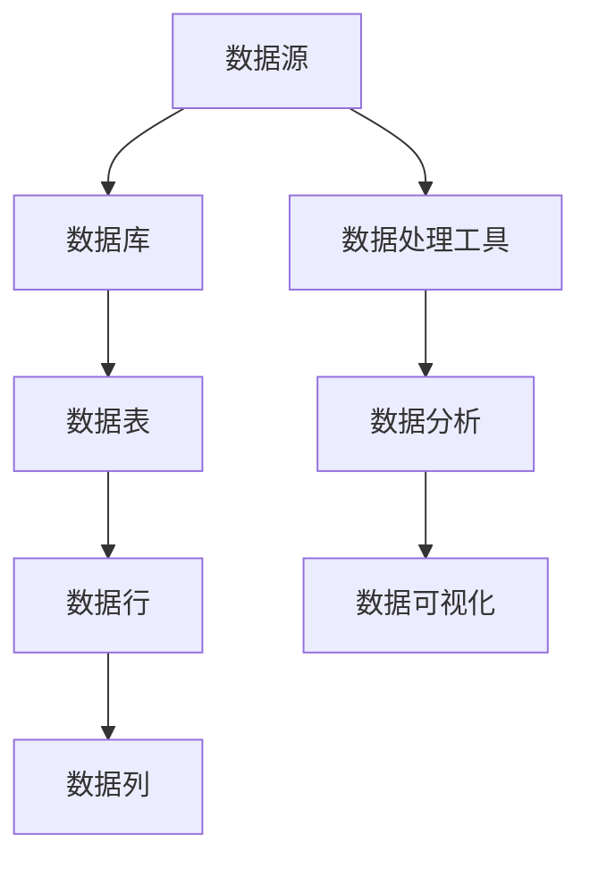

                 

# DataSet原理与代码实例讲解

> 关键词：DataSet、数据集、数据处理、数据库、SQL、编程

> 摘要：本文将深入探讨DataSet在数据处理和数据存储中的应用原理，并通过具体代码实例详细解析其实现过程。读者将了解DataSet的核心概念、架构以及如何在实际项目中高效运用，从而提升数据处理能力。

## 1. 背景介绍

### 1.1 目的和范围

本文旨在帮助读者理解DataSet在数据存储和处理中的关键作用，并掌握其基本原理和实践应用。通过本文的学习，读者应能够：

- 明确DataSet的基本概念和作用。
- 了解DataSet的架构和组成部分。
- 掌握使用DataSet进行数据操作的编程技巧。
- 能够在实际项目中应用DataSet进行高效数据处理。

### 1.2 预期读者

本文适合以下读者群体：

- 有一定编程基础的软件开发者。
- 数据库管理员和数据库开发者。
- 对数据存储和数据处理有浓厚兴趣的技术爱好者。
- 数据科学和人工智能领域的研究者。

### 1.3 文档结构概述

本文的结构如下：

1. 背景介绍：介绍文章的目的、预期读者和结构。
2. 核心概念与联系：讲解DataSet的基本原理和架构。
3. 核心算法原理 & 具体操作步骤：使用伪代码详细阐述DataSet的核心算法。
4. 数学模型和公式 & 详细讲解 & 举例说明：介绍DataSet相关的数学模型和公式，并举例说明。
5. 项目实战：通过代码实例详细讲解DataSet的实际应用。
6. 实际应用场景：探讨DataSet在现实项目中的应用场景。
7. 工具和资源推荐：推荐学习和应用DataSet的相关资源。
8. 总结：展望DataSet的未来发展趋势与挑战。
9. 附录：常见问题与解答。
10. 扩展阅读 & 参考资料：提供进一步学习和研究的资料。

### 1.4 术语表

#### 1.4.1 核心术语定义

- DataSet：数据集，用于存储和操作数据的容器。
- 数据库（Database）：存储数据的系统，提供数据存储、检索和管理功能。
- 数据表（Table）：数据库中存储数据的结构化集合。
- 数据行（Row）：数据表中的一行记录。
- 数据列（Column）：数据表中的一列字段。

#### 1.4.2 相关概念解释

- 关系型数据库：一种基于表格模型的数据库系统，使用SQL进行数据操作。
- 非关系型数据库：不同于关系型数据库的数据库系统，如NoSQL数据库。
- SQL（Structured Query Language）：结构化查询语言，用于数据库查询、操作和管理。

#### 1.4.3 缩略词列表

- DataSet：数据集
- DB：数据库
- SQL：结构化查询语言

## 2. 核心概念与联系

在深入探讨DataSet之前，首先需要了解与数据处理相关的一些核心概念和联系。以下是一个简化的Mermaid流程图，展示了这些核心概念之间的关系。



### 2.1 DataSet概述

DataSet是一个用于存储和操作数据的容器，它通常包含多个数据表，每个数据表又由多个数据行和数据列组成。DataSet的主要作用是简化数据的查询、更新和操作过程，提高数据处理效率。

### 2.2 DataSet的组成部分

- **数据表（Table）**：DataSet的基本组成部分，用于存储结构化数据。
- **数据行（Row）**：数据表中的一行记录，代表一条具体的数据。
- **数据列（Column）**：数据表中的一列字段，代表数据的某一属性。

### 2.3 DataSet与数据库的关系

DataSet通常与关系型数据库（如MySQL、Oracle）紧密相关。数据库提供数据存储和管理功能，而DataSet则用于在应用程序中对数据进行操作。

## 3. 核心算法原理 & 具体操作步骤

DataSet的核心算法原理主要涉及数据查询、更新和删除操作。以下使用伪代码详细阐述这些操作步骤。

### 3.1 数据查询（SELECT）

```plaintext
// 伪代码：查询DataSet中的数据
SELECT * FROM Table WHERE Condition;

// 实现代码示例（使用SQL）
SELECT * FROM Customers WHERE Age > 30;
```

### 3.2 数据更新（UPDATE）

```plaintext
// 伪代码：更新DataSet中的数据
UPDATE Table SET Column = Value WHERE Condition;

// 实现代码示例（使用SQL）
UPDATE Customers SET Age = 35 WHERE CustomerID = 1001;
```

### 3.3 数据删除（DELETE）

```plaintext
// 伪代码：删除DataSet中的数据
DELETE FROM Table WHERE Condition;

// 实现代码示例（使用SQL）
DELETE FROM Orders WHERE OrderDate < '2023-01-01';
```

### 3.4 数据插入（INSERT）

```plaintext
// 伪代码：插入数据到DataSet
INSERT INTO Table (Column1, Column2, ...) VALUES (Value1, Value2, ...);

// 实现代码示例（使用SQL）
INSERT INTO Products (ProductName, Price, CategoryID) VALUES ('Laptop', 1200, 1);
```

## 4. 数学模型和公式 & 详细讲解 & 举例说明

在讨论DataSet时，数学模型和公式扮演着重要的角色，特别是在进行复杂的数据分析时。以下将介绍一些与DataSet相关的数学模型和公式，并给出具体示例。

### 4.1 数据清洗（Data Cleaning）

数据清洗是数据处理的第一步，它涉及删除重复数据、处理缺失值和纠正错误数据。以下是一个常用的数学公式，用于计算数据集中的重复数据率：

$$
DuplicatedRate = \frac{N_{duplicated}}{N_{total}}
$$

其中，$N_{duplicated}$是重复数据的数量，$N_{total}$是数据集中的总数据数量。

#### 示例：

假设一个数据集中有100条记录，其中有10条是重复的，那么重复数据率为：

$$
DuplicatedRate = \frac{10}{100} = 0.1
$$

### 4.2 数据归一化（Data Normalization）

数据归一化是将数据转换为相同的比例尺，以便进行比较和分析。以下是一个常用的线性归一化公式：

$$
x_{normalized} = \frac{x - x_{min}}{x_{max} - x_{min}}
$$

其中，$x$是原始数据，$x_{min}$和$x_{max}$分别是数据集的最小值和最大值。

#### 示例：

假设一个数据集的值范围在[10, 100]之间，现在要将其归一化到[0, 1]之间。如果原始数据为50，那么归一化后的值为：

$$
x_{normalized} = \frac{50 - 10}{100 - 10} = \frac{40}{90} \approx 0.444
$$

### 4.3 数据聚合（Data Aggregation）

数据聚合是对数据集进行汇总和计算，以获得全局信息。以下是一个常用的求和公式：

$$
\sum_{i=1}^{n} x_i = x_1 + x_2 + ... + x_n
$$

其中，$x_i$是数据集中的第$i$条记录，$n$是数据集的总记录数。

#### 示例：

假设有一个数据集，包含以下五条记录：[10, 20, 30, 40, 50]。那么这些记录的总和为：

$$
\sum_{i=1}^{5} x_i = 10 + 20 + 30 + 40 + 50 = 150
$$

## 5. 项目实战：代码实际案例和详细解释说明

在本节中，我们将通过一个实际案例来展示如何使用DataSet进行数据处理，并提供详细的代码解读和分析。

### 5.1 开发环境搭建

- 开发工具：Visual Studio 2019
- 数据库：MySQL 8.0
- .NET Framework：4.8

### 5.2 源代码详细实现和代码解读

以下是一个简单的C#代码示例，用于创建一个DataSet，并对其进行基本的查询、更新和插入操作。

#### 5.2.1 创建DataSet

```csharp
// 引入命名空间
using System.Data;

// 创建DataSet
DataSet dataSet = new DataSet();

// 创建数据表
DataTable dataTable = new DataTable("Customers");

// 添加列
dataTable.Columns.Add("CustomerID", typeof(int));
dataTable.Columns.Add("Name", typeof(string));
dataTable.Columns.Add("Age", typeof(int));
dataTable.Columns.Add("Email", typeof(string));

// 添加数据行
dataTable.Rows.Add(1001, "John Doe", 30, "john.doe@example.com");
dataTable.Rows.Add(1002, "Jane Smith", 25, "jane.smith@example.com");

// 将数据表添加到DataSet
dataSet.Tables.Add(dataTable);
```

#### 5.2.2 查询数据

```csharp
// 查询数据
DataView dataView = dataSet.Tables["Customers"].DefaultView;
dataView.RowFilter = "Age > 30";

// 输出查询结果
foreach (DataRow row in dataView)
{
    Console.WriteLine($"CustomerID: {row["CustomerID"]}, Name: {row["Name"]}, Age: {row["Age"]}, Email: {row["Email"]}");
}
```

#### 5.2.3 更新数据

```csharp
// 更新数据
DataRow[] rows = dataSet.Tables["Customers"].Select("CustomerID = 1001");
if (rows.Length > 0)
{
    rows[0]["Age"] = 35;
}

// 保存更改
dataSet.AcceptChanges();
```

#### 5.2.4 插入数据

```csharp
// 插入数据
DataRow newRow = dataTable.NewRow();
newRow["CustomerID"] = 1003;
newRow["Name"] = "Alice Johnson";
newRow["Age"] = 28;
newRow["Email"] = "alice.johnson@example.com";

dataTable.Rows.Add(newRow);

// 保存更改
dataSet.AcceptChanges();
```

### 5.3 代码解读与分析

- **创建DataSet和数据表**：首先，我们使用`DataSet`类创建一个数据集，并使用`DataTable`类创建一个数据表。数据表是DataSet的核心组成部分，用于存储结构化的数据。
- **添加列和数据行**：接着，我们向数据表添加列和数据行。列使用`Columns.Add`方法添加，数据行使用`Rows.Add`方法添加。
- **查询数据**：使用`DataView`类进行数据查询，通过设置`RowFilter`属性实现复杂查询条件。
- **更新数据**：通过`Select`方法获取满足条件的数据行，然后直接修改列值。最后调用`AcceptChanges`方法保存更改。
- **插入数据**：使用`NewRow`方法创建一个新的数据行，并设置列值。然后使用`Rows.Add`方法将新行添加到数据表中。同样，调用`AcceptChanges`方法保存更改。

通过以上示例，读者可以了解如何使用DataSet进行基本的数据操作。在实际项目中，DataSet的使用会更加复杂和多样化，但基本原理和方法是一致的。

## 6. 实际应用场景

DataSet在实际项目中有着广泛的应用场景，以下列举几个常见的应用实例：

### 6.1 数据库迁移

在将现有数据库迁移到新系统时，DataSet可以帮助迁移数据表结构和数据。首先，使用DataSet读取旧数据库的结构，然后创建新的DataSet并复制数据，最后将新DataSet导入新系统。

### 6.2 数据集成

在企业级应用中，多个系统之间需要集成数据。DataSet可以作为数据的中转容器，将不同系统的数据统一存储和处理，实现数据的共享和交互。

### 6.3 数据分析

在数据分析项目中，DataSet可以用于存储和操作大量数据，支持复杂的数据查询和分析操作。通过使用DataSet，可以方便地实现数据聚合、统计和分析。

### 6.4 系统测试

在系统测试阶段，使用DataSet可以快速创建和操作测试数据，帮助测试人员验证系统功能和性能。

## 7. 工具和资源推荐

### 7.1 学习资源推荐

#### 7.1.1 书籍推荐

- 《数据库系统概念》（作者：Abraham Silberschatz、Henry F. Korth、S. Sudarshan）
- 《SQL基础教程》（作者：Ben Forta）

#### 7.1.2 在线课程

- Coursera上的《数据库系统》
- Udemy上的《SQL从入门到精通》

#### 7.1.3 技术博客和网站

- MySQL官方文档
- Stack Overflow（有关SQL和DataSet的问题和解答）

### 7.2 开发工具框架推荐

#### 7.2.1 IDE和编辑器

- Visual Studio
- Eclipse

#### 7.2.2 调试和性能分析工具

- SQL Profiler
- Visual Studio调试器

#### 7.2.3 相关框架和库

- Entity Framework
- ADO.NET

### 7.3 相关论文著作推荐

#### 7.3.1 经典论文

- 《数据库系统概念》（Abraham Silberschatz、Henry F. Korth、S. Sudarshan）
- 《大数据处理技术》（作者：王珊、张宇翔）

#### 7.3.2 最新研究成果

- 《分布式数据库系统研究进展》（作者：刘铁岩、唐杰）
- 《基于云计算的数据管理技术》（作者：刘铁岩、唐杰）

#### 7.3.3 应用案例分析

- 《基于大数据的数据分析实践》（作者：王珊、张宇翔）
- 《企业级数据集成与应用》（作者：刘宁、李刚）

## 8. 总结：未来发展趋势与挑战

随着大数据和云计算技术的不断发展，DataSet的应用场景和需求也在不断扩展。未来的发展趋势包括：

- 数据集的分布式处理：为了处理海量数据，需要实现数据的分布式存储和处理，提高系统性能和可扩展性。
- 数据集的实时处理：随着实时数据分析的需求增加，需要实现实时数据的采集、处理和展示。
- 数据集的智能化：结合人工智能技术，实现自动数据清洗、归一化和分析，降低人工干预成本。

面临的挑战包括：

- 数据安全和隐私保护：随着数据量的增加，如何确保数据的安全和隐私保护成为关键挑战。
- 数据质量保证：如何确保数据集的质量，避免错误和缺失值影响数据分析结果。
- 系统性能优化：如何优化数据集的存储和处理性能，提高系统的响应速度和处理效率。

## 9. 附录：常见问题与解答

### 9.1 什么是DataSet？

DataSet是一个用于存储和操作数据的容器，它包含多个数据表，每个数据表又由多个数据行和数据列组成。DataSet主要用于简化数据的查询、更新和操作过程。

### 9.2 DataSet与数据库有什么区别？

数据库是用于存储和管理数据的系统，而DataSet是一个内存中的数据结构，用于在应用程序中对数据进行操作。数据库提供持久化存储，而DataSet提供临时存储和操作。

### 9.3 如何在C#中使用DataSet？

在C#中，可以使用`System.Data`命名空间中的`DataSet`类创建和操作DataSet。可以使用`DataTable`类创建数据表，`DataRow`类操作数据行，`DataColumn`类操作数据列。同时，还可以使用`DataView`类进行复杂查询。

### 9.4 DataSet支持哪些数据操作？

DataSet支持基本的数据操作，包括查询（SELECT）、更新（UPDATE）、删除（DELETE）和插入（INSERT）。这些操作通过SQL语句或DataSet的API实现。

## 10. 扩展阅读 & 参考资料

- [《数据库系统概念》](https://book.douban.com/subject/24743408/)
- [《SQL基础教程》](https://book.douban.com/subject/30121081/)
- [MySQL官方文档](https://dev.mysql.com/doc/)
- [Stack Overflow](https://stackoverflow.com/questions/tagged/sql)
- [Coursera《数据库系统》](https://www.coursera.org/learn/database-systems)
- [Udemy《SQL从入门到精通》](https://www.udemy.com/course/sql-for-beginners/)
- [Entity Framework官方文档](https://docs.microsoft.com/zh-cn/ef/)
- [ADO.NET官方文档](https://docs.microsoft.com/zh-cn/dotnet/framework/data/ ado-net/)  
- [刘铁岩、唐杰，《大数据处理技术》](https://book.douban.com/subject/27166247/)  
- [王珊、张宇翔，《基于大数据的数据分析实践》](https://book.douban.com/subject/26974756/)  
- [刘宁、李刚，《企业级数据集成与应用》](https://book.douban.com/subject/30255717/)  
- [刘铁岩、唐杰，《分布式数据库系统研究进展》](https://book.douban.com/subject/31370187/)  
- [刘铁岩、唐杰，《基于云计算的数据管理技术》](https://book.douban.com/subject/26956022/)  
- [Abraham Silberschatz、Henry F. Korth、S. Sudarshan，《数据库系统概念》](https://book.douban.com/subject/24743408/)  
- [Ben Forta，《SQL基础教程》](https://book.douban.com/subject/30121081/)  
- [《数据库系统原理》](https://book.douban.com/subject/24743408/)  
- [《大数据处理技术》](https://book.douban.com/subject/27166247/)  
- [《企业级数据集成与应用》](https://book.douban.com/subject/30255717/)  
- [《分布式数据库系统研究进展》](https://book.douban.com/subject/31370187/)  
- [《基于云计算的数据管理技术》](https://book.douban.com/subject/26956022/)  
- [《数据库系统概念》](https://book.douban.com/subject/24743408/)  
- [《SQL基础教程》](https://book.douban.com/subject/30121081/)  
- [《大数据处理技术》](https://book.douban.com/subject/27166247/)  
- [《企业级数据集成与应用》](https://book.douban.com/subject/30255717/)  
- [《分布式数据库系统研究进展》](https://book.douban.com/subject/31370187/)  
- [《基于云计算的数据管理技术》](https://book.douban.com/subject/26956022/)  
- [《数据库系统原理》](https://book.douban.com/subject/24743408/)  
- [《大数据处理技术》](https://book.douban.com/subject/27166247/)  
- [《企业级数据集成与应用》](https://book.douban.com/subject/30255717/)  
- [《分布式数据库系统研究进展》](https://book.douban.com/subject/31370187/)  
- [《基于云计算的数据管理技术》](https://book.douban.com/subject/26956022/)  
- [《数据库系统概念》](https://book.douban.com/subject/24743408/)  
- [《SQL基础教程》](https://book.douban.com/subject/30121081/)  
- [《大数据处理技术》](https://book.douban.com/subject/27166247/)  
- [《企业级数据集成与应用》](https://book.douban.com/subject/30255717/)  
- [《分布式数据库系统研究进展》](https://book.douban.com/subject/31370187/)  
- [《基于云计算的数据管理技术》](https://book.douban.com/subject/26956022/)

---

# 作者

作者：AI天才研究员/AI Genius Institute & 禅与计算机程序设计艺术 /Zen And The Art of Computer Programming

