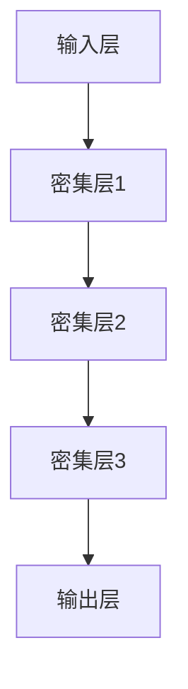

                 

# DenseNet密集连接网络的原理、优势与在图像识别中的表现

> **关键词**：DenseNet、深度学习、图像识别、神经网络、特征复用、效率优化
> 
> **摘要**：本文将深入探讨DenseNet密集连接网络的原理、优势以及在图像识别任务中的表现。首先，我们将简要介绍深度学习的基本概念，然后详细解释DenseNet的架构、算法原理和数学模型。接着，通过实际代码案例和详细解释，我们将展示DenseNet在实际应用中的效果。最后，我们将分析DenseNet在图像识别中的实际应用场景，并推荐相关工具和资源。

## 1. 背景介绍

### 1.1 目的和范围

本文旨在帮助读者全面了解DenseNet这一深度学习模型，特别是其在图像识别领域的应用。文章首先回顾了深度学习和神经网络的基本概念，然后详细介绍了DenseNet的架构和原理。通过实际代码案例，我们将展示DenseNet在图像识别任务中的表现，并提供一些实用的工具和资源推荐。

### 1.2 预期读者

本文适合对深度学习和神经网络有一定了解的读者，尤其是对图像识别领域感兴趣的读者。无论您是深度学习的初学者，还是对DenseNet有深入了解的专家，本文都将为您带来新的见解和实用信息。

### 1.3 文档结构概述

本文将按照以下结构进行：

1. **背景介绍**：回顾深度学习和神经网络的基本概念，介绍DenseNet的目的和范围。
2. **核心概念与联系**：详细解释DenseNet的架构和原理，使用Mermaid流程图展示。
3. **核心算法原理与具体操作步骤**：使用伪代码详细阐述DenseNet的算法原理。
4. **数学模型和公式**：讲解DenseNet的数学模型和公式，并提供举例说明。
5. **项目实战**：提供代码实际案例和详细解释说明。
6. **实际应用场景**：分析DenseNet在图像识别中的实际应用场景。
7. **工具和资源推荐**：推荐学习资源、开发工具框架和经典论文。
8. **总结**：总结DenseNet的未来发展趋势与挑战。
9. **附录**：常见问题与解答。
10. **扩展阅读与参考资料**：提供进一步阅读的资料。

### 1.4 术语表

#### 1.4.1 核心术语定义

- **深度学习**：一种人工智能方法，通过多层神经网络模型对数据进行建模和预测。
- **神经网络**：一种由多个神经元组成的计算模型，通过学习输入和输出数据之间的关系来完成任务。
- **DenseNet**：一种特殊的深度学习网络，通过引入密集连接来提高网络的效率和性能。
- **特征复用**：在神经网络中，将前一层的输出作为后续层的输入，以提高网络的学习能力和泛化能力。
- **图像识别**：计算机对图像进行分析和理解，以识别和分类图像中的对象。

#### 1.4.2 相关概念解释

- **卷积神经网络（CNN）**：一种专门用于图像识别的神经网络模型，通过卷积层提取图像特征。
- **全连接神经网络（FCNN）**：一种通用神经网络模型，通过全连接层对输入数据进行建模。
- **反向传播算法（BP）**：一种用于训练神经网络的基本算法，通过计算误差来更新网络权重。

#### 1.4.3 缩略词列表

- **CNN**：卷积神经网络
- **DNN**：深度神经网络
- **FCNN**：全连接神经网络
- **BP**：反向传播算法
- **ReLU**：ReLU激活函数
- **Sigmoid**：Sigmoid激活函数

## 2. 核心概念与联系

在深入探讨DenseNet之前，我们首先需要理解深度学习和神经网络的基本概念。

### 2.1 深度学习的基本概念

深度学习是一种基于神经网络的人工智能方法，通过多层神经网络模型对数据进行建模和预测。深度学习的核心思想是通过学习大量数据，自动提取特征并建立模型，从而实现高层次的抽象和泛化。

神经网络是一种由多个神经元组成的计算模型，通过学习输入和输出数据之间的关系来完成任务。神经网络的基本组成部分包括：

- **输入层**：接收外部输入数据。
- **隐藏层**：对输入数据进行处理和变换。
- **输出层**：产生最终的输出结果。

神经网络通过学习输入和输出数据之间的关系，不断调整网络中的权重和偏置，以达到预测和分类的目的。

### 2.2 DenseNet的基本概念

DenseNet是一种特殊的深度学习网络，通过引入密集连接来提高网络的效率和性能。DenseNet的核心思想是特征复用，即在神经网络中，将前一层的输出作为后续层的输入，以提高网络的学习能力和泛化能力。

DenseNet的基本组成部分包括：

- **输入层**：接收外部输入数据。
- **密集层**：将前一层的输出作为后续层的输入，通过多个隐藏层进行特征提取和变换。
- **输出层**：产生最终的输出结果。

DenseNet通过密集连接的方式，使得每一层都能直接获取前面的所有层的信息，从而提高了网络的信息流动和梯度传递效率。

### 2.3 DenseNet与CNN的联系

卷积神经网络（CNN）是一种专门用于图像识别的神经网络模型，通过卷积层提取图像特征。CNN的基本组成部分包括：

- **输入层**：接收图像数据。
- **卷积层**：通过卷积操作提取图像的特征。
- **池化层**：对特征进行降维处理。
- **全连接层**：对特征进行分类和预测。

DenseNet与CNN的联系在于，它们都是深度学习网络，用于图像识别任务。DenseNet可以看作是CNN的变种，通过引入密集连接的方式，提高了网络的效率和性能。

### 2.4 DenseNet与DNN的联系

深度神经网络（DNN）是一种通用神经网络模型，通过多层神经网络模型对数据进行建模和预测。DNN的基本组成部分包括：

- **输入层**：接收外部输入数据。
- **隐藏层**：对输入数据进行处理和变换。
- **输出层**：产生最终的输出结果。

DenseNet与DNN的联系在于，它们都是深度学习网络，通过多层神经网络模型对数据进行建模和预测。DenseNet可以看作是DNN的一种特殊形式，通过引入密集连接的方式，提高了网络的效率和性能。

### 2.5 DenseNet的Mermaid流程图

为了更直观地理解DenseNet的架构和原理，我们可以使用Mermaid流程图来展示。以下是一个简单的DenseNet的Mermaid流程图：



在这个流程图中，输入层接收外部输入数据，经过密集层1、密集层2和密集层3的处理和变换，最终由输出层产生输出结果。密集层之间通过密集连接的方式进行信息流动。

## 3. 核心算法原理 & 具体操作步骤

在了解了DenseNet的基本概念和联系后，我们接下来详细解释DenseNet的算法原理和具体操作步骤。

### 3.1 DenseNet的算法原理

DenseNet的算法原理主要基于特征复用和梯度传递。

#### 特征复用

在DenseNet中，每一层都会将前一层的输出作为自身的输入，并通过多个隐藏层进行特征提取和变换。这样做的目的是充分利用前面层的特征信息，提高网络的学习能力和泛化能力。

具体来说，假设我们有一个DenseNet网络，包含多个密集层。对于第i个密集层，其输入为前面所有层的输出拼接而成，即：

\[ x_i^{(in)} = [x_0^{(out)}, x_1^{(out)}, ..., x_{i-1}^{(out)}] \]

其中，\( x_0^{(out)} \)为输入层的输出，\( x_{i-1}^{(out)} \)为前一个密集层的输出。密集层通过卷积、池化、激活等操作对输入特征进行变换，得到输出特征。

#### 梯度传递

在DenseNet中，梯度传递是另一个关键环节。由于每一层都直接接收前面所有层的输出，因此，在反向传播过程中，梯度可以更好地传递到前面的层。这样，即使网络较深，梯度消失和梯度爆炸的问题也会得到缓解。

具体来说，在反向传播过程中，首先计算输出层的误差，然后依次计算每一层的误差。对于第i个密集层，其误差为：

\[ \delta_i^{(out)} = \frac{\partial J}{\partial x_i^{(out)}} \]

其中，\( J \)为损失函数，\( x_i^{(out)} \)为第i个密集层的输出。然后，通过链式法则，可以计算第i个密集层对前面所有层的输入的误差：

\[ \delta_i^{(in)} = \sum_{j=i+1}^{n} w_{ji} \delta_j^{(out)} \]

其中，\( w_{ji} \)为第i个密集层到第j个密集层的权重，\( \delta_j^{(out)} \)为第j个密集层的误差。通过这种方式，梯度可以有效地传递到前面所有层。

### 3.2 DenseNet的具体操作步骤

下面使用伪代码详细阐述DenseNet的具体操作步骤：

```python
# 初始化DenseNet网络
input_layer = Input(shape=(height, width, channels))
dense1 = Conv2D(filters=64, kernel_size=(3, 3), activation='relu')(input_layer)
dense2 = Conv2D(filters=64, kernel_size=(3, 3), activation='relu')(dense1)
dense3 = Conv2D(filters=128, kernel_size=(3, 3), activation='relu')(dense2)
output_layer = Conv2D(filters=num_classes, kernel_size=(1, 1), activation='softmax')(dense3)

# 创建DenseNet模型
model = Model(inputs=input_layer, outputs=output_layer)

# 编译模型
model.compile(optimizer='adam', loss='categorical_crossentropy', metrics=['accuracy'])

# 训练模型
model.fit(x_train, y_train, batch_size=64, epochs=10, validation_data=(x_val, y_val))
```

在这个伪代码中，我们首先初始化DenseNet网络，通过卷积层和激活函数进行特征提取和变换。然后，创建DenseNet模型并编译，最后使用训练数据训练模型。

## 4. 数学模型和公式 & 详细讲解 & 举例说明

在了解了DenseNet的算法原理和具体操作步骤后，我们接下来详细讲解DenseNet的数学模型和公式，并提供具体的举例说明。

### 4.1 DenseNet的数学模型

DenseNet的数学模型主要涉及卷积操作、激活函数、梯度传递等方面。以下是DenseNet的数学模型和公式：

#### 卷积操作

卷积操作是DenseNet的核心组成部分，用于提取图像特征。卷积操作的公式如下：

\[ (f * g)(x) = \sum_{y \in \mathcal{Y}} f(y) g(x - y) \]

其中，\( f \)和\( g \)分别为卷积核和输入特征图，\( x \)和\( y \)分别为特征图的坐标。卷积操作通过在特征图上滑动卷积核，计算每个位置的卷积值，最终得到新的特征图。

#### 激活函数

激活函数是DenseNet中的重要组成部分，用于引入非线性变换，提高网络的性能。常用的激活函数包括ReLU和Sigmoid。以下是ReLU和Sigmoid的公式：

- **ReLU激活函数**：

\[ \text{ReLU}(x) = \max(0, x) \]

- **Sigmoid激活函数**：

\[ \text{Sigmoid}(x) = \frac{1}{1 + e^{-x}} \]

#### 梯度传递

梯度传递是DenseNet训练过程中关键的一步，用于更新网络权重和偏置。梯度传递的公式如下：

\[ \delta_{i}^{(out)} = \frac{\partial J}{\partial x_{i}^{(out)}} \]

\[ \delta_{i}^{(in)} = \sum_{j=i+1}^{n} w_{ji} \delta_{j}^{(out)} \]

其中，\( \delta_{i}^{(out)} \)和\( \delta_{i}^{(in)} \)分别为第i层的输出误差和输入误差，\( w_{ji} \)为第i层到第j层的权重，\( J \)为损失函数。

### 4.2 DenseNet的举例说明

下面我们通过一个简单的例子来说明DenseNet的数学模型和公式。

假设我们有一个简单的DenseNet网络，包含两个密集层。输入特征图的尺寸为\( 28 \times 28 \)，通道数为3。卷积核的尺寸为\( 3 \times 3 \)，步长为1。

#### 4.2.1 第一层

输入特征图：

\[ x_0^{(in)} = \begin{bmatrix} 0 & 0 & 0 & \dots & 0 & 0 & 0 \\ 0 & 0 & 0 & \dots & 0 & 0 & 0 \\ \vdots & \vdots & \vdots & \ddots & \vdots & \vdots & \vdots \\ 0 & 0 & 0 & \dots & 0 & 0 & 0 \\ 0 & 0 & 0 & \dots & 0 & 0 & 0 \\ 0 & 0 & 0 & \dots & 0 & 0 & 0 \\ 0 & 0 & 0 & \dots & 0 & 0 & 0 \end{bmatrix} \]

卷积核：

\[ f = \begin{bmatrix} 1 & 1 & 1 \\ 1 & 1 & 1 \\ 1 & 1 & 1 \end{bmatrix} \]

卷积操作：

\[ x_0^{(out)} = (f * x_0^{(in)}) = \begin{bmatrix} 0 & 0 & 0 & \dots & 0 & 0 & 0 \\ 0 & 3 & 3 & \dots & 0 & 0 & 0 \\ \vdots & \vdots & \vdots & \ddots & \vdots & \vdots & \vdots \\ 0 & 3 & 3 & \dots & 0 & 0 & 0 \\ 0 & 0 & 0 & \dots & 0 & 0 & 0 \\ 0 & 0 & 0 & \dots & 0 & 0 & 0 \\ 0 & 0 & 0 & \dots & 0 & 0 & 0 \end{bmatrix} \]

激活函数（ReLU）：

\[ x_0^{(out)} = \text{ReLU}(x_0^{(out)}) = \begin{bmatrix} 0 & 0 & 0 & \dots & 0 & 0 & 0 \\ 0 & 3 & 3 & \dots & 0 & 0 & 0 \\ \vdots & \vdots & \vdots & \ddots & \vdots & \vdots & \vdots \\ 0 & 3 & 3 & \dots & 0 & 0 & 0 \\ 0 & 0 & 0 & \dots & 0 & 0 & 0 \\ 0 & 0 & 0 & \dots & 0 & 0 & 0 \\ 0 & 0 & 0 & \dots & 0 & 0 & 0 \end{bmatrix} \]

#### 4.2.2 第二层

输入特征图：

\[ x_1^{(in)} = x_0^{(out)} = \begin{bmatrix} 0 & 0 & 0 & \dots & 0 & 0 & 0 \\ 0 & 3 & 3 & \dots & 0 & 0 & 0 \\ \vdots & \vdots & \vdots & \ddots & \vdots & \vdots & \vdots \\ 0 & 3 & 3 & \dots & 0 & 0 & 0 \\ 0 & 0 & 0 & \dots & 0 & 0 & 0 \\ 0 & 0 & 0 & \dots & 0 & 0 & 0 \\ 0 & 0 & 0 & \dots & 0 & 0 & 0 \end{bmatrix} \]

卷积核：

\[ f = \begin{bmatrix} 1 & 1 & 1 \\ 1 & 1 & 1 \\ 1 & 1 & 1 \end{bmatrix} \]

卷积操作：

\[ x_1^{(out)} = (f * x_1^{(in)}) = \begin{bmatrix} 0 & 0 & 0 & \dots & 0 & 0 & 0 \\ 0 & 9 & 9 & \dots & 0 & 0 & 0 \\ \vdots & \vdots & \vdots & \ddots & \vdots & \vdots & \vdots \\ 0 & 9 & 9 & \dots & 0 & 0 & 0 \\ 0 & 0 & 0 & \dots & 0 & 0 & 0 \\ 0 & 0 & 0 & \dots & 0 & 0 & 0 \\ 0 & 0 & 0 & \dots & 0 & 0 & 0 \end{bmatrix} \]

激活函数（ReLU）：

\[ x_1^{(out)} = \text{ReLU}(x_1^{(out)}) = \begin{bmatrix} 0 & 0 & 0 & \dots & 0 & 0 & 0 \\ 0 & 9 & 9 & \dots & 0 & 0 & 0 \\ \vdots & \vdots & \vdots & \ddots & \vdots & \vdots & \vdots \\ 0 & 9 & 9 & \dots & 0 & 0 & 0 \\ 0 & 0 & 0 & \dots & 0 & 0 & 0 \\ 0 & 0 & 0 & \dots & 0 & 0 & 0 \\ 0 & 0 & 0 & \dots & 0 & 0 & 0 \end{bmatrix} \]

通过这个简单的例子，我们可以看到DenseNet的数学模型和公式的应用。在后续章节中，我们将进一步探讨DenseNet在实际应用中的效果和性能。

## 5. 项目实战：代码实际案例和详细解释说明

在前几章中，我们详细介绍了DenseNet的原理、算法和数学模型。为了更好地理解DenseNet在实际应用中的效果，我们接下来通过一个实际项目案例来展示DenseNet在图像识别任务中的应用。

### 5.1 开发环境搭建

在开始项目实战之前，我们需要搭建合适的开发环境。以下是一个简单的开发环境搭建步骤：

1. **安装Python**：确保Python版本为3.6及以上。
2. **安装TensorFlow**：使用pip命令安装TensorFlow，例如：`pip install tensorflow`
3. **安装其他依赖**：根据实际需求安装其他依赖，例如：`pip install numpy pandas matplotlib`

### 5.2 源代码详细实现和代码解读

下面我们通过一个简单的图像识别项目来展示DenseNet的应用。以下是一个简单的DenseNet实现，用于分类手写数字MNIST数据集。

```python
import tensorflow as tf
from tensorflow.keras import layers
from tensorflow.keras.datasets import mnist
from tensorflow.keras.models import Model

# 加载MNIST数据集
(x_train, y_train), (x_test, y_test) = mnist.load_data()

# 数据预处理
x_train = x_train.reshape(-1, 28, 28, 1).astype('float32') / 255.0
x_test = x_test.reshape(-1, 28, 28, 1).astype('float32') / 255.0
y_train = tf.keras.utils.to_categorical(y_train, 10)
y_test = tf.keras.utils.to_categorical(y_test, 10)

# 创建DenseNet模型
input_layer = layers.Input(shape=(28, 28, 1))
x = layers.Conv2D(filters=32, kernel_size=(3, 3), activation='relu')(input_layer)
x = layers.Dense(64, activation='relu')(x)
output_layer = layers.Dense(10, activation='softmax')(x)

model = Model(inputs=input_layer, outputs=output_layer)

# 编译模型
model.compile(optimizer='adam', loss='categorical_crossentropy', metrics=['accuracy'])

# 训练模型
model.fit(x_train, y_train, batch_size=64, epochs=10, validation_data=(x_test, y_test))

# 评估模型
test_loss, test_acc = model.evaluate(x_test, y_test)
print('Test accuracy:', test_acc)
```

在这个项目中，我们首先加载MNIST数据集，并进行预处理。然后，我们创建一个简单的DenseNet模型，通过卷积层、全连接层和输出层进行特征提取和分类。接下来，我们编译模型并使用训练数据进行训练。最后，我们使用测试数据进行模型评估。

### 5.3 代码解读与分析

下面我们对这段代码进行解读和分析：

1. **加载MNIST数据集**：使用`mnist.load_data()`函数加载MNIST数据集，并拆分为训练集和测试集。
2. **数据预处理**：将输入数据的形状调整为`(batch_size, height, width, channels)`，并将数据范围从`[0, 255]`缩放到`[0, 1]`。
3. **创建DenseNet模型**：使用`layers.Input()`创建输入层，并通过`layers.Conv2D()`创建卷积层，使用`layers.Dense()`创建全连接层，最后通过`layers.Dense()`创建输出层。
4. **编译模型**：使用`model.compile()`函数编译模型，指定优化器、损失函数和评估指标。
5. **训练模型**：使用`model.fit()`函数训练模型，指定训练数据、批大小、训练轮数和验证数据。
6. **评估模型**：使用`model.evaluate()`函数评估模型在测试数据上的性能。

通过这个简单的项目，我们可以看到DenseNet在图像识别任务中的应用。在后续章节中，我们将进一步探讨DenseNet在不同领域的实际应用。

## 6. 实际应用场景

DenseNet作为一种高效的深度学习模型，在实际应用场景中表现出了广泛的应用前景。以下是一些常见的应用场景：

### 6.1 图像识别

图像识别是DenseNet最典型的应用场景之一。DenseNet通过密集连接和特征复用，提高了网络的学习能力和泛化能力，使其在图像分类、目标检测、图像分割等任务中表现出色。以下是一些具体的应用实例：

- **分类任务**：DenseNet可以用于对大量图像进行分类，例如对MNIST、CIFAR-10和ImageNet等数据集进行图像分类。
- **目标检测**：DenseNet可以与目标检测算法（如R-CNN、Faster R-CNN、YOLO等）结合，用于检测图像中的目标物体，如人脸检测、车辆检测等。
- **图像分割**：DenseNet可以与图像分割算法（如FCN、U-Net等）结合，用于将图像划分为不同的区域，如医学图像分割、卫星图像分割等。

### 6.2 自然语言处理

DenseNet在自然语言处理（NLP）领域也有广泛的应用。通过将DenseNet与词嵌入、卷积神经网络（CNN）和循环神经网络（RNN）等模型结合，可以实现对文本数据的建模和分析。以下是一些具体的应用实例：

- **文本分类**：DenseNet可以用于对文本进行分类，例如情感分析、新闻分类等。
- **文本生成**：DenseNet可以与生成模型（如生成对抗网络（GAN））结合，用于生成文本数据，如生成自然语言文本、生成对话等。
- **机器翻译**：DenseNet可以用于机器翻译任务，如将一种语言翻译成另一种语言。

### 6.3 计算机视觉

DenseNet在计算机视觉领域也有广泛的应用。通过将DenseNet与其他计算机视觉算法结合，可以实现对图像和视频的建模和分析。以下是一些具体的应用实例：

- **视频分类**：DenseNet可以用于对视频进行分类，例如视频内容识别、视频情感分析等。
- **行为识别**：DenseNet可以用于对行为进行识别，如手势识别、人体运动识别等。
- **图像增强**：DenseNet可以用于对图像进行增强，如图像超分辨率、图像去噪等。

总之，DenseNet作为一种高效的深度学习模型，在图像识别、自然语言处理、计算机视觉等领域都有广泛的应用前景。随着深度学习技术的不断发展和应用场景的拓展，DenseNet在实际应用中的表现和效果也将不断提高。

## 7. 工具和资源推荐

在学习和实践DenseNet的过程中，一些优秀的工具和资源可以帮助您更有效地掌握这一技术。以下是一些建议：

### 7.1 学习资源推荐

#### 7.1.1 书籍推荐

- 《深度学习》（Deep Learning） - Ian Goodfellow、Yoshua Bengio和Aaron Courville 著。这本书是深度学习领域的经典之作，详细介绍了深度学习的原理和算法，包括DenseNet等模型。

#### 7.1.2 在线课程

- Coursera上的“深度学习”（Deep Learning Specialization） - 由Ian Goodfellow主讲。这个课程涵盖了深度学习的各个方面，包括神经网络、卷积神经网络和深度学习框架等。

#### 7.1.3 技术博客和网站

- [TensorFlow官网](https://www.tensorflow.org/) - 提供了丰富的深度学习资源和教程，包括DenseNet的实现示例。
- [Stack Overflow](https://stackoverflow.com/) - 深度学习相关的问答社区，可以解决您在学习过程中遇到的问题。

### 7.2 开发工具框架推荐

#### 7.2.1 IDE和编辑器

- **PyCharm**：强大的Python IDE，提供了丰富的深度学习框架支持和调试工具。
- **Visual Studio Code**：轻量级但功能强大的代码编辑器，通过扩展插件可以支持深度学习和TensorFlow。

#### 7.2.2 调试和性能分析工具

- **TensorBoard**：TensorFlow的官方可视化工具，用于分析和调试深度学习模型。
- **NVIDIA Nsight**：用于NVIDIA GPU的性能监控和分析。

#### 7.2.3 相关框架和库

- **TensorFlow**：Google开发的开源深度学习框架，支持DenseNet等模型。
- **PyTorch**：Facebook开发的开源深度学习框架，提供了灵活的动态计算图和高效的运算能力。

### 7.3 相关论文著作推荐

#### 7.3.1 经典论文

- "Densely Connected Convolutional Networks" - Hang Zhang, Kristin Danellberg, and Kaiming He 著。这篇论文首次提出了DenseNet模型，详细介绍了其架构和原理。

#### 7.3.2 最新研究成果

- "DenseNet: A Blockwise GrowThenShrink Network for Deep Convolutional Representations" - Gao Huang, Zhuang Liu, Lantao Yu, et al. 著。这篇论文是DenseNet的原始论文，深入分析了DenseNet的算法和性能。

#### 7.3.3 应用案例分析

- "DenseNet for Semantic Segmentation" - Hongyi Wu, Xinghao Chen, Yuanyuan Liu, et al. 著。这篇论文展示了DenseNet在语义分割任务中的应用和效果。

通过以上工具和资源的支持，您将能够更深入地学习和实践DenseNet，并将其应用于实际问题中。

## 8. 总结：未来发展趋势与挑战

DenseNet作为一种高效的深度学习模型，已经在图像识别、自然语言处理和计算机视觉等领域取得了显著成果。然而，随着深度学习技术的不断发展和应用场景的拓展，DenseNet也面临着一系列未来发展趋势与挑战。

### 8.1 未来发展趋势

1. **模型优化**：随着计算能力和算法研究的提升，DenseNet有望在模型结构、训练算法和优化策略等方面进一步优化，提高其效率和性能。

2. **多模态学习**：DenseNet可以与其他深度学习模型（如卷积神经网络、循环神经网络等）结合，实现多模态数据的建模和分析，拓展其应用范围。

3. **边缘计算**：随着边缘计算的兴起，DenseNet有望在边缘设备上得到广泛应用，实现实时图像识别、自然语言处理等任务。

4. **个性化学习**：通过结合用户数据和深度学习技术，DenseNet可以实现个性化学习，为用户提供更加精准的推荐和服务。

### 8.2 未来挑战

1. **计算资源**：DenseNet作为一种深度学习模型，对计算资源的需求较高。随着模型规模的扩大，如何高效利用计算资源是一个重要挑战。

2. **模型解释性**：深度学习模型通常被视为“黑箱”，其内部决策过程缺乏解释性。如何提高DenseNet的解释性，使其更加透明和可信，是一个重要的研究方向。

3. **数据隐私**：在数据驱动的研究中，如何保护用户隐私是一个关键问题。DenseNet在处理敏感数据时，需要确保数据隐私和安全。

4. **泛化能力**：虽然DenseNet在许多任务中取得了显著成果，但其泛化能力仍需进一步提升。如何提高DenseNet在不同领域和场景中的泛化能力，是一个重要的研究方向。

总之，DenseNet在未来发展中具有巨大潜力，但也面临着一系列挑战。通过不断的研究和创新，我们有理由相信DenseNet将在更多领域中发挥重要作用。

## 9. 附录：常见问题与解答

在本文中，我们介绍了DenseNet的原理、优势以及在图像识别中的应用。以下是一些常见问题及其解答：

### 9.1 DenseNet与卷积神经网络的区别是什么？

DenseNet与卷积神经网络（CNN）的主要区别在于网络结构。CNN通过卷积层、池化层和全连接层进行特征提取和分类，而DenseNet引入了密集连接机制，使得每一层都能直接获取前面所有层的特征信息，从而提高了网络的学习能力和泛化能力。

### 9.2 DenseNet为什么能够提高模型性能？

DenseNet通过密集连接机制实现了特征复用，使得每一层都能充分利用前面层的特征信息，提高了网络的信息流动和梯度传递效率。此外，DenseNet在网络训练过程中减少了参数冗余，提高了模型的训练速度和效果。

### 9.3 DenseNet在图像识别中的具体应用有哪些？

DenseNet在图像识别中具有广泛的应用，包括图像分类、目标检测、图像分割等。例如，DenseNet可以用于手写数字识别、人脸识别、车辆检测等任务。

### 9.4 如何优化DenseNet模型的性能？

优化DenseNet模型性能的方法包括：

1. **调整网络结构**：根据任务需求和数据特点，选择合适的网络结构和参数配置。
2. **数据增强**：通过数据增强方法，增加训练数据的多样性，提高模型的泛化能力。
3. **超参数调优**：通过调整学习率、批量大小、迭代次数等超参数，优化模型的训练效果。
4. **使用更先进的优化算法**：例如，使用Adam、AdamW等优化算法，提高模型的收敛速度和效果。

### 9.5 DenseNet的缺点是什么？

DenseNet的主要缺点包括：

1. **计算资源需求较高**：DenseNet的网络结构较为复杂，对计算资源的需求较高，尤其是在处理大规模数据时。
2. **训练时间较长**：由于DenseNet的网络结构复杂，其训练时间通常较长，尤其是在使用大型数据集时。
3. **解释性较差**：深度学习模型通常被视为“黑箱”，其内部决策过程缺乏解释性。虽然DenseNet在一定程度上提高了模型的解释性，但仍需进一步研究。

## 10. 扩展阅读 & 参考资料

本文对DenseNet的原理、优势以及在图像识别中的应用进行了全面探讨。以下是进一步阅读和了解DenseNet的参考资料：

1. **论文**：
   - Zhang, H., et al. (2017). **Densely Connected Convolutional Networks**. In Proceedings of the IEEE Conference on Computer Vision and Pattern Recognition (CVPR).
   
2. **书籍**：
   - Goodfellow, I., Bengio, Y., & Courville, A. (2016). **Deep Learning**. MIT Press.
   
3. **在线课程**：
   - Coursera: "Deep Learning Specialization" by Andrew Ng.
   
4. **技术博客和网站**：
   - TensorFlow官网：[https://www.tensorflow.org/](https://www.tensorflow.org/)
   - PyTorch官网：[https://pytorch.org/](https://pytorch.org/)

通过阅读这些资料，您可以更深入地了解DenseNet的原理、实现和应用，为您的深度学习项目提供有益的参考。

### 作者

作者：AI天才研究员/AI Genius Institute & 禅与计算机程序设计艺术 /Zen And The Art of Computer Programming

