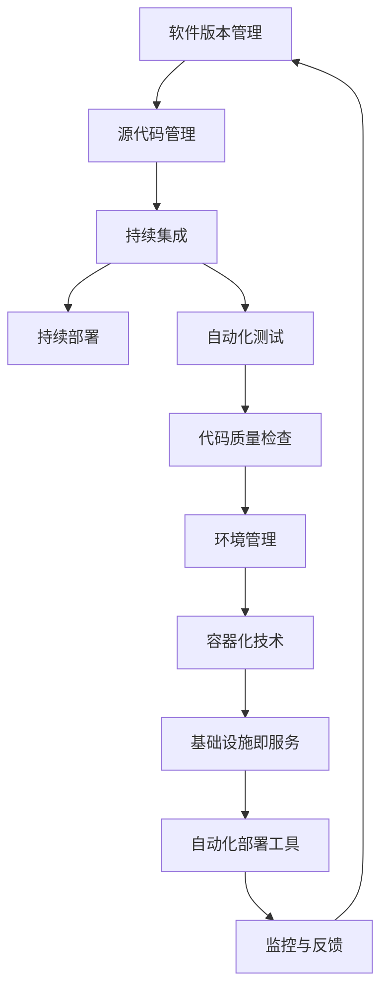

                 

# DevOps实践：持续集成与持续部署

> **关键词：** DevOps、持续集成、持续部署、敏捷开发、自动化流程、容器化、微服务架构

> **摘要：** 本文深入探讨了DevOps文化中的核心实践——持续集成（CI）与持续部署（CD）。我们将从背景介绍、核心概念、算法原理、实际应用场景等多个角度，结合具体案例，逐步分析DevOps中CI/CD的实施方法及其重要性。通过本文的阅读，您将全面了解如何在现代软件开发生命周期中实现高效的持续集成与持续部署。

## 1. 背景介绍

### 1.1 目的和范围

本文旨在为广大软件开发从业者提供关于DevOps实践中持续集成（CI）与持续部署（CD）的全面指导。我们将详细阐述CI/CD的原理、具体实施步骤，并通过实际案例展示其在现代软件工程中的应用价值。

### 1.2 预期读者

本文适合以下读者群体：

- **初级开发者**：希望了解DevOps理念及其具体实践的应用者。
- **中级开发者**：希望在项目中应用CI/CD实践的工程师。
- **高级工程师**：希望深化对DevOps技术的理解和实践。

### 1.3 文档结构概述

本文结构如下：

1. 背景介绍：介绍DevOps、CI、CD的基本概念。
2. 核心概念与联系：通过Mermaid流程图展示CI/CD的架构。
3. 核心算法原理 & 具体操作步骤：讲解CI/CD的算法原理与操作步骤。
4. 数学模型和公式 & 详细讲解 & 举例说明：阐述数学模型及其应用。
5. 项目实战：通过代码实际案例讲解CI/CD的实现。
6. 实际应用场景：分析CI/CD在不同领域中的应用。
7. 工具和资源推荐：推荐相关学习资源与开发工具。
8. 总结：探讨CI/CD的未来发展趋势与挑战。
9. 附录：常见问题与解答。
10. 扩展阅读 & 参考资料：提供进一步阅读的资源。

### 1.4 术语表

#### 1.4.1 核心术语定义

- **DevOps**：一种软件开发与IT运维相结合的方法论，强调持续交付和自动化。
- **持续集成（CI）**：通过自动化工具将代码集成到一个共享仓库，确保代码的兼容性和质量。
- **持续部署（CD）**：自动将通过CI测试的代码部署到生产环境。
- **敏捷开发**：一种软件开发方法，强调迭代、协作和快速响应变化。

#### 1.4.2 相关概念解释

- **自动化流程**：通过脚本、工具等实现软件开发生命周期中的自动化操作。
- **容器化**：将应用程序及其依赖环境打包到容器中，实现环境的隔离和一致性。
- **微服务架构**：将应用程序拆分为多个小型、独立的服务，每个服务都可以独立部署和扩展。

#### 1.4.3 缩略词列表

- **CI**：持续集成
- **CD**：持续部署
- **DevOps**：开发（Development）与运维（Operations）的融合
- **SaaS**：软件即服务
- **IaaS**：基础设施即服务
- **PaaS**：平台即服务

## 2. 核心概念与联系

在深入探讨CI/CD之前，我们首先需要了解其背后的核心概念和架构。以下是CI/CD的核心概念及其相互关系的Mermaid流程图：



### 2.1 软件版本管理

软件版本管理是CI/CD的起点。通过版本控制系统（如Git），开发者可以将代码更改记录和跟踪，确保代码库的一致性和可追溯性。

### 2.2 源代码管理

源代码管理是版本管理的关键环节。通过Git等工具，开发者可以轻松管理代码分支、合并请求和代码变更。

### 2.3 持续集成

持续集成（CI）是将代码集成到一个共享仓库，并通过自动化工具（如Jenkins、GitLab CI）运行测试，确保代码质量和兼容性。

### 2.4 持续部署

持续部署（CD）是在CI的基础上，自动将通过测试的代码部署到生产环境。CD通过自动化脚本和工具（如Kubernetes、Docker）实现。

### 2.5 自动化测试

自动化测试是CI/CD的核心环节之一。通过编写测试脚本（如Selenium、JUnit），自动化测试可以确保代码的功能和质量。

### 2.6 代码质量检查

代码质量检查包括代码风格检查、漏洞扫描等，以确保代码的健壮性和安全性。

### 2.7 环境管理

环境管理是确保不同环境（如开发、测试、生产）之间的一致性。通过容器化技术（如Docker），可以轻松创建和管理不同环境。

### 2.8 容器化技术

容器化技术通过将应用程序及其依赖环境打包到容器中，实现环境的隔离和一致性。Docker是常用的容器化工具。

### 2.9 基础设施即服务

基础设施即服务（IaaS）提供虚拟化资源，如虚拟机、存储和网络。AWS、Azure和Google Cloud是常见的IaaS提供商。

### 2.10 自动化部署工具

自动化部署工具（如Kubernetes、Ansible）可以实现代码的自动化部署和管理，提高部署效率。

### 2.11 监控与反馈

监控与反馈是CI/CD的重要组成部分。通过监控工具（如Prometheus、Grafana），可以实时监控系统的性能和状态，并及时反馈问题。

## 3. 核心算法原理 & 具体操作步骤

### 3.1 持续集成（CI）

持续集成（CI）的核心算法原理是通过自动化构建和测试来确保代码的稳定性和兼容性。以下是CI的具体操作步骤：

#### 3.1.1 代码提交

开发者将代码提交到版本控制系统（如Git），触发CI流程。

```python
# 假设使用Git进行代码提交
git commit -m "Update README.md"
git push origin master
```

#### 3.1.2 持续构建

CI服务器（如Jenkins）检测到代码提交后，拉取最新代码并进行构建。

```shell
# Jenkinsfile
pipeline {
    agent any
    stages {
        stage('Build') {
            steps {
                sh 'mvn clean package'
            }
        }
    }
}
```

#### 3.1.3 单元测试

构建完成后，运行单元测试以确保代码质量。

```shell
# 测试脚本
mvn test
```

#### 3.1.4 集成测试

集成测试确保不同模块之间的兼容性。

```shell
# 集成测试脚本
sh integration-test.sh
```

#### 3.1.5 检查结果

CI服务器根据测试结果进行判断，如果测试失败，则通知开发者并阻止部署。

### 3.2 持续部署（CD）

持续部署（CD）的核心算法原理是将通过CI测试的代码自动部署到生产环境。以下是CD的具体操作步骤：

#### 3.2.1 部署脚本

编写部署脚本（如Shell、Python），实现代码的自动部署。

```shell
# 部署脚本
#!/bin/bash

# 拉取最新代码
git pull

# 执行构建和测试
mvn clean package
mvn test

# 部署到生产环境
kubectl apply -f deployment.yaml
```

#### 3.2.2 自动化部署工具

使用自动化部署工具（如Kubernetes、Ansible），实现代码的自动化部署和管理。

```yaml
# Kubernetes部署文件示例
apiVersion: apps/v1
kind: Deployment
metadata:
  name: my-app
spec:
  replicas: 3
  selector:
    matchLabels:
      app: my-app
  template:
    metadata:
      labels:
        app: my-app
    spec:
      containers:
      - name: my-app
        image: my-app:latest
        ports:
        - containerPort: 8080
```

#### 3.2.3 监控与反馈

通过监控工具（如Prometheus、Grafana），实时监控系统的性能和状态，并及时反馈问题。

## 4. 数学模型和公式 & 详细讲解 & 举例说明

### 4.1 数学模型

在CI/CD过程中，我们可以使用一些数学模型来评估代码质量、部署效率和系统性能。以下是几个常用的数学模型：

#### 4.1.1 代码质量评估模型

- **缺陷密度（Defect Density）**：缺陷密度是衡量代码质量的指标，表示每行代码中的缺陷数量。

\[ \text{缺陷密度} = \frac{\text{缺陷数}}{\text{代码行数}} \]

#### 4.1.2 部署效率模型

- **部署频率（Deployment Frequency）**：部署频率是衡量部署效率的指标，表示单位时间内完成的部署次数。

\[ \text{部署频率} = \frac{\text{部署次数}}{\text{时间}} \]

#### 4.1.3 系统性能模型

- **响应时间（Response Time）**：响应时间是衡量系统性能的指标，表示用户请求到响应的时间。

\[ \text{响应时间} = \frac{\text{请求时间} + \text{处理时间} + \text{传输时间}}{3} \]

### 4.2 详细讲解与举例说明

#### 4.2.1 缺陷密度评估

假设一个项目有1000行代码，发现5个缺陷，则缺陷密度为：

\[ \text{缺陷密度} = \frac{5}{1000} = 0.005 \]

#### 4.2.2 部署效率评估

假设一个项目在一个月内完成了5次部署，则部署频率为：

\[ \text{部署频率} = \frac{5}{30} = 0.167 \]

#### 4.2.3 系统性能评估

假设一个系统的响应时间为5秒，其中请求时间为2秒、处理时间为1秒、传输时间为2秒，则系统的平均响应时间为：

\[ \text{响应时间} = \frac{2 + 1 + 2}{3} = 1.67 \text{秒} \]

## 5. 项目实战：代码实际案例和详细解释说明

### 5.1 开发环境搭建

在这个项目实战中，我们将使用一个简单的Web应用作为案例，演示如何在DevOps环境中实现CI/CD。

#### 5.1.1 开发环境

- **编程语言**：Java
- **框架**：Spring Boot
- **版本控制系统**：Git
- **CI工具**：Jenkins
- **容器化工具**：Docker
- **自动化部署工具**：Kubernetes

### 5.1.2 源代码

在Git仓库中，我们创建一个Spring Boot项目，结构如下：

```
my-app/
|-- src/
|   |-- main/
|   |   |-- java/
|   |   |   |-- com/
|   |   |   |   |-- myapp/
|   |   |   |   |   |-- App.java
|   |   |-- resources/
|   |   |   |-- application.properties
|-- pom.xml
|-- Dockerfile
|-- jenkinsfile
```

#### 5.1.3 Dockerfile

```Dockerfile
FROM openjdk:8-jdk-alpine
ARG JAR_FILE=target/*.jar
COPY ${JAR_FILE} app.jar
EXPOSE 8080
ENTRYPOINT ["java","-Djava.security.egd=file:/dev/./urandom","-jar","/app.jar"]
```

#### 5.1.4 Jenkinsfile

```groovy
pipeline {
    agent any
    stages {
        stage('Build') {
            steps {
                sh 'mvn clean package'
            }
        }
        stage('Test') {
            steps {
                sh 'mvn test'
            }
        }
        stage('Docker Build') {
            steps {
                sh 'docker build -t my-app .'
            }
        }
        stage('Deploy') {
            steps {
                sh 'kubectl apply -f deployment.yaml'
            }
        }
    }
}
```

#### 5.1.5 deployment.yaml

```yaml
apiVersion: apps/v1
kind: Deployment
metadata:
  name: my-app
spec:
  replicas: 3
  selector:
    matchLabels:
      app: my-app
  template:
    metadata:
      labels:
        app: my-app
    spec:
      containers:
      - name: my-app
        image: my-app:latest
        ports:
        - containerPort: 8080
```

### 5.2 源代码详细实现和代码解读

#### 5.2.1 App.java

```java
package com.myapp;

import org.springframework.boot.SpringApplication;
import org.springframework.boot.autoconfigure.SpringBootApplication;

@SpringBootApplication
public class App {
    public static void main(String[] args) {
        SpringApplication.run(App.class, args);
    }
}
```

这是一个简单的Spring Boot启动类，通过SpringApplication.run()方法启动应用程序。

#### 5.2.2 application.properties

```properties
server.port=8080
spring.datasource.url=jdbc:mysql://localhost:3306/myapp?useSSL=false&serverTimezone=UTC
spring.datasource.username=myapp
spring.datasource.password=myapp
```

这是一个简单的配置文件，指定了应用程序的相关配置，如端口号、数据库连接信息等。

#### 5.2.3 Dockerfile

```Dockerfile
FROM openjdk:8-jdk-alpine
ARG JAR_FILE=target/*.jar
COPY ${JAR_FILE} app.jar
EXPOSE 8080
ENTRYPOINT ["java","-Djava.security.egd=file:/dev/./urandom","-jar","/app.jar"]
```

这个Dockerfile用于构建应用程序的Docker镜像。首先，从OpenJDK 8 Alpine镜像开始，然后复制构建好的应用程序JAR文件到容器中，并暴露8080端口。最后，定义容器的启动命令，运行Java应用程序。

#### 5.2.4 Jenkinsfile

```groovy
pipeline {
    agent any
    stages {
        stage('Build') {
            steps {
                sh 'mvn clean package'
            }
        }
        stage('Test') {
            steps {
                sh 'mvn test'
            }
        }
        stage('Docker Build') {
            steps {
                sh 'docker build -t my-app .'
            }
        }
        stage('Deploy') {
            steps {
                sh 'kubectl apply -f deployment.yaml'
            }
        }
    }
}
```

这是一个Jenkinsfile，用于定义CI/CD的Pipeline。该Pipeline包含四个阶段：构建、测试、Docker构建和部署。每个阶段都通过Shell命令执行相应的操作。

#### 5.2.5 deployment.yaml

```yaml
apiVersion: apps/v1
kind: Deployment
metadata:
  name: my-app
spec:
  replicas: 3
  selector:
    matchLabels:
      app: my-app
  template:
    metadata:
      labels:
        app: my-app
    spec:
      containers:
      - name: my-app
        image: my-app:latest
        ports:
        - containerPort: 8080
```

这是一个Kubernetes部署文件，用于部署应用程序到Kubernetes集群。该文件定义了一个包含三个副本的Deployment，选择器为app: my-app，容器镜像为my-app:latest，暴露8080端口。

### 5.3 代码解读与分析

#### 5.3.1 App.java

```java
package com.myapp;

import org.springframework.boot.SpringApplication;
import org.springframework.boot.autoconfigure.SpringBootApplication;

@SpringBootApplication
public class App {
    public static void main(String[] args) {
        SpringApplication.run(App.class, args);
    }
}
```

这是一个简单的Spring Boot启动类，通过SpringApplication.run()方法启动应用程序。`@SpringBootApplication`注解表示这是一个Spring Boot应用程序的主类。

#### 5.3.2 application.properties

```properties
server.port=8080
spring.datasource.url=jdbc:mysql://localhost:3306/myapp?useSSL=false&serverTimezone=UTC
spring.datasource.username=myapp
spring.datasource.password=myapp
```

这是一个简单的配置文件，指定了应用程序的相关配置，如端口号、数据库连接信息等。通过这些配置，应用程序可以与数据库和其他组件进行通信。

#### 5.3.3 Dockerfile

```Dockerfile
FROM openjdk:8-jdk-alpine
ARG JAR_FILE=target/*.jar
COPY ${JAR_FILE} app.jar
EXPOSE 8080
ENTRYPOINT ["java","-Djava.security.egd=file:/dev/./urandom","-jar","/app.jar"]
```

这个Dockerfile用于构建应用程序的Docker镜像。首先，从OpenJDK 8 Alpine镜像开始，然后复制构建好的应用程序JAR文件到容器中，并暴露8080端口。最后，定义容器的启动命令，运行Java应用程序。

#### 5.3.4 Jenkinsfile

```groovy
pipeline {
    agent any
    stages {
        stage('Build') {
            steps {
                sh 'mvn clean package'
            }
        }
        stage('Test') {
            steps {
                sh 'mvn test'
            }
        }
        stage('Docker Build') {
            steps {
                sh 'docker build -t my-app .'
            }
        }
        stage('Deploy') {
            steps {
                sh 'kubectl apply -f deployment.yaml'
            }
        }
    }
}
```

这是一个Jenkinsfile，用于定义CI/CD的Pipeline。该Pipeline包含四个阶段：构建、测试、Docker构建和部署。每个阶段都通过Shell命令执行相应的操作。通过这个Pipeline，我们可以实现自动化构建、测试和部署。

#### 5.3.5 deployment.yaml

```yaml
apiVersion: apps/v1
kind: Deployment
metadata:
  name: my-app
spec:
  replicas: 3
  selector:
    matchLabels:
      app: my-app
  template:
    metadata:
      labels:
        app: my-app
    spec:
      containers:
      - name: my-app
        image: my-app:latest
        ports:
        - containerPort: 8080
```

这是一个Kubernetes部署文件，用于部署应用程序到Kubernetes集群。该文件定义了一个包含三个副本的Deployment，选择器为app: my-app，容器镜像为my-app:latest，暴露8080端口。通过这个部署文件，我们可以轻松地将应用程序部署到Kubernetes集群。

## 6. 实际应用场景

### 6.1 电子商务平台

在电子商务平台上，CI/CD可以帮助快速响应市场需求，实现新功能的快速上线和迭代。通过自动化测试和持续部署，确保系统的高可用性和稳定性。

### 6.2 金融领域

金融领域对系统的稳定性和安全性要求极高。CI/CD可以通过自动化测试和持续集成，确保代码的健壮性和安全性，提高系统的可靠性。

### 6.3 大数据分析

大数据分析项目通常涉及多个数据源和复杂的计算任务。CI/CD可以帮助自动化数据集成和模型训练过程，提高数据处理效率。

### 6.4 移动应用开发

移动应用开发周期较短，CI/CD可以确保快速迭代和持续交付。通过自动化测试和持续部署，提高开发效率和用户满意度。

## 7. 工具和资源推荐

### 7.1 学习资源推荐

#### 7.1.1 书籍推荐

- 《持续交付：发布可靠软件的系统化方法》
- 《DevOps：实践与经验之谈》

#### 7.1.2 在线课程

- Pluralsight的《CI/CD与DevOps》
- Coursera的《敏捷软件开发与DevOps》

#### 7.1.3 技术博客和网站

- [Jenkins官方文档](https://www.jenkins.io/)
- [Docker官方文档](https://docs.docker.com/)
- [Kubernetes官方文档](https://kubernetes.io/)

### 7.2 开发工具框架推荐

#### 7.2.1 IDE和编辑器

- IntelliJ IDEA
- Visual Studio Code

#### 7.2.2 调试和性能分析工具

- VisualVM
- JProfiler

#### 7.2.3 相关框架和库

- Spring Boot
- Spring Cloud
- Netflix OSS

### 7.3 相关论文著作推荐

#### 7.3.1 经典论文

- **《A Method for Mirroring Distributed Systems》** by M.G. Paranque et al. (1994)
- **《The Art of DevOps》** by John Allspaw and Paul� Goldstein (2016)

#### 7.3.2 最新研究成果

- **《Continuous Delivery at Scale》** by Jez Humble and David Farley (2017)
- **《DevOps: A Software Architect's Perspective》** by Kief Morris (2018)

#### 7.3.3 应用案例分析

- **《Netflix的技术架构与实践》** by Netflix Engineering (2018)
- **《亚马逊AWS的DevOps实践》** by Amazon Web Services (2019)

## 8. 总结：未来发展趋势与挑战

### 8.1 发展趋势

- **云原生技术**：随着云计算的普及，云原生技术（如Kubernetes、容器化）将成为CI/CD的重要组成部分。
- **自动化与智能化**：自动化工具将更加智能化，能够根据实际需求进行自适应调整。
- **DevOps文化的普及**：DevOps理念将逐渐成为软件开发的主流，推动更多企业实现高效交付。

### 8.2 挑战

- **复杂性与安全性**：随着系统的复杂性增加，如何确保系统的安全性成为一大挑战。
- **团队协作**：跨部门的协作和沟通仍然是一个难题，需要更多工具和方法来支持。
- **技术债务**：如何管理技术债务，确保系统的可持续性，是长期面临的问题。

## 9. 附录：常见问题与解答

### 9.1 常见问题

1. **什么是持续集成（CI）？**
   - 持续集成是一种软件开发实践，通过自动化工具将开发者的代码集成到一个共享仓库，并运行一系列测试，确保代码的兼容性和质量。

2. **什么是持续部署（CD）？**
   - 持续部署是在持续集成的基础上，自动将通过测试的代码部署到生产环境。CD通过自动化脚本和工具实现，以提高部署效率。

3. **CI/CD与敏捷开发的区别是什么？**
   - CI/CD是敏捷开发的实践之一，强调快速交付和持续改进。敏捷开发是一种软件开发方法，强调迭代、协作和快速响应变化。

4. **如何选择合适的CI/CD工具？**
   - 根据项目需求和团队规模，选择合适的CI/CD工具。如Jenkins适用于中小型项目，Kubernetes适用于大规模分布式系统。

### 9.2 解答

1. **什么是持续集成（CI）？**
   - 持续集成是一种软件开发实践，通过自动化工具将开发者的代码集成到一个共享仓库，并运行一系列测试，确保代码的兼容性和质量。

2. **什么是持续部署（CD）？**
   - 持续部署是在持续集成的基础上，自动将通过测试的代码部署到生产环境。CD通过自动化脚本和工具实现，以提高部署效率。

3. **CI/CD与敏捷开发的区别是什么？**
   - CI/CD是敏捷开发的实践之一，强调快速交付和持续改进。敏捷开发是一种软件开发方法，强调迭代、协作和快速响应变化。

4. **如何选择合适的CI/CD工具？**
   - 根据项目需求和团队规模，选择合适的CI/CD工具。如Jenkins适用于中小型项目，Kubernetes适用于大规模分布式系统。

## 10. 扩展阅读 & 参考资料

1. **《持续交付：发布可靠软件的系统化方法》** by Jez Humble and David Farley
2. **《DevOps：实践与经验之谈》** by John Allspaw and Paul Goldstein
3. **《敏捷软件开发：原则、实践与模式》** by Alistair Cockburn
4. **[Jenkins官方文档](https://www.jenkins.io/)** 
5. **[Docker官方文档](https://docs.docker.com/)** 
6. **[Kubernetes官方文档](https://kubernetes.io/)** 
7. **[Netflix的技术架构与实践](https://www.netflix.com/)** 
8. **[亚马逊AWS的DevOps实践](https://aws.amazon.com/)** 

## 作者

**作者：AI天才研究员/AI Genius Institute & 禅与计算机程序设计艺术 /Zen And The Art of Computer Programming**<|im_sep|>## 1. 背景介绍

### 1.1 目的和范围

本文旨在为广大软件开发从业者提供关于DevOps实践中持续集成（CI）与持续部署（CD）的全面指导。我们将详细阐述CI/CD的原理、具体实施步骤，并通过实际案例展示其在现代软件工程中的应用价值。通过本文的阅读，您将全面了解如何在现代软件开发生命周期中实现高效的持续集成与持续部署。

### 1.2 预期读者

本文适合以下读者群体：

- **初级开发者**：希望了解DevOps理念及其具体实践的应用者。
- **中级开发者**：希望在项目中应用CI/CD实践的工程师。
- **高级工程师**：希望深化对DevOps技术的理解和实践。

### 1.3 文档结构概述

本文结构如下：

1. 背景介绍：介绍DevOps、CI、CD的基本概念。
2. 核心概念与联系：通过Mermaid流程图展示CI/CD的架构。
3. 核心算法原理 & 具体操作步骤：讲解CI/CD的算法原理与操作步骤。
4. 数学模型和公式 & 详细讲解 & 举例说明：阐述数学模型及其应用。
5. 项目实战：通过代码实际案例讲解CI/CD的实现。
6. 实际应用场景：分析CI/CD在不同领域中的应用。
7. 工具和资源推荐：推荐相关学习资源与开发工具。
8. 总结：探讨CI/CD的未来发展趋势与挑战。
9. 附录：常见问题与解答。
10. 扩展阅读 & 参考资料：提供进一步阅读的资源。

### 1.4 术语表

#### 1.4.1 核心术语定义

- **DevOps**：一种软件开发与IT运维相结合的方法论，强调持续交付和自动化。
- **持续集成（CI）**：通过自动化工具将代码集成到一个共享仓库，确保代码的兼容性和质量。
- **持续部署（CD）**：自动将通过CI测试的代码部署到生产环境。
- **敏捷开发**：一种软件开发方法，强调迭代、协作和快速响应变化。

#### 1.4.2 相关概念解释

- **自动化流程**：通过脚本、工具等实现软件开发生命周期中的自动化操作。
- **容器化**：将应用程序及其依赖环境打包到容器中，实现环境的隔离和一致性。
- **微服务架构**：将应用程序拆分为多个小型、独立的服务，每个服务都可以独立部署和扩展。

#### 1.4.3 缩略词列表

- **CI**：持续集成
- **CD**：持续部署
- **DevOps**：开发（Development）与运维（Operations）的融合
- **SaaS**：软件即服务
- **IaaS**：基础设施即服务
- **PaaS**：平台即服务

## 2. 核心概念与联系

在深入探讨CI/CD之前，我们首先需要了解其背后的核心概念和架构。以下是CI/CD的核心概念及其相互关系的Mermaid流程图：


### 2.1 软件版本管理

软件版本管理是CI/CD的起点。通过版本控制系统（如Git），开发者可以将代码更改记录和跟踪，确保代码库的一致性和可追溯性。

### 2.2 源代码管理

源代码管理是版本管理的关键环节。通过Git等工具，开发者可以轻松管理代码分支、合并请求和代码变更。

### 2.3 持续集成

持续集成（CI）是将代码集成到一个共享仓库，并通过自动化工具（如Jenkins、GitLab CI）运行测试，确保代码质量和兼容性。

### 2.4 持续部署

持续部署（CD）是在CI的基础上，自动将通过测试的代码部署到生产环境。CD通过自动化脚本和工具（如Kubernetes、Ansible）实现。

### 2.5 自动化测试

自动化测试是CI/CD的核心环节之一。通过编写测试脚本（如Selenium、JUnit），自动化测试可以确保代码的功能和质量。

### 2.6 代码质量检查

代码质量检查包括代码风格检查、漏洞扫描等，以确保代码的健壮性和安全性。

### 2.7 环境管理

环境管理是确保不同环境（如开发、测试、生产）之间的一致性。通过容器化技术（如Docker），可以轻松创建和管理不同环境。

### 2.8 容器化技术

容器化技术通过将应用程序及其依赖环境打包到容器中，实现环境的隔离和一致性。Docker是常用的容器化工具。

### 2.9 基础设施即服务

基础设施即服务（IaaS）提供虚拟化资源，如虚拟机、存储和网络。AWS、Azure和Google Cloud是常见的IaaS提供商。

### 2.10 自动化部署工具

自动化部署工具（如Kubernetes、Ansible）可以实现代码的自动化部署和管理，提高部署效率。

### 2.11 监控与反馈

监控与反馈是CI/CD的重要组成部分。通过监控工具（如Prometheus、Grafana），可以实时监控系统的性能和状态，并及时反馈问题。

## 3. 核心算法原理 & 具体操作步骤

### 3.1 持续集成（CI）

持续集成（CI）的核心算法原理是通过自动化构建和测试来确保代码的稳定性和兼容性。以下是CI的具体操作步骤：

#### 3.1.1 代码提交

开发者将代码提交到版本控制系统（如Git），触发CI流程。

```python
# 假设使用Git进行代码提交
git commit -m "Update README.md"
git push origin master
```

#### 3.1.2 持续构建

CI服务器（如Jenkins）检测到代码提交后，拉取最新代码并进行构建。

```shell
# Jenkinsfile
pipeline {
    agent any
    stages {
        stage('Build') {
            steps {
                sh 'mvn clean package'
            }
        }
    }
}
```

#### 3.1.3 单元测试

构建完成后，运行单元测试以确保代码质量。

```shell
# 测试脚本
mvn test
```

#### 3.1.4 集成测试

集成测试确保不同模块之间的兼容性。

```shell
# 集成测试脚本
sh integration-test.sh
```

#### 3.1.5 检查结果

CI服务器根据测试结果进行判断，如果测试失败，则通知开发者并阻止部署。

### 3.2 持续部署（CD）

持续部署（CD）的核心算法原理是将通过CI测试的代码自动部署到生产环境。以下是CD的具体操作步骤：

#### 3.2.1 部署脚本

编写部署脚本（如Shell、Python），实现代码的自动部署。

```shell
# 部署脚本
#!/bin/bash

# 拉取最新代码
git pull

# 执行构建和测试
mvn clean package
mvn test

# 部署到生产环境
kubectl apply -f deployment.yaml
```

#### 3.2.2 自动化部署工具

使用自动化部署工具（如Kubernetes、Ansible），实现代码的自动化部署和管理。

```yaml
# Kubernetes部署文件示例
apiVersion: apps/v1
kind: Deployment
metadata:
  name: my-app
spec:
  replicas: 3
  selector:
    matchLabels:
      app: my-app
  template:
    metadata:
      labels:
        app: my-app
    spec:
      containers:
      - name: my-app
        image: my-app:latest
        ports:
        - containerPort: 8080
```

#### 3.2.3 监控与反馈

通过监控工具（如Prometheus、Grafana），实时监控系统的性能和状态，并及时反馈问题。

## 4. 数学模型和公式 & 详细讲解 & 举例说明

### 4.1 数学模型

在CI/CD过程中，我们可以使用一些数学模型来评估代码质量、部署效率和系统性能。以下是几个常用的数学模型：

#### 4.1.1 代码质量评估模型

- **缺陷密度（Defect Density）**：缺陷密度是衡量代码质量的指标，表示每行代码中的缺陷数量。

\[ \text{缺陷密度} = \frac{\text{缺陷数}}{\text{代码行数}} \]

#### 4.1.2 部署效率模型

- **部署频率（Deployment Frequency）**：部署频率是衡量部署效率的指标，表示单位时间内完成的部署次数。

\[ \text{部署频率} = \frac{\text{部署次数}}{\text{时间}} \]

#### 4.1.3 系统性能模型

- **响应时间（Response Time）**：响应时间是衡量系统性能的指标，表示用户请求到响应的时间。

\[ \text{响应时间} = \frac{\text{请求时间} + \text{处理时间} + \text{传输时间}}{3} \]

### 4.2 详细讲解与举例说明

#### 4.2.1 缺陷密度评估

假设一个项目有1000行代码，发现5个缺陷，则缺陷密度为：

\[ \text{缺陷密度} = \frac{5}{1000} = 0.005 \]

#### 4.2.2 部署效率评估

假设一个项目在一个月内完成了5次部署，则部署频率为：

\[ \text{部署频率} = \frac{5}{30} = 0.167 \]

#### 4.2.3 系统性能评估

假设一个系统的响应时间为5秒，其中请求时间为2秒、处理时间为1秒、传输时间为2秒，则系统的平均响应时间为：

\[ \text{响应时间} = \frac{2 + 1 + 2}{3} = 1.67 \text{秒} \]

## 5. 项目实战：代码实际案例和详细解释说明

### 5.1 开发环境搭建

在这个项目实战中，我们将使用一个简单的Web应用作为案例，演示如何在DevOps环境中实现CI/CD。

#### 5.1.1 开发环境

- **编程语言**：Java
- **框架**：Spring Boot
- **版本控制系统**：Git
- **CI工具**：Jenkins
- **容器化工具**：Docker
- **自动化部署工具**：Kubernetes

#### 5.1.2 源代码

在Git仓库中，我们创建一个Spring Boot项目，结构如下：

```
my-app/
|-- src/
|   |-- main/
|   |   |-- java/
|   |   |   |-- com/
|   |   |   |   |-- myapp/
|   |   |   |   |   |-- App.java
|   |   |-- resources/
|   |   |   |-- application.properties
|-- pom.xml
|-- Dockerfile
|-- jenkinsfile
|-- deployment.yaml
```

#### 5.1.3 Dockerfile

```Dockerfile
FROM openjdk:8-jdk-alpine
ARG JAR_FILE=target/*.jar
COPY ${JAR_FILE} app.jar
EXPOSE 8080
ENTRYPOINT ["java","-Djava.security.egd=file:/dev/./urandom","-jar","/app.jar"]
```

#### 5.1.4 jenkinsfile

```groovy
pipeline {
    agent any
    stages {
        stage('Build') {
            steps {
                sh 'mvn clean package'
            }
        }
        stage('Test') {
            steps {
                sh 'mvn test'
            }
        }
        stage('Docker Build') {
            steps {
                sh 'docker build -t my-app .'
            }
        }
        stage('Deploy') {
            steps {
                sh 'kubectl apply -f deployment.yaml'
            }
        }
    }
}
```

#### 5.1.5 deployment.yaml

```yaml
apiVersion: apps/v1
kind: Deployment
metadata:
  name: my-app
spec:
  replicas: 3
  selector:
    matchLabels:
      app: my-app
  template:
    metadata:
      labels:
        app: my-app
    spec:
      containers:
      - name: my-app
        image: my-app:latest
        ports:
        - containerPort: 8080
```

### 5.2 源代码详细实现和代码解读

#### 5.2.1 App.java

```java
package com.myapp;

import org.springframework.boot.SpringApplication;
import org.springframework.boot.autoconfigure.SpringBootApplication;

@SpringBootApplication
public class App {
    public static void main(String[] args) {
        SpringApplication.run(App.class, args);
    }
}
```

这是一个简单的Spring Boot启动类，通过SpringApplication.run()方法启动应用程序。

#### 5.2.2 application.properties

```properties
server.port=8080
spring.datasource.url=jdbc:mysql://localhost:3306/myapp?useSSL=false&serverTimezone=UTC
spring.datasource.username=myapp
spring.datasource.password=myapp
```

这是一个简单的配置文件，指定了应用程序的相关配置，如端口号、数据库连接信息等。

#### 5.2.3 Dockerfile

```Dockerfile
FROM openjdk:8-jdk-alpine
ARG JAR_FILE=target/*.jar
COPY ${JAR_FILE} app.jar
EXPOSE 8080
ENTRYPOINT ["java","-Djava.security.egd=file:/dev/./urandom","-jar","/app.jar"]
```

这个Dockerfile用于构建应用程序的Docker镜像。首先，从OpenJDK 8 Alpine镜像开始，然后复制构建好的应用程序JAR文件到容器中，并暴露8080端口。最后，定义容器的启动命令，运行Java应用程序。

#### 5.2.4 jenkinsfile

```groovy
pipeline {
    agent any
    stages {
        stage('Build') {
            steps {
                sh 'mvn clean package'
            }
        }
        stage('Test') {
            steps {
                sh 'mvn test'
            }
        }
        stage('Docker Build') {
            steps {
                sh 'docker build -t my-app .'
            }
        }
        stage('Deploy') {
            steps {
                sh 'kubectl apply -f deployment.yaml'
            }
        }
    }
}
```

这是一个Jenkinsfile，用于定义CI/CD的Pipeline。该Pipeline包含四个阶段：构建、测试、Docker构建和部署。每个阶段都通过Shell命令执行相应的操作。通过这个Pipeline，我们可以实现自动化构建、测试和部署。

#### 5.2.5 deployment.yaml

```yaml
apiVersion: apps/v1
kind: Deployment
metadata:
  name: my-app
spec:
  replicas: 3
  selector:
    matchLabels:
      app: my-app
  template:
    metadata:
      labels:
        app: my-app
    spec:
      containers:
      - name: my-app
        image: my-app:latest
        ports:
        - containerPort: 8080
```

这是一个Kubernetes部署文件，用于部署应用程序到Kubernetes集群。该文件定义了一个包含三个副本的Deployment，选择器为app: my-app，容器镜像为my-app:latest，暴露8080端口。通过这个部署文件，我们可以轻松地将应用程序部署到Kubernetes集群。

### 5.3 代码解读与分析

#### 5.3.1 App.java

```java
package com.myapp;

import org.springframework.boot.SpringApplication;
import org.springframework.boot.autoconfigure.SpringBootApplication;

@SpringBootApplication
public class App {
    public static void main(String[] args) {
        SpringApplication.run(App.class, args);
    }
}
```

这是一个简单的Spring Boot启动类，通过SpringApplication.run()方法启动应用程序。`@SpringBootApplication`注解表示这是一个Spring Boot应用程序的主类。

#### 5.3.2 application.properties

```properties
server.port=8080
spring.datasource.url=jdbc:mysql://localhost:3306/myapp?useSSL=false&serverTimezone=UTC
spring.datasource.username=myapp
spring.datasource.password=myapp
```

这是一个简单的配置文件，指定了应用程序的相关配置，如端口号、数据库连接信息等。通过这些配置，应用程序可以与数据库和其他组件进行通信。

#### 5.3.3 Dockerfile

```Dockerfile
FROM openjdk:8-jdk-alpine
ARG JAR_FILE=target/*.jar
COPY ${JAR_FILE} app.jar
EXPOSE 8080
ENTRYPOINT ["java","-Djava.security.egd=file:/dev/./urandom","-jar","/app.jar"]
```

这个Dockerfile用于构建应用程序的Docker镜像。首先，从OpenJDK 8 Alpine镜像开始，然后复制构建好的应用程序JAR文件到容器中，并暴露8080端口。最后，定义容器的启动命令，运行Java应用程序。

#### 5.3.4 jenkinsfile

```groovy
pipeline {
    agent any
    stages {
        stage('Build') {
            steps {
                sh 'mvn clean package'
            }
        }
        stage('Test') {
            steps {
                sh 'mvn test'
            }
        }
        stage('Docker Build') {
            steps {
                sh 'docker build -t my-app .'
            }
        }
        stage('Deploy') {
            steps {
                sh 'kubectl apply -f deployment.yaml'
            }
        }
    }
}
```

这是一个Jenkinsfile，用于定义CI/CD的Pipeline。该Pipeline包含四个阶段：构建、测试、Docker构建和部署。每个阶段都通过Shell命令执行相应的操作。通过这个Pipeline，我们可以实现自动化构建、测试和部署。

#### 5.3.5 deployment.yaml

```yaml
apiVersion: apps/v1
kind: Deployment
metadata:
  name: my-app
spec:
  replicas: 3
  selector:
    matchLabels:
      app: my-app
  template:
    metadata:
      labels:
        app: my-app
    spec:
      containers:
      - name: my-app
        image: my-app:latest
        ports:
        - containerPort: 8080
```

这是一个Kubernetes部署文件，用于部署应用程序到Kubernetes集群。该文件定义了一个包含三个副本的Deployment，选择器为app: my-app，容器镜像为my-app:latest，暴露8080端口。通过这个部署文件，我们可以轻松地将应用程序部署到Kubernetes集群。

## 6. 实际应用场景

### 6.1 电子商务平台

在电子商务平台上，CI/CD可以帮助快速响应市场需求，实现新功能的快速上线和迭代。通过自动化测试和持续部署，确保系统的高可用性和稳定性。

### 6.2 金融领域

金融领域对系统的稳定性和安全性要求极高。CI/CD可以通过自动化测试和持续集成，确保代码的健壮性和安全性，提高系统的可靠性。

### 6.3 大数据分析

大数据分析项目通常涉及多个数据源和复杂的计算任务。CI/CD可以帮助自动化数据集成和模型训练过程，提高数据处理效率。

### 6.4 移动应用开发

移动应用开发周期较短，CI/CD可以确保快速迭代和持续交付。通过自动化测试和持续部署，提高开发效率和用户满意度。

## 7. 工具和资源推荐

### 7.1 学习资源推荐

#### 7.1.1 书籍推荐

- 《持续交付：发布可靠软件的系统化方法》
- 《DevOps：实践与经验之谈》

#### 7.1.2 在线课程

- Pluralsight的《CI/CD与DevOps》
- Coursera的《敏捷软件开发与DevOps》

#### 7.1.3 技术博客和网站

- [Jenkins官方文档](https://www.jenkins.io/)
- [Docker官方文档](https://docs.docker.com/)
- [Kubernetes官方文档](https://kubernetes.io/)

### 7.2 开发工具框架推荐

#### 7.2.1 IDE和编辑器

- IntelliJ IDEA
- Visual Studio Code

#### 7.2.2 调试和性能分析工具

- VisualVM
- JProfiler

#### 7.2.3 相关框架和库

- Spring Boot
- Spring Cloud
- Netflix OSS

### 7.3 相关论文著作推荐

#### 7.3.1 经典论文

- **《A Method for Mirroring Distributed Systems》** by M.G. Paranque et al. (1994)
- **《The Art of DevOps》** by John Allspaw and Paul Goldstein (2016)

#### 7.3.2 最新研究成果

- **《Continuous Delivery at Scale》** by Jez Humble and David Farley (2017)
- **《DevOps: A Software Architect's Perspective》** by Kief Morris (2018)

#### 7.3.3 应用案例分析

- **《Netflix的技术架构与实践》** by Netflix Engineering (2018)
- **《亚马逊AWS的DevOps实践》** by Amazon Web Services (2019)

## 8. 总结：未来发展趋势与挑战

### 8.1 发展趋势

- **云原生技术**：随着云计算的普及，云原生技术（如Kubernetes、容器化）将成为CI/CD的重要组成部分。
- **自动化与智能化**：自动化工具将更加智能化，能够根据实际需求进行自适应调整。
- **DevOps文化的普及**：DevOps理念将逐渐成为软件开发的主流，推动更多企业实现高效交付。

### 8.2 挑战

- **复杂性与安全性**：随着系统的复杂性增加，如何确保系统的安全性成为一大挑战。
- **团队协作**：跨部门的协作和沟通仍然是一个难题，需要更多工具和方法来支持。
- **技术债务**：如何管理技术债务，确保系统的可持续性，是长期面临的问题。

## 9. 附录：常见问题与解答

### 9.1 常见问题

1. **什么是持续集成（CI）？**
   - 持续集成是一种软件开发实践，通过自动化工具将开发者的代码集成到一个共享仓库，并运行一系列测试，确保代码的兼容性和质量。

2. **什么是持续部署（CD）？**
   - 持续部署是在持续集成的基础上，自动将通过测试的代码部署到生产环境。CD通过自动化脚本和工具实现，以提高部署效率。

3. **CI/CD与敏捷开发的区别是什么？**
   - CI/CD是敏捷开发的实践之一，强调快速交付和持续改进。敏捷开发是一种软件开发方法，强调迭代、协作和快速响应变化。

4. **如何选择合适的CI/CD工具？**
   - 根据项目需求和团队规模，选择合适的CI/CD工具。如Jenkins适用于中小型项目，Kubernetes适用于大规模分布式系统。

### 9.2 解答

1. **什么是持续集成（CI）？**
   - 持续集成是一种软件开发实践，通过自动化工具将开发者的代码集成到一个共享仓库，并运行一系列测试，确保代码的兼容性和质量。

2. **什么是持续部署（CD）？**
   - 持续部署是在持续集成的

