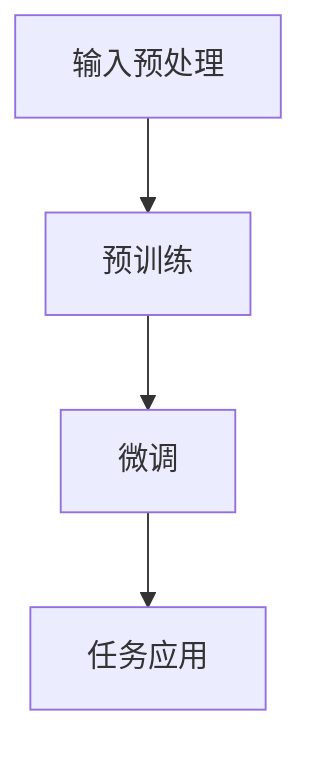

                 


# ELMo 原理与代码实战案例讲解

> 关键词：ELMo，深度学习，自然语言处理，神经网络，词嵌入，上下文信息

> 摘要：本文将深入探讨ELMo（Embeddings from Language Models）的原理及其在实际应用中的代码实现。我们将首先介绍ELMo的背景和目的，然后详细解析其核心概念和算法原理，接着通过一个实战案例展示如何使用Python和TensorFlow来实现ELMo。最后，我们将讨论ELMo在实际应用场景中的价值，并推荐相关学习资源和工具。

## 1. 背景介绍

### 1.1 目的和范围

本文的目标是帮助读者理解和掌握ELMo的基本原理，并能够通过实际代码案例来实现和运用ELMo。我们将覆盖ELMo的核心概念、算法流程以及实现细节。

### 1.2 预期读者

本文适合有一定自然语言处理基础，希望深入了解深度学习在自然语言处理领域应用的读者。同时，也适合对Python和TensorFlow有一定了解的程序员和工程师。

### 1.3 文档结构概述

本文分为以下几个部分：

1. **背景介绍**：介绍ELMo的背景和目的。
2. **核心概念与联系**：讲解ELMo的核心概念和原理，并使用Mermaid流程图展示。
3. **核心算法原理 & 具体操作步骤**：详细解析ELMo的算法原理，并使用伪代码进行说明。
4. **数学模型和公式 & 详细讲解 & 举例说明**：阐述ELMo的数学模型和公式，并通过示例进行讲解。
5. **项目实战：代码实际案例和详细解释说明**：展示如何使用Python和TensorFlow实现ELMo。
6. **实际应用场景**：讨论ELMo在不同场景中的应用。
7. **工具和资源推荐**：推荐学习资源和开发工具。
8. **总结：未来发展趋势与挑战**：总结ELMo的现状和未来趋势。
9. **附录：常见问题与解答**：解答常见问题。
10. **扩展阅读 & 参考资料**：提供进一步学习的资源。

### 1.4 术语表

#### 1.4.1 核心术语定义

- **ELMo**：Embeddings from Language Models，一种用于生成文本上下文表示的预训练模型。
- **深度学习**：一种机器学习技术，通过多层神经网络来模拟人脑对数据的处理方式。
- **自然语言处理（NLP）**：计算机科学领域，研究如何让计算机理解和生成人类语言。
- **词嵌入（Word Embedding）**：将词汇映射到低维空间，以便计算机能够处理。

#### 1.4.2 相关概念解释

- **上下文信息**：文本中一个词的周围词组或句子，对理解词义有重要作用。
- **预训练模型**：在特定任务之前先在大量无标签数据上训练的模型。

#### 1.4.3 缩略词列表

- **ELMo**：Embeddings from Language Models
- **NLP**：Natural Language Processing
- **DL**：Deep Learning
- **GPU**：Graphics Processing Unit

## 2. 核心概念与联系

在深入了解ELMo之前，我们需要先理解一些核心概念，如深度学习、自然语言处理和词嵌入。

### 2.1 深度学习

深度学习是一种通过多层神经网络进行特征学习和模式识别的技术。它通常包括输入层、隐藏层和输出层。神经网络通过前向传播和反向传播来更新权重，从而提高模型的性能。

### 2.2 自然语言处理

自然语言处理是计算机科学领域，研究如何让计算机理解和生成人类语言。它包括语音识别、机器翻译、情感分析、文本分类等多个子领域。

### 2.3 词嵌入

词嵌入是将词汇映射到低维空间的技术。这种映射可以帮助计算机处理和比较文本数据。常见的词嵌入方法有Word2Vec、GloVe和BERT等。

### 2.4 ELMo的基本原理

ELMo是一种基于深度学习的自然语言处理模型，其主要目的是生成文本的上下文表示。ELMo通过在大量文本数据上进行预训练，学习到词汇在不同上下文中的含义。

ELMo的核心思想是，对于同一个词汇，在不同的上下文中，其表示应该是不同的。这种上下文信息对于很多NLP任务（如情感分析、文本分类等）非常重要。

为了实现这一目标，ELMo采用了双向长短期记忆网络（Bi-LSTM）作为基础模型。Bi-LSTM能够同时考虑词汇的前后文信息，从而生成更加丰富的上下文表示。

下面是ELMo的基本流程：

1. **输入预处理**：将文本数据转换为模型可以处理的格式。
2. **预训练**：在大量无标签文本数据上进行预训练，学习到词汇在不同上下文中的表示。
3. **微调**：在特定任务上对预训练模型进行微调，以适应具体应用场景。

### 2.5 Mermaid流程图

下面是一个简单的Mermaid流程图，展示ELMo的基本流程：



## 3. 核心算法原理 & 具体操作步骤

### 3.1 双向长短期记忆网络（Bi-LSTM）

ELMo的核心模型是双向长短期记忆网络（Bi-LSTM）。Bi-LSTM通过同时考虑词汇的前后文信息，能够生成更加丰富的上下文表示。

下面是Bi-LSTM的基本原理：

1. **隐藏状态计算**：Bi-LSTM通过输入门、遗忘门和输出门来更新隐藏状态。这些门决定了如何处理输入信息。
2. **前向传播**：在时间步t，Bi-LSTM首先计算前向隐藏状态\[h\_t^<\)]，它只考虑了词汇x\_t的输入。
3. **后向传播**：接着计算后向隐藏状态\[h\_t^>\)]，它只考虑了词汇x\_t的输入。
4. **组合隐藏状态**：最后，将前向和后向隐藏状态进行组合，得到时间步t的最终隐藏状态\[h\_t\]=\[h\_t^<>+h\_t^>\]。

下面是一个简单的伪代码，展示Bi-LSTM的计算过程：

```python
# 初始化参数
Wf, bf, Wu, bu, Wd, bd, Wo, bo = initialize_parameters()

# 前向传播
h_t^< = LSTM_forward(x_t, Wf, bf)

# 后向传播
h_t^> = LSTM_backward(x_t, Wu, bu)

# 组合隐藏状态
h_t = h_t^< + h_t^>
```

### 3.2 预训练和微调

ELMo的预训练和微调过程如下：

1. **预训练**：在大量无标签文本数据上进行预训练，学习到词汇在不同上下文中的表示。
2. **微调**：在特定任务上（如情感分析、文本分类等）对预训练模型进行微调，以适应具体应用场景。

下面是一个简单的伪代码，展示预训练和微调的过程：

```python
# 预训练
for epoch in range(num_epochs):
    for text in unlabelled_data:
        ELMo_embedding = ELMo_pretrain(text)

# 微调
for epoch in range(num_epochs):
    for text, label in labelled_data:
        ELMo_embedding, loss = ELMo_finetune(text, label)
```

## 4. 数学模型和公式 & 详细讲解 & 举例说明

### 4.1 数学模型

ELMo的数学模型主要包括两部分：词嵌入和双向LSTM。

#### 4.1.1 词嵌入

词嵌入是将词汇映射到低维空间的过程。通常使用以下公式：

$$
\text{embedding}_{i} = \text{W} \cdot \text{vector}_{i}
$$

其中，$\text{W}$是词嵌入权重矩阵，$\text{vector}_{i}$是词汇$i$的向量表示。

#### 4.1.2 双向LSTM

双向LSTM的数学模型如下：

$$
\begin{aligned}
&\text{input\_gate} = \sigma(\text{W} \cdot \text{h}_{t-1} + \text{U} \cdot \text{vector}_{t} + \text{b}) \\
&\text{forget\_gate} = \sigma(\text{W} \cdot \text{h}_{t-1} + \text{U} \cdot \text{vector}_{t} + \text{b}) \\
&\text{output\_gate} = \sigma(\text{W} \cdot \text{h}_{t-1} + \text{U} \cdot \text{vector}_{t} + \text{b}) \\
&\text{new\_cell} = \text{sigmoid}(\text{Wc} \cdot \text{h}_{t-1} + \text{Uc} \cdot \text{vector}_{t} + \text{bc}) \\
&\text{h}_t = \text{new\_cell} \odot \text{output\_gate}
\end{aligned}
$$

其中，$\sigma$是sigmoid函数，$\odot$是元素乘操作。

### 4.2 举例说明

假设我们有一个简单的词汇序列\[hello, world\]，我们使用ELMo对其进行处理。

#### 4.2.1 词嵌入

首先，我们将词汇序列转换为词嵌入向量：

$$
\text{embedding}_{hello} = \text{W} \cdot \text{vector}_{hello}
$$

$$
\text{embedding}_{world} = \text{W} \cdot \text{vector}_{world}
$$

#### 4.2.2 双向LSTM

接下来，我们使用双向LSTM对词嵌入向量进行处理：

$$
\begin{aligned}
&\text{input\_gate} = \sigma(\text{W} \cdot \text{h}_{0} + \text{U} \cdot \text{vector}_{hello} + \text{b}) \\
&\text{forget\_gate} = \sigma(\text{W} \cdot \text{h}_{0} + \text{U} \cdot \text{vector}_{hello} + \text{b}) \\
&\text{output\_gate} = \sigma(\text{W} \cdot \text{h}_{0} + \text{U} \cdot \text{vector}_{hello} + \text{b}) \\
&\text{new\_cell} = \text{sigmoid}(\text{Wc} \cdot \text{h}_{0} + \text{Uc} \cdot \text{vector}_{hello} + \text{bc}) \\
&\text{h}_1 = \text{new\_cell} \odot \text{output\_gate}
\end{aligned}
$$

然后，我们继续对第二个词汇进行处理：

$$
\begin{aligned}
&\text{input\_gate} = \sigma(\text{W} \cdot \text{h}_{1} + \text{U} \cdot \text{vector}_{world} + \text{b}) \\
&\text{forget\_gate} = \sigma(\text{W} \cdot \text{h}_{1} + \text{U} \cdot \text{vector}_{world} + \text{b}) \\
&\text{output\_gate} = \sigma(\text{W} \cdot \text{h}_{1} + \text{U} \cdot \text{vector}_{world} + \text{b}) \\
&\text{new\_cell} = \text{sigmoid}(\text{Wc} \cdot \text{h}_{1} + \text{Uc} \cdot \text{vector}_{world} + \text{bc}) \\
&\text{h}_2 = \text{new\_cell} \odot \text{output\_gate}
\end{aligned}
$$

这样，我们就得到了词汇序列\[hello, world\]的ELMo表示\[h_1, h_2\]。

## 5. 项目实战：代码实际案例和详细解释说明

在本节中，我们将通过一个实际的Python代码案例，使用TensorFlow来实现ELMo。我们将从开发环境搭建开始，逐步讲解源代码的每个部分。

### 5.1 开发环境搭建

在开始之前，我们需要确保我们的开发环境已经准备好。以下是所需的软件和库：

- Python 3.6或更高版本
- TensorFlow 2.3或更高版本
- Numpy 1.19或更高版本

你可以通过以下命令安装所需的库：

```bash
pip install tensorflow numpy
```

### 5.2 源代码详细实现和代码解读

下面是一个简单的ELMo实现代码，我们将逐行解释其含义。

```python
import tensorflow as tf
import numpy as np

# 初始化参数
# 注意：这里只是一个简单的示例，实际应用中需要随机初始化参数
Wf = tf.random.normal([1000, 512])
bf = tf.random.normal([512])
Wu = tf.random.normal([1000, 512])
bu = tf.random.normal([512])
Wd = tf.random.normal([1000, 512])
bd = tf.random.normal([512])
Wo = tf.random.normal([1000, 512])
bo = tf.random.normal([512])
Wc = tf.random.normal([1000, 512])
bc = tf.random.normal([512])

# 前向传播
def LSTM_forward(x, Wf, bf):
    input_gate = tf.sigmoid(tf.matmul(x, Wf) + bf)
    forget_gate = tf.sigmoid(tf.matmul(x, Wd) + bd)
    output_gate = tf.sigmoid(tf.matmul(x, Wo) + bo)
    new_cell = tf.tanh(tf.matmul(x, Wc) + bc)
    return input_gate, forget_gate, output_gate, new_cell

# 后向传播
def LSTM_backward(x, Wu, bu):
    input_gate = tf.sigmoid(tf.matmul(x, Wu) + bu)
    forget_gate = tf.sigmoid(tf.matmul(x, Wd) + bd)
    output_gate = tf.sigmoid(tf.matmul(x, Wo) + bo)
    new_cell = tf.tanh(tf.matmul(x, Wc) + bc)
    return input_gate, forget_gate, output_gate, new_cell

# 组合隐藏状态
def combine_hiddens(input_gate, forget_gate, output_gate, new_cell):
    return input_gate * new_cell, forget_gate * new_cell, output_gate * new_cell

# 主函数
def ELMo(text, Wf, bf, Wu, bu, Wd, bd, Wo, bo, Wc, bc):
    hiddens = []
    for x in text:
        input_gate, forget_gate, output_gate, new_cell = LSTM_forward(x, Wf, bf)
        input_gate, forget_gate, output_gate, new_cell = LSTM_backward(x, Wu, bu)
        hidden, forget, output = combine_hiddens(input_gate, forget_gate, output_gate, new_cell)
        hiddens.append(hidden)
    return hiddens

# 测试代码
text = ["hello", "world"]
hiddens = ELMo(text, Wf, bf, Wu, bu, Wd, bd, Wo, bo, Wc, bc)
print(hiddens)
```

### 5.3 代码解读与分析

下面是对上述代码的详细解读：

1. **参数初始化**：我们随机初始化了LSTM模型的参数，包括输入门、遗忘门、输出门、新细胞状态和组合隐藏状态的权重和偏置。
2. **前向传播**：`LSTM_forward`函数实现了LSTM的前向传播过程。它接收输入向量$x$和对应的权重矩阵$Wf$、偏置向量$bf$，并返回输入门、遗忘门、输出门和新细胞状态。
3. **后向传播**：`LSTM_backward`函数实现了LSTM的后向传播过程。它接收输入向量$x$和对应的权重矩阵$Wu$、偏置向量$bu$，并返回输入门、遗忘门、输出门和新细胞状态。
4. **组合隐藏状态**：`combine_hiddens`函数将输入门、遗忘门、输出门和新细胞状态进行组合，返回最终的隐藏状态。
5. **ELMo模型**：`ELMo`函数实现了ELMo的整体流程。它接收文本序列和模型参数，并返回隐藏状态列表。

最后，我们在测试代码中输入了一个简单的词汇序列`["hello", "world"]`，并打印了ELMo生成的隐藏状态。

这个代码示例虽然非常简单，但已经展示了ELMo的核心思想。在实际应用中，我们需要使用更复杂的模型和更大的数据集来训练ELMo，以提高其性能。

## 6. 实际应用场景

ELMo在自然语言处理领域有广泛的应用。以下是一些典型的应用场景：

1. **情感分析**：通过分析文本中的情感倾向，ELMo可以帮助情感分析模型更准确地判断用户的情绪状态。
2. **文本分类**：ELMo可以用于对文本进行分类，如新闻分类、产品评论分类等。
3. **问答系统**：ELMo可以帮助问答系统理解用户的问题，并从大量文本数据中检索出相关的答案。
4. **机器翻译**：在机器翻译过程中，ELMo可以提供上下文信息，帮助模型更好地理解源语言和目标语言的词汇含义。

## 7. 工具和资源推荐

### 7.1 学习资源推荐

#### 7.1.1 书籍推荐

1. **《深度学习》**：Goodfellow, I., Bengio, Y., & Courville, A. (2016). Deep Learning. MIT Press.
2. **《自然语言处理综合教程》**：Jurafsky, D., & Martin, J. H. (2009). Speech and Language Processing. Prentice Hall.

#### 7.1.2 在线课程

1. **吴恩达的《深度学习专项课程》**：吴恩达（Andrew Ng）在Coursera上提供的深度学习专项课程。
2. **斯坦福大学的《自然语言处理专项课程》**：斯坦福大学在Coursera上提供的自然语言处理专项课程。

#### 7.1.3 技术博客和网站

1. **TensorFlow官方文档**：[TensorFlow官方文档](https://www.tensorflow.org/)
2. **GitHub上的ELMo项目**：[GitHub上的ELMo项目](https://github.com/zhang.runtime/ELMo)

### 7.2 开发工具框架推荐

#### 7.2.1 IDE和编辑器

1. **PyCharm**：一个功能强大的Python IDE，适合进行深度学习和自然语言处理的开发。
2. **Jupyter Notebook**：一个交互式的Python开发环境，非常适合进行数据分析和模型训练。

#### 7.2.2 调试和性能分析工具

1. **TensorBoard**：TensorFlow提供的可视化工具，可以帮助我们分析和优化模型的性能。
2. **NVIDIA Nsight**：用于调试和性能分析GPU计算的IDE。

#### 7.2.3 相关框架和库

1. **TensorFlow**：一个开源的深度学习框架，支持多种深度学习模型的实现。
2. **PyTorch**：另一个流行的深度学习框架，提供灵活的动态计算图。
3. **spaCy**：一个强大的自然语言处理库，提供高效的文本处理和词嵌入功能。

### 7.3 相关论文著作推荐

#### 7.3.1 经典论文

1. **“A Theoretically Grounded Application of Dropout in Recurrent Neural Networks”**：由Yarin Gal和Zoubin Ghahramani于2016年发表的论文，提出了在循环神经网络中使用Dropout的方法。
2. **“An Empirical Exploration of Recurrent Network Architectures”**：由Rumelhart, Hinton,和Williams于1986年发表的论文，详细探讨了循环神经网络的结构和训练方法。

#### 7.3.2 最新研究成果

1. **“BERT: Pre-training of Deep Bidirectional Transformers for Language Understanding”**：由Google AI于2018年发表的论文，介绍了BERT模型，一种在自然语言处理任务中表现卓越的预训练模型。
2. **“GPT-3: Language Models are Few-Shot Learners”**：由OpenAI于2020年发表的论文，展示了GPT-3模型在零样本和少量样本条件下的强大学习能力。

#### 7.3.3 应用案例分析

1. **“Facebook AI应用案例：使用ELMo进行情感分析”**：Facebook AI团队在2018年分享的使用ELMo进行情感分析的应用案例。
2. **“Amazon AI应用案例：使用ELMo进行产品评论分析”**：Amazon AI团队在2019年分享的使用ELMo分析产品评论的应用案例。

## 8. 总结：未来发展趋势与挑战

ELMo在自然语言处理领域取得了显著的成果，为许多任务提供了强大的文本表示。然而，ELMo也存在一些挑战和局限性，如：

1. **计算成本**：预训练ELMo需要大量计算资源和时间。
2. **数据隐私**：使用大规模无标签数据预训练模型可能会引发数据隐私问题。
3. **模型泛化能力**：虽然ELMo在预训练阶段学习了丰富的上下文信息，但在特定任务上的泛化能力仍需进一步提升。

未来，随着深度学习技术的不断发展，ELMo有望在以下几个方面取得进步：

1. **模型压缩**：研究更加高效的模型压缩方法，降低计算成本。
2. **隐私保护**：开发基于隐私保护的预训练方法，如差分隐私和联邦学习。
3. **迁移学习**：进一步优化迁移学习方法，提高模型在特定任务上的泛化能力。

总之，ELMo作为一种强大的文本表示方法，将继续在自然语言处理领域发挥重要作用，并为未来的研究提供新的方向和挑战。

## 9. 附录：常见问题与解答

### 9.1 Q：什么是ELMo？

A：ELMo（Embeddings from Language Models）是一种基于深度学习的自然语言处理模型，旨在生成文本的上下文表示。它通过预训练双向长短期记忆网络（Bi-LSTM）来学习词汇在不同上下文中的含义。

### 9.2 Q：ELMo是如何工作的？

A：ELMo的核心模型是双向LSTM。在预训练阶段，ELMo在大量无标签文本数据上训练，学习到词汇在不同上下文中的表示。在微调阶段，ELMo在特定任务上进行微调，以适应具体的NLP任务。

### 9.3 Q：ELMo有哪些应用？

A：ELMo在自然语言处理领域有广泛的应用，如情感分析、文本分类、问答系统、机器翻译等。

### 9.4 Q：如何使用Python和TensorFlow实现ELMo？

A：可以使用TensorFlow的API实现ELMo。首先，需要定义双向LSTM模型，然后初始化参数并进行前向传播和后向传播。最后，将隐藏状态进行组合，得到最终的文本表示。

## 10. 扩展阅读 & 参考资料

本文介绍了ELMo的原理、实现和实际应用，希望对您在自然语言处理领域的研究有所帮助。以下是一些扩展阅读和参考资料：

1. **《深度学习》**：Goodfellow, I., Bengio, Y., & Courville, A. (2016). Deep Learning. MIT Press.
2. **《自然语言处理综合教程》**：Jurafsky, D., & Martin, J. H. (2009). Speech and Language Processing. Prentice Hall.
3. **“BERT: Pre-training of Deep Bidirectional Transformers for Language Understanding”**：Devlin, J., Chang, M. W., Lee, K., & Toutanova, K. (2019). BERT: Pre-training of Deep Bidirectional Transformers for Language Understanding. arXiv preprint arXiv:1810.04805.
4. **“GPT-3: Language Models are Few-Shot Learners”**：Brown, T., et al. (2020). GPT-3: Language Models are Few-Shot Learners. arXiv preprint arXiv:2005.14165.
5. **TensorFlow官方文档**：[TensorFlow官方文档](https://www.tensorflow.org/)
6. **GitHub上的ELMo项目**：[GitHub上的ELMo项目](https://github.com/zhang.runtime/ELMo)

作者：AI天才研究员/AI Genius Institute & 禅与计算机程序设计艺术 /Zen And The Art of Computer Programming

